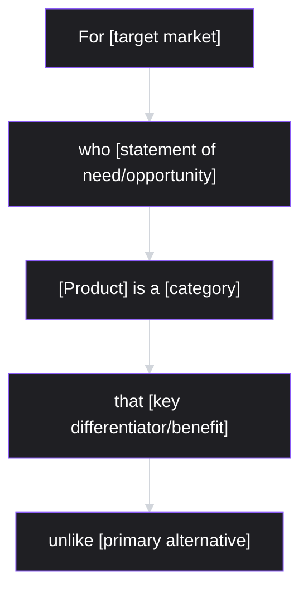
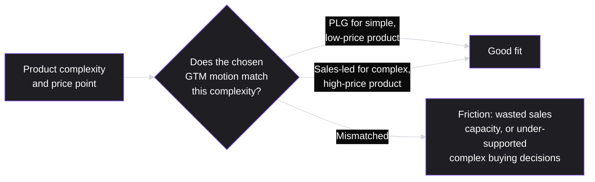
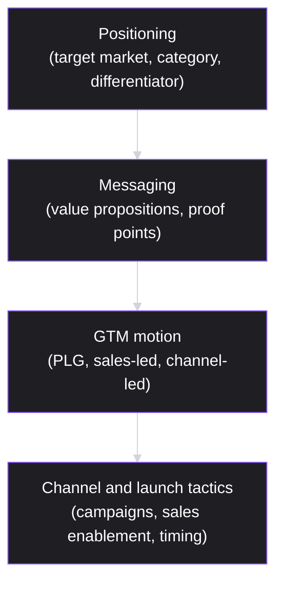

# Lesson 49: Go-To-Market Strategy

## Why This Lesson Matters

Lesson 36 taught you how to launch a feature safely within an existing product — staged rollouts, feature flags, launch tiers, cross-functional readiness checklists. Lesson 48 taught you how to price and package what you've built. This lesson connects those threads into something broader: how an entire product, or a significant new capability, actually reaches its intended market and finds its first real customers. Go-to-market (GTM) strategy is the discipline of deciding not just *that* something is ready to ship, but *how* it will be positioned, to whom, through which channels, and via what underlying sales or adoption motion — decisions that determine whether genuinely good product work ever finds the audience it deserves.

This lesson matters because a mismatched go-to-market strategy is one of the most common ways strong products fail commercially despite being technically excellent. A product built for simple, fast, self-serve adoption but sold through a slow, high-touch enterprise sales process will frustrate the customers who wanted the former and underwhelm the sales team expecting the latter. A product genuinely suited to a complex, considered enterprise sale but launched with a lightweight, self-serve motion will struggle to build the trust and customization such a purchase decision requires. This lesson gives you the vocabulary and structural tools to match a product's actual nature to the go-to-market motion that will actually work for it.

---

## Learning Path

| Field | Detail |
|---|---|
| **Module** | 5 — Metrics, Experimentation & Growth |
| **Current Lesson** | 49 of 90 |
| **Difficulty** | 5 / 10 |
| **Estimated Study Time** | 35 minutes (reading) + 15 minutes (reflection + quiz) |
| **Prerequisites** | Lesson 36 (Release Planning & Launch Management — launch tiers), Lesson 48 (Pricing & Monetization Strategy) |
| **Next Lesson** | Lesson 50 — Product-Led Growth |
| **Future Topics Unlocked** | Lesson 50 (Product-Led Growth, which develops one specific GTM motion in depth), Lesson 51 (Communicating with Executives), Lesson 59 (International & Localization Considerations) — all build on the positioning and motion-selection concepts introduced here |

---

## Learning Objectives

By the end of this lesson, you will be able to:

1. Construct a positioning statement using a standard positioning framework, distinguishing target market, category, and differentiation.
2. Compare product-led, sales-led, and channel/partner-led go-to-market motions, and identify which best fits a given product's price point and buying complexity.
3. Explain why mismatching a product's actual complexity and price point to an unsuited GTM motion undermines both customer experience and commercial outcomes.
4. Extend Lesson 36's launch tiering and readiness checklist to a full go-to-market launch involving marketing, sales, and external communication.
5. Diagnose a go-to-market failure by distinguishing a genuine product problem from a positioning, channel, or motion mismatch.

---

## Prerequisites

This lesson assumes **Lesson 36's** launch tiering and Launch Readiness Checklist, since a go-to-market launch is, in effect, the highest-tier version of the same cross-functional coordination challenge, extended beyond engineering and support into marketing, sales, and external communication. It also assumes **Lesson 48's** pricing and packaging concepts, since a product's go-to-market motion must align closely with its price point and packaging structure, not be decided independently of them.

---

## Theory

### Positioning: The Foundation Beneath Every GTM Decision

Before deciding how to launch something, a team needs to agree on what it actually *is*, relative to the market — this is **positioning**. A widely used positioning framework (adapted from Geoffrey Moore's work) structures this as a small number of specific claims:

Each element forces a specific, falsifiable claim: naming a precise target market (not "everyone"), naming the category the product will be understood against (since customers interpret new products by comparing them to something familiar), stating the single most important differentiator (not an exhaustive feature list), and explicitly naming the primary alternative being displaced. A positioning statement vague on any of these — an undefined target market, no clear category, a differentiator that's really just a feature list — tends to produce downstream confusion in messaging, sales conversations, and marketing, since every subsequent GTM decision implicitly depends on this foundational clarity.

### Three GTM Motions

A **go-to-market motion** describes the primary mechanism by which a product acquires and converts customers:

| Motion | How It Works | Best Fit |
|---|---|---|
| Product-led (PLG) | Users discover, try, and adopt the product largely on their own, often through a free trial or freemium tier, with minimal direct sales involvement | Low price point, low buying complexity, individual or small-team purchase decisions, product usable with minimal onboarding |
| Sales-led | A sales team actively engages prospects, builds a relationship, demonstrates value, and negotiates a deal, often over weeks or months | Higher price point, complex buying decisions involving multiple stakeholders, significant customization or integration needs |
| Channel/partner-led | Third-party partners (resellers, systems integrators, marketplaces) handle some or all of customer acquisition and relationship management | Products that benefit from bundling with complementary offerings, or markets where trusted intermediary relationships are essential to adoption |

These motions are not mutually exclusive — many mature companies run a hybrid, with a product-led motion serving smaller customers and a sales-led motion engaging larger enterprise accounts for the same underlying product, often called a "land and expand" or "PLG-plus-sales" hybrid strategy. What matters is that the chosen motion (or combination) actually matches the product's price point and buying complexity, rather than being chosen by organizational habit or founder preference alone.

### Why Motion-Product Mismatch Fails

The core risk this lesson addresses: applying the wrong motion to a given product creates friction on both sides of the transaction. A low-price, simple product forced through a slow, high-touch sales process frustrates prospects who expected (and whose price point justifies) a fast, self-serve path, while consuming expensive sales capacity on deals too small to justify the effort. A complex, high-price product pushed through a self-serve motion, with no direct human guidance, leaves prospects who need customization, security review, or stakeholder buy-in — support a self-serve flow can't provide — struggling to navigate a purchase decision the product's own complexity demands more structure for.

### Extending Launch Tiers to a Full GTM Launch

Recall Lesson 36's launch tiering system, which classified releases by potential impact and assigned proportional cross-functional coordination. A full go-to-market launch is, in effect, the highest tier of this same system, extended beyond Lesson 36's engineering-and-support-focused checklist to include marketing (messaging, campaign timing), sales (enablement materials, target account lists), and external communication (press, partner announcements, customer communication). The same underlying principle applies: the level of GTM coordination and ceremony should be proportional to the launch's actual significance, not applied uniformly regardless of scale — a minor feature update doesn't need a full GTM campaign, while a new product line or a significant repositioning very likely does.

---

## Common Beginner Mistakes

**Mistake 1: Writing a positioning statement so broad it could apply to almost any product**

A target market of "businesses" or a differentiator of "easy to use" fails to force the specific, falsifiable clarity this lesson's positioning framework requires, and produces downstream messaging that's equally vague and unpersuasive.

**Mistake 2: Choosing a GTM motion based on organizational habit rather than product fit**

A company with an established enterprise sales team may default to a sales-led motion for a new, simpler, lower-priced product line simply because that's the existing organizational muscle — even when the product's actual complexity and price point would be far better served by a product-led approach.

**Mistake 3: Treating every launch as warranting the same level of GTM ceremony**

Echoing Lesson 36's launch tiering caution directly: applying a full marketing-and-sales campaign to a minor update wastes organizational effort, while under-investing GTM coordination for a genuinely significant new product risks a confused, poorly-supported market entry.

**Mistake 4: Assuming a GTM failure means the product itself is flawed**

A product can be genuinely excellent while failing commercially due to unclear positioning, a mismatched motion, or poor channel choice — diagnosing which layer actually failed (product, positioning, motion, or channel) is essential before concluding the underlying product needs to change.

**Mistake 5: Designing positioning and messaging without direct input from the sales or customer-facing teams who will actually use it in conversations**

Positioning developed in isolation, without testing whether it holds up in real customer conversations, risks sounding coherent internally while falling flat or generating confused reactions in actual market interactions.

---

## Mental Model: The Positioning Pyramid

This lesson's core takeaway tool visualizes how a foundational positioning claim should cascade down into progressively more specific, tactical GTM decisions — each layer depending on the one above it being genuinely clear:

Use the Positioning Pyramid as a standing diagnostic whenever a GTM effort feels unfocused or a launch underperforms: trace the confusion upward, layer by layer, rather than only troubleshooting at the tactical bottom. A confused campaign is often actually a symptom of unclear messaging; unclear messaging is often actually a symptom of vague positioning — fixing the top of the pyramid frequently resolves problems that appear, at first glance, to live much further down.

---

## Real Company Example

**Dropbox**'s referral program is a more concretely documented illustration of engineered, product-led go-to-market than a general "word-of-mouth adoption" claim. Rather than relying on organic referrals happening by chance, Dropbox built referrals directly into the product mechanic: both the referring user and the new signup received additional free storage, giving existing users a direct, immediate incentive to invite others — turning growth into something the product itself produced, not something layered on top of it through separate marketing spend. Dropbox's own 2018 S-1 registration statement, filed with the SEC ahead of its IPO, explicitly names word-of-mouth referrals as central to its brand and user acquisition, and flags user dissatisfaction as a direct risk to that referral engine — a rare instance of a company's own regulatory filing, not just a case-study retelling, confirming how load-bearing the mechanic was to the business.

The instructive point for this lesson is the mechanism, not just the outcome: this was a deliberately engineered incentive built into the product's core loop, matched to a genuinely low-friction, low-price, individually-adoptable product — GTM motion fit to product reality, exactly this lesson's core argument — rather than a GTM motion that would work independent of what was actually being sold.

*(Source: Dropbox's own S-1 registration statement, filed with the SEC in February 2018. This curriculum does not claim certainty about the referral program's exact quantitative impact, since third-party retellings of the specific growth percentages vary and are not independently verifiable against a single authoritative figure.)*

The underlying principle connects directly to this lesson's Theory: Dropbox's referral mechanic matched its early product reality — low friction to try, individually adoptable, low or no initial price point — and a product-led motion built around a mechanic like this only works because it fits those conditions; a complex, high-price, committee-purchased enterprise product would need a fundamentally different GTM motion to reach the same buyers, not a referral incentive layered on top of an unsuited product.

---

## Real World Perspective: Go-To-Market Strategy at Different Company Stages

**At a startup:**
GTM strategy is often simple by necessity — limited resources typically force a choice between a lightweight, product-led motion or a small, founder-led sales effort, rather than supporting multiple parallel motions. The risk here is Mistake 2's mirror image: a founding team with a sales background may default to a sales-led motion even for a product whose price point and complexity would actually be better served by product-led adoption, simply because that's the skill set already present.

**At a mid-size company:**
This is typically the stage where hybrid motions (PLG for smaller accounts, sales-led for larger ones) become genuinely valuable and organizationally feasible, echoing Slack's evolution — and where positioning discipline (the framework from this lesson's Theory) becomes worth formalizing, since messaging now needs to stay consistent across a growing marketing team, sales team, and expanding product line.

**At Big Tech:**
GTM strategy is often highly sophisticated, with dedicated product marketing functions responsible for positioning, multiple parallel motions serving different segments and product lines simultaneously, and rigorous coordination (echoing Lesson 36's launch tiers, extended to full GTM scale) across many teams for major launches. The PM's job shifts toward partnering effectively with product marketing and sales leadership to ensure GTM decisions remain grounded in genuine product fit rather than organizational momentum alone.

---

## Detailed Case Study: The Enterprise Sales Team Selling a Self-Serve Product

Consider a simplified, illustrative scenario common at companies expanding into a new, lower-price product line without adjusting their existing GTM motion.

A company with an established, successful high-touch enterprise sales motion — serving a complex, expensive core product with a months-long sales cycle involving multiple stakeholders — launches a new, much simpler, lower-priced product aimed at smaller teams, with genuinely low buying complexity: it can be evaluated and adopted by a single team lead within days. Following existing organizational habit, the company routes this new product through the same sales-led motion used for its core offering, assigning it to the same sales team and sales process.

Results are disappointing on both sides: prospective customers, expecting a fast, self-serve evaluation given the product's low price and simplicity, are frustrated by being routed into a multi-week sales process involving calls and demos that feel disproportionate to the purchase decision at hand, and many simply abandon the process rather than continue engaging with a mismatched sales cycle. Meanwhile, the sales team, evaluated on deal size and quota attainment calibrated to the much larger core product, deprioritizes the smaller, lower-value new product deals in favor of higher-value opportunities, meaning even the prospects willing to engage receive inconsistent, low-priority attention.

**What went wrong?**

Using the Positioning Pyramid and the motion-fit reasoning from Theory: the underlying product may have been genuinely well-built and well-positioned in terms of its target market and differentiation, but the GTM motion chosen for it — inherited from organizational habit rather than genuine fit assessment — was mismatched to its actual price point and buying complexity. This is a textbook illustration of Mistake 2 and Mistake 4 combined: the disappointing results could easily have been misread as evidence the *product* was flawed, when the more accurate diagnosis was a motion mismatch layered on top of a fundamentally sound product.

The corrective response required building a genuinely product-led motion for the new offering — self-serve trial, in-product onboarding, and a lightweight, low-friction purchase path — decoupled from the existing enterprise sales team's process and incentives entirely, rather than attempting to force the new product through infrastructure built for a fundamentally different kind of purchase decision. Diagnosing this kind of layered failure — product versus positioning versus motion versus channel — before concluding what actually needs to change is the specific analytical discipline this lesson's Framework Explanation formalizes below.

---

## Framework Explanation: The GTM Failure Diagnosis Table

A second, more tactical tool: when a launch or ongoing GTM effort underperforms, use this table to identify which specific layer is actually responsible before prescribing a fix.

| Layer | Diagnostic Question | Signal This Layer Is the Problem |
|---|---|---|
| Product | Do users who actually try the product report genuine value and continued usage? | Poor retention/engagement even among users who complete onboarding — a product problem |
| Positioning | Do prospects understand what the product is and why it's different, once they engage? | Confused or inconsistent descriptions of the product from prospects and even internal teams |
| Motion | Does the buying process match the product's actual price point and complexity? | High abandonment specifically during a mismatched sales/evaluation process, as in this lesson's Case Study |
| Channel | Is the product reaching the intended target market at all, through the chosen channels? | Low overall awareness or reach within the actual target segment, regardless of product or positioning quality |

A team that jumps straight to "fix the product" without working through this table risks investing significant engineering effort addressing a problem that was never actually about the product itself — precisely the misdiagnosis illustrated in this lesson's Case Study.

---

## Interview Perspective: How Interviewers Think About This

**Typical question 1: "How would you decide on a go-to-market motion for a new product?"**
*What the interviewer is actually evaluating:* Whether the candidate reasons from the product's actual price point and buying complexity (echoing the motion-fit table) rather than defaulting to whatever motion the candidate's own background or the company's existing infrastructure happens to favor.

**Typical question 2: "A product launch underperformed. How would you figure out why?"**
*What the interviewer is actually evaluating:* Whether the candidate's diagnostic process distinguishes product, positioning, motion, and channel as separate potential failure layers, rather than jumping immediately to "the product must be wrong."

**Typical question 3: "Write a one-sentence positioning statement for a product you know well."**
*What the interviewer is actually evaluating:* Whether the candidate can produce the specific, falsifiable elements this lesson's positioning framework requires — precise target market, category, and differentiator — rather than a vague, marketing-brochure-style sentence that could describe almost any product.

---

## Summary

Go-to-market strategy determines how a product actually reaches its intended market, built on a foundation of clear positioning — a specific, falsifiable statement of target market, category, and differentiation — that cascades down through messaging into the choice of GTM motion (product-led, sales-led, or channel/partner-led) and finally into specific launch tactics, as this lesson's Positioning Pyramid illustrates. Choosing among these motions requires matching the product's actual price point and buying complexity to the motion's inherent characteristics, since a mismatch — a simple, low-price product forced through a high-touch sales process, or a complex, high-price product pushed through an unsupported self-serve flow — creates friction that can easily be misdiagnosed as a product failure rather than the motion mismatch it actually is, precisely the failure illustrated in this lesson's Case Study of an enterprise sales team struggling to sell a fundamentally self-serve product. A full go-to-market launch extends Lesson 36's launch tiering principle beyond engineering and support into marketing, sales, and external communication, with ceremony scaled proportionally to the launch's actual significance. When a GTM effort underperforms, a disciplined diagnosis — checking product, positioning, motion, and channel separately — is essential before concluding what actually needs to change.

---

## Key Takeaways

- A positioning statement should force specific, falsifiable clarity on target market, category, and differentiator — vagueness here produces downstream confusion in every subsequent GTM decision.
- The three core GTM motions — product-led, sales-led, and channel/partner-led — each fit different combinations of price point and buying complexity; many mature companies run a hybrid across different segments.
- Mismatching a product's actual complexity and price point to an unsuited GTM motion creates friction on both sides of the transaction, and can easily be misdiagnosed as a product failure.
- A full go-to-market launch extends Lesson 36's launch tiering principle beyond engineering and support to marketing, sales, and external communication, with ceremony scaled to actual significance.
- Diagnosing a GTM failure requires distinguishing product, positioning, motion, and channel as separate potential failure layers, using the GTM Failure Diagnosis Table, rather than assuming the product itself is flawed.
- GTM motion should be chosen based on genuine product-market fit reasoning, not organizational habit or the existing skill set of a company's sales or marketing teams.
- Positioning and messaging should be tested against real customer-facing conversations (sales, support) rather than developed in isolation and assumed to hold up in practice.

---

## Cheat Sheet

*A two-minute review of everything in this lesson.*

- **Positioning framework:** target market, category, differentiator, primary alternative — specific and falsifiable, not vague.
- **Three motions:** product-led (low price/complexity), sales-led (high price/complexity), channel-led (intermediary-dependent markets).
- **Match motion to product:** mismatch creates friction easily misread as a product problem.
- **Positioning Pyramid:** positioning → messaging → motion → tactics; trace confusion upward, not just at the bottom.
- **Extend launch tiers to GTM:** ceremony proportional to actual launch significance, across marketing/sales/comms too.
- **GTM Failure Diagnosis Table:** check product, positioning, motion, and channel separately before prescribing a fix.
- **Test positioning in real conversations:** don't develop it in isolation from the people who'll actually use it.

---

## Glossary

| Term | Definition | Related Concepts | Difficulty |
|---|---|---|---|
| Positioning | A specific, falsifiable claim about a product's target market, category, and differentiator relative to alternatives | Positioning Pyramid | 1 |
| Go-to-market (GTM) motion | The primary mechanism by which a product acquires and converts customers: product-led, sales-led, or channel-led | Motion-product fit | 1 |
| Product-led (PLG) motion | A GTM motion where users discover and adopt a product largely on their own, with minimal direct sales involvement | Sales-led motion | 1 |
| Sales-led motion | A GTM motion where a sales team actively engages, demonstrates value to, and negotiates with prospects | Product-led motion | 1 |
| Positioning Pyramid | This lesson's mental model: positioning cascading down through messaging, motion, and tactics | Positioning | 2 |
| GTM Failure Diagnosis Table | A tool distinguishing product, positioning, motion, and channel as separate potential causes of GTM underperformance | Motion-product fit | 2 |

---

## Further Reading / Resources

- *Crossing the Chasm* by Geoffrey Moore — the foundational text on positioning and market segmentation referenced in this lesson's positioning framework.
- *Obviously Awesome: How to Nail Product Positioning* by April Dunford — a widely used, practitioner-oriented treatment of the positioning framework applied in this lesson.
- *The Sales Acceleration Formula* by Mark Roberge — background on sales-led motion design and its fit with specific product and pricing characteristics.

---

## Flashcards

**Card 1**
- Front: What four elements does this lesson's positioning framework require?
- Back: A specific target market, a category the product is understood against, the key differentiator/benefit, and the primary alternative being displaced.
- Difficulty: 1
- Tags: positioning-framework

**Card 2**
- Front: Name the three core GTM motions.
- Back: Product-led (PLG), sales-led, and channel/partner-led.
- Difficulty: 1
- Tags: gtm-motions

**Card 3**
- Front: What determines which GTM motion best fits a given product?
- Back: The product's actual price point and buying complexity — low price/complexity favors product-led, high price/complexity favors sales-led, intermediary-dependent markets favor channel-led.
- Difficulty: 2
- Tags: motion-fit

**Card 4**
- Front: Why can a GTM motion mismatch be easily misdiagnosed as a product failure?
- Back: Friction from a mismatched motion (e.g., a simple product forced through a slow sales process) produces disappointing results that look like poor product-market fit, when the actual cause is the motion, not the product itself.
- Difficulty: 2
- Tags: misdiagnosis

**Card 5**
- Front: What does the Positioning Pyramid illustrate?
- Back: Positioning cascades down into messaging, then GTM motion, then specific launch tactics — confusion at a lower layer is often actually caused by unclear positioning at the top.
- Difficulty: 2
- Tags: positioning-pyramid

**Card 6**
- Front: In the Detailed Case Study, why did routing a simple, low-price product through an enterprise sales motion fail?
- Back: Prospects expecting a fast, self-serve evaluation were frustrated by a disproportionate multi-week sales process, while the sales team, incentivized around larger deals, deprioritized the smaller opportunities.
- Difficulty: 2
- Tags: case-study

## Reflection Exercise

Consider the following novel scenario: You're a PM launching a new, moderately-priced product feature that requires some technical integration work by the customer but can ultimately be self-served by a technically capable user without direct sales involvement, though a small number of prospects have asked detailed integration questions your current documentation doesn't fully answer.

There is no single correct answer to the prompts below — the goal is to practice applying the motion-fit and diagnosis frameworks, not to reach one "right" answer.

1. Using the motion-fit reasoning, would you recommend a pure product-led motion, a pure sales-led motion, or some hybrid for this specific product? Justify your answer.
2. Draft a one-sentence positioning statement for this feature using this lesson's framework (target market, category, differentiator, primary alternative).
3. If early adoption numbers are disappointing, how would you use the GTM Failure Diagnosis Table to figure out whether the problem is the product, the positioning, the motion, or the channel?
4. What launch tier (echoing Lesson 36) would you assign this launch, and what cross-functional coordination would that imply?
5. How would you test your positioning statement's clarity before finalizing broader marketing messaging around it?

---

## Quiz

**1. What four elements does this lesson's positioning framework require?**
A) Price, features, competitors, and reviews
B) Target market, category, differentiator, and primary alternative
C) Sales team size, marketing budget, launch date, and channel partners
D) Only a single tagline with no further detail

*Correct answer: B*
*Explanation: The Theory section's positioning framework explicitly requires these four elements.*
*Learning objective tested: #1*
*Difficulty: Easy*

---

**2. What are the three core GTM motions covered in this lesson?**
A) Now, Next, Later
B) Product-led, sales-led, channel/partner-led
C) Input, action, output
D) Discover, define, develop

*Correct answer: B*
*Explanation: The Theory section explicitly names these three motions.*
*Learning objective tested: #2*
*Difficulty: Easy*

---

**3. Which GTM motion is generally best suited to a low price point, low buying complexity product?**
A) Sales-led
B) Product-led (PLG)
C) Channel/partner-led exclusively
D) No motion is appropriate for low-price products

*Correct answer: B*
*Explanation: The Theory section's motion table identifies product-led as best fitting low price point, low complexity products.*
*Learning objective tested: #2*
*Difficulty: Easy*

---

**4. Why does mismatching a product's complexity to an unsuited GTM motion create friction on both sides of a transaction?**
A) It doesn't; motion choice has no effect on customer or sales experience
B) A simple product forced into a slow, high-touch process frustrates prospects expecting speed, while a complex product pushed through self-serve leaves prospects needing guidance unsupported
C) Because GTM motions are legally required to match price point exactly
D) Because only sales-led motions can ever create friction

*Correct answer: B*
*Explanation: The Theory section explains both directions of this friction explicitly.*
*Learning objective tested: #3*
*Difficulty: Easy*

---

**5. How does this lesson extend Lesson 36's launch tiering system?**
A) It replaces launch tiering with an entirely different framework
B) It extends the same proportional-ceremony principle beyond engineering and support to marketing, sales, and external communication for a full GTM launch
C) It argues launch tiering should no longer apply to any launches
D) It restricts launch tiering to only apply to sales teams

*Correct answer: B*
*Explanation: The Theory section explicitly describes a full GTM launch as an extension of Lesson 36's tiering principle to additional functions.*
*Learning objective tested: #4*
*Difficulty: Easy*

---

**6. In the Detailed Case Study, why was it a mistake to route the new, lower-priced product through the existing enterprise sales motion?**
A) The enterprise sales team refused to work on the new product entirely
B) The product's actual price point and buying complexity were far better suited to a self-serve, product-led motion, and the mismatch frustrated prospects and led sales to deprioritize the smaller deals
C) The product itself was fundamentally broken and unusable
D) The company had no sales team at all

*Correct answer: B*
*Explanation: The Case Study explicitly attributes the failure to motion mismatch, not a flaw in the underlying product.*
*Learning objective tested: #3, #5*
*Difficulty: Easy*

---

**7. What did the corrective response in the Case Study involve?**
A) Discontinuing the new product entirely
B) Building a genuinely product-led motion for the new offering — self-serve trial, in-product onboarding, a lightweight purchase path — decoupled from the existing enterprise sales process
C) Doubling the size of the existing enterprise sales team
D) Raising the new product's price to match the core product's price point

*Correct answer: B*
*Explanation: The Case Study explicitly describes this corrective response.*
*Learning objective tested: #3, #5*
*Difficulty: Medium*

---

**8. Using the GTM Failure Diagnosis Table, what signal specifically points to a "motion" problem rather than a "product" problem?**
A) Poor retention among users who complete onboarding
B) High abandonment specifically during a mismatched sales or evaluation process, even though users who do engage with the product find genuine value
C) Low overall awareness within the target segment
D) Confused or inconsistent descriptions of the product from prospects

*Correct answer: B*
*Explanation: The Framework Explanation section's diagnosis table identifies this specific signal as pointing to a motion problem.*
*Learning objective tested: #5*
*Difficulty: Medium*

---

**9. Why does this lesson caution against writing an overly broad positioning statement (e.g., target market of "businesses")?**
A) Because broad positioning statements are illegal in marketing
B) Because vagueness at the positioning level cascades downward, producing equally vague and unpersuasive messaging and GTM tactics, per the Positioning Pyramid
C) Because broad positioning always produces higher conversion rates
D) Because positioning statements should never mention a target market at all

*Correct answer: B*
*Explanation: Common Beginner Mistake #1 and the Positioning Pyramid both explain this cascading effect of vague positioning.*
*Learning objective tested: #1*
*Difficulty: Medium*

---

**10. Why did Slack's early go-to-market approach, as described in this lesson's Real Company Example, rely primarily on a product-led motion?**
A) Because product-led motions are always superior to sales-led motions in every context
B) Because it matched the product's early reality: low friction to try, individual/small-team adoption, and low initial price point
C) Because the company had no access to any sales talent at the time
D) Because sales-led motions were not yet invented

*Correct answer: B*
*Explanation: The Real Company Example explains that the early motion matched the product's actual characteristics at that stage, consistent with this lesson's fit principle.*
*Learning objective tested: #2, #3*
*Difficulty: Medium*

---

**11. (Interview Reasoning) A candidate is asked how they'd choose a GTM motion for a new product, and answers: "I'd use a sales-led motion, since that's what our company has always done." Based on this lesson's Interview Perspective section, what is the weakness in this answer?**
A) There is no weakness; consistency with existing infrastructure should always be the deciding factor
B) It defaults to organizational habit rather than reasoning from the specific product's price point and buying complexity, risking the exact mismatch illustrated in this lesson's Case Study
C) It correctly demonstrates strong organizational alignment
D) It shows appropriate deference to the existing sales team's expertise

*Correct answer: B*
*Explanation: The Interview Perspective section states that a strong answer reasons from product fit, not organizational habit, exactly the distinction this answer fails to make.*
*Learning objective tested: #2, #5*
*Difficulty: Hard*

---

**12. Why does this lesson recommend testing positioning against real customer-facing conversations before finalizing broader messaging?**
A) Because positioning developed in isolation risks sounding coherent internally while falling flat or confusing people in actual market interactions
B) Because customer-facing teams are legally required to approve all positioning statements
C) Because testing positioning is only relevant for channel-led motions
D) Because real conversations always produce worse positioning than internal brainstorming

*Correct answer: A*
*Explanation: Common Beginner Mistake #5 explains this exact risk of untested, isolation-developed positioning.*
*Learning objective tested: #5*
*Difficulty: Medium-Hard*

---

**13. (Product Thinking) A product launch shows strong initial awareness and trial signups, but very few trial users convert to paying customers, and those who do convert report strong satisfaction. Using the GTM Failure Diagnosis Table, what layer does this pattern most likely point to?**
A) Channel — since awareness and trial signups are strong, the product is clearly reaching its target market and channel is not the primary issue
B) Motion — the specific conversion step from trial to paid may not match how this product's buying decision actually needs to be supported, even though the product itself and its reach are working
C) Product — since the product is clearly the entire problem
D) Positioning — since positioning has nothing to do with conversion rates

*Correct answer: B*
*Explanation: Strong reach (channel) and clear product value among converters (not primarily a product problem) combined with poor trial-to-paid conversion points toward the motion — how the purchase decision itself is being supported — as the most likely bottleneck.*
*Learning objective tested: #5*
*Difficulty: Hard*

---

**14. Which of the following best reflects a well-constructed positioning statement, per this lesson's framework?**
A) "Our product is easy to use and helps businesses succeed."
B) "For small marketing teams struggling to coordinate multi-channel campaigns, [Product] is a campaign orchestration tool that automates cross-channel scheduling, unlike generic project management tools that require manual coordination."
C) "Our product has more features than any competitor."
D) "Our product is for everyone who wants to be more productive."

*Correct answer: B*
*Explanation: Option B specifies a precise target market, a category, a clear differentiator, and a named primary alternative — exactly the structure this lesson's positioning framework requires, unlike the vague alternatives.*
*Learning objective tested: #1*
*Difficulty: Medium-Hard*

---

**15. (Product Thinking, Highest Difficulty) A company has successfully used a product-led motion for its core, low-price product, and is now launching a new, significantly more complex and expensive add-on aimed at large enterprise customers with multiple stakeholders in the buying decision. Using this lesson's frameworks, what is the most defensible GTM approach?**
A) Continue using the exact same product-led, self-serve motion for the new add-on, since it worked well for the core product
B) Recognize that the new add-on's price point and buying complexity likely warrant a different motion (sales-led, or a hybrid), rather than assuming the core product's successful motion will automatically transfer to a fundamentally different offering — echoing the same fit principle illustrated by Slack's own evolution and this lesson's Case Study
C) Avoid launching the add-on at all, since introducing any new motion is inherently too risky
D) Use a channel-led motion exclusively, regardless of whether trusted intermediary relationships are actually relevant to this specific market

*Correct answer: B*
*Explanation: This applies the lesson's core fit principle correctly — motion should match the specific product's price point and complexity, not be assumed to transfer automatically from a different product within the same company, mirroring both the Case Study's failure and Slack's own real evolution toward a hybrid motion as its offerings diversified.*
*Learning objective tested: #2, #3, #5*
*Difficulty: Hard*

---

## Connections

| | Lesson | Core Idea Carried Forward |
|---|---|---|
| **Previous Lesson** | Lesson 48 — Pricing & Monetization Strategy | GTM motion selection depends directly on the pricing and packaging decisions established in Lesson 48 |
| **Current Lesson** | Lesson 49 — Go-To-Market Strategy | Positioning framework; Positioning Pyramid; GTM motions; motion-product fit; GTM Failure Diagnosis Table |
| **Next Lesson** | Lesson 50 — Product-Led Growth | Develops the product-led motion introduced here in much greater depth |
| **Future Concepts Unlocked** | Lesson 51 (Communicating with Executives) | Builds on positioning discipline when communicating strategic narratives upward |
| | Lesson 59 (International & Localization Considerations) | Extends GTM motion and channel reasoning to international market entry |

This curriculum is designed to be read as one continuous argument, not ninety independent articles. Every lesson from here forward will assume you carry the positioning framework and GTM motion-fit reasoning with you — they will not be re-explained, only re-applied in new contexts.
