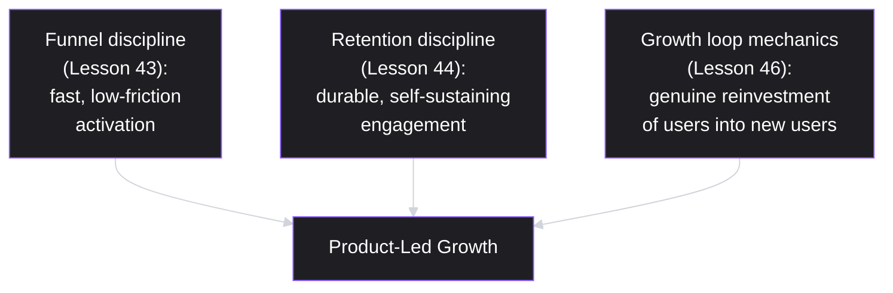
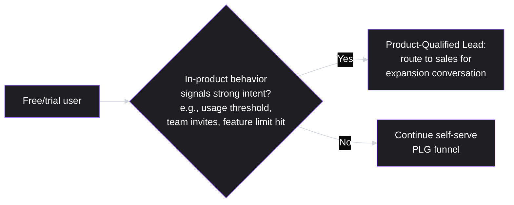
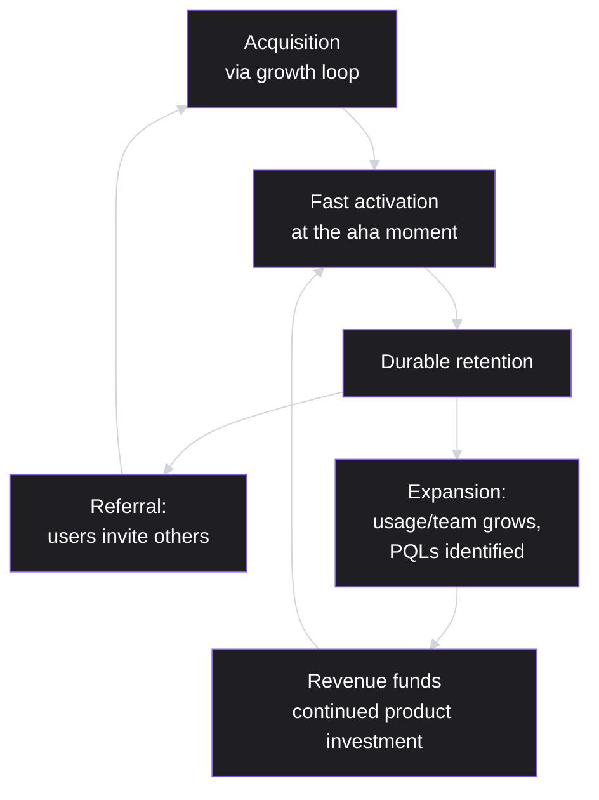
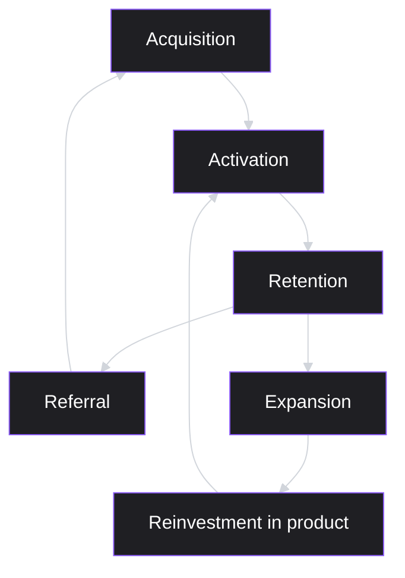

# Lesson 50: Product-Led Growth

## Why This Lesson Matters

This lesson closes Module 5 by integrating nearly everything the module has taught into a single, coherent growth strategy. Product-led growth (PLG) is not a new concept introduced from scratch here — it is the deliberate combination of the funnel discipline from Lesson 43, the retention discipline from Lesson 44, the growth loop mechanics from Lesson 46, and the go-to-market motion selection from Lesson 49, applied specifically to a strategy where the product itself, rather than a sales team or marketing campaign, does the primary work of acquiring, converting, and retaining customers.

This lesson matters because PLG has become one of the most discussed, and most frequently misapplied, strategies in modern product management. Many teams adopt PLG language and tactics — a free trial, a freemium tier, in-product prompts — without the underlying product characteristics that actually make product-led growth work, producing the appearance of a PLG strategy without its substance. This lesson gives you the specific prerequisites a product must genuinely satisfy for PLG to succeed, and the integrated flywheel model for understanding how PLG's component parts reinforce each other when it does.

---

## Learning Path

| Field | Detail |
|---|---|
| **Module** | 5 — Metrics, Experimentation & Growth |
| **Current Lesson** | 50 of 90 |
| **Difficulty** | 5 / 10 |
| **Estimated Study Time** | 35 minutes (reading) + 15 minutes (reflection + quiz) |
| **Prerequisites** | Lesson 43 (Funnel Analysis), Lesson 44 (Cohort & Retention Analysis), Lesson 46 (Growth Loops & Virality), Lesson 49 (Go-To-Market Strategy — product-led motion) |
| **Next Lesson** | Lesson 51 — Communicating with Executives (opens Module 6) |
| **Future Topics Unlocked** | Lesson 51 (Communicating with Executives), Lesson 55 (Building and Leading Product Teams), Lesson 58 (AI in Product Management) — all reference the PLG flywheel and PQL concepts introduced here |

---

## Learning Objectives

By the end of this lesson, you will be able to:

1. Explain product-led growth as an integration of funnel, retention, and growth loop disciplines, rather than a standalone tactic.
2. Apply a PLG readiness checklist to determine whether a given product genuinely satisfies the prerequisites for a product-led motion.
3. Distinguish a product-qualified lead (PQL) from a marketing- or sales-qualified lead, and explain how PQL scoring supports a hybrid PLG-plus-sales motion.
4. Construct a PLG flywheel connecting acquisition, activation, retention, referral, and expansion into a single reinforcing system.
5. Diagnose a premature or poorly-fitted PLG strategy, distinguishing genuine product-led potential from a product that merely has PLG-style tactics layered on top of it.

---

## Prerequisites

This lesson assumes fluency with **Lesson 43's** funnel and activation concepts, **Lesson 44's** retention and cohort discipline, and **Lesson 46's** growth loop structure (input, action, output, reinvestment) and K-factor math, since PLG is best understood as these three disciplines operating together rather than as a separate topic. It also assumes **Lesson 49's** product-led motion definition, since this lesson develops that motion in the depth its central role in many modern software businesses warrants.

---

## Theory

### PLG as an Integration, Not a Standalone Tactic

**Product-led growth** describes a strategy where the product itself — not a sales team, not a marketing campaign — is the primary driver of customer acquisition, conversion, retention, and expansion. This definition is deliberately broader than "offering a free trial" or "having a freemium tier," which are common PLG *tactics* but not PLG itself. A product genuinely practicing PLG integrates several disciplines this module has already covered:

A product missing any one of these — a funnel with high friction to activation, weak underlying retention, or no genuine growth loop — cannot sustain product-led growth regardless of how many PLG-style tactics (free trials, in-product prompts) are layered on top, because those tactics only accelerate a system that must already be structurally sound in these three respects.

### The PLG Readiness Checklist

Before adopting a product-led strategy, a product should genuinely satisfy several prerequisites:

| Prerequisite | What It Requires | Risk If Missing |
|---|---|---|
| Fast time-to-value | A new user can experience genuine value within minutes or a single session, without extensive setup | Users abandon before ever reaching the "aha moment" that would justify continued use |
| Low initial complexity | The core value proposition doesn't require extensive configuration, integration, or training to access | Self-serve onboarding cannot substitute for the guidance a complex setup genuinely requires |
| Clear, identifiable "aha moment" | A specific, identifiable point where a new user first experiences the product's core value | Without a known activation signal, a team cannot optimize the funnel toward the moment that actually matters |
| Natural expansion path | Usage or team size naturally growing over time creates a credible path to increased value and willingness to pay | Without organic expansion, a PLG motion has no mechanism for growing revenue from an existing account over time |

A product failing several of these checks — particularly one requiring significant setup, configuration, or organizational buy-in before any value is realized — is very likely a poor fit for a pure product-led motion, regardless of how appealing PLG's growth economics might sound in the abstract.

### Product-Qualified Leads (PQLs)

In a traditional sales-led motion, a **marketing-qualified lead (MQL)** is someone who has engaged with marketing content, and a **sales-qualified lead (SQL)** is someone a sales team has vetted as a genuine prospect. A **product-qualified lead (PQL)** is a specific, PLG-native concept: a free or trial user whose in-product behavior signals strong buying intent or a natural fit for expansion — reaching a certain usage threshold, inviting several teammates, or hitting a feature limit that a paid tier would remove. PQL scoring allows a hybrid PLG-plus-sales motion (introduced in Lesson 49) to work efficiently: rather than a sales team cold-prospecting broadly, it can focus its limited capacity on free users whose actual in-product behavior already indicates strong intent and fit, dramatically improving the efficiency of that sales capacity compared to undifferentiated outbound effort.

### The PLG Flywheel

Integrating this module's components into a single system: a genuine PLG flywheel connects acquisition (often through a growth loop, Lesson 46), fast activation (Lesson 43's funnel discipline applied to a specific, identified aha moment), durable retention (Lesson 44), and both referral and expansion, with each stage's output feeding the next — new activated users generate referral loop input (per Lesson 46's reinvestment principle) and, over time, generate expansion revenue as their usage or team grows, which in turn funds continued product investment that improves activation and retention further, closing the loop.

---

## Common Beginner Mistakes

**Mistake 1: Adopting PLG tactics (free trial, freemium tier) without the underlying product prerequisites**

As covered in Theory, layering PLG-style tactics onto a product with slow time-to-value, high complexity, or no clear aha moment produces the appearance of a PLG strategy without the structural soundness needed for it to actually work.

**Mistake 2: Believing PLG means eliminating sales entirely**

As covered in Theory and Lesson 49, many successful PLG companies run a deliberate hybrid, using PQL scoring to direct sales capacity efficiently toward high-intent users rather than eliminating a sales function altogether.

**Mistake 3: Failing to identify a specific, measurable "aha moment," and instead treating activation vaguely**

Without a specific, identified activation signal, a team cannot optimize its funnel (Lesson 43) toward the moment that actually predicts long-term retention, and risks investing effort improving parts of the funnel that don't actually matter for downstream success.

**Mistake 4: Treating PLG as purely a growth/acquisition strategy, ignoring the retention component**

A PLG flywheel depends on durable retention (Lesson 44) to sustain referral and expansion — a product driving significant free signups without genuine retention will show impressive top-of-funnel numbers while the flywheel itself fails to spin, since churned users generate neither referrals nor expansion revenue.

**Mistake 5: Applying PLG uniformly across all customer segments, including ones better served by a sales-led motion**

Echoing Lesson 49's motion-fit principle directly: even within a successful PLG company, some segments (very large enterprise accounts with complex needs) may genuinely warrant a sales-led approach, and forcing every segment through the same self-serve motion risks under-serving the customers who need more support.

---

## Mental Model: The PLG Flywheel

*(Introduced above in the Theory section; restated here as this lesson's standalone takeaway tool, per curriculum convention.)*

Use the PLG Flywheel as a standing diagnostic whenever a PLG strategy underperforms: identify specifically which stage of the flywheel is weak — is acquisition strong but activation weak (a funnel problem, Lesson 43)? Is activation strong but retention weak (a cohort problem, Lesson 44)? Is retention strong but referral/expansion weak (a loop problem, Lesson 46)? A weak flywheel stage anywhere will eventually constrain the whole system's growth, regardless of how strong the other stages are, since each stage's output is the next stage's essential input.

---

## Real Company Example

**Notion** has been publicly associated, through its own product growth and community writing, with a strong product-led growth model built on fast individual time-to-value, a generous free tier enabling broad initial adoption, and organic team-based expansion — a single user's adoption within an organization frequently expanding, over time, into broader team or company-wide usage as that individual invites colleagues and shares templates — before eventually adding more structured offerings for larger organizations.

The underlying principle connects directly to this lesson's Theory: Notion's growth reflects the PLG Flywheel's structure closely — fast individual activation, genuine retention driving continued usage, and a natural expansion path (from individual to team to organization) providing the flywheel's referral and expansion stages, illustrating how a product satisfying this lesson's readiness checklist can sustain compounding, largely self-serve growth.

*(Assumption flagged: this reflects general, publicly available descriptions of Notion's product-led growth model discussed in company and industry writing over time, not a confirmed, complete, or current account of Notion's specific internal growth strategy or metrics today. Specific practices and their internal measurement evolve continuously at any company; the durable lesson is the underlying principle — genuine PLG requires fast activation, real retention, and a natural expansion path working together — rather than a claim about Notion's exact current growth mechanics.)*

---

## Real World Perspective: Product-Led Growth at Different Company Stages

**At a startup:**
PLG is often an attractive strategy precisely because it requires less upfront sales infrastructure investment, but the risk of Mistake 1 is especially high — a young company eager to grow quickly may adopt PLG tactics without first honestly assessing whether its product actually satisfies the readiness checklist's prerequisites, particularly fast time-to-value and a clear aha moment.

**At a mid-size company:**
This is typically the stage where a hybrid PLG-plus-sales motion becomes genuinely valuable, using PQL scoring to direct limited sales capacity efficiently, echoing both this lesson's Theory and Lesson 49's motion evolution — and where the flywheel's individual stages (acquisition, activation, retention, referral, expansion) typically become instrumented and monitored separately, rather than tracked only as an undifferentiated aggregate.

**At Big Tech:**
PLG strategies are often deeply sophisticated, with dedicated growth teams responsible for each flywheel stage, extensive experimentation (Lesson 45) on activation and expansion mechanics, and careful segmentation to apply PLG, hybrid, and pure sales-led motions to the appropriate customer segments simultaneously. The PM's job shifts toward correctly diagnosing which flywheel stage is the actual constraint on growth and prioritizing investment accordingly, rather than intuitively assuming acquisition is always the bottleneck.

---

## Detailed Case Study: The Free Trial That Never Found Its Aha Moment

Consider a simplified, illustrative scenario common at teams adopting PLG tactics without first validating the underlying readiness prerequisites.

A company selling a moderately complex data-integration product, historically sold through a sales-led motion, decides to add a free trial and self-serve signup flow to accelerate growth, reasoning that "PLG is what successful companies do now." The trial signup flow is well-designed and generates strong initial signup numbers. However, activation — defined loosely, without a specific identified milestone — never reaches meaningful levels: most trial users sign up, encounter the product's genuinely complex initial setup (connecting multiple data sources, configuring transformation rules), and abandon within the first session, never reaching any point where the product's core value becomes apparent.

Leadership initially interprets the strong signup numbers as evidence the PLG strategy is working, while the underlying trial-to-paid conversion rate remains far below what the sales-led motion had historically achieved for comparable prospects. Only after several quarters of disappointing conversion does a deeper analysis reveal that the product's genuine complexity — the very thing that had always justified a sales-led motion with hands-on onboarding support — was fundamentally incompatible with a self-serve trial experience, regardless of how polished the surrounding signup flow was.

**What went wrong?**

Using the PLG Readiness Checklist: this product failed at least two of the four prerequisites from the start — it lacked fast time-to-value (the setup required to reach any real value was extensive) and lacked low initial complexity (multi-source data integration is inherently involved). No amount of investment in the surrounding trial infrastructure (the signup flow, marketing messaging) could compensate for these fundamental mismatches, because PLG tactics accelerate an already-sound underlying system — they don't create soundness in a system that structurally lacks it, exactly the distinction this lesson's Theory establishes between PLG tactics and genuine PLG readiness.

The corrective response required recognizing that this specific product was likely better served by the hybrid motion Lesson 49 describes: retaining the free trial as a top-of-funnel lead generation and qualification tool (allowing prospects to explore and self-educate) while reintroducing a guided, sales-assisted onboarding process before genuine activation — rather than expecting a fully self-serve path to work for a product whose actual complexity had never changed. Using PQL-style behavioral signals (which trial users engaged deeply enough with initial setup steps to signal genuine intent) to route the right prospects to sales support, rather than either abandoning the trial entirely or leaving every trial user unsupported, is the specific hybrid design this lesson's Theory recommends for exactly this kind of situation.

---

## Framework Explanation: The Flywheel Stage Diagnostic

A second, more tactical tool: when a PLG strategy underperforms, use this table to identify which specific flywheel stage is the actual constraint.

| Flywheel Stage | Health Signal | If Weak, Investigate |
|---|---|---|
| Acquisition | Steady inflow of new trial/free signups | Growth loop mechanics (Lesson 46) or GTM channel effectiveness (Lesson 49) |
| Activation | High share of signups reaching the identified aha moment quickly | Funnel friction (Lesson 43) between signup and the specific activation milestone |
| Retention | Activated users showing a flattening retention curve over time (Lesson 44's Smile Curve) | Whether genuine, durable value is actually being delivered post-activation |
| Referral | A measurable, verified K-factor above the level needed to meaningfully supplement other acquisition | Whether the reinvestment step (Lesson 46) is genuinely occurring, not just assumed |
| Expansion | Growing usage or team size within existing accounts over time, with PQLs identified and converted | Whether a natural expansion path actually exists for this product, or was assumed without evidence |

A team investing broadly across "growth initiatives" without first using this table to identify the actual constraining stage risks spreading effort thin across stages that were never the real bottleneck, echoing this module's repeated caution (Lessons 43, 44, 46) against acting on assumption rather than diagnosed evidence.

---

## Interview Perspective: How Interviewers Think About This

**Typical question 1: "What makes a product a good fit for product-led growth?"**
*What the interviewer is actually evaluating:* Whether the candidate can articulate the specific readiness prerequisites (fast time-to-value, low complexity, clear aha moment, natural expansion path) rather than describing PLG purely in terms of surface tactics like free trials.

**Typical question 2: "How would you decide when a free/trial user should be handed off to sales?"**
*What the interviewer is actually evaluating:* Whether the candidate understands PQL scoring — using in-product behavioral signals to identify genuine intent — rather than either handing off every signup indiscriminately or never involving sales at all.

**Typical question 3: "A company's free trial signups are strong, but paid conversion is weak. What would you investigate?"**
*What the interviewer is actually evaluating:* Whether the candidate's diagnostic process moves through the flywheel stages systematically (acquisition looks fine; is activation, retention, or something else the actual constraint?) rather than assuming the whole strategy has simply failed.

---

## Summary

Product-led growth integrates the funnel discipline from Lesson 43, the retention discipline from Lesson 44, and the growth loop mechanics from Lesson 46 into a single strategy where the product itself drives acquisition, conversion, retention, and expansion — it is not simply the presence of a free trial or freemium tier, which are tactics that only work when layered onto a product genuinely satisfying this lesson's readiness prerequisites: fast time-to-value, low initial complexity, a clear identifiable aha moment, and a natural expansion path. Product-qualified leads (PQLs) — free or trial users whose in-product behavior signals strong intent — enable an efficient hybrid PLG-plus-sales motion, directing limited sales capacity toward genuinely high-intent prospects rather than eliminating sales altogether, extending Lesson 49's motion-fit reasoning. The PLG Flywheel connects acquisition, activation, retention, referral, and expansion into a single reinforcing system, and diagnosing an underperforming PLG strategy requires identifying which specific stage is the actual constraint — precisely the discipline this lesson's Case Study illustrates through a company that adopted PLG tactics for a product whose genuine complexity made self-serve activation fundamentally unachievable, regardless of how polished the surrounding trial experience was.

---

## Key Takeaways

- Product-led growth integrates funnel (Lesson 43), retention (Lesson 44), and growth loop (Lesson 46) disciplines into a single strategy — it is not simply the presence of a free trial or freemium tier.
- A genuine PLG strategy requires a product to satisfy specific prerequisites: fast time-to-value, low initial complexity, a clear identifiable aha moment, and a natural expansion path.
- PLG tactics accelerate an already-structurally-sound product; they cannot create soundness in a product that fundamentally lacks these prerequisites, as this lesson's Case Study demonstrates.
- Product-qualified leads (PQLs) use in-product behavioral signals to identify high-intent free/trial users, enabling an efficient hybrid PLG-plus-sales motion rather than eliminating sales entirely.
- The PLG Flywheel connects acquisition, activation, retention, referral, and expansion into a reinforcing system — a weak stage anywhere constrains the whole system's growth.
- Diagnosing an underperforming PLG strategy requires identifying the specific constraining flywheel stage, using the Flywheel Stage Diagnostic, rather than assuming the whole strategy has failed uniformly.
- Even within a successful PLG company, some customer segments may still genuinely warrant a sales-led motion — PLG doesn't need to be applied uniformly across every segment.

---

## Cheat Sheet

*A two-minute review of everything in this lesson.*

- **PLG = integration:** funnel discipline + retention discipline + genuine growth loops, not just a free trial.
- **Readiness checklist:** fast time-to-value, low initial complexity, clear aha moment, natural expansion path.
- **PLG tactics ≠ PLG readiness:** tactics accelerate a sound product; they don't fix a structurally mismatched one.
- **PQL:** in-product behavior signaling strong intent — enables efficient hybrid PLG-plus-sales.
- **PLG Flywheel:** acquisition → activation → retention → referral/expansion → reinvestment, each stage feeding the next.
- **Diagnose by stage:** identify which specific flywheel stage is the actual constraint before investing broadly.
- **Not one-size-fits-all:** even successful PLG companies may still need sales-led motion for certain segments.

---

## Glossary

| Term | Definition | Related Concepts | Difficulty |
|---|---|---|---|
| Product-led growth (PLG) | A strategy where the product itself is the primary driver of acquisition, conversion, retention, and expansion | PLG Flywheel | 1 |
| PLG readiness checklist | Prerequisites a product must satisfy for PLG to work: fast time-to-value, low complexity, clear aha moment, natural expansion path | Product-led growth | 2 |
| Product-qualified lead (PQL) | A free or trial user whose in-product behavior signals strong buying intent or fit for expansion | Hybrid PLG-plus-sales motion | 2 |
| PLG Flywheel | This lesson's mental model: acquisition, activation, retention, referral, and expansion reinforcing each other in a single system | Growth loop (Lesson 46) | 1 |
| Aha moment | A specific, identifiable point where a new user first experiences a product's core value | Activation (Lesson 43) | 2 |

---

## Further Reading / Resources

- *The Product-Led Growth Playbook* and related writing by Wes Bush / ProductLed — a widely referenced practitioner treatment of PLG readiness and flywheel mechanics.
- *Traction* by Gabriel Weinberg and Justin Mares — background on evaluating and matching growth strategy to product and market characteristics.
- OpenView Partners' "Product-Led Growth" research and PQL scoring frameworks — practitioner-oriented resources on hybrid PLG-plus-sales motion design.

---

## Flashcards

**Card 1**
- Front: What three disciplines does product-led growth integrate, per this lesson?
- Back: Funnel discipline (fast, low-friction activation), retention discipline (durable engagement), and growth loop mechanics (genuine reinvestment of users into new users).
- Difficulty: 1
- Tags: plg-integration

**Card 2**
- Front: What are the four prerequisites in the PLG Readiness Checklist?
- Back: Fast time-to-value, low initial complexity, a clear identifiable aha moment, and a natural expansion path.
- Difficulty: 1
- Tags: plg-readiness

**Card 3**
- Front: What is a product-qualified lead (PQL)?
- Back: A free or trial user whose in-product behavior (usage threshold, team invites, feature limit hit) signals strong buying intent or a natural fit for expansion.
- Difficulty: 2
- Tags: pql

**Card 4**
- Front: Why can't PLG tactics (free trial, freemium) fix a product that lacks the underlying readiness prerequisites?
- Back: Tactics accelerate an already-structurally-sound product; they cannot create fast time-to-value or low complexity in a product that is fundamentally complex or slow to deliver value.
- Difficulty: 2
- Tags: tactics-vs-readiness

**Card 5**
- Front: What are the five stages of the PLG Flywheel?
- Back: Acquisition, activation, retention, referral, and expansion — each stage's output feeds the next, with expansion revenue funding continued product investment that improves activation.
- Difficulty: 2
- Tags: plg-flywheel

**Card 6**
- Front: In the Detailed Case Study, why did the data-integration product's free trial fail to activate users, despite a well-designed signup flow?
- Back: The product's genuine complexity (multi-source data integration, configuration) meant it lacked fast time-to-value and low initial complexity — two PLG readiness prerequisites — which no amount of surrounding trial polish could fix.
- Difficulty: 2
- Tags: case-study

## Reflection Exercise

Consider the following novel scenario: You're a PM at a company considering adding a free tier to a product that currently requires a multi-week implementation process involving IT approval and custom configuration before most customers see any real value.

There is no single correct answer to the prompts below — the goal is to practice applying the PLG Readiness Checklist and Flywheel Stage Diagnostic, not to reach one "right" answer.

1. Using the PLG Readiness Checklist, score this product against each of the four prerequisites, and justify your scores.
2. Based on your scores, would you recommend a pure PLG motion, a hybrid PLG-plus-sales motion, or continuing with the existing sales-led motion? Justify your answer.
3. If you do proceed with some form of free tier, what specific in-product behavioral signals might indicate a PQL worth routing to sales, given this product's complexity?
4. What would "fast time-to-value" realistically look like for this product, even if full implementation genuinely takes weeks — is there a smaller, faster value moment that could be surfaced earlier?
5. If a free tier is launched and trial-to-paid conversion is disappointing, how would you use the Flywheel Stage Diagnostic to determine whether the problem is activation, retention, or something else?

---

## Quiz

**1. What does this lesson identify as the core definition of product-led growth?**
A) A standalone free trial or freemium tier
B) Product growth driven by the product itself
C) Eliminating sales and marketing outright
D) A pricing model based solely on per-seat fees

*Correct answer: B*
*Explanation: The Theory section defines PLG this way, distinguishing the underlying strategy from surface-level tactics like a free trial.*
*Learning objective tested: #1*
*Difficulty: Easy*

---

**2. What are the four prerequisites in the PLG Readiness Checklist?**
A) Low price, big budget, large team, broad features
B) High complexity, slow value, no expansion path
C) Fast value, low complexity, a clear aha moment, expansion
D) A freemium tier and a high viral coefficient

*Correct answer: C*
*Explanation: The Theory section lists exactly these four prerequisites as what a genuinely PLG-ready product must satisfy.*
*Learning objective tested: #2*
*Difficulty: Easy*

---

**3. What is a product-qualified lead (PQL)?**
A) A lead generated just through paid ads
B) A trial user with real intent
C) A synonym for a marketing-qualified lead
D) A contract that has already been signed

*Correct answer: B*
*Explanation: A PQL is defined by in-product behavior, not by which channel brought the user in or how far along a sales process they already are.*
*Learning objective tested: #3*
*Difficulty: Easy*

---

**4. How does PQL scoring support a hybrid PLG-plus-sales motion?**
A) Sales focus on high-intent users
B) It requires contacting every free user
C) It eliminates the need for any sales team
D) It bears no relation to sales efficiency

*Correct answer: A*
*Explanation: Scoring lets a small sales team spend its time on the free users most likely to convert, rather than treating every signup the same.*
*Learning objective tested: #3*
*Difficulty: Easy*

---

**5. What are the five stages of the PLG Flywheel?**
A) Discover, define, develop, deliver, done
B) Acquisition, activation, retention, referral, expansion
C) Now, next, later, shelved, and done
D) Input, action, output, reinvestment, decay

*Correct answer: B*
*Explanation: These five stages, feeding into one another, are what the Theory section names as the flywheel's structure.*
*Learning objective tested: #4*
*Difficulty: Easy*

---

**6. Why can't PLG tactics like a free trial fix a product that fundamentally lacks fast time-to-value?**
A) A tactic can't create readiness on its own
B) Free trials invariably fix underlying issues
C) Free trials are barred for complex products
D) Time-to-value has no bearing on conversion

*Correct answer: A*
*Explanation: A trial only shortens the path to a value that already has to exist within reach — it can't manufacture that value if genuine setup or complexity stands in the way.*
*Learning objective tested: #2, #5*
*Difficulty: Easy*

---

**7. In the Detailed Case Study, which two PLG readiness prerequisites did the data-integration product fail?**
A) Natural expansion path and a clear aha moment
B) PQL scoring and the referral loop's design
C) Fast time-to-value and the product complexity
D) Its pricing model and channel strategy

*Correct answer: C*
*Explanation: The setup the product genuinely required, and the inherent complexity of integrating multiple data sources, ruled both prerequisites out from the start.*
*Learning objective tested: #2, #5*
*Difficulty: Medium*

---

**8. What was the recommended corrective response in the Detailed Case Study?**
A) Ending the free trial outright, unchanged
B) Doubling the marketing budget for the trial
C) Keeping the trial, adding guided onboarding
D) Simplifying the product to match the trial

*Correct answer: C*
*Explanation: The trial stayed useful as a qualification signal, while guided, sales-assisted onboarding supplied the structure self-serve alone couldn't.*
*Learning objective tested: #5*
*Difficulty: Medium*

---

**9. Using the Flywheel Stage Diagnostic, if acquisition (signups) is strong but very few signups reach the identified aha moment, what should be investigated?**
A) Growth loop mechanics exclusively
B) Expansion revenue and PQL conversion
C) No concern; strong signups confirm health
D) Friction blocking the signup-to-activation flow

*Correct answer: D*
*Explanation: Strong entry into the funnel says nothing about what happens next, and this pattern points squarely at the step between signup and the specific activation milestone.*
*Learning objective tested: #5*
*Difficulty: Medium*

---

**10. Why does this lesson caution against treating PLG as purely an acquisition strategy while ignoring retention?**
A) Retention bears no relation to PLG here
B) Retention matters solely in sales-led motions
C) Acquisition invariably outweighs retention
D) Referral and expansion need users to stay

*Correct answer: D*
*Explanation: A flywheel spun by acquisition alone still needs retention to hand it forward — a user who churns produces neither a referral nor an expansion, whatever the signup numbers say.*
*Learning objective tested: #4*
*Difficulty: Medium*

---

**11. (Interview Reasoning) A candidate is asked what makes a product a good fit for PLG, and answers: "Any product can succeed with PLG if you add a free trial." Based on this lesson's Interview Perspective section, what is the weakness in this answer?**
A) None; a trial guarantees success for any product
B) It names the one true requirement for PLG
C) It skips the readiness prerequisites altogether
D) It shows strong understanding of PLG mechanics

*Correct answer: C*
*Explanation: A free trial only shortens the path to value that already exists; it cannot supply the fast value, low complexity, or clear aha moment a trial depends on to work.*
*Learning objective tested: #2, #5*
*Difficulty: Hard*

---

**12. Why does this lesson recommend against applying PLG uniformly across all customer segments, even within a successful PLG company?**
A) PLG isn't meant for any segment at all
B) PLG suits consumer products more than B2B
C) Uniform application invariably wins out
D) Segments may need sales help

*Correct answer: D*
*Explanation: A segment with genuinely different buying complexity can call for a different motion, the same fit principle Lesson 49 applied at the whole-product level, applied here within one company.*
*Learning objective tested: #5*
*Difficulty: Medium-Hard*

---

**13. (Product Thinking) A company's PLG metrics show strong acquisition and activation, and a flattening retention curve (a "smile" per Lesson 44), but very few users ever invite teammates or expand usage. Using the Flywheel Stage Diagnostic, what should be investigated?**
A) Referral and expansion mechanisms specifically
B) Acquisition channel effectiveness, clearly weak
C) No further check; retention confirms health
D) The pricing model alone, no other check

*Correct answer: A*
*Explanation: With acquisition, activation, and retention all reading healthy, the weak stage sits specifically at referral and expansion — worth checking directly rather than assumed.*
*Learning objective tested: #5*
*Difficulty: Hard*

---

**14. Which of the following best reflects a genuine PLG readiness assessment, rather than an assumption-based one?**
A) Checking against the prerequisites
B) Assuming readiness because competitors use PLG
C) Adding a trial, judging readiness quarters later
D) Assuming readiness from team enthusiasm alone

*Correct answer: A*
*Explanation: The other three each substitute something else — someone else's success, a trial's own results, or internal enthusiasm — for actually checking the product against the prerequisites first.*
*Learning objective tested: #2, #5*
*Difficulty: Medium-Hard*

---

**15. (Product Thinking, Highest Difficulty) A company has successfully run a pure PLG motion for its small-team customer segment for two years, and is now considering extending the exact same self-serve motion, unchanged, to a new enterprise segment with complex security, compliance, and customization requirements. Using this lesson's and Lesson 49's frameworks together, what is the most defensible approach?**
A) Extend the identical self-serve motion, unmodified
B) Skip the segment, since any new motion is risky
C) Require the same free tier regardless of need
D) Reassess whether the motion actually transfers before assuming it does

*Correct answer: D*
*Explanation: A motion earning trust with one segment says nothing about a segment with a fundamentally different buying complexity — exactly the fit question Lesson 49 said should be reopened, not skipped.*
*Learning objective tested: #3, #5*
*Difficulty: Hard*

---

## Connections

| | Lesson | Core Idea Carried Forward |
|---|---|---|
| **Previous Lesson** | Lesson 49 — Go-To-Market Strategy | Develops the product-led motion introduced in Lesson 49 into a full, integrated growth system |
| **Current Lesson** | Lesson 50 — Product-Led Growth | PLG Readiness Checklist; PQLs; PLG Flywheel; Flywheel Stage Diagnostic |
| **Next Lesson** | Lesson 51 — Communicating with Executives (opens Module 6) | Shifts from quantitative growth strategy to the leadership and communication skills needed to advocate for and explain strategies like PLG to senior stakeholders |
| **Future Concepts Unlocked** | Lesson 55 (Building and Leading Product Teams) | Builds on flywheel thinking when structuring growth-focused team organization |
| | Lesson 58 (AI in Product Management) | Revisits PQL-style behavioral scoring in the context of AI-driven personalization and automation |

This curriculum is designed to be read as one continuous argument, not ninety independent articles. Every lesson from here forward will assume you carry the PLG Flywheel and readiness checklist with you — they will not be re-explained, only re-applied in new contexts.
