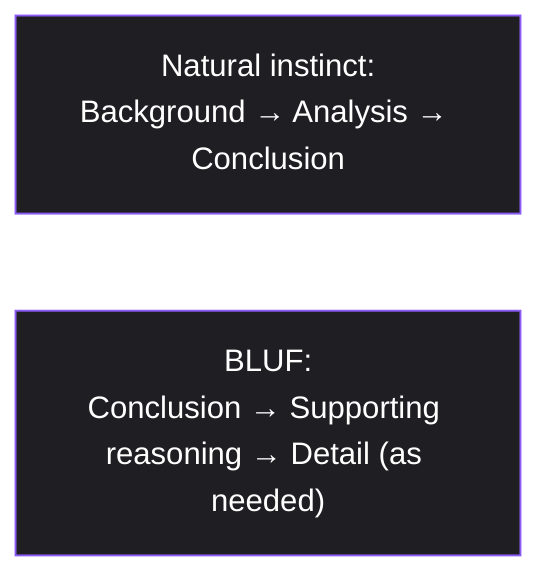
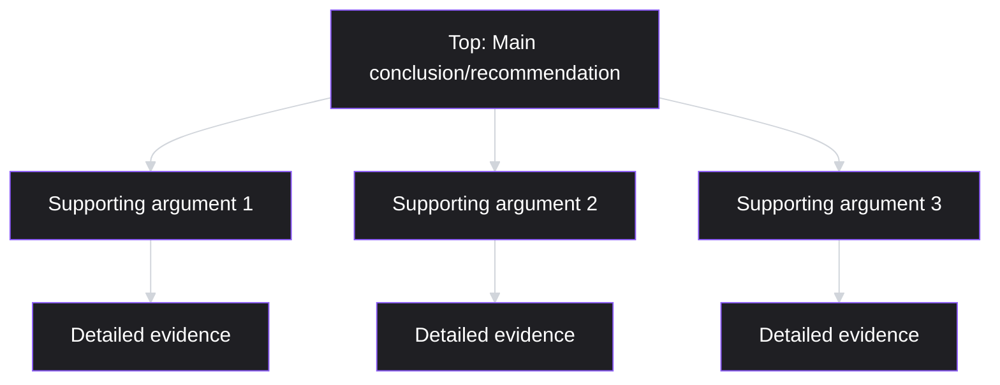
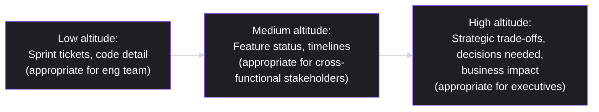
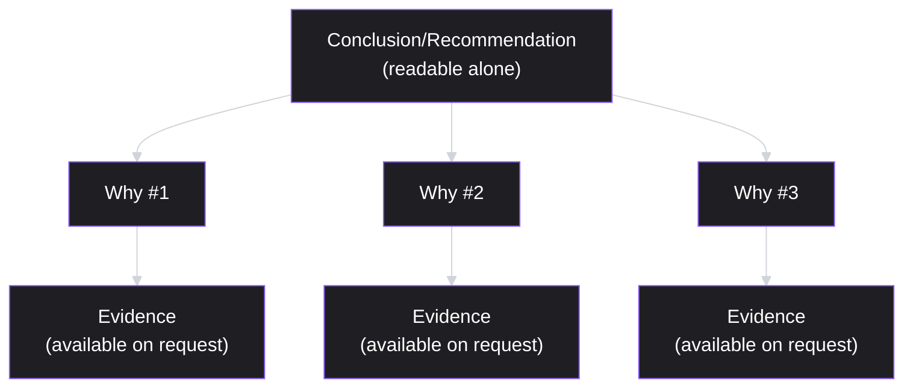

# Lesson 51: Communicating with Executives

## Why This Lesson Matters

This lesson opens Module 6, shifting the curriculum's focus from the quantitative and strategic disciplines of Modules 4 and 5 toward the leadership and communication skills that determine whether all that good work actually gets understood, trusted, and supported at the highest levels of an organization. A PM can make an excellent prioritization decision (Lesson 29), design a rigorous experiment (Lesson 45), or diagnose a genuine PLG opportunity (Lesson 50) — and still fail to secure the resources or organizational support needed to act on any of it, if the communication reaching executives about that work is unclear, poorly structured, or pitched at the wrong altitude.

This lesson matters because executive communication is a genuinely distinct skill from the peer-to-peer and team-level communication this curriculum has covered so far (Lessons 37, 38, 47). Executives typically have less time, less context on the specific details of any one initiative, and a need to make a decision or form a judgment quickly — which means the communication techniques that work well in a detailed engineering discussion or a stakeholder deep-dive often fail badly with an executive audience, precisely because they weren't designed for the very different constraints that audience operates under.

---

## Learning Path

| Field | Detail |
|---|---|
| **Module** | 6 — Leadership, Communication & Career |
| **Current Lesson** | 51 of 90 |
| **Difficulty** | 4 / 10 |
| **Estimated Study Time** | 30 minutes (reading) + 15 minutes (reflection + quiz) |
| **Prerequisites** | Lesson 35 (Roadmapping — Confidence Gradient), Lesson 47 (Stakeholder Management — power/interest grid) |
| **Next Lesson** | Lesson 52 — Storytelling and Narrative for PMs |
| **Future Topics Unlocked** | Lesson 52 (Storytelling and Narrative for PMs), Lesson 53 (Negotiation & Influence Without Authority), Lesson 54 (Managing Up and Across) — all build on the altitude and structure principles introduced here |

---

## Learning Objectives

By the end of this lesson, you will be able to:

1. Apply the "bottom line up front" (BLUF) principle to structure executive communication, leading with the conclusion rather than building up to it.
2. Explain the Pyramid Principle and use it to organize a recommendation with supporting arguments in a way suited to a time-constrained audience.
3. Adjust the "altitude" of a communication — the level of detail and abstraction — appropriately for an executive audience, extending Lesson 47's power/interest grid reasoning.
4. Structure a decision-focused executive update that clearly states a recommendation, the alternatives considered, the key trade-offs, and the specific ask.
5. Diagnose why a well-reasoned recommendation might fail to land with an executive audience, distinguishing a content problem from a structure or altitude problem.

---

## Prerequisites

This lesson assumes **Lesson 35's** Confidence Gradient and hedged-commitment discipline, since executive communication often involves exactly the kind of forward-looking, appropriately-hedged statements that lesson covered, now applied to a specific, high-stakes audience. It also assumes **Lesson 47's** power/interest grid, since executives typically sit in the "Manage Closely" or "Keep Satisfied" quadrants, and this lesson develops the specific communication techniques appropriate for those quadrants in much greater depth.

### A note on prior context
This lesson also assumes the reader is picking up mid-curriculum, following the closing lessons of Module 5 (Metrics, Experimentation & Growth) — familiarity with concepts like North Star Metrics (Lesson 42) and product-led growth (Lesson 50) is helpful context, since this lesson's examples occasionally reference explaining strategies like these to an executive audience.

---

## Theory

### Bottom Line Up First (BLUF)

The single most important structural shift for executive communication, relative to more detailed peer or team communication, is leading with the conclusion rather than building up to it. **BLUF** means stating the recommendation, decision, or key finding in the very first sentence or two, before any supporting context or reasoning follows. This inverts the natural instinct many people have to build a case chronologically — background, then analysis, then conclusion — which works reasonably well for an audience with time to follow the full argument, but frequently fails with an executive audience, who may only have attention for the first thirty seconds of a document or the first minute of a conversation before needing to move to a decision or the next topic.

### The Pyramid Principle

A closely related, more formalized framework, developed by Barbara Minto for structuring persuasive business communication, organizes an argument as a pyramid: the main conclusion sits at the top, a small number of key supporting arguments sit beneath it, and detailed evidence for each supporting argument sits at the base, accessible if needed but not required reading for the top-level conclusion to make sense. The key discipline the Pyramid Principle enforces is that each level should be a complete, standalone answer at its own level of detail — an executive should be able to read only the top line and understand the recommendation, read the top line plus the supporting arguments and understand *why*, and only descend to the base level of detailed evidence if they want to verify or challenge a specific claim.

### The Altitude Dial

Extending Lesson 47's power/interest grid: communication with an executive typically needs to operate at a higher **altitude** — a higher level of abstraction, focused on decisions, trade-offs, and outcomes rather than implementation detail — than communication with a peer or a detailed stakeholder. This does not mean detail is unimportant; it means detail should be available on request (echoing the Pyramid Principle's base layer) rather than presented by default. A PM who presents the same level of granular, Sprint-level detail to an executive that they would appropriately share with an engineering team has miscalibrated the Altitude Dial — not because the detail is wrong, but because it's pitched at the wrong level for that specific audience's actual decision-making needs.

### Structuring a Decision-Focused Update

Combining BLUF, the Pyramid Principle, and appropriate altitude, a well-structured executive update or decision memo typically includes, in order: the recommendation stated plainly upfront, brief context establishing why a decision is needed now, the alternatives genuinely considered (not just the chosen option presented as though it were the only one), the key trade-offs involved in the recommendation, and a specific, explicit ask (a decision, a resource commitment, or simply awareness). Omitting the alternatives-considered step is a particularly common and costly gap: an executive presented with only one option, with no visible sense that other options were seriously weighed, has much less basis to trust that the recommendation reflects genuine analysis rather than a predetermined conclusion working backward to its justification.

---

## Common Beginner Mistakes

**Mistake 1: Building up to the conclusion chronologically, rather than leading with it**

As covered in Theory, this works against a time-constrained executive audience's actual needs, risking the recommendation never being reached if attention runs out before the narrative arrives at its point.

**Mistake 2: Presenting only one option as though it were the only one considered**

As covered in Theory, this undermines an executive's ability to trust that genuine analysis, rather than a predetermined conclusion, drove the recommendation — even when the analysis behind the scenes was actually rigorous.

**Mistake 3: Pitching communication at the wrong altitude — either too much granular detail, or too little substantive grounding**

Excessive Sprint-level or implementation detail overwhelms an executive audience's actual decision-making needs; conversely, communication so abstract it offers no real trade-off or evidence leaves an executive unable to evaluate whether a recommendation is actually sound.

**Mistake 4: Treating an executive's request for more detail as a sign the initial communication failed**

A well-structured Pyramid Principle communication *should* prompt targeted follow-up questions from an engaged executive wanting to verify a specific claim — this is the structure working as intended, not evidence the top-level summary was insufficient.

**Mistake 5: Failing to state a specific, explicit ask**

An update that shares information without clarifying what decision or action is actually being requested leaves an executive unclear on what response is expected, risking either no action at all or a misaligned one.

---

## Mental Model: The Pyramid Principle

*(Introduced above in the Theory section; restated here as this lesson's standalone takeaway tool, per curriculum convention.)*

Use the Pyramid Principle as a standing discipline whenever drafting executive communication: write the top line first, in isolation, and ask whether it stands as a complete, understandable statement on its own. If it doesn't — if it requires the reader to already understand background context to make sense of it — the structure needs revision before any supporting detail is added, since no amount of well-organized supporting material fixes a top line that doesn't actually stand alone.

---

## Real Company Example

**Amazon**'s six-page-memo culture is directly confirmed in Jeff Bezos's own words, not just widely reported secondhand. Bezos has described it repeatedly in public settings, including a 2018 talk at the George W. Bush Presidential Center, where he called banning PowerPoint at Amazon "the smartest thing we ever did," and in his 2017 letter to Amazon shareholders (filed publicly with the SEC), where he explained that meetings begin with roughly 30 minutes of silent, in-room reading of a six-page narrative memo before any discussion starts — and noted that, by longstanding Amazon tradition, authors' names never appear on the memo, "because the memo is from the whole team."

The underlying principle connects directly to this lesson's Theory: a well-structured narrative memo, read in full by every attendee before discussion, forces exactly the kind of complete, standalone argument the Pyramid Principle requires — since a memo intended to be read silently and understood on its own terms cannot rely on a live presenter's tone or slide-by-slide pacing to carry an underspecified argument, unlike a slide deck, which can more easily hide gaps in reasoning behind a compelling verbal delivery.

*(Source: Bezos's 2018 remarks at the George W. Bush Presidential Center's Forum on Leadership, and his 2017 letter to shareholders, filed publicly with the SEC — both direct, on-the-record statements rather than secondhand reporting.)*

---

## Real World Perspective: Communicating with Executives at Different Company Stages

**At a startup:**
Executive communication is often informal and frequent — a PM may talk with a founder or small leadership team daily, making some of this lesson's structural discipline feel less immediately necessary. The risk here is assuming this informality will remain sufficient as the organization grows, rather than building strong communication habits (BLUF, considering alternatives explicitly) early, before executive time becomes a much scarcer, more contested resource.

**At a mid-size company:**
Formal, structured executive updates (written memos, standardized decision templates) typically become genuinely valuable, since executive time is now split across many more competing priorities and initiatives, and a poorly structured update risks simply being deprioritized in favor of a better-structured one competing for the same limited attention.

**At Big Tech:**
Executive communication is often highly formalized, sometimes with company-wide standard templates for decision memos, and executives may be reviewing many such documents in a single sitting, making disciplined altitude-matching and BLUF structure especially consequential — a poorly structured document is at real risk of receiving only cursory attention amid a stack of competing updates. The PM's job shifts toward mastering the specific format conventions their organization has standardized around, while still applying the underlying principles (BLUF, Pyramid Principle, appropriate altitude) that make any format actually effective.

---

## Detailed Case Study: The Recommendation Buried on Page Four

Consider a simplified, illustrative scenario common among PMs new to executive communication.

A PM prepares a detailed document proposing a significant reallocation of engineering resources toward paying down technical debt (echoing Lesson 39), based on genuinely rigorous analysis: declining velocity data, a clear principal-and-interest framing, and a specific proposed remediation plan. The document is thorough and well-reasoned, but structured chronologically — it opens with background on the product's history, moves through several pages of supporting data and context, and only states the actual recommendation (reallocate 30% of the next two quarters' capacity to debt paydown) on the fourth page.

In the executive review meeting, the presenting PM notices confused, impatient reactions partway through the discussion — several executives, having skimmed rather than fully read the document in advance, ask basic questions ("so what exactly are you asking us to decide here?") that the document had, in fact, answered — just four pages in, after they had stopped reading. The meeting ends without a clear decision, and the PM leaves uncertain whether the underlying recommendation was rejected, or whether it was simply never actually reached by most of the room.

**What went wrong?**

Using the Pyramid Principle and BLUF: the document's content was genuinely sound, but its structure inverted what an executive audience needed — background and supporting detail came first, with the actual recommendation buried well past the point where a time-constrained reader's attention typically holds. This is a direct instance of Mistake 1, and illustrates why strong underlying analysis is not sufficient on its own for effective executive communication — the analysis must also be *structured* for the audience actually receiving it, not organized in the order it was originally discovered or reasoned through.

The corrective revision required restructuring, not re-researching: the same underlying analysis, reordered so the recommendation ("reallocate 30% of the next two quarters' capacity to technical debt paydown") appeared in the first sentence, followed immediately by the three or four key supporting reasons (declining velocity trend, specific customer-facing risk, comparison to the cost of continued deferral), with the detailed data available in an appendix rather than the main narrative flow. Presented this way in a follow-up conversation, the same underlying recommendation was understood, discussed, and decided upon within the meeting's first several minutes — the content hadn't changed, but its accessibility to the audience's actual constraints had changed entirely. This same restructuring discipline — organizing content to serve the audience's actual attention and decision-making needs — is developed further in **Lesson 52 (Storytelling and Narrative for PMs)**, which addresses how to make a well-structured argument genuinely memorable and persuasive, not just accessible.

---

## Framework Explanation: The Decision Memo Structure

A second, more tactical tool: use this structure for any executive communication requesting a specific decision or resource commitment.

| Section | Content | Length Guidance |
|---|---|---|
| Recommendation | The specific decision or action being requested, stated plainly | 1–2 sentences, first thing in the document |
| Context | Why this decision is needed now, briefly | A short paragraph, not a full history |
| Alternatives considered | The other options genuinely weighed, and why they were not chosen | A few bullet points per alternative |
| Key trade-offs | What the recommendation costs or risks, stated honestly, not omitted | A short, honest paragraph |
| The ask | Exactly what response is being requested — a decision, a resource, or simply awareness | 1 sentence, explicit and unambiguous |

A document following this structure allows an executive to understand the full decision in the time it takes to read the first section, while still providing the supporting rigor (context, alternatives, trade-offs) needed to trust and evaluate that recommendation if they choose to engage further.

---

## Interview Perspective: How Interviewers Think About This

**Typical question 1: "How do you structure an update for executive leadership?"**
*What the interviewer is actually evaluating:* Whether the candidate defaults to BLUF and the Pyramid Principle rather than describing a chronological, background-first narrative structure more suited to a different audience.

**Typical question 2: "Tell me about a time your recommendation didn't land well with leadership. What happened?"**
*What the interviewer is actually evaluating:* Whether the candidate can distinguish a content problem (the recommendation itself was wrong) from a structure or altitude problem (the recommendation was sound but poorly presented), mirroring this lesson's Case Study.

**Typical question 3: "How do you decide how much detail to include when presenting to executives versus your own team?"**
*What the interviewer is actually evaluating:* Whether the candidate understands the Altitude Dial concept — matching level of abstraction to audience — rather than presenting identical content and detail regardless of who's receiving it.

---

## Summary

Executive communication requires a genuinely different structural approach than peer or detailed stakeholder communication, built on three connected principles: BLUF (stating the conclusion first, rather than building up to it chronologically), the Pyramid Principle (organizing a conclusion, its key supporting arguments, and detailed evidence as a hierarchy where each level stands independently), and appropriate altitude (matching the level of detail and abstraction to an executive audience's actual decision-making needs, extending Lesson 47's power/interest grid). A well-structured decision memo states the recommendation plainly upfront, followed by brief context, the alternatives genuinely considered, the key trade-offs involved, and an explicit ask — omitting alternatives considered is a particularly costly and common gap, since it undermines an executive's ability to trust that genuine analysis, not a predetermined conclusion, drove the recommendation. As this lesson's Case Study demonstrates, sound underlying analysis is not sufficient on its own: a recommendation buried in chronologically-ordered supporting detail can fail to land entirely, not because the content was wrong, but because its structure didn't serve the audience's actual attention and decision-making constraints — a problem solved through restructuring, not re-researching.

---

## Key Takeaways

- BLUF (bottom line up front) means stating the conclusion or recommendation first, before supporting context, inverting the natural chronological instinct that works against a time-constrained executive audience.
- The Pyramid Principle organizes communication so the top-level conclusion is a complete, standalone statement, with supporting arguments and detailed evidence available at deeper levels only if needed.
- The Altitude Dial concept means matching the level of detail and abstraction to the audience — executives generally need higher-altitude, decision-and-trade-off-focused communication, with granular detail available on request rather than presented by default.
- A well-structured decision memo includes the recommendation, brief context, alternatives genuinely considered, key trade-offs, and an explicit ask.
- Omitting alternatives considered undermines an executive's trust that a recommendation reflects genuine analysis rather than a predetermined conclusion.
- A sound, well-reasoned recommendation can still fail to land if its structure doesn't serve the audience's actual attention and decision-making needs — a structure problem is different from a content problem, and requires a different fix.
- An executive's request for more detail after a well-structured top-level summary is often the structure working as intended, not evidence that the summary failed.

---

## Cheat Sheet

*A two-minute review of everything in this lesson.*

- **BLUF:** conclusion first, then supporting reasoning — never build up to it chronologically.
- **Pyramid Principle:** top line stands alone; supporting arguments and evidence available beneath it, not required for the top line to make sense.
- **Altitude Dial:** match detail level to audience — high altitude (decisions, trade-offs) for executives, lower altitude for peers/teams.
- **Decision memo structure:** recommendation, context, alternatives considered, trade-offs, explicit ask.
- **Always show alternatives considered:** omitting them undermines trust in the recommendation's rigor.
- **Structure problem ≠ content problem:** a sound recommendation can still fail if poorly structured — fix the structure, not necessarily the content.
- **Follow-up questions are often success, not failure:** a well-structured summary inviting targeted follow-up is working as intended.

---

## Glossary

| Term | Definition | Related Concepts | Difficulty |
|---|---|---|---|
| BLUF (Bottom Line Up Front) | Stating the conclusion or recommendation first, before supporting context or reasoning | Pyramid Principle | 1 |
| Pyramid Principle | A framework (Barbara Minto) organizing communication as a conclusion, supporting arguments, and detailed evidence in a standalone hierarchy | BLUF | 2 |
| Altitude (communication) | The level of detail and abstraction appropriate for a given audience's decision-making needs | Power/interest grid (Lesson 47) | 2 |
| Decision memo | A structured document requesting a specific decision, including recommendation, context, alternatives, trade-offs, and an ask | Pyramid Principle | 2 |

---

## Further Reading / Resources

- *The Pyramid Principle* by Barbara Minto — the foundational text on structuring business communication as a standalone hierarchical argument.
- Public statements and writing by Jeff Bezos on Amazon's narrative memo culture — background on this lesson's central worked example.
- *Made to Stick* by Chip and Dan Heath — relevant background on structuring ideas for clarity and memorability, extended further in Lesson 52.

---

## Flashcards

**Card 1**
- Front: What does BLUF stand for, and what does it require?
- Back: Bottom Line Up Front — stating the conclusion or recommendation first, before supporting context or background.
- Difficulty: 1
- Tags: bluf

**Card 2**
- Front: What is the key discipline the Pyramid Principle enforces?
- Back: Each level of the argument (conclusion, supporting arguments, detailed evidence) should be a complete, standalone answer at its own level of detail.
- Difficulty: 2
- Tags: pyramid-principle

**Card 3**
- Front: What does the Altitude Dial concept describe?
- Back: Matching the level of detail and abstraction in communication to the audience's actual decision-making needs — higher altitude (trade-offs, decisions) for executives, lower altitude for peers and teams.
- Difficulty: 2
- Tags: altitude-dial

**Card 4**
- Front: What five elements does a well-structured decision memo include?
- Back: Recommendation, context, alternatives considered, key trade-offs, and an explicit ask.
- Difficulty: 2
- Tags: decision-memo

**Card 5**
- Front: Why does omitting "alternatives considered" undermine trust in a recommendation?
- Back: An executive presented with only one option has no visible basis to trust that genuine analysis, rather than a predetermined conclusion, drove the recommendation.
- Difficulty: 2
- Tags: alternatives-considered

**Card 6**
- Front: In the Detailed Case Study, what was the actual problem with the technical debt reallocation proposal?
- Back: The underlying analysis was sound, but the document's chronological structure buried the actual recommendation on page four, past where the time-constrained executive audience's attention typically held — a structure problem, not a content problem.
- Difficulty: 2
- Tags: case-study

## Reflection Exercise

Consider the following novel scenario: You need to request executive approval to delay a major product launch by six weeks, based on evidence from user testing that a core flow needs significant rework. You have a detailed, twelve-page analysis document already prepared, organized in the order you conducted the research.

There is no single correct answer to the prompts below — the goal is to practice applying BLUF and the Pyramid Principle, not to reach one "right" answer.

1. Using BLUF, what would the first one to two sentences of your restructured communication say?
2. Using the Pyramid Principle, what would you identify as the three or four key supporting arguments beneath your main recommendation?
3. What alternatives did you likely consider before recommending a delay (e.g., launching with a known issue and a fast-follow fix, reducing scope instead of delaying), and how would you present them honestly?
4. What is the specific, explicit ask you would state at the end of your communication?
5. If an executive asks a detailed question about the user testing methodology after reading your restructured summary, how would you interpret that reaction, using this lesson's frameworks?

---

## Quiz

**1. What does BLUF require, according to this lesson?**
A) Avoiding any conclusion or recommendation
B) Presenting just detailed evidence, no summary
C) Building up to the conclusion chronologically
D) Stating the conclusion first, before supporting reasoning

*Correct answer: D*
*Explanation: This inverts the natural chronological instinct, since a time-constrained executive audience needs the point before the buildup.*
*Learning objective tested: #1*
*Difficulty: Easy*

---

**2. What is the key discipline the Pyramid Principle enforces?**
A) Just executives may read a document's top level
B) All evidence must precede any stated conclusion
C) Each level requires understanding the level below it
D) The top line stands alone, complete

*Correct answer: D*
*Explanation: A complete, standalone top line is what lets a reader grasp the recommendation without first working through everything beneath it.*
*Learning objective tested: #2*
*Difficulty: Easy*

---

**3. What does the Altitude Dial concept describe?**
A) The physical location of an executive's office
B) A tool used just in engineering communication
C) Matching detail level to the audience's needs
D) Another name for the Pyramid Principle itself

*Correct answer: C*
*Explanation: This extends Lesson 47's power/interest reasoning to how much abstraction versus implementation detail a given audience actually needs.*
*Learning objective tested: #3*
*Difficulty: Easy*

---

**4. What five elements does a well-structured decision memo include, per the Decision Memo Structure framework?**
A) The recommendation, context, alternatives, trade-offs, and ask
B) A slide deck, a video, a survey, a summary
C) Background, history, methodology, appendix, references
D) Just a recommendation, without further detail

*Correct answer: A*
*Explanation: These five sections together give an executive both the headline decision and the supporting rigor to evaluate it further.*
*Learning objective tested: #4*
*Difficulty: Easy*

---

**5. Why does omitting "alternatives considered" from an executive communication undermine trust, according to this lesson?**
A) Alternatives are legally required in business documents
B) One option alone gives no visible sign of real analysis
C) Presenting alternatives invariably changes the outcome
D) Alternatives carry no bearing on executive trust

*Correct answer: B*
*Explanation: A single option with no visible weighing of alternatives reads as a conclusion worked backward to, not one reached through genuine analysis.*
*Learning objective tested: #4*
*Difficulty: Easy*

---

**6. In the Detailed Case Study, what was the actual root cause of the recommendation failing to land in the meeting?**
A) The executives had no interest in technical debt
B) It sat buried, several pages down
C) No supporting data was included at all
D) The technical debt analysis was flawed

*Correct answer: B*
*Explanation: The chronological structure delayed the actual ask past where a time-constrained audience's attention held.*
*Learning objective tested: #5*
*Difficulty: Easy*

---

**7. What did the corrective revision in the Detailed Case Study involve?**
A) Abandoning the paydown recommendation altogether
B) Adding more background history at the start
C) Restructuring the analysis, recommendation first
D) Conducting altogether new research

*Correct answer: C*
*Explanation: The fix was structural, not a re-analysis — the same evidence, reordered to lead with the ask.*
*Learning objective tested: #5*
*Difficulty: Medium*

---

**8. Why does this lesson caution against pitching executive communication at too low an altitude (excessive granular detail)?**
A) Granular detail is invariably factually incorrect
B) It can overwhelm decision-making on trade-offs
C) Low-altitude communication is barred outright
D) Detail should reach customers, not executives

*Correct answer: B*
*Explanation: Sprint-level specifics serve an engineering audience's needs; an executive audience is generally weighing trade-offs and outcomes instead.*
*Learning objective tested: #3*
*Difficulty: Medium*

---

**9. Why does this lesson caution against treating an executive's request for more detail as a sign the initial communication failed?**
A) A targeted follow-up often means the structure works
B) Executives rarely ask follow-up questions at all
C) A follow-up question invariably means it was wrong
D) Executives must ask at least one question regardless

*Correct answer: A*
*Explanation: A well-built pyramid invites exactly this — a specific question about a specific claim, rather than confusion about the whole thing.*
*Learning objective tested: #4, #5*
*Difficulty: Medium*

---

**10. What does Amazon's widely reported narrative memo and silent-reading practice illustrate, according to this lesson's Real Company Example?**
A) Six-page memos are legally required everywhere
B) Slide decks invariably outperform written memos
C) Executives should rarely read before a meeting
D) A memo meant to stand fully on its own

*Correct answer: D*
*Explanation: A presenter can paper over a gap in reasoning; a silently-read memo has to carry the whole argument on its own.*
*Learning objective tested: #2*
*Difficulty: Medium*

---

**11. (Interview Reasoning) A candidate is asked how they structure updates for executive leadership, and answers: "I usually start with background so they understand the full history before I get to my point." Based on this lesson's Interview Perspective section, what is the weakness in this answer?**
A) Background-first order fights time-pressed needs
B) Background should invariably precede a conclusion
C) It demonstrates strong attention to detail
D) It correctly shows thorough preparation

*Correct answer: A*
*Explanation: BLUF and the Pyramid Principle both invert exactly this instinct, for exactly this reason.*
*Learning objective tested: #1, #5*
*Difficulty: Hard*

---

**12. Why does this lesson recommend an explicit, unambiguous "ask" at the end of a decision memo?**
A) An ask is just relevant for financial decisions
B) Executives must respond to every ask in a day
C) Without one, the requested action can go unclear
D) The ask should stay identical no matter the content

*Correct answer: C*
*Explanation: A recommendation without a stated ask can leave an executive unsure whether they're meant to decide, fund, or simply note it.*
*Learning objective tested: #4*
*Difficulty: Medium-Hard*

---

**13. (Product Thinking) A PM's executive update is technically accurate and thorough but takes fifteen minutes to reach its actual recommendation, and the executive audience seems increasingly distracted as it progresses. Using this lesson's frameworks, what is the most likely diagnosis and fix?**
A) A structure problem, fixable by reordering the memo
B) The executives are simply uninterested in the topic
C) The recommendation itself must be fundamentally wrong
D) More background detail should be added throughout

*Correct answer: A*
*Explanation: The content held up fine once reordered — the fifteen-minute wait was the actual problem, not the underlying analysis.*
*Learning objective tested: #5*
*Difficulty: Hard*

---

**14. Which of the following best reflects appropriate altitude-matching for an executive audience, per this lesson?**
A) Identical Sprint-ticket detail for executives and engineers
B) Just vague, unsupported claims with no grounding
C) Omitting all evidence and trade-offs to stay short
D) Trade-offs and the decision needed first, detail available on request

*Correct answer: D*
*Explanation: This keeps the primary audience at the altitude their decision actually needs, without discarding the rigor available underneath.*
*Learning objective tested: #3*
*Difficulty: Medium-Hard*

---

**15. (Product Thinking, Highest Difficulty) A PM has a genuinely strong recommendation but knows from past experience that this specific executive audience tends to ask detailed, skeptical questions about any option not explicitly shown to have been considered and ruled out. Using this lesson's frameworks, what is the most defensible preparation approach?**
A) Present just the final recommendation alone
B) Proactively address the alternatives likely raised
C) Avoid presenting to this audience altogether
D) Include exhaustive detail on every conceivable alternative

*Correct answer: B*
*Explanation: This anticipates the specific skepticism rather than either omitting alternatives or burying the memo under every implausible one.*
*Learning objective tested: #4, #5*
*Difficulty: Hard*

---

## Connections

| | Lesson | Core Idea Carried Forward |
|---|---|---|
| **Previous Lesson** | Lesson 50 — Product-Led Growth (closes Module 5) | Shifts from quantitative growth strategy to the communication skills needed to secure organizational support for strategies like PLG |
| **Current Lesson** | Lesson 51 — Communicating with Executives | BLUF; Pyramid Principle; Altitude Dial; Decision Memo Structure |
| **Next Lesson** | Lesson 52 — Storytelling and Narrative for PMs | Builds on this lesson's structural clarity by adding the persuasive, memorable narrative techniques that make a well-structured argument genuinely compelling |
| **Future Concepts Unlocked** | Lesson 53 (Negotiation & Influence Without Authority) | Builds on this lesson's trust-through-transparency principle (showing alternatives considered) |
| | Lesson 54 (Managing Up and Across) | Extends this lesson's altitude-matching discipline to ongoing manager relationships |

This curriculum is designed to be read as one continuous argument, not ninety independent articles. Every lesson from here forward will assume you carry BLUF, the Pyramid Principle, and the Altitude Dial with you — they will not be re-explained, only re-applied in new contexts.
