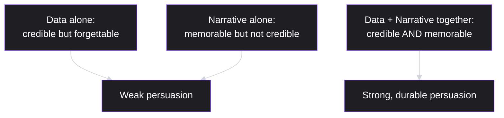

# Lesson 52: Storytelling and Narrative for PMs

## Why This Lesson Matters

Lesson 51 gave you the structural discipline for clear, decision-focused executive communication — BLUF, the Pyramid Principle, appropriate altitude. That structure ensures a recommendation can be understood quickly and evaluated rigorously. This lesson addresses something structure alone doesn't guarantee: whether a communication is genuinely *memorable* and *persuasive* — whether it moves people to care, not just to comprehend. A perfectly structured decision memo can be logically unassailable and still fail to generate real enthusiasm or lasting recall, because clarity and persuasion are related but distinct goals, and this lesson addresses the second one directly.

This lesson matters because a PM's job frequently involves convincing people — engineers to prioritize a less glamorous but important initiative, executives to fund a strategic bet, an entire company to rally around a new direction — and dry, purely structural communication, however clear, often fails to generate the emotional buy-in genuine persuasion requires. Storytelling is not a soft or secondary skill layered on top of "real" analytical work; it is the mechanism by which analytical work actually reaches and moves an audience, especially at scale, where a PM cannot personally walk every stakeholder through the full analysis behind a recommendation.

---

## Learning Path

| Field | Detail |
|---|---|
| **Module** | 6 — Leadership, Communication & Career |
| **Current Lesson** | 52 of 90 |
| **Difficulty** | 4 / 10 |
| **Estimated Study Time** | 30 minutes (reading) + 15 minutes (reflection + quiz) |
| **Prerequisites** | Lesson 38 (Working with Design Teams — premature high-fidelity, distinguishing genuine excitement from manufactured polish), Lesson 51 (Communicating with Executives — BLUF, Pyramid Principle) |
| **Next Lesson** | Lesson 53 — Negotiation & Influence Without Authority |
| **Future Topics Unlocked** | Lesson 53 (Negotiation & Influence Without Authority), Lesson 56 (Product Management Career Paths) — both build on the narrative framing and customer-as-hero concepts introduced here |

---

## Learning Objectives

By the end of this lesson, you will be able to:

1. Explain the "customer as hero" narrative framing and apply it to reposition a product pitch or roadmap presentation.
2. Construct a simple narrative arc (problem, guide, plan, call to action, stakes) for a product communication, distinguishing it from a purely structural, bullet-point presentation.
3. Combine data and narrative deliberately, explaining why each alone is insufficient for durable persuasion.
4. Distinguish genuine, evidence-grounded storytelling from manufactured excitement or hype, connecting back to Lesson 38's premature high-fidelity caution.
5. Diagnose why a factually accurate, well-structured presentation might still fail to generate genuine buy-in, and identify the specific narrative element missing.

---

## Prerequisites

This lesson assumes **Lesson 51's** structural communication discipline, since storytelling builds on top of clear structure rather than replacing it — a compelling narrative still needs the underlying clarity BLUF and the Pyramid Principle provide. It also assumes **Lesson 38's** caution about premature high-fidelity and manufactured excitement, since this lesson's central caution is closely related: genuine storytelling grounded in real evidence must be distinguished from hype that generates enthusiasm disconnected from substance.

---

## Theory

### The Customer as Hero

A widely used narrative reframing, popularized in business communication contexts by Donald Miller's StoryBrand framework, inverts a common instinct: rather than positioning a company or product as the hero of its own story, position the *customer* as the hero, and the product as the **guide** that helps the hero overcome an obstacle. This reframing matters because audiences — whether customers, executives, or internal teams — engage far more readily with a story where they can see themselves (or the people they're building for) as the protagonist facing a real problem, rather than a story that centers the product or company as the main character.

Applied to a roadmap presentation or product pitch, this means opening not with a feature list or a company timeline, but with a specific, vivid articulation of the user's actual problem — grounded in real research, not invented for dramatic effect — before introducing how the product (as guide, not hero) helps address it.

### The Narrative Arc for Product Communication

A simple, adaptable arc structures most effective product storytelling: **problem** (a real, specific, evidence-grounded difficulty the intended audience or their customers face), **guide** (the product or proposed solution, positioned as helping rather than as the center of attention), **plan** (the specific steps or approach being proposed), **call to action** (what the listener should do or decide), and **stakes** (what happens if the problem goes unaddressed, and what success looks like if it's solved). This arc is deliberately compatible with Lesson 51's BLUF and Pyramid Principle structure, not a replacement for it — a well-told story can still lead with its core point, then unfold the narrative arc as supporting texture rather than as a chronological build-up that delays the conclusion.

### Combining Data and Narrative

Neither data nor narrative alone reliably produces durable persuasion. Data without narrative is often forgettable and fails to generate genuine emotional investment — an audience can accept a statistic intellectually without it changing how they feel about a decision's urgency or importance. Narrative without data is memorable but not credible — a vivid story with no supporting evidence risks feeling like manipulation rather than genuine insight, and a sophisticated audience (particularly the executive audience from Lesson 51) will often discount an unsupported story specifically because it lacks the rigor their decision-making requires.

The most effective product communication typically opens with a specific, grounded story (a real user's actual experience, illustrating the problem vividly) and then supports that story with data demonstrating the problem's scale and the proposed solution's validated impact — the story creates emotional investment and memorability, and the data provides the credibility and rigor an analytical audience requires to trust that the story is representative, not cherry-picked.

### Genuine Storytelling vs. Manufactured Excitement

A critical caution, directly extending Lesson 38's premature high-fidelity concept: storytelling is a tool for communicating genuine, evidence-grounded insight more effectively — it is not a tool for manufacturing enthusiasm around an idea that hasn't actually been validated. A vivid, well-told story about an unvalidated hypothesis risks producing exactly the same false confidence and premature attachment Lesson 38 warned against with polished mockups — except here, the "polish" is narrative and emotional rather than visual. The discipline this lesson requires is ensuring a story's vividness is always grounded in something genuinely true and evidenced, not used as a substitute for that evidence.

---

## Common Beginner Mistakes

**Mistake 1: Positioning the product or company as the hero of the story, rather than the customer**

This produces a self-congratulatory narrative that audiences engage with less readily than one where they can see the customer's real problem and struggle as the central focus, with the product playing a supporting, guide role.

**Mistake 2: Presenting data without any narrative framing, expecting numbers alone to persuade**

As covered in Theory, data alone is often intellectually accepted but emotionally forgettable, failing to generate the lasting buy-in genuine persuasion requires.

**Mistake 3: Presenting a compelling story with no supporting data, especially to an analytically-minded audience**

As covered in Theory, this risks the story being perceived as manipulation or hype rather than genuine insight, particularly with executive or technical audiences who expect evidence to back a persuasive narrative.

**Mistake 4: Using storytelling techniques to generate excitement around an unvalidated idea, echoing Lesson 38's premature high-fidelity risk**

A vivid narrative about a hypothesis that hasn't actually been tested with real users risks manufacturing the same false confidence and premature attachment that a polished, unvalidated mockup does — narrative polish is just as capable of creating this risk as visual polish.

**Mistake 5: Treating storytelling as a replacement for clear structure, rather than a complement to it**

A narrative that meanders without ever reaching a clear point or ask undermines the communication discipline established in Lesson 51 — storytelling should make a structured argument more compelling, not replace the structure that makes it actionable.

---

## Mental Model: The Story Spine

This lesson's core takeaway tool visualizes the narrative arc as a spine that any product communication can be built around, regardless of format (a written memo, a live presentation, a roadmap review):

```mermaid
%%{init: {
  "theme": "dark",
  "themeVariables": {
    "background": "#0b0b0c",
    "primaryColor": "#1f1f23",
    "primaryTextColor": "#ffffff",
    "primaryBorderColor": "#8b5cf6",
    "lineColor": "#d1d5db",
    "secondaryColor": "#18181b",
    "tertiaryColor": "#111111",
    "mainBkg": "#1f1f23",
    "nodeBorder": "#8b5cf6",
    "clusterBkg": "#000000",
    "clusterBorder": "#27272a",
    "titleColor": "#ffffff",
    "edgeLabelBackground": "#0b0b0c",
    "nodeTextColor": "#ffffff",
    "edgeLabelColor": "#ffffff",
    "actorBorder": "#8b5cf6",
    "actorBkg": "#1f1f23",
    "actorTextColor": "#ffffff",
    "sequenceNumberColor": "#ffffff",
    "signalColor": "#8b5cf6",
    "signalTextColor": "#ffffff",
    "textColor": "#ffffff",
    "classText": "#ffffff",
    "classBorder": "#8b5cf6",
    "classBkg": "#1f1f23"
  }
}}%%
graph LR
    A[Problem<br/>real, specific, evidenced] --> B[Guide<br/>the product/solution]
    B --> C[Plan<br/>specific proposed steps]
    C --> D[Call to Action<br/>what's being asked]
    D --> E[Stakes<br/>cost of inaction,<br/>shape of success]
```

Use the Story Spine as a standing discipline whenever preparing a significant product communication: before drafting slides or a document, articulate each of these five elements in a single sentence. If any element feels weak or generic (a vague "problem," an unclear "ask"), that weakness will likely undermine the entire communication regardless of how well-produced the surrounding materials are — the spine needs to be structurally sound before it's dressed up with supporting detail or visual polish.

---

## Real Company Example

**Airbnb**'s early "Snow White" storyboarding process has a specific, traceable origin: co-founder Brian Chesky has described in multiple public interviews how the team, inspired by Walt Disney's original storyboarding process for *Snow White and the Seven Dwarfs*, brought in a Pixar storyboard artist to draw out, frame by frame, a guest's entire journey — arrival, key moments, emotional highs and lows — before the team designed individual product features. The exercise reportedly grew out of Chesky's related "11-star experience" thought exercise: imagining what an implausibly extraordinary version of a stay (well beyond a merely satisfactory 5-star one) would look like at every step, then working backward to find which parts of that ideal journey were realistically buildable.

The underlying principle connects directly to this lesson's Theory: mapping a customer's actual journey as a story — with a clear sequence of experiences and emotional highs and lows, not just a checklist of features — helped ensure resulting product decisions served a coherent, customer-centered narrative rather than a disconnected collection of isolated capabilities.

*(Source: multiple firsthand accounts from Brian Chesky's public talks and interviews describing the practice, consistent across independent retellings. This curriculum does not claim certainty about how extensively storyboarding is still used at Airbnb's current scale.)*

---

## Real World Perspective: Storytelling and Narrative for PMs at Different Company Stages

**At a startup:**
Storytelling is often central and instinctive — a founding narrative (why this problem, why now, why this team) frequently drives early fundraising, hiring, and customer acquisition, sometimes more than rigorous data, since early-stage data is often too sparse to be persuasive on its own. The risk here is Mistake 4's failure mode — a compelling founding story can create momentum that outpaces the evidence actually validating the underlying idea.

**At a mid-size company:**
Storytelling typically needs to be more deliberately paired with data (per this lesson's Theory) as an organization scales and decision-making becomes more distributed — a compelling narrative alone becomes less sufficient to secure buy-in from stakeholders who weren't present for the founding story and expect evidence alongside persuasion.

**At Big Tech:**
Storytelling is often a formalized, taught skill, particularly for significant strategic pitches and roadmap reviews, frequently combined with rigorous supporting data given the sophisticated, skeptical audiences typical at this scale (echoing Lesson 51's executive communication norms). The PM's job shifts toward mastering the combination of vivid, evidence-grounded narrative with the structural rigor (BLUF, Pyramid Principle) that a large, competitive internal environment demands.

---

## Detailed Case Study: The Roadmap Review Nobody Remembered

Consider a simplified, illustrative scenario common at PMs presenting a quarterly roadmap review.

A PM prepares a thorough, accurate quarterly roadmap presentation structured entirely as a bulleted feature list, organized by team and Sprint, with supporting metrics for each item. The presentation is clear, well-organized, and factually complete — every stakeholder present receives an accurate picture of what shipped and what's planned next. In a follow-up conversation two weeks later, however, several attendees struggle to recall specific details from the presentation, and one executive, when asked about the quarter's roadmap priorities, describes them only vaguely, unable to articulate why any particular initiative mattered beyond a general sense that "a lot of things shipped."

The PM, reviewing feedback, realizes that while the presentation was accurate, it never actually told anyone *why* any of it mattered — no specific customer problem was ever vividly described, no single narrative connected the individual roadmap items into a coherent story about what the team was actually trying to achieve for real users, and the presentation never got much attention or reaction in the room precisely because it read as a status report rather than an argument for anything.

**What went wrong?**

Using the Story Spine: the presentation had elements of a "plan" (the roadmap items themselves) but was missing a clearly articulated "problem" (a specific, evidenced user difficulty grounding why this particular set of roadmap items mattered), a "guide" framing (positioning the roadmap as helping solve that problem, rather than existing as an end in itself), and "stakes" (what happens if these particular problems go unaddressed, and what genuine success would look like). The presentation was accurate and well-structured in the Lesson 51 sense — clear, organized — but lacked the narrative elements this lesson identifies as necessary for genuine memorability and buy-in.

The corrective revision, presented the following quarter, opened with a specific, real customer story — a described difficulty drawn from actual user research, vividly but honestly presented — before connecting that story to the quarter's roadmap items as the specific plan addressing it, and closing with an explicit statement of what success would mean for that customer and others like them. The same underlying roadmap content was presented, but attendees in the following review reported substantially better recall and engagement, illustrating that the earlier failure was a narrative gap, not a content or accuracy problem — directly paralleling Lesson 51's Case Study distinction between a structure problem and a content problem, applied here to persuasion and memorability rather than clarity.

---

## Framework Explanation: The Data-Narrative Balance Table

A second, more tactical tool: use this table to check whether a planned communication balances data and narrative appropriately before presenting it.

| Check | Question | Warning Sign |
|---|---|---|
| Narrative presence | Does the communication open with or center around a specific, vivid problem, not just a list of items or metrics? | Purely bulleted, item-by-item structure with no unifying story |
| Narrative grounding | Is the story being told genuinely evidenced by real research or data, not invented or exaggerated for effect? | A compelling story with no cited source or supporting evidence |
| Data presence | Is the narrative supported by concrete data demonstrating scale, validation, or impact? | A vivid anecdote presented as though it represents the whole picture, with no supporting data |
| Audience fit | Does the balance of narrative and data match what this specific audience needs (more narrative for broad buy-in, more data for skeptical or highly analytical audiences)? | Identical narrative/data balance used regardless of audience |

A communication failing the "narrative grounding" check specifically risks the Mistake 4 failure mode — manufacturing excitement disconnected from genuine evidence — and deserves particular scrutiny before it's presented broadly.

---

## Interview Perspective: How Interviewers Think About This

**Typical question 1: "Tell me about a product story you've told that helped secure buy-in for a decision."**
*What the interviewer is actually evaluating:* Whether the candidate can articulate a genuine narrative arc (problem, guide, plan, stakes) grounded in real evidence, rather than describing a purely data-driven or purely anecdotal pitch.

**Typical question 2: "How do you make sure a compelling story doesn't overstate or misrepresent what you actually know?"**
*What the interviewer is actually evaluating:* Whether the candidate is aware of the risk this lesson's Mistake 4 describes — manufacturing narrative excitement disconnected from genuine evidence — and has a deliberate practice for grounding stories in real research.

**Typical question 3: "Why might a factually accurate presentation still fail to persuade an audience?"**
*What the interviewer is actually evaluating:* Whether the candidate distinguishes clarity/accuracy from persuasion/memorability, recognizing that a well-structured but narrative-free presentation can still fail to generate genuine engagement, mirroring this lesson's Case Study.

---

## Summary

Storytelling is the mechanism by which clearly structured communication (Lesson 51's BLUF and Pyramid Principle) becomes genuinely persuasive and memorable, rather than merely comprehensible. The "customer as hero" framing repositions the product as a guide helping the customer overcome a real problem, rather than positioning the product or company as its own protagonist — a reframing that produces more engaging communication because audiences connect more readily with a relatable hero facing a genuine struggle. A simple narrative arc — problem, guide, plan, call to action, stakes — structures effective product storytelling across formats, and this lesson's Story Spine mental model captures that arc as a standing discipline to check before any significant communication. Data and narrative are complementary, not substitutes for each other: data alone is often credible but forgettable, and narrative alone is often memorable but not credible, while the combination produces durable persuasion that is both emotionally engaging and evidence-backed. Finally, this lesson's central caution, extending Lesson 38's premature high-fidelity concept, is that storytelling must remain grounded in genuine evidence — a vivid, well-told story about an unvalidated idea risks manufacturing the same false confidence and premature attachment that a polished, unvalidated mockup does, just through narrative rather than visual means.

---

## Key Takeaways

- The "customer as hero" framing positions the product as a guide helping the customer overcome a real problem, rather than centering the product or company as its own protagonist.
- A simple narrative arc — problem, guide, plan, call to action, stakes — structures effective product storytelling, and should be checked as a standing discipline (the Story Spine) before any significant communication.
- Data alone is often credible but forgettable; narrative alone is often memorable but not credible; the combination produces durable, evidence-backed persuasion.
- Storytelling must remain grounded in genuine evidence — using narrative techniques to manufacture excitement around an unvalidated idea echoes Lesson 38's premature high-fidelity risk, just through narrative rather than visual polish.
- A factually accurate, well-structured presentation can still fail to generate genuine buy-in or lasting recall if it lacks a coherent narrative connecting its individual elements to a real, evidenced problem.
- Storytelling complements, rather than replaces, the structural clarity established in Lesson 51 — a narrative that meanders without reaching a clear point or ask undermines actionability.
- Diagnosing a communication failure requires distinguishing a structure/clarity problem (Lesson 51) from a narrative/persuasion problem (this lesson), since each requires a different fix.

---

## Cheat Sheet

*A two-minute review of everything in this lesson.*

- **Customer as hero:** the customer faces the problem; the product is the guide, not the protagonist.
- **Story Spine:** problem → guide → plan → call to action → stakes.
- **Data + narrative:** data alone is forgettable; narrative alone isn't credible; combine both for durable persuasion.
- **Ground stories in evidence:** narrative polish can manufacture false confidence just like visual polish (Lesson 38) — don't let vividness outrun validation.
- **Storytelling complements structure:** it doesn't replace BLUF or the Pyramid Principle — it makes a clear argument compelling.
- **Diagnose the right problem:** a communication can be clear (Lesson 51) but still fail to persuade or be remembered — that's a narrative gap, not a structure gap.
- **Match narrative/data balance to audience:** broader audiences may need more narrative; skeptical/analytical audiences need more data alongside it.

---

## Glossary

| Term | Definition | Related Concepts | Difficulty |
|---|---|---|---|
| Customer as hero | A narrative framing positioning the customer as the protagonist and the product as a guide helping them overcome a problem | Story Spine | 1 |
| Story Spine | This lesson's mental model: a five-part narrative arc (problem, guide, plan, call to action, stakes) for structuring product communication | Customer as hero | 1 |
| Data-Narrative Balance | The deliberate combination of evidenced narrative and supporting data, since each alone is insufficient for durable persuasion | Story Spine | 2 |

---

## Further Reading / Resources

- *Building a StoryBrand* by Donald Miller — the foundational text on the "customer as hero" narrative framing referenced in this lesson.
- *Made to Stick* by Chip and Dan Heath — a detailed treatment of what makes ideas memorable, complementing this lesson's data-narrative balance discussion.
- Public reporting and interviews on Airbnb's early storyboarding practices — background on this lesson's central worked example.

---

## Flashcards

**Card 1**
- Front: What is the "customer as hero" narrative framing?
- Back: Positioning the customer as the protagonist facing a real problem, with the product playing the role of guide helping them overcome it, rather than positioning the product or company as the story's main character.
- Difficulty: 1
- Tags: customer-as-hero

**Card 2**
- Front: Name the five elements of the Story Spine.
- Back: Problem, guide, plan, call to action, and stakes.
- Difficulty: 1
- Tags: story-spine

**Card 3**
- Front: Why is data alone often insufficient for durable persuasion?
- Back: Data can be intellectually accepted but emotionally forgettable, failing to generate the lasting buy-in and memorability genuine persuasion requires.
- Difficulty: 2
- Tags: data-alone

**Card 4**
- Front: Why is narrative alone often insufficient for durable persuasion, especially with analytical audiences?
- Back: A vivid story with no supporting evidence risks feeling like manipulation rather than genuine insight, and sophisticated audiences will often discount an unsupported story.
- Difficulty: 2
- Tags: narrative-alone

**Card 5**
- Front: How does this lesson's caution about "genuine storytelling vs. manufactured excitement" connect to Lesson 38?
- Back: A vivid, well-told story about an unvalidated idea risks producing the same false confidence and premature attachment as a polished, unvalidated mockup (Lesson 38's premature high-fidelity) — just through narrative rather than visual polish.
- Difficulty: 2
- Tags: premature-high-fidelity-connection

**Card 6**
- Front: In the Detailed Case Study, what specifically was missing from the roadmap presentation that caused poor recall and engagement?
- Back: A clearly articulated, evidenced problem, a "guide" framing connecting the roadmap to that problem, and stated stakes — the presentation had a "plan" (the roadmap items) but no surrounding narrative.
- Difficulty: 2
- Tags: case-study

## Reflection Exercise

Consider the following novel scenario: You need to present a proposal to significantly simplify your product's onboarding flow, based on funnel data (Lesson 43) showing a large drop-off at a specific step, to a cross-functional group that includes both empathetic, user-focused stakeholders and highly analytical, skeptical ones.

There is no single correct answer to the prompts below — the goal is to practice applying the Story Spine and Data-Narrative Balance Table, not to reach one "right" answer.

1. Using the Story Spine, draft a one-sentence version of each of the five elements (problem, guide, plan, call to action, stakes) for this specific proposal.
2. What specific, real evidence (from user research or funnel data) would you use to ground the "problem" element, avoiding the risk of an invented or exaggerated story?
3. Using the Data-Narrative Balance Table, how would you adjust your presentation's balance of narrative and data for the more analytical, skeptical members of your audience versus the more empathetic ones?
4. How would you avoid the specific failure mode from this lesson's Case Study — a presentation that's accurate but forgettable — while still applying Lesson 51's BLUF principle?
5. How would you know, after presenting, whether your narrative was effective, versus whether it might have drifted into manufacturing excitement disconnected from genuine evidence?

---

## Quiz

**1. What does the "customer as hero" narrative framing recommend?**
A) Focusing on the company's founding story
B) Removing the customer from communication
C) Customer as protagonist, product as guide
D) The product as the story's main character

*Correct answer: C*
*Explanation: This inverts the instinct to center the product, letting the audience see themselves as the one facing the problem instead.*
*Learning objective tested: #1*
*Difficulty: Easy*

---

**2. What are the five elements of the Story Spine?**
A) Now, Next, Later, Shelved, Done
B) Problem, guide, plan, action, stakes
C) Input, action, output, reinvestment, decay
D) Discover, define, develop, deliver, done

*Correct answer: B*
*Explanation: These five elements, in sequence, are what the Theory section names as the narrative arc for product storytelling.*
*Learning objective tested: #2*
*Difficulty: Easy*

---

**3. Why is data alone often insufficient for durable persuasion, according to this lesson?**
A) Data belongs to engineering audiences alone
B) Accepted, yet remains forgettable
C) Data is inaccurate in most contexts
D) Data should not appear in a presentation

*Correct answer: B*
*Explanation: A number can register as true without moving how urgent or important a decision actually feels to the person hearing it.*
*Learning objective tested: #3*
*Difficulty: Easy*

---

**4. Why is narrative alone often insufficient for durable persuasion, especially with sophisticated audiences?**
A) An ungrounded story can read as manipulation
B) Narrative should not appear in business settings
C) Narrative just suits consumer products
D) A story is false by its very nature

*Correct answer: A*
*Explanation: A vivid story with nothing behind it asks an analytical audience to trust the telling rather than the evidence, and that's often a trade they won't make.*
*Learning objective tested: #3*
*Difficulty: Easy*

---

**5. How does this lesson's caution about manufactured excitement connect to Lesson 38's premature high-fidelity concept?**
A) The two concepts share no real principle
B) Lesson 38 is marketing; this lesson is engineering
C) There is no meaningful link between the lessons
D) Both concern polish creating false confidence early

*Correct answer: D*
*Explanation: A slick mockup and a vivid, unvalidated story create the same premature attachment through two different kinds of polish.*
*Learning objective tested: #4*
*Difficulty: Easy*

---

**6. In the Detailed Case Study, what was missing from the original roadmap presentation, despite its factual accuracy?**
A) Metrics attached to each roadmap item
B) Organization by team and by Sprint
C) A problem, guide, stakes
D) A complete list of shipped features

*Correct answer: C*
*Explanation: The individual facts were sound; what was absent was anything connecting them into a single coherent story.*
*Learning objective tested: #5*
*Difficulty: Easy*

---

**7. What did the corrective revision in the Detailed Case Study involve?**
A) Removing all supporting data altogether
B) Extending the deck with more metrics
C) A real customer story, then the roadmap
D) Adding more bulleted items to the list

*Correct answer: C*
*Explanation: The same underlying roadmap content was reordered around a narrative arc rather than rewritten from scratch.*
*Learning objective tested: #5*
*Difficulty: Medium*

---

**8. Why does this lesson describe the roadmap presentation's failure as a "narrative gap, not a content or accuracy problem"?**
A) Narrative gaps and content problems are one thing
B) Restructuring alone lifted recall, facts unchanged
C) The roadmap content had been factually wrong
D) The presentation ran too short in length

*Correct answer: B*
*Explanation: Nothing about the roadmap itself changed between versions — only its narrative structure did, and that alone shifted how it landed.*
*Learning objective tested: #5*
*Difficulty: Medium*

---

**9. What does the Airbnb storyboarding example illustrate, according to this lesson's Real Company Example?**
A) A full journey map beats an isolated feature list
B) Storyboarding suits animation, not software
C) Feature lists invariably outperform journey maps
D) Airbnb's early decisions used no data at all

*Correct answer: A*
*Explanation: Seeing the whole journey, not a scattered list of features, is what let the story reveal where the real gaps sat.*
*Learning objective tested: #1*
*Difficulty: Medium*

---

**10. Using the Data-Narrative Balance Table, what is a warning sign that a communication fails the "narrative grounding" check specifically?**
A) The communication pairs a story with data
B) A story with no real source behind it
C) Bulleted metrics with no narrative present
D) The communication is too brief for narrative

*Correct answer: B*
*Explanation: A vivid story can pass every other check and still fail this one, if nothing behind it can be traced to real evidence.*
*Learning objective tested: #4*
*Difficulty: Medium*

---

**11. (Interview Reasoning) A candidate is asked how they ensure a compelling story doesn't overstate what they actually know, and answers: "I just make sure the story feels authentic and confident." Based on this lesson's Interview Perspective section, what is the weakness in this answer?**
A) Relies on feeling, no check
B) It demonstrates strong communication skill
C) It shows an appropriate level of polish
D) There is no weakness in this answer

*Correct answer: A*
*Explanation: Feeling authentic and being grounded in real evidence are two different properties, and this answer only speaks to the first.*
*Learning objective tested: #4*
*Difficulty: Hard*

---

**12. Why does this lesson emphasize that storytelling should complement, not replace, the structural discipline from Lesson 51?**
A) Lesson 51's principles stop applying here
B) Narrative should invariably precede structure
C) A meandering story still needs a clear ask
D) Structure and narrative name one concept

*Correct answer: C*
*Explanation: An engaging story that never reaches a clear point leaves the listener moved but unsure what's actually being asked of them.*
*Learning objective tested: #5*
*Difficulty: Medium-Hard*

---

**13. (Product Thinking) A PM has genuine, validated user research showing a specific painful problem, but is nervous about using a vivid, story-driven presentation format, worried it might seem unprofessional to an executive audience. Using this lesson's frameworks, what is the most defensible approach?**
A) Present raw data tables, skip narrative
B) Add data later, just if requested
C) A more dramatic version than the research shows
D) Pair the grounded story with data

*Correct answer: D*
*Explanation: Since the research genuinely backs the story, combining the two rather than choosing between them is exactly the pairing this lesson recommends.*
*Learning objective tested: #3, #4*
*Difficulty: Hard*

---

**14. Which of the following best reflects the "customer as hero" framing applied correctly to a roadmap presentation?**
A) A real struggle first, roadmap as its resolution
B) A comparison against competitors' feature lists
C) An exhaustive list of every current feature
D) A history of the company's founding milestones

*Correct answer: A*
*Explanation: Leading with the user's actual struggle is what puts the customer, not the product, at the center of the story.*
*Learning objective tested: #1*
*Difficulty: Medium-Hard*

---

**15. (Product Thinking, Highest Difficulty) A PM wants to present a major strategic pitch to a mixed audience of both highly analytical executives and more empathetic, narrative-receptive team members, using a single unified presentation. Using this lesson's and Lesson 51's frameworks together, what is the most defensible approach?**
A) Two disconnected presentations, no shared content
B) Strip out all data, keep it purely narrative
C) Strip out all narrative for the analytical group
D) BLUF, a grounded Story Spine, backed by data

*Correct answer: D*
*Explanation: Combining Lesson 51's lead-with-the-point discipline with a grounded story and supporting data serves both halves of the audience within one structure, rather than splitting or stripping either element out.*
*Learning objective tested: #3, #5*
*Difficulty: Hard*

---

## Connections

| | Lesson | Core Idea Carried Forward |
|---|---|---|
| **Previous Lesson** | Lesson 51 — Communicating with Executives | Adds persuasive, memorable narrative technique on top of the structural clarity (BLUF, Pyramid Principle) established in Lesson 51 |
| **Current Lesson** | Lesson 52 — Storytelling and Narrative for PMs | Customer as hero; Story Spine; data-narrative balance; genuine vs. manufactured excitement |
| **Next Lesson** | Lesson 53 — Negotiation & Influence Without Authority | Builds on this lesson's persuasion techniques in the specific context of negotiating and influencing without formal authority |
| **Future Concepts Unlocked** | Lesson 56 (Product Management Career Paths) | Builds on storytelling and personal narrative when discussing career positioning and growth |

This curriculum is designed to be read as one continuous argument, not ninety independent articles. Every lesson from here forward will assume you carry the Story Spine and the data-narrative balance principle with you — they will not be re-explained, only re-applied in new contexts.
