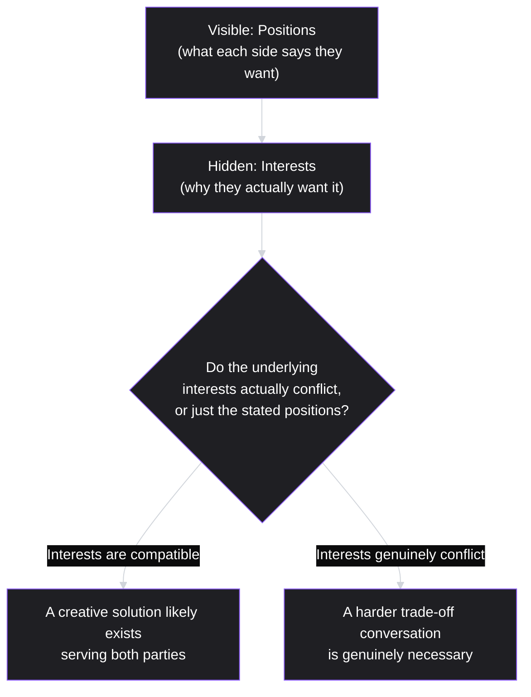
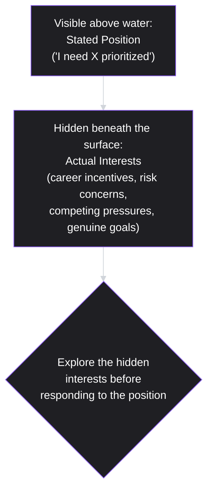

# Lesson 53: Negotiation & Influence Without Authority

## Why This Lesson Matters

This lesson returns to the condition this curriculum named in its very first lesson: a PM's responsibility without formal authority. Lessons 37, 47, and 51 have each addressed pieces of how a PM operates within that condition — building trust with engineering, managing stakeholders honestly, communicating persuasively with executives. This lesson addresses the condition directly and gives it a name: negotiation and influence without authority, the discipline of getting other people, who do not report to you and are not obligated to prioritize your request, to actually do so.

This lesson matters because a huge share of a PM's real, daily work involves exactly this challenge: convincing another team's engineering lead to prioritize a dependency your roadmap needs, persuading a skeptical stakeholder to support a direction they didn't originate, or securing a colleague's genuine buy-in rather than mere compliance. Doing this well is not about being persuasive in a manipulative sense — it's about understanding what actually drives agreement between people who have no obligation to defer to each other, and structuring requests and conversations around that understanding rather than around positional assertion, which simply doesn't work when you have no position to assert from.

---

## Learning Path

| Field | Detail |
|---|---|
| **Module** | 6 — Leadership, Communication & Career |
| **Current Lesson** | 53 of 90 |
| **Difficulty** | 5 / 10 |
| **Estimated Study Time** | 35 minutes (reading) + 15 minutes (reflection + quiz) |
| **Prerequisites** | Lesson 1 (Responsibility without authority), Lesson 37 (Working with Engineering Teams — Trust Ladder), Lesson 47 (Stakeholder Management) |
| **Next Lesson** | Lesson 54 — Managing Up and Across |
| **Future Topics Unlocked** | Lesson 54 (Managing Up and Across), Lesson 55 (Building and Leading Product Teams) — both build on the influence and coalition-building concepts introduced here |

---

## Learning Objectives

By the end of this lesson, you will be able to:

1. Distinguish interests from positions in a negotiation, and explain why negotiating over positions tends to produce worse outcomes than negotiating over underlying interests.
2. Calculate and apply BATNA (best alternative to a negotiated agreement) to assess your own and a counterpart's negotiating leverage.
3. Apply the "currencies of exchange" model to identify what you can genuinely offer someone whose cooperation you need but cannot compel.
4. Explain why building broader coalition support before a key conversation often succeeds where a single, isolated persuasion attempt fails.
5. Diagnose a failed influence attempt by identifying whether it failed due to a positional framing, a misjudged BATNA, or a lack of anything genuinely valuable offered in exchange.

---

## Prerequisites

This lesson assumes **Lesson 1's** foundational framing of the PM's responsibility-without-authority condition, since this lesson addresses that condition as its central subject. It also assumes **Lesson 37's** Trust Ladder and **Lesson 47's** stakeholder management concepts, since durable influence depends on the same trust-building behaviors those lessons established, applied here specifically to situations requiring genuine cooperation from someone with no obligation to provide it.

---

## Theory

### Interests vs. Positions

A foundational distinction from negotiation theory, most closely associated with Roger Fisher and William Ury's *Getting to Yes*: a **position** is what someone says they want ("I need your team to prioritize this integration next Sprint"); an **interest** is the underlying reason they want it (a genuine business need, a personal incentive, a concern about risk). Negotiating over positions tends to produce adversarial, zero-sum dynamics — if two positions directly conflict, one side must "win" and the other "lose." Negotiating over interests frequently reveals that two seemingly conflicting positions are actually compatible, or that a creative solution exists serving both parties' underlying interests better than either party's original stated position.

A PM negotiating for another team's engineering time who leads only with their own position ("I need this prioritized") misses the opportunity to discover the other team's actual interests (perhaps their own roadmap pressure, a concern about scope creep, or an incentive structure that rewards different outcomes) — interests that, once understood, might reveal a way to reframe the request so it serves both parties, rather than framing it as a zero-sum competition for the same scarce engineering capacity.

### BATNA: Your Leverage, and Theirs

**BATNA** (Best Alternative to a Negotiated Agreement) describes what each party would do if the current negotiation fails entirely. Understanding your own BATNA clarifies how much you should be willing to concede — a strong BATNA (a good alternative path if this specific negotiation fails) means less pressure to accept an unfavorable deal; a weak BATNA means correspondingly more pressure. Understanding the other party's likely BATNA is equally important: a counterpart with a strong alternative has little incentive to make concessions, while a counterpart with a weak alternative has more genuine reason to find an agreement with you specifically.

The overlap between what each party would accept, given their respective BATNAs, is sometimes called the **Zone of Possible Agreement (ZOPA)** — the range within which both parties' interests can genuinely be satisfied. A PM entering a negotiation without having thought through either their own BATNA or a reasonable estimate of the counterpart's is negotiating blind, unable to judge whether a given proposal is actually a good outcome or simply the first option presented.

### The Currencies of Exchange Model

A framework developed by Allan Cohen and David Bradford for influence without formal authority identifies several distinct "currencies" a person can offer in exchange for another's cooperation, even without positional power over them:

| Currency Type | Example |
|---|---|
| Task-related | Offering direct help with the other person's own priorities or problems, not just asking for help with yours |
| Position-related | Offering visibility, credit, or association with a high-profile initiative that benefits the other person's own standing |
| Relationship-related | Offering genuine trust, understanding, and a track record of reliability that makes future cooperation easier |
| Personal | Offering gratitude, recognition, or simply being someone pleasant and low-friction to work with |

The core insight this model offers: influence without authority is fundamentally an exchange, not a request — a PM asking for cooperation should think concretely about what currency they can genuinely offer in return, rather than assuming goodwill or organizational obligation alone will be sufficient motivation for someone who has no formal reason to prioritize the PM's request over their own.

### Building Coalitions Before the Key Conversation

A specific, high-leverage practice: rather than attempting to persuade a key decision-maker in a single, isolated conversation, experienced PMs frequently build broader support incrementally beforehand — discussing the idea informally with a few relevant peers or stakeholders first, incorporating their feedback, and allowing genuine consensus to form gradually, so that by the time a formal decision conversation happens, the outcome feels far less like a surprise or an imposition and far more like a natural continuation of conversations the decision-maker may have already heard about from multiple directions. This approach respects the reality that influence compounds through pre-existing relationships and prior exposure to an idea, rather than depending entirely on the persuasive power of one single moment.

---

## Common Beginner Mistakes

**Mistake 1: Leading with a position rather than exploring underlying interests**

As covered in Theory, this tends to produce adversarial, zero-sum framing and misses opportunities to discover creative solutions that would actually serve both parties' genuine underlying needs.

**Mistake 2: Entering a negotiation without having thought through BATNA — your own or the other party's**

Without this groundwork, a PM cannot judge whether a proposed outcome is genuinely favorable or simply the first thing offered, and risks either conceding too readily or holding out for something the other party has no reason to grant.

**Mistake 3: Assuming goodwill or organizational obligation alone will secure cooperation from someone with no direct authority relationship**

As covered in Theory, influence without authority is an exchange — a PM should think concretely about what genuine currency (per the Cohen/Bradford model) they can offer, rather than expecting cooperation to be freely given without any real reciprocity.

**Mistake 4: Attempting to persuade a key decision-maker in a single, high-stakes conversation with no prior groundwork**

This misses the compounding advantage of building coalition support incrementally, and risks the decision-maker experiencing the request as a surprise or an imposition rather than a natural continuation of ideas they've already had some exposure to.

**Mistake 5: Treating every negotiation as adversarial, even when interests are genuinely compatible**

Some PMs, anticipating conflict, approach every request defensively, missing opportunities where a counterpart's actual interests align closely with the PM's own and a collaborative, non-adversarial framing would have worked more effectively than a guarded, competitive one.

---

## Mental Model: The Interest Iceberg

This lesson's core takeaway tool visualizes the relationship between visible positions and hidden interests as an iceberg, where most of what actually determines a negotiation's outcome lies beneath the surface:

Use the Interest Iceberg as a standing discipline whenever a negotiation or influence attempt feels stuck: resist responding only to the other party's stated position, and instead ask directly (or infer carefully) what underlying interest that position actually serves. A negotiation that feels like an impasse at the level of positions frequently has real room for agreement at the level of interests, once both parties' actual underlying goals are surfaced and compared honestly.

---

## Real Company Example

**Microsoft**'s "One Microsoft" cultural shift under CEO Satya Nadella is directly corroborated by the company's own leadership, not just outside reporting: Kathleen Hogan, Microsoft's Chief People Officer, has described the transformation directly in on-the-record interviews, framing it as a deliberate move from a "know-it-all" culture — where individual and group status came partly from having the answer, which incentivized internal competition and made cross-group cooperation costly — to a "learn-it-all" culture, structurally reducing the silos that had previously made cross-team resource-sharing and influence especially difficult.

The underlying principle connects directly to this lesson's Theory: an organizational culture and incentive structure that rewards cross-group collaboration (rather than one that implicitly pits internal teams against each other for the same recognition or resources) makes genuine, interest-based negotiation and influence without authority meaningfully easier to practice, since teams have less structural incentive to treat every cross-group request as adversarial or zero-sum by default.

*(Source: Kathleen Hogan's on-the-record interview with i4cp and other corroborating public reporting on Nadella's cultural transformation. This curriculum does not claim certainty about how uniformly this culture is realized across every team at Microsoft's scale today.)*

---

## Real World Perspective: Negotiation & Influence Without Authority at Different Company Stages

**At a startup:**
Influence without authority is often less acute a challenge, since small teams typically share close working relationships and immediate, visible common goals, making genuine cooperation easier to secure through simple, direct conversation rather than requiring formal negotiation technique. The skills in this lesson still matter, but the stakes and structural friction are often lower at this scale.

**At a mid-size company:**
Cross-team dependencies typically multiply, and securing cooperation from teams with their own competing roadmaps and incentives becomes a genuinely frequent challenge — this is the stage where deliberately applying interests-based negotiation, BATNA awareness, and the currencies-of-exchange model becomes a valuable, distinct skill rather than something that happens automatically through proximity.

**At Big Tech:**
Cross-group negotiation is often a significant, ongoing part of a PM's role, given the scale of matrixed organizations and the genuine competition for shared, scarce resources (engineering capacity, executive attention, budget) across many teams simultaneously. The PM's job shifts toward building durable, long-term coalition relationships across the organization proactively, rather than only engaging negotiation skill reactively when a specific need arises — since, as Microsoft's cultural example illustrates, the broader organizational incentive structure significantly shapes how much genuine cooperation is available to draw on when needed.

---

## Detailed Case Study: The Prioritization Request That Failed, Then Succeeded

Consider a simplified, illustrative scenario common at PMs needing cross-team engineering support.

A PM needs a specific integration built by another team's engineering group to support a major upcoming feature. Their first attempt is direct and positional: an email explaining that the integration is "a top priority" for their own roadmap and requesting the other team schedule it into their next Sprint. The other team's engineering lead declines, citing their own team's existing commitments, and the exchange ends there, with the requesting PM concluding — incorrectly, as it turns out — that the other team is simply uncooperative.

Reflecting on the failed attempt using this lesson's frameworks, the PM tries a different approach: rather than restating the same position more forcefully, they schedule a conversation specifically to understand the other team's actual priorities and constraints. This conversation reveals the other engineering lead's real underlying interest: their team is currently under significant pressure to reduce a backlog of technical debt (echoing Lesson 39) before their own upcoming roadmap commitments, and any new, unplanned request — regardless of its stated importance to another team — reads as a direct threat to that goal. The PM also learns, through this conversation, that the requested integration, if built with a slightly different technical approach than originally specified, would actually help address one of the very technical debt items the other team was already trying to resolve.

**What went wrong the first time, and what changed?**

The first attempt failed exactly as this lesson's Theory predicts: it was framed entirely around the requesting PM's own position ("this is a priority for me"), with no attempt to understand or address the other team's actual interests, and no currency of exchange offered beyond the assertion of importance — assertion that carried no weight with a team facing its own, unrelated pressures. The second attempt succeeded because it engaged the Interest Iceberg directly: understanding the other team's genuine underlying concern (technical debt reduction) revealed a reframing where the requested integration could be positioned as *helping* address that concern, rather than competing with it — a task-related currency (per the Cohen/Bradford model) the first attempt never identified because it never asked the right questions.

This distinction — a request that competes with someone's actual priorities versus one reframed to serve them — is precisely why negotiating over interests rather than positions matters practically, not just theoretically. The broader skill of maintaining this kind of collaborative relationship with peer teams and managers on an ongoing basis, rather than only engaging it reactively during a specific negotiation, is developed further in **Lesson 54 (Managing Up and Across)**.

---

## Framework Explanation: The BATNA and Currency Worksheet

A second, more tactical tool: before an important negotiation or influence attempt, work through this structure.

| Question | Your Analysis |
|---|---|
| What is my actual position, and what interest does it serve? | State both explicitly — don't skip to the position alone |
| What is my BATNA if this specific negotiation fails? | Be honest about how strong or weak your alternative actually is |
| What is the other party's likely position, and what interest might it serve? | Consider their pressures and incentives, not just their stated request |
| What is their likely BATNA? | Consider what they'd do if they simply declined your request |
| What currency (task, position, relationship, personal) can I genuinely offer in exchange? | Identify something concrete, not just an appeal to importance or goodwill |
| Where might our actual interests overlap, even if our stated positions seem to conflict? | This is often where a workable agreement actually lives |

Completing this worksheet before a significant negotiation, as this lesson's Case Study illustrates, often reveals a workable path that a purely positional first attempt would have missed entirely.

---

## Interview Perspective: How Interviewers Think About This

**Typical question 1: "Tell me about a time you needed another team's cooperation without having any authority over them. How did you get it?"**
*What the interviewer is actually evaluating:* Whether the candidate's approach involved understanding the other party's actual interests and offering genuine reciprocal value, rather than simply asserting the importance of their own request.

**Typical question 2: "How do you decide how hard to push in a negotiation, versus when to concede?"**
*What the interviewer is actually evaluating:* Whether the candidate reasons from BATNA — their own and the other party's — rather than an intuitive sense of how forcefully to advocate, unmoored from any actual leverage analysis.

**Typical question 3: "Describe a negotiation that initially failed. What did you change, and why did it work the second time?"**
*What the interviewer is actually evaluating:* Whether the candidate can diagnose the specific reason a first attempt failed (positional framing, no understanding of the other party's interests, no currency offered) rather than attributing it vaguely to the other party being difficult, mirroring this lesson's Case Study.

---

## Summary

Negotiation and influence without authority is the practical discipline underlying this curriculum's founding observation (Lesson 1) that a PM's job carries responsibility without formal authority over most of the people whose cooperation it depends on. Negotiating over interests — the underlying reasons behind a stated position — rather than positions themselves tends to reveal creative, mutually beneficial solutions that a purely positional negotiation would miss, as this lesson's Interest Iceberg mental model illustrates. Understanding BATNA, both your own and a counterpart's, clarifies genuine leverage and helps identify a realistic Zone of Possible Agreement, preventing either premature concession or unrealistic holdout. The Cohen/Bradford currencies of exchange model reframes influence without authority as a genuine exchange — task-related, position-related, relationship-related, or personal value offered in return for cooperation — rather than an appeal to goodwill or organizational obligation alone, precisely the reframing that turned a failed cross-team prioritization request into a successful one in this lesson's Case Study, once the requesting PM understood and addressed the other team's actual underlying interest rather than simply restating their own priority more forcefully. Building coalition support incrementally, before a single high-stakes conversation, further improves the odds of genuine, durable agreement over a purely reactive, single-moment persuasion attempt.

---

## Key Takeaways

- Negotiating over interests (the underlying reasons behind a position) rather than positions themselves frequently reveals creative solutions that a purely positional negotiation would miss.
- BATNA (Best Alternative to a Negotiated Agreement) clarifies genuine negotiating leverage, both your own and a counterpart's, and helps identify a realistic Zone of Possible Agreement.
- The Cohen/Bradford currencies of exchange model (task-related, position-related, relationship-related, personal) reframes influence without authority as a genuine exchange, not an appeal to goodwill alone.
- Building coalition support incrementally before a key decision conversation often succeeds where a single, isolated persuasion attempt fails.
- A failed influence attempt should be diagnosed specifically — was it positional framing, a misjudged BATNA, or a lack of any genuine currency offered — rather than attributed vaguely to the other party being uncooperative.
- Understanding a counterpart's actual pressures and incentives can reveal a way to reframe a request as serving their interests, rather than competing with them, turning a zero-sum framing into a collaborative one.
- Organizational culture and incentive structures shape how easy or difficult genuine cross-team influence is to practice, as illustrated by Microsoft's publicly discussed cultural evolution.

---

## Cheat Sheet

*A two-minute review of everything in this lesson.*

- **Interests, not positions:** ask why someone wants what they say they want — that's where real agreement lives.
- **BATNA:** know your own and estimate theirs — it tells you genuine leverage on both sides.
- **ZOPA:** the overlap of what both parties would actually accept, given their respective BATNAs.
- **Currencies of exchange:** task, position, relationship, personal — offer something real, don't just assert importance.
- **Build coalitions first:** informal groundwork before a key conversation beats a single, isolated persuasion attempt.
- **Diagnose failed influence specifically:** positional framing? misjudged BATNA? no real currency offered? — don't just blame the other party.
- **Reframe, don't just repeat:** a request that competes with someone's priorities can often be reframed to serve them instead.

---

## Glossary

| Term | Definition | Related Concepts | Difficulty |
|---|---|---|---|
| Position (negotiation) | What someone explicitly states they want in a negotiation | Interest | 1 |
| Interest (negotiation) | The underlying reason or need behind a stated position | Position, Interest Iceberg | 1 |
| BATNA | Best Alternative to a Negotiated Agreement — what a party would do if the current negotiation fails | ZOPA | 2 |
| ZOPA (Zone of Possible Agreement) | The range within which both parties' BATNAs and interests can genuinely be satisfied | BATNA | 2 |
| Currencies of exchange | The Cohen/Bradford model of task-, position-, relationship-, and personal-related value offered in exchange for cooperation | Influence without authority | 2 |
| Interest Iceberg | This lesson's mental model: visible positions sitting above hidden, more consequential underlying interests | Interests vs. positions | 1 |

---

## Further Reading / Resources

- *Getting to Yes: Negotiating Agreement Without Giving In* by Roger Fisher and William Ury — the foundational text on interests-based negotiation and BATNA referenced throughout this lesson.
- *Influence Without Authority* by Allan R. Cohen and David L. Bradford — the source of the currencies of exchange model applied in this lesson.
- *Never Split the Difference* by Chris Voss — a practitioner-oriented treatment of negotiation technique, complementing this lesson's more academic frameworks.

---

## Flashcards

**Card 1**
- Front: What is the difference between a position and an interest in a negotiation?
- Back: A position is what someone explicitly states they want; an interest is the underlying reason or need behind that stated position.
- Difficulty: 1
- Tags: interests-vs-positions

**Card 2**
- Front: What is BATNA, and why does it matter?
- Back: Best Alternative to a Negotiated Agreement — what a party would do if the negotiation fails; it clarifies genuine leverage and how much a party should be willing to concede.
- Difficulty: 2
- Tags: batna

**Card 3**
- Front: What is ZOPA?
- Back: Zone of Possible Agreement — the range within which both parties' interests and BATNAs can genuinely be satisfied.
- Difficulty: 2
- Tags: zopa

**Card 4**
- Front: Name the four currencies in the Cohen/Bradford exchange model.
- Back: Task-related, position-related, relationship-related, and personal.
- Difficulty: 2
- Tags: currencies-of-exchange

**Card 5**
- Front: Why does building coalition support incrementally often succeed where a single, high-stakes conversation fails?
- Back: Influence compounds through prior exposure and relationships; a decision that feels like a natural continuation of ideas already discussed is less likely to feel like a surprise or imposition than one presented cold in a single conversation.
- Difficulty: 2
- Tags: coalition-building

**Card 6**
- Front: In the Detailed Case Study, what changed between the PM's failed first attempt and successful second attempt?
- Back: The first attempt was purely positional with no understanding of the other team's interests; the second attempt uncovered the other team's actual priority (technical debt reduction) and reframed the request to help serve it, rather than compete with it.
- Difficulty: 2
- Tags: case-study

## Reflection Exercise

Consider the following novel scenario: You need a design team, which reports to a different manager and has its own competing priorities, to dedicate time to a redesign your team needs for an upcoming launch. Your first informal request was met with "we're slammed right now, maybe next quarter."

There is no single correct answer to the prompts below — the goal is to practice applying this lesson's frameworks, not to reach one "right" answer.

1. Using the Interest Iceberg, what questions would you ask to understand the design team's actual underlying interests and pressures, beyond their stated position ("we're slammed")?
2. What is your own BATNA if this specific redesign request isn't granted this quarter? How does the strength or weakness of that BATNA affect how hard you should push?
3. Using the currencies of exchange model, what could you genuinely offer the design team in return for prioritizing your request, beyond simply restating its importance to you?
4. If you learn that the design team's manager is under pressure to demonstrate impact on a specific company-wide initiative, how might you reframe your request to connect with that interest?
5. Before your next direct conversation, who else might be worth talking to informally first, to build broader awareness or support for this request?

---

## Quiz

**1. What is the difference between a position and an interest in a negotiation?**
A) They are identical concepts with different names
B) A position is what someone explicitly states they want; an interest is the underlying reason or need behind that position
C) A position is always more important than an interest
D) An interest can only be identified after a negotiation has already failed

*Correct answer: B*
*Explanation: The Theory section defines these two terms exactly this way.*
*Learning objective tested: #1*
*Difficulty: Easy*

---

**2. Why does negotiating over positions tend to produce worse outcomes than negotiating over interests?**
A) Because positions are always dishonest
B) Because directly conflicting positions tend to produce adversarial, zero-sum dynamics, while underlying interests may actually be compatible or reveal a creative solution serving both parties
C) Because positions are illegal to discuss in most negotiations
D) Because interests are always identical to positions

*Correct answer: B*
*Explanation: The Theory section explains this exact dynamic — positional conflict is often zero-sum, while interests may reveal compatibility.*
*Learning objective tested: #1*
*Difficulty: Easy*

---

**3. What does BATNA stand for, and what does it represent?**
A) Best Available Time for Negotiating Agreements — a scheduling concept
B) Best Alternative to a Negotiated Agreement — what a party would do if the current negotiation fails
C) Basic Agreement Terms and Amendments — a legal document type
D) A synonym for ZOPA with no meaningful difference

*Correct answer: B*
*Explanation: The Theory section defines BATNA exactly this way.*
*Learning objective tested: #2*
*Difficulty: Easy*

---

**4. What is ZOPA?**
A) A synonym for BATNA
B) The Zone of Possible Agreement — the range within which both parties' interests and BATNAs can genuinely be satisfied
C) A specific currency in the Cohen/Bradford exchange model
D) A term used only in international trade negotiations

*Correct answer: B*
*Explanation: The Theory section defines ZOPA exactly this way.*
*Learning objective tested: #2*
*Difficulty: Easy*

---

**5. What does the Cohen/Bradford currencies of exchange model suggest about influence without authority?**
A) That influence without authority is impossible
B) That influence without authority is fundamentally an exchange, requiring the influencer to offer genuine task-related, position-related, relationship-related, or personal value in return for cooperation
C) That only formal authority can ever secure genuine cooperation
D) That goodwill alone is always sufficient to secure cooperation

*Correct answer: B*
*Explanation: The Theory section explains this exact reframing of influence without authority as a genuine exchange.*
*Learning objective tested: #3*
*Difficulty: Easy*

---

**6. In the Detailed Case Study, why did the PM's first attempt to secure the other team's engineering time fail?**
A) The other team had no engineering capacity at all
B) The request was framed entirely around the requesting PM's own position, with no attempt to understand the other team's actual interests, and no currency of exchange offered
C) The integration itself was technically impossible to build
D) The other team's manager was on vacation

*Correct answer: B*
*Explanation: The Case Study's "What went wrong the first time?" analysis explicitly attributes the failure to purely positional framing with no interest exploration or currency offered.*
*Learning objective tested: #3, #5*
*Difficulty: Easy*

---

**7. What underlying interest did the PM discover in the Detailed Case Study's second attempt?**
A) The other team simply disliked the requesting PM personally
B) The other engineering team was under pressure to reduce technical debt before their own roadmap commitments, and any new unplanned request threatened that goal
C) The other team had no manager at all
D) The other team wanted a higher budget allocation

*Correct answer: B*
*Explanation: The Case Study explicitly identifies this technical-debt-reduction pressure as the other team's actual underlying interest.*
*Learning objective tested: #5*
*Difficulty: Medium*

---

**8. How did the PM successfully reframe the request in the Case Study's second attempt?**
A) By repeating the original request more forcefully
B) By proposing the integration be built with a technical approach that would also help address one of the technical debt items the other team was already trying to resolve, turning a competing request into one that served their interest
C) By escalating the request to a senior executive to force compliance
D) By offering a financial payment to the other team

*Correct answer: B*
*Explanation: The Case Study explicitly describes this reframing as the key to the second attempt's success — connecting the request to the other team's own genuine priority.*
*Learning objective tested: #5*
*Difficulty: Medium*

---

**9. Why does this lesson recommend building coalition support incrementally before a key decision conversation?**
A) Because coalition-building is illegal in most organizations
B) Because influence compounds through prior relationships and exposure to an idea, making a decision feel like a natural continuation rather than a surprising imposition
C) Because a single conversation is always sufficient to secure any needed cooperation
D) Because coalition-building eliminates the need for any negotiation skill at all

*Correct answer: B*
*Explanation: The Theory section explains this exact compounding benefit of incremental coalition-building.*
*Learning objective tested: #4*
*Difficulty: Medium*

---

**10. What does Microsoft's publicly discussed "One Microsoft" cultural shift illustrate, according to this lesson's Real Company Example?**
A) That organizational culture has no effect on cross-team cooperation
B) That an organizational culture and incentive structure rewarding cross-group collaboration makes genuine, interest-based negotiation meaningfully easier to practice than a culture of internal competition
C) That formal authority is always required for cross-team cooperation regardless of culture
D) That Microsoft eliminated all internal team boundaries entirely

*Correct answer: B*
*Explanation: The Real Company Example explains this exact principle about organizational culture shaping the ease of cross-team influence.*
*Learning objective tested: #4*
*Difficulty: Medium*

---

**11. (Interview Reasoning) A candidate is asked how they secured another team's cooperation without formal authority, and answers: "I just explained clearly why my priority mattered, and they eventually agreed." Based on this lesson's Interview Perspective section, what is missing from this answer?**
A) Nothing; clear explanation of importance is always sufficient
B) Any evidence of exploring the other party's actual interests or offering genuine reciprocal value (a currency of exchange), rather than simply asserting the importance of the request
C) A description of a formal escalation to a senior leader
D) A demonstration of strong technical skills

*Correct answer: B*
*Explanation: The Interview Perspective section states that a strong answer involves understanding the other party's interests and offering genuine value, not simply restating importance.*
*Learning objective tested: #3, #5*
*Difficulty: Hard*

---

**12. Why should a PM think through their own BATNA before an important negotiation, according to this lesson?**
A) Because BATNA has no practical relevance to actual negotiation outcomes
B) Because it clarifies how much pressure exists to accept an unfavorable deal — a strong BATNA reduces that pressure, a weak BATNA increases it, and without this awareness a PM cannot judge whether a proposed outcome is genuinely favorable
C) Because BATNA must always be disclosed directly to the other party
D) Because only the other party's BATNA matters, never your own

*Correct answer: B*
*Explanation: The Theory section explains this exact reasoning about BATNA clarifying genuine negotiating pressure and leverage.*
*Learning objective tested: #2*
*Difficulty: Medium-Hard*

---

**13. (Product Thinking) A PM needs cooperation from a peer team but has no clear sense of what that team's actual priorities or pressures are, and no history of working with them. Using this lesson's frameworks, what is the most defensible first step?**
A) Send a direct, forceful request immediately, emphasizing how important the ask is
B) Have an exploratory conversation first, aimed at understanding the other team's actual interests and constraints (per the Interest Iceberg), before formulating a specific request or offer
C) Escalate immediately to a senior leader to force the other team's cooperation
D) Assume the other team's interests are irrelevant and proceed with the original request unchanged

*Correct answer: B*
*Explanation: This reflects the lesson's core recommended sequence — understand interests before responding to or making a specific positional request, exactly the approach that succeeded in the Case Study's second attempt.*
*Learning objective tested: #1, #5*
*Difficulty: Hard*

---

**14. Which of the following best reflects a genuine "currency of exchange" offered in a negotiation, per the Cohen/Bradford model?**
A) Simply repeating that a request is important to your own team
B) Offering direct help with the other team's own stated priority, in exchange for their cooperation on your request
C) Threatening to escalate to leadership if the other team doesn't comply
D) Assuming the other team is obligated to help regardless of any exchange

*Correct answer: B*
*Explanation: Offering direct help with the other team's own priority is a task-related currency, exactly the kind of genuine exchange this lesson's model describes, unlike the other options which involve no real reciprocity.*
*Learning objective tested: #3*
*Difficulty: Medium-Hard*

---

**15. (Product Thinking, Highest Difficulty) A PM has identified that a key stakeholder's underlying interest in a contentious decision is protecting their team's headcount and influence, which conflicts with the PM's stated position of consolidating a function under a different team. Using this lesson's frameworks, what is the most defensible next step?**
A) Continue arguing for the original position unchanged, since the stakeholder's concern is irrelevant to the PM's own priorities
B) Explore whether an alternative structure exists that addresses the PM's underlying interest (the actual business outcome needed) without requiring the specific consolidation that threatens the stakeholder's headcount and influence — searching for a solution at the level of interests rather than remaining stuck at the level of conflicting positions
C) Escalate immediately to force the stakeholder's compliance regardless of their concerns
D) Abandon the underlying business goal entirely to avoid any conflict with the stakeholder

*Correct answer: B*
*Explanation: This reflects the Interest Iceberg's core insight — when positions conflict but the underlying interests are examined honestly, a creative alternative addressing the real interest (the business outcome) without the specific threatening element (headcount/influence loss) may exist, rather than either forcing the original position or abandoning the underlying goal entirely.*
*Learning objective tested: #1, #5*
*Difficulty: Hard*

---

## Connections

| | Lesson | Core Idea Carried Forward |
|---|---|---|
| **Previous Lesson** | Lesson 52 — Storytelling and Narrative for PMs | Persuasion techniques from Lesson 52 combine with this lesson's negotiation frameworks when influence requires both compelling narrative and genuine reciprocal exchange |
| **Current Lesson** | Lesson 53 — Negotiation & Influence Without Authority | Interests vs. positions; BATNA and ZOPA; currencies of exchange; coalition-building; the Interest Iceberg |
| **Next Lesson** | Lesson 54 — Managing Up and Across | Extends this lesson's influence principles into the specific, ongoing context of managing relationships with one's own manager and peers |
| **Future Concepts Unlocked** | Lesson 55 (Building and Leading Product Teams) | Builds on coalition-building and interest-based negotiation when structuring cross-functional team dynamics |

This curriculum is designed to be read as one continuous argument, not ninety independent articles. Every lesson from here forward will assume you carry the Interest Iceberg, BATNA, and the currencies of exchange model with you — they will not be re-explained, only re-applied in new contexts.
