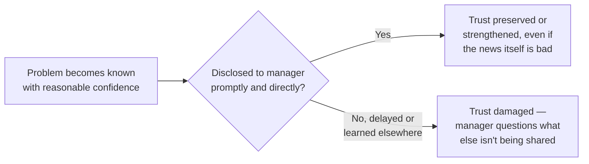
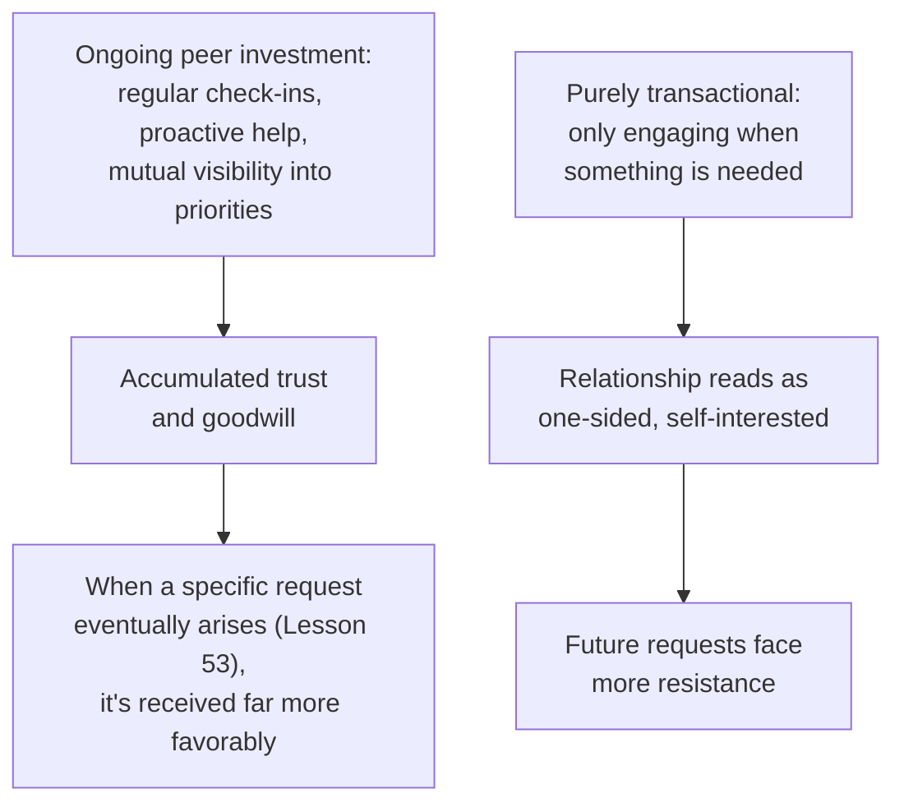
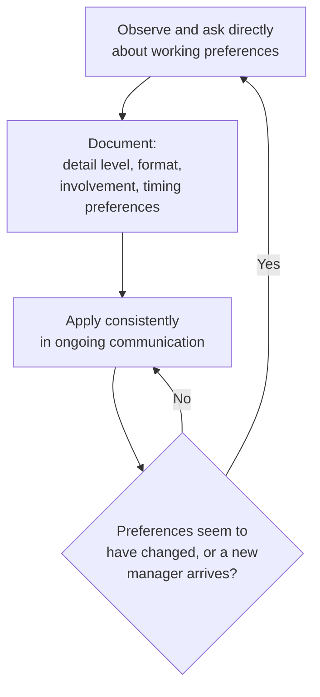

# Lesson 54: Managing Up and Across

## Why This Lesson Matters

Lesson 53 addressed negotiation and influence as a discipline applied to specific, often one-time asks — securing another team's engineering time, resolving a particular contentious decision. This lesson addresses something related but structurally different: the ongoing, ambient relationship management a PM maintains continuously with their own manager (managing up) and with peers across the organization (managing across), independent of any single specific request. These relationships are the accumulated context and trust that make Lesson 53's negotiation techniques work when they're actually needed — a PM who has never invested in the ongoing relationship has far less coalition support and goodwill to draw on when a specific, high-stakes ask arrives.

This lesson matters because many PMs treat their relationship with their own manager and peer stakeholders as something that simply happens in the background, rather than something to be actively and deliberately managed — and the PMs who manage these relationships well are consistently better positioned to get support, avoid unpleasant surprises, and navigate organizational friction than those who leave these relationships to develop passively. Managing up is not about flattery or manipulation; it's about proactively ensuring your manager has the information and context they need, adapted to how they actually prefer to receive it, before they have to ask for it.

---

## Learning Path

| Field | Detail |
|---|---|
| **Module** | 6 — Leadership, Communication & Career |
| **Current Lesson** | 54 of 90 |
| **Difficulty** | 4 / 10 |
| **Estimated Study Time** | 30 minutes (reading) + 15 minutes (reflection + quiz) |
| **Prerequisites** | Lesson 47 (Stakeholder Management — power/interest grid), Lesson 51 (Communicating with Executives — Altitude Dial), Lesson 53 (Negotiation & Influence Without Authority — currencies of exchange) |
| **Next Lesson** | Lesson 55 — Building and Leading Product Teams |
| **Future Topics Unlocked** | Lesson 55 (Building and Leading Product Teams), Lesson 56 (Product Management Career Paths) — both build on the ongoing relationship-maintenance principles introduced here |

---

## Learning Objectives

By the end of this lesson, you will be able to:

1. Apply the "no surprises" principle to managing up, explaining why proactive disclosure of bad news preserves more trust than delayed or passive disclosure.
2. Adapt communication style to a specific manager's working preferences, using a structured working-styles framework rather than a one-size-fits-all approach.
3. Distinguish managing up (relationship with one's own manager) from managing across (ongoing peer relationships), and explain why each requires a distinct, deliberate maintenance practice.
4. Explain why ongoing peer relationship investment, maintained independent of any specific request, produces more durable cooperation than relationships activated only when something is needed.
5. Diagnose a damaged manager or peer relationship by identifying whether the root cause was a surprise, a style mismatch, or a purely transactional pattern of engagement.

---

## Prerequisites

This lesson assumes **Lesson 47's** power/interest grid and **Lesson 51's** Altitude Dial concept, since managing up is, in large part, applying those same audience-tailoring principles specifically and continuously to one's own manager. It also assumes **Lesson 53's** currencies of exchange model, since this lesson's treatment of peer relationships (managing across) extends that model from a single negotiation into an ongoing, maintained relationship.

---

## Theory

### The "No Surprises" Principle

The single most consequential practice in managing up is ensuring a manager never learns significant bad news about your work from someone else, or later than they reasonably should have. The **no surprises principle** means proactively surfacing problems, risks, and setbacks to your manager as soon as they're known with reasonable confidence, rather than waiting until a problem is fully resolved (hoping to present only good news) or until someone else raises it first. A manager who consistently learns about problems from a PM directly and early develops confidence in that PM's judgment and transparency; a manager who learns about the same category of problem from someone else, or well after the PM already knew, reasonably begins to wonder what else might be similarly withheld.

This directly extends Lesson 47's difficult-news framework, applied specifically and continuously to the manager relationship: delivering bad news directly, promptly, with clear reasoning, is not just a one-time technique for a specific difficult conversation — it's an ongoing discipline that defines how a manager relationship develops over time.

### Adapting to a Manager's Working Style

Managers vary meaningfully in how they prefer to receive information and make decisions, and adapting to these preferences — rather than expecting a manager to adapt to a PM's own natural style — is a core managing-up skill. Some managers prefer detailed written updates they can read at their own pace; others prefer brief verbal check-ins and find long documents a burden. Some want to be looped into decisions early and often; others prefer to delegate broadly and be informed only at key checkpoints. Some communicate primarily through structured 1:1 meetings; others are more responsive to asynchronous, ongoing updates.

| Style Dimension | Question to Ask (or Infer) |
|---|---|
| Detail preference | Does this manager want comprehensive detail, or a high-altitude summary with detail available on request? |
| Format preference | Does this manager engage more with written documents, verbal conversation, or a combination? |
| Involvement preference | Does this manager want to be consulted early and often on decisions, or prefer broad delegation with periodic checkpoints? |
| Timing preference | Does this manager prefer scheduled, structured updates, or ongoing, as-needed communication? |

Adapting to a manager's actual preferences along these dimensions — rather than communicating in whatever style feels most natural to the PM personally — tends to produce a smoother, more trusting relationship, echoing this curriculum's repeated emphasis (Lesson 47, Lesson 51) on tailoring communication to the actual audience rather than a single default style.

### Managing Across: The Ongoing Peer Relationship

**Managing across** refers to the deliberate, ongoing maintenance of relationships with peers — other PMs, cross-functional partners, adjacent team leads — independent of any specific, immediate request. This extends Lesson 53's currencies of exchange model from a single negotiation into a sustained practice: a PM who regularly checks in with peer teams, offers help proactively, and maintains visibility into their priorities and pressures — even when nothing specific is currently needed from them — builds a reserve of goodwill and mutual understanding that makes any future specific request (exactly the kind of negotiation Lesson 53 covers) far more likely to succeed.

A PM who only reaches out to a peer team when they need something specific — never otherwise investing in the relationship — is, in effect, attempting to draw on a currency-of-exchange account they've never actually deposited into, and should not be surprised when that account has little goodwill available when it's finally needed.

---

## Common Beginner Mistakes

**Mistake 1: Waiting to disclose bad news until it's fully resolved, hoping to present only good outcomes**

As covered in Theory, this risks a manager learning about the underlying problem from someone else, or learning that it existed for longer than they were told, both of which damage trust more than the original bad news itself would have.

**Mistake 2: Communicating with a manager in whatever style feels most natural to the PM, rather than adapting to the manager's actual preferences**

A detail-oriented PM working for a manager who strongly prefers high-altitude summaries (or vice versa) creates friction that has nothing to do with the substance of the work, simply because the communication format doesn't match the manager's actual needs.

**Mistake 3: Only engaging with peer teams transactionally, when something specific is needed**

As covered in Theory, this produces a one-sided relationship pattern that peers reasonably notice, making future requests less likely to succeed than they would be with a peer relationship maintained through ongoing, non-transactional investment.

**Mistake 4: Assuming a manager's working style preferences are fixed and identical to a previous manager's**

A PM moving to a new manager, or a manager changing roles, should actively re-assess working style preferences rather than assuming continuity — applying an old manager's preferred style to a new manager risks the exact mismatch Mistake 2 describes.

**Mistake 5: Treating managing up as flattery or telling a manager only what they want to hear**

This confuses managing up with ingratiation — genuine managing up is about ensuring accurate, timely, well-adapted communication, including uncomfortable information, not about curating an artificially positive picture that will eventually be contradicted by reality.

---

## Mental Model: The Manager Operating Manual

This lesson's core takeaway tool is a structured practice for documenting and applying a specific manager's actual working preferences, rather than relying on assumption or a generic default approach:

Use the Manager Operating Manual as a standing practice: rather than guessing at a manager's preferences indefinitely, ask directly (most managers respond well to a direct question like "how do you prefer to receive updates — detailed written docs, or brief verbal check-ins?") and revisit the answer periodically, since preferences can shift as trust builds or circumstances change, and since a new manager should never be assumed to share an old manager's exact preferences.

---

## Real Company Example

**Andy Grove**'s *High Output Management* (1983) — written from his years running Intel, and still widely assigned in tech management today — makes a specific, structural argument about "managing up" through the one-on-one meeting that goes further than generic communication advice: Grove argued the one-on-one should be regarded as *the subordinate's meeting*, with its agenda and pacing set by the report, not the manager, precisely because the report typically holds information the manager doesn't have yet (a stuck project, an early warning sign, a disagreement worth surfacing) and a manager-driven agenda tends to crowd that information out in favor of status-checking the manager already cares about.

This is a directly useful, checkable illustration of this lesson's core argument rather than generic advice to "communicate proactively": Grove's specific mechanism — who sets the agenda — is itself a concrete practice a PM can adopt in their own upward communication, and it reframes "managing up" as actively creating the structural opportunity for information to surface, not just being transparent when directly asked.

*(Source: Andrew S. Grove's *High Output Management*, a firsthand account written by Grove himself during his tenure as Intel's CEO. This curriculum does not claim certainty about how universally this specific format is practiced across companies today, though it remains widely referenced management guidance.)*

The underlying principle connects directly to this lesson's Theory: proactive, structurally-created opportunities for upward information flow — not passive reporting or waiting to be asked — tend to produce stronger, more trusting manager relationships, and Grove's agenda-ownership mechanism is one concrete way to build that structure deliberately rather than leave it to individual initiative alone.

---

## Real World Perspective: Managing Up and Across at Different Company Stages

**At a startup:**
Managing up is often less formal, since a PM may work in close daily proximity to their manager (frequently a founder), with natural, frequent informal communication reducing the risk of significant surprises simply through sheer contact frequency. The habits from this lesson are still valuable to build early, even if the immediate stakes feel lower at this scale.

**At a mid-size company:**
Managing up typically requires more deliberate practice, since a manager now oversees multiple PMs or a broader scope and has correspondingly less bandwidth for passive, ambient awareness of any one report's specific situation — the "no surprises" discipline and working-style adaptation become genuinely necessary practices rather than automatic byproducts of proximity.

**At Big Tech:**
Managing up and across often becomes especially consequential given organizational scale and the number of peer relationships a PM may need to maintain simultaneously across many adjacent teams. The PM's job shifts toward systematically prioritizing which peer relationships warrant the most ongoing investment (echoing Lesson 47's power/interest reasoning, applied here to peers rather than external stakeholders) and toward maintaining a genuinely current, revisited Manager Operating Manual as reporting structures and manager assignments change more frequently at scale.

---

## Detailed Case Study: The Surprise in the Leadership Review

Consider a simplified, illustrative scenario common among PMs new to managing up deliberately.

A PM discovers, roughly three weeks before a major planned launch, that a key dependency from another team is significantly behind schedule and will likely delay the launch by several weeks. Uncertain how their manager will react and hoping the other team might still recover the timeline, the PM decides to wait and see, rather than raising the issue immediately, reasoning that it would be better to have a fully resolved update (either "we recovered the timeline" or "here's our complete revised plan") rather than raising an unresolved problem.

Two weeks later, in a broader leadership review meeting the PM's manager attends, another executive mentions, in passing, having heard from the dependency team about their own delays and asks the PM's manager directly what impact this will have on the upcoming launch — a question the manager cannot answer, since the PM never raised it with them. The manager, visibly caught off guard in front of other leaders, later has a pointed conversation with the PM about being informed of risks proactively, and the PM notices a subtle but real decline in how readily the manager takes their subsequent updates at face value.

**What went wrong?**

This is a direct, worked violation of the no-surprises principle: the PM had genuine, reasonable-confidence knowledge of a significant risk three weeks before the launch, and chose to delay disclosure specifically to avoid an uncomfortable, unresolved conversation — precisely Mistake 1's failure pattern. The damage wasn't primarily caused by the dependency delay itself, which was outside the PM's direct control and not, by itself, a reflection of their judgment; the damage came from the manager learning about it from someone else, in a public setting, which directly and visibly signaled a gap between what the PM knew and what the PM had shared.

The corrective practice going forward required exactly what this lesson's Theory prescribes: raising risks as soon as they're known with reasonable confidence, even (especially) when the situation isn't yet fully resolved, framed honestly as "here's a risk I'm tracking and here's my current plan for managing it," rather than waiting for a tidy, complete resolution before saying anything. This does not mean raising every minor, low-confidence concern reflexively — that would create its own noise and erode a manager's ability to distinguish genuine signal from routine uncertainty — but a risk of this scale and confidence level, three weeks before a major launch, clearly warranted immediate, proactive disclosure.

---

## Framework Explanation: The Working Styles Matrix

A second, more tactical tool: use this table to assess and adapt to a specific manager's (or key peer's) working style along the dimensions most likely to cause friction if mismatched.

| Dimension | Style A | Style B | How to Check |
|---|---|---|---|
| Detail level | Wants comprehensive detail by default | Wants high-altitude summary, detail on request | Ask directly, or observe which they engage with more in practice |
| Format | Prefers written documents | Prefers verbal conversation | Notice which format prompts more engaged response |
| Involvement | Wants to be consulted early and often | Prefers broad delegation, periodic checkpoints | Ask directly about their preferred cadence of involvement |
| Timing | Prefers scheduled, structured updates | Prefers ongoing, as-needed communication | Observe responsiveness patterns to each approach |

A PM who has never explicitly worked through this matrix for their current manager is very likely relying on assumption rather than genuine understanding, risking exactly the kind of style mismatch this lesson's Mistake 2 describes.

---

## Interview Perspective: How Interviewers Think About This

**Typical question 1: "How do you handle disclosing bad news or risks to your manager?"**
*What the interviewer is actually evaluating:* Whether the candidate defaults to proactive, early disclosure (the no-surprises principle) rather than waiting for a fully resolved situation, mirroring this lesson's Case Study.

**Typical question 2: "How do you adapt your communication style to different managers you've worked with?"**
*What the interviewer is actually evaluating:* Whether the candidate can articulate specific, observed differences in working style and describe genuinely adapting to them, rather than describing a single, unchanging communication approach applied regardless of manager.

**Typical question 3: "How do you maintain relationships with peer teams you depend on, even when you don't currently need anything from them?"**
*What the interviewer is actually evaluating:* Whether the candidate practices genuine, ongoing peer investment (managing across) rather than only engaging peers transactionally when a specific need arises.

---

## Summary

Managing up and managing across are the ongoing, ambient relationship disciplines that make the negotiation techniques from Lesson 53 actually work when they're needed, since accumulated trust and goodwill — not a single persuasive moment — is what a PM draws on during any specific ask. The no-surprises principle means proactively disclosing risks and bad news to a manager as soon as they're known with reasonable confidence, rather than waiting for full resolution — a PM who delays disclosure risks a manager learning about a problem from someone else, which damages trust far more than the underlying bad news itself, precisely the failure illustrated in this lesson's Case Study of a launch delay surfaced first in a leadership review rather than by the PM directly. Adapting to a manager's specific working-style preferences — detail level, format, involvement, and timing — using a structured Working Styles Matrix, produces smoother communication than assuming a manager will adapt to the PM's own natural style, or than assuming a new manager shares a previous one's preferences. Managing across extends Lesson 53's currencies of exchange model into an ongoing practice: peer relationships maintained through regular, non-transactional investment accumulate goodwill that makes future specific requests far more likely to succeed than relationships engaged only transactionally, when something is immediately needed.

---

## Key Takeaways

- The no-surprises principle means proactively disclosing risks and bad news to a manager as soon as they're known with reasonable confidence, not waiting for full resolution.
- A manager learning about a problem from someone else, or later than they reasonably should have, damages trust more than the underlying bad news itself.
- Adapting to a manager's specific working-style preferences (detail level, format, involvement, timing) using a structured framework produces smoother communication than assuming a single default style will work for everyone.
- A new manager, or a manager changing roles, should never be assumed to share a previous manager's exact working-style preferences — reassess directly.
- Managing across extends Lesson 53's currencies of exchange model into an ongoing practice: peer relationships maintained through regular, non-transactional investment produce more durable cooperation than purely transactional engagement.
- A PM who only engages peer teams when something specific is needed is drawing on a goodwill account they've never actually invested in.
- Managing up is not flattery or curating an artificially positive picture — it's ensuring accurate, timely, well-adapted communication, including uncomfortable information.

---

## Cheat Sheet

*A two-minute review of everything in this lesson.*

- **No surprises:** disclose risks and bad news as soon as reasonably known — don't wait for full resolution.
- **Surprise damage > bad-news damage:** a manager learning from someone else hurts trust more than the news itself.
- **Working Styles Matrix:** detail level, format, involvement, timing — ask directly, don't assume.
- **New manager ≠ old manager's preferences:** reassess style explicitly with every new manager.
- **Managing across = ongoing investment:** maintain peer relationships continuously, not just when you need something.
- **Transactional-only peer engagement backfires:** it reads as one-sided and makes future requests harder.
- **Managing up ≠ flattery:** it's accurate, timely, adapted communication — including the uncomfortable parts.

---

## Glossary

| Term | Definition | Related Concepts | Difficulty |
|---|---|---|---|
| No surprises principle | Proactively disclosing risks and bad news to a manager as soon as reasonably known, rather than waiting for full resolution | Managing up | 1 |
| Managing up | The deliberate, ongoing practice of ensuring a manager has the information and communication style they need | No surprises principle | 1 |
| Managing across | The deliberate, ongoing maintenance of peer relationships, independent of any specific immediate request | Currencies of exchange (Lesson 53) | 1 |
| Manager Operating Manual | This lesson's mental model: a documented, periodically revisited understanding of a specific manager's working-style preferences | Working Styles Matrix | 2 |

---

## Further Reading / Resources

- *Managing Up: How to Move Up, Win at Work, and Succeed with Any Type of Boss* by Mary Abbajay — a dedicated practitioner treatment of managing-up technique and style adaptation.
- "Managing Oneself" by Peter Drucker — foundational, widely referenced writing on understanding one's own and one's manager's working style.
- *The First 90 Days* by Michael Watkins — relevant background on quickly assessing and adapting to a new manager's or organization's working style.

---

## Flashcards

**Card 1**
- Front: What is the "no surprises" principle?
- Back: Proactively disclosing risks and bad news to a manager as soon as they're known with reasonable confidence, rather than waiting until the situation is fully resolved.
- Difficulty: 1
- Tags: no-surprises

**Card 2**
- Front: Why does a manager learning about a problem from someone else damage trust more than the bad news itself?
- Back: It signals a gap between what the PM knew and what they shared, making the manager reasonably wonder what else might be similarly withheld — the surprise itself, not the underlying news, is what erodes trust.
- Difficulty: 2
- Tags: surprise-vs-bad-news

**Card 3**
- Front: What four dimensions does the Working Styles Matrix use to assess a manager's preferences?
- Back: Detail level, format (written vs. verbal), involvement (consulted early vs. delegated), and timing (scheduled vs. ongoing).
- Difficulty: 2
- Tags: working-styles-matrix

**Card 4**
- Front: What's the difference between managing up and managing across?
- Back: Managing up is the ongoing relationship discipline with one's own manager; managing across is the ongoing, deliberate maintenance of peer relationships, independent of any specific immediate request.
- Difficulty: 1
- Tags: up-vs-across

**Card 5**
- Front: Why does purely transactional peer engagement (only reaching out when something is needed) tend to backfire?
- Back: It produces a one-sided relationship pattern peers reasonably notice, making future specific requests less likely to succeed than they would be with a relationship maintained through ongoing, non-transactional investment.
- Difficulty: 2
- Tags: transactional-engagement

**Card 6**
- Front: In the Detailed Case Study, what was the actual root cause of the trust damage, as opposed to the launch delay itself?
- Back: The manager learned about the delay risk from another executive in a public leadership review, rather than from the PM directly and early — the surprise, not the underlying delay (which was outside the PM's direct control), caused the trust damage.
- Difficulty: 2
- Tags: case-study

## Reflection Exercise

Consider the following novel scenario: You've just started reporting to a new manager after a reorganization. Your previous manager preferred brief, verbal daily check-ins and minimal written documentation. You don't yet know your new manager's preferences.

There is no single correct answer to the prompts below — the goal is to practice applying the Manager Operating Manual and Working Styles Matrix, not to reach one "right" answer.

1. Using the Manager Operating Manual practice, what would be your first concrete step in this new reporting relationship?
2. What specific questions could you ask your new manager directly to understand their working-style preferences, without assuming they share your previous manager's style?
3. If, a few weeks in, you notice your new manager seems disengaged during verbal check-ins but responds quickly and thoughtfully to written updates, what would you adjust?
4. You discover a moderate risk to a project timeline two weeks into this new relationship, before you've fully learned your new manager's preferences. Using the no-surprises principle, how would you decide when and how to raise it?
5. How would you begin investing in managing across with peer teams in this reorganized structure, given that some working relationships may also be new?

---

## Quiz

**1. What does the "no surprises" principle require?**
A) Waiting until a problem is fully resolved before informing a manager
B) Proactively disclosing risks and bad news to a manager as soon as they're known with reasonable confidence
C) Only sharing positive updates with a manager
D) Informing a manager only when directly asked

*Correct answer: B*
*Explanation: The Theory section defines the no-surprises principle exactly this way.*
*Learning objective tested: #1*
*Difficulty: Easy*

---

**2. Why does a manager learning about a problem from someone else damage trust more than the underlying bad news itself?**
A) It doesn't; the underlying bad news is always the primary source of damage
B) It signals a gap between what the PM knew and what they shared, causing the manager to reasonably question what else might be withheld
C) Because managers are never upset by bad news itself, only by how it's delivered
D) Because bad news delivered by a third party is always inaccurate

*Correct answer: B*
*Explanation: The Theory section explains this exact dynamic — the surprise itself, not the news, is what damages trust.*
*Learning objective tested: #1*
*Difficulty: Easy*

---

**3. What four dimensions does the Working Styles Matrix use to assess a manager's communication preferences?**
A) Salary, title, tenure, and department
B) Detail level, format, involvement, and timing
C) Age, education, location, and team size
D) Scrum, Kanban, hybrid, and waterfall

*Correct answer: B*
*Explanation: The Framework Explanation section explicitly lists these four dimensions.*
*Learning objective tested: #2*
*Difficulty: Easy*

---

**4. Why does this lesson caution against assuming a new manager shares a previous manager's working-style preferences?**
A) Because all managers have identical preferences by default
B) Because working styles vary meaningfully between individuals, and assuming continuity risks the same kind of style mismatch that causes friction unrelated to the substance of the work
C) Because new managers are legally required to disclose their preferences in writing
D) Because working styles never change over a career

*Correct answer: B*
*Explanation: Common Beginner Mistake #4 explains this exact risk of assuming preference continuity across different managers.*
*Learning objective tested: #2*
*Difficulty: Easy*

---

**5. What is the key difference between managing up and managing across?**
A) They are identical practices applied to different job titles
B) Managing up is the ongoing relationship discipline with one's own manager; managing across is the ongoing maintenance of peer relationships, independent of any specific request
C) Managing across only applies to negotiations, never to ongoing relationships
D) Managing up only matters during performance reviews

*Correct answer: B*
*Explanation: The Theory section explicitly distinguishes these two practices this way.*
*Learning objective tested: #3*
*Difficulty: Easy*

---

**6. How does managing across extend Lesson 53's currencies of exchange model?**
A) It replaces the currencies of exchange model entirely with an unrelated framework
B) It applies the same exchange logic to an ongoing, continuously maintained relationship rather than a single negotiation, building accumulated goodwill over time
C) It only applies to relationships with formal authority, unlike Lesson 53
D) It has no relationship to Lesson 53's concepts at all

*Correct answer: B*
*Explanation: The Theory section explicitly describes managing across as extending Lesson 53's model into an ongoing practice.*
*Learning objective tested: #4*
*Difficulty: Easy*

---

**7. Why does a purely transactional pattern of peer engagement tend to make future requests harder to secure?**
A) It doesn't; transactional engagement always produces the same results as ongoing investment
B) It produces a one-sided relationship pattern peers reasonably notice, since no goodwill or reciprocal value has been invested in the relationship independent of specific asks
C) Because transactional engagement is illegal in most organizations
D) Because peers are obligated to help regardless of relationship history

*Correct answer: B*
*Explanation: Common Beginner Mistake #3 and the Theory section both explain this exact dynamic.*
*Learning objective tested: #4*
*Difficulty: Medium*

---

**8. In the Detailed Case Study, what was the actual root cause of the damage to the manager relationship?**
A) The launch delay itself, which was outside the PM's direct control
B) The manager learning about the delay risk from another executive in a public leadership review, rather than from the PM directly and early
C) The dependency team's poor performance
D) The PM's lack of technical skill

*Correct answer: B*
*Explanation: The Case Study's "What went wrong?" section explicitly attributes the damage to the surprise itself, not the underlying delay.*
*Learning objective tested: #5*
*Difficulty: Medium*

---

**9. What was the PM's reasoning for delaying disclosure in the Detailed Case Study, and why was this reasoning flawed?**
A) The PM wanted to avoid ever discussing the issue at all; this was flawed because avoidance is never acceptable
B) The PM wanted to present a fully resolved update rather than an unresolved risk; this was flawed because it left the manager without timely information about a significant, reasonably-confident risk
C) The PM believed the manager would not care about the delay; this was flawed because all managers care equally about every issue
D) The PM had no reasoning at all for the delay

*Correct answer: B*
*Explanation: The Case Study explicitly describes this reasoning (waiting for a tidy resolution) and identifies it as the specific flaw underlying Mistake 1.*
*Learning objective tested: #1, #5*
*Difficulty: Medium*

---

**10. Why does this lesson caution against raising every minor, low-confidence concern reflexively, even while endorsing proactive disclosure?**
A) Because no risks should ever be raised proactively
B) Because reflexively raising every minor concern would create noise and erode a manager's ability to distinguish genuine signal from routine uncertainty
C) Because managers are never interested in any risks at all
D) Because minor concerns are always resolved automatically without any communication

*Correct answer: B*
*Explanation: The Case Study's corrective practice discussion explicitly notes this balance — proactive disclosure of significant, reasonably-confident risks, not reflexive noise about every minor uncertainty.*
*Learning objective tested: #1*
*Difficulty: Medium*

---

**11. (Interview Reasoning) A candidate is asked how they adapt their communication style to different managers, and answers: "I communicate the same way with everyone, since that's what feels most natural and efficient to me." Based on this lesson's Interview Perspective section, what is the weakness in this answer?**
A) There is no weakness; a single consistent style is always most effective
B) It fails to describe genuine adaptation to a manager's specific working-style preferences, applying instead a single default style regardless of what actually works best for that manager
C) It correctly demonstrates strong personal consistency
D) It shows appropriate confidence in one's own communication approach

*Correct answer: B*
*Explanation: The Interview Perspective section states that a strong answer describes specific, observed style differences and genuine adaptation, not a single unchanging approach.*
*Learning objective tested: #2, #5*
*Difficulty: Hard*

---

**12. Why does this lesson explicitly distinguish managing up from flattery or telling a manager only what they want to hear?**
A) Because flattery and managing up are actually identical practices
B) Because genuine managing up is about ensuring accurate, timely, well-adapted communication, including uncomfortable information — not curating an artificially positive picture that will eventually be contradicted by reality
C) Because managers always prefer flattery over accurate information
D) Because flattery is a required component of effective managing up

*Correct answer: B*
*Explanation: Common Beginner Mistake #5 explicitly makes this distinction between genuine managing up and ingratiating, artificially positive communication.*
*Learning objective tested: #5*
*Difficulty: Medium-Hard*

---

**13. (Product Thinking) A PM notices their manager seems to disengage during long written status reports but responds enthusiastically and asks detailed questions during brief verbal updates. Using the Working Styles Matrix, what should the PM do?**
A) Continue sending long written reports regardless, since that's the PM's own preferred format
B) Shift toward brief verbal updates as the primary communication format for this manager, based on the observed engagement pattern, while still making detailed written material available if requested
C) Stop communicating with this manager entirely
D) Insist the manager adapt to the PM's preferred written format instead

*Correct answer: B*
*Explanation: This reflects the Working Styles Matrix's core recommendation — observing actual engagement patterns and adapting to the manager's real preferences, rather than expecting the manager to adapt to the PM's own natural style.*
*Learning objective tested: #2*
*Difficulty: Hard*

---

**14. Which of the following best reflects genuine managing-across practice, per this lesson?**
A) Reaching out to a peer team only when a specific resource or favor is needed
B) Regularly checking in with a peer team, offering proactive help, and maintaining mutual visibility into priorities, independent of any current specific need
C) Avoiding any contact with peer teams until a formal negotiation is required
D) Only communicating with peers through a manager as an intermediary

*Correct answer: B*
*Explanation: This reflects the ongoing, non-transactional investment this lesson defines as genuine managing-across practice, in contrast to purely transactional or avoidant patterns.*
*Learning objective tested: #4*
*Difficulty: Medium-Hard*

---

**15. (Product Thinking, Highest Difficulty) A PM has a new manager whose working-style preferences are still unclear, and simultaneously discovers a moderate, not-yet-fully-confirmed risk to a major deliverable. Using this lesson's frameworks together, what is the most defensible approach?**
A) Wait until the working relationship with the new manager is fully established before ever raising any risks, regardless of severity
B) Proactively disclose the risk now, using a reasonably cautious, appropriately-hedged framing given its not-yet-fully-confirmed status (echoing Lesson 35's Confidence Gradient), while also using this early interaction as an opportunity to learn more about the new manager's preferred communication style through direct observation and inquiry
C) Avoid mentioning the risk at all until it either resolves itself or becomes undeniable
D) Escalate the risk immediately to senior leadership without ever informing the direct manager first

*Correct answer: B*
*Explanation: This combines the no-surprises principle (proactive, appropriately-hedged disclosure per Lesson 35's Confidence Gradient) with the Manager Operating Manual practice (using early interactions to learn a new manager's style), rather than either delaying disclosure indefinitely or bypassing the direct manager relationship entirely.*
*Learning objective tested: #1, #2, #5*
*Difficulty: Hard*

---

## Connections

| | Lesson | Core Idea Carried Forward |
|---|---|---|
| **Previous Lesson** | Lesson 53 — Negotiation & Influence Without Authority | Extends the currencies of exchange model from a single negotiation into ongoing, ambient relationship maintenance |
| **Current Lesson** | Lesson 54 — Managing Up and Across | No surprises principle; Working Styles Matrix; Manager Operating Manual; managing up vs. across |
| **Next Lesson** | Lesson 55 — Building and Leading Product Teams | Builds on relationship-management discipline when structuring and leading a broader product organization |
| **Future Concepts Unlocked** | Lesson 56 (Product Management Career Paths) | Builds on managing-up practice when discussing career growth conversations with managers |

This curriculum is designed to be read as one continuous argument, not ninety independent articles. Every lesson from here forward will assume you carry the no-surprises principle and the Working Styles Matrix with you — they will not be re-explained, only re-applied in new contexts.
