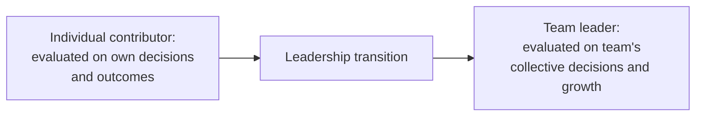
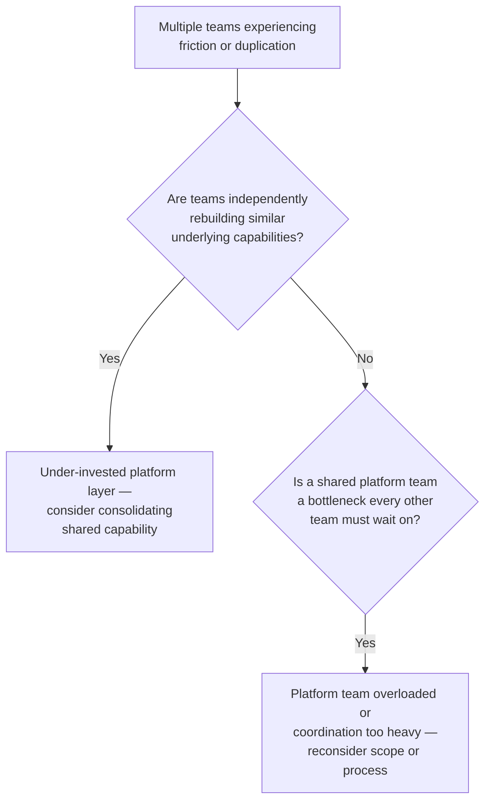
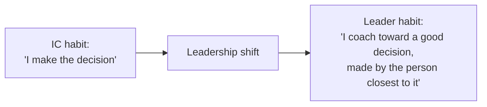

# Lesson 55: Building and Leading Product Teams

## Why This Lesson Matters

Every lesson in this curriculum so far has addressed the work of an individual PM operating within a team, a stakeholder network, and an organization. This lesson addresses a genuine inflection point in many PM careers: the shift from doing product work individually to building and leading a team of PMs, where success is measured not by the quality of your own individual decisions, but by the quality of decisions made by people you lead, most of whom you cannot and should not make every decision for personally.

This lesson matters because this transition is one of the most commonly mishandled in product management, precisely because the skills that make someone an excellent individual contributor PM — deep involvement in the details, strong personal judgment on prioritization and trade-offs, direct ownership of outcomes — do not automatically transfer to leading a team, and in some cases actively work against effective leadership if not deliberately adapted. A new PM leader who continues personally making every decision their team should be making has not actually become a leader; they have simply become a bottleneck with a new title.

---

## Learning Path

| Field | Detail |
|---|---|
| **Module** | 6 — Leadership, Communication & Career |
| **Current Lesson** | 55 of 90 |
| **Difficulty** | 5 / 10 |
| **Estimated Study Time** | 35 minutes (reading) + 15 minutes (reflection + quiz) |
| **Prerequisites** | Lesson 37 (Working with Engineering Teams — Trust Ladder, team boundaries), Lesson 53 (Negotiation & Influence Without Authority — coalition-building) |
| **Next Lesson** | Lesson 56 — Product Management Career Paths |
| **Future Topics Unlocked** | Lesson 56 (Product Management Career Paths), Lesson 57 (Ethics in Product Management) — both build on the leadership and organizational design concepts introduced here |

---

## Learning Objectives

By the end of this lesson, you will be able to:

1. Explain the core shift required when moving from individual-contributor PM work to leading a team of PMs, and identify the specific habits that must change.
2. Compare common product organization structures (functional, platform-based, customer-segment-based) and their trade-offs.
3. Apply team topology principles to diagnose whether a product organization's structure is creating unnecessary coordination overhead or duplicated effort.
4. Explain the specific risks of a new PM leader failing to delegate, and describe concrete delegation practices that avoid becoming a bottleneck.
5. Diagnose a struggling product organization by distinguishing a structural (org design) problem from an individual leadership (delegation, coaching) problem.

---

## Prerequisites

This lesson assumes **Lesson 37's** discussion of team boundaries and the reference to Matthew Skelton and Manuel Pais's *Team Topologies*, since this lesson develops those team-structure concepts in much greater depth, now applied specifically to organizing multiple product teams rather than a single PM-engineering relationship. It also assumes **Lesson 53's** coalition-building and influence concepts, since leading a team of PMs requires exactly these same skills, now applied to direct reports rather than peers.

---

## Theory

### The Core Shift: From Doing to Enabling

The central adjustment required when moving from individual-contributor PM work to leading a team of PMs is a shift from personally making decisions to enabling other people to make good decisions. This is a genuinely different skill, not simply "the same job at a larger scale." An individual-contributor PM is evaluated on the quality of their own prioritization, their own stakeholder relationships, their own product judgment. A PM leader is evaluated on whether the PMs they lead are making consistently good decisions, building trust with their own stakeholders, and growing in their own judgment over time — outcomes a leader achieves primarily through coaching, structure, and delegation, not through personally re-deciding everything their reports bring to them.

A specific, common trap at this transition: a new PM leader, faced with a decision one of their reports brings to them, simply makes the call themselves — faster in the moment, and often genuinely correct, but corrosive over time, since it prevents the report from developing their own judgment and trains the whole team to bring decisions upward rather than resolving them independently. The better practice, developed further below, is coaching the report toward their own good decision rather than substituting the leader's decision for it.

### Common Product Organization Structures

As a product organization grows beyond a single team, it must choose a structure for organizing multiple PMs and their teams:

| Structure | How It Works | Trade-off |
|---|---|---|
| Functional | PMs organized by discipline/skill area, working across multiple product lines as needed | Efficient specialization, but can create coordination overhead and unclear ownership of any single product area |
| Platform-based | Some teams own shared platform/infrastructure capabilities; others own customer-facing product surfaces built on that platform | Reduces duplicated infrastructure work, but requires careful coordination between platform and product teams (echoing Lesson 37's escalation reasoning) |
| Customer-segment-based | Teams organized around distinct customer segments or use cases, each with full ownership of their segment's experience | Strong ownership and accountability per segment, but risks duplicated effort if segments have significant technical overlap |

No structure is universally correct; the right choice depends on the product's actual technical architecture, the diversity of its customer base, and the organization's scale — a structure well-suited to a single, unified product may create significant friction once the company serves several genuinely distinct customer segments or product lines, and vice versa.

### Team Topologies: Diagnosing Structural Friction

Extending Lesson 37's brief reference to *Team Topologies* by Matthew Skelton and Manuel Pais: a useful diagnostic distinguishes **stream-aligned teams** (organized around a continuous flow of work toward a specific customer or business outcome, with broad autonomy to deliver it end-to-end) from **platform teams** (providing shared, reusable capabilities that reduce the cognitive load stream-aligned teams would otherwise carry). A product organization experiencing significant coordination overhead or duplicated effort across teams often has a topology mismatch — too many stream-aligned teams independently rebuilding similar underlying capabilities (suggesting an under-invested platform layer), or an over-centralized platform team that has become a bottleneck every stream-aligned team must wait on (suggesting the platform has taken on too much, or coordination with it has become too heavy).

### Delegation Without Abandonment

Effective delegation does not mean simply handing off a decision and disengaging entirely — it means being deliberate about which decisions a leader retains, which they delegate with guidance, and which they delegate fully, and being transparent with the team about which category a given decision falls into. A useful practice: when a report brings a decision to a leader, the leader's first instinct should be to ask what the report themselves would recommend and why, before offering a view — this coaches the report's own judgment (echoing this curriculum's Lesson 1 emphasis on judgment as the PM's core asset) rather than training them to outsource decisions upward by default.

---

## Common Beginner Mistakes

**Mistake 1: Continuing to personally make decisions that should be delegated to reports**

As covered in Theory, this is faster in the short term but prevents reports from developing their own judgment and trains the team to escalate decisions rather than resolve them independently — the leader becomes a bottleneck rather than a multiplier.

**Mistake 2: Choosing an organizational structure based on what's familiar or common elsewhere, rather than the specific product's actual architecture and customer base**

As covered in Theory, no structure is universally correct — a structure copied from a well-known company without regard for genuine fit risks the exact coordination friction this lesson's Team Topologies diagnostic addresses.

**Mistake 3: Treating a struggling product organization as purely a leadership/coaching problem, without checking for a structural mismatch**

Some organizational dysfunction is genuinely caused by individual leadership gaps, but some is caused by a poor-fit team topology that no amount of individual coaching can fully resolve — misdiagnosing one as the other wastes effort on the wrong fix.

**Mistake 4: Delegating a decision without any guidance, then criticizing the outcome after the fact**

Effective delegation requires being explicit about the level of autonomy being granted and the context needed to exercise it well — delegating silently and only providing feedback after a decision has already been made and acted upon undermines a report's ability to succeed and erodes trust.

**Mistake 5: Assuming leadership skill transfers automatically from individual-contributor excellence**

Being an excellent individual-contributor PM does not automatically make someone a skilled leader of other PMs — the two roles require genuinely different, specifically developed skills, and treating the transition as automatic risks exactly the bottleneck failure this lesson's Case Study illustrates.

---

## Mental Model: The Leadership Shift

This lesson's core takeaway tool visualizes the specific behavioral change required at the individual-contributor-to-leader transition, framed as a shift in where judgment is exercised:

Use the Leadership Shift as a standing check whenever a decision reaches a PM leader from one of their reports: before answering, ask explicitly whether this is a decision the leader should actually retain (rare, and should be clearly identified as such), or one better served by coaching the report toward their own answer. Defaulting to the latter, except in genuinely leader-retained cases, is the practice that prevents the bottleneck failure this lesson repeatedly warns against.

---

## Real Company Example

**Spotify** has been publicly associated with a widely discussed organizational model — often summarized through terms like "squads," "tribes," "chapters," and "guilds" — describing small, autonomous, cross-functional teams (squads) aligned around specific product areas, with additional structures for cross-team skill-sharing and coordination.

This example requires an important nuance: Spotify itself has publicly clarified, in later commentary, that this widely circulated model was, even at the time, more aspirational and less rigidly implemented than much of the surrounding industry discussion suggested, and that the model as popularly described does not necessarily reflect Spotify's actual, evolving internal structure at any given point in time. The underlying, durable principle this example illustrates is still valuable: small, autonomous, cross-functional teams aligned around specific outcomes (echoing the "stream-aligned team" concept from Team Topologies) is a genuinely useful organizational pattern, even though the specific "squads and tribes" vocabulary should be treated as one illustrative model rather than a literal blueprint to copy exactly.

*(Assumption flagged: this reflects a widely discussed, publicly circulated description of an organizational model associated with Spotify, which Spotify itself has publicly noted was more aspirational than a literal, fixed description of its actual practice even at the time it was first popularized, and is very likely not a current, complete account of Spotify's present-day organizational structure. The durable lesson is the underlying principle — small, autonomous, cross-functional teams aligned around outcomes, supported by mechanisms for cross-team skill-sharing — rather than a claim that Spotify currently operates exactly according to this popularly circulated model.)*

---

## Real World Perspective: Building and Leading Product Teams at Different Company Stages

**At a startup:**
Product organization structure is often minimal by necessity — a single PM or a very small team, with little need for the formal structural choices this lesson covers. The leadership transition covered in this lesson typically hasn't yet arrived at this stage, though the underlying coaching-versus-deciding principle is worth building as a habit even when leading just one or two people for the first time.

**At a mid-size company:**
This is typically the stage where formal organizational structure choices (functional, platform-based, customer-segment-based) become genuinely consequential, and where the individual-contributor-to-leader transition becomes a common, real challenge as the PM function grows beyond a single layer.

**At Big Tech:**
Product organizations are often large and multi-layered, with structural choices (echoing Team Topologies) mattering enormously at scale, and leadership skill specifically — coaching, delegation, structural diagnosis — becoming a significant, formally developed and evaluated competency distinct from individual product judgment. The PM leader's job shifts toward diagnosing organizational-level dysfunction (structural versus individual) across many teams simultaneously, and toward developing other leaders beneath them, extending the same coaching-not-deciding principle recursively through additional layers of the organization.

---

## Detailed Case Study: The Leader Who Became the Bottleneck

Consider a simplified, illustrative scenario common among newly promoted PM leaders.

A highly successful individual-contributor PM is promoted to lead a team of four other PMs, largely because of their own excellent product judgment and track record. In the new role, this leader continues operating much as they did as an individual contributor: every significant prioritization call, every stakeholder escalation, and every roadmap decision from their four reports is brought to them directly, and the leader — genuinely skilled and well-intentioned — makes each call personally, reasoning that this ensures consistently high-quality decisions across the team.

Within two quarters, several problems emerge. The leader is consistently overloaded, working long hours simply to keep up with the volume of decisions routed to them. Their four reports, meanwhile, show little visible growth in independent judgment — each has learned that bringing a decision to the leader reliably produces a fast, confident answer, and each has correspondingly stopped investing much effort in developing their own reasoning before escalating. When the leader takes a two-week vacation, several important decisions simply stall, waiting for their return, since no one on the team has developed the habit or confidence to resolve them independently.

**What went wrong?**

Using the Leadership Shift mental model: the leader never actually made the transition this lesson describes — they continued operating as an unusually well-resourced individual contributor rather than as a leader whose primary output is the team's collective judgment and growth. Every decision personally made, rather than coached, taught the team a specific lesson (bring decisions here, don't develop your own answer first) that directly produced the eventual bottleneck, and the leader's own excellent judgment, ironically, made this dynamic worse rather than better, since reports had genuine reason to trust the leader's calls were consistently good, reinforcing the habit of escalation.

The corrective practice required a deliberate, uncomfortable shift: when a report brought a decision, the leader began consistently asking "what would you recommend, and why?" before offering any view of their own, gradually shifting from directly deciding to coaching — a practice that initially felt slower and produced some less-polished early decisions from reports still building their judgment, but that measurably improved the team's independent capability and decision quality within a couple of quarters. This same coaching-over-deciding principle, applied not just to specific decisions but to broader career growth and skill development, is developed further in **Lesson 56 (Product Management Career Paths)**.

---

## Framework Explanation: The Structural vs. Individual Diagnostic

A second, more tactical tool: when a product organization is struggling — missed deadlines, unclear ownership, duplicated effort, or an overloaded leader — use this table to distinguish a structural problem from an individual leadership problem before prescribing a fix.

| Signal | Structural (Org Design) Problem | Individual (Leadership) Problem |
|---|---|---|
| Decision bottleneck | Multiple teams routing through the same shared team due to unclear ownership boundaries | One specific leader failing to delegate decisions that clearly belong to their own reports |
| Duplicated effort | Multiple teams independently building similar capability, suggesting a missing platform layer | A single team re-doing work due to poor internal planning, unrelated to org-wide structure |
| Team frustration | Consistent complaints about unclear ownership or excessive cross-team coordination, across multiple teams | Complaints specific to one team's leadership style or delegation practices |
| Onboarding difficulty | New team members struggle to understand who owns what, regardless of who's leading | New team members struggle specifically under one leader's unclear expectations |

A struggling organization showing signals concentrated in the left column likely needs structural change (a Team Topologies-style redesign); one showing signals concentrated in the right column likely needs individual leadership coaching (echoing this lesson's Case Study) — applying the wrong fix to either wastes significant effort and risks leaving the actual root cause unaddressed.

---

## Interview Perspective: How Interviewers Think About This

**Typical question 1: "How did you approach the transition from individual contributor to leading a team?"**
*What the interviewer is actually evaluating:* Whether the candidate can articulate the specific shift from personally deciding to coaching and delegating, rather than describing the transition as simply "doing the same job, but for more people."

**Typical question 2: "How would you decide on an organizational structure for a growing product team?"**
*What the interviewer is actually evaluating:* Whether the candidate reasons from the product's actual architecture and customer base (functional vs. platform-based vs. segment-based trade-offs) rather than defaulting to a popular structure without genuine fit assessment.

**Typical question 3: "A product organization is struggling with missed deadlines and unclear ownership. How would you diagnose the cause?"**
*What the interviewer is actually evaluating:* Whether the candidate distinguishes a structural problem from an individual leadership problem before prescribing a fix, rather than assuming one category applies universally.

---

## Summary

Moving from individual-contributor PM work to leading a team of PMs requires a genuine shift, not simply a larger version of the same job: a leader is evaluated on the team's collective decision quality and growth, achieved primarily through coaching and delegation rather than personally re-deciding what reports bring forward — a habit this lesson's Leadership Shift mental model captures as moving from "I make the decision" to "I coach toward a good decision, made by the person closest to it." Choosing an organizational structure (functional, platform-based, or customer-segment-based) requires genuine fit assessment against the product's actual architecture and customer base, rather than copying a popular model without adaptation, as this lesson's nuanced treatment of the widely circulated "Spotify model" illustrates. Team Topologies principles — distinguishing stream-aligned teams from platform teams — provide a useful diagnostic for structural friction, identifying whether coordination overhead stems from an under-invested platform layer or an overloaded, bottlenecked one. Diagnosing organizational dysfunction requires distinguishing a structural problem from an individual leadership problem, since each requires a different fix, and failing to delegate — continuing to personally decide everything a team should be learning to resolve independently — is one of the most common and costly failures for a newly promoted PM leader, precisely the failure illustrated in this lesson's Case Study of a leader who became an overloaded bottleneck despite (and partly because of) their own excellent individual judgment.

---

## Key Takeaways

- Leading a team of PMs requires a genuine shift from personally deciding to coaching and delegating — a leader is evaluated on the team's collective decision quality and growth, not their own individual decisions.
- No product organizational structure (functional, platform-based, customer-segment-based) is universally correct; the right choice depends on the product's actual architecture and customer base.
- Team Topologies' distinction between stream-aligned teams and platform teams provides a useful diagnostic for structural friction — under-invested platform layers and overloaded platform bottlenecks are both common, distinct failure patterns.
- Diagnosing organizational dysfunction requires distinguishing a structural (org design) problem from an individual (leadership/coaching) problem, since each requires a genuinely different fix.
- A new leader who continues personally deciding everything their reports bring forward becomes a bottleneck and prevents those reports from developing their own judgment, regardless of how good the leader's individual decisions are.
- Effective delegation requires explicit guidance about the level of autonomy being granted, not silent hand-off followed only by after-the-fact feedback.
- Individual-contributor excellence does not automatically transfer to leadership skill — the two roles require genuinely different, deliberately developed capabilities.

---

## Cheat Sheet

*A two-minute review of everything in this lesson.*

- **Leadership Shift:** from "I decide" to "I coach toward a good decision made by the person closest to it."
- **Three structures:** functional, platform-based, customer-segment-based — fit depends on architecture and customer base, not popularity.
- **Team Topologies:** stream-aligned teams (autonomous delivery) vs. platform teams (shared capability) — diagnose friction by checking which is under- or over-invested.
- **Structural vs. individual diagnostic:** widespread ownership confusion → structural; one team's specific frustration → individual leadership.
- **Delegate with guidance:** be explicit about autonomy level granted, not silent hand-off plus after-the-fact criticism.
- **Bottleneck risk:** a leader who always decides trains the team to escalate rather than develop judgment.
- **IC excellence ≠ leadership skill:** the transition requires deliberately developed, different capabilities.

---

## Glossary

| Term | Definition | Related Concepts | Difficulty |
|---|---|---|---|
| Stream-aligned team | A team organized around continuous delivery toward a specific customer or business outcome, with broad end-to-end autonomy | Platform team (Team Topologies) | 2 |
| Platform team | A team providing shared, reusable capabilities that reduce the cognitive load carried by stream-aligned teams | Stream-aligned team | 2 |
| Leadership Shift | This lesson's mental model: moving from personally deciding to coaching a report toward their own good decision | Delegation | 1 |
| Structural vs. individual diagnostic | A framework distinguishing organizational design problems from individual leadership/coaching problems | Team Topologies | 2 |

---

## Further Reading / Resources

- *Team Topologies* by Matthew Skelton and Manuel Pais — revisited here in depth for its stream-aligned/platform team distinction, first referenced in Lesson 37.
- *The Making of a Manager* by Julie Zhuo — a widely used practitioner treatment of the individual-contributor-to-leader transition.
- *High Output Management* by Andrew Grove — foundational writing on delegation, coaching, and organizational leverage.

---

## Flashcards

**Card 1**
- Front: What is the core shift required when moving from individual-contributor PM work to leading a team of PMs?
- Back: A shift from personally making decisions to coaching and enabling reports to make good decisions themselves — a leader is evaluated on the team's collective decisions and growth, not their own individual judgment.
- Difficulty: 1
- Tags: leadership-shift

**Card 2**
- Front: What are the three common product organization structures covered in this lesson?
- Back: Functional, platform-based, and customer-segment-based.
- Difficulty: 1
- Tags: org-structures

**Card 3**
- Front: What is the difference between a stream-aligned team and a platform team, per Team Topologies?
- Back: A stream-aligned team is organized around continuous delivery toward a specific outcome with broad autonomy; a platform team provides shared, reusable capabilities reducing other teams' cognitive load.
- Difficulty: 2
- Tags: team-topologies

**Card 4**
- Front: What is the key coaching practice this lesson recommends when a report brings a decision to a leader?
- Back: Ask what the report themselves would recommend and why, before offering a view — coaching their judgment rather than substituting the leader's own decision.
- Difficulty: 2
- Tags: coaching-practice

**Card 5**
- Front: How does the Structural vs. Individual Diagnostic distinguish the two categories of organizational dysfunction?
- Back: Widespread signals (unclear ownership, duplication across multiple teams) suggest a structural problem; signals concentrated around one specific leader or team suggest an individual leadership problem.
- Difficulty: 2
- Tags: diagnostic

**Card 6**
- Front: In the Detailed Case Study, why did the leader's own excellent judgment make the bottleneck problem worse, not better?
- Back: Reports had genuine reason to trust the leader's consistently good decisions, reinforcing their habit of escalating rather than developing their own judgment, deepening the bottleneck over time.
- Difficulty: 2
- Tags: case-study

## Reflection Exercise

Consider the following novel scenario: You've just been promoted to lead a team of three PMs. In your first two weeks, each of them has brought you several decisions to make directly, and you've noticed it feels faster and more satisfying to just answer them yourself.

There is no single correct answer to the prompts below — the goal is to practice applying the Leadership Shift and delegation principles, not to reach one "right" answer.

1. Using the Leadership Shift mental model, what specific habit would you need to change in how you respond to these decisions?
2. For the next decision one of your reports brings you, what specific question would you ask before offering your own view?
3. How would you distinguish a decision you should actually retain yourself from one you should coach your report toward deciding independently?
4. If a report makes a decision independently that you would have made differently, but it wasn't clearly wrong, how would you handle giving feedback without undermining their growing confidence?
5. How would you know, a few months from now, whether your delegation approach is actually working — what would you look for as evidence?

---

## Quiz

**1. What is the core shift required when moving from individual-contributor PM work to leading a team of PMs?**
A) Making faster individual decisions than before
B) Shifting from personally making decisions to coaching and enabling reports to make good decisions themselves
C) Working longer hours to cover more ground personally
D) Focusing exclusively on one's own product area rather than the team's

*Correct answer: B*
*Explanation: The Theory section explicitly defines this shift as the core requirement of the leadership transition.*
*Learning objective tested: #1*
*Difficulty: Easy*

---

**2. What are the three common product organization structures covered in this lesson?**
A) Now, Next, Later
B) Functional, platform-based, customer-segment-based
C) Startup, mid-size, Big Tech
D) Stream-aligned, platform, enabling

*Correct answer: B*
*Explanation: The Theory section explicitly names these three structures and their trade-offs.*
*Learning objective tested: #2*
*Difficulty: Easy*

---

**3. According to Team Topologies, what is a stream-aligned team?**
A) A team providing shared infrastructure to other teams
B) A team organized around continuous delivery toward a specific customer or business outcome, with broad end-to-end autonomy
C) A team focused exclusively on internal tooling
D) A synonym for a platform team

*Correct answer: B*
*Explanation: The Theory section defines a stream-aligned team exactly this way, distinct from a platform team.*
*Learning objective tested: #3*
*Difficulty: Easy*

---

**4. What does it suggest when multiple teams are independently rebuilding similar underlying capabilities?**
A) The organization has too many platform teams
B) An under-invested platform layer, suggesting shared capability should be consolidated
C) This is always a sign of healthy, appropriate team autonomy
D) The organization should eliminate all stream-aligned teams

*Correct answer: B*
*Explanation: The Theory section's Team Topologies diagnostic identifies this exact pattern as suggesting an under-invested platform layer.*
*Learning objective tested: #3*
*Difficulty: Easy*

---

**5. Why does continuing to personally decide everything a report brings forward create a bottleneck, according to this lesson?**
A) Because decisions made by a leader are always lower quality
B) Because it prevents reports from developing their own judgment and trains the team to escalate decisions rather than resolve them independently
C) Because leaders are legally prohibited from making decisions for their reports
D) Because this practice has no effect on team development over time

*Correct answer: B*
*Explanation: The Theory section and Case Study both explain this exact bottleneck-creating dynamic.*
*Learning objective tested: #4*
*Difficulty: Easy*

---

**6. In the Detailed Case Study, what happened when the overloaded leader took a two-week vacation?**
A) The team made faster decisions than usual in the leader's absence
B) Several important decisions stalled, since no one on the team had developed the habit or confidence to resolve them independently
C) The team's performance improved significantly
D) Nothing changed at all in the team's decision-making pace

*Correct answer: B*
*Explanation: The Case Study explicitly describes this stalling effect as evidence of the bottleneck the leader had created.*
*Learning objective tested: #4, #5*
*Difficulty: Easy*

---

**7. What specific coaching practice did the leader adopt as a corrective response in the Detailed Case Study?**
A) Making every decision even faster than before
B) Consistently asking "what would you recommend, and why?" before offering their own view, shifting from directly deciding to coaching
C) Refusing to engage with any decisions brought by reports
D) Delegating all decisions with no guidance or context whatsoever

*Correct answer: B*
*Explanation: The Case Study explicitly describes this specific coaching question as the corrective practice adopted.*
*Learning objective tested: #4, #5*
*Difficulty: Medium*

---

**8. What important nuance does this lesson add to the widely circulated "Spotify model" example?**
A) That the model is entirely fabricated and has no basis in reality
B) That Spotify itself has publicly clarified the model was more aspirational than a literal, rigidly implemented description even at the time, and shouldn't be treated as a literal blueprint to copy exactly
C) That every company should copy the model exactly as originally described
D) That the model has remained completely unchanged and accurately describes Spotify's current structure

*Correct answer: B*
*Explanation: The Real Company Example explicitly includes this nuance about Spotify's own public clarification regarding the model's aspirational nature.*
*Learning objective tested: #2*
*Difficulty: Medium*

---

**9. Using the Structural vs. Individual Diagnostic, what signal suggests a structural (org design) problem rather than an individual leadership problem?**
A) Complaints specific to one team's leadership style
B) Consistent complaints about unclear ownership or excessive cross-team coordination, across multiple teams
C) One leader failing to delegate decisions clearly belonging to their own reports
D) New team members struggling under one specific leader's unclear expectations

*Correct answer: B*
*Explanation: The Framework Explanation section's diagnostic table identifies widespread, multi-team ownership confusion as a structural signal, distinct from individual leadership signals.*
*Learning objective tested: #5*
*Difficulty: Medium*

---

**10. Why does this lesson caution against choosing an organizational structure based on what's popular or familiar elsewhere?**
A) Because popular structures are always illegal to implement
B) Because no structure is universally correct — the right choice depends on the product's actual architecture and customer base, and copying a popular model without genuine fit assessment risks coordination friction
C) Because only completely novel, untested structures should ever be used
D) Because organizational structure has no real effect on team performance

*Correct answer: B*
*Explanation: Common Beginner Mistake #2 explains this exact risk of choosing structure based on popularity rather than genuine fit.*
*Learning objective tested: #2*
*Difficulty: Medium*

---

**11. (Interview Reasoning) A candidate is asked how they approached the transition from individual contributor to team leader, and answers: "I just kept doing what made me successful as an IC, since it worked well before." Based on this lesson's Interview Perspective section, what is the weakness in this answer?**
A) There is no weakness; IC success always transfers directly to leadership success
B) It fails to recognize the genuine shift required — from personally deciding to coaching and delegating — risking the exact bottleneck failure illustrated in this lesson's Case Study
C) It correctly demonstrates strong consistency in approach
D) It shows appropriate confidence in one's own proven methods

*Correct answer: B*
*Explanation: The Interview Perspective section states that a strong answer articulates the specific shift required, not an assumption that IC habits transfer automatically.*
*Learning objective tested: #1, #5*
*Difficulty: Hard*

---

**12. Why does effective delegation require explicit guidance about the level of autonomy being granted, rather than silent hand-off?**
A) Because silent hand-off is always faster and equally effective
B) Because delegating without guidance, then only providing feedback after a decision has been made, undermines a report's ability to succeed and erodes trust
C) Because guidance is only necessary for the most junior team members
D) Because explicit guidance is legally required in most organizations

*Correct answer: B*
*Explanation: Common Beginner Mistake #4 explains this exact risk of ungrounded delegation followed only by after-the-fact criticism.*
*Learning objective tested: #4*
*Difficulty: Medium-Hard*

---

**13. (Product Thinking) A product organization shows consistent complaints about unclear ownership and duplicated effort across five different teams, all led by different, well-regarded leaders. Using the Structural vs. Individual Diagnostic, what is the most likely root cause?**
A) All five leaders are individually failing at delegation simultaneously, by coincidence
B) A structural (org design) problem, likely involving unclear team boundaries or a missing/overloaded platform layer, since the pattern is widespread across multiple teams and leaders rather than concentrated around one
C) The organization should immediately replace all five leaders
D) There is no way to diagnose this pattern using any available framework

*Correct answer: B*
*Explanation: The Structural vs. Individual Diagnostic identifies widespread, multi-team, multi-leader dysfunction as a structural signal rather than an individual leadership one.*
*Learning objective tested: #3, #5*
*Difficulty: Hard*

---

**14. Which of the following best reflects the Leadership Shift mental model applied correctly?**
A) A leader personally resolving every decision a report brings forward, regardless of whether the report is capable of resolving it themselves
B) A leader asking a report what they would recommend and why, before offering a view, coaching the report toward their own good decision
C) A leader refusing to engage with any decisions brought by reports under any circumstances
D) A leader making decisions in secret without informing the team of the reasoning

*Correct answer: B*
*Explanation: This reflects the lesson's core recommended coaching practice, in contrast to either over-deciding or completely disengaging.*
*Learning objective tested: #4*
*Difficulty: Medium-Hard*

---

**15. (Product Thinking, Highest Difficulty) A newly promoted PM leader inherits a team experiencing both individual leadership gaps (the previous leader rarely delegated) and a genuine structural mismatch (two teams have overlapping ownership of a shared capability). Using this lesson's frameworks together, what is the most defensible approach?**
A) Address only the individual leadership gap, assuming the structural issue will resolve itself once delegation improves
B) Diagnose and address both issues explicitly and somewhat independently — improving delegation practice (the Leadership Shift) while also considering a structural redesign (informed by Team Topologies) to resolve the overlapping ownership, recognizing that fixing one without the other will likely leave meaningful dysfunction unaddressed
C) Address only the structural issue, assuming delegation problems are irrelevant once team boundaries are clarified
D) Take no action on either issue, since diagnosing both simultaneously is too complex

*Correct answer: B*
*Explanation: This reflects the lesson's core teaching that structural and individual leadership problems are genuinely distinct and often coexist, each requiring its own specific fix — addressing only one risks leaving the other's dysfunction fully intact.*
*Learning objective tested: #3, #4, #5*
*Difficulty: Hard*

---

## Connections

| | Lesson | Core Idea Carried Forward |
|---|---|---|
| **Previous Lesson** | Lesson 54 — Managing Up and Across | Extends relationship-management discipline from managing peers and managers to leading direct reports |
| **Current Lesson** | Lesson 55 — Building and Leading Product Teams | Leadership Shift; organizational structures; Team Topologies; Structural vs. Individual Diagnostic |
| **Next Lesson** | Lesson 56 — Product Management Career Paths | Builds on the leadership transition discussed here when mapping broader IC and management career trajectories |
| **Future Concepts Unlocked** | Lesson 57 (Ethics in Product Management) | Extends leadership responsibility to the ethical dimensions of decisions made at organizational scale |

This curriculum is designed to be read as one continuous argument, not ninety independent articles. Every lesson from here forward will assume you carry the Leadership Shift and the Structural vs. Individual Diagnostic with you — they will not be re-explained, only re-applied in new contexts.
