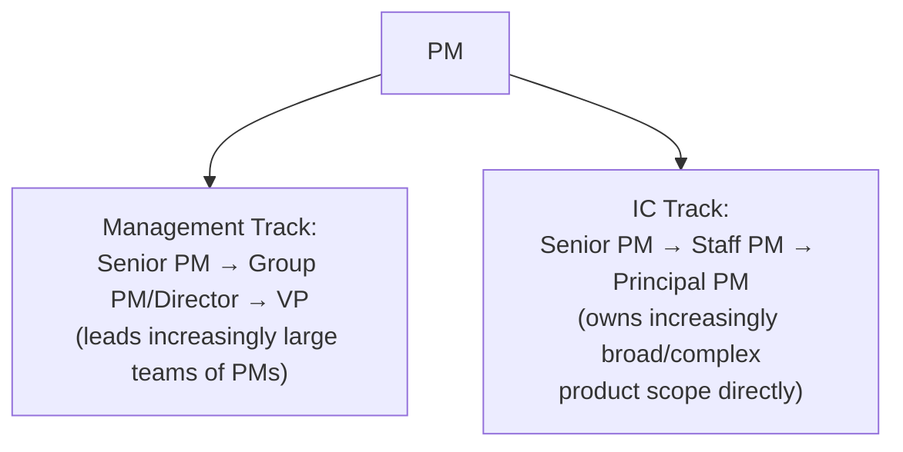
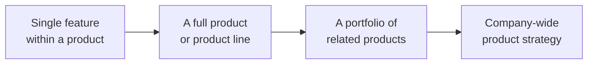

# Lesson 56: Product Management Career Paths

## Why This Lesson Matters

Lesson 55 addressed the specific transition from individual-contributor PM work to leading a team of other PMs. This lesson steps back to address the broader landscape that transition sits within: the range of career paths available to a PM, and the reality that leading a team of PMs is only one possible direction, not an obligatory next step for every successful individual contributor. A significant number of PMs are better suited to, and more fulfilled by, continuing to deepen their individual craft — becoming a Staff or Principal PM with broadening scope but no direct reports — than to becoming a manager of other PMs, and treating management as the only legitimate marker of career progress is a common, costly mistake both for individuals and for the organizations that lose excellent individual-contributor judgment by pushing people toward a track that doesn't suit them.

This lesson matters because career decisions made under the assumption that "the only way up is management" frequently produce exactly the outcome Lesson 55's Case Study illustrated — a capable person placed into a role that doesn't match their actual strengths, either underperforming as a leader or resenting the loss of the individual craft work they were genuinely good at and enjoyed. Understanding the real shape of PM career paths, including the legitimate dual-track structure many organizations now offer, is essential for making a deliberate, well-informed choice rather than defaulting to whichever path seems most visible or prestigious.

---

## Learning Path

| Field | Detail |
|---|---|
| **Module** | 6 — Leadership, Communication & Career |
| **Current Lesson** | 56 of 90 |
| **Difficulty** | 4 / 10 |
| **Estimated Study Time** | 30 minutes (reading) + 15 minutes (reflection + quiz) |
| **Prerequisites** | Lesson 55 (Building and Leading Product Teams — the leadership transition) |
| **Next Lesson** | Lesson 57 — Ethics in Product Management |
| **Future Topics Unlocked** | Lesson 57 (Ethics in Product Management), Lesson 60 (Capstone: Building Your Own Product Philosophy) — both draw on the self-assessment and scope concepts introduced here |

---

## Learning Objectives

By the end of this lesson, you will be able to:

1. Explain the dual-ladder career structure (individual-contributor track and management track) and why treating management as the only legitimate progression is a common, costly mistake.
2. Describe career progression in terms of increasing scope of ownership rather than title alone, using the Scope Ladder mental model.
3. Apply a structured self-assessment to evaluate genuine fit for the individual-contributor versus management track, rather than defaulting to whichever path seems more visible.
4. Explain how structured early-career programs (such as APM programs) function, and what they illustrate about deliberately developing PM judgment over time.
5. Diagnose a career decision made for the wrong reasons (prestige, default assumption) versus one made from genuine self-assessment of fit and interest.

---

## Prerequisites

This lesson assumes **Lesson 55's** treatment of the individual-contributor-to-leader transition, since this lesson positions that transition as one legitimate path among others, rather than the singular definition of career progress. Understanding what that transition actually requires (per Lesson 55) is necessary context for genuinely assessing whether it's the right path for a given individual.

---

## Theory

### The Dual-Ladder Structure

Many mature product organizations maintain two parallel career ladders: a **management track** (Associate PM → PM → Senior PM → Group PM/Director → VP of Product), where increasing seniority means leading larger teams of other PMs, and an **individual-contributor (IC) track** (PM → Senior PM → Staff PM → Principal PM → Distinguished/Fellow-level PM), where increasing seniority means taking on broader, more strategically significant individual product ownership without directly managing other PMs. Both tracks can lead to comparable compensation, influence, and organizational seniority — the distinction is not "management is the real career path and IC is a consolation prize," but rather two genuinely different ways of adding increasing value as a PM's career progresses.

An organization or individual that treats the management track as the only legitimate marker of seniority risks exactly the failure from Lesson 55's Case Study: promoting genuinely excellent individual contributors into a leadership role that doesn't match their actual strengths or interests, simply because it was the only visible path forward, at real cost to both the individual's fulfillment and the organization's loss of strong individual product judgment.

### The Scope Ladder: Progression as Increasing Scope, Not Just Title

Career progression, on either track, is best understood as an increase in the **scope** of ownership and impact a PM is responsible for, rather than simply a title change:

At each stage of this scope progression, the underlying skills from this entire curriculum still apply — prioritization (Lesson 29), stakeholder management (Lesson 47), metrics discipline (Lesson 41) — but the altitude at which they're exercised (echoing Lesson 51's Altitude Dial) increases, and the specific judgment calls become less about a single feature's details and more about which products or initiatives deserve investment at all. This framing helps make sense of the dual-ladder structure: an IC-track Principal PM and a management-track Director may both be operating at a comparable scope of organizational impact, simply exercising it through different mechanisms — one through deep, direct product ownership and cross-organizational influence, the other through leading and developing a team of other PMs.

### Assessing Genuine Fit for Each Track

A structured self-assessment, rather than a default assumption, should guide the choice between tracks. Relevant questions include: does the prospect of spending significantly less time on hands-on product decisions, and significantly more time on coaching, hiring, and organizational design, sound energizing or draining? Does deepening individual craft and taking on broader, more ambiguous individual ownership sound more appealing than developing other people's capabilities? Is the interest in "moving up" actually about genuine attraction to management work, or about prestige, compensation signaling, or an assumption that this is simply what career progress looks like? Honest answers to these questions matter more than external perception of which track is more prestigious, since a mismatched choice tends to produce the burnout or underperformance illustrated in this lesson's Case Study.

### Structured Early-Career Development: The APM Model

Some organizations invest deliberately in structured early-career PM development, most notably through **Associate Product Manager (APM)** programs — typically rotational, cohort-based programs designed to develop foundational PM judgment systematically in early-career hires, often through mentorship, structured rotations across different product areas, and deliberate exposure to the kind of first-principles thinking this curriculum has emphasized throughout. These programs illustrate a broader principle: PM judgment, like any deep professional skill, benefits from deliberate, structured development rather than being left to develop purely through incidental on-the-job experience alone.

---

## Common Beginner Mistakes

**Mistake 1: Assuming management is the only legitimate path to career progress**

As covered in Theory, this risks pushing genuinely excellent individual contributors into a role that doesn't match their strengths, at cost to both their fulfillment and the organization's individual-contributor talent pool.

**Mistake 2: Pursuing the management track primarily for prestige or compensation signaling, rather than genuine interest in the work itself**

A mismatch between the actual daily work of leading a team (coaching, delegation, organizational design, per Lesson 55) and a person's genuine interests tends to produce exactly the burnout or underperformance this lesson's Case Study describes, regardless of how appealing the title felt initially.

**Mistake 3: Treating career progression as purely a title or compensation ladder, disconnected from actual scope of ownership**

This framing obscures the more useful question of whether a given move genuinely expands meaningful scope and impact, versus simply changing a label without a corresponding increase in real responsibility or growth.

**Mistake 4: Assuming IC-track seniority is a consolation prize for those who "couldn't" become managers**

This mischaracterizes the IC track entirely — Staff and Principal-level IC PMs often carry organizational influence and scope comparable to management-track leaders, exercised through different mechanisms, not through a lesser or failed version of the same path.

**Mistake 5: Expecting career development to happen purely through incidental experience, without deliberate structure or mentorship**

As covered in Theory, structured programs (like APM programs) illustrate that deliberately designed development — mentorship, varied rotations, explicit skill-building — accelerates genuine judgment development more reliably than unstructured on-the-job learning alone.

---

## Mental Model: The Scope Ladder

*(Introduced above in the Theory section; restated here as this lesson's standalone takeaway tool, per curriculum convention.)*

Use the Scope Ladder as a standing discipline whenever evaluating a potential career move, on either track: ask specifically whether the move genuinely expands the scope of ownership and impact, rather than asking only whether it comes with a new title. A lateral move to a different product area at the same scope level, or a management role overseeing a team no larger or more strategically significant than one's own prior individual ownership, may not represent genuine progression in the sense this lesson describes, even if it comes with a nominally more senior-sounding title.

---

## Real Company Example

**Google** has been publicly associated with its Associate Product Manager (APM) program, founded in the early 2000s under Marissa Mayer's leadership, designed as a structured, cohort-based, rotational program to develop early-career product management talent systematically, with publicly known alumni who went on to significant product leadership roles and, in some cases, founded or led major technology companies of their own.

The underlying principle connects directly to this lesson's Theory: a deliberately structured program — combining mentorship, varied rotations across different product areas, and explicit early exposure to core PM judgment — illustrates how foundational product skill can be developed systematically rather than left entirely to unstructured, incidental on-the-job experience, echoing this lesson's caution against Mistake 5.

*(Assumption flagged: this reflects widely reported, publicly available information about Google's APM program's founding and general structure, not a confirmed, complete, or current account of the program's present-day design, which may have evolved since its founding. Specific program details and alumni outcomes are drawn from public reporting; the durable lesson is the underlying principle — deliberate, structured early-career development accelerates PM judgment more reliably than unstructured experience alone — rather than a claim to verify every detail of the program's current operation.)*

---

## Real World Perspective: Product Management Career Paths at Different Company Stages

**At a startup:**
A formal dual-ladder structure often doesn't yet exist, since the organization may be too small to support distinct IC and management tracks with meaningfully different scope at each level. Career growth at this stage is often defined more by increasing scope of ownership within a single, small team than by a formal track choice, though the underlying self-assessment questions from this lesson remain relevant as the person considers their own longer-term direction.

**At a mid-size company:**
This is typically the stage where a formal dual-ladder structure first emerges, and where the choice between IC and management tracks becomes a genuine, deliberate decision rather than an automatic default — making the self-assessment questions from this lesson's Theory especially valuable at this transition point.

**At Big Tech:**
Dual-ladder structures are often well-established and clearly defined, sometimes with explicit, publicly documented leveling criteria for both tracks, and structured early-career programs (like Google's APM program) may exist to deliberately develop talent from the earliest stages of a PM's career. The individual's job shifts toward making an increasingly deliberate, well-informed choice between tracks at each major transition point, using genuine self-assessment (per this lesson's Theory) rather than assumption about which track carries more prestige within a large, highly visible organization.

---

## Detailed Case Study: The Reluctant Manager

Consider a simplified, illustrative scenario common among successful individual-contributor PMs facing their first management opportunity.

A senior individual-contributor PM, widely respected for deep product judgment and hands-on ownership of a complex, high-impact product area, is offered a promotion to lead a team of three other PMs. The PM accepts, reasoning — without much genuine reflection — that this is simply "the next step," since no one in their organization had ever suggested continuing to grow as an individual contributor was a comparably legitimate path forward.

Within a year, the PM is visibly less engaged and less effective than before the promotion. They continue gravitating toward hands-on product work themselves (echoing Lesson 55's bottleneck failure pattern), find coaching and organizational conversations draining rather than energizing, and privately confide to a mentor that they miss the depth and ownership of their previous individual-contributor role far more than they expected to. A candid conversation with that mentor reveals that the PM had never actually considered whether they wanted to lead people — they had simply assumed, without examining the assumption, that accepting the promotion was the only way to keep advancing their career.

**What went wrong?**

Using the dual-ladder framing and Mistake 2 from this lesson: the PM made a track choice based on an unexamined assumption (management is simply "the next step") rather than genuine self-assessment of fit and interest, precisely the failure this lesson's Theory warns against. The underlying skills that made them an excellent individual contributor — deep, hands-on product judgment — were genuinely valuable, but the specific role they moved into required a different set of skills and interests (coaching, delegation, organizational design, per Lesson 55) that had never actually been assessed for genuine fit before the decision was made.

The corrective response, once the mismatch was identified, involved a candid conversation with organizational leadership about transitioning to an IC-track Staff PM role instead — a genuine lateral move in terms of scope and seniority, not a demotion, that better matched the individual's actual strengths and interests. This outcome illustrates the core value of the dual-ladder structure this lesson describes: when both tracks are genuinely available and respected, a mismatched initial choice can be corrected without the individual losing career standing, rather than being forced to either struggle indefinitely in an ill-fitting management role or leave the organization entirely. This same kind of honest self-reflection about fit, direction, and values is developed further and more comprehensively in **Lesson 60 (Capstone: Building Your Own Product Philosophy)**, which closes this curriculum's foundational modules.

---

## Framework Explanation: The IC vs. Management Track Fit Table

A second, more tactical tool: use this table for honest self-assessment before pursuing or accepting a management-track opportunity.

| Question | Leans IC Track | Leans Management Track |
|---|---|---|
| What energizes you day to day? | Deep, hands-on product problem-solving | Coaching others, organizational design, developing people |
| What drains you? | Extensive time in 1:1s, performance conversations, org planning | Long stretches without direct product ownership or craft work |
| What's your primary motivation for this move? | Genuine interest in the work itself | Primarily prestige, compensation, or "this is what progress looks like" |
| How do you feel about reduced hands-on ownership? | Reluctant to give up direct ownership | Comfortable trading direct ownership for broader team impact |

A person whose honest answers lean consistently toward the IC column, but who is nonetheless pursuing a management-track move primarily due to assumption or external pressure, is at real risk of the mismatch illustrated in this lesson's Case Study.

---

## Interview Perspective: How Interviewers Think About This

**Typical question 1: "Are you interested in a management track or an individual-contributor track long-term, and why?"**
*What the interviewer is actually evaluating:* Whether the candidate has genuinely reflected on this question using something like the Fit Table, rather than defaulting to "management" as the assumed correct answer without real self-assessment.

**Typical question 2: "Tell me about a career decision you made that didn't turn out the way you expected. What did you learn?"**
*What the interviewer is actually evaluating:* Whether the candidate can honestly reflect on a mismatched decision (echoing this lesson's Case Study) and describe genuine learning and course-correction, rather than describing every past decision as an unqualified success.

**Typical question 3: "How do you think about career growth if you're not interested in managing other people?"**
*What the interviewer is actually evaluating:* Whether the candidate understands the Scope Ladder concept and can articulate genuine IC-track progression (broadening product ownership, deepening influence) rather than assuming growth is impossible without moving into management.

---

## Summary

Product management careers typically follow one of two legitimate tracks — a management track, where seniority means leading progressively larger teams of other PMs, and an individual-contributor track, where seniority means taking on progressively broader and more strategically significant product ownership directly — and treating management as the only legitimate marker of progress is a common, costly mistake that this lesson's Scope Ladder mental model helps correct, by framing genuine career progression as increasing scope of ownership and impact rather than title alone. A structured self-assessment — what genuinely energizes versus drains a person, and whether interest in a management role reflects genuine attraction to the work or unexamined assumption and prestige-seeking — should guide the choice between tracks, since a mismatched decision, as this lesson's Case Study of a reluctant manager illustrates, tends to produce disengagement and underperformance that a genuine, well-informed choice would have avoided. Structured early-career development programs, such as Google's well-known APM program, illustrate that PM judgment benefits from deliberate, systematic development — mentorship, varied rotation, explicit skill-building — rather than being left entirely to unstructured, incidental on-the-job experience.

---

## Key Takeaways

- The dual-ladder structure (management track and individual-contributor track) means career progression doesn't require moving into people management — both tracks can lead to comparable seniority, influence, and compensation.
- Career progression is best understood as increasing scope of ownership and impact (the Scope Ladder), not simply a title or compensation change.
- A structured self-assessment of genuine energy, interest, and motivation should guide the choice between IC and management tracks, rather than defaulting to management as the assumed "correct" path.
- Pursuing a management-track move primarily for prestige, compensation signaling, or unexamined assumption — rather than genuine interest in coaching and organizational work — risks the disengagement and underperformance illustrated in this lesson's Case Study.
- IC-track seniority (Staff, Principal PM) is not a consolation prize; it represents genuine, significant organizational scope and impact, exercised through deep product ownership rather than people leadership.
- Structured early-career development programs, like APM programs, illustrate that PM judgment benefits from deliberate, systematic development rather than purely incidental, unstructured experience.
- A mismatched initial track choice can often be corrected — as this lesson's Case Study shows — without loss of career standing, when an organization genuinely respects both tracks as legitimate.

---

## Cheat Sheet

*A two-minute review of everything in this lesson.*

- **Dual-ladder:** management track and IC track are both legitimate, comparable paths to seniority.
- **Scope Ladder:** progression = increasing scope of ownership (feature → product → portfolio → company strategy), not just title.
- **Fit Table:** assess genuine energy/drain and true motivation before choosing a track, not assumption or prestige-seeking.
- **IC track ≠ consolation prize:** Staff/Principal PMs carry real organizational scope and influence.
- **APM-style programs:** illustrate that deliberate, structured development beats purely incidental on-the-job learning.
- **Mismatched choices are correctable:** a genuine dual-ladder structure allows course-correction without losing standing.
- **Ask "why" honestly:** is this move genuine interest, or assumption/prestige? The answer should drive the decision.

---

## Glossary

| Term | Definition | Related Concepts | Difficulty |
|---|---|---|---|
| Dual-ladder structure | A career framework offering both a management track and an individual-contributor track to comparable levels of seniority | Scope Ladder | 1 |
| Individual-contributor (IC) track | A career path where seniority means taking on broader, more strategically significant product ownership without managing other PMs | Management track | 1 |
| Scope Ladder | This lesson's mental model: career progression framed as increasing scope of ownership (feature, product, portfolio, company strategy) rather than title alone | Dual-ladder structure | 1 |
| Associate Product Manager (APM) program | A structured, cohort-based, rotational program for developing early-career PM talent systematically | Structured development | 2 |

---

## Further Reading / Resources

- *The Manager's Path* by Camille Fournier — a widely referenced treatment of the dual-ladder career structure and the IC-to-management transition, applicable beyond engineering to product roles.
- *Cracking the PM Career* by Jackie Bavaro and Gayle Laakmann McDowell — a dedicated practitioner treatment of PM career progression, including IC and management track distinctions.
- Public reporting on Google's Associate Product Manager (APM) program — background on this lesson's central worked example of structured early-career development.

---

## Flashcards

**Card 1**
- Front: What is the dual-ladder career structure?
- Back: A framework offering both a management track (leading progressively larger teams) and an individual-contributor track (taking on progressively broader product ownership), both leading to comparable seniority.
- Difficulty: 1
- Tags: dual-ladder

**Card 2**
- Front: What does the Scope Ladder frame career progression as, rather than title alone?
- Back: Increasing scope of ownership and impact — from a single feature, to a full product, to a portfolio, to company-wide strategy.
- Difficulty: 1
- Tags: scope-ladder

**Card 3**
- Front: What key self-assessment question distinguishes genuine interest in the management track from prestige-seeking?
- Back: Is the interest in "moving up" actually about genuine attraction to coaching, delegation, and organizational work, or about prestige, compensation signaling, or an assumption that this is simply what career progress looks like?
- Difficulty: 2
- Tags: track-fit

**Card 4**
- Front: Why is IC-track seniority (Staff, Principal PM) not a consolation prize?
- Back: Staff and Principal-level IC PMs often carry organizational influence and scope comparable to management-track leaders, exercised through deep product ownership rather than people leadership — a genuinely different, not lesser, path.
- Difficulty: 2
- Tags: ic-track-value

**Card 5**
- Front: In the Detailed Case Study, what was the root cause of the PM's disengagement after accepting a management promotion?
- Back: The decision was based on an unexamined assumption that management was simply "the next step," rather than genuine self-assessment of fit and interest in coaching and organizational work.
- Difficulty: 2
- Tags: case-study

**Card 6**
- Front: What does Google's APM program illustrate about PM career development, according to this lesson?
- Back: That PM judgment benefits from deliberate, structured development — mentorship, varied rotations, explicit skill-building — rather than being left entirely to unstructured, incidental on-the-job experience.
- Difficulty: 2
- Tags: apm-program

## Reflection Exercise

Consider the following novel scenario: You've been offered a promotion to lead a team of two other PMs. You're flattered by the offer and slightly worried that declining it might signal you're not ambitious or that you'll miss a rare opportunity, but you're honestly unsure whether you'd enjoy the actual day-to-day work of managing people.

There is no single correct answer to the prompts below — the goal is to practice applying the Fit Table and Scope Ladder, not to reach one "right" answer.

1. Using the IC vs. Management Track Fit Table, work through each question honestly for your own (hypothetical) situation — what pattern emerges?
2. Using the Scope Ladder, what would genuine IC-track progression look like for you if you declined this specific management offer — what would "increasing scope" mean in your current role?
3. How would you distinguish, honestly, whether your interest in accepting this offer is driven by genuine attraction to the work itself, versus a fear of appearing unambitious?
4. If you accept the role and, a year in, notice signs similar to this lesson's Case Study (disengagement, gravitating back toward hands-on work), what would be your plan for addressing it?
5. How would you have this conversation with your own manager, being honest about your uncertainty without appearing to lack confidence or ambition?

---

## Quiz

**1. What is the dual-ladder career structure?**
A) A structure with only a single path to seniority, through management
B) A framework offering both a management track and an individual-contributor track, both leading to comparable levels of seniority and influence
C) A structure exclusive to engineering roles, never applicable to product management
D) A synonym for the Scope Ladder with no meaningful difference

*Correct answer: B*
*Explanation: The Theory section defines the dual-ladder structure exactly this way.*
*Learning objective tested: #1*
*Difficulty: Easy*

---

**2. What does the Scope Ladder frame career progression as?**
A) Simply a title change with no other meaningful dimension
B) Increasing scope of ownership and impact — from a single feature, to a product, to a portfolio, to company-wide strategy
C) A measure of how many people directly report to someone
D) A ranking based solely on years of tenure

*Correct answer: B*
*Explanation: The Theory section explicitly defines the Scope Ladder this way.*
*Learning objective tested: #2*
*Difficulty: Easy*

---

**3. Why does this lesson caution against treating management as the only legitimate marker of career progress?**
A) Because management roles do not actually exist in most organizations
B) Because this risks pushing genuinely excellent individual contributors into a role that doesn't match their actual strengths, at cost to both their fulfillment and the organization's talent
C) Because IC-track roles always pay more than management roles
D) Because management is illegal in some countries

*Correct answer: B*
*Explanation: The Theory section and Common Beginner Mistake #1 explain this exact risk.*
*Learning objective tested: #1*
*Difficulty: Easy*

---

**4. What key question does the IC vs. Management Track Fit Table use to distinguish genuine interest from prestige-seeking?**
A) Whether the person has a college degree
B) Whether the primary motivation for a management move is genuine interest in coaching/organizational work, versus prestige, compensation signaling, or unexamined assumption
C) Whether the person has more years of tenure than their peers
D) Whether the person prefers working remotely or in an office

*Correct answer: B*
*Explanation: The Framework Explanation section's Fit Table includes this exact motivation question.*
*Learning objective tested: #3*
*Difficulty: Easy*

---

**5. In the Detailed Case Study, why did the senior IC PM accept the management promotion?**
A) Because they had genuinely reflected on their interest in coaching and organizational work beforehand
B) Because they assumed, without much genuine reflection, that this was simply "the next step," since no one had suggested continuing as an IC was a comparably legitimate path
C) Because they were forced to accept it by their organization
D) Because they had extensive prior management experience

*Correct answer: B*
*Explanation: The Case Study explicitly describes this unexamined assumption as the reason for accepting the promotion.*
*Learning objective tested: #4*
*Difficulty: Easy*

---

**6. What specific signs of mismatch did the PM in the Detailed Case Study exhibit after the promotion?**
A) Increased engagement and effectiveness compared to before
B) Gravitating toward hands-on product work themselves, finding coaching and organizational conversations draining, and missing the depth of their prior IC role
C) A strong preference for organizational design work over any hands-on product involvement
D) No noticeable change in behavior or engagement at all

*Correct answer: B*
*Explanation: The Case Study explicitly describes these specific signs of mismatch.*
*Learning objective tested: #4, #5*
*Difficulty: Easy*

---

**7. What was the corrective response in the Detailed Case Study once the mismatch was identified?**
A) The PM was terminated from the organization entirely
B) A candid conversation with leadership led to a transition to an IC-track Staff PM role, a genuine lateral move rather than a demotion
C) The PM was forced to remain in the management role indefinitely
D) The organization eliminated its IC track entirely in response

*Correct answer: B*
*Explanation: The Case Study explicitly describes this corrective transition as a genuine lateral move, illustrating the dual-ladder structure's value.*
*Learning objective tested: #5*
*Difficulty: Medium*

---

**8. Why does this lesson describe the corrective outcome in the Case Study as illustrating "the core value of the dual-ladder structure"?**
A) Because it shows that management is always the superior choice
B) Because it shows that a mismatched initial choice can be corrected without loss of career standing, when both tracks are genuinely available and respected
C) Because it shows that IC roles are only available to those who fail at management
D) Because it shows that career changes are always easy and consequence-free

*Correct answer: B*
*Explanation: The Case Study explicitly frames this correction as illustrating the dual-ladder structure's value in allowing genuine course-correction.*
*Learning objective tested: #5*
*Difficulty: Medium*

---

**9. What does Google's APM program illustrate about PM career development, according to this lesson?**
A) That PM judgment cannot be developed through any structured program
B) That deliberate, structured development — mentorship, varied rotations, explicit skill-building — accelerates genuine judgment development more reliably than unstructured, incidental experience alone
C) That only Google has ever successfully developed PM talent
D) That APM programs guarantee eventual promotion to CEO

*Correct answer: B*
*Explanation: The Theory section and Real Company Example both explain this exact principle about structured development.*
*Learning objective tested: #4*
*Difficulty: Medium*

---

**10. Why does this lesson caution against assuming IC-track seniority is a "consolation prize"?**
A) Because IC-track roles do not actually exist in most organizations
B) Because Staff and Principal-level IC PMs often carry organizational influence and scope comparable to management-track leaders, exercised through different mechanisms, not through a lesser path
C) Because IC-track roles are always more prestigious than management-track roles
D) Because management-track roles are always harder to obtain

*Correct answer: B*
*Explanation: Common Beginner Mistake #4 explains this exact mischaracterization and the genuine comparable scope of senior IC roles.*
*Learning objective tested: #1*
*Difficulty: Medium*

---

**11. (Interview Reasoning) A candidate is asked whether they're interested in a management or IC track long-term, and answers: "Management, obviously — that's the only way to keep growing." Based on this lesson's Interview Perspective section, what does this answer signal?**
A) Strong, well-reasoned career planning
B) A lack of genuine self-assessment, defaulting to management as the assumed correct answer rather than reflecting on actual fit and interest, per the Fit Table
C) Correct understanding of PM career structures, since management is indeed the only path to growth
D) Appropriate ambition that should be viewed entirely positively

*Correct answer: B*
*Explanation: The Interview Perspective section states that a strong answer reflects genuine self-assessment, not an assumption that management is the only path, which this answer fails to demonstrate.*
*Learning objective tested: #1, #3*
*Difficulty: Hard*

---

**12. Using the Scope Ladder, which of the following would represent genuine career progression for an IC-track PM?**
A) Receiving a new title with no change in the actual scope of products or influence
B) Taking on ownership of a broader portfolio of related products, requiring higher-altitude judgment while still not managing direct reports
C) Managing a team of three PMs, requiring a shift to the management track
D) Remaining in an identical role with identical scope for an extended period, regardless of title

*Correct answer: B*
*Explanation: This reflects genuine IC-track scope expansion (portfolio-level ownership) as described in the Scope Ladder, distinct from either a title-only change or a management-track move.*
*Learning objective tested: #2*
*Difficulty: Medium-Hard*

---

**13. (Product Thinking) A PM is offered a management-track promotion and, using the Fit Table, finds that their honest answers lean consistently toward valuing hands-on product work and finding extensive coaching/organizational conversations draining. What is the most defensible next step, according to this lesson?**
A) Accept the promotion regardless, since declining might appear unambitious
B) Seriously consider declining the management-track offer in favor of continued or expanded IC-track responsibility, recognizing that a mismatch between genuine fit and the offered role risks the disengagement illustrated in this lesson's Case Study
C) Accept the promotion but plan to do as little management work as possible
D) Leave the organization entirely rather than address the mismatch directly

*Correct answer: B*
*Explanation: This reflects the lesson's core recommendation — using honest self-assessment to guide the choice, rather than defaulting to acceptance out of assumption or fear of appearing unambitious.*
*Learning objective tested: #3, #5*
*Difficulty: Hard*

---

**14. Which of the following best reflects a career move motivated by genuine self-assessment, rather than assumption or prestige-seeking, per this lesson?**
A) Accepting a management role solely because it comes with a more senior-sounding title
B) Carefully considering, using a structured framework like the Fit Table, whether the actual day-to-day work of a prospective role (whether IC or management track) genuinely energizes rather than drains, before deciding
C) Accepting any promotion offered without further reflection, to avoid seeming difficult
D) Declining every promotion offer by default, regardless of genuine interest or fit

*Correct answer: B*
*Explanation: This reflects genuine, structured self-assessment as recommended throughout this lesson, in contrast to either automatic acceptance or automatic refusal.*
*Learning objective tested: #3, #5*
*Difficulty: Medium-Hard*

---

**15. (Product Thinking, Highest Difficulty) An organization has historically offered only a management track, with no formal IC-track option beyond a senior individual-contributor title with limited scope growth. A highly capable IC PM is being pushed toward management despite expressing hesitation. Using this lesson's frameworks, what is the most defensible organizational response?**
A) Insist the PM accept the management role regardless of their hesitation, since no alternative path exists
B) Recognize the absence of a genuine dual-ladder structure as an organizational gap, and consider developing a genuine IC-track path with real scope growth (echoing the Scope Ladder) as an alternative to management, rather than forcing a potentially mismatched choice due to a structural gap in the organization's career framework
C) Eliminate the individual's role entirely if they decline the management promotion
D) Assume no IC-track alternative could ever be developed, regardless of the organization's specific circumstances

*Correct answer: B*
*Explanation: This applies the lesson's dual-ladder principle at the organizational level — recognizing that forcing a mismatched choice due to a missing genuine IC track is itself a fixable structural gap, not an unavoidable constraint, echoing the lesson's broader argument for legitimate dual-ladder structures.*
*Learning objective tested: #1, #5*
*Difficulty: Hard*

---

## Connections

| | Lesson | Core Idea Carried Forward |
|---|---|---|
| **Previous Lesson** | Lesson 55 — Building and Leading Product Teams | Positions the leadership transition from Lesson 55 as one legitimate path among others, not the singular definition of career progress |
| **Current Lesson** | Lesson 56 — Product Management Career Paths | Dual-ladder structure; Scope Ladder; IC vs. Management Track Fit Table; structured early-career development |
| **Next Lesson** | Lesson 57 — Ethics in Product Management | Shifts from personal career direction to the broader ethical responsibilities that come with increasing scope of influence on either track |
| **Future Concepts Unlocked** | Lesson 60 (Capstone: Building Your Own Product Philosophy) | Builds directly on this lesson's self-assessment practice when synthesizing a personal, durable product philosophy |

This curriculum is designed to be read as one continuous argument, not ninety independent articles. Every lesson from here forward will assume you carry the dual-ladder structure and the Scope Ladder with you — they will not be re-explained, only re-applied in new contexts.
