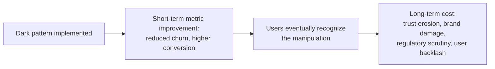
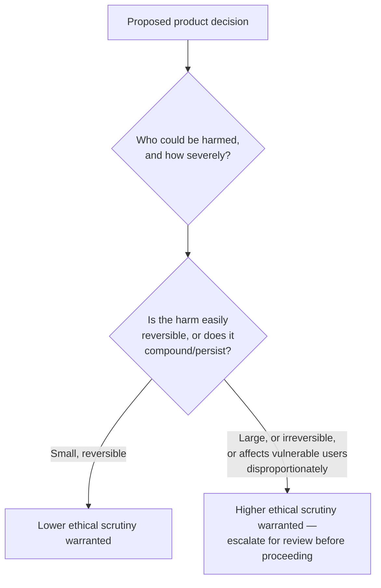
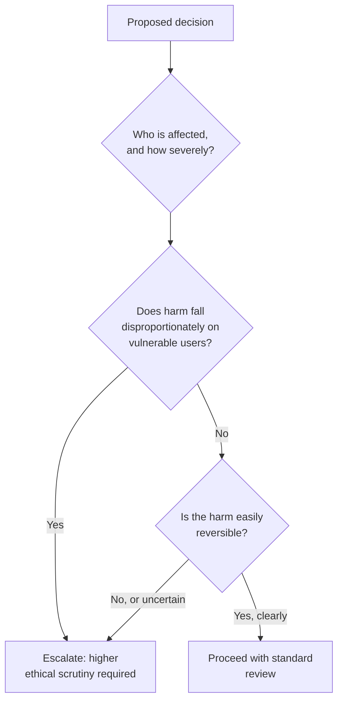

# Lesson 57: Ethics in Product Management

## Why This Lesson Matters

This curriculum has, since Lesson 1, treated good epistemic practice and rigor as inseparable from good product judgment — never presenting assumption as validated fact, always flagging where evidence is incomplete. This lesson extends that same rigor to a dimension of product work this curriculum has touched only indirectly until now: the ethical responsibility a PM carries as decisions gain scope and influence over real people's time, money, privacy, and wellbeing. Lesson 56 closed by noting that increasing scope, on either career track, comes with increasing responsibility — this lesson makes that responsibility explicit and gives it structure.

This lesson matters because product decisions routinely carry ethical weight that's easy to overlook amid the pressure of metrics, deadlines, and competitive dynamics this curriculum has spent so much time teaching you to navigate skillfully. A cancellation flow deliberately made confusing to suppress churn, an experiment run on users without genuine informed consent, an algorithm that inadvertently discriminates against a vulnerable group — these are not hypothetical edge cases; they are recurring, real patterns in the industry, and a PM who has only learned to optimize metrics without also learning to recognize and weigh ethical harm is missing a core part of the job's actual responsibility.

---

## Learning Path

| Field | Detail |
|---|---|
| **Module** | 6 — Leadership, Communication & Career |
| **Current Lesson** | 57 of 90 |
| **Difficulty** | 5 / 10 |
| **Estimated Study Time** | 35 minutes (reading) + 15 minutes (reflection + quiz) |
| **Prerequisites** | Lesson 36 (Release Planning & Launch Management — Blast Radius), Lesson 41 (Product Metrics Fundamentals — Goodhart's Law), Lesson 45 (A/B Testing & Experimentation) |
| **Next Lesson** | Lesson 58 — AI in Product Management |
| **Future Topics Unlocked** | Lesson 58 (AI in Product Management), Lesson 59 (International & Localization Considerations), Lesson 60 (Capstone: Building Your Own Product Philosophy) — all build on the ethical reasoning tools introduced here |

---

## Learning Objectives

By the end of this lesson, you will be able to:

1. Identify dark patterns in product design and explain why they tend to produce short-term metric gains at the cost of longer-term trust and regulatory risk.
2. Apply the Harm Radius model, extending Lesson 36's Blast Radius concept, to assess the scope and severity of potential ethical harm from a product decision.
3. Explain informed consent as it applies to product experimentation, and evaluate whether a given experimental design meets a genuine consent standard.
4. Apply the "sunlight test" as a practical heuristic for evaluating whether a product decision would survive public scrutiny.
5. Extend the technical debt framework (Lesson 39) to "ethical debt," explaining how ethical shortcuts compound in cost over time similarly to technical shortcuts.

---

## Prerequisites

This lesson assumes **Lesson 36's** Blast Radius model, since this lesson's central mental model directly extends that concept from technical/operational risk to ethical harm. It also assumes **Lesson 41's** Goodhart's Law and **Lesson 45's** experimentation rigor, since several of this lesson's core concerns — metrics optimization producing perverse incentives, and the ethics of experimenting on real users — build directly on the technical mechanics those lessons already established.

---

## Theory

### Dark Patterns

A **dark pattern** is a user interface or interaction design deliberately structured to manipulate users into a choice they wouldn't make with full, clear information — a subscription cancellation flow requiring many more steps than the signup flow, a pre-checked box adding an unwanted charge, confusing language designed to make "decline" harder to locate than "accept." Dark patterns often produce genuine, measurable short-term metric improvements — reduced churn, increased conversion — which is precisely what makes them tempting and why they recur across the industry despite widespread ethical and, increasingly, legal criticism.

The core ethical problem with dark patterns is not merely that they're persuasive — persuasion itself is a legitimate part of product design — but that they specifically rely on obscuring genuine information or exploiting cognitive biases to produce a choice the user would not make with full clarity, which is a fundamentally different thing from making a genuinely valuable choice easy and an unattractive choice merely less convenient.

### The Harm Radius

Extending Lesson 36's Blast Radius model directly: where Blast Radius asked "if this release goes wrong technically, how many people are affected and how containable is it," the **Harm Radius** asks the parallel ethical question: "if this decision causes harm, who is affected, how severe is that harm, and how reversible is it?"

A specific and important addition the Harm Radius makes beyond the original Blast Radius model: attention to whether harm falls disproportionately on **vulnerable users** — people with less financial resilience, less digital literacy, less time or capacity to notice and resist manipulation — since a decision producing modest average harm across a broad user base may still be ethically serious if that harm concentrates severely on a specific, less-resourced subgroup.

### Informed Consent in Product Experimentation

Recall Lesson 45's rigorous treatment of A/B testing methodology. This lesson adds an ethical dimension that lesson deliberately left for this later treatment: running an experiment on real users, even a methodologically rigorous one, raises genuine questions about **informed consent** — whether users meaningfully understand and have agreed to being subject to variation in their product experience for research purposes. Most consumer products operate under broad terms-of-service consent to general product improvement and testing, which is legally sufficient in most jurisdictions but ethically thinner than the explicit, specific informed consent standard used in formal human-subjects research. This gap matters more as an experiment's potential for genuine harm increases — a test of two button colors carries negligible ethical weight even under thin consent, while an experiment manipulating emotionally sensitive content, financial decisions, or health-related information carries meaningfully more, and deserves correspondingly more deliberate ethical consideration before proceeding, regardless of its methodological rigor.

### The Sunlight Test

A practical, easily-applied heuristic: before proceeding with a product decision, ask whether it would survive being described accurately and in full detail in a prominent news article, with your name attached as the responsible decision-maker. This "sunlight test" (echoing the broader principle, often attributed to Louis Brandeis, that "sunlight is said to be the best of disinfectants") is not a formal ethical framework, but a fast, practical check: a decision that only works because no one outside a small internal team will ever see its actual mechanics or reasoning is a strong signal that the decision may not withstand genuine ethical scrutiny, regardless of how defensible it seems in the moment, surrounded by internal pressure and rationale.

### Ethical Debt

Extending Lesson 39's technical debt framework directly: an **ethical shortcut** — implementing a dark pattern, cutting corners on informed consent, deprioritizing a known accessibility or fairness issue — functions much like technical debt, carrying both a "principal" (the eventual cost of addressing the underlying issue properly) and ongoing "interest" (accumulating reputational risk, regulatory exposure, and user trust erosion that compounds the longer the shortcut persists, often invisible in any single period's metrics but severe in aggregate, echoing Lesson 39's exact compounding dynamic). Just as with technical debt, some ethical shortcuts might be described as more "deliberate and prudent" than others in the narrowest sense, but unlike technical debt, ethical debt's "interest payments" often fall on users and society rather than primarily on the company itself — a crucial asymmetry that makes ethical debt a fundamentally more serious category of shortcut than most technical debt, even when the underlying compounding-cost mechanics are structurally similar.

---

## Common Beginner Mistakes

**Mistake 1: Treating dark pattern-style tactics as acceptable because they produce measurable short-term metric improvements**

As covered in Theory, this mistakes a genuine improvement in the underlying product for what is often actually a Goodhart's Law-style gaming of the metric (Lesson 41) — the metric moves, but the thing it was meant to represent (genuine customer value and trust) often moves in the opposite direction.

**Mistake 2: Assuming legal compliance (broad terms-of-service consent) is equivalent to genuine ethical adequacy**

As covered in Theory, legally sufficient consent and ethically robust informed consent are related but distinct standards, and the gap between them matters more as an experiment's or decision's potential for genuine harm increases.

**Mistake 3: Failing to consider whether harm falls disproportionately on vulnerable users**

A decision that looks ethically acceptable when evaluated only against an "average" user's experience may be seriously harmful when the actual harm concentrates on users with less resilience, resources, or capacity to resist or recover from it.

**Mistake 4: Treating ethical considerations as something to address only after a decision has already been made, rather than during the design process itself**

Ethical review conducted only as a final check, after significant investment has already gone into a specific implementation, faces the same sunk-cost pressure that makes genuine reconsideration difficult — ethical consideration works best when integrated into the design process from the start, not bolted on at the end.

**Mistake 5: Assuming "everyone in the industry does this" is a sufficient ethical justification**

Industry prevalence of a practice (a specific dark pattern, a particular data-use practice) doesn't establish its ethical acceptability, and regulatory and public scrutiny of common industry practices has repeatedly demonstrated that widespread adoption doesn't protect against eventual serious consequences.

---

## Mental Model: The Harm Radius

*(Introduced above in the Theory section; restated here as this lesson's standalone takeaway tool, per curriculum convention.)*

Use the Harm Radius as a standing discipline for any product decision with genuine potential to affect user experience, financial outcomes, privacy, or wellbeing — directly parallel to how Lesson 36 recommended using Blast Radius for release risk. A decision that would require significant technical safeguards under Blast Radius reasoning (a Tier 1 launch) often deserves comparably significant ethical scrutiny under Harm Radius reasoning, and the two questions should generally be asked together, not treated as separate, unrelated checklists.

---

## Real Company Example

**Uber**'s "Greyball" tool is a specifically documented, not just generally reported, example. New York Times reporter Mike Isaac's March 2017 investigation revealed that Uber had built and used Greyball for years to identify likely law enforcement officials attempting to hail rides in markets where the service was banned or restricted, then served those users a fake version of the app — showing ghost cars that never arrived — specifically to evade regulatory sting operations. The reporting triggered a formal U.S. Department of Justice criminal inquiry into the tool, confirmed in subsequent Times coverage two months later.

The underlying principle connects directly to this lesson's Theory: practices that may have seemed locally defensible or competitively necessary within an internal decision-making context did not survive the "sunlight test" once reported publicly, generating significant reputational damage, regulatory investigation, and — consistent with the ethical debt framework — costs that compounded well beyond whatever short-term competitive advantage the underlying practices may have provided.

*(Source: Mike Isaac's original March 3, 2017 New York Times investigation and the paper's subsequent May 2017 reporting on the resulting DOJ inquiry. This curriculum does not claim the practice reflects Uber's current-day operations, which the company has publicly stated have changed substantially since this period, including significant leadership and governance changes.)*

---

## Real World Perspective: Ethics in Product Management at Different Company Stages

**At a startup:**
Ethical review is often informal, relying on individual judgment rather than a formal process, since dedicated legal, privacy, or ethics review functions may not yet exist. The risk here is that competitive pressure and resource scarcity can make ethical shortcuts especially tempting precisely when formal safeguards are weakest — making individual PM judgment, informed by frameworks like this lesson's, especially important at this stage.

**At a mid-size company:**
Formal review processes for privacy, accessibility, and significant experimentation typically begin to emerge, though a PM's own judgment (informed by tools like the Harm Radius and sunlight test) often remains the primary safeguard for decisions that don't clearly trigger a formal review trigger.

**At Big Tech:**
Ethical, legal, and privacy review is often deeply formalized, with dedicated review boards, mandatory processes for significant experiments or data-use changes, and substantial regulatory compliance infrastructure — reflecting the scale at which even small-probability harms can affect enormous absolute numbers of people. The PM's job shifts toward correctly recognizing when a decision should trigger formal review (using Harm Radius reasoning) and toward maintaining genuine ethical judgment even within a heavily process-driven environment, since formal process alone doesn't substitute for a PM's own first-line ethical reasoning about a specific decision's real-world impact.

---

## Detailed Case Study: The Cancellation Flow That Worked Too Well

Consider a simplified, illustrative scenario common at subscription-based products under retention pressure.

A subscription product's leadership, facing pressure to improve churn metrics, approves a redesigned cancellation flow that adds several additional steps, confirmation screens, and retention offers before a user can actually complete cancellation — each individual addition justified internally as "giving users a chance to reconsider" or "surfacing options they might not know about." The redesign works precisely as intended: churn drops measurably, and the change is celebrated internally as a retention win.

Over the following months, however, customer support volume related to cancellation complaints rises sharply, and a growing number of public reviews and social media posts specifically describe the difficulty of canceling as a reason for distrust of the company more broadly — several posts frame the experience as deliberately deceptive, generating exactly the kind of public scrutiny the sunlight test is designed to anticipate. A regulatory body in one jurisdiction subsequently opens an inquiry into the company's cancellation practices, citing consumer protection concerns about the flow's design.

**What went wrong?**

Using the Harm Radius: the redesign was evaluated internally almost entirely through a Lesson 41-style metrics lens (did churn improve?) without genuine consideration of who was harmed and how severely — specifically, users genuinely wanting to cancel, who experienced real cost (time, frustration, in some cases continued unwanted charges) from the friction, a harm that fell with particular severity on users with less time, patience, or digital savvy to persist through a deliberately difficult flow. Applying the sunlight test at the design stage — would this flow's actual mechanics and internal justification survive being described accurately in a news article or regulatory filing — would very likely have surfaced the same concerns that eventually generated real regulatory and reputational cost, before that cost was actually incurred.

This is also a clear instance of ethical debt: the "principal" (the cost of redesigning the flow properly) was deferred in favor of a short-term metric win, while "interest" accumulated in the form of growing public distrust and eventual regulatory attention — interest that, consistent with this lesson's Theory, fell substantially on users (who experienced genuine harm and frustration) as well as on the company itself (which incurred real reputational and regulatory cost), illustrating the asymmetric cost distribution that makes ethical debt a more serious category than most technical debt. The corrective response required redesigning the flow to genuinely simplify cancellation while offering retention incentives transparently and without obstruction — a design change that, notably, still preserved a legitimate opportunity to present retention offers, just without relying on friction and confusion to suppress the underlying cancellation intent.

---

## Framework Explanation: The Ethical Decision Checklist

A second, more tactical tool: work through this checklist for any product decision with genuine potential ethical weight, before proceeding.

| Question | What to Consider |
|---|---|
| Who could be harmed by this decision, and how severely? | Consider both average impact and impact on specific, potentially vulnerable subgroups |
| Is any consent involved genuinely informed, not just legally sufficient? | Consider whether users would understand and agree to this specific mechanism if it were explained to them plainly |
| Would this decision survive the sunlight test? | Consider how the decision's actual mechanics and internal justification would read in a public news account |
| Is this decision optimizing a metric in a way that might be diverging from the underlying value it's meant to represent? | Apply Lesson 41's Goodhart's Law reasoning specifically to the ethical dimension of the metric |
| Is there a way to achieve the legitimate underlying business goal without the ethically questionable mechanism? | As in this lesson's Case Study, a legitimate goal (retention) often has a less harmful path to achieving it |

A decision failing several of these checks warrants escalation to a formal review process where one exists, or, at minimum, genuine reconsideration and documentation of the reasoning before proceeding, rather than being pushed through under competitive or metric pressure alone.

---

## Interview Perspective: How Interviewers Think About This

**Typical question 1: "Tell me about a time you identified an ethical concern in a product decision. What did you do?"**
*What the interviewer is actually evaluating:* Whether the candidate can recognize genuine ethical weight in a product decision (not just compliance or legal risk) and describe concrete action taken, rather than describing ethics purely in abstract terms.

**Typical question 2: "How do you balance a legitimate business goal like reducing churn against the risk of manipulative design?"**
*What the interviewer is actually evaluating:* Whether the candidate can articulate the distinction this lesson draws between genuine persuasion and manipulation, and propose an alternative achieving the legitimate goal without the ethically questionable mechanism, mirroring this lesson's Case Study resolution.

**Typical question 3: "How would you evaluate whether an A/B test raises ethical concerns beyond its statistical design?"**
*What the interviewer is actually evaluating:* Whether the candidate distinguishes methodological rigor (Lesson 45) from ethical adequacy (this lesson), recognizing that a well-designed experiment can still raise informed consent concerns depending on its subject matter and potential for harm.

---

## Summary

Ethics in product management extends this curriculum's foundational commitment to rigor and honest reasoning into the domain of genuine responsibility for user harm, as product decisions gain scope and influence. Dark patterns — interface designs that manipulate users into choices they wouldn't make with full clarity — often produce measurable short-term metric gains at the cost of longer-term trust, reputational damage, and regulatory risk, precisely the dynamic illustrated in this lesson's Case Study of a cancellation flow that reduced churn while generating real user harm and eventual regulatory scrutiny. The Harm Radius, extending Lesson 36's Blast Radius model, asks who could be harmed by a decision, how severely, and whether that harm falls disproportionately on vulnerable users or is difficult to reverse — a parallel discipline to technical risk assessment, applied to ethical impact. Informed consent in product experimentation is a genuinely distinct, and often thinner, standard than mere legal compliance via terms of service, mattering more as an experiment's potential for real harm increases. The sunlight test — would this decision survive being described accurately and publicly, with your name attached — offers a fast, practical heuristic for catching ethically questionable decisions before they're implemented. Finally, ethical debt extends Lesson 39's technical debt framework directly: ethical shortcuts carry both a deferred principal cost and compounding interest, but with a crucial asymmetry — that interest often falls on users and society, not primarily on the company itself, making ethical debt a fundamentally more serious category of shortcut than most technical debt.

---

## Key Takeaways

- Dark patterns manipulate users into choices they wouldn't make with full clarity, and often produce short-term metric gains at the cost of longer-term trust, reputational damage, and regulatory risk.
- The Harm Radius extends Lesson 36's Blast Radius model to ethical harm: who is affected, how severely, whether harm falls disproportionately on vulnerable users, and whether it's easily reversible.
- Legal compliance (broad terms-of-service consent) is not equivalent to genuine informed consent, and this gap matters more as a decision's or experiment's potential for real harm increases.
- The sunlight test — would this decision survive accurate, public description with your name attached — is a fast, practical heuristic for catching ethically questionable decisions in advance.
- Ethical debt extends Lesson 39's technical debt framework: ethical shortcuts carry a deferred principal cost and compounding interest, but that interest often falls on users and society, not primarily the company — a serious asymmetry technical debt usually lacks.
- A metric improvement achieved through manipulative design is often a Goodhart's Law-style gaming of the metric (Lesson 41), where the number improves while the underlying value it was meant to represent actually declines.
- Legitimate business goals (like reducing churn) often have a less harmful path to achieving them, as this lesson's Case Study demonstrates — ethical concerns and business goals are not always genuinely in tension.

---

## Cheat Sheet

*A two-minute review of everything in this lesson.*

- **Dark patterns:** manipulate via obscured information or exploited bias — different from legitimate persuasion.
- **Harm Radius:** who's affected, how severely, disproportionate impact on vulnerable users, reversibility — extends Blast Radius (L36) to ethics.
- **Informed consent ≠ legal compliance:** ToS consent is thinner than genuine informed consent, especially as harm potential rises.
- **Sunlight test:** would this survive being described accurately and publicly, with your name on it?
- **Ethical debt:** principal + compounding interest, like technical debt (L39) — but interest often falls on users/society, not the company.
- **Metric gains via manipulation:** often Goodhart's Law (L41) — the number improves while genuine value declines.
- **Look for the less-harmful path:** legitimate goals often have an ethically sound way to achieve them, as the Case Study shows.

---

## Glossary

| Term | Definition | Related Concepts | Difficulty |
|---|---|---|---|
| Dark pattern | An interface or interaction design deliberately structured to manipulate users into a choice they wouldn't make with full clarity | Harm Radius | 1 |
| Harm Radius | This lesson's mental model: assessing who is harmed by a decision, how severely, and how reversibly — extending Lesson 36's Blast Radius | Blast Radius (Lesson 36) | 2 |
| Informed consent (product context) | A user's meaningful understanding of and agreement to a specific product mechanism, distinct from and often more demanding than mere legal ToS compliance | Ethical experimentation | 2 |
| Sunlight test | A heuristic evaluating whether a decision would survive accurate, public description with the decision-maker's name attached | Ethical Decision Checklist | 1 |
| Ethical debt | An extension of technical debt (Lesson 39) to ethical shortcuts, carrying a deferred principal cost and compounding interest that often falls on users/society | Technical Debt Quadrant (Lesson 39) | 2 |

---

## Further Reading / Resources

- *Weapons of Math Destruction* by Cathy O'Neil — a detailed treatment of algorithmic harm and how metrics-driven systems can produce serious, disproportionate harm to vulnerable populations.
- The FTC's guidance and enforcement actions on "dark patterns" — a practical, regulatory-grounded resource on which specific design practices have drawn legal scrutiny.
- *Ethics of Big Data* by Kord Davis and Doug Patterson — background on informed consent and data ethics in a product and technology context.

---

## Flashcards

**Card 1**
- Front: What is a dark pattern?
- Back: An interface or interaction design deliberately structured to manipulate users into a choice they wouldn't make with full, clear information.
- Difficulty: 1
- Tags: dark-patterns

**Card 2**
- Front: What does the Harm Radius ask, and what does it extend?
- Back: Who could be harmed by a decision, how severely, whether harm falls disproportionately on vulnerable users, and whether it's reversible — extending Lesson 36's Blast Radius model from technical risk to ethical harm.
- Difficulty: 2
- Tags: harm-radius

**Card 3**
- Front: Why is legal compliance (broad ToS consent) not equivalent to genuine informed consent?
- Back: Legal sufficiency and ethical adequacy are related but distinct standards; the gap between them matters more as a decision's or experiment's potential for real harm increases.
- Difficulty: 2
- Tags: informed-consent

**Card 4**
- Front: What is the sunlight test?
- Back: A heuristic asking whether a decision would survive being described accurately and in full detail in a prominent news article, with the decision-maker's name attached.
- Difficulty: 1
- Tags: sunlight-test

**Card 5**
- Front: What key asymmetry distinguishes ethical debt from most technical debt?
- Back: Ethical debt's "interest" — compounding reputational, regulatory, and trust costs — often falls on users and society, not primarily on the company itself, unlike most technical debt.
- Difficulty: 2
- Tags: ethical-debt

**Card 6**
- Front: In the Detailed Case Study, what was the actual root cause of the cancellation flow's eventual regulatory scrutiny?
- Back: The redesign was evaluated almost entirely through a metrics lens (did churn improve?) without genuine Harm Radius consideration of the real cost to users trying to cancel, particularly those with less time or digital savvy to persist through the friction.
- Difficulty: 2
- Tags: case-study

## Reflection Exercise

Consider the following novel scenario: Your team is considering a feature that would use a user's past behavior to automatically recommend a "premium" upgrade at moments when the algorithm detects the user seems frustrated or stuck — reasoning that this is when they'd be most receptive to a solution.

There is no single correct answer to the prompts below — the goal is to practice applying the Harm Radius and Ethical Decision Checklist, not to reach one "right" answer.

1. Using the Harm Radius, who could be harmed by this feature, and how might that harm differ across users with different financial resilience or emotional states?
2. Applying the sunlight test, how would you describe this feature's actual mechanism and internal justification if it were reported on publicly? Does it survive that description comfortably?
3. Is there a meaningful difference between this feature and legitimate, helpful upselling? Where would you draw that line, and why?
4. Using the Ethical Decision Checklist, what alternative design might achieve a similar legitimate business goal (helping frustrated users find a solution) without the specific ethical concern this mechanism raises?
5. If leadership is enthusiastic about this feature's projected revenue impact, how would you raise your ethical concerns constructively, using this lesson's frameworks and Lesson 51's communication principles?

---

## Quiz

**1. What is a dark pattern?**
A) A visually dark-themed user interface
B) An interface or interaction design deliberately structured to manipulate users into a choice they wouldn't make with full, clear information
C) A synonym for any A/B test variant
D) A type of technical debt unrelated to user experience

*Correct answer: B*
*Explanation: The Theory section defines dark patterns exactly this way.*
*Learning objective tested: #1*
*Difficulty: Easy*

---

**2. What does the Harm Radius model extend, and what does it ask?**
A) It extends Lesson 41's Goodhart's Law and asks about metric definitions
B) It extends Lesson 36's Blast Radius model and asks who could be harmed by a decision, how severely, and how reversibly
C) It extends Lesson 45's experimentation rigor and asks only about statistical significance
D) It is an entirely new concept with no connection to any earlier lesson

*Correct answer: B*
*Explanation: The Theory section explicitly describes the Harm Radius as extending Lesson 36's Blast Radius model to ethical harm.*
*Learning objective tested: #2*
*Difficulty: Easy*

---

**3. Why does the Harm Radius specifically consider whether harm falls disproportionately on vulnerable users?**
A) Because vulnerable users are irrelevant to ethical consideration
B) Because a decision producing modest average harm across a broad user base may still be seriously harmful if that harm concentrates severely on users with less financial resilience, digital literacy, or capacity to resist manipulation
C) Because vulnerable users are always a majority of any user base
D) Because this consideration only applies to technical risk, not ethical harm

*Correct answer: B*
*Explanation: The Theory section explains this exact reasoning about disproportionate harm on vulnerable subgroups.*
*Learning objective tested: #2*
*Difficulty: Easy*

---

**4. Why is legal compliance (broad terms-of-service consent) not equivalent to genuine informed consent, according to this lesson?**
A) They are identical standards with no meaningful difference
B) Legal sufficiency and ethical adequacy are related but distinct standards, and the gap between them matters more as an experiment's or decision's potential for real harm increases
C) Terms of service are never legally binding
D) Informed consent only applies to medical research, never to product experimentation

*Correct answer: B*
*Explanation: The Theory section explains this exact distinction and its increasing relevance as potential harm grows.*
*Learning objective tested: #3*
*Difficulty: Easy*

---

**5. What is the "sunlight test"?**
A) A test for whether a product works well in outdoor lighting conditions
B) A heuristic asking whether a decision would survive being described accurately and in full detail in a prominent news article, with the decision-maker's name attached
C) A synonym for the Van Westendorp price sensitivity test
D) A formal legal requirement for all product launches

*Correct answer: B*
*Explanation: The Theory section defines the sunlight test exactly this way.*
*Learning objective tested: #4*
*Difficulty: Easy*

---

**6. How does "ethical debt" extend the technical debt framework from Lesson 39?**
A) It has no relationship to technical debt whatsoever
B) It applies the same principal-and-interest, compounding-cost structure to ethical shortcuts, but with the key difference that ethical debt's interest often falls on users and society rather than primarily on the company
C) It argues that ethical shortcuts never carry any real cost
D) It claims ethical debt and technical debt are identical in every respect, including who bears the cost

*Correct answer: B*
*Explanation: The Theory section explicitly extends the technical debt structure while highlighting this key asymmetry.*
*Learning objective tested: #5*
*Difficulty: Easy*

---

**7. In the Detailed Case Study, why did the redesigned cancellation flow eventually generate regulatory scrutiny?**
A) The flow was too simple and made cancellation too easy
B) The flow added friction specifically designed to suppress cancellation, generating real user harm and public complaints that eventually drew regulatory attention to the company's cancellation practices
C) The flow had no measurable effect on churn at all
D) The company voluntarily reported itself to regulators

*Correct answer: B*
*Explanation: The Case Study explicitly describes this sequence — friction-driven churn reduction leading to user harm, public complaints, and regulatory inquiry.*
*Learning objective tested: #1, #5*
*Difficulty: Medium*

---

**8. Why does this lesson describe the cancellation flow redesign as a "textbook instance of Goodhart's Law"?**
A) Because the churn metric was miscalculated
B) Because churn (the target metric) improved while the underlying value it was meant to represent — genuine customer satisfaction and trust — actually declined, exactly the dynamic Lesson 41 describes
C) Because Goodhart's Law only applies to engineering metrics
D) Because the company never tracked churn as a metric at all

*Correct answer: B*
*Explanation: The Case Study explicitly connects this dynamic to Lesson 41's Goodhart's Law — the metric improved while genuine underlying value declined.*
*Learning objective tested: #1*
*Difficulty: Medium*

---

**9. What was the recommended corrective design change in the Detailed Case Study?**
A) Removing the ability to cancel entirely
B) Redesigning the flow to genuinely simplify cancellation while still offering retention incentives transparently and without obstruction
C) Increasing the number of steps required to cancel even further
D) Eliminating all retention offers entirely, with no further consideration of the underlying business goal

*Correct answer: B*
*Explanation: The Case Study explicitly describes this corrective approach — preserving the legitimate retention goal without relying on friction and confusion.*
*Learning objective tested: #5*
*Difficulty: Medium*

---

**10. Why does this lesson caution against treating "everyone in the industry does this" as sufficient ethical justification?**
A) Because industry practices are always illegal
B) Because industry prevalence of a practice doesn't establish its ethical acceptability, and regulatory/public scrutiny has repeatedly shown that widespread adoption doesn't protect against eventual serious consequences
C) Because no company has ever faced consequences for following industry-standard practices
D) Because this reasoning is only relevant to technical debt, not ethical decisions

*Correct answer: B*
*Explanation: Common Beginner Mistake #5 explains this exact reasoning about industry prevalence not establishing ethical acceptability.*
*Learning objective tested: #5*
*Difficulty: Medium*

---

**11. (Interview Reasoning) A candidate is asked how they'd balance a legitimate churn-reduction goal against manipulative design risk, and answers: "I'd just implement whatever reduces churn the most, since that's the business priority." Based on this lesson's Interview Perspective section, what is the weakness in this answer?**
A) There is no weakness; churn reduction should always be the only consideration
B) It fails to distinguish genuine persuasion from manipulation, and doesn't consider whether an alternative design could achieve the legitimate goal without the ethically questionable mechanism, echoing this lesson's Case Study resolution
C) It correctly demonstrates strong business prioritization
D) It shows appropriate focus on metrics over all other considerations

*Correct answer: B*
*Explanation: The Interview Perspective section states that a strong answer articulates the persuasion/manipulation distinction and seeks a less harmful alternative path to the same legitimate goal.*
*Learning objective tested: #1, #5*
*Difficulty: Hard*

---

**12. Why does this lesson recommend applying the Harm Radius and Ethical Decision Checklist during the design process, rather than only after a decision has already been implemented?**
A) Because ethical review has no value at any stage
B) Because ethical review conducted only as a final check faces the same sunk-cost pressure that makes genuine reconsideration difficult once significant investment has already occurred
C) Because design processes never involve any ethical considerations
D) Because post-implementation review is always more effective than pre-implementation review

*Correct answer: B*
*Explanation: Common Beginner Mistake #4 explains this exact sunk-cost risk of delaying ethical consideration until after implementation.*
*Learning objective tested: #5*
*Difficulty: Medium-Hard*

---

**13. (Product Thinking) A team proposes an A/B test manipulating the framing of a financial decision (e.g., a loan repayment option) to see which framing increases uptake. Using this lesson's frameworks, what distinguishes this from a low-stakes UI color test?**
A) There is no meaningful difference; all A/B tests carry identical ethical weight regardless of subject matter
B) The financial decision test carries meaningfully higher potential for real harm and involves a domain where genuine informed consent matters more, warranting greater ethical scrutiny than a low-stakes, easily reversible UI test
C) Only the color test requires any ethical consideration, since financial products are exempt from ethical review
D) The financial test should be run with an even larger sample size, with no other differences in ethical treatment

*Correct answer: B*
*Explanation: This applies the lesson's core distinction — informed consent and harm-potential considerations scale with the actual stakes and subject matter of the experiment, not treated identically regardless of context.*
*Learning objective tested: #3*
*Difficulty: Hard*

---

**14. Which of the following best reflects a decision that would likely pass the sunlight test?**
A) A cancellation flow deliberately obscuring the cancel option behind multiple confusing steps, justified internally as "giving users a chance to reconsider"
B) A clear, easy-to-find cancellation option paired with a transparent, honestly-presented retention offer the user can freely accept or decline
C) A pre-checked box adding an unwanted recurring charge that most users don't notice
D) Confusing language designed to make an unwanted option seem like the default choice

*Correct answer: B*
*Explanation: Option B represents a transparent mechanism whose actual design and justification could be described accurately and publicly without generating the kind of scrutiny the other three dark-pattern-style options would likely draw.*
*Learning objective tested: #4*
*Difficulty: Medium-Hard*

---

**15. (Product Thinking, Highest Difficulty) A PM discovers that a shipped feature, while not violating any law or explicit company policy, is generating disproportionate financial harm to a specific vulnerable user segment (e.g., users with limited financial literacy triggering unexpected charges). Using this lesson's frameworks, what is the most defensible course of action?**
A) Take no action, since the feature is technically legal and compliant with company policy
B) Apply the Harm Radius and Ethical Decision Checklist to formally assess and document the disproportionate harm, escalate the finding through appropriate channels (echoing Lesson 47's stakeholder and Lesson 54's no-surprises principles), and advocate for a redesign addressing the specific vulnerable-user harm, even though no formal rule currently requires this action
C) Quietly ignore the issue to avoid raising concerns that might slow down the product roadmap
D) Wait for a regulator or journalist to identify the issue before taking any internal action

*Correct answer: B*
*Explanation: This reflects the lesson's core teaching that ethical responsibility extends beyond mere legal or policy compliance — genuine harm to a vulnerable population warrants proactive escalation and action, integrating this lesson's frameworks with the proactive-disclosure principles from Lesson 54, rather than waiting for external pressure or ignoring the issue because no formal rule technically requires action.*
*Learning objective tested: #2, #5*
*Difficulty: Hard*

---

## Connections

| | Lesson | Core Idea Carried Forward |
|---|---|---|
| **Previous Lesson** | Lesson 56 — Product Management Career Paths | Extends Lesson 56's closing point that increasing scope of influence carries increasing responsibility, made explicit here as ethical responsibility |
| **Current Lesson** | Lesson 57 — Ethics in Product Management | Dark patterns; Harm Radius; informed consent; sunlight test; ethical debt |
| **Next Lesson** | Lesson 58 — AI in Product Management | Applies this lesson's ethical frameworks specifically to the emerging challenges of AI-driven product features |
| **Future Concepts Unlocked** | Lesson 59 (International & Localization Considerations) | Extends ethical and harm considerations to culturally and legally varied international contexts |
| | Lesson 60 (Capstone: Building Your Own Product Philosophy) | Builds directly on this lesson's ethical reasoning when synthesizing a personal, durable product philosophy |

This curriculum is designed to be read as one continuous argument, not ninety independent articles. Every lesson from here forward will assume you carry the Harm Radius, the sunlight test, and the ethical debt concept with you — they will not be re-explained, only re-applied in new contexts.
