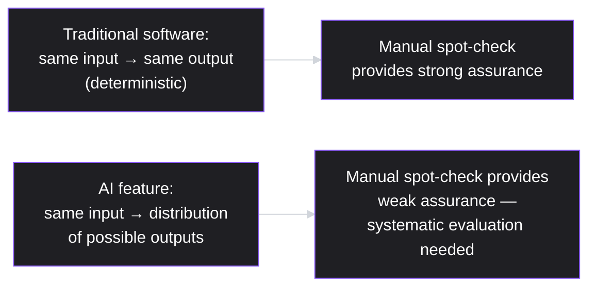
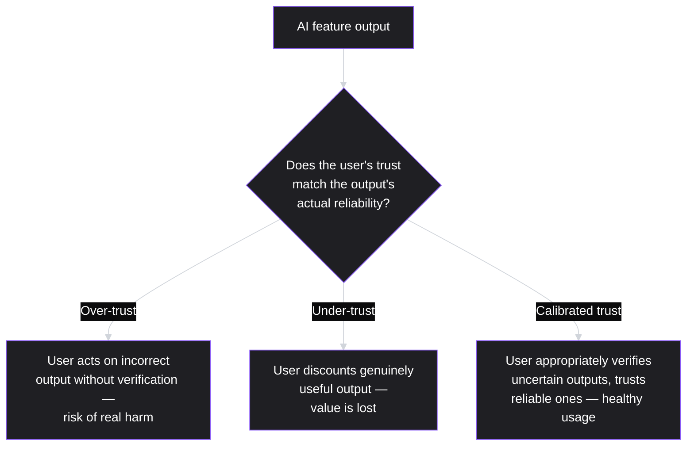
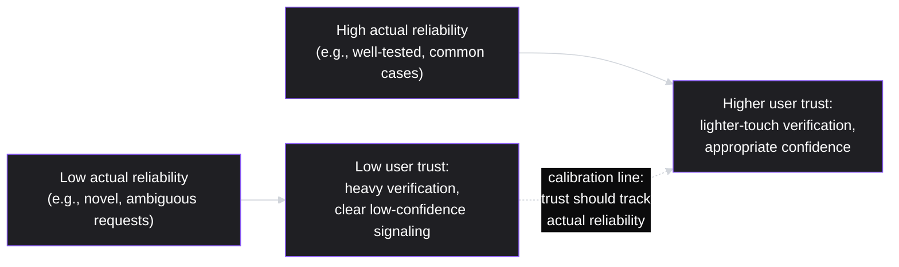

# Lesson 58: AI in Product Management

## Why This Lesson Matters

Every framework this curriculum has built — funnels (Lesson 43), A/B testing (Lesson 45), the ethical reasoning of Lesson 57 — was developed against an implicit assumption: that software behaves deterministically, producing the same output from the same input every time, and that quality can be verified once and trusted to hold. AI-powered features, particularly those built on large language models and other probabilistic systems, break this assumption directly. The same input can produce different outputs on different occasions, quality can degrade in ways that are hard to detect through standard metrics alone, and a feature can be confidently, fluently wrong in ways traditional software rarely is. This lesson addresses what changes, and what doesn't, when a PM builds and manages AI-powered product features.

This lesson matters because AI product features have become common enough that a PM who cannot evaluate them rigorously, communicate their limitations honestly, and design appropriate human oversight around them is significantly under-equipped for a large and growing share of real product work. This lesson does not teach you to build AI models — that remains a specialized technical discipline outside a PM's core responsibility, entirely consistent with Lesson 37's "give context, not commands" principle — but it does teach you the product judgment specific to working with AI as a component: how to evaluate it, how to set appropriate user expectations, and how to recognize the specific new failure modes this kind of technology introduces.

---

## Learning Path

| Field | Detail |
|---|---|
| **Module** | 6 — Leadership, Communication & Career |
| **Current Lesson** | 58 of 90 |
| **Difficulty** | 6 / 10 |
| **Estimated Study Time** | 35 minutes (reading) + 15 minutes (reflection + quiz) |
| **Prerequisites** | Lesson 45 (A/B Testing & Experimentation), Lesson 57 (Ethics in Product Management — Harm Radius, ethical debt) |
| **Next Lesson** | Lesson 59 — International & Localization Considerations |
| **Future Topics Unlocked** | Lesson 59 (International & Localization Considerations), Lesson 60 (Capstone: Building Your Own Product Philosophy) — both draw on the evaluation and trust-calibration principles introduced here |

---

## Learning Objectives

By the end of this lesson, you will be able to:

1. Explain why AI features' probabilistic, non-deterministic behavior requires evaluation methods beyond standard A/B testing alone.
2. Describe an evaluation set (eval set) and explain its role in systematically measuring AI feature quality before and after changes.
3. Apply the Trust Calibration model to design AI features that help users form accurate confidence in the system's outputs, rather than over-trusting or under-trusting them.
4. Distinguish appropriate AI use cases from "AI for AI's sake," extending this curriculum's Lesson 1 output-versus-outcome discipline to AI feature decisions.
5. Extend Lesson 57's ethical debt framework to AI-specific harms, particularly hallucination and bias, and design human-in-the-loop safeguards to mitigate them.

---

## Prerequisites

This lesson assumes **Lesson 45's** experimentation rigor, since evaluating AI features requires understanding where standard A/B testing remains applicable and where it needs to be supplemented with AI-specific evaluation methods. It also assumes **Lesson 57's** Harm Radius and ethical debt concepts, since AI features introduce specific new categories of potential harm (hallucination, bias) that this lesson treats as direct extensions of that ethical framework.

---

## Theory

### Why AI Breaks the Deterministic Assumption

Traditional software, given the same input, reliably produces the same output — a bug, once fixed, stays fixed; a feature, once verified working, generally continues working the same way. Many AI systems, particularly large language models, are fundamentally **probabilistic**: the same prompt can produce meaningfully different outputs across different invocations, and a system's overall quality is better described as a distribution of possible outputs than a single, fixed behavior. This has a direct, practical consequence for product evaluation: testing an AI feature with a handful of manual examples, the way a PM might sanity-check a traditional feature before launch, provides far weaker assurance of genuine quality than the same practice would for deterministic software, since a handful of good outputs doesn't rule out a meaningfully high rate of poor ones elsewhere in the distribution.

### Evaluation Sets (Evals)

The primary tool for addressing this gap is an **evaluation set (eval set)**: a curated, representative collection of test inputs, ideally covering both common cases and known difficult edge cases, run systematically against the AI system with outputs scored against defined quality criteria — sometimes by human reviewers, sometimes by automated scoring, often by a combination of both. An eval set functions similarly to a regression test suite in traditional software, but accounts for AI's probabilistic nature by running enough test cases, and often enough repeated trials per case, to characterize the actual output distribution's quality rather than relying on a small number of anecdotal spot-checks. Building and maintaining a good eval set is one of the most concretely useful things a PM working on AI features can contribute, since it requires exactly the product judgment (what does "good" actually look like for this specific use case, and what are the realistic edge cases users will encounter) that a PM, rather than a model-focused engineer alone, is often best positioned to define.

### Trust Calibration

A specific new design challenge AI features introduce: helping users form **calibrated trust** — confidence in the system's outputs that accurately reflects the system's actual reliability, neither more nor less. **Over-trust** occurs when users treat AI outputs as more reliable than they actually are, acting on incorrect information without verification, a specific risk given that AI-generated text is often fluent and confident-sounding regardless of its actual accuracy. **Under-trust** occurs when users, burned by an early bad experience or general skepticism, discount genuinely useful and accurate AI outputs, failing to realize the value the feature could provide.

Designing for calibrated trust involves specific product decisions: surfacing confidence signals where genuinely available, making it easy for users to verify or correct an AI output rather than only accept or reject it wholesale, and being honest in product communication about the system's actual failure modes and limitations rather than presenting it as more capable or reliable than it genuinely is.

### AI for AI's Sake vs. Genuine Value

Extending Lesson 1's output-versus-outcome discipline directly: adding an AI-powered feature is itself an output, not an outcome, and the presence of AI capability in a product is not, by itself, evidence of genuine user value delivered. A specific, common failure pattern involves adding AI features primarily to signal technological currency or competitive parity, without a clear, evidenced user problem the AI capability specifically and uniquely solves better than a simpler, deterministic alternative would. The discipline this lesson recommends: before building an AI-powered feature, ask explicitly whether the underlying problem genuinely requires AI's specific capabilities (handling ambiguous, open-ended input; generating novel content; recognizing patterns too complex for rule-based logic) or whether a simpler, more predictable, more easily verified deterministic solution would serve the same user need at lower risk and complexity.

---

## Common Beginner Mistakes

**Mistake 1: Relying on a small number of manual spot-checks to evaluate AI feature quality, as though it were traditional deterministic software**

As covered in Theory, this provides far weaker assurance for a probabilistic system than for deterministic software, since a handful of good examples doesn't rule out a meaningfully high failure rate elsewhere in the output distribution.

**Mistake 2: Presenting AI-generated output with unwarranted confidence, contributing to user over-trust**

An AI feature presented without any indication of its actual reliability or known limitations invites users to trust it more than its true accuracy warrants, risking real harm when incorrect outputs are acted upon without verification.

**Mistake 3: Adding AI capability primarily for competitive or marketing signaling, without a clear underlying user problem it specifically and uniquely solves**

This is the AI-specific version of Lesson 1's output-versus-outcome trap — an AI feature that exists because AI is currently prominent, rather than because it solves a genuine problem better than the available alternatives, risks investing real effort in something that doesn't move genuine value.

**Mistake 4: Failing to design a clear, low-friction correction mechanism for when an AI output is wrong**

Without an easy way for users to correct or flag an incorrect AI output, errors compound (both in terms of immediate user harm and in terms of lost signal that could otherwise improve the system), and users are pushed toward the binary choice of fully trusting or fully abandoning the feature rather than productively engaging with its actual, imperfect reliability.

**Mistake 5: Treating AI hallucination and bias as purely a technical/model problem outside product responsibility**

Extending Lesson 57's ethical framework directly: a PM shipping an AI feature bears real product responsibility for the human-in-the-loop safeguards, transparency, and appropriate use-case scoping that mitigate these known risks — deferring this responsibility entirely to the model or engineering team, treating it as outside the PM's scope, misses the product judgment (per Lesson 37's context-not-commands principle) that a PM is specifically positioned to contribute.

---

## Mental Model: The Trust Calibration Curve

This lesson's core takeaway tool visualizes the relationship a well-designed AI feature should maintain between a system's actual reliability and the trust users place in it:

Use the Trust Calibration Curve as a standing diagnostic whenever designing or evaluating an AI feature: ask explicitly whether the feature's presentation (confidence signals, framing, correction affordances) actually tracks its real, eval-set-measured reliability across different types of input, rather than presenting uniform confidence regardless of the underlying, often highly variable, actual accuracy for different request types.

---

## Real Company Example

**Duolingo Max**, launched March 14, 2023 and confirmed directly on Duolingo's own blog, is a specific, well-documented case of an educational product deploying a large language model (GPT-4, via a close partnership with OpenAI) for two new features: Roleplay, an AI conversation partner for practicing real-world dialogue, and Explain My Answer, which gives learners a GPT-4-generated explanation of why a specific answer was right or wrong. Duolingo's own principal product manager, Edwin Bodge, and lead engineer, Bill Peterson, described in OpenAI's own published case study exactly the trust-calibration problem this lesson addresses: with the earlier GPT-3, Peterson said, "one incorrect term in the explanation could teach the concept incorrectly or leave the user confused and dissatisfied" — a serious risk for a feature whose entire purpose is teaching correct grammar rules to novice learners. Duolingo has publicly described a specific mitigation approach: human curriculum experts, not the model alone, write the scenario prompts and initial framing for Roleplay conversations, and the company states it continuously reviews AI-generated output for factual accuracy.

The underlying principle connects directly to this lesson's Theory: an educational product deploying AI features has a specific, heightened need for rigorous evaluation and appropriate trust calibration, since users (often language learners with limited ability to independently verify correctness) are particularly vulnerable to over-trusting fluent but potentially incorrect AI-generated content, echoing this lesson's Harm Radius-style concern for vulnerable users, first introduced in Lesson 57.

*(Source: Duolingo's own official blog post announcing the launch, OpenAI's own published case study quoting Duolingo's product and engineering leads directly, and TechCrunch's contemporaneous coverage. This curriculum does not claim certainty about Duolingo's current, exact AI evaluation methodology as the technology and the company's approach continue to evolve.)*

---

## Real World Perspective: AI in Product Management at Different Company Stages

**At a startup:**
AI feature evaluation is often informal, relying on a founding team's direct, hands-on testing rather than a systematic eval set, given limited resources. The risk here is Mistake 1's exposure at meaningful scale — a startup shipping an AI feature based on encouraging but limited manual testing may not discover a significant failure mode until it affects real users at volume.

**At a mid-size company:**
Building genuine eval sets and systematic AI evaluation practices typically becomes worthwhile, since sufficient usage volume and product maturity exist to justify the investment, and the cost of an undetected failure mode grows correspondingly larger as the user base scales.

**At Big Tech:**
AI evaluation is often deeply sophisticated, with dedicated red-teaming (adversarial testing specifically designed to surface failure modes and harmful outputs), extensive eval infrastructure, and formal review processes for AI feature launches that parallel and extend the launch tiering system from Lesson 36. The PM's job shifts toward correctly scoping eval coverage for a specific feature's actual risk profile, and toward advocating for appropriate trust-calibration design even under competitive pressure to ship AI capabilities quickly.

---

## Detailed Case Study: The Assistant That Sounded Right

Consider a simplified, illustrative scenario common at teams shipping their first significant AI-powered feature.

A team launches an AI-powered customer support assistant, designed to answer common product questions automatically before escalating to a human agent when needed. Pre-launch testing consists of the product team trying roughly twenty representative questions themselves, all of which produce accurate, helpful-sounding answers, generating confidence that the feature is ready for broad release. The team ships the assistant without a formal escalation trigger for low-confidence responses, reasoning that the assistant's answers had consistently "sounded right" during testing.

Within weeks of launch, customer support escalations related to the assistant rise sharply — not because the assistant was refusing to help, but because it was confidently generating plausible-sounding but factually incorrect answers to a meaningful share of less-common questions outside the roughly twenty scenarios the team had manually tested, and users, trusting the assistant's fluent, confident tone, frequently acted on the incorrect information before eventually discovering the error and escalating, sometimes after real inconvenience or cost.

**What went wrong?**

Using this lesson's core distinction: the team's pre-launch evaluation — twenty manually-tested, hand-picked questions — provided the weak, anecdotal assurance this lesson's Theory warns against, rather than the systematic, distribution-characterizing assurance a genuine eval set would have provided. Twenty good examples said very little about the assistant's actual failure rate across the full range of real user questions it would eventually encounter, particularly the less-common, harder cases the team's own quick testing was unlikely to have covered. This is also a direct instance of the Trust Calibration failure this lesson describes: the assistant's uniformly confident, fluent tone gave users no signal to distinguish its reliable answers from its unreliable ones, inviting exactly the kind of over-trust this lesson's Theory identifies as a specific AI product risk.

The corrective response required building a genuine eval set — covering common cases, known difficult edge cases, and a representative sample of actual historical support questions — scored systematically rather than anecdotally, alongside a design change introducing explicit confidence signaling and a low-confidence escalation trigger that routed uncertain responses to human review before they reached the user with unwarranted apparent authority. This combination — systematic evaluation plus trust-calibrated design — directly addresses both halves of this lesson's core framework, and echoes Lesson 57's ethical debt concept: the shortcut of shipping on twenty anecdotal examples deferred real evaluation cost, which then compounded into actual user harm and support burden once the feature reached real-world scale and variety.

---

## Framework Explanation: The AI Feature Readiness Checklist

A second, more tactical tool: use this checklist before launching or significantly changing an AI-powered feature.

| Check | Question |
|---|---|
| Eval set exists | Has the feature been tested against a systematic, representative eval set — not just a handful of manually-tried examples? |
| Known failure modes identified | Has the team deliberately tried to find where the system fails (adversarial/edge-case testing), not just confirmed where it succeeds? |
| Confidence signaling | Does the feature communicate appropriately when its output is less certain, rather than presenting uniform confidence regardless of actual reliability? |
| Correction mechanism | Can a user easily correct or flag an incorrect output, rather than being forced into a binary trust-or-abandon choice? |
| Human-in-the-loop fallback | Is there a clear path to human review or escalation for low-confidence or high-stakes cases? |
| Harm Radius assessed | Has the feature been evaluated (per Lesson 57) for who could be harmed by an incorrect output, and how severely? |

A feature failing several of these checks, as in this lesson's Case Study, carries meaningful risk of exactly the over-trust and compounding harm dynamic this lesson describes, regardless of how impressive its outputs appeared during limited pre-launch testing.

---

## Interview Perspective: How Interviewers Think About This

**Typical question 1: "How would you evaluate the quality of an AI-powered feature before launch?"**
*What the interviewer is actually evaluating:* Whether the candidate reaches for systematic eval set construction rather than describing a small number of manual spot-checks as sufficient assurance.

**Typical question 2: "How do you decide whether a problem actually needs an AI-based solution, versus a simpler, deterministic one?"**
*What the interviewer is actually evaluating:* Whether the candidate applies genuine output-versus-outcome discipline to AI features specifically, rather than assuming AI is inherently the superior solution regardless of the actual problem's characteristics.

**Typical question 3: "How would you design an AI feature to avoid users over-trusting incorrect outputs?"**
*What the interviewer is actually evaluating:* Whether the candidate understands the Trust Calibration concept concretely — confidence signaling, correction mechanisms, honest communication about limitations — rather than describing trust-building only in vague, general terms.

---

## Summary

AI-powered features break traditional software's deterministic assumption, producing a distribution of possible outputs rather than a single, fixed, verifiable behavior — a shift that requires systematic evaluation sets (evals) rather than the anecdotal, small-sample testing that suffices for traditional deterministic features, precisely the gap illustrated in this lesson's Case Study of a support assistant whose twenty successful manual tests provided far weaker assurance than the team assumed. Trust Calibration — designing a feature so user confidence in its outputs accurately tracks the system's actual, often variable, reliability — addresses a specific new product design challenge AI introduces: fluent, confident-sounding output can invite over-trust regardless of actual accuracy, while an early bad experience can produce under-trust that discards genuinely valuable capability. Extending Lesson 1's output-versus-outcome discipline, a PM should ask explicitly whether a given problem genuinely requires AI's specific capabilities or whether a simpler, more predictable deterministic solution would serve the same need with less risk, rather than adding AI capability primarily for competitive signaling. Finally, extending Lesson 57's ethical debt framework, hallucination and bias are genuine product responsibilities, not purely technical concerns outside a PM's scope — appropriate human-in-the-loop safeguards, confidence signaling, and correction mechanisms are the specific product-level mitigations a PM is responsible for designing and advocating for.

---

## Key Takeaways

- AI features are often probabilistic rather than deterministic, meaning a handful of manually-tested examples provides far weaker quality assurance than systematic evaluation against a representative eval set.
- Trust Calibration means designing an AI feature so user confidence in its outputs accurately tracks the system's actual, often variable, reliability — avoiding both over-trust and under-trust.
- Adding AI capability is itself an output, not an outcome (extending Lesson 1); a PM should ask explicitly whether a given problem genuinely requires AI's specific capabilities before building an AI-powered solution.
- A low-friction correction mechanism, allowing users to flag or correct incorrect outputs, is essential design for AI features, avoiding a binary trust-or-abandon dynamic.
- Hallucination and bias are genuine product responsibilities, not purely technical concerns — a PM bears responsibility for human-in-the-loop safeguards and appropriate use-case scoping, extending Lesson 57's ethical framework directly.
- The AI Feature Readiness Checklist (eval set, known failure modes, confidence signaling, correction mechanism, human-in-the-loop fallback, Harm Radius assessment) provides a concrete pre-launch discipline for AI-powered features.
- Educational and other high-stakes-accuracy contexts warrant especially rigorous evaluation and trust calibration, since users may have limited ability to independently verify AI-generated content's correctness.

---

## Cheat Sheet

*A two-minute review of everything in this lesson.*

- **AI breaks determinism:** same input, distribution of outputs — small manual tests give weak assurance.
- **Eval sets:** systematic, representative test cases, scored rigorously — the AI-era equivalent of a regression suite.
- **Trust Calibration:** user confidence should track actual reliability — avoid both over-trust and under-trust.
- **AI for AI's sake:** ask whether the problem genuinely needs AI's specific capabilities, or a simpler deterministic solution would do (Lesson 1's output-vs-outcome, applied to AI).
- **Correction mechanisms:** let users flag/correct outputs — avoid forcing a binary trust-or-abandon choice.
- **Hallucination/bias = product responsibility:** extends Lesson 57's ethical debt; not purely a technical/model concern.
- **AI Feature Readiness Checklist:** eval set, failure modes, confidence signaling, correction mechanism, human fallback, Harm Radius.

---

## Glossary

| Term | Definition | Related Concepts | Difficulty |
|---|---|---|---|
| Probabilistic system | A system where the same input can produce different outputs across invocations, described by a distribution rather than a fixed behavior | Evaluation set | 2 |
| Evaluation set (eval set) | A curated, representative collection of test inputs used to systematically measure AI feature quality across common and edge cases | Probabilistic system | 2 |
| Trust Calibration | Designing a feature so user confidence in its outputs accurately tracks the system's actual reliability | Over-trust, Under-trust | 2 |
| Over-trust | Treating AI outputs as more reliable than they actually are | Trust Calibration | 2 |
| Under-trust | Discounting genuinely useful and accurate AI outputs due to skepticism or prior bad experience | Trust Calibration | 2 |
| Human-in-the-loop | A design pattern routing low-confidence or high-stakes AI outputs to human review before reaching the end user | AI Feature Readiness Checklist | 2 |

---

## Further Reading / Resources

- *Human Compatible* by Stuart Russell — background on AI system reliability and the broader challenge of designing AI that behaves in accordance with genuine human intent.
- *Weapons of Math Destruction* by Cathy O'Neil — revisited here for its direct relevance to AI bias and disproportionate harm, extending Lesson 57's Harm Radius concept.
- Public documentation and practitioner writing on LLM evaluation methodology (eval sets, red-teaming) from major AI labs — practical background on building systematic evaluation practices for AI features.

---

## Flashcards

**Card 1**
- Front: Why do AI features require different evaluation approaches than traditional deterministic software?
- Back: AI systems are often probabilistic — the same input can produce different outputs across invocations — so a handful of manually-tested examples provides much weaker quality assurance than for deterministic software, requiring systematic eval sets instead.
- Difficulty: 1
- Tags: probabilistic-systems

**Card 2**
- Front: What is an evaluation set (eval set)?
- Back: A curated, representative collection of test inputs, covering common and known difficult edge cases, run systematically against an AI system with outputs scored against defined quality criteria.
- Difficulty: 2
- Tags: eval-set

**Card 3**
- Front: What is Trust Calibration, and what are its two failure modes?
- Back: Designing a feature so user confidence in its outputs accurately tracks actual reliability; failure modes are over-trust (treating outputs as more reliable than they are) and under-trust (discounting genuinely useful outputs).
- Difficulty: 2
- Tags: trust-calibration

**Card 4**
- Front: How does this lesson extend Lesson 1's output-versus-outcome discipline to AI features specifically?
- Back: Adding AI capability is itself an output, not an outcome — a PM should ask whether a problem genuinely requires AI's specific capabilities, rather than adding AI for competitive signaling without a clear underlying user problem it uniquely solves.
- Difficulty: 2
- Tags: ai-for-ais-sake

**Card 5**
- Front: How does this lesson extend Lesson 57's ethical debt framework to AI features?
- Back: Hallucination and bias are genuine product responsibilities, not purely technical concerns; a PM bears responsibility for human-in-the-loop safeguards, appropriate scoping, and transparency that mitigate these AI-specific harms.
- Difficulty: 2
- Tags: ai-ethical-debt

**Card 6**
- Front: In the Detailed Case Study, why did twenty successful manual tests fail to predict the support assistant's real-world failure rate?
- Back: Twenty hand-picked examples provided weak, anecdotal assurance about a probabilistic system's true output distribution, and didn't cover the less-common, harder edge cases where the assistant actually failed at meaningful rates once deployed broadly.
- Difficulty: 2
- Tags: case-study

## Reflection Exercise

Consider the following novel scenario: Your team is considering adding an AI-powered feature that automatically summarizes long customer feedback threads for internal stakeholders, to save reading time.

There is no single correct answer to the prompts below — the goal is to practice applying this lesson's frameworks, not to reach one "right" answer.

1. Using the "AI for AI's sake" discipline, what genuine user problem would this feature need to solve to justify AI's specific capabilities, versus a simpler alternative (like basic keyword highlighting)?
2. What would a representative eval set look like for this specific feature — what kinds of feedback threads (common and difficult edge cases) would you want to include?
3. Using the Trust Calibration Curve, how would you design the summary presentation to help stakeholders appropriately calibrate their trust, rather than assuming the summary is always complete and accurate?
4. What correction mechanism would you design, so a stakeholder who notices a summary missed something important can easily flag or fix it?
5. Using Lesson 57's Harm Radius, who could be harmed if this summarization feature omitted or misrepresented important feedback, and how severe might that harm be?

---

## Quiz

**1. Why do AI features often require evaluation methods beyond standard manual spot-checks?**
A) Because AI features are always bug-free by design
B) Because many AI systems are probabilistic — the same input can produce different outputs across invocations — so a small number of manually-tested examples provides weak assurance about the system's true output distribution
C) Because manual testing is illegal for AI products
D) Because AI features never need to be tested at all

*Correct answer: B*
*Explanation: The Theory section explains this exact reasoning about probabilistic systems and the weakness of anecdotal spot-checks.*
*Learning objective tested: #1*
*Difficulty: Easy*

---

**2. What is an evaluation set (eval set)?**
A) A list of every user who has ever used an AI feature
B) A curated, representative collection of test inputs, covering common and known difficult edge cases, scored systematically against defined quality criteria
C) A synonym for an A/B test control group
D) A legal document required before launching any AI feature

*Correct answer: B*
*Explanation: The Theory section defines an eval set exactly this way.*
*Learning objective tested: #2*
*Difficulty: Easy*

---

**3. What is "over-trust," in the context of AI feature design?**
A) A user having no opinion about an AI feature's reliability
B) A user treating AI outputs as more reliable than they actually are, potentially acting on incorrect information without verification
C) A synonym for a well-calibrated trust relationship
D) A term that only applies to traditional deterministic software

*Correct answer: B*
*Explanation: The Theory section defines over-trust exactly this way, as one of Trust Calibration's two failure modes.*
*Learning objective tested: #3*
*Difficulty: Easy*

---

**4. What is "under-trust," and why is it also a problem, not just over-trust?**
A) Under-trust is not a real phenomenon and has no product implications
B) Under-trust occurs when users discount genuinely useful and accurate AI outputs due to skepticism or a prior bad experience, causing real value to be lost
C) Under-trust only affects traditional software, never AI features
D) Under-trust is always preferable to over-trust in every context

*Correct answer: B*
*Explanation: The Theory section explains under-trust as a distinct, genuine problem — lost value from discounting useful outputs — alongside over-trust.*
*Learning objective tested: #3*
*Difficulty: Easy*

---

**5. How does this lesson extend Lesson 1's output-versus-outcome discipline to AI features?**
A) It argues AI features should never be evaluated using output/outcome thinking
B) It frames adding AI capability as itself an output, not an outcome, recommending PMs ask whether a problem genuinely requires AI's specific capabilities rather than building AI for competitive signaling alone
C) It claims AI features are always outcomes, never outputs
D) It has no connection to Lesson 1's framework at all

*Correct answer: B*
*Explanation: The Theory section explicitly extends this distinction to AI feature decisions.*
*Learning objective tested: #4*
*Difficulty: Easy*

---

**6. In the Detailed Case Study, why did the customer support assistant generate a sharp rise in escalations after launch?**
A) The assistant refused to answer any questions at all
B) The assistant confidently generated plausible-sounding but factually incorrect answers to less-common questions outside the twenty scenarios manually tested pre-launch, and users trusted its fluent tone and acted on incorrect information
C) The assistant was too slow to respond to user questions
D) The assistant was shut down immediately after launch

*Correct answer: B*
*Explanation: The Case Study explicitly describes this exact failure pattern — confident but incorrect answers on less-common questions, combined with unwarranted user trust.*
*Learning objective tested: #1, #3*
*Difficulty: Easy*

---

**7. What specific design gap contributed to the Case Study's Trust Calibration failure?**
A) The assistant had too many confidence signals, confusing users
B) The assistant's uniformly confident, fluent tone gave users no signal to distinguish reliable answers from unreliable ones
C) The assistant refused to provide any answers without human review
D) The assistant only worked for a small subset of users

*Correct answer: B*
*Explanation: The Case Study explicitly identifies uniform confidence presentation, with no reliability signaling, as the specific design gap.*
*Learning objective tested: #3, #5*
*Difficulty: Medium*

---

**8. What corrective design change did the team implement in the Detailed Case Study?**
A) Removing the assistant entirely with no replacement
B) Building a genuine eval set and introducing explicit confidence signaling with a low-confidence escalation trigger routing uncertain responses to human review
C) Increasing the assistant's confidence level uniformly across all responses
D) Removing all human review from the process entirely

*Correct answer: B*
*Explanation: The Case Study explicitly describes this two-part corrective response — systematic evaluation plus trust-calibrated design with human-in-the-loop escalation.*
*Learning objective tested: #5*
*Difficulty: Medium*

---

**9. How does this lesson connect the Case Study's original shortcut (twenty anecdotal tests) to Lesson 57's ethical debt concept?**
A) There is no connection between the two concepts
B) The shortcut of shipping on limited anecdotal testing deferred real evaluation cost, which then compounded into actual user harm and support burden once the feature reached real-world scale — mirroring ethical debt's principal-and-interest structure
C) Ethical debt only applies to non-AI features
D) The Case Study explicitly denies any relationship to ethical debt

*Correct answer: B*
*Explanation: The Case Study explicitly draws this parallel to Lesson 57's ethical debt framework in its concluding analysis.*
*Learning objective tested: #5*
*Difficulty: Medium*

---

**10. Why does this lesson argue that hallucination and bias are genuine product responsibilities, not purely technical concerns?**
A) Because PMs are legally required to personally fix all AI model errors
B) Because a PM shipping an AI feature bears responsibility for the human-in-the-loop safeguards, transparency, and appropriate use-case scoping that mitigate these known risks — product judgment a PM is specifically positioned to contribute, echoing Lesson 37's context-not-commands principle
C) Because engineers are incapable of addressing hallucination or bias at all
D) Because this is purely a marketing concern, unrelated to product design

*Correct answer: B*
*Explanation: Common Beginner Mistake #5 explains this exact reasoning about product-level responsibility for AI-specific risk mitigation.*
*Learning objective tested: #5*
*Difficulty: Medium*

---

**11. (Interview Reasoning) A candidate is asked how they'd evaluate an AI feature before launch, and answers: "I'd try it myself a few times and see if the outputs look good." Based on this lesson's Interview Perspective section, what is the weakness in this answer?**
A) There is no weakness; personal spot-checking is always sufficient for AI features
B) It describes exactly the weak, anecdotal assurance this lesson warns against, rather than systematic eval set construction covering common and edge cases
C) It correctly demonstrates strong hands-on product involvement
D) It shows an appropriate level of caution before launch

*Correct answer: B*
*Explanation: The Interview Perspective section states that a strong answer reaches for systematic eval set construction, not a small number of manual spot-checks.*
*Learning objective tested: #2, #5*
*Difficulty: Hard*

---

**12. Using the AI Feature Readiness Checklist, what does "correction mechanism" refer to?**
A) A legal document users must sign before using an AI feature
B) A design allowing users to easily flag or correct an incorrect AI output, rather than being forced into a binary trust-or-abandon choice
C) A technical process for retraining the underlying model
D) A feature only relevant to non-AI software

*Correct answer: B*
*Explanation: The Framework Explanation section's checklist defines this exact concept.*
*Learning objective tested: #3*
*Difficulty: Medium-Hard*

---

**13. (Product Thinking) A team wants to add an AI chatbot to answer simple, well-defined questions with a small, fixed set of correct answers (e.g., "what are your business hours?"). Using the "AI for AI's sake" discipline, what should the team consider?**
A) Immediately build the AI-powered chatbot, since AI is always the best solution for any user-facing question
B) Consider whether a simpler, deterministic solution (like a rules-based FAQ lookup) would serve this narrow, well-defined need with less complexity and risk than a probabilistic AI system, reserving AI for cases genuinely requiring its specific capabilities (ambiguous input, novel content generation)
C) Avoid answering the question at all, since no solution is appropriate
D) Build both an AI and a non-AI solution simultaneously with no further analysis

*Correct answer: B*
*Explanation: This directly applies the lesson's core discipline — a well-defined, narrow question with fixed correct answers is a strong candidate for a simpler deterministic solution rather than an AI system, consistent with Lesson 1's output-vs-outcome reasoning extended here.*
*Learning objective tested: #4*
*Difficulty: Hard*

---

**14. Which of the following best reflects a well-calibrated Trust Calibration design, per this lesson?**
A) Presenting all AI outputs with identical, high confidence regardless of the underlying request's actual difficulty or the system's measured reliability for that type of request
B) Signaling lower confidence and encouraging verification for request types where the eval set shows lower actual reliability, while presenting higher confidence for well-tested, reliably-handled request types
C) Never providing any confidence signaling under any circumstances, to keep the interface simple
D) Always defaulting to the lowest possible confidence signal regardless of actual reliability

*Correct answer: B*
*Explanation: This reflects the Trust Calibration Curve's core principle — confidence signaling should track actual, measured reliability, not be uniform or arbitrary.*
*Learning objective tested: #3*
*Difficulty: Medium-Hard*

---

**15. (Product Thinking, Highest Difficulty) A PM is under pressure to ship an AI-powered feature quickly to match a competitor's recent announcement, with limited time for full eval set construction. Using this lesson's frameworks, what is the most defensible approach?**
A) Ship immediately with no evaluation at all, relying entirely on competitive pressure as justification
B) Build a reduced but still representative eval set prioritizing the highest-risk and highest-volume use cases first (informed by Lesson 57's Harm Radius), implement conservative trust-calibration design (clear low-confidence signaling, human-in-the-loop fallback for uncertain cases) as a safeguard given the necessarily limited pre-launch testing, and communicate the trade-off honestly to stakeholders (echoing Lesson 54's no-surprises principle) rather than presenting a rushed feature as fully validated
C) Delay the launch indefinitely until a completely exhaustive eval set covering every conceivable case has been built
D) Ship the feature exactly as originally planned, but rename it to avoid appearing to compete directly with the competitor's announcement

*Correct answer: B*
*Explanation: This reflects a sophisticated, risk-prioritized application of the lesson's frameworks under real time pressure — rather than either skipping evaluation entirely or demanding impossible perfection, focusing limited evaluation effort on the highest-risk cases while compensating with conservative trust-calibration design and honest stakeholder communication is the most defensible middle path.*
*Learning objective tested: #2, #3, #5*
*Difficulty: Hard*

---

## Connections

| | Lesson | Core Idea Carried Forward |
|---|---|---|
| **Previous Lesson** | Lesson 57 — Ethics in Product Management | Extends the Harm Radius and ethical debt framework specifically to AI-generated harm (hallucination, bias) |
| **Current Lesson** | Lesson 58 — AI in Product Management | Eval sets; Trust Calibration; AI for AI's sake; AI Feature Readiness Checklist |
| **Next Lesson** | Lesson 59 — International & Localization Considerations | Extends evaluation and trust-calibration discipline to culturally and linguistically varied international contexts, particularly relevant for AI features |
| **Future Concepts Unlocked** | Lesson 60 (Capstone: Building Your Own Product Philosophy) | Builds on this lesson's evaluation rigor when synthesizing a durable personal product philosophy |

This curriculum is designed to be read as one continuous argument, not ninety independent articles. Every lesson from here forward will assume you carry eval sets and the Trust Calibration Curve with you — they will not be re-explained, only re-applied in new contexts.
