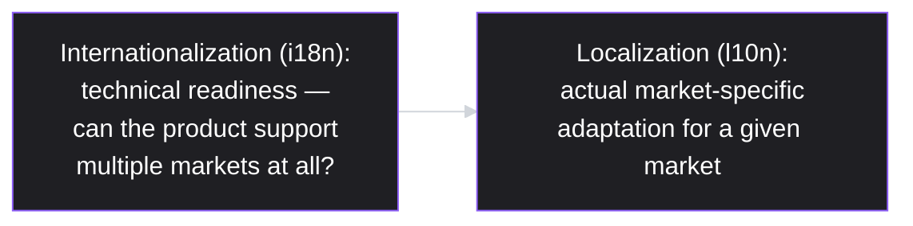
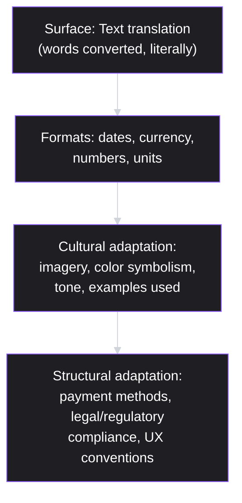
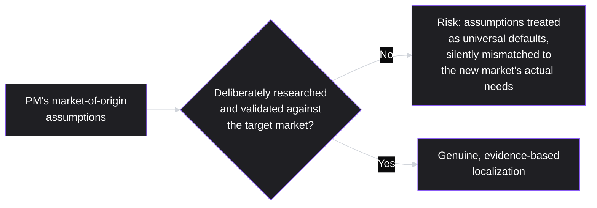
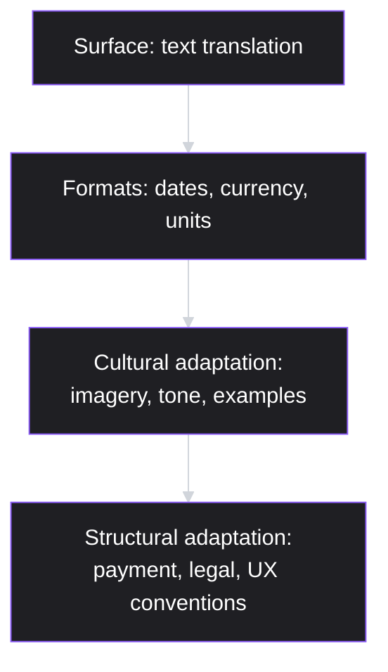

# Lesson 59: International & Localization Considerations

## Why This Lesson Matters

Lesson 47 introduced structural bias toward customer-channel signal — the risk that whichever customer voices reach a PM most easily are treated as representative of the whole user base, when they're actually filtered by access and volume. This lesson addresses a closely related, geographically-scaled version of the same risk: a PM's own cultural, linguistic, and market assumptions, formed by whatever market they happen to have built and tested a product in, can silently shape decisions in ways that fail badly once a product reaches genuinely different markets, unless deliberately examined and corrected for.

This lesson matters because expanding into international markets is one of the most common ways a growing product organization scales, and it is also one of the most common ways teams discover, expensively, that decisions which felt like universal defaults were actually specific to one market's conventions all along — date formats, payment methods, color symbolism, legal requirements, even fundamental assumptions about how users navigate an interface. A PM who treats localization as a purely mechanical translation exercise, rather than a genuine adaptation discipline requiring the same rigor this curriculum has applied to every other product decision, risks building a product that technically "supports" a new market while genuinely serving it poorly.

---

## Learning Path

| Field | Detail |
|---|---|
| **Module** | 6 — Leadership, Communication & Career |
| **Current Lesson** | 59 of 90 |
| **Difficulty** | 4 / 10 |
| **Estimated Study Time** | 30 minutes (reading) + 15 minutes (reflection + quiz) |
| **Prerequisites** | Lesson 47 (Stakeholder Management — structural bias toward customer-channel signal), Lesson 57 (Ethics in Product Management — Harm Radius) |
| **Next Lesson** | Lesson 60 — Capstone: Building Your Own Product Philosophy |
| **Future Topics Unlocked** | Lesson 60 (Capstone: Building Your Own Product Philosophy) — synthesizes this lesson's cultural-humility principle alongside the rest of this curriculum |

---

## Learning Objectives

By the end of this lesson, you will be able to:

1. Distinguish internationalization (i18n) from localization (l10n), and explain why technical readiness alone is insufficient for genuine market adaptation.
2. Apply the Localization Depth Ladder to evaluate whether a market entry effort has addressed surface-level translation only, or genuine cultural and legal adaptation.
3. Explain why a PM's own market-of-origin assumptions can silently shape product decisions, extending Lesson 47's structural bias concept to a geographic and cultural dimension.
4. Apply a structured market prioritization framework, weighing total addressable market, regulatory complexity, and competitive intensity, to decide which markets to localize for first.
5. Diagnose an international launch failure by distinguishing a translation-level gap from a deeper cultural, legal, or UX-assumption gap.

---

## Prerequisites

This lesson assumes **Lesson 47's** structural bias concept, since this lesson directly extends that reasoning from customer-channel filtering to geographic and cultural filtering — a PM's own market-of-origin experience is, in effect, another kind of amplified, non-representative signal. It also assumes **Lesson 57's** Harm Radius, since this lesson addresses legal and regulatory considerations that carry real compliance and harm implications when a product enters a new market without adequate adaptation.

---

## Theory

### Internationalization (i18n) vs. Localization (l10n)

**Internationalization (i18n)** refers to the technical work of building a product's underlying architecture to support multiple languages, regions, and formats — externalizing text strings rather than hardcoding them, supporting different date, currency, and number formats, accommodating text that expands or contracts significantly when translated, and supporting right-to-left languages where relevant. **Localization (l10n)** refers to the actual adaptation of a product for a specific market — translating and culturally adapting content, adjusting imagery and color choices, integrating locally relevant payment methods, and complying with local legal and regulatory requirements.

A common and costly mistake conflates these two: a product can be genuinely well-internationalized (technically capable of supporting many languages and regions) while still being poorly localized for any specific market (the actual translation is mechanical and culturally tone-deaf, payment methods don't match local preferences, legal requirements are unmet). Internationalization is necessary infrastructure; localization is the actual work of serving a specific market well, and completing the former does not automatically accomplish the latter.

### The Localization Depth Ladder

Localization work varies significantly in depth, and a common failure pattern is stopping at a shallower level than a market genuinely requires:

Text translation alone — converting words from one language to another without further adaptation — is the shallowest and least sufficient form of localization, and is frequently mistaken for complete localization by teams under time or resource pressure. Genuine market readiness typically requires descending through all four levels: correct formats, culturally appropriate imagery and tone, and structural adaptation to local payment preferences, legal requirements, and interface conventions that may differ meaningfully from the product's market of origin.

### Structural Bias, Extended to Geography and Culture

Directly extending Lesson 47's concept: a PM's own assumptions about "how users behave" or "what feels natural" are frequently not universal defaults, but specific artifacts of the market where the PM has spent the most time building and testing product. Decisions about navigation patterns, form field ordering, acceptable levels of directness in error messaging, or even which payment method feels like the obvious default are often silently shaped by a single market's conventions, and treating them as universal — without deliberate research into how genuinely different they may be elsewhere — repeats the same amplification-without-representativeness error Lesson 47 warned against, now operating along a geographic and cultural axis rather than a customer-channel one.

### Market Prioritization

Not every market warrants equal localization investment simultaneously. A structured prioritization approach weighs several factors: the market's total addressable market (TAM) and growth potential, the complexity of its regulatory and legal environment (data residency requirements, industry-specific regulation, tax and payment compliance), and the intensity of existing competition already serving that market well. A market with large TAM but very high regulatory complexity may still be lower initial priority than a moderately-sized market with straightforward compliance requirements and less entrenched competition, depending on a company's actual capacity to execute genuine, deep localization (per the Depth Ladder) rather than a shallow, translation-only entry that risks the exact failure this lesson warns against.

---

## Common Beginner Mistakes

**Mistake 1: Treating internationalization (technical readiness) as equivalent to localization (genuine market adaptation)**

As covered in Theory, a technically well-internationalized product can still be poorly localized for any specific market — completing the technical infrastructure work does not automatically accomplish the deeper cultural, legal, and structural adaptation a market actually requires.

**Mistake 2: Stopping localization work at text translation alone, without descending the Depth Ladder further**

Literal, word-for-word translation frequently produces content that is technically accurate but culturally tone-deaf, confusing, or unintentionally offensive, and misses format, payment, and legal adaptations a market genuinely requires.

**Mistake 3: Assuming a PM's own market-of-origin conventions and assumptions are universal defaults**

As covered in Theory, this repeats Lesson 47's structural bias error along a geographic and cultural axis — treating one market's familiar conventions as though they reflect how users everywhere naturally behave, without deliberate research validating this assumption in the new market.

**Mistake 4: Prioritizing markets based purely on total addressable market size, without considering regulatory complexity or realistic execution capacity**

A large-TAM market with regulatory or compliance requirements a company isn't genuinely prepared to meet risks either a costly compliance failure or a superficial, under-resourced entry that damages the brand's credibility in that market for future attempts.

**Mistake 5: Relying on machine translation or a single translator without broader cultural review, particularly for high-visibility or emotionally significant content**

Even skilled literal translation can miss cultural nuance, connotation, or contextual appropriateness that a broader cultural review process — involving people genuinely familiar with the target market, not just the target language — would catch before it reaches real users.

---

## Mental Model: The Localization Depth Ladder

*(Introduced above in the Theory section; restated here as this lesson's standalone takeaway tool, per curriculum convention.)*

Use the Localization Depth Ladder as a standing discipline whenever evaluating a market entry's readiness: ask explicitly which level of the ladder the current work has actually reached, rather than assuming completed text translation represents complete localization. A launch stopping at the surface level, while genuinely believing it has "localized" the product, is at real risk of the shallow-adaptation failure this lesson's Case Study illustrates.

---

## Real Company Example

**Netflix** has been publicly associated, through its own engineering and content operations blog writing, with an extensive, deliberately deep localization operation — supporting subtitling and dubbing across dozens of languages, adapting UI and content presentation for regional preferences, and licensing or producing region-specific content, rather than relying on a single global product experience translated only at the surface text level.

The underlying principle connects directly to this lesson's Theory: a media product whose core value depends heavily on cultural resonance and comprehension has a specific, heightened need to descend the full Localization Depth Ladder — surface translation alone would be entirely insufficient for a product where dialogue nuance, cultural reference, and regionally appropriate content selection are central to the actual user experience, not peripheral details.

*(Assumption flagged: this reflects general, publicly available descriptions of Netflix's localization operations discussed in company and industry writing over time, not a confirmed, complete, or current account of Netflix's specific internal localization methodology or scale today. Specific practices and investments evolve continuously at any company; the durable lesson is the underlying principle — products whose value depends on cultural resonance require deep, not surface-level, localization — rather than a claim about Netflix's exact current operations.)*

---

## Real World Perspective: International & Localization Considerations at Different Company Stages

**At a startup:**
International expansion is often deprioritized until a company has established strong product-market fit domestically, given limited resources — attempting genuine, deep localization (per the Depth Ladder) for multiple markets simultaneously at this stage risks spreading thin resources across too many markets to do any of them well, echoing this lesson's market prioritization caution.

**At a mid-size company:**
Structured market prioritization (weighing TAM, regulatory complexity, and competitive intensity) typically becomes genuinely valuable, since the company now has meaningful capacity to localize deeply for a deliberately chosen subset of markets, rather than attempting shallow coverage everywhere.

**At Big Tech:**
International operations are often extensive and deeply resourced, with dedicated localization teams, in-market cultural research, and legal/compliance functions specific to major markets, echoing Netflix's example. The PM's job shifts toward correctly scoping which specific product decisions warrant deep, market-specific research versus which can reasonably rely on established organizational localization infrastructure and expertise, and toward remaining vigilant against structural bias even within a well-resourced organization, since scale doesn't automatically eliminate the risk of unexamined market-of-origin assumptions.

---

## Detailed Case Study: The Launch That Translated Everything and Adapted Nothing

Consider a simplified, illustrative scenario common at companies attempting rapid international expansion.

A company launches its product in a new international market, investing significant effort in professional text translation across the entire interface and marketing materials, and considers the localization effort complete once every string has been accurately translated by a professional translation service. The company does not invest further in reviewing culturally specific imagery used throughout the product (which had been designed with the original market's visual conventions in mind), does not adapt the default payment method options (which reflect payment preferences common in the original market but far less common in the new one), and does not conduct legal review of data handling practices against the new market's specific regulatory requirements.

Post-launch, adoption in the new market falls well short of projections. Qualitative research eventually reveals several compounding issues: some imagery used throughout the product, while inoffensive in the original market, reads as culturally odd or mildly confusing to users in the new market; the default and most prominently featured payment method is one relatively few users in the new market actually use, creating unnecessary friction at a critical conversion step; and, separately, a regulatory inquiry is opened regarding the product's data handling practices, which had never been reviewed against the new market's specific legal requirements before launch.

**What went wrong?**

Using the Localization Depth Ladder: the launch stopped at the first, shallowest level — text translation — while genuinely believing, in good faith, that this constituted complete localization. The imagery mismatch reflects a gap at the cultural adaptation level; the payment method mismatch reflects a gap at the structural adaptation level; and the regulatory issue reflects a gap at the legal compliance level of that same structural tier. None of these gaps would have been caught by even the most skilled and accurate text translation alone, because they were never actually translation problems — they were localization problems the team had implicitly assumed translation would resolve.

This is also a direct instance of the structural bias this lesson extends from Lesson 47: default imagery, payment method prominence, and even the assumption that existing data handling practices would be broadly compliant were all shaped by the product team's familiarity with its original market's conventions, never deliberately re-examined against the new market's actual, different reality. The corrective response required descending the full Depth Ladder deliberately — genuine cultural review of imagery and tone by people familiar with the new market, research into locally preferred payment methods, and formal legal review of data practices against the new market's specific regulatory requirements — treating the original launch as having addressed only the first of four necessary levels, not the whole task.

---

## Framework Explanation: The Market Prioritization Matrix

A second, more tactical tool: use this table to compare candidate markets before committing localization investment.

| Factor | Question | High-Priority Signal |
|---|---|---|
| Total addressable market (TAM) | How large is the genuine market opportunity? | Large, growing market with demonstrated demand for the product category |
| Regulatory complexity | How demanding are this market's legal, data, and compliance requirements? | Requirements the company can genuinely meet with reasonable investment, not requirements far exceeding current capacity |
| Competitive intensity | How entrenched is existing competition in this market? | A market where a genuinely differentiated offering has room to gain meaningful share, not one already dominated by well-established local incumbents |
| Execution capacity | Does the company have genuine capacity to localize deeply (per the Depth Ladder), not just superficially, for this specific market? | Sufficient resources and cultural expertise to descend the full ladder, not just the surface translation level |

A market scoring well on TAM but poorly on execution capacity is a strong candidate for deferral rather than immediate entry, since a shallow, under-resourced launch risks the exact failure illustrated in this lesson's Case Study, potentially damaging the market's receptiveness to a better-executed future attempt.

---

## Interview Perspective: How Interviewers Think About This

**Typical question 1: "What's the difference between internationalization and localization?"**
*What the interviewer is actually evaluating:* Whether the candidate can clearly distinguish technical readiness (i18n) from actual market-specific adaptation (l10n), rather than treating the two terms as interchangeable.

**Typical question 2: "How would you decide which international market to prioritize for expansion?"**
*What the interviewer is actually evaluating:* Whether the candidate applies a structured framework weighing TAM, regulatory complexity, competitive intensity, and genuine execution capacity, rather than defaulting to market size alone.

**Typical question 3: "Tell me about a time an assumption you held turned out to be specific to your own market or background, rather than universal."**
*What the interviewer is actually evaluating:* Whether the candidate demonstrates genuine self-awareness about structural bias extended to cultural and geographic assumptions, mirroring this lesson's central caution.

---

## Summary

Internationalization (the technical work of building a product capable of supporting multiple languages, regions, and formats) and localization (the actual, market-specific adaptation of content, imagery, payment methods, and legal compliance) are distinct, and completing the former does not automatically accomplish the latter — a mismatch this lesson's Case Study illustrates through a launch that translated every piece of text accurately while leaving cultural imagery, payment method assumptions, and legal compliance entirely unaddressed. The Localization Depth Ladder — surface text translation, format adaptation, cultural adaptation, and structural adaptation — provides a framework for recognizing how much genuine localization depth a given market entry has actually reached, since text translation alone is frequently and mistakenly treated as sufficient. This lesson extends Lesson 47's structural bias concept directly to a geographic and cultural dimension: a PM's own market-of-origin assumptions about what feels natural or universal are frequently specific artifacts of that one market, and treating them as defaults without deliberate research risks exactly the kind of unexamined mismatch this lesson's Case Study demonstrates. Finally, market prioritization should weigh total addressable market against regulatory complexity, competitive intensity, and genuine execution capacity, since a large but poorly-executed market entry can damage a market's long-term receptiveness more than a deliberately deferred, later, well-executed one would.

---

## Key Takeaways

- Internationalization (i18n) is technical readiness to support multiple markets; localization (l10n) is the actual, market-specific adaptation of content, format, culture, and legal compliance — completing one does not accomplish the other.
- The Localization Depth Ladder (text translation, formats, cultural adaptation, structural adaptation) reveals how much genuine localization depth a market entry has actually reached, since text translation alone is frequently mistaken for complete localization.
- A PM's own market-of-origin assumptions about "natural" or "universal" user behavior are frequently specific to that one market, extending Lesson 47's structural bias concept to a geographic and cultural dimension.
- Market prioritization should weigh total addressable market, regulatory complexity, competitive intensity, and genuine execution capacity together, not TAM alone.
- A shallow, under-resourced market entry can damage a market's long-term receptiveness to future, better-executed attempts, making deliberate deferral sometimes preferable to a rushed, translation-only launch.
- Even skilled, accurate text translation can miss cultural nuance and contextual appropriateness that a broader cultural review process, involving people genuinely familiar with the target market, would catch.
- Products whose value depends heavily on cultural resonance (media, content-driven products) have a specific, heightened need to descend the full Localization Depth Ladder, not stop at surface translation.

---

## Cheat Sheet

*A two-minute review of everything in this lesson.*

- **i18n vs. l10n:** technical readiness (i18n) ≠ actual market adaptation (l10n) — completing one doesn't accomplish the other.
- **Localization Depth Ladder:** text translation → formats → cultural adaptation → structural adaptation (payment, legal, UX).
- **Structural bias, extended:** your own market's conventions aren't universal — extends Lesson 47's channel-signal bias to geography/culture.
- **Market Prioritization Matrix:** TAM × regulatory complexity × competitive intensity × genuine execution capacity.
- **Text translation alone ≠ localization:** the most common, most costly shortfall — descend the full ladder.
- **Shallow launches can burn a market:** a rushed entry risks damaging receptiveness to a better future attempt.
- **Cultural review, not just translation review:** involve people familiar with the market, not just the language.

---

## Glossary

| Term | Definition | Related Concepts | Difficulty |
|---|---|---|---|
| Internationalization (i18n) | The technical work of building a product's architecture to support multiple languages, regions, and formats | Localization | 1 |
| Localization (l10n) | The actual, market-specific adaptation of content, format, culture, payment methods, and legal compliance for a given market | Internationalization | 1 |
| Localization Depth Ladder | This lesson's mental model: surface text translation, formats, cultural adaptation, and structural adaptation as increasing levels of localization depth | i18n vs. l10n | 2 |
| Market Prioritization Matrix | A framework weighing TAM, regulatory complexity, competitive intensity, and execution capacity to prioritize market entry | Localization Depth Ladder | 2 |

---

## Further Reading / Resources

- *The Culture Map* by Erin Meyer — a widely referenced treatment of how cultural assumptions differ across markets in ways relevant to product and business decisions.
- W3C Internationalization guidelines and practitioner documentation — practical, technical background on internationalization (i18n) best practices.
- *Global UX: Design and Research in a Connected World* by Whitney Quesenbery and Daniel Szuc — a dedicated practitioner treatment of localization and cross-cultural UX research.

---

## Flashcards

**Card 1**
- Front: What is the difference between internationalization (i18n) and localization (l10n)?
- Back: Internationalization is the technical work of building a product capable of supporting multiple languages, regions, and formats; localization is the actual, market-specific adaptation of content, culture, payment methods, and legal compliance for a given market.
- Difficulty: 1
- Tags: i18n-vs-l10n

**Card 2**
- Front: What are the four levels of the Localization Depth Ladder?
- Back: Surface text translation, format adaptation (dates/currency/units), cultural adaptation (imagery/tone/examples), and structural adaptation (payment methods, legal compliance, UX conventions).
- Difficulty: 2
- Tags: depth-ladder

**Card 3**
- Front: How does this lesson extend Lesson 47's structural bias concept?
- Back: A PM's own market-of-origin assumptions about "natural" or "universal" user behavior are frequently specific artifacts of that one market, extending the channel-signal bias concept to a geographic and cultural dimension.
- Difficulty: 2
- Tags: structural-bias-geographic

**Card 4**
- Front: What four factors does the Market Prioritization Matrix weigh?
- Back: Total addressable market (TAM), regulatory complexity, competitive intensity, and genuine execution capacity.
- Difficulty: 2
- Tags: market-prioritization

**Card 5**
- Front: Why is text translation alone frequently mistaken for complete localization?
- Back: Teams under time or resource pressure often treat accurate text translation as sufficient, without recognizing that format, cultural, and structural adaptation are separate, deeper levels of work text translation alone doesn't address.
- Difficulty: 2
- Tags: translation-only-mistake

**Card 6**
- Front: In the Detailed Case Study, what three specific gaps caused the launch's underperformance, despite accurate text translation?
- Back: Culturally odd/confusing imagery (cultural adaptation gap), a default payment method few local users actually used (structural adaptation gap), and unreviewed data handling practices leading to a regulatory inquiry (legal compliance gap).
- Difficulty: 2
- Tags: case-study

## Reflection Exercise

Consider the following novel scenario: You're a PM planning your product's expansion into a new international market. Your product currently defaults to a specific date format, a specific payment method as the most prominent option, and uses a set of illustrative imagery designed by your team, all shaped by your product's original home market.

There is no single correct answer to the prompts below — the goal is to practice applying the Localization Depth Ladder and Market Prioritization Matrix, not to reach one "right" answer.

1. Using the Localization Depth Ladder, what specific work would need to happen at each of the four levels for this expansion to be genuinely complete?
2. What assumptions about "natural" user behavior might your team be carrying from your original market that deserve explicit research before assuming they apply to the new market?
3. Using the Market Prioritization Matrix, what information would you need to gather about this specific candidate market before committing significant localization investment?
4. Who would you want involved in reviewing your product's imagery and tone for cultural appropriateness in the new market, beyond a translation service?
5. What legal or regulatory research would you want to complete before launch, given this lesson's caution about compliance gaps?

---

## Quiz

**1. What is the key difference between internationalization (i18n) and localization (l10n)?**
A) They are identical concepts with different names
B) Internationalization is the technical work of building a product to support multiple markets; localization is the actual, market-specific adaptation for a given market
C) Internationalization only applies to European markets; localization only applies to Asian markets
D) Localization always precedes internationalization in every project

*Correct answer: B*
*Explanation: The Theory section defines these two terms exactly this way.*
*Learning objective tested: #1*
*Difficulty: Easy*

---

**2. What are the four levels of the Localization Depth Ladder, in order?**
A) Now, Next, Later, Never
B) Surface text translation, formats, cultural adaptation, structural adaptation
C) Discover, Define, Develop, Deliver
D) Input, action, output, reinvestment

*Correct answer: B*
*Explanation: The Theory section explicitly names these four levels in this order.*
*Learning objective tested: #2*
*Difficulty: Easy*

---

**3. Why is text translation alone frequently insufficient for genuine market localization?**
A) Because translation is always technically inaccurate
B) Because it addresses only the shallowest level of the Depth Ladder, missing format, cultural, and structural adaptation a market genuinely requires
C) Because translation should never be part of any localization effort
D) Because translated text is always more expensive than the original

*Correct answer: B*
*Explanation: The Theory section explains that text translation is the shallowest level, and genuine readiness requires descending further.*
*Learning objective tested: #2*
*Difficulty: Easy*

---

**4. How does this lesson extend Lesson 47's structural bias concept?**
A) It argues structural bias has no relevance to international expansion
B) It extends the concept from customer-channel filtering to geographic and cultural filtering — a PM's own market-of-origin assumptions are frequently specific, not universal, and can silently shape product decisions if not deliberately examined
C) It claims structural bias only applies within a single market, never across markets
D) It argues that structural bias disappears once a product is internationalized technically

*Correct answer: B*
*Explanation: The Theory section explicitly extends Lesson 47's concept to this new geographic and cultural dimension.*
*Learning objective tested: #3*
*Difficulty: Easy*

---

**5. What four factors does the Market Prioritization Matrix weigh when comparing candidate markets?**
A) Language difficulty, time zone, currency exchange rate, and population density
B) Total addressable market (TAM), regulatory complexity, competitive intensity, and genuine execution capacity
C) Only total addressable market, with no other factors considered
D) The PM's personal familiarity with the market, exclusively

*Correct answer: B*
*Explanation: The Theory section and Framework Explanation both list these four factors.*
*Learning objective tested: #4*
*Difficulty: Easy*

---

**6. Why might a market with large TAM still be a lower initial priority than a smaller market, according to this lesson?**
A) Large-TAM markets are always illegal to enter
B) If regulatory complexity is high relative to the company's genuine execution capacity, a large-TAM market may risk a costly compliance failure or an under-resourced, shallow entry, making deferral sometimes preferable
C) TAM is the only factor that should ever matter in market prioritization
D) Smaller markets always have larger genuine opportunity than larger ones

*Correct answer: B*
*Explanation: The Theory section and Framework Explanation explain this exact reasoning about weighing TAM against regulatory complexity and execution capacity.*
*Learning objective tested: #4*
*Difficulty: Easy*

---

**7. In the Detailed Case Study, what three specific gaps caused the international launch to underperform, despite accurate text translation?**
A) Slow loading times, server outages, and a lack of customer support
B) Culturally mismatched imagery, an unfamiliar default payment method, and unreviewed data handling practices leading to a regulatory inquiry
C) Incorrect currency symbols only, with no other issues
D) The product was never actually translated at all

*Correct answer: B*
*Explanation: The Case Study explicitly identifies these three specific gaps as the causes of underperformance.*
*Learning objective tested: #5*
*Difficulty: Medium*

---

**8. Why does this lesson describe the Case Study's launch as having addressed "only the first of four necessary levels"?**
A) Because the team never actually translated any text
B) Because the team completed surface-level text translation but never descended to format, cultural, or structural adaptation, which is where the actual failures originated
C) Because the team completed all four levels perfectly
D) Because the Depth Ladder only has one level in total

*Correct answer: B*
*Explanation: The Case Study explicitly frames the failure as stopping at the shallowest ladder level while believing this constituted complete localization.*
*Learning objective tested: #2, #5*
*Difficulty: Medium*

---

**9. Why does this lesson recommend involving people genuinely familiar with a target market in cultural review, beyond a translation service?**
A) Because translation services are always inaccurate
B) Because even skilled, accurate text translation can miss cultural nuance, connotation, or contextual appropriateness that a broader cultural review process would catch
C) Because translation services are illegal in most countries
D) Because cultural review is only relevant for legal compliance, not translation quality

*Correct answer: B*
*Explanation: Common Beginner Mistake #5 explains this exact reasoning about the limits of translation-only review.*
*Learning objective tested: #5*
*Difficulty: Medium*

---

**10. Using the Market Prioritization Matrix, what does a market scoring well on TAM but poorly on execution capacity suggest?**
A) The market should be entered immediately regardless of execution capacity
B) The market is a strong candidate for deferral, since a shallow, under-resourced launch risks damaging the market's long-term receptiveness to a future, better-executed attempt
C) TAM is irrelevant once execution capacity is considered
D) This combination never actually occurs in practice

*Correct answer: B*
*Explanation: The Framework Explanation section explicitly recommends deferral in this exact scenario, to avoid the Case Study's failure pattern.*
*Learning objective tested: #4*
*Difficulty: Medium*

---

**11. (Interview Reasoning) A candidate is asked the difference between internationalization and localization, and answers: "They're basically the same thing — both just mean translating the product." Based on this lesson's Interview Perspective section, what is the weakness in this answer?**
A) There is no weakness; the two terms are indeed interchangeable
B) It fails to distinguish technical readiness (i18n) from actual, deeper market-specific adaptation (l10n), and reduces both concepts to translation alone, missing the Depth Ladder's further levels
C) It correctly demonstrates strong technical understanding
D) It shows an appropriate simplification for a general audience

*Correct answer: B*
*Explanation: The Interview Perspective section states that a strong answer clearly distinguishes these two concepts, neither of which reduces to translation alone.*
*Learning objective tested: #1, #2*
*Difficulty: Hard*

---

**12. Why does this lesson highlight Netflix's deep localization investment as a relevant example?**
A) Because Netflix only operates in a single market
B) Because a media product whose value depends heavily on cultural resonance has a specific, heightened need to descend the full Localization Depth Ladder, since surface translation alone would be entirely insufficient for such a product
C) Because Netflix has never invested in any localization at all
D) Because Netflix's localization efforts are irrelevant to other types of products

*Correct answer: B*
*Explanation: The Real Company Example explains this exact reasoning about cultural-resonance-dependent products needing deep localization.*
*Learning objective tested: #2*
*Difficulty: Medium-Hard*

---

**13. (Product Thinking) A team notices their product's default form layout, which places the most "important" field first based on their home market's convention, performs poorly in a new market during early testing. Using this lesson's frameworks, what should the team investigate?**
A) Assume the new market's users are simply using the product incorrectly
B) Investigate whether this specific layout convention reflects a structural-bias assumption from their home market rather than genuinely researched behavior in the new market, per this lesson's extension of Lesson 47
C) Ignore the finding, since form layout is not related to localization
D) Assume the finding is a data error with no further investigation

*Correct answer: B*
*Explanation: This directly applies the lesson's core extension of structural bias — questioning whether a "natural" home-market assumption has been genuinely validated for the new market, rather than assuming user error.*
*Learning objective tested: #3, #5*
*Difficulty: Hard*

---

**14. Which of the following best reflects genuine, deep localization work, per the Localization Depth Ladder?**
A) Translating all interface text accurately and considering the work complete
B) Translating text, adapting date/currency formats, reviewing imagery and tone with people familiar with the target market, and integrating locally preferred payment methods and legal compliance
C) Only adapting currency formats, with no other changes made
D) Only reviewing legal compliance, with no attention to translation or cultural adaptation

*Correct answer: B*
*Explanation: This reflects genuine progression through all four levels of the Depth Ladder, in contrast to the shallow, single-level approaches in the other options.*
*Learning objective tested: #2*
*Difficulty: Medium-Hard*

---

**15. (Product Thinking, Highest Difficulty) A company has limited resources and is choosing between deeply localizing for one promising but regulatorily complex market versus quickly, shallowly entering three markets with simpler compliance requirements but smaller individual TAM. Using this lesson's frameworks, what is the most defensible approach?**
A) Always choose the largest-TAM market regardless of regulatory complexity or execution capacity
B) Use the Market Prioritization Matrix to weigh all four factors together — TAM, regulatory complexity, competitive intensity, and genuine execution capacity — recognizing that deep, genuine localization (per the Depth Ladder) for a smaller number of well-chosen markets is likely preferable to shallow, translation-only entry into multiple markets, given this lesson's caution about the long-term cost of under-resourced launches
C) Enter all four markets shallowly and simultaneously, regardless of resource constraints
D) Avoid international expansion entirely rather than make this trade-off decision

*Correct answer: B*
*Explanation: This reflects the lesson's core teaching that deep, genuine localization for well-chosen markets, guided by the full Market Prioritization Matrix, is generally preferable to shallow, resource-spread entry into multiple markets — directly applying both the Depth Ladder and prioritization frameworks together to a genuine resource-constrained trade-off.*
*Learning objective tested: #4, #5*
*Difficulty: Hard*

---

## Connections

| | Lesson | Core Idea Carried Forward |
|---|---|---|
| **Previous Lesson** | Lesson 58 — AI in Product Management | Both lessons extend earlier frameworks (Lesson 57's Harm Radius, Lesson 47's structural bias) to new, specific contexts requiring the same underlying rigor |
| **Current Lesson** | Lesson 59 — International & Localization Considerations | i18n vs. l10n; Localization Depth Ladder; structural bias extended to geography/culture; Market Prioritization Matrix |
| **Next Lesson** | Lesson 60 — Capstone: Building Your Own Product Philosophy | Synthesizes this lesson's cultural-humility principle alongside the entire curriculum's cumulative frameworks |
| **Future Concepts Unlocked** | Lesson 60 (Capstone) | Directly builds on this lesson's core lesson — examining and correcting for one's own unexamined assumptions — as part of constructing a durable, self-aware product philosophy |

This curriculum is designed to be read as one continuous argument, not ninety independent articles. Every lesson from here forward will assume you carry the Localization Depth Ladder and the geographic extension of structural bias with you — they will not be re-explained, only re-applied in new contexts.
