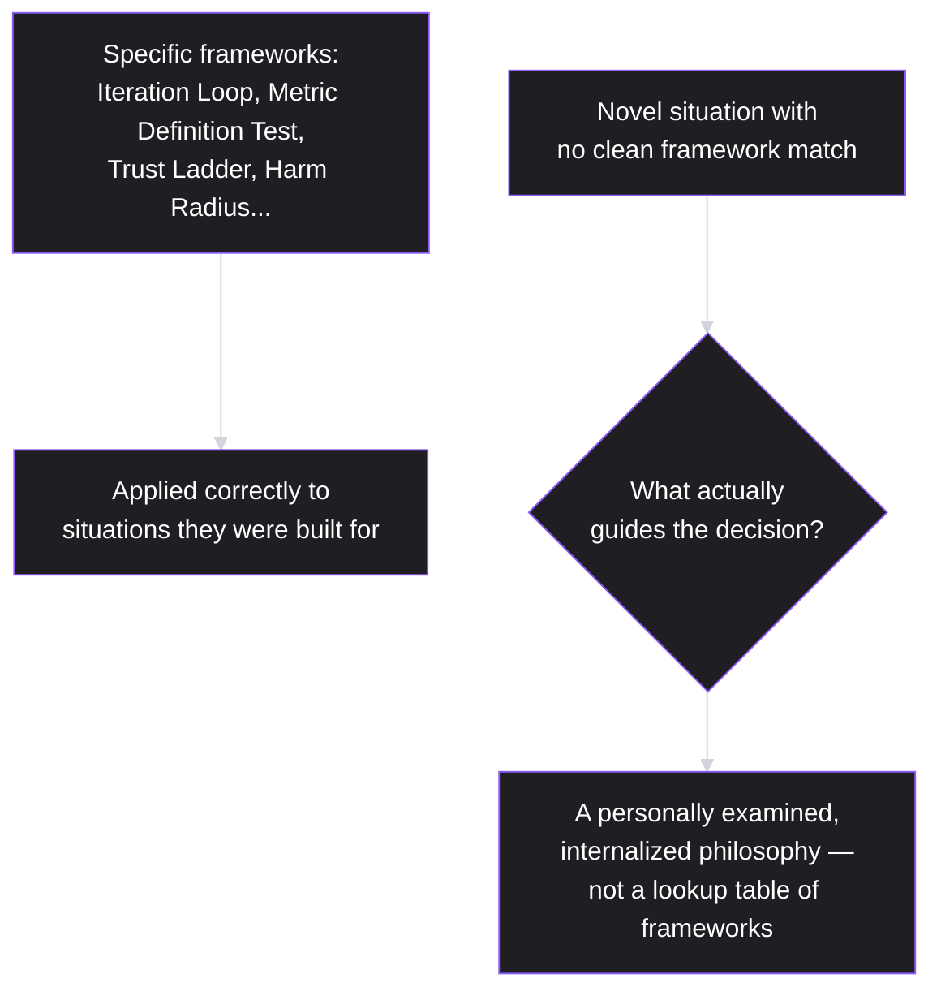

# Lesson 60: Capstone — Building Your Own Product Philosophy

## Why This Lesson Matters

Fifty-nine lessons ago, this curriculum opened with a single, foundational claim: a PM's job is defined by responsibility without authority, exercised through judgment rather than positional power. Every lesson since has added a tool, a framework, or a diagnostic to that judgment — the Decision Chain, the Iteration Loop, the Trust Ladder, the Interest Iceberg, the Harm Radius, dozens of named mental models spanning execution, metrics, growth, and leadership. This closing lesson of the curriculum's foundational six modules does not introduce a new domain of PM work. It asks you to do something harder and more durable: synthesize everything you've learned into a coherent, personally-owned product philosophy — a small set of genuine, examined principles that will actually guide your judgment when a new situation arises that no framework in this curriculum specifically anticipated.

This lesson matters because frameworks, however well-designed, are not substitutes for judgment — they are inputs to it. Every lesson in this curriculum has tried to model good epistemic practice: naming assumptions, flagging what's uncertain, showing you not just what to think but how a specific piece of reasoning was constructed, so you could evaluate and eventually internalize the reasoning itself, not just memorize its conclusions. This lesson is where that internalization is made explicit and deliberate, because a PM who has only memorized this curriculum's frameworks without genuinely examining which principles they actually believe and why will struggle the moment a real situation doesn't map cleanly onto any single lesson — which is, in practice, most real situations.

---

## Learning Path

| Field | Detail |
|---|---|
| **Module** | 6 — Leadership, Communication & Career |
| **Current Lesson** | 60 of 90 |
| **Difficulty** | 5 / 10 |
| **Estimated Study Time** | 40 minutes (reading) + 30 minutes (reflection exercise — this lesson's reflection is substantially longer than usual, by design) |
| **Prerequisites** | Lesson 1 (the Decision Chain, Output vs. Outcome, responsibility without authority) and, in practice, the full arc of Lessons 1 through 59 |
| **Next Lesson** | Lesson 61 (opens the curriculum's next arc, extending this foundation into more advanced and specialized territory) |
| **Future Topics Unlocked** | All subsequent lessons in this curriculum assume the synthesis practice and personal-philosophy discipline established here |

---

## Learning Objectives

By the end of this lesson, you will be able to:

1. Explain why a written, personally-examined set of guiding principles produces more consistent judgment under pressure than an unexamined reliance on memorized frameworks alone.
2. Trace the throughline connecting this curriculum's foundational concepts — the Decision Chain, Output vs. Outcome, and structural bias — to the more specialized frameworks built on top of them across all six modules.
3. Apply the Product Philosophy Canvas to draft a first version of your own guiding principles across decision-making, working with others, and handling uncertainty.
4. Explain why a product philosophy should be treated as a living document, revisited and revised as Lesson 35's Confidence Gradient and Lesson 42's North Star revision principle both modeled for other artifacts.
5. Distinguish a genuinely examined, personally-owned philosophy from a borrowed or performative one, and explain why the difference matters under real pressure.

---

## Prerequisites

This lesson assumes the cumulative content of the entire curriculum to this point, but especially **Lesson 1's** foundational framing (the Decision Chain, Output vs. Outcome, responsibility without authority), since this lesson is, in a genuine sense, a return to that opening lesson with fifty-nine additional lessons' worth of tools now available to apply to it.

---

## Theory

### Why Frameworks Alone Aren't Enough

This curriculum has given you a genuinely large toolkit: prioritization logic (Lesson 29), the Iteration Loop and its concrete implementations in Scrum and Kanban (Lessons 31–33), a full metrics and experimentation discipline (Lessons 41–45), growth mechanics (Lesson 46), stakeholder and communication frameworks (Lessons 47, 51–54), leadership and ethical reasoning (Lessons 55, 57). Each was built to be genuinely useful in the specific situation it addresses. But real product work rarely arrives labeled with which lesson applies — a genuinely novel situation often requires blending several frameworks, recognizing that none quite fits and adapting one, or falling back on something more fundamental than any single named model: a set of actual beliefs about what matters and why.

A PM who has only memorized frameworks without ever articulating the underlying beliefs those frameworks were built to serve is, in a genuinely novel situation, left without a compass — able to recite the Iron Triangle (Lesson 37) but unable to say, when no framework quite fits, what they actually believe about trade-offs, honesty, or whose interests deserve weight. This lesson's core claim: articulating those underlying beliefs explicitly, in writing, is what makes judgment durable and consistent rather than dependent on remembering the right lesson number at the right moment.

### The Throughline: Tracing This Curriculum's Foundational Concepts Forward

It's worth explicitly tracing how much of this curriculum descends from Lesson 1's three founding concepts, since seeing this throughline is itself part of building a genuine philosophy rather than a disconnected list of tools:

- **The Decision Chain** (Problem → Understanding → Decision → Execution → Outcome, with feedback) reappears as the Iteration Loop (Lesson 31), as the funnel-to-retention-to-experimentation arc of Module 5, and as this lesson's own Product Philosophy Canvas, which is, at its core, a decision chain applied to the question "what do I actually believe."
- **Output vs. Outcome** reappears in the North Star Metric criteria (Lesson 42), in the vanity-versus-actionable metric distinction (Lesson 41), and directly in Lesson 58's "AI for AI's sake" caution — the same underlying discipline, re-applied to a new domain every time.
- **Responsibility without authority** reappears as the entire logic of Lesson 37's Trust Ladder, Lesson 53's Interest Iceberg, and Lesson 54's no-surprises principle — every one of this curriculum's influence and relationship frameworks is, ultimately, a specific answer to the question Lesson 1 first posed: how do you get good outcomes when you can't simply command them?

Recognizing this throughline matters because it means you don't actually need to remember fifty-nine separate, disconnected lessons — you need to genuinely understand a small number of foundational commitments, and recognize how the rest of this curriculum is elaboration, not addition.

### The Product Philosophy Canvas

A structured tool for drafting your own philosophy, organized around the questions a PM must actually answer, explicitly or implicitly, in every significant decision:

| Canvas Section | Guiding Question |
|---|---|
| Beliefs about users | What do you genuinely believe about how to understand what users need, and how much to trust any single signal (echoing Lesson 47's structural bias)? |
| Beliefs about evidence | How much certainty do you require before acting, and how do you hold conclusions provisionally as new evidence arrives (echoing Lesson 41, Lesson 45)? |
| Beliefs about trade-offs | When speed, scope, and quality conflict (Lesson 37's Iron Triangle), what do you actually prioritize, and why? |
| Beliefs about people | What do you owe the people you work with who don't report to you, and what do you owe the people who do (Lessons 37, 53, 55)? |
| Non-negotiables | What lines will you not cross regardless of pressure — echoing Lesson 57's ethical reasoning — and why those specifically? |
| Open questions | What are you still genuinely uncertain about, and what would change your mind? |

The "open questions" section deserves particular emphasis: a genuine philosophy is not a finished, defended position on everything — it explicitly includes what you don't yet know, modeling the same epistemic honesty this curriculum has practiced throughout, rather than presenting false certainty where none is warranted.

### Treating the Philosophy as a Living Document

Directly echoing Lesson 35's Confidence Gradient and Lesson 42's guidance on revisiting a North Star Metric as a business matures: a product philosophy drafted today should be treated as a genuine hypothesis about what you believe, not a permanent, unchangeable artifact. As you accumulate more real experience — the kind no curriculum can fully substitute for — parts of this philosophy will be confirmed, parts will need revision, and some open questions will resolve while new ones emerge. The discipline this lesson recommends is not writing a perfect philosophy once, but establishing the habit of revisiting and honestly revising it, the same discipline this curriculum has modeled for every other artifact from roadmaps to North Star Metrics.

---

## Common Beginner Mistakes

**Mistake 1: Treating this curriculum's frameworks as a checklist to apply mechanically, without ever examining the underlying beliefs they serve**

This produces exactly the fragility this lesson's Theory describes — competent handling of situations a framework was built for, and no real guidance the moment a situation doesn't cleanly match any single lesson.

**Mistake 2: Adopting someone else's stated philosophy (a mentor's, a famous product leader's, a company's published principles) wholesale, without genuine personal examination**

A borrowed philosophy, however well-articulated by its original author, wasn't built from your own examined beliefs and experience, and tends to fail exactly when genuinely tested — under real pressure, in a situation the borrowed philosophy's author never actually faced themselves.

**Mistake 3: Writing a philosophy composed entirely of confident, settled positions with no genuine open questions**

This mistakes performed certainty for genuine reflection — echoing this curriculum's repeated insistence (from Lesson 1 onward) on distinguishing validated fact from assumption, a discipline that should apply to one's own beliefs as rigorously as to any external claim.

**Mistake 4: Treating a drafted philosophy as permanent and unchangeable once written**

As covered in Theory, this contradicts the revision discipline this curriculum has modeled throughout — a philosophy that never changes despite accumulating real experience is more likely evidence of insufficient reflection than of having gotten everything right on the first attempt.

**Mistake 5: Writing a philosophy in purely abstract terms, disconnected from specific situations where it would actually apply**

A philosophy phrased so abstractly that it could justify almost any decision provides little real guidance — the most useful philosophies are specific enough to genuinely constrain and clarify behavior in concrete situations, not vague enough to accommodate whatever was already decided.

---

## Mental Model: The Product Philosophy Canvas

*(Introduced above in the Theory section; restated here as this lesson's standalone takeaway tool, per curriculum convention — and, fittingly, the final new mental model this curriculum's foundational arc introduces.)*

Use the Product Philosophy Canvas not as a one-time exercise but as a document you genuinely revisit — after a significant decision that tested one of your stated beliefs, after a mistake that revealed a gap in your thinking, after enough time has passed that your open questions deserve reconsideration. The canvas's real value isn't the first draft; it's the habit of returning to it honestly.

---

## Real Company Example

**Amazon**, revisited from Lesson 51's discussion of its narrative memo culture, has been publicly associated with its widely published "Leadership Principles" — a codified, written set of specific behavioral and decision-making commitments (including principles like customer obsession and a bias for action) that the company has stated are used directly in hiring, performance evaluation, and everyday decision-making conversations across the organization.

The underlying principle connects directly to this lesson's Theory, at an organizational rather than individual scale: writing down genuine, specific guiding principles — rather than leaving values implicit or assumed — creates a shared, referenceable standard that can actually be invoked in a real decision or disagreement, exactly the function this lesson's Product Philosophy Canvas is meant to serve for an individual PM's own judgment.

*(Assumption flagged: this reflects publicly available information about Amazon's published Leadership Principles and their stated organizational use, not a confirmed, complete, or current account of exactly how consistently or effectively they are applied in practice throughout the company today. The durable lesson is the underlying principle — writing down specific, genuine guiding principles creates a referenceable standard more useful than leaving values implicit — rather than a claim to verify every detail of how Amazon's principles function internally.)*

---

## Real World Perspective: Capstone — Building Your Own Product Philosophy at Different Company Stages

**At a startup:**
An individual PM's personal philosophy often carries outsized weight, since formal organizational process and precedent are still thin — the judgment calls a founding PM makes, informed by whatever principles they've genuinely internalized, frequently become the de facto organizational culture others inherit. This makes the work of this lesson especially consequential early in a career or company, not something to defer until "later."

**At a mid-size company:**
A PM's personal philosophy increasingly operates alongside more formal organizational values and processes (echoing Lesson 40's Product Ops function), requiring the individual to navigate genuine alignment and occasional tension between personal principles and organizational ones — a navigation that's far easier when the personal principles are genuinely examined and articulated, rather than vague or unexamined.

**At Big Tech:**
Organizations frequently have their own explicit, codified principles (echoing Amazon's Leadership Principles), and a PM's job includes understanding how their own personal philosophy relates to — and where it might specifically differ from — the organization's stated values, since a genuinely examined personal philosophy sometimes reveals a values mismatch worth taking seriously in career decisions (echoing Lesson 56's self-assessment discipline), rather than only in ordinary daily decision-making.

---

## Detailed Case Study: Two PMs, One Crisis

Consider a simplified, illustrative scenario contrasting two PMs facing an identical, genuinely novel situation with no clean framework match.

Both PMs discover, simultaneously and independently at different companies, that a significant feature they each shipped has an unexpected interaction with a recent, unrelated change elsewhere in their respective products, creating a subtle but real risk of financial harm to a small subset of users — a situation neither has encountered before, and one that doesn't map cleanly onto any single lesson's specific guidance (it's not quite a launch-tier problem per Lesson 36, not quite a pure ethics problem per Lesson 57, not quite a stakeholder communication problem per Lesson 47, though it touches all three).

The first PM, who has spent real time genuinely examining their own guiding principles, recognizes the situation as touching several of their stated non-negotiables (protecting users from financial harm, disclosing problems proactively rather than waiting for certainty) and acts quickly and consistently: disclosing the issue to their manager and affected stakeholders immediately even before the full scope is understood, prioritizing a fix over other roadmap work without needing to be told to, and documenting their reasoning clearly enough that others can follow and evaluate it.

The second PM, technically familiar with the same frameworks but never having examined which underlying beliefs those frameworks actually serve, hesitates — uncertain which specific lesson's playbook applies, worried about triggering unnecessary alarm before the situation is "fully understood," and ultimately delays disclosure by several days while gathering more data, a decision that, in retrospect, wasn't grounded in any genuinely examined principle but in the absence of one.

**What was the actual difference?**

Both PMs had access to the same curriculum's frameworks. The difference wasn't knowledge of Lesson 36, Lesson 47, or Lesson 57 individually — it was whether each PM had done the work this lesson describes: genuinely examining and internalizing the underlying beliefs (protect users, disclose proactively, act on your own judgment when situations don't wait for perfect clarity) that those specific lessons were each, in their own domain, elaborating on. The first PM's fast, consistent action wasn't a lucky guess about which framework applied — it was the direct expression of a philosophy examined and internalized well before the crisis arrived, exactly the durability this lesson's Theory describes. The second PM's hesitation wasn't a failure of technical knowledge — it was the predictable result of never having done the harder, more personal work this lesson asks of you.

---

## Framework Explanation: The Personal Operating Principles Worksheet

A second, more tactical tool, meant to be completed alongside the Product Philosophy Canvas: for each of several recurring situation types you're likely to face, write your own guiding principle and note which of this curriculum's lessons most directly informed it.

| Situation Type | Your Guiding Principle | Related Lesson(s) |
|---|---|---|
| A stakeholder pressures you for a commitment you're not confident in | (Your own answer) | Lesson 35, Lesson 47 |
| You discover a mistake or risk you caused | (Your own answer) | Lesson 47, Lesson 54 |
| Engineering and you disagree on technical approach | (Your own answer) | Lesson 37 |
| A metric improves but something feels off | (Your own answer) | Lesson 41, Lesson 57 |
| You're asked to do something that feels ethically uncomfortable | (Your own answer) | Lesson 57 |

Completing this worksheet honestly — with your own genuine answers, not a recitation of what each referenced lesson said — is the concrete bridge between this curriculum's frameworks and the personally-owned philosophy this lesson asks you to build.

---

## Interview Perspective: How Interviewers Think About This

**Typical question 1: "What's your product philosophy?"**
*What the interviewer is actually evaluating:* Whether the candidate has genuinely examined and can articulate specific, personally-owned beliefs — not a recitation of famous frameworks or borrowed language, but evidence of the internalization this lesson describes.

**Typical question 2: "Tell me about a decision you made that didn't fit neatly into any standard framework or process. How did you decide?"**
*What the interviewer is actually evaluating:* Whether the candidate can point to underlying principles that guided the decision, mirroring this lesson's Case Study contrast between principle-driven and framework-searching decision-making.

**Typical question 3: "Has your thinking about product management changed significantly over your career? How?"**
*What the interviewer is actually evaluating:* Whether the candidate treats their own philosophy as a living, revised document (per this lesson's Theory) rather than a fixed position defended unchanged regardless of accumulated experience.

---

## Summary

This capstone lesson closes the curriculum's foundational six modules by asking you to do something no single framework can do for you: synthesize everything you've learned into a genuinely examined, personally-owned product philosophy, since frameworks alone — however well-designed — leave a PM without guidance the moment a real situation doesn't cleanly match any single lesson's specific scope, precisely the gap this lesson's Case Study illustrates through two PMs with identical technical knowledge but very different outcomes in an unprecedented crisis. Nearly every specialized framework across this curriculum's six modules descends from Lesson 1's three founding concepts — the Decision Chain, Output vs. Outcome, and responsibility without authority — and recognizing this throughline is itself part of building a genuine philosophy, since it replaces fifty-nine disconnected lessons with a small number of deeply understood commitments and their elaborations. The Product Philosophy Canvas provides a structured starting point — beliefs about users, evidence, trade-offs, people, non-negotiables, and honestly-held open questions — but its real value lies not in a single completed draft, but in the ongoing discipline of revisiting and revising it as real experience accumulates, exactly the living-document discipline this curriculum has modeled for roadmaps, North Star Metrics, and every other artifact along the way.

---

## Key Takeaways

- Frameworks are inputs to judgment, not substitutes for it; a genuinely novel situation that doesn't cleanly match any single lesson requires falling back on examined, internalized principles, not a lookup table of named models.
- Nearly all of this curriculum's specialized frameworks descend from Lesson 1's three founding concepts — the Decision Chain, Output vs. Outcome, and responsibility without authority — recognizing this throughline replaces memorization with genuine understanding.
- The Product Philosophy Canvas (beliefs about users, evidence, trade-offs, people, non-negotiables, open questions) provides a structured starting point for articulating a genuine, personal philosophy.
- A philosophy should explicitly include honestly-held open questions, not just confident, settled positions — modeling the same epistemic honesty this curriculum has practiced throughout.
- A drafted philosophy should be treated as a living document, revisited and revised as real experience accumulates, echoing the same discipline applied to roadmaps (Lesson 35) and North Star Metrics (Lesson 42).
- A borrowed philosophy, however well-articulated by its original author, tends to fail under genuine pressure specifically because it wasn't built from your own examined beliefs and experience.
- The difference between principle-driven action and framework-searching hesitation, illustrated in this lesson's Case Study, is often the deciding factor in how quickly and consistently a PM responds to a genuinely novel, high-stakes situation.

---

## Cheat Sheet

*A two-minute review of everything in this lesson.*

- **Frameworks ≠ judgment:** they're inputs to it — genuine novel situations need examined principles, not a lookup table.
- **The throughline:** almost everything in this curriculum descends from Lesson 1's Decision Chain, Output vs. Outcome, and responsibility without authority.
- **Product Philosophy Canvas:** users, evidence, trade-offs, people, non-negotiables, open questions.
- **Include genuine open questions:** performed certainty isn't reflection — honest uncertainty is part of a real philosophy.
- **Living document:** revisit and revise as experience accumulates, like a roadmap (L35) or North Star Metric (L42).
- **Borrowed philosophies fail under pressure:** build from your own examined beliefs and experience, not someone else's.
- **Specific beats abstract:** a philosophy vague enough to justify anything provides no real guidance.

---

## Glossary

| Term | Definition | Related Concepts | Difficulty |
|---|---|---|---|
| Product philosophy | A personally examined, written set of guiding beliefs about users, evidence, trade-offs, and people, that informs judgment beyond any single framework | Product Philosophy Canvas | 1 |
| Product Philosophy Canvas | This lesson's mental model: a structured template covering beliefs about users, evidence, trade-offs, people, non-negotiables, and open questions | Product philosophy | 1 |
| Throughline | The connecting thread from a curriculum's foundational concepts through its more specialized, later frameworks | Decision Chain (Lesson 1) | 2 |

---

## Further Reading / Resources

- Amazon's publicly published "Leadership Principles" — a real-world example of a codified, organization-scale set of guiding principles, referenced in this lesson's Real Company Example.
- *Principles: Life and Work* by Ray Dalio — a widely referenced practitioner treatment of writing down and systematically applying personal and organizational principles.
- *Inspired: How to Create Tech Products Customers Love* by Marty Cagan — revisited here as a fitting closing reference, since it was first cited in this curriculum's early modules and represents one well-known, thoroughly examined articulation of a product philosophy you can compare your own against, not adopt wholesale.

---

## Flashcards

**Card 1**
- Front: Why aren't memorized frameworks alone sufficient for good PM judgment, according to this lesson?
- Back: Real situations rarely map cleanly onto a single framework; a PM who hasn't examined the underlying beliefs those frameworks serve has no guidance when a genuinely novel situation doesn't fit any specific lesson.
- Difficulty: 1
- Tags: frameworks-vs-judgment

**Card 2**
- Front: What three founding concepts from Lesson 1 does this lesson trace forward through the rest of the curriculum?
- Back: The Decision Chain, Output vs. Outcome, and responsibility without authority.
- Difficulty: 1
- Tags: throughline

**Card 3**
- Front: What six sections make up the Product Philosophy Canvas?
- Back: Beliefs about users, beliefs about evidence, beliefs about trade-offs, beliefs about people, non-negotiables, and open questions.
- Difficulty: 2
- Tags: philosophy-canvas

**Card 4**
- Front: Why should a product philosophy explicitly include genuine open questions, not just confident positions?
- Back: Performed certainty is not genuine reflection; including honest uncertainty models the same epistemic honesty this curriculum has practiced throughout, distinguishing validated belief from assumption.
- Difficulty: 2
- Tags: open-questions

**Card 5**
- Front: Why should a philosophy be treated as a living document rather than a permanent, unchangeable one?
- Back: As real experience accumulates, parts of the philosophy will be confirmed and parts will need revision — the same discipline this curriculum modeled for roadmaps (Lesson 35) and North Star Metrics (Lesson 42).
- Difficulty: 2
- Tags: living-document

**Card 6**
- Front: In the Detailed Case Study, what was the actual difference between the two PMs, given that both had access to the same frameworks?
- Back: The first PM had genuinely examined and internalized underlying principles (protect users, disclose proactively) and acted on them directly; the second PM had only technical familiarity with frameworks and hesitated without a genuinely internalized guide, despite facing an identical situation.
- Difficulty: 2
- Tags: case-study

## Reflection Exercise

This lesson's reflection exercise is intentionally more substantial than earlier lessons', since it is the actual deliverable this capstone asks of you, not merely a practice exercise.

There is no single correct answer to any of the prompts below — the explicit goal of this exercise is a first, honest draft of your own product philosophy, not a "correct" set of answers matching anyone else's.

1. Using the Product Philosophy Canvas, write one to three genuine sentences for each of the six sections: beliefs about users, beliefs about evidence, beliefs about trade-offs, beliefs about people, non-negotiables, and open questions. Resist the temptation to write what sounds impressive — write what you actually believe, tested against your own experience so far.
2. Review the Personal Operating Principles Worksheet's five situation types and write your own genuine guiding principle for each, in your own words, not as a summary of the referenced lesson.
3. Identify one belief in your draft philosophy that you're genuinely uncertain about, and describe what specific evidence or experience would change your mind about it.
4. Identify one place where your draft philosophy might differ from a stated organizational value you've encountered (your current employer's, or a well-known company's published principles) — is this a genuine values difference worth taking seriously, or a surface-level difference in language describing the same underlying commitment?
5. Set a specific, concrete point in the future (six months, a year, after a specific significant decision) when you will genuinely revisit this draft and honestly assess what's held up, what's changed, and what you'd add.

---

## Quiz

**1. Why does this lesson argue that memorized frameworks alone are insufficient for good PM judgment?**
A) Because frameworks are always incorrect
B) Because real situations rarely map cleanly onto a single framework, and a PM who hasn't examined the underlying beliefs those frameworks serve has no guidance when a genuinely novel situation arises
C) Because frameworks should never be taught in any curriculum
D) Because judgment and frameworks are entirely unrelated concepts

*Correct answer: B*
*Explanation: The Theory section explains this exact reasoning about frameworks being inputs to, not substitutes for, genuine judgment.*
*Learning objective tested: #1*
*Difficulty: Easy*

---

**2. What three founding concepts from Lesson 1 does this lesson identify as the source of most of the curriculum's later frameworks?**
A) Scrum, Kanban, and A/B testing
B) The Decision Chain, Output vs. Outcome, and responsibility without authority
C) The Iron Triangle, BATNA, and the Trust Ladder
D) North Star Metrics, funnels, and cohort analysis

*Correct answer: B*
*Explanation: The Theory section explicitly identifies these three concepts as the curriculum's foundational throughline.*
*Learning objective tested: #2*
*Difficulty: Easy*

---

**3. What are the six sections of the Product Philosophy Canvas?**
A) Now, Next, Later, Never, Someday, Maybe
B) Beliefs about users, beliefs about evidence, beliefs about trade-offs, beliefs about people, non-negotiables, and open questions
C) Discover, Define, Develop, Deliver, Done, Retrospective
D) Input, action, output, reinvestment, decay, revival

*Correct answer: B*
*Explanation: The Theory section explicitly names these six sections.*
*Learning objective tested: #3*
*Difficulty: Easy*

---

**4. Why does this lesson recommend that a genuine philosophy include explicit open questions, not only confident positions?**
A) Because open questions are required by law in all business documents
B) Because performed certainty is not genuine reflection, and including honest uncertainty models the same epistemic honesty this curriculum has practiced throughout
C) Because a philosophy with any confident positions is automatically invalid
D) Because open questions make a philosophy longer, which is inherently better

*Correct answer: B*
*Explanation: Common Beginner Mistake #3 and the Theory section explain this exact reasoning about epistemic honesty.*
*Learning objective tested: #5*
*Difficulty: Easy*

---

**5. Why should a product philosophy be treated as a living document rather than a permanent, fixed one?**
A) Because philosophies expire automatically after one year
B) Because as real experience accumulates, parts of the philosophy will be confirmed and parts will need revision, echoing the revision discipline this curriculum modeled for roadmaps and North Star Metrics
C) Because a fixed philosophy is illegal to maintain
D) Because living documents are always shorter than fixed ones

*Correct answer: B*
*Explanation: The Theory section explains this exact reasoning, connecting it to Lesson 35 and Lesson 42's revision principles.*
*Learning objective tested: #4*
*Difficulty: Easy*

---

**6. In the Detailed Case Study, why did the first PM act quickly and consistently despite facing a genuinely novel situation?**
A) They had memorized more specific lesson content than the second PM
B) They had genuinely examined and internalized underlying principles (protecting users, disclosing proactively) that directly applied even though no single framework precisely matched the situation
C) They were simply more experienced in years of tenure
D) They had access to additional frameworks the second PM did not have

*Correct answer: B*
*Explanation: The Case Study explicitly attributes the difference to genuinely internalized principles, not superior technical framework knowledge.*
*Learning objective tested: #1, #5*
*Difficulty: Easy*

---

**7. Why did the second PM in the Detailed Case Study hesitate, despite having access to the same curriculum's frameworks?**
A) Because they lacked any technical knowledge of relevant frameworks
B) Because they were uncertain which specific lesson's playbook applied and had never done the deeper work of examining which underlying beliefs those frameworks served
C) Because they were explicitly instructed to delay disclosure
D) Because the situation was not actually serious enough to warrant any action

*Correct answer: B*
*Explanation: The Case Study explicitly attributes the hesitation to a lack of internalized, examined principles, not a lack of technical framework knowledge.*
*Learning objective tested: #1, #5*
*Difficulty: Medium*

---

**8. Why does this lesson caution against adopting someone else's stated philosophy (a mentor's or a famous leader's) wholesale?**
A) Because all published philosophies are factually incorrect
B) Because a borrowed philosophy wasn't built from your own examined beliefs and experience, and tends to fail exactly when genuinely tested under pressure the original author never actually faced themselves
C) Because reading about other people's philosophies is never useful
D) Because only original, entirely self-invented ideas have any value

*Correct answer: B*
*Explanation: Common Beginner Mistake #2 explains this exact risk of an unexamined, borrowed philosophy.*
*Learning objective tested: #5*
*Difficulty: Medium*

---

**9. What does Amazon's publicly published "Leadership Principles" illustrate, according to this lesson's Real Company Example?**
A) That writing down principles has no practical value
B) That writing down genuine, specific guiding principles creates a shared, referenceable standard that can actually be invoked in real decisions, at an organizational scale — the same function the Product Philosophy Canvas serves individually
C) That only very large companies benefit from articulated principles
D) That Amazon has never actually used its Leadership Principles in any real decision

*Correct answer: B*
*Explanation: The Real Company Example explains this exact parallel between organizational and individual articulated principles.*
*Learning objective tested: #3*
*Difficulty: Medium*

---

**10. Why does this lesson caution against a philosophy phrased so abstractly that it could justify almost any decision?**
A) Because abstract language is always grammatically incorrect
B) Because a philosophy vague enough to accommodate whatever was already decided provides little real guidance — the most useful philosophies are specific enough to genuinely constrain and clarify behavior in concrete situations
C) Because abstract philosophies are illegal to write down
D) Because specificity has no relationship to a philosophy's usefulness

*Correct answer: B*
*Explanation: Common Beginner Mistake #5 explains this exact risk of overly abstract, unconstraining philosophy statements.*
*Learning objective tested: #5*
*Difficulty: Medium*

---

**11. (Interview Reasoning) A candidate is asked "what's your product philosophy?" and answers by reciting several famous frameworks (the Pyramid Principle, the Iron Triangle) without connecting them to any personally examined belief. Based on this lesson's Interview Perspective section, what is the weakness in this answer?**
A) There is no weakness; reciting well-known frameworks is always a sufficient answer
B) It demonstrates technical familiarity with frameworks but not the genuine internalization and personal examination this lesson identifies as the actual substance of a real philosophy
C) It correctly demonstrates the candidate has read extensively
D) It shows an appropriate level of humility by not claiming any personal beliefs

*Correct answer: B*
*Explanation: The Interview Perspective section states that a strong answer demonstrates genuine internalization, not a recitation of famous frameworks or borrowed language.*
*Learning objective tested: #1, #5*
*Difficulty: Hard*

---

**12. Using the throughline this lesson traces, how does Lesson 42's North Star Metric criteria connect back to Lesson 1?**
A) There is no meaningful connection between the two lessons
B) Both apply the same underlying Output vs. Outcome discipline — a North Star Metric must reflect genuine value (outcome), not just exposure or activity (output), the same distinction Lesson 1 first established
C) Lesson 42 replaced Lesson 1's framework entirely with an unrelated one
D) Only Lesson 1 discusses metrics at all; Lesson 42 is unrelated to metrics

*Correct answer: B*
*Explanation: The Theory section explicitly traces this exact connection between Lesson 42's NSM criteria and Lesson 1's Output vs. Outcome distinction.*
*Learning objective tested: #2*
*Difficulty: Medium-Hard*

---

**13. (Product Thinking) A PM faces a genuinely novel situation that touches elements of three different lessons (a launch-tier question, an ethical question, and a stakeholder communication question) with no single framework providing complete guidance. Using this lesson's frameworks, what should guide the PM's decision?**
A) Refuse to act until a framework is found that precisely matches the exact situation
B) Fall back on genuinely examined, internalized underlying principles (from a personal Product Philosophy Canvas) that connect and inform all three touched domains, rather than searching for a single perfectly-matching framework
C) Flip a coin, since no framework applies cleanly
D) Ignore the situation entirely until it resolves on its own

*Correct answer: B*
*Explanation: This directly reflects the lesson's core teaching, illustrated by the Case Study — genuinely internalized principles, not a search for a perfectly matching framework, are what guide effective action in a genuinely novel situation.*
*Learning objective tested: #1, #5*
*Difficulty: Hard*

---

**14. Which of the following best reflects the "living document" discipline this lesson recommends for a product philosophy?**
A) Writing a philosophy once and never revisiting it under any circumstances
B) Setting a specific point in the future to honestly revisit the philosophy, assessing what's held up, what's changed, and what new open questions have emerged based on accumulated real experience
C) Rewriting the entire philosophy from scratch every single week regardless of whether anything has actually changed
D) Treating the first draft as permanently correct and defending it unchanged regardless of contradicting experience

*Correct answer: B*
*Explanation: This reflects the lesson's explicit recommendation (echoed in the Reflection Exercise) to set a genuine future revisiting point and honestly assess the philosophy's evolution.*
*Learning objective tested: #4*
*Difficulty: Medium-Hard*

---

**15. (Product Thinking, Highest Difficulty) A PM has completed a first draft of their Product Philosophy Canvas and notices one stated non-negotiable directly conflicts with a decision their organization's leadership is pressuring them to make. Using this lesson's and earlier lessons' frameworks together, what is the most defensible approach?**
A) Immediately abandon the stated non-negotiable to avoid organizational conflict, since personal philosophy should never take precedence over leadership direction
B) Recognize this as a genuine values tension worth taking seriously (echoing Lesson 56's self-assessment discipline), and use Lesson 51's structured communication and Lesson 53's negotiation frameworks to raise the concern transparently and substantively with leadership, rather than either silently complying or unilaterally refusing without engaging in genuine dialogue
C) Quietly comply without ever raising the concern, treating the philosophy as purely a private document with no real-world application
D) Resign immediately without any attempt at constructive dialogue or escalation

*Correct answer: B*
*Explanation: This combines this lesson's philosophy-as-genuine-guide principle with earlier lessons' communication and negotiation frameworks — a genuinely examined non-negotiable deserves to be raised substantively and transparently, not silently abandoned or acted on unilaterally without engaging the organization in dialogue first.*
*Learning objective tested: #5*
*Difficulty: Hard*

---

## Connections

| | Lesson | Core Idea Carried Forward |
|---|---|---|
| **Previous Lesson** | Lesson 59 — International & Localization Considerations | Extends this lesson's cultural-humility principle — examining one's own unexamined assumptions — into the broader work of examining one's own product beliefs |
| **Current Lesson** | Lesson 60 — Capstone: Building Your Own Product Philosophy | The throughline from Lesson 1; the Product Philosophy Canvas; the Personal Operating Principles Worksheet; philosophy as a living document |
| **Next Lesson** | Lesson 61 (opens the curriculum's next arc) | Builds on the synthesized foundation established across Lessons 1–60, extending it into more advanced and specialized product management territory |
| **Future Concepts Unlocked** | All of Lessons 61–90 | Every subsequent lesson in this curriculum assumes the personal-philosophy discipline and the Lesson 1 throughline established here, applying them to new, more specialized domains rather than re-teaching foundational judgment from scratch |

This lesson closes the curriculum's foundational six modules — but not the curriculum itself. Everything from here forward builds on the synthesis this lesson asked you to complete: not a memorized list of frameworks, but a genuinely examined, personally-owned foundation for judgment, ready to be tested, extended, and revised as real experience — and the more advanced material ahead — continues to accumulate.
