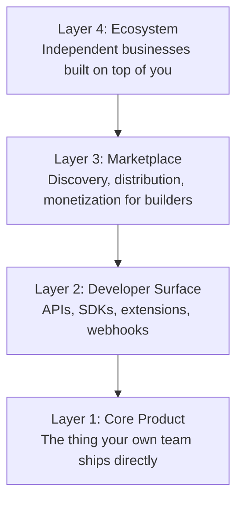
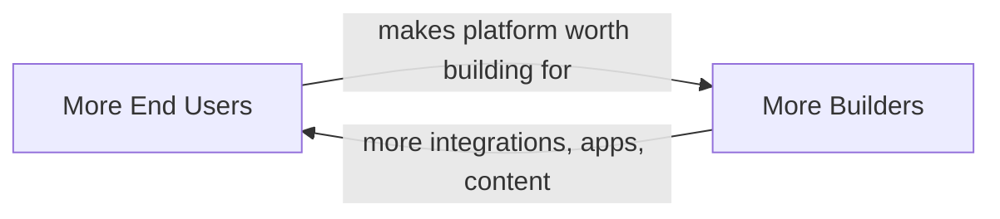

# Lesson 61: Platform Thinking: Products, Platforms, and Ecosystems

## Why This Lesson Matters

Lesson 60 closed the foundational arc of this curriculum by asking you to consolidate everything into a personal product philosophy. That philosophy was built almost entirely around a single mental image: one team, one product, one set of users. Module 7 breaks that image apart.

Most PMs spend their first several years working on what this lesson will call a **feature product** — a bounded set of capabilities serving a definable user, shipped by a single team you can name. But as products succeed, they tend to stop being feature products and start becoming **platforms**: systems whose value comes not from what the core team builds directly, but from what *other* teams, companies, and developers build on top of them. Amazon's retail storefront is a feature product. Amazon Web Services is a platform. Slack's messaging interface is a feature product. The Slack App Directory, built by thousands of external developers, is a platform layered on top of it.

This distinction matters because platform PMs are evaluated on a different axis than feature PMs. A feature PM asks, "did our product make the right decision for our users?" A platform PM must ask a second, harder question: "did our product make it possible — and worthwhile — for *someone else* to make good decisions on top of us?" Get this wrong, and you can ship a technically excellent platform that no one builds on, which is a failure mode invisible to every metric you learned about in Module 5, because usage of the platform by external builders doesn't show up in your own product's engagement dashboards at all.

This lesson introduces the vocabulary, diagnostic questions, and a new mental model — the Leverage Stack — that you will use throughout Module 7 to reason about products that succeed by empowering others rather than by directly serving an end user.

---

## Learning Path

| Field | Detail |
|---|---|
| **Module** | 7 — Platform, Technical & Data-Intensive Product Management |
| **Current Lesson** | 61 of 90 |
| **Difficulty** | 5 / 10 |
| **Estimated Study Time** | 40 minutes (reading) + 15 minutes (reflection + quiz) |
| **Prerequisites** | Lesson 1 (Accountability Triangle, Output vs. Outcome), Lesson 46 (Growth Loops and K-factor), Lesson 60 (Product Philosophy synthesis) |
| **Next Lesson** | Lesson 62 — APIs as Products: Designing for Developers |
| **Future Topics Unlocked** | Lesson 62 (APIs as Products), Lesson 63 (Two-Sided Marketplaces), Lesson 67 (Platform Governance), Lesson 78 (Build, Buy, or Partner) — all depend on the feature-product/platform distinction and the Leverage Stack introduced here |

---

## Learning Objectives

By the end of this lesson, you will be able to:

1. Distinguish a feature product from a platform product using the "who creates the value" test.
2. Explain the Leverage Stack and identify which layer a given product decision operates on.
3. Identify the distinct success metrics required for platform products versus feature products.
4. Describe at least two structural risks unique to platform businesses that do not exist for feature products.
5. Evaluate a real product decision for whether it strengthens or weakens third-party incentive to build on the platform.

---

## Prerequisites

This lesson assumes you carry forward the Accountability Triangle and Output vs. Outcome distinction from Lesson 1, and the growth loop vocabulary (in particular, the K-factor and the idea that growth can be structurally embedded in a product rather than bolted on) from Lesson 46. It also assumes the closing synthesis from Lesson 60 — that you have already articulated your own view of what a PM is accountable for — since this lesson is going to complicate that view by adding a second class of "user" you are accountable to: the builder.

---

## Theory

### The Feature Product / Platform Distinction

A useful diagnostic, sometimes called the **"who creates the value" test**: when a user has a good experience with your product, who built the thing that made that experience good?

- If the answer is almost always "our own team," you are managing a **feature product**.
- If the answer is increasingly "a third party we don't employ, using tools we built," you are managing a **platform**.

Most successful products migrate from the first category toward the second over time, not because platforms are inherently superior, but because a platform's value can scale without the core team's headcount scaling in proportion. A feature team of thirty engineers can ship a great note-taking app. It cannot, by itself, build ten thousand integrations connecting that note-taking app to every calendar, CRM, and messaging tool on earth. A platform can — by making those ten thousand integrations worthwhile for people who don't work for the company to build.

### The Leverage Stack

This lesson introduces the **Leverage Stack**, a four-layer model for reasoning about where a platform decision actually operates:

Each layer depends on the one below it, and a weakness at a lower layer caps everything above it. If your Developer Surface (Layer 2) is unreliable — APIs that change without notice, documentation that lags behind reality — no amount of investment in Marketplace discovery (Layer 3) will produce a thriving Ecosystem (Layer 4), because builders will not invest their own time and reputation on a foundation they don't trust.

The Leverage Stack is useful precisely because it forces you to locate a proposed initiative. "Should we build a plugin marketplace?" is a Layer 3 question that presupposes a healthy Layer 2. Teams frequently skip straight to Layer 3 or 4 investments — public marketplaces, developer conferences, partner co-marketing — while Layer 2 is still brittle, and then wonder why adoption stalls. We will return to this exact failure pattern in the Case Study below.

### Direct, Indirect, and Platform Network Effects

Lesson 46 introduced growth loops and the K-factor for user-to-user virality. Platforms introduce a related but distinct phenomenon: **network effects across two different populations** — builders and end users — where growth in one population increases the value of the platform for the other.

This loop, sometimes called a **cross-side network effect**, is the structural engine behind platforms like app stores, marketplaces, and developer ecosystems: more shoppers attract more sellers, and more sellers (with more selection) attract more shoppers. Note that this loop can also run in reverse and collapse just as powerfully — a platform that loses end users gives builders a reason to leave, which then gives remaining users a reason to leave too. Platform PMs must monitor both sides of this loop, not just the side closest to their own team's traditional metrics.

### Platform Value Capture: The Take-Rate Question

A platform must eventually answer how it captures value from the ecosystem it enables — typically through a **take rate** (a percentage of transactions, as with app store commissions or marketplace fees), a **subscription or usage fee** for developer access (as with many API-first companies), or an **indirect capture** strategy where the platform is monetized elsewhere and the developer surface is offered as a retention or distribution mechanism rather than a direct revenue line. Choosing the wrong capture mechanism, or setting a take rate that developers perceive as extractive relative to the value they receive, is one of the most common causes of ecosystem stagnation, and is a topic this curriculum returns to in Lesson 79 (Pricing Strategy at Scale).

---

## Common Beginner Mistakes

**Mistake 1: Building Layer 3 or 4 features before Layer 2 is trustworthy**

Investing in a public app directory or partner marketing before your API has stable versioning and reliable uptime guarantees builders will be burned, and burned builders do not return.

**Mistake 2: Treating developers as a segment of "users" rather than a distinct accountable population**

Developer needs (stability, predictability, clear deprecation policies) are frequently in tension with end-user needs (frequent visible changes, rapid iteration), and conflating the two leads to decisions that satisfy neither well.

**Mistake 3: Measuring platform health using only end-user metrics**

A platform can show healthy end-user engagement metrics for a long time after its Developer Surface has started to rot, because the existing integrations built years ago continue to function even as new integration is quietly grinding to a halt.

**Mistake 4: Underestimating the cost of a breaking API change**

A change that costs the internal team one sprint to make can cost the entire external developer ecosystem months of collective work to adapt to, multiplied across every integration — a cost that does not appear on the internal team's own roadmap.

**Mistake 5: Assuming platform success is a scaled-up version of feature success**

The skills that make someone excellent at shipping features that delight end users directly (fast iteration, frequent visible change, tight internal feedback loops) are not the same skills that make a platform trustworthy to build upon (stability, advance notice, backward compatibility) — and a team can be excellent at one while actively undermining the other.

---

## Mental Model: The Leverage Stack

The Leverage Stack introduced in the Theory section above is this lesson's core takeaway tool. Use it any time you evaluate a platform initiative, by asking three questions in order:

1. **Which layer does this initiative actually target** — Core Product, Developer Surface, Marketplace, or Ecosystem?
2. **Is the layer immediately below it healthy enough to support it?** An initiative targeting Layer 3 or 4 with a shaky Layer 2 underneath is premature, regardless of how compelling it looks in isolation.
3. **What does this initiative do to the cross-side network effect?** Does it make the platform more attractive to builders (which should, in turn, make it more attractive to end users), or does it only address end users directly, leaving the builder side untouched?

A team that can answer all three questions before greenlighting a platform initiative avoids the single most common platform failure mode: investing in visible, ecosystem-facing work while the foundation underneath is still too unreliable to support it.

---

## Real Company Example

Shopify's evolution from an online storefront builder into a commerce platform illustrates the Leverage Stack clearly. Shopify's Core Product (Layer 1) is the storefront and checkout experience a merchant uses directly. Its Developer Surface (Layer 2) — the Shopify APIs, the Liquid templating language, and the App Bridge SDK — allows outside developers to extend that storefront. Its Marketplace (Layer 3), the Shopify App Store, gives those developers discovery and monetization. Its Ecosystem (Layer 4) is the resulting universe of independent app-development businesses, theme designers, and agencies that now make a living entirely on top of Shopify's platform, in many cases without Shopify itself ever directly employing or directing them.

Public reporting on Shopify's app ecosystem suggests the company has invested heavily in developer-facing stability commitments — versioned APIs with defined deprecation timelines — specifically because merchants' trust in their storefronts depends on third-party apps continuing to function reliably over time. This is a direct illustration of the Layer 2 dependency point above: Shopify's Layer 3 marketplace could not thrive if Layer 2 were unstable, because every app in that marketplace is a promise made to a merchant on Shopify's behalf.

**Assumption flagged:** the specifics of Shopify's internal API governance and developer-relations strategy described here are inferred from public developer documentation and industry reporting, not confirmed internal company statements, and should be treated as illustrative rather than verified fact.

---

## Real World Perspective: Platform Thinking: Products, Platforms, and Ecosystems at Different Company Stages

**Startup:** Most startups never need to think about the Leverage Stack, because they are, correctly, entirely focused on Layer 1 — proving a feature product works for a well-defined set of end users. Premature platform thinking at this stage (building a public API before product-market fit) is a common and expensive form of scope creep; the Build Trap referenced in Lesson 1 has a platform-specific variant where "let's make it extensible" substitutes for the harder work of nailing the core experience first.

**Mid-size company:** This is typically where the feature-to-platform transition actually happens, often driven by a handful of large customers or partners requesting integrations the core team can't build individually. The PM's job at this stage is to resist building one-off custom integrations for each requester (which does not scale) and instead invest in a general-purpose Layer 2 developer surface that could serve all of them — a decision that trades short-term speed for long-term leverage.

**Big Tech:** Large, mature platforms (app stores, cloud infrastructure providers, major API ecosystems) operate with dedicated platform PM organizations whose primary customer is the external developer, not the end user. These PMs are frequently measured on metrics like third-party integration counts, developer satisfaction surveys, and API reliability SLAs rather than the end-user engagement metrics that dominate Module 5 — a genuinely different accountability structure from the one most PMs are trained on.

---

## Detailed Case Study: The Premature Marketplace

A mid-size project-management SaaS company, having grown to several thousand business customers, noticed that its largest customers kept requesting custom integrations with their internal tools. Leadership, eager to reduce this one-off integration burden and to signal ambition to investors, greenlit a public "App Marketplace" initiative — a Layer 3 investment, complete with a public directory, revenue-sharing terms for third-party developers, and a splashy launch event.

The problem: the company's underlying API (Layer 2) had been built organically over several years, without a formal versioning policy, and was already changing in breaking ways roughly every quarter as the core product evolved. The handful of internal engineers who understood the API's undocumented quirks had, until then, been the only people building against it, and they simply adapted their own code whenever something broke.

Within two quarters of the Marketplace launch, several of the earliest third-party developers who had built apps for the new directory found their integrations breaking without warning, with no changelog or deprecation notice to explain why. Two vocal early partners published public complaints about the experience. New developer sign-ups for the Marketplace slowed sharply, and — most damaging — the cross-side network effect began running in reverse: fewer working apps in the directory made the Marketplace less useful to end customers, which reduced the incentive for any *new* developer to invest the time to build there.

**What went wrong?** Using the Leverage Stack, the failure is precise: leadership invested directly in Layer 3 (the public Marketplace) while Layer 2 (the Developer Surface) was still unstable and undocumented. No amount of Marketplace polish — the directory design, the revenue-sharing terms, the launch event — could compensate for an API that broke trust every quarter. The company had, in effect, built a storefront on top of a foundation it hadn't finished pouring.

The company's eventual recovery involved freezing the public Marketplace, investing six months in Layer 2 fundamentals (a formal versioning scheme, a published deprecation policy, and a stable API gateway), and only then relaunching Marketplace recruitment — a sequencing lesson directly foreshadowing the API-design discipline covered in Lesson 62.

---

## Framework Explanation: The Platform Readiness Checklist

Before investing meaningfully in Layer 3 or Layer 4, a platform PM can use the following checklist to assess whether Layer 2 is genuinely ready to support them:

| Readiness Criterion | Question to Ask | Red Flag If... |
|---|---|---|
| Versioning | Does the API have an explicit version number and support policy? | Breaking changes ship without a version bump |
| Deprecation Notice | Is there a published minimum notice period before an endpoint is retired? | Endpoints disappear with no advance warning |
| Documentation Currency | Is the documentation verified against the live API on a regular cadence? | Developers report the docs don't match production behavior |
| Reliability SLA | Is there a defined and monitored uptime commitment for the developer surface? | No one internally can state the current uptime number |
| Support Channel | Is there a dedicated channel for developers to report and track API issues? | Developers resort to public social channels to get answers |

A "no" on more than one or two of these criteria is a strong signal that Layer 3 or 4 investment should be paused in favor of Layer 2 remediation, regardless of business pressure to launch something visible.

---

## Interview Perspective: How Interviewers Think About This

**"Tell me about a product you'd consider a platform, and explain why."** The interviewer is evaluating whether you can apply the "who creates the value" test correctly, rather than simply labeling any large or successful product a "platform" without justification.

**"How would you decide whether to invest in a public API for our product?"** The interviewer is testing whether you reach for the Leverage Stack's sequencing logic — assessing Layer 2 readiness before recommending Layer 3 or 4 investment — rather than jumping straight to enthusiasm about ecosystem potential.

**"A major partner is threatening to abandon their integration with our platform because of an unannounced breaking change. How do you respond?"** The interviewer is looking for recognition that the underlying issue is a Layer 2 trust failure, and that the appropriate response addresses the systemic cause (missing versioning and deprecation discipline) rather than only patching the individual relationship.

---

## Summary

Platform products differ from feature products in a fundamental way: their value increasingly comes from what third-party builders create, not from what the core team ships directly, which means platform PMs are accountable to a second population — developers and partners — whose needs (stability, predictability, advance notice) are frequently in tension with the needs of end users (novelty, frequent visible change). The Leverage Stack organizes platform investment into four layers — Core Product, Developer Surface, Marketplace, and Ecosystem — each dependent on the one beneath it, meaning that visible, ecosystem-facing investments will fail if the underlying Developer Surface is not yet trustworthy. Cross-side network effects, where growth in the builder population and the end-user population reinforce each other, are the structural engine of successful platforms, but this same loop can collapse in reverse with surprising speed once trust is broken. A platform PM's first responsibility, before any marketplace or ecosystem ambition, is to ensure the layer directly beneath any new initiative is genuinely ready to support it.

---

## Key Takeaways

- Platform products create value primarily through third-party builders, not the core team; feature products create value primarily through the core team's own work.
- The "who creates the value" test is a fast diagnostic for classifying a product as feature-oriented or platform-oriented.
- The Leverage Stack (Core Product → Developer Surface → Marketplace → Ecosystem) shows that higher layers cannot succeed if the layer beneath them is unreliable.
- Cross-side network effects link the builder population and the end-user population; growth in one can reinforce growth in the other, or collapse can spread the same way.
- Developer needs (stability, advance notice) are frequently in direct tension with end-user needs (frequent change), and platform PMs must manage both.
- Premature investment in visible marketplace or ecosystem initiatives, without a stable Developer Surface underneath, is one of the most common and costly platform failure modes.
- Platform value capture (take rate, developer fees, or indirect monetization) must be calibrated so developers do not perceive it as extractive relative to the value they receive.

---

## Cheat Sheet

*A two-minute review of everything in this lesson.*

- Feature product: value from your team. Platform: value from others building on you.
- Leverage Stack order: Core Product → Developer Surface → Marketplace → Ecosystem.
- Never invest heavily in Layer 3/4 until Layer 2 passes the Platform Readiness Checklist.
- Watch both sides of the cross-side network effect — builders and end users — not just end-user metrics.
- A broken API change costs the ecosystem far more than it costs your own sprint.

---

## Glossary

| Term | Definition | Related Concepts | Difficulty |
|---|---|---|---|
| Feature Product | A product whose value comes primarily from what the core team builds directly | Platform, Leverage Stack | 1 |
| Platform | A product whose value increasingly comes from what third parties build on top of it | Ecosystem, Developer Surface | 1 |
| Leverage Stack | Four-layer model: Core Product, Developer Surface, Marketplace, Ecosystem | Platform Readiness Checklist | 2 |
| Cross-Side Network Effect | Growth in one population (builders or end users) increases value for the other | K-factor (Lesson 46), Growth Loops | 2 |
| Take Rate | The percentage of transaction value a platform captures from ecosystem activity | Platform Value Capture, Lesson 79 (Pricing) | 2 |
| Developer Surface | The APIs, SDKs, and extension points that external builders use to build on a platform | API Versioning, Lesson 62 | 2 |
| Platform Readiness Checklist | A five-criterion framework for assessing whether a Developer Surface can support ecosystem investment | Leverage Stack | 2 |

---

## Further Reading / Resources

- Geoffrey Parker, Marshall Van Alstyne, and Sangeet Paul Choudary, *Platform Revolution*
- Michael Cusumano, Annabelle Gawer, and David Yoffie, *The Business of Platforms*
- David Evans and Richard Schmalensee, *Matchmakers: The New Economics of Multisided Platforms*

---

## Flashcards

**Card 1**
- Front: ** What is the "who creates the value" test?
- Back: ** Ask who built the thing that made a user's experience good — your own team (feature product) or a third party using your tools (platform).
- Difficulty: 2
- Tags: **, platform-thinking, diagnostic

**Card 2**
- Front: ** Name the four layers of the Leverage Stack in order.
- Back: ** Core Product → Developer Surface → Marketplace → Ecosystem.
- Difficulty: 2
- Tags: **, leverage-stack

**Card 3**
- Front: ** Why can a healthy end-user engagement metric mask a decaying platform?
- Back: ** Existing integrations keep working even as new developer investment quietly stalls, so end-user dashboards lag the real signal.
- Difficulty: 2
- Tags: **, metrics, platform-risk

**Card 4**
- Front: ** What is a cross-side network effect?
- Back: ** A loop where growth in one population (builders or end users) increases the platform's value for the other population, and vice versa.
- Difficulty: 2
- Tags: **, network-effects

**Card 5**
- Front: ** What does the Platform Readiness Checklist assess?
- Back: ** Whether a Developer Surface (Layer 2) is stable and trustworthy enough to support Marketplace or Ecosystem investment (Layers 3–4).
- Difficulty: 2
- Tags: **, platform-readiness

**Card 6**
- Front: ** Why did the SaaS company's Marketplace fail in the Case Study?
- Back: ** It invested in a public Layer 3 marketplace while its Layer 2 API was still unversioned and prone to undocumented breaking changes.
- Difficulty: 2
- Tags: **, case-study, sequencing

**Card 7**
- Front: ** Name two things that are typically in tension between developers and end users.
- Back: ** Developers want stability and advance notice; end users often want frequent, visible change and rapid iteration.
- Difficulty: 2
- Tags: **, tradeoffs

## Reflection Exercise

You are the PM for a well-established consumer photo-editing app with a loyal user base. Your VP of Business Development has just signed a partnership with three well-known third-party developers who want to build plugins on top of your product, and has promised them API access within one quarter. Your engineering team tells you the current internal API was never designed for external use, has no versioning, and changes almost every release cycle to support the core product's own roadmap.

There is no single correct answer to the prompts below — the goal is to practice applying the Leverage Stack and the Platform Readiness Checklist under real business pressure.

1. Using the Leverage Stack, identify exactly which layer the VP's commitment targets, and which layer(s) beneath it need to be assessed first.
2. Run the situation through the Platform Readiness Checklist. Which criteria are most likely to fail, given what engineering has told you?
3. What would you say to the VP if you believed the one-quarter timeline was not achievable without serious risk to the partnership?
4. Is there a smaller, lower-risk commitment you could offer the three partners in the short term while Layer 2 work proceeds? Describe it.
5. How would you explain, to a non-technical stakeholder, why "we already have an API" does not mean "we are ready for outside developers to build on it"?

---

## Quiz

**1. What is the "who creates the value" test used to determine?**
A) Whether a product is profitable
B) Whether a product is a feature product or a platform
C) Whether a product should be open source
D) Whether a product needs a mobile app

*Correct answer: B*
*Explanation: The test asks who built the thing responsible for a good user experience — your own team, or a third party — to classify the product.*
*Learning objective tested: #1*
*Difficulty: Easy*

---

**2. In the Leverage Stack, which layer sits directly above the Core Product?**
A) Ecosystem
B) Marketplace
C) Developer Surface
D) End Users

*Correct answer: C*
*Explanation: The Leverage Stack order is Core Product, then Developer Surface, then Marketplace, then Ecosystem.*
*Learning objective tested: #2*
*Difficulty: Easy*

---

**3. Why can a platform's end-user engagement metrics remain healthy even after its Developer Surface has begun to decay?**
A) End users do not care about third-party integrations
B) Existing integrations continue functioning while new developer investment quietly stalls
C) Engagement metrics automatically adjust for developer issues
D) Developer Surface decay always shows up immediately in end-user metrics

*Correct answer: B*
*Explanation: Old integrations keep working for a time even as new building on the platform grinds to a halt, so the decay is initially invisible to end-user dashboards.*
*Learning objective tested: #3*
*Difficulty: Easy*

---

**4. What is a cross-side network effect?**
A) A loop where a single user's engagement affects only their own experience
B) A loop where growth in the builder population and the end-user population reinforce each other
C) A pricing model unique to marketplaces
D) A technical architecture pattern for APIs

*Correct answer: B*
*Explanation: Cross-side network effects describe how growth in one population (builders or end users) increases the platform's value to the other population.*
*Learning objective tested: #2*
*Difficulty: Easy*

---

**5. Which of the following is a structural risk unique to platform businesses, not feature products?**
A) The risk of shipping a feature no one wants
B) The risk that a cross-side network effect can collapse in reverse across two populations at once
C) The risk of missing a project deadline
D) The risk of a poorly worded error message

*Correct answer: B*
*Explanation: Feature products don't have a second population (builders) whose departure can trigger a reinforcing collapse with the end-user population; this risk is specific to platforms.*
*Learning objective tested: #4*
*Difficulty: Easy*

---

**6. According to this lesson, what is typically in tension between developers and end users?**
A) Developers want frequent change; end users want stability
B) Developers want stability and advance notice; end users often want frequent, visible change
C) There is no meaningful tension between the two groups
D) Developers and end users always want identical things

*Correct answer: B*
*Explanation: Developers need predictability to build reliably; end users often expect and reward visible iteration, creating a structural tension platform PMs must manage.*
*Learning objective tested: #4*
*Difficulty: Easy*

---

**7. In the Case Study, what was the root cause of the Marketplace's failure?**
A) The revenue-sharing terms were too generous to developers
B) A Layer 3 investment (public Marketplace) was made while Layer 2 (the API) was unstable and undocumented
C) The launch event was poorly attended
D) The company chose the wrong third-party developers to recruit first

*Correct answer: B*
*Explanation: The Leverage Stack diagnosis is precise: Layer 3 investment cannot succeed if Layer 2 beneath it is untrustworthy.*
*Learning objective tested: #2, #4*
*Difficulty: Medium*

---

**8. What does the Platform Readiness Checklist help a PM assess?**
A) Whether the core product has product-market fit
B) Whether the Developer Surface is stable enough to support Marketplace or Ecosystem investment
C) Whether a company should IPO
D) Whether an end-user feature should be prioritized

*Correct answer: B*
*Explanation: The checklist evaluates versioning, deprecation notice, documentation currency, reliability SLA, and support channels — all Layer 2 concerns.*
*Learning objective tested: #5*
*Difficulty: Medium*

---

**9. Why is premature platform investment a common mistake at early-stage startups specifically?**
A) Startups lack the legal resources to run a marketplace
B) It substitutes "let's make it extensible" for the harder work of proving the core feature product works first
C) Startups are legally prohibited from having APIs
D) Investors always discourage platform thinking at any stage

*Correct answer: B*
*Explanation: The Real World Perspective section identifies this as a platform-specific variant of the Build Trap, where extensibility work displaces the harder task of nailing product-market fit.*
*Learning objective tested: #1*
*Difficulty: Medium*

---

**10. At a mid-size company, what typically triggers the transition from feature product to platform?**
A) A mandate from the board with no customer input
B) A handful of large customers or partners requesting integrations the core team can't build individually
C) A decision to reduce headcount
D) A change in company logo or branding

*Correct answer: B*
*Explanation: The Real World Perspective section describes this as the typical mid-size-company trigger for platform investment.*
*Learning objective tested: #1, #3*
*Difficulty: Medium*

---

**11. What is a "take rate" in the context of platform value capture?**
A) The speed at which a platform ships new features
B) The percentage of transaction value a platform captures from ecosystem activity
C) The rate at which developers abandon a platform
D) The interest rate charged on platform loans

*Correct answer: B*
*Explanation: Take rate refers to the platform's mechanism for capturing a share of the value generated by ecosystem transactions, such as app store commissions.*
*Learning objective tested: #3*
*Difficulty: Medium*

---

**12. (Scenario) A platform team wants to launch a public developer conference and co-marketing campaign (Layer 4) while its API still changes unpredictably every release (Layer 2 issue). Using the Leverage Stack, what should the PM recommend?**
A) Proceed with the conference as planned, since marketing and engineering are unrelated concerns
B) Pause the Layer 4 investment and prioritize Layer 2 stability first, since higher layers depend on the layer beneath them
C) Cancel the API entirely and rebuild the product from scratch
D) Proceed with the conference, but ask developers to sign a waiver

*Correct answer: B*
*Explanation: The Leverage Stack's core insight is that higher-layer investment cannot succeed without a stable layer beneath it; the PM should sequence Layer 2 stability first.*
*Learning objective tested: #2, #5*
*Difficulty: Medium-Hard*

---

**13. (Product Thinking) A Big Tech platform PM is evaluated primarily on third-party integration counts and API reliability SLAs rather than end-user engagement metrics. What does this reflect about platform accountability?**
A) Platform PMs are never accountable for end users
B) Platform PMs have an accountability structure that includes a second population — developers — whose success is measured differently than end-user success
C) Big Tech companies do not track end-user metrics
D) API reliability SLAs are irrelevant to platform success

*Correct answer: B*
*Explanation: The Real World Perspective section notes platform PMs are accountable to developers as a distinct population, measured through different metrics than the ones dominating Module 5.*
*Learning objective tested: #3, #4*
*Difficulty: Hard*

---

**14. (Interview Reasoning) A candidate, asked how they'd decide whether to invest in a public API, immediately describes an ambitious ecosystem vision without mentioning current API stability. What does this most likely signal, per this lesson's Interview Perspective section?**
A) Strong strategic vision with no weaknesses
B) A failure to apply the Leverage Stack's sequencing logic — jumping to Layer 3/4 enthusiasm without assessing Layer 2 readiness first
C) That the candidate should be hired immediately
D) Nothing meaningful; ecosystem vision is the only relevant factor

*Correct answer: B*
*Explanation: The Interview Perspective section identifies this exact gap — enthusiasm about ecosystem potential without Layer 2 readiness assessment — as a weak signal.*
*Learning objective tested: #2, #5*
*Difficulty: Hard*

---

**15. (Product Thinking, Highest Difficulty) A VP has committed to three external partners that they will receive API access within one quarter, but engineering reports the internal API has no versioning and changes almost every release. Using only the frameworks in this lesson, what is the PM's best course of action?**
A) Proceed as promised, since a VP commitment overrides internal readiness concerns
B) Refuse outright and cancel the partnership without offering any alternative
C) Assess the Developer Surface against the Platform Readiness Checklist, communicate the specific gaps and risks to the VP, and propose a lower-risk interim commitment while Layer 2 stability work proceeds
D) Immediately launch a public Marketplace to satisfy the partners' urgency

*Correct answer: C*
*Explanation: This mirrors the Reflection Exercise and the Case Study: the PM's job is neither blind compliance nor outright refusal, but to diagnose the actual Layer 2 gap using the Readiness Checklist, communicate it clearly, and propose a workable interim path.*
*Learning objective tested: #1, #2, #5*
*Difficulty: Hard*

---

## Connections

| | Lesson | Core Idea Carried Forward |
|---|---|---|
| **Previous Lesson** | Lesson 60 — Capstone: Building Your Own Product Philosophy | Extends your personal PM accountability model to include a second population: external builders |
| **Current Lesson** | Lesson 61 — Platform Thinking: Products, Platforms, and Ecosystems | Feature product vs. platform; the Leverage Stack; cross-side network effects; Platform Readiness Checklist |
| **Next Lesson** | Lesson 62 — APIs as Products: Designing for Developers | Deep-dives into Layer 2 of the Leverage Stack, formalizing what "API stability" concretely requires |
| **Future Concepts Unlocked** | Lesson 63 (Two-Sided Marketplaces) | Extends cross-side network effects into a full marketplace-design framework |
| | Lesson 67 (Platform Governance) | Addresses what happens when Ecosystem-layer activity (Layer 4) requires trust and safety enforcement |
| | Lesson 78 (Build, Buy, or Partner) | Revisits the Leverage Stack when deciding whether to build platform capability internally or rely on external partners |
| | Lesson 79 (Pricing Strategy at Scale) | Extends the take-rate value-capture question introduced here into full enterprise pricing mechanics |

This curriculum continues to build as one continuous argument. From this lesson forward, any reference to a "platform" decision assumes you can locate it within the Leverage Stack without re-explanation.
