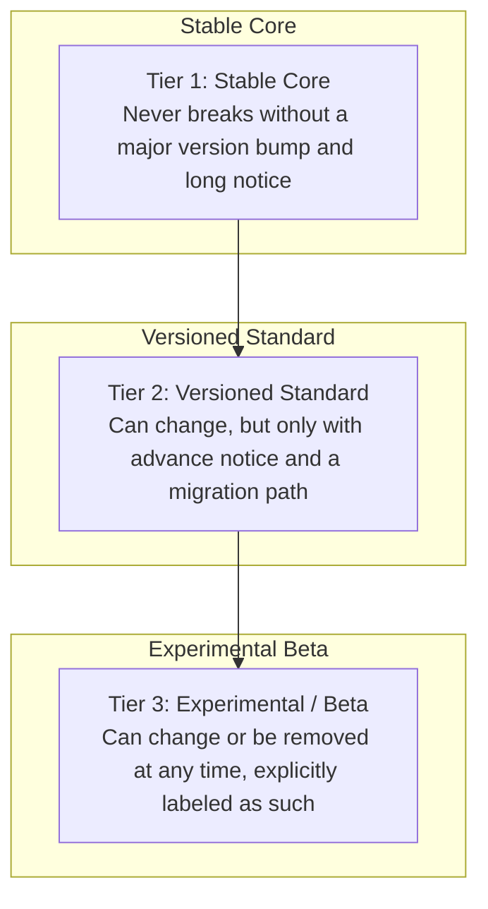
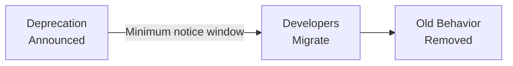

# Lesson 62: APIs as Products: Designing for Developers

## Why This Lesson Matters

Lesson 61 introduced the Leverage Stack and made a claim that this lesson now has to make good on: that Layer 2, the Developer Surface, is the load-bearing layer of any platform — the one every marketplace and ecosystem ambition ultimately depends on. But "build a stable Developer Surface" is not yet an actionable instruction. It doesn't tell you what to actually design, decide, or refuse when you sit down to define an API.

This lesson treats the API itself as a product with its own user — the developer — and its own version of the three core questions from Lesson 1: what problem is this API solving, for which developer, and how will you know if it worked? Most engineers, and most PMs new to platform work, treat an API as a technical artifact: a set of endpoints that exposes internal functionality to the outside world. That framing is incomplete in a way that causes real damage. An API is not just an interface. It is a **promise** — a commitment about what will and will not change, made to people who will build businesses, careers, and production systems on the assumption that the promise holds.

This reframing — API as promise, not just as interface — is the foundation for everything else in this lesson, and it directly explains why the Case Study in Lesson 61 went wrong: the company had endpoints, but it had never actually decided, articulated, or communicated what it was promising anyone. This lesson gives you the vocabulary and the discipline to make that promise explicit, and to design an API that a developer can safely build a business on top of.

---

## Learning Path

| Field | Detail |
|---|---|
| **Module** | 7 — Platform, Technical & Data-Intensive Product Management |
| **Current Lesson** | 62 of 90 |
| **Difficulty** | 6 / 10 |
| **Estimated Study Time** | 40 minutes (reading) + 15 minutes (reflection + quiz) |
| **Prerequisites** | Lesson 61 (Leverage Stack, Platform Readiness Checklist) |
| **Next Lesson** | Lesson 63 — Two-Sided Marketplaces and Network Effects |
| **Future Topics Unlocked** | Lesson 63 (Two-Sided Marketplaces), Lesson 67 (Platform Governance), Lesson 68 (Technical Debt at Scale) — all depend on the Promise Tiers model and versioning discipline introduced here |

---

## Learning Objectives

By the end of this lesson, you will be able to:

1. Explain why an API should be understood as a product promise rather than merely a technical interface.
2. Apply the Promise Tiers model to classify any given API surface by its stability commitment.
3. Identify the essential elements of good API design that reduce integration cost for developers.
4. Explain the relationship between semantic versioning, deprecation policy, and developer trust.
5. Evaluate a proposed API change for which Promise Tier it violates, and recommend an appropriate rollout process.

---

## Prerequisites

This lesson assumes you carry forward the Leverage Stack and the Platform Readiness Checklist from Lesson 61, in particular the five readiness criteria (versioning, deprecation notice, documentation currency, reliability SLA, support channel), which this lesson now expands into a full design and governance discipline for the Developer Surface layer specifically.

---

## Theory

### The API as a Promise, Not an Interface

Every API endpoint makes an implicit or explicit claim about three things: **what it does**, **what shape its inputs and outputs take**, and **how long that behavior can be relied upon**. Internal APIs, used only by teams inside the same company, can get away with treating this claim loosely, because the people affected by a change sit in the same building and can be told directly, or can simply read the updated code. External developer-facing APIs cannot. The developer building against your API today may not read your changelog, may not be in contact with anyone at your company, and may have shipped code six months ago that assumes today's behavior will still hold next year.

This asymmetry — the API provider can see and control every change, while the API consumer can only see the promise as it stood at the time they built against it — is the central design constraint of Layer 2. Good API design is, above all, a discipline of making explicit, keepable promises, and then keeping them.

### The Promise Tiers Model

This lesson introduces the **Promise Tiers** model: every part of an API surface sits in one of three concentric tiers, each with a different stability guarantee.

The critical discipline is not choosing the right tier once — it is being explicit, in the documentation itself, about which tier any given endpoint or field belongs to, and never silently promoting a Tier 3 experimental feature into de facto Tier 1 status just because developers started depending on it. A common and dangerous failure mode is the reverse: a company labels something "beta" to buy itself flexibility, developers adopt it heavily anyway because it is useful, and the company later discovers it cannot actually change the "beta" endpoint without breaking a large fraction of its ecosystem — the promise became real in practice even though it was never made real on paper.

### Semantic Versioning and Deprecation as Trust Mechanisms

**Semantic versioning** (a MAJOR.MINOR.PATCH numbering scheme) gives developers a fast, unambiguous signal about the size of a change: patch releases fix bugs without changing behavior developers rely on; minor releases add capability without breaking existing usage; major releases may break existing usage and require developers to take action. A **deprecation policy** — a published minimum time window between announcing that a feature will be removed and actually removing it — converts an abstract promise ("we won't surprise you") into an operational guarantee developers can plan around, budget engineering time for, and trust.

Together, these two mechanisms are what actually make the Tier 1/Tier 2 distinction meaningful. Without them, "stable" is just a marketing word.

### Reducing Integration Cost

Beyond stability, good API design reduces the total cost a developer pays to integrate successfully. Key elements include: **consistent resource naming** (so patterns learned on one endpoint transfer to others), **predictable error formats** (so failure handling code can be written once and reused), **idempotency** for operations that create or modify data (so a developer's retry logic after a network failure doesn't accidentally duplicate an action), **sensible pagination defaults**, and **clear, enforced rate limits communicated in response headers** rather than discovered only after being throttled. None of these are exotic; all of them are frequently skipped under deadline pressure, and each one that is skipped becomes a permanent tax on every developer who ever integrates.

---

## Common Beginner Mistakes

**Mistake 1: Treating "beta" as a permission slip rather than a promise about instability**

Labeling something beta doesn't reduce your obligation to developers who depend on it if you never actually communicate, monitor, or enforce that instability.

**Mistake 2: Confusing internal API discipline with external API discipline**

Practices that are fine for APIs consumed only by co-located teams (undocumented breaking changes, informal Slack notice) are actively harmful once external developers depend on the same surface.

**Mistake 3: Designing the API around your own database schema rather than the developer's mental model**

An API that mirrors internal implementation details, rather than the concepts a developer actually reasons in, forces every integrator to relearn your internal architecture just to accomplish a simple task.

**Mistake 4: Shipping inconsistent error handling across endpoints**

When different parts of an API return errors in different shapes, every developer must write custom handling logic for each endpoint, multiplying integration cost across the entire ecosystem.

**Mistake 5: Announcing a deprecation with no migration path**

Telling developers something will stop working, without a concrete alternative and enough lead time to adopt it, converts a manageable transition into a forced, disruptive scramble — and is remembered.

---

## Mental Model: The Promise Tiers

The Promise Tiers model introduced above is this lesson's core takeaway tool. When evaluating any proposed API change, ask:

1. **Which tier does the affected surface currently sit in** — Stable Core, Versioned Standard, or Experimental/Beta — according to your own published documentation?
2. **Does the proposed change respect that tier's guarantee?** A breaking change to Tier 1 without a major version bump and long notice is a broken promise, regardless of engineering's intent.
3. **If the change is necessary, what is the correct rollout mechanism for that tier** — a deprecation notice and migration window for Tier 2, or a simple heads-up for Tier 3?

This model gives you a fast, defensible answer any time an engineering team proposes shipping a change quickly: not "can we ship this," but "which promise does this touch, and are we honoring it."

---

## Real Company Example

Stripe's API is widely cited in the developer community as an example of API-as-product discipline. Stripe uses dated API versions (for example, an account is pinned to the API version active when it was created, and can choose to upgrade deliberately rather than being forced onto changes), giving developers explicit control over when they absorb behavioral changes rather than having those changes imposed on them silently. Public developer documentation and industry commentary consistently point to this versioning discipline, along with consistent, well-documented error object formats across all endpoints, as a major contributor to Stripe's reputation for being unusually easy to integrate with reliably over long periods of time.

**Assumption flagged:** the specifics of Stripe's internal versioning governance process are inferred from public API documentation and developer community commentary, not confirmed internal company statements, and should be treated as illustrative rather than verified fact.

---

## Real World Perspective: APIs as Products: Designing for Developers at Different Company Stages

**Startup:** Early-stage companies building their first external API often skip formal versioning entirely, reasoning that they have few enough external developers to coordinate changes manually. This is a defensible short-term trade-off, but the Case Study below shows how quickly it becomes unmanageable once developer count grows even modestly, and the fix is far more expensive after the fact than the discipline would have been from the start.

**Mid-size company:** This is typically where the absence of formal Promise Tiers starts to hurt visibly — enough external developers now depend on the API that undocumented changes generate real support tickets and real churn, but not enough process discipline yet exists to prevent them. The PM's job here is often to introduce versioning and deprecation policy retroactively onto an API that was never designed with them in mind, which is materially harder than building it in from the start.

**Big Tech:** Mature platform organizations typically maintain dedicated API governance teams whose job is enforcing Promise Tier discipline across dozens or hundreds of internal teams shipping API changes, precisely because at this scale no single person can track every external dependency by memory, and a single careless breaking change can generate ecosystem-wide damage.

---

## Detailed Case Study: The Silent Webhook Change

A payments infrastructure startup offered a webhook system that notified partner businesses whenever a transaction's status changed, allowing those partners to update their own records automatically. The webhook payload had grown organically over two years, and the engineering team, working on an internal refactor, renamed a field from `transaction_status` to `status` to simplify their internal data model — a change that felt trivial internally, since it was a single line of code and every internal consumer of the webhook was updated in the same pull request.

The team did not realize, because no one had ever inventoried who consumed the webhook externally, that dozens of partner businesses had built reconciliation systems that parsed the payload by field name. The rename shipped on a Friday afternoon with no changelog entry and no advance notice. Over the following weekend, partner reconciliation jobs silently began failing to detect status changes at all, since their code was looking for a field that no longer existed. Several partners did not notice the failure until Monday, by which point a weekend's worth of transactions had gone unreconciled — a problem that took additional days to trace back to its actual cause, since nothing in the partners' own systems had thrown an error; the field had simply stopped appearing.

**What went wrong?** Using the Promise Tiers model, the failure is precise: the webhook payload had, in practice, become part of the Stable Core — dozens of partners depended on its exact shape for financially significant reconciliation — but the company had never formally classified it as such, and treated it internally as though it were still an implementation detail free to change at will. There was no versioning, no deprecation notice, and critically, no inventory of who was actually depending on the field. The company's actual promise (unstated) diverged sharply from its actual behavior (silent breaking changes), and partners paid the cost of that gap.

The company's recovery involved formally classifying the webhook payload as Tier 1, introducing a versioned webhook format going forward, and building the kind of partner-facing change communication process this curriculum will revisit directly in Lesson 67 (Platform Governance), when we address the broader question of how a platform maintains trust and safety obligations toward the ecosystem built on top of it.

---

## Framework Explanation: The API Design Checklist

Before shipping a new external-facing endpoint or modifying an existing one, a platform PM can use the following checklist:

| Design Element | Question to Ask | Cost of Skipping It |
|---|---|---|
| Consistent Naming | Does this resource follow the same naming pattern as similar existing resources? | Developers cannot generalize patterns; every endpoint requires separate learning |
| Predictable Errors | Does this endpoint return errors in the same shape as the rest of the API? | Duplicate error-handling code across every integration |
| Idempotency | Can a developer safely retry this operation after a network failure without side effects? | Silent duplicate transactions or records on retry |
| Pagination | Is there a sensible default page size and a documented way to fetch more? | Developers either over-fetch or write brittle custom pagination logic |
| Rate Limit Transparency | Are current rate limits communicated in response headers, not just documentation? | Developers discover limits only by being throttled in production |
| Tier Classification | Is it documented, explicitly, which Promise Tier this endpoint belongs to? | Developers cannot assess their own integration risk accurately |

A "no" on the Tier Classification row in particular should block a launch outright — an unclassified endpoint is a promise made by default, without anyone having actually decided what that promise is.

---

## Interview Perspective: How Interviewers Think About This

**"How would you decide whether an API change is safe to ship?"** The interviewer is evaluating whether you reach for a structured model like Promise Tiers — asking which tier the surface belongs to and whether the change respects that tier's guarantee — rather than relying on engineering intuition about whether a change "feels big."

**"Tell me about a time an API change caused unexpected downstream problems."** The interviewer is listening for whether you recognize the root cause pattern from this lesson: an implicit promise (often around something like a webhook field or response shape) that was never explicitly classified or inventoried, and therefore was broken without anyone realizing a promise existed.

**"How do you balance API stability with the need for the internal team to move quickly?"** The interviewer is testing whether you understand that Promise Tiers is precisely the mechanism for resolving this tension — Tier 3 experimental surfaces preserve internal speed, while Tier 1 surfaces protect ecosystem trust, and the discipline is in classifying correctly and never quietly blurring the two.

---

## Summary

An API is best understood not as a technical interface but as a promise made to developers who cannot see your internal roadmap and may have built production systems on the assumption that today's behavior will hold. The Promise Tiers model — Stable Core, Versioned Standard, and Experimental/Beta — gives a platform PM a concrete way to classify any part of an API surface and decide what rollout process a proposed change requires, with semantic versioning and published deprecation policies converting the abstract promise of stability into an operational guarantee developers can actually plan around. Good API design further reduces integration cost through consistency, predictable errors, idempotency, sensible pagination, and transparent rate limiting — none of which are exotic, but all of which are frequently skipped under deadline pressure at real cost to every developer who integrates afterward. The most damaging platform failures often occur not because a company broke an explicit promise, but because it never classified an implicit one, and changed something developers had, in practice, already come to depend on as though it were permanent.

---

## Key Takeaways

- An API should be treated as a product promise to developers, not merely a technical interface.
- The Promise Tiers model classifies any API surface as Stable Core, Versioned Standard, or Experimental/Beta, each with a different stability guarantee.
- Semantic versioning and published deprecation policies convert abstract stability claims into guarantees developers can actually plan around.
- Good API design reduces integration cost through consistent naming, predictable errors, idempotency, sensible pagination, and transparent rate limits.
- Labeling something "beta" does not reduce your real-world obligation if developers adopt it heavily anyway — the promise becomes real in practice regardless of labeling.
- The most damaging platform failures often stem from an implicit, unclassified promise being broken, not an explicit one.
- Before shipping any external-facing endpoint, explicit tier classification should be a launch-blocking requirement, not an afterthought.

---

## Cheat Sheet

*A two-minute review of everything in this lesson.*

- An API is a promise, not just an interface.
- Promise Tiers: Stable Core (never breaks without major version + long notice) → Versioned Standard (changes with notice + migration path) → Experimental/Beta (can change anytime, clearly labeled).
- Semantic versioning + deprecation policy = the mechanisms that make "stable" mean something.
- Reduce integration cost: consistent naming, predictable errors, idempotency, pagination, transparent rate limits.
- Before any external API change ships: which tier does it touch, and does the rollout process match that tier?

---

## Glossary

| Term | Definition | Related Concepts | Difficulty |
|---|---|---|---|
| Promise Tiers | Three-level model classifying API surfaces by stability guarantee: Stable Core, Versioned Standard, Experimental/Beta | Leverage Stack (Lesson 61), Deprecation Policy | 2 |
| Semantic Versioning | MAJOR.MINOR.PATCH numbering scheme signaling the size and safety of a change | Promise Tiers | 1 |
| Deprecation Policy | A published minimum notice window before a feature is removed | Promise Tiers, Developer Trust | 2 |
| Idempotency | A property where repeating an operation produces the same result without unintended side effects | API Design Checklist | 2 |
| Rate Limit | A cap on how many requests a developer can make in a given time window | API Design Checklist | 1 |
| API as Promise | The reframing of an API as a commitment to developers rather than a purely technical interface | Promise Tiers, Lesson 61 | 1 |

---

## Further Reading / Resources

- Mehdi Medjaoui, Erik Wilde, Ronnie Mitra, and Mike Amundsen, *Continuous API Management*
- Google's API design documentation team (Google Cloud publication), *Web API Design: The Missing Link*
- Brenda Jin, Saurabh Sahni, and Amir Shevat, *Designing Web APIs*

---

## Flashcards

**Card 1**
- Front: ** Why should an API be understood as a promise rather than an interface?
- Back: ** Because developers build production systems assuming today's behavior will hold, without visibility into your roadmap — a broken assumption has real downstream cost.
- Difficulty: 2
- Tags: **, api-design, core-concept

**Card 2**
- Front: ** Name the three Promise Tiers in order of stability.
- Back: ** Stable Core, Versioned Standard, Experimental/Beta.
- Difficulty: 2
- Tags: **, promise-tiers

**Card 3**
- Front: ** What does semantic versioning communicate that a plain version number doesn't?
- Back: ** The size and safety of a change — patch (bug fix), minor (additive), major (breaking) — so developers know how much risk a change carries.
- Difficulty: 2
- Tags: **, versioning

**Card 4**
- Front: ** Why did labeling the webhook field as "internal implementation detail" fail in the Case Study?
- Back: ** Dozens of partners had, in practice, already come to depend on it for reconciliation, so it functioned as a Tier 1 promise even though it was never classified as one.
- Difficulty: 2
- Tags: **, case-study, promise-tiers

**Card 5**
- Front: ** What is idempotency and why does it matter for API design?
- Back: ** The property that repeating an operation produces the same result without unintended side effects — critical so retry logic after network failures doesn't create duplicates.
- Difficulty: 2
- Tags: **, api-design

**Card 6**
- Front: ** What should block a launch, according to the API Design Checklist?
- Back: ** An endpoint with no explicit Promise Tier classification — an unclassified endpoint is a promise made by default without anyone deciding what it is.
- Difficulty: 2
- Tags: **, api-design-checklist

**Card 7**
- Front: ** What converts an abstract stability claim into an operational guarantee?
- Back: ** Semantic versioning combined with a published, enforced deprecation policy.
- Difficulty: 2
- Tags: **, versioning, deprecation

## Reflection Exercise

You are the PM for a mid-size logistics software company. Your API currently has no formal versioning, and engineering wants to change the response format of the `/shipments` endpoint to add nested location data, restructuring several existing fields in the process. Product analytics show at least 40 external companies actively integrate with this endpoint, but you don't have complete visibility into exactly how each of them parses the response.

There is no single correct answer to the prompts below — the goal is to practice applying the Promise Tiers model and the API Design Checklist under incomplete information.

1. Using the Promise Tiers model, which tier does the `/shipments` endpoint most likely belong to in practice, even though it was never formally classified? Justify your answer.
2. What steps would you take to build a more complete inventory of who depends on this endpoint and how, before deciding on a rollout plan?
3. Propose a rollout approach that lets engineering ship the improved data structure without breaking existing integrations.
4. What would you say to engineering if they argued the change was "just a refactor" and shouldn't require a deprecation process?
5. How might you use this incident to argue for introducing formal versioning going forward, even though it will slow down some future engineering work?

---

## Quiz

**1. According to this lesson, what should an API primarily be understood as?**
A) A purely internal technical artifact
B) A promise made to developers about what will and will not change
C) A marketing asset
D) A one-time deliverable with no ongoing obligations

*Correct answer: B*
*Explanation: The lesson reframes an API as a commitment to developers who build on the assumption that today's behavior will continue to hold.*
*Learning objective tested: #1*
*Difficulty: Easy*

---

**2. In the Promise Tiers model, which tier can change or be removed at any time, as long as it is explicitly labeled?**
A) Stable Core
B) Versioned Standard
C) Experimental/Beta
D) None — all tiers require the same notice period

*Correct answer: C*
*Explanation: Experimental/Beta is the tier where change is expected and permitted at any time, provided it is clearly labeled as such.*
*Learning objective tested: #2*
*Difficulty: Easy*

---

**3. What is the danger of labeling something "beta" without actually enforcing its instability?**
A) There is no danger; the label alone protects the company
B) Developers may adopt it heavily anyway, making it a de facto Tier 1 promise even though it was never classified as one
C) Beta labels automatically expire after 90 days
D) Beta features cannot be used by external developers by definition

*Correct answer: B*
*Explanation: Heavy adoption converts an unclassified or mislabeled surface into a real dependency, regardless of what label was applied.*
*Learning objective tested: #2*
*Difficulty: Easy*

---

**4. What does semantic versioning's MAJOR version number typically signal?**
A) A bug fix with no behavior change
B) An additive change that doesn't break existing usage
C) A change that may break existing usage and require developer action
D) A purely cosmetic documentation update

*Correct answer: C*
*Explanation: Major version bumps signal changes that may require developers to take action, as opposed to minor (additive) or patch (bug fix) changes.*
*Learning objective tested: #4*
*Difficulty: Easy*

---

**5. Why does idempotency matter for API design?**
A) It makes API responses load faster
B) It ensures repeated operations after a network failure don't produce unintended duplicate side effects
C) It is required for an API to be considered RESTful
D) It has no practical impact on developer experience

*Correct answer: B*
*Explanation: Idempotency protects against duplicate actions when a developer's retry logic re-sends a request after an uncertain network failure.*
*Learning objective tested: #3*
*Difficulty: Easy*

---

**6. In the Case Study, why didn't engineering realize the webhook field rename would cause problems?**
A) They had tested the change with all external partners beforehand
B) No inventory existed of which external partners depended on the field, and all internal consumers had been updated in the same change
C) The change was announced with six months' notice
D) The field had never been used by any partner

*Correct answer: B*
*Explanation: The team updated internal consumers in the same pull request and had no visibility into external dependency on the field, since no inventory existed.*
*Learning objective tested: #1, #5*
*Difficulty: Easy*

---

**7. What converts an abstract "we won't surprise you" stability claim into an operational guarantee?**
A) A press release
B) Semantic versioning combined with a published, enforced deprecation policy
C) A verbal agreement with the largest partner only
D) Renaming the endpoint periodically

*Correct answer: B*
*Explanation: These two mechanisms together are what make a stability promise concrete and plannable rather than just a marketing claim.*
*Learning objective tested: #4*
*Difficulty: Medium*

---

**8. According to the API Design Checklist, what is the cost of inconsistent error formats across endpoints?**
A) Slightly slower response times
B) Developers must write duplicate, endpoint-specific error-handling code across every integration
C) It has no measurable cost
D) It only affects internal teams, never external developers

*Correct answer: B*
*Explanation: Inconsistent error shapes prevent developers from writing reusable error-handling logic, multiplying integration cost.*
*Learning objective tested: #3*
*Difficulty: Medium*

---

**9. Why do early-stage startups often skip formal API versioning, according to the Real World Perspective section?**
A) Versioning is technically impossible for small teams
B) They reason that with few external developers, changes can be coordinated manually
C) Investors explicitly prohibit versioning at early stages
D) Formal versioning is only relevant for hardware products

*Correct answer: B*
*Explanation: With a small developer base, manual coordination can substitute for formal versioning in the short term — though this becomes unmanageable as the developer base grows.*
*Learning objective tested: #1*
*Difficulty: Medium*

---

**10. What role do dedicated API governance teams play at Big Tech scale?**
A) They approve marketing copy for API documentation
B) They enforce Promise Tier discipline across many internal teams shipping changes, since no one person can track all dependencies by memory
C) They exist only to reduce headcount elsewhere
D) They have no interaction with external developers

*Correct answer: B*
*Explanation: At scale, no single person can track every external dependency, so dedicated governance enforces consistent tier discipline across teams.*
*Learning objective tested: #3*
*Difficulty: Medium*

---

**11. (Scenario) An engineering team proposes changing a Tier 2 (Versioned Standard) endpoint's response format. What does the Promise Tiers model say is required?**
A) No process is required since Tier 2 allows unlimited change
B) Advance notice and a migration path must be provided before the change takes effect
C) The change must never be made under any circumstances
D) Only internal teams need to be notified

*Correct answer: B*
*Explanation: Tier 2 explicitly permits change, but only with advance notice and a migration path — unlike Tier 1 (near-immutable) or Tier 3 (change anytime).*
*Learning objective tested: #2, #5*
*Difficulty: Medium-Hard*

---

**12. (Product Thinking) A field in an API response was never formally documented or classified, but analytics show 40 external companies parse it in production. Which tier does this field effectively occupy, regardless of internal labeling?**
A) Tier 3, because it was never formally documented
B) Tier 1, because heavy real-world dependency makes it a de facto stable promise
C) No tier applies to undocumented fields
D) Tier 2, because 40 is a moderate number of dependents

*Correct answer: B*
*Explanation: As established in the lesson, real-world dependency — not internal documentation status — determines the effective promise tier a surface occupies.*
*Learning objective tested: #2, #5*
*Difficulty: Medium-Hard*

---

**13. (Interview Reasoning) A candidate asked how they'd decide whether an API change is safe to ship responds by describing how the change "feels" relative to engineering's intuition, without mentioning any structured framework. What does this signal, per the Interview Perspective section?**
A) Strong engineering collaboration skills
B) A lack of a structured approach to classifying the change against an explicit stability promise, which the interviewer is specifically listening for
C) That the candidate is ready for a senior platform PM role
D) Nothing meaningful — intuition is the primary criterion interviewers evaluate
*Correct answer: B*
*Explanation: The Interview Perspective section notes the interviewer wants to see a structured model like Promise Tiers applied, not reliance on unstructured engineering intuition.*
*Learning objective tested: #2, #5*
*Difficulty: Hard*

---

**14. (Product Thinking) Which of the following best explains why the Silent Webhook Change caused a multi-day detection delay for partners?**
A) The webhook system had built-in error alerts that partners ignored
B) The field simply stopped appearing, so partner systems had nothing to throw an error against, making the failure silent rather than loud
C) Partners were notified but chose not to act
D) The change only affected a single partner

*Correct answer: B*
*Explanation: Because the field disappeared rather than producing an error, partner reconciliation systems failed silently, delaying detection.*
*Learning objective tested: #1, #5*
*Difficulty: Hard*

---

**15. (Product Thinking, Highest Difficulty) A mid-size company must change an unversioned endpoint that 40 external companies depend on, but has incomplete visibility into exactly how each of them parses the response. Using only the frameworks in this lesson, what is the best course of action?**
A) Ship the change immediately, since incomplete visibility makes a careful rollout impractical
B) Treat the endpoint as Tier 1 given its real-world dependency, build the best available inventory of consumers, and design a rollout with advance notice and a migration path, even though the endpoint was never formally classified
C) Refuse to ever change the endpoint again under any circumstances
D) Change the endpoint only for new integrations, leaving existing ones on an undocumented legacy path indefinitely

*Correct answer: B*
*Explanation: This mirrors the Reflection Exercise: the correct response combines the effective-tier judgment (real-world dependency determines the tier, not formal labeling) with a practical, notice-based rollout process, rather than either reckless shipping or permanent paralysis.*
*Learning objective tested: #2, #4, #5*
*Difficulty: Hard*

---

## Connections

| | Lesson | Core Idea Carried Forward |
|---|---|---|
| **Previous Lesson** | Lesson 61 — Platform Thinking: Products, Platforms, and Ecosystems | Extends the Leverage Stack's Developer Surface layer into a full design and governance discipline |
| **Current Lesson** | Lesson 62 — APIs as Products: Designing for Developers | API as promise; Promise Tiers; semantic versioning and deprecation; API Design Checklist |
| **Next Lesson** | Lesson 63 — Two-Sided Marketplaces and Network Effects | Builds on cross-side network effects from Lesson 61, now assuming a stable Developer Surface exists to support marketplace design |
| **Future Concepts Unlocked** | Lesson 67 (Platform Governance) | Extends the webhook Case Study's trust failure into a full framework for ecosystem-wide trust and safety enforcement |
| | Lesson 68 (Technical Debt at Scale) | Revisits Promise Tiers when addressing large-scale platform migrations and deprecations |
| | Lesson 78 (Build, Buy, or Partner) | Uses the API Design Checklist as a diagnostic when evaluating whether to build a platform capability internally |

This curriculum continues to build as one continuous argument. From this lesson forward, any reference to an API decision assumes you can classify it against the Promise Tiers without re-explanation.
