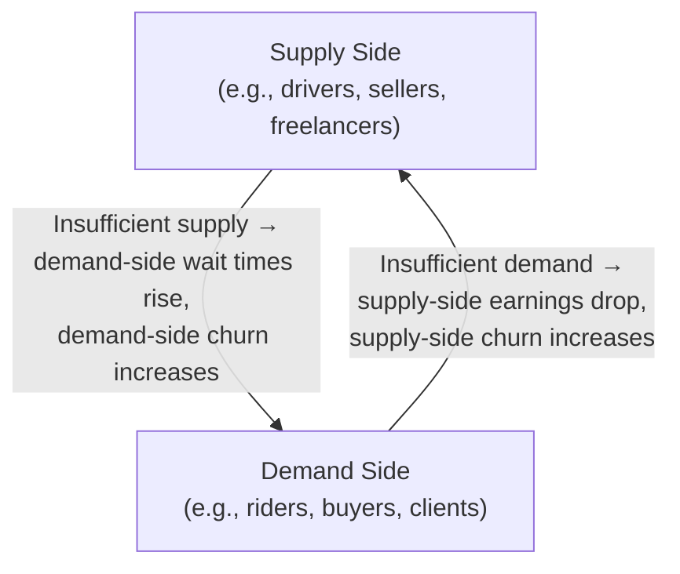

# Lesson 63: Two-Sided Marketplaces and Network Effects

## Why This Lesson Matters

Lesson 61 introduced cross-side network effects as the structural engine behind platforms in general. Lesson 62 grounded Layer 2 of the Leverage Stack in concrete API design discipline. This lesson takes the next logical step: what happens when Layer 3, the Marketplace layer, is not just a directory of add-ons for a core product, but the entire product — when the business exists specifically to connect two distinct populations who need each other, and captures value in the connecting.

Two-sided marketplaces — ride-hailing apps connecting riders and drivers, e-commerce marketplaces connecting buyers and sellers, freelance platforms connecting clients and workers — are a distinct species of product with their own failure modes, their own chicken-and-egg problem, and their own metrics. A PM trained entirely on single-sided products (where you have one user population to satisfy) will instinctively reach for the wrong lever when a marketplace underperforms, because the standard toolkit assumes one population, not two whose incentives must be balanced simultaneously.

This lesson formalizes what makes marketplaces genuinely different, introduces the Two-Sided Balance Model as this lesson's core mental tool, and equips you to reason about the specific, well-documented failure pattern that kills more marketplace startups than any other: the inability to solve liquidity on both sides at once.

---

## Learning Path

| Field | Detail |
|---|---|
| **Module** | 7 — Platform, Technical & Data-Intensive Product Management |
| **Current Lesson** | 63 of 90 |
| **Difficulty** | 6 / 10 |
| **Estimated Study Time** | 40 minutes (reading) + 15 minutes (reflection + quiz) |
| **Prerequisites** | Lesson 61 (cross-side network effects), Lesson 46 (growth loops, K-factor) |
| **Next Lesson** | Lesson 64 — Data-Informed Product Management: Building a Metrics Culture |
| **Future Topics Unlocked** | Lesson 64 (Metrics Culture), Lesson 67 (Platform Governance), Lesson 79 (Pricing Strategy at Scale) — all depend on the liquidity and take-rate concepts introduced here |

---

## Learning Objectives

By the end of this lesson, you will be able to:

1. Define a two-sided marketplace and distinguish it from a single-sided product with an add-on ecosystem.
2. Explain the chicken-and-egg problem and describe at least two strategies for solving it.
3. Apply the Two-Sided Balance Model to diagnose which side of a marketplace is currently the binding constraint.
4. Define marketplace liquidity and explain why it, not raw user count, is the correct primary health metric.
5. Evaluate a marketplace growth proposal for whether it benefits one side at the expense of the other's incentive to participate.

---

## Prerequisites

This lesson assumes the cross-side network effect concept from Lesson 61 (growth in one population increasing value for the other) and the growth loop and K-factor vocabulary from Lesson 46. It extends both into a formal model specifically for products whose entire business is matching two distinct populations, rather than serving one population directly.

---

## Theory

### What Makes a Marketplace "Two-Sided"

A two-sided marketplace is a product whose core value proposition requires successfully connecting two genuinely distinct populations, each of whom would derive no value from the platform without sufficient presence of the other. This is a stronger condition than simply "having two kinds of users." A note-taking app with both free and paid users still has one core value proposition (helping someone take notes); a ride-hailing app has two: helping a rider get somewhere, and helping a driver earn money, each of which is entirely dependent on the other side's presence to be fulfilled at all.

This distinction matters because it changes what "product-market fit" even means. A single-sided product needs to satisfy one population well. A two-sided marketplace needs simultaneous fit with two populations whose interests are related but not identical — and improving the experience for one side can directly worsen it for the other, a dynamic single-sided PMs rarely have to reason about explicitly.

### The Chicken-and-Egg Problem

The foundational challenge of any two-sided marketplace is that neither side wants to join a marketplace where the other side isn't yet present in sufficient numbers. Riders won't open an app with no available drivers nearby; drivers won't sign up for a platform with no riders requesting trips. This is the **chicken-and-egg problem**, and it is the single most common cause of marketplace startup failure — not lack of demand on either side individually, but the inability to bootstrap both sides at once.

Common strategies for solving it include:

- **Single-player mode first**: build something valuable to one side even without the other side present (a scheduling tool useful to a service provider on its own, later opened up to clients).
- **Geographic or niche concentration**: focus liquidity-building efforts on one city, university, or vertical narrow enough that both sides can reach critical mass quickly, then expand.
- **Subsidizing one side**: temporarily paying or incentivizing the harder-to-acquire side (often supply) until enough presence exists to attract the other side organically.
- **Seeding with owned supply or demand**: the platform itself acts as an initial participant on one side (for example, an e-commerce marketplace initially selling its own inventory) to prove the model before opening to third parties.

### The Two-Sided Balance Model

This lesson introduces the **Two-Sided Balance Model**, a way of diagnosing marketplace health by asking, at any given time, which side is the binding constraint.

At any moment, one side is usually the actual constraint on marketplace growth — the side whose insufficient presence is causing the other side to have a worse experience and churn. The Two-Sided Balance Model's discipline is to identify which side that currently is, using leading indicators specific to each side (for supply: fill rate, response time, active-supplier ratio; for demand: search-to-transaction conversion, repeat request rate), rather than applying a generic growth initiative to both sides equally. Growth initiatives aimed at the wrong side waste resources and can even worsen the constraint, by attracting more of the already-abundant side into an experience that is degrading for lack of the scarce side.

### Liquidity as the Core Health Metric

**Marketplace liquidity** is the probability that a participant on one side, showing up with genuine intent, successfully completes a transaction with the other side within an acceptable time or effort threshold. Liquidity, not raw registered-user count on either side, is the correct primary health metric for a marketplace, because a marketplace with millions of registered users on both sides but low liquidity — searches that don't lead to matches, listings that don't sell — is not actually functioning as a marketplace at all, regardless of its vanity metrics. This directly echoes the Output vs. Outcome distinction from Lesson 1: registered users are an output; a completed, satisfying match is the outcome the entire business model depends on.

---

## Common Beginner Mistakes

**Mistake 1: Treating both sides of a marketplace as a single undifferentiated user base**

Supply and demand have different needs, different acquisition channels, and different churn drivers, and lumping them into one "user" metric obscures which side is actually failing.

**Mistake 2: Chasing raw registration numbers on both sides instead of liquidity**

A marketplace can look impressively large by signup count while having almost no successful matches, and registration growth alone does not indicate marketplace health.

**Mistake 3: Applying a growth initiative to both sides simultaneously without first diagnosing the binding constraint**

If supply is the actual bottleneck, a demand-side marketing campaign will only worsen the experience for the demand side you just acquired, since there still isn't enough supply to serve them.

**Mistake 4: Underestimating how much harder acquiring the "hard side" of the market is**

In most marketplaces, one side (often supply, particularly specialized or professional supply) is structurally harder and slower to acquire than the other, and treating acquisition cost as symmetric across both sides leads to under-resourcing the actual bottleneck.

**Mistake 5: Expanding geography before achieving liquidity in the initial market**

Spreading a fixed amount of supply-and-demand-building effort across many thin markets often produces low liquidity everywhere, rather than the strong, defensible liquidity that concentrated effort in one market can achieve.

---

## Mental Model: The Two-Sided Balance Model

The Two-Sided Balance Model introduced above is this lesson's core takeaway tool. Apply it any time marketplace growth stalls or a new initiative is proposed, by asking:

1. **Which side's leading indicators are currently weak** — supply-side fill rate and response time, or demand-side conversion and repeat rate?
2. **Is the proposed initiative targeted at the actually-constrained side, or at the side that is already comparatively abundant?**
3. **Could this initiative worsen the imbalance** by growing the abundant side faster, thereby degrading the experience for the side that's already scarce?

A marketplace PM who runs every growth proposal through this three-question check avoids the single most wasteful and common marketplace mistake: pouring resources into the side of the business that isn't actually the problem.

---

## Real Company Example

Airbnb's early growth strategy is widely discussed as an illustration of solving the chicken-and-egg problem through concentrated, supply-side-first effort. Public accounts of Airbnb's early years describe the founders manually visiting hosts in New York to professionally photograph their listings, addressing a specific supply-side quality bottleneck (poor listing photos reducing booking conversion) before broader demand-side marketing would have been worth the investment, since abundant but low-quality supply would not have converted new demand into satisfied bookings anyway.

This illustrates the Two-Sided Balance Model directly: rather than treating growth as symmetric across both sides, the team identified that supply-side quality, not demand volume, was the binding constraint on liquidity at that stage, and concentrated resources accordingly.

**Assumption flagged:** the specifics of Airbnb's early operational strategy described here are drawn from public accounts, interviews, and industry retrospectives, not confirmed internal company statements, and should be treated as illustrative rather than verified fact.

---

## Real World Perspective: Two-Sided Marketplaces and Network Effects at Different Company Stages

**Startup:** Nearly every early-stage marketplace startup's central existential question is how to solve the chicken-and-egg problem within a small enough geographic or vertical niche to reach liquidity before running out of capital, making the strategies described above (single-player mode, geographic concentration, subsidy, owned supply) not optional refinements but the core of the early strategy itself.

**Mid-size company:** Once liquidity is achieved in an initial market, the central challenge shifts to replicating it in new markets or verticals without diluting the concentrated effort that made the first market succeed — a common and costly mistake being premature geographic expansion that spreads supply-and-demand-building resources too thin to achieve liquidity anywhere new.

**Big Tech:** Mature, large-scale marketplaces typically run sophisticated internal matching and pricing algorithms (dynamic pricing, search ranking tuned for conversion) specifically to manage the supply-demand balance in real time across many micro-markets simultaneously, since at this scale the binding constraint can differ by city, time of day, or category, and a single global growth lever is too blunt an instrument.

---

## Detailed Case Study: The Demand-Side Growth Trap

An online marketplace for freelance specialized technical consultants launched with modest but genuine early traction: a small number of highly-rated consultants (supply) serving a small but consistent stream of client requests (demand), with reasonably high liquidity in that narrow initial niche. Leadership, eager to show aggressive growth to investors, approved a significant paid marketing campaign aimed entirely at acquiring new client demand, reasoning that "more demand is always good for a marketplace."

The campaign succeeded at its stated goal: client sign-ups and project requests roughly tripled within two months. But the supply side — the pool of qualified, available consultants — had not grown at anything close to the same rate, since qualified technical consultants took much longer to recruit, vet, and onboard than clients took to sign up. The result was a sharp increase in unfulfilled or slowly-fulfilled client requests: response times lengthened, a growing share of new clients received no qualified consultant match at all, and first-time client satisfaction and repeat usage both declined sharply, even as top-line signup metrics looked like a clear success.

**What went wrong?** Using the Two-Sided Balance Model, the diagnosis is direct: supply, not demand, was the binding constraint on liquidity at that stage, but leadership applied a growth initiative to the already-comparatively-adequate side. The campaign didn't just fail to help — it actively worsened the marketplace's core liquidity metric, by flooding the constrained side (supply) with more demand than it could serve, degrading first-impression experience for a large cohort of new clients who might otherwise have become loyal repeat users.

The company's recovery involved pausing further demand-side marketing, redirecting resources into supply-side recruitment and onboarding (a slower, less flashy investment), and only resuming demand-side growth once supply-side leading indicators (fill rate, response time) showed the constraint had eased — a sequencing discipline that foreshadows the metrics-culture rigor formalized in Lesson 64.

---

## Framework Explanation: The Liquidity Diagnostic Table

When a marketplace PM needs to quickly diagnose which side is the current binding constraint, the following table of leading indicators is useful:

| Signal | Supply-Side Reading | Demand-Side Reading | Interpretation if Weak |
|---|---|---|---|
| Fill Rate | % of demand requests successfully matched to available supply | — | Weak → supply is the constraint |
| Response Time | Average time for supply to respond to a matched request | — | Slow → supply is the constraint |
| Search-to-Transaction Conversion | — | % of demand-side searches or browses that result in a completed transaction | Weak → could indicate poor supply quality/selection, a demand-side friction issue, or both — investigate further |
| Repeat Request Rate | — | % of demand-side users who return after a first successful transaction | Weak → demand-side experience or trust issue, even if supply is adequate |
| Active-Supplier Ratio | % of registered supply-side participants actively transacting in a given period | — | Weak → supply-side engagement or incentive issue, distinct from raw supply headcount |

The key discipline is reading supply-side and demand-side signals separately, never blending them into one aggregate "marketplace health score" that obscures which side actually needs attention.

---

## Interview Perspective: How Interviewers Think About This

**"How would you grow a marketplace that has plenty of demand but not enough supply?"** The interviewer is evaluating whether you correctly identify supply as the binding constraint and reach for supply-side-specific strategies (recruitment, onboarding, incentives), rather than defaulting to more demand-side marketing simply because "growth" is the stated goal.

**"What's the most important metric for a two-sided marketplace, and why?"** The interviewer is testing whether you name liquidity specifically, and can explain why raw registered-user counts on either side are an output rather than the outcome the business model actually depends on.

**"Tell me about the chicken-and-egg problem and how you'd solve it for a new marketplace idea."** The interviewer is assessing whether you can name at least one concrete bootstrapping strategy (single-player mode, geographic concentration, subsidy, owned supply) rather than treating the problem as unsolvable or assuming it resolves itself with enough marketing spend.

---

## Summary

A two-sided marketplace is a distinct species of product whose entire value proposition depends on successfully connecting two genuinely different populations, each of whom needs sufficient presence of the other to derive any value at all — a structural condition that produces the chicken-and-egg problem and requires deliberate bootstrapping strategies like single-player mode, geographic concentration, temporary subsidy, or owned initial supply. The Two-Sided Balance Model provides the ongoing discipline for diagnosing marketplace health after launch: identifying which side's leading indicators are currently weak, and directing growth initiatives at that side specifically, since growth aimed at the already-abundant side can actively worsen liquidity by degrading the experience for the constrained side. Liquidity — the probability of a successful, timely match — rather than raw registered-user count on either side, is the correct primary health metric, echoing the Output vs. Outcome distinction from Lesson 1 at marketplace scale. The most common and costly marketplace mistake is treating both sides symmetrically, applying a single blanket growth lever to a system whose two populations have genuinely different needs, acquisition costs, and constraints.

---

## Key Takeaways

- A two-sided marketplace requires simultaneous fit with two genuinely distinct populations, not just one population with two user types.
- The chicken-and-egg problem — neither side wants to join without the other already present — is the foundational bootstrapping challenge for any marketplace.
- Strategies to solve it include single-player mode, geographic or niche concentration, subsidizing the harder-to-acquire side, and seeding with owned supply or demand.
- The Two-Sided Balance Model diagnoses which side is the current binding constraint using side-specific leading indicators, rather than a blended metric.
- Liquidity — the probability of a successful, timely match — is the correct primary marketplace health metric, not raw registered-user counts.
- Growth initiatives aimed at the already-abundant side can actively worsen liquidity by degrading experience for the constrained side.
- Premature geographic or category expansion before achieving liquidity in an initial market often produces weak liquidity everywhere rather than strong liquidity somewhere.

---

## Cheat Sheet

*A two-minute review of everything in this lesson.*

- Two-sided marketplace: both populations need each other's presence to get any value at all.
- Chicken-and-egg fixes: single-player mode, geographic concentration, subsidy, owned supply/demand.
- Diagnose, don't guess: use the Two-Sided Balance Model to find the binding constraint before launching a growth initiative.
- Liquidity > registered users. Always.
- Never apply the same growth lever to both sides without first checking which side is actually scarce.

---

## Glossary

| Term | Definition | Related Concepts | Difficulty |
|---|---|---|---|
| Two-Sided Marketplace | A product connecting two distinct populations who each need the other's presence to derive value | Cross-Side Network Effect (Lesson 61) | 1 |
| Chicken-and-Egg Problem | The bootstrapping challenge where neither side joins without the other already present | Single-Player Mode, Liquidity | 2 |
| Two-Sided Balance Model | A diagnostic model identifying which side of a marketplace is the current binding constraint | Liquidity Diagnostic Table | 2 |
| Marketplace Liquidity | The probability that a participant successfully completes a transaction within an acceptable time/effort threshold | Output vs. Outcome (Lesson 1) | 2 |
| Fill Rate | The percentage of demand requests successfully matched to available supply | Liquidity Diagnostic Table | 1 |
| Single-Player Mode | Building standalone value for one side of a marketplace even without the other side present | Chicken-and-Egg Problem | 2 |

---

## Further Reading / Resources

- David Evans and Richard Schmalensee, *Matchmakers: The New Economics of Multisided Platforms*
- Andrew Chen, *The Cold Start Problem*
- Geoffrey Parker, Marshall Van Alstyne, and Sangeet Paul Choudary, *Platform Revolution*

---

## Flashcards

**Card 1**
- Front: What makes a marketplace "two-sided" rather than just having two user types?
- Back: Each population derives no value from the platform without sufficient presence of the other — the two sides are mutually dependent for the core value proposition.
- Difficulty: 2
- Tags: marketplaces, core-concept

**Card 2**
- Front: What is the chicken-and-egg problem?
- Back: Neither side of a marketplace wants to join until the other side is already present in sufficient numbers.
- Difficulty: 2
- Tags: chicken-and-egg

**Card 3**
- Front: Name three strategies for solving the chicken-and-egg problem.
- Back: Single-player mode, geographic/niche concentration, subsidizing the harder-to-acquire side, or seeding with owned supply/demand.
- Difficulty: 2
- Tags: bootstrapping

**Card 4**
- Front: Why is liquidity a better marketplace health metric than registered-user count?
- Back: A marketplace can have huge registered-user counts on both sides with almost no successful matches — liquidity measures whether the core value proposition is actually being delivered.
- Difficulty: 2
- Tags: liquidity, metrics

**Card 5**
- Front: In the Case Study, why did tripling demand-side signups hurt the marketplace?
- Back: Supply hadn't grown proportionally, so the constrained side (supply) was flooded with more demand than it could serve, worsening fill rate and client satisfaction.
- Difficulty: 2
- Tags: case-study, two-sided-balance

**Card 6**
- Front: What three questions does the Two-Sided Balance Model ask before approving a growth initiative?
- Back: Which side's leading indicators are weak? Is the initiative targeted at the constrained side? Could it worsen the imbalance by growing the abundant side further?
- Difficulty: 2
- Tags: two-sided-balance

**Card 7**
- Front: Why should supply-side and demand-side signals never be blended into one aggregate health score?
- Back: Blending obscures which specific side actually needs attention, leading to misdirected growth investment.
- Difficulty: 2
- Tags: liquidity-diagnostic

## Reflection Exercise

You are the PM for an early-stage marketplace connecting home renovation contractors (supply) with homeowners seeking quotes (demand), currently operating in a single mid-size city. Fill rate is healthy at 85%, but average response time from contractors has crept up to three days, and repeat request rate from homeowners has started to decline.

There is no single correct answer to the prompts below — the goal is to practice applying the Two-Sided Balance Model and the Liquidity Diagnostic Table under a mixed and slightly ambiguous signal set.

1. Using the Liquidity Diagnostic Table, which signals here point toward a supply-side issue, and which point toward a demand-side issue?
2. Is it possible for both a supply-side and demand-side issue to be occurring simultaneously? What would that imply for your response?
3. Given the healthy fill rate but declining repeat request rate, what additional data would you want before concluding which side is the true binding constraint?
4. Propose one supply-side and one demand-side initiative you might consider, and explain how you would decide which to prioritize first.
5. Why would expanding to a second city before addressing these signals likely be a mistake, using the frameworks in this lesson?

---

## Quiz

**1. What condition distinguishes a two-sided marketplace from a product with two different user types?**
A) Having more than 1,000 total users
B) Each population derives no value from the platform without sufficient presence of the other
C) Charging both sides a subscription fee
D) Operating in more than one country

*Correct answer: B*
*Explanation: Mutual dependency for the core value proposition is the defining condition of a two-sided marketplace, not merely having distinct user categories.*
*Learning objective tested: #1*
*Difficulty: Easy*

---

**2. What is the chicken-and-egg problem?**
A) A pricing dispute between two sides of a marketplace
B) Neither side wants to join a marketplace until the other side is already present in sufficient numbers
C) A technical issue with database schema design
D) A legal issue unique to food delivery marketplaces

*Correct answer: B*
*Explanation: This is the foundational bootstrapping challenge specific to two-sided marketplaces.*
*Learning objective tested: #2*
*Difficulty: Easy*

---

**3. Which of the following is NOT one of the strategies described for solving the chicken-and-egg problem?**
A) Single-player mode
B) Geographic or niche concentration
C) Subsidizing one side temporarily
D) Launching simultaneously in every major global market

*Correct answer: D*
*Explanation: Broad simultaneous global launch is the opposite of the concentration strategy recommended for solving the chicken-and-egg problem.*
*Learning objective tested: #2*
*Difficulty: Easy*

---

**4. What is marketplace liquidity?**
A) The total amount of cash a marketplace company has raised
B) The probability that a participant showing up with genuine intent successfully completes a transaction within an acceptable time or effort threshold
C) The number of registered users on the larger side of the marketplace
D) The speed at which a marketplace's app loads

*Correct answer: B*
*Explanation: Liquidity is specifically about successful, timely matching, not raw scale or technical performance.*
*Learning objective tested: #4*
*Difficulty: Easy*

---

**5. Why is liquidity a better health metric than registered-user count?**
A) Registered-user count is harder to measure than liquidity
B) A marketplace can have large registered-user counts on both sides while producing very few successful matches
C) Liquidity and registered-user count always move together
D) Registered-user count is not tracked by most marketplaces

*Correct answer: B*
*Explanation: High registration with low liquidity indicates the marketplace isn't actually delivering its core value proposition, despite appearing large.*
*Learning objective tested: #4*
*Difficulty: Easy*

---

**6. In the Two-Sided Balance Model, what should a PM do before launching a growth initiative?**
A) Apply the same initiative to both sides simultaneously for fairness
B) Identify which side's leading indicators are currently weak, and target that side specifically
C) Always prioritize the demand side, since more demand is always beneficial
D) Skip diagnosis and rely on total revenue as the only signal

*Correct answer: B*
*Explanation: The Two-Sided Balance Model requires diagnosing the binding constraint before directing growth resources.*
*Learning objective tested: #3*
*Difficulty: Easy*

---

**7. In the Case Study, what caused client satisfaction to decline despite a successful demand-generation campaign?**
A) The marketing campaign used misleading messaging
B) Supply had not grown proportionally, so the increased demand could not be adequately served, degrading fill rate and response time
C) Clients found the app too difficult to use
D) The company raised prices at the same time as the campaign

*Correct answer: B*
*Explanation: The campaign flooded the constrained supply side with more demand than it could serve, directly harming liquidity and client experience.*
*Learning objective tested: #3, #5*
*Difficulty: Medium*

---

**8. According to the Liquidity Diagnostic Table, what does a weak fill rate most directly indicate?**
A) A demand-side trust issue
B) Supply is likely the binding constraint
C) The marketplace's pricing is too low
D) The marketplace needs a redesigned homepage

*Correct answer: B*
*Explanation: Fill rate specifically measures whether demand requests are being matched to available supply; a weak reading points to a supply-side constraint.*
*Learning objective tested: #3*
*Difficulty: Medium*

---

**9. Why should supply-side and demand-side signals never be blended into a single aggregate marketplace health score?**
A) Blending is technically impossible with most analytics tools
B) It obscures which specific side actually needs attention, leading to misdirected investment
C) Aggregate scores are illegal in most jurisdictions
D) Blended scores always overstate marketplace health

*Correct answer: B*
*Explanation: Separate side-specific signals are necessary to correctly diagnose and address the actual binding constraint.*
*Learning objective tested: #3, #4*
*Difficulty: Medium*

---

**10. According to the Real World Perspective section, what is a common mistake for mid-size marketplace companies?**
A) Focusing too narrowly on a single city for too long
B) Premature geographic or category expansion that dilutes the concentrated effort needed to achieve liquidity in new markets
C) Refusing to ever expand beyond the first market
D) Charging both sides identical fees

*Correct answer: B*
*Explanation: Expanding before achieving strong liquidity risks diluting effort and achieving weak liquidity everywhere instead.*
*Learning objective tested: #3*
*Difficulty: Medium*

---

**11. What does the "active-supplier ratio" signal in the Liquidity Diagnostic Table measure?**
A) The percentage of registered supply-side participants actively transacting in a given period
B) The total number of registered suppliers ever, regardless of activity
C) The average rating given to suppliers by demand-side users
D) The percentage of suppliers who have completed onboarding paperwork

*Correct answer: A*
*Explanation: This metric distinguishes actual engagement from raw supply headcount, which can be misleadingly large even with low real participation.*
*Learning objective tested: #3, #4*
*Difficulty: Medium*

---

**12. (Scenario) A marketplace has excellent demand-side conversion and repeat rates, but supply-side response time has tripled over the past quarter. Which initiative should be prioritized first, per the Two-Sided Balance Model?**
A) A demand-side referral incentive program
B) Supply-side recruitment, onboarding improvements, or incentives targeting response time
C) A price increase on the demand side
D) A redesign of the demand-side search interface

*Correct answer: B*
*Explanation: Supply-side signals are the weak ones here, so the initiative should target supply specifically rather than further investing in the already-strong demand side.*
*Learning objective tested: #3, #5*
*Difficulty: Medium-Hard*

---

**13. (Product Thinking) A marketplace founder argues that acquiring more of both sides simultaneously and equally is always the safest growth strategy. Using this lesson's frameworks, what is the strongest counterargument?**
A) There is no meaningful counterargument; symmetric growth is always correct
B) Symmetric growth ignores the fact that one side is typically the actual binding constraint, and growing the already-abundant side can worsen liquidity for the constrained side
C) Symmetric growth is illegal under most marketplace regulations
D) Only demand-side growth ever matters in a two-sided marketplace

*Correct answer: B*
*Explanation: The Two-Sided Balance Model's core insight is that growth must target the actual constraint, not be applied symmetrically regardless of which side is scarce.*
*Learning objective tested: #3, #5*
*Difficulty: Hard*

---

**14. (Interview Reasoning) A candidate asked "What's the most important metric for a two-sided marketplace?" answers "total registered users," with no further explanation. What does this most likely signal, per the Interview Perspective section?**
A) A sophisticated understanding of marketplace economics
B) A misunderstanding of the Output vs. Outcome distinction as applied to marketplaces — registered users is an output, liquidity is the outcome that matters
C) That the candidate should be hired for a senior marketplace role immediately
D) Nothing meaningful; registered users is in fact the single correct answer

*Correct answer: B*
*Explanation: The Interview Perspective section specifically flags liquidity, not raw registration counts, as the metric a well-prepared candidate should name and justify.*
*Learning objective tested: #4, #5*
*Difficulty: Hard*

---

**15. (Product Thinking, Highest Difficulty) A marketplace shows a healthy 85% fill rate but a declining demand-side repeat request rate, with contractor response times also creeping upward. Using only the frameworks in this lesson, what is the most defensible next step?**
A) Conclude fill rate alone proves the marketplace is healthy and take no further action
B) Immediately launch a large demand-side acquisition campaign, since fill rate is strong
C) Investigate further using both supply-side (response time) and demand-side (repeat rate) signals together, since the mixed signal set suggests a possible early supply-side constraint not yet fully reflected in fill rate
D) Expand to a second city immediately to diversify the risk

*Correct answer: C*
*Explanation: This mirrors the Reflection Exercise: a single healthy top-line metric (fill rate) can mask an emerging constraint visible in other side-specific signals (rising response time, declining repeat rate), and the correct response is further diagnosis, not premature action in either direction.*
*Learning objective tested: #3, #4, #5*
*Difficulty: Hard*

---

## Connections

| | Lesson | Core Idea Carried Forward |
|---|---|---|
| **Previous Lesson** | Lesson 62 — APIs as Products: Designing for Developers | Extends the Leverage Stack's Marketplace layer, now assuming a stable Developer Surface, into full two-sided marketplace design |
| **Current Lesson** | Lesson 63 — Two-Sided Marketplaces and Network Effects | Chicken-and-egg problem; Two-Sided Balance Model; marketplace liquidity; Liquidity Diagnostic Table |
| **Next Lesson** | Lesson 64 — Data-Informed Product Management: Building a Metrics Culture | Builds on liquidity and side-specific signals here into a broader organizational discipline for building and trusting metrics |
| **Future Concepts Unlocked** | Lesson 67 (Platform Governance) | Extends marketplace trust dynamics into full trust-and-safety enforcement across both sides |
| | Lesson 79 (Pricing Strategy at Scale) | Extends take-rate and side-specific incentive concepts into full enterprise and marketplace pricing mechanics |

This curriculum continues to build as one continuous argument. From this lesson forward, any reference to a marketplace decision assumes you can locate the binding constraint using the Two-Sided Balance Model without re-explanation.
