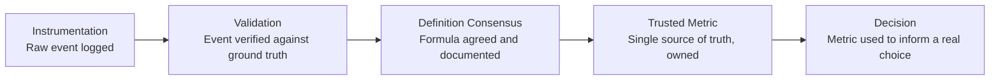

# Lesson 64: Data-Informed Product Management: Building a Metrics Culture

## Why This Lesson Matters

Lesson 63 closed with a marketplace whose leading indicators, read separately by side, revealed a constraint that a single blended metric would have hidden. That was a lesson about which metrics to look at. This lesson is about a harder and more organizational question: how do you make sure the metrics you're looking at, across an entire company, actually mean what everyone assumes they mean?

By this point in the curriculum you have already met Goodhart's Law (Lesson 41), North Star Metrics (Lesson 42), funnel and cohort analysis (Lessons 43–44), and A/B testing rigor (Lesson 45). Those lessons taught you how to reason about metrics as an individual analytical skill. This lesson addresses what happens when that skill has to operate at organizational scale — when dozens of teams are each defining, computing, and reporting metrics somewhat differently, and a single number like "active users" or "conversion rate" can mean three subtly different things depending on which dashboard produced it.

This is not a hypothetical problem. It is one of the most common, expensive, and quietly corrosive failure modes in any data-informed company: not a lack of data, but a lack of trust in the data, born from inconsistent definitions, undocumented assumptions, and metrics that drift out of sync with the events they were originally meant to represent. This lesson introduces the Metric Provenance Chain, this lesson's core mental model, to give you a systematic way to build — and diagnose the absence of — genuine metrics trust across an organization.

---

## Learning Path

| Field | Detail |
|---|---|
| **Module** | 7 — Platform, Technical & Data-Intensive Product Management |
| **Current Lesson** | 64 of 90 |
| **Difficulty** | 6 / 10 |
| **Estimated Study Time** | 40 minutes (reading) + 15 minutes (reflection + quiz) |
| **Prerequisites** | Lesson 41 (metric definitions, Goodhart's Law), Lesson 42 (North Star Metrics), Lesson 45 (A/B testing rigor) |
| **Next Lesson** | Lesson 65 — Working with Data Science & ML Teams |
| **Future Topics Unlocked** | Lesson 65 (Data Science collaboration), Lesson 66 (Recommender Systems), Lesson 84 (PM in AI-Native Companies) — all depend on the Metric Provenance Chain and metric trust discipline introduced here |

---

## Learning Objectives

By the end of this lesson, you will be able to:

1. Explain why organizational metric trust, not raw data volume, is the actual constraint on data-informed decision-making at scale.
2. Apply the Metric Provenance Chain to trace a metric from raw instrumentation to a trusted decision input.
3. Identify at least three common causes of metric definition drift across teams.
4. Evaluate a company's dashboard ecosystem for signs of metric fragmentation.
5. Recommend a governance approach for establishing and maintaining a single source of truth for a key business metric.

---

## Prerequisites

This lesson assumes the metric-definition discipline and Goodhart's Law from Lesson 41, the North Star Metric concept from Lesson 42, and the experimentation rigor from Lesson 45. It extends all three from the level of an individual analysis or experiment to the level of an organization-wide metrics culture, where many teams must share and trust the same underlying numbers.

---

## Theory

### Why Metric Trust, Not Data Volume, Is the Real Constraint

Most companies past a certain size do not suffer from a lack of data. They suffer from too many, slightly different versions of what should be the same number. A classic and near-universal symptom: two people in the same meeting cite "our conversion rate" and arrive at different figures, because one person's dashboard computes conversion over sessions and the other's computes it over unique users, and neither dashboard documents which. Multiply this ambiguity across dozens of metrics and teams, and the organization ends up making decisions on numbers that no one fully trusts, verifies, or agrees on — which quietly reintroduces the exact solution-first, evidence-free decision-making this curriculum has argued against since Lesson 1.

### The Metric Provenance Chain

This lesson introduces the **Metric Provenance Chain**, a five-stage model tracing any metric from its rawest form to its use in an actual decision:

A metric earns the right to influence a real decision (Stage 5) only after passing through the first four stages. **Instrumentation** is the raw technical act of logging an event (a button click, a completed purchase). **Validation** confirms that what's logged actually corresponds to the real-world event it claims to represent — a shockingly common failure is an event that fires on page load rather than genuine user action, silently inflating a metric from day one. **Definition Consensus** means the formula for turning raw events into a named metric (what counts as an "active user"? over what window? which platforms included?) has been explicitly agreed upon and documented, not left to each team's private assumption. **Trusted Metric** status means there is one authoritative, owned source for that number, rather than multiple dashboards independently computing "the same" metric with silently divergent logic. Only once all four stages are solid does a number deserve to actually inform a **Decision** — and any metric skipping a stage should be treated with proportional skepticism, regardless of how confidently it's presented in a meeting.

### Metric Definition Drift

Even a well-defined metric decays over time through **metric definition drift** — the gradual divergence between a metric's original intended meaning and what it has come to actually measure. Common causes include: a new feature launch changing what "engagement" practically consists of without the metric's definition being revisited; a team quietly adjusting a query for local convenience without updating shared documentation; or a metric surviving a platform migration with subtly different underlying event logic, producing a discontinuity that looks like a real trend change but is actually a measurement artifact. Drift is dangerous precisely because it is silent — the metric keeps producing numbers, and nothing about the dashboard itself signals that its meaning has quietly shifted underneath the label.

### Dashboard Fragmentation as a Symptom

A useful diagnostic for organizational metric health: count how many different dashboards, in a company, claim to show the same named metric (for example, "monthly active users"), and check whether they agree. Widespread disagreement across supposedly identical metrics is not a minor cosmetic issue — it is direct evidence that the organization's Metric Provenance Chain is broken somewhere between Definition Consensus and Trusted Metric status, and that decisions across different teams may currently be resting on incompatible numbers without anyone realizing it.

---

## Common Beginner Mistakes

1. **Assuming more dashboards signal a healthier data culture.** Proliferating dashboards without enforcing a single source of truth for key metrics usually signals fragmentation, not sophistication.
2. **Treating a metric's name as sufficient documentation of its meaning.** A dashboard labeled "Retention" without a documented formula (what window? what counts as "retained"? which user segments?) invites every viewer to silently assume their own definition.
3. **Never revisiting a metric's definition after a major product or platform change.** Metrics can drift silently out of sync with what they were originally built to represent, especially after feature launches or instrumentation migrations.
4. **Trusting a metric because it comes from a senior stakeholder's dashboard, rather than because it has passed through Validation and Definition Consensus.** Organizational seniority is not a substitute for provenance; an executive's personally-maintained spreadsheet can be just as ungoverned as anyone else's.
5. **Building elaborate analysis on top of an unvalidated event.** If Stage 2 (Validation) was skipped — if no one confirmed the underlying event actually represents the real-world action it claims to — everything built on top of it, however sophisticated, inherits that foundational error.

---

## Mental Model: The Metric Provenance Chain

The Metric Provenance Chain introduced above is this lesson's core takeaway tool. Any time a metric is about to inform a real decision, ask:

1. **Has this metric's underlying event been validated** against the real-world action it's supposed to represent?
2. **Is there documented Definition Consensus** — an agreed, written formula — or is everyone relying on an informal shared assumption that may not actually be shared?
3. **Is there a single, owned, Trusted Metric source**, or are multiple dashboards independently computing a version of "the same" number?

A metric that fails any of these three checks should be treated as provisional, regardless of how confidently it is presented, and should not yet be allowed to anchor a significant decision.

---

## Real Company Example

Netflix is widely discussed in the industry as an organization with an unusually rigorous experimentation and metrics culture, closely tied to the A/B testing discipline introduced in Lesson 45. Public accounts and industry commentary describe Netflix maintaining strict internal standards for how experiment results are validated and interpreted before being trusted to inform product decisions, including explicit statistical rigor requirements that echo the Peeking Trap concept from Lesson 45 — a direct illustration that Trusted Metric status (Stage 4 of the Provenance Chain) is treated as something that must be earned through process, not assumed by default.

**Assumption flagged:** the specifics of Netflix's internal experimentation governance and metric-validation processes described here are drawn from public commentary, engineering blog posts, and industry reporting, not confirmed internal company statements, and should be treated as illustrative rather than verified fact.

---

## Real World Perspective

**Startup:** Early-stage companies typically have very few metrics and very few people looking at them, which makes informal, undocumented definitions tolerable in the short term simply because the same one or two people who instrumented the event are also the only ones interpreting it — a luxury that disappears the moment the team, and the number of dashboards, starts to grow.

**Mid-size company:** This is typically where metric definition drift and dashboard fragmentation first become genuinely costly, as more teams independently build their own reporting on shared underlying data without a central governance process, and the resulting inconsistencies start surfacing painfully in cross-functional meetings where numbers visibly disagree.

**Big Tech:** Mature organizations typically invest in dedicated data-governance or metrics-platform teams whose explicit job is maintaining Trusted Metric status for key company-wide numbers — owning definitions, validating instrumentation, and serving as the single source of truth other teams are expected to build on rather than recompute independently.

---

## Detailed Case Study: The Conflicting Retention Numbers

A subscription software company held a quarterly business review where the VP of Product presented a retention chart showing a concerning three-point decline, while the Head of Data, using a different internal dashboard, presented a chart for the same period and the same nominal metric — "90-day retention" — showing a slight improvement. Both charts were labeled identically. The discrepancy was not caught until well into the meeting, when a data analyst in the room noticed the two charts didn't share the same shape at all, despite claiming to measure the same thing.

Investigation afterward revealed the root cause: the two dashboards had been built by different teams eighteen months apart, computing "90-day retention" with different underlying definitions — one measured retention from account creation date, the other from first meaningful product action (a distinction that had been a deliberate, documented choice when the second dashboard was built, but that documentation had never been linked to or referenced by the original dashboard's owners, who were unaware a second definition existed at all). Neither dashboard was technically wrong. Neither had been formally designated the company's single source of truth. The organization had, in effect, allowed two independently valid Metric Provenance Chains to develop in parallel, without ever reaching company-wide Definition Consensus.

**What went wrong?** Using the Metric Provenance Chain, the failure sits precisely between Stage 3 (Definition Consensus) and Stage 4 (Trusted Metric): two teams had each internally passed through validation and definition for their own version of the metric, but no company-wide consensus process had ever forced a single, authoritative definition to emerge, and no single dashboard had been designated the trusted source others should defer to. The result was months of decisions across different teams potentially resting on two incompatible numbers, discovered only by chance in a high-visibility meeting.

The company's recovery involved a formal metrics governance initiative: designating a single owned definition and dashboard for retention going forward, deprecating the second dashboard with a documented migration note, and instituting a lightweight review process for any new company-wide metric — a governance discipline this curriculum will connect directly to data science collaboration norms in Lesson 65.

---

## Framework Explanation: The Metric Health Checklist

Before treating any metric as trustworthy enough to anchor a real decision, a PM can run it through the following checklist:

| Health Criterion | Question to Ask | Red Flag If... |
|---|---|---|
| Documented Definition | Is the exact formula written down somewhere accessible? | The definition exists only in one person's memory |
| Instrumentation Validated | Has the underlying event been checked against real-world ground truth? | No one can explain exactly what technical action triggers the event |
| Single Source of Truth | Is there one designated authoritative dashboard for this metric? | Multiple dashboards claim to show the same metric and disagree |
| Ownership Assigned | Is there a named person or team accountable for this metric's accuracy? | No one would know who to ask if the number looked wrong |
| Drift Monitoring | Is there a process for re-validating the metric after major product or instrumentation changes? | The metric has never been re-checked since a major platform migration |

A "no" on Single Source of Truth in particular should be treated as an active organizational risk, not a minor inconvenience — it means the company may currently be making different decisions on the same nominal number without realizing it.

---

## Interview Perspective

**"Tell me about a time data from two sources disagreed, and how you resolved it."** The interviewer is evaluating whether you can diagnose the disagreement using something like the Metric Provenance Chain — tracing back to a missing Definition Consensus or Single Source of Truth — rather than simply picking whichever number was more convenient.

**"How would you build trust in a company's metrics if teams currently don't agree on basic numbers?**" The interviewer is testing whether you propose a governance process (documented definitions, designated ownership, a single source of truth) rather than a purely technical fix, since the root problem is usually organizational, not computational.

**"What's the danger of adding more dashboards to a company with existing data trust issues?"** The interviewer is listening for recognition that more dashboards, without governance, typically worsens fragmentation rather than improving visibility — a direct application of the dashboard fragmentation diagnostic from this lesson.

---

## Summary

Organizational metric trust, not the sheer volume of available data, is the true constraint on data-informed decision-making at scale, because a company with abundant but inconsistently-defined metrics is functionally no better off than one with no data at all, and often worse off, since decisions get made confidently on numbers that quietly disagree. The Metric Provenance Chain — Instrumentation, Validation, Definition Consensus, Trusted Metric, and Decision — traces the path any metric must earn before it should be allowed to inform a real choice, and skipping any stage introduces risk that compounds in everything built on top of it. Metric definition drift, dashboard fragmentation, and the quiet proliferation of independently-valid but incompatible metric definitions are the most common organizational symptoms of a broken Provenance Chain, and they are dangerous precisely because they are silent — the numbers keep flowing, looking authoritative, even after their underlying meaning has shifted or diverged from a nominally identical metric elsewhere in the company. Building a genuine metrics culture requires deliberate governance: documented definitions, validated instrumentation, designated single sources of truth, and assigned ownership, not simply more dashboards or more raw data.

---

## Key Takeaways

- Organizational metric trust, not data volume, is the actual constraint on data-informed decision-making at scale.
- The Metric Provenance Chain traces a metric through Instrumentation, Validation, Definition Consensus, Trusted Metric, and Decision — skipping any stage introduces compounding risk.
- Metric definition drift is the silent divergence between a metric's original meaning and what it currently measures, often triggered by feature launches or instrumentation migrations.
- Dashboard fragmentation — multiple dashboards claiming to show the same metric and disagreeing — is direct evidence of a broken Provenance Chain, not a minor cosmetic issue.
- A metric's name is not documentation; an undocumented formula invites every viewer to silently assume their own definition.
- Organizational seniority is not a substitute for provenance; any metric, regardless of its source, must earn Trusted Metric status through process.
- Building metrics culture requires deliberate governance — documented definitions, validated instrumentation, single sources of truth, and assigned ownership — not simply more dashboards.

---

## Cheat Sheet

- Data volume isn't the constraint. Metric trust is.
- Provenance Chain: Instrumentation → Validation → Definition Consensus → Trusted Metric → Decision.
- A metric's name ≠ its definition. Always find the documented formula.
- More dashboards without governance = more fragmentation, not more insight.
- If two dashboards disagree on "the same" metric, treat it as an active risk, not a rounding error.

---

## Glossary

| Term | Definition | Related Concepts | Difficulty |
|---|---|---|---|
| Metric Provenance Chain | Five-stage model tracing a metric from raw event to trusted decision input | Goodhart's Law (Lesson 41) | 2 |
| Metric Definition Drift | The gradual divergence between a metric's original meaning and what it currently measures | Instrumentation Validation | 2 |
| Dashboard Fragmentation | Multiple dashboards independently computing and disagreeing on a nominally identical metric | Single Source of Truth | 2 |
| Definition Consensus | The stage at which a metric's formula is explicitly agreed upon and documented across teams | Metric Provenance Chain | 2 |
| Trusted Metric | A metric with a single, owned, authoritative source that other teams defer to | Metric Health Checklist | 2 |
| Metric Health Checklist | A five-criterion framework for assessing whether a metric is trustworthy enough to inform a decision | Metric Provenance Chain | 2 |

---

## Further Reading / Resources

1. *Trustworthy Online Controlled Experiments* by Ron Kohavi, Diane Tang, and Ya Xu
2. *Measure What Matters* by John Doerr
3. *Data Science for Business* by Foster Provost and Tom Fawcett

---

## Flashcards

**Front:** What is the actual constraint on data-informed decision-making at scale, according to this lesson?
**Back:** Organizational metric trust, not the volume of available data.
**Difficulty:** Easy
**Tags:** #metrics-culture #core-concept

**Front:** Name the five stages of the Metric Provenance Chain in order.
**Back:** Instrumentation, Validation, Definition Consensus, Trusted Metric, Decision.
**Difficulty:** Easy
**Tags:** #provenance-chain

**Front:** What is metric definition drift?
**Back:** The gradual, often silent divergence between a metric's original intended meaning and what it currently actually measures.
**Difficulty:** Medium
**Tags:** #drift

**Front:** What does dashboard fragmentation indicate about an organization?
**Back:** That its Metric Provenance Chain is broken somewhere between Definition Consensus and Trusted Metric status.
**Difficulty:** Medium
**Tags:** #fragmentation

**Front:** In the Case Study, why didn't either retention dashboard get flagged as "wrong"?
**Back:** Both were internally valid and consistently computed — the failure was the absence of company-wide Definition Consensus and a designated single source of truth, not a calculation error in either dashboard.
**Difficulty:** Hard
**Tags:** #case-study #provenance-chain

**Front:** Why is an executive's personal dashboard not automatically a Trusted Metric?
**Back:** Organizational seniority is not a substitute for provenance — any metric must pass through Validation and Definition Consensus regardless of its source.
**Difficulty:** Medium
**Tags:** #metric-health

**Front:** What should a PM do if a metric fails the Single Source of Truth check?
**Back:** Treat it as an active organizational risk — decisions may currently be resting on incompatible versions of the same nominal number.
**Difficulty:** Hard
**Tags:** #metric-health-checklist

---

## Reflection Exercise

You are the PM for a growing B2B software company. You've just discovered that three separate teams — Product, Marketing, and Customer Success — each maintain their own dashboard for "customer engagement," and the three dashboards, checked side by side for the same month, show meaningfully different trends.

There is no single correct answer to the prompts below — the goal is to practice applying the Metric Provenance Chain and the Metric Health Checklist to a real governance problem.

1. Using the Metric Provenance Chain, at which stage do you suspect this discrepancy most likely originated, and why?
2. What questions would you ask each of the three teams to trace their version of "engagement" back through the Provenance Chain?
3. Propose a lightweight governance process for reaching Definition Consensus across the three teams without stalling all three teams' ongoing work indefinitely.
4. Once a single definition is agreed upon, how would you decide which of the three existing dashboards (if any) should become the designated Trusted Metric source?
5. How would you communicate this change to the three teams in a way that builds buy-in rather than resentment at having their existing dashboard "overruled"?

---

## Quiz

**1. According to this lesson, what is the actual constraint on data-informed decision-making at scale?**
A) The total volume of data collected
B) Organizational metric trust
C) The number of dashboards a company maintains
D) The speed of the company's data infrastructure

*Correct answer: B*
*Explanation: The lesson argues that abundant, inconsistently-defined data is often worse than no data at all, since it invites confident decisions on numbers that quietly disagree.*
*Learning objective tested: #1*
*Difficulty: Easy*

---

**2. What is the correct order of the Metric Provenance Chain?**
A) Decision, Trusted Metric, Definition Consensus, Validation, Instrumentation
B) Instrumentation, Validation, Definition Consensus, Trusted Metric, Decision
C) Validation, Instrumentation, Trusted Metric, Decision, Definition Consensus
D) Definition Consensus, Instrumentation, Decision, Validation, Trusted Metric

*Correct answer: B*
*Explanation: This is the five-stage order introduced in the Theory section, from raw event to decision-ready trusted metric.*
*Learning objective tested: #2*
*Difficulty: Easy*

---

**3. What does "Validation" specifically check in the Metric Provenance Chain?**
A) Whether the metric formula has been documented
B) Whether the underlying logged event actually corresponds to the real-world action it claims to represent
C) Whether a dashboard has a visually appealing design
D) Whether the metric has been shared with executives

*Correct answer: B*
*Explanation: Validation confirms the technical event genuinely reflects the intended real-world action, distinct from documenting its formula (Definition Consensus).*
*Learning objective tested: #2*
*Difficulty: Easy*

---

**4. What is metric definition drift?**
A) A deliberate, well-documented change to a metric's formula
B) The silent divergence between a metric's original intended meaning and what it currently measures
C) A type of statistical significance test
D) A feature of dashboard software that automatically corrects errors

*Correct answer: B*
*Explanation: Drift is specifically the silent, often undocumented divergence in meaning over time, distinguishing it from a deliberate, documented redefinition.*
*Learning objective tested: #3*
*Difficulty: Easy*

---

**5. Which of the following is a common cause of metric definition drift?**
A) A feature launch changing what "engagement" practically consists of, without the metric being revisited
B) Adding a single new column to a spreadsheet
C) Renaming a dashboard without changing any underlying logic
D) Increasing the font size on a chart

*Correct answer: A*
*Explanation: Product or platform changes that shift the real-world meaning of an event, without a corresponding metric review, are a primary driver of drift.*
*Learning objective tested: #3*
*Difficulty: Easy*

---

**6. What does widespread disagreement across dashboards claiming to show the same metric indicate?**
A) Nothing significant; some variation is expected and harmless
B) That the organization's Metric Provenance Chain is likely broken somewhere between Definition Consensus and Trusted Metric status
C) That the company has too much data
D) That the metric in question is not important enough to govern

*Correct answer: B*
*Explanation: Dashboard fragmentation is a direct diagnostic signal of broken metric governance, not a benign or expected variation.*
*Learning objective tested: #4*
*Difficulty: Easy*

---

**7. In the Case Study, what was the actual root cause of the conflicting retention numbers?**
A) One team made a calculation error
B) Two teams had each internally validated their own retention definition, but no company-wide Definition Consensus or Trusted Metric designation existed
C) The data infrastructure had a bug that randomly altered numbers
D) The VP of Product deliberately misrepresented the data

*Correct answer: B*
*Explanation: Both dashboards were internally valid; the failure was organizational — no consensus process ever reconciled the two independently developed definitions.*
*Learning objective tested: #2, #4*
*Difficulty: Medium*

---

**8. According to the Metric Health Checklist, what does a "no" on Single Source of Truth indicate?**
A) A minor cosmetic issue that can be addressed whenever convenient
B) An active organizational risk, since decisions may currently rest on incompatible versions of the same nominal number
C) That the metric should be deleted entirely
D) That the metric is too complex to ever be trusted

*Correct answer: B*
*Explanation: The lesson explicitly frames a missing single source of truth as an active risk requiring attention, not a low-priority issue.*
*Learning objective tested: #4, #5*
*Difficulty: Medium*

---

**9. Why is an executive's personally-maintained dashboard not automatically a Trusted Metric?**
A) Executives are not permitted to view dashboards under most data governance policies
B) Organizational seniority is not a substitute for provenance; any metric must pass through Validation and Definition Consensus regardless of source
C) Executive dashboards are always technically inferior to team dashboards
D) Trusted Metric status is assigned solely based on job title

*Correct answer: B*
*Explanation: The lesson explicitly warns against conflating a stakeholder's seniority with a metric's actual governance status.*
*Learning objective tested: #4, #5*
*Difficulty: Medium*

---

**10. According to the Real World Perspective section, why do startups often tolerate informal, undocumented metric definitions?**
A) Startups are legally exempt from data governance requirements
B) The same one or two people who instrumented the event are typically also the ones interpreting it, making informal definitions tolerable at small scale
C) Startups never look at metrics at all
D) Informal definitions are always more accurate than documented ones

*Correct answer: B*
*Explanation: Small team size and shared context make informal definitions workable early on, a luxury that disappears as teams and dashboards proliferate.*
*Learning objective tested: #1*
*Difficulty: Medium*

---

**11. What kind of team do mature, Big Tech-scale organizations typically build to address metric governance?**
A) A team solely focused on dashboard visual design
B) A dedicated data-governance or metrics-platform team responsible for maintaining Trusted Metric status for key company-wide numbers
C) A team whose only function is deleting old dashboards
D) No specialized team is typically needed at this scale

*Correct answer: B*
*Explanation: The Real World Perspective section describes dedicated governance teams as the typical Big Tech response to this challenge.*
*Learning objective tested: #1, #5*
*Difficulty: Medium*

---

**12. (Scenario) A PM notices that a key metric has never been re-validated since a major platform migration six months ago. Which stage of the Metric Provenance Chain is most directly at risk?**
A) Decision
B) Validation
C) Instrumentation naming conventions only
D) None — migrations never affect metric validity

*Correct answer: B*
*Explanation: A platform migration can silently alter underlying event logic, meaning the metric's Validation status should be re-confirmed rather than assumed to still hold.*
*Learning objective tested: #2, #3*
*Difficulty: Medium-Hard*

---

**13. (Product Thinking) A company has abundant, frequently-updated dashboards, but three different teams cannot agree on a single number for "active users." Using this lesson's frameworks, what is the most likely underlying issue?**
A) The company simply doesn't have enough data
B) A missing Definition Consensus and Single Source of Truth, despite the abundance of dashboards
C) The dashboards are updated too frequently
D) Active users is an inherently unmeasurable concept

*Correct answer: B*
*Explanation: Abundant dashboards do not substitute for governance; the described symptom is a classic sign of missing consensus and ownership, not a data volume problem.*
*Learning objective tested: #4, #5*
*Difficulty: Hard*

---

**14. (Interview Reasoning) A candidate asked how they'd resolve two disagreeing data sources responds by simply choosing whichever number is more favorable to the current initiative. What does this signal, per the Interview Perspective section?**
A) Strong business judgment
B) A failure to diagnose the actual governance root cause, instead defaulting to convenience over rigor — the opposite of what the interviewer is listening for
C) That the candidate is ready for a senior data leadership role
D) Nothing meaningful; either number is equally valid to cite

*Correct answer: B*
*Explanation: The Interview Perspective section specifically flags diagnosing the root governance cause, not convenient number-picking, as the desired response.*
*Learning objective tested: #2, #5*
*Difficulty: Hard*

---

**15. (Product Thinking, Highest Difficulty) A PM discovers that Product, Marketing, and Customer Success each maintain separate "engagement" dashboards that disagree, and all three teams are attached to their own version. Using only the frameworks in this lesson, what is the best course of action?**
A) Ignore the discrepancy since all three teams are performing well individually
B) Immediately delete two of the three dashboards without consulting the teams involved
C) Run each team's definition through the Metric Provenance Chain, facilitate a Definition Consensus process across all three, and designate a single Trusted Metric source with clear ownership going forward
D) Allow each team to keep using their own definition indefinitely, since consensus is too politically difficult to achieve

*Correct answer: C*
*Explanation: This mirrors the Reflection Exercise and the Case Study: the correct response neither ignores the fragmentation nor resolves it unilaterally without input, but methodically traces each definition, builds consensus, and establishes clear ongoing ownership.*
*Learning objective tested: #2, #4, #5*
*Difficulty: Hard*

---

## Connections

| | Lesson | Core Idea Carried Forward |
|---|---|---|
| **Previous Lesson** | Lesson 63 — Two-Sided Marketplaces and Network Effects | Extends the discipline of separating and trusting side-specific signals into a company-wide metrics governance model |
| **Current Lesson** | Lesson 64 — Data-Informed Product Management: Building a Metrics Culture | Metric Provenance Chain; metric definition drift; dashboard fragmentation; Metric Health Checklist |
| **Next Lesson** | Lesson 65 — Working with Data Science & ML Teams | Builds on Trusted Metric status here as the foundation data science teams need before building models on top of company metrics |
| **Future Concepts Unlocked** | Lesson 66 (Recommender Systems) | Assumes the reader can already evaluate whether input metrics feeding a recommender system are trustworthy |
| | Lesson 84 (PM in AI-Native Companies) | Extends metric provenance discipline into the added complexity of AI model outputs as a new category of "metric" requiring validation |

This curriculum continues to build as one continuous argument. From this lesson forward, any reference to a metric assumes you can trace its provenance without re-explanation.
