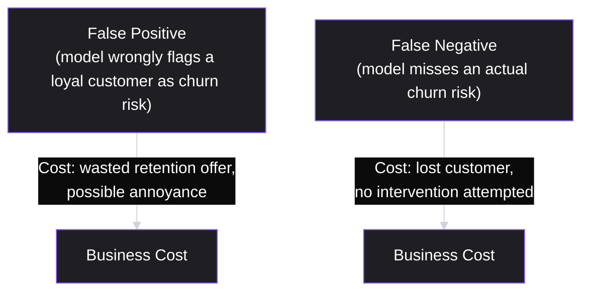

# Lesson 65: Working with Data Science & ML Teams

## Why This Lesson Matters

Lesson 64 established that metric trust, not data volume, is the actual constraint on data-informed decision-making — and introduced the Metric Provenance Chain as a way to verify that a number deserves to inform a decision. This lesson extends that discipline into a specific and increasingly common working relationship: the one between a PM and a data science or machine learning team building a model whose output will itself become an input to product decisions.

This relationship fails in a very particular and recurring way. A PM, trained to think in terms of user problems and business outcomes, hands a data scientist a goal like "predict which customers will churn" and treats the resulting model as a black box that will simply be correct. A data scientist, trained to optimize a technical objective, builds a model that scores well against a chosen metric — precision, recall, AUC — without necessarily understanding, or being told, what the *cost* of a wrong prediction actually is in the product experience the PM is responsible for. Both sides can do excellent, technically sound work, and the collaboration can still fail, because no one made explicit who owns which part of the decision chain from raw prediction to shipped product behavior.

This lesson introduces the Ownership Zones Model, a way of dividing the PM/data-science relationship into distinct zones of responsibility, so that the most common and expensive failure in this collaboration — a model that is technically excellent but wrong for the product's actual needs — becomes visible and preventable before it ships.

---

## Learning Path

| Field | Detail |
|---|---|
| **Module** | 7 — Platform, Technical & Data-Intensive Product Management |
| **Current Lesson** | 65 of 90 |
| **Difficulty** | 6 / 10 |
| **Estimated Study Time** | 40 minutes (reading) + 15 minutes (reflection + quiz) |
| **Prerequisites** | Lesson 64 (Metric Provenance Chain, Trusted Metric), Lesson 45 (A/B testing rigor) |
| **Next Lesson** | Lesson 66 — Recommender Systems and Personalization for PMs |
| **Future Topics Unlocked** | Lesson 66 (Recommender Systems), Lesson 84 (PM in AI-Native Companies), Lesson 85 (Responsible AI Product Management) — all depend on the Ownership Zones Model and error-cost framing introduced here |

---

## Learning Objectives

By the end of this lesson, you will be able to:

1. Explain why a technically excellent model can still be the wrong model for a product's actual needs.
2. Apply the Ownership Zones Model to clarify which decisions belong to the PM, which belong to data science, and which are shared.
3. Distinguish precision-oriented and recall-oriented error costs and explain why they are a product decision, not a purely technical one.
4. Identify what a PM must supply to a data science team before model development begins.
5. Evaluate a proposed model deployment for whether its ownership zones and error costs were made explicit before shipping.

---

## Prerequisites

This lesson assumes the Metric Provenance Chain and Trusted Metric concepts from Lesson 64, since a model's output is itself a metric that must earn trust before informing decisions, and the A/B testing rigor from Lesson 45, since most model deployments are validated using the same experimental discipline.

---

## Theory

### Why a Technically Excellent Model Can Still Be Wrong

A model can score well against the metric it was optimized for and still fail the product it's meant to serve, because the technical metric a data scientist optimizes (accuracy, precision, recall, AUC) is a proxy for a business outcome the PM actually cares about, and proxies can diverge from the real target in ways invisible to the model-building process itself. A churn-prediction model with 90% accuracy sounds impressive until you learn that only 5% of customers actually churn in a given period, meaning a model that simply predicts "no one churns" would already be 95% accurate — a direct echo of Goodhart's Law from Lesson 41, now applied to a model's own training objective rather than a company's dashboard metric.

### The Ownership Zones Model

This lesson introduces the **Ownership Zones Model**, dividing the path from a business problem to a shipped model-driven product decision into four zones:

```mermaid
%%{init: {
  "theme": "dark",
  "themeVariables": {
    "background": "#0b0b0c",
    "primaryColor": "#1f1f23",
    "primaryTextColor": "#ffffff",
    "primaryBorderColor": "#8b5cf6",
    "lineColor": "#d1d5db",
    "secondaryColor": "#18181b",
    "tertiaryColor": "#111111",
    "mainBkg": "#1f1f23",
    "nodeBorder": "#8b5cf6",
    "clusterBkg": "#000000",
    "clusterBorder": "#27272a",
    "titleColor": "#ffffff",
    "edgeLabelBackground": "#0b0b0c",
    "nodeTextColor": "#ffffff",
    "edgeLabelColor": "#ffffff",
    "actorBorder": "#8b5cf6",
    "actorBkg": "#1f1f23",
    "actorTextColor": "#ffffff",
    "sequenceNumberColor": "#ffffff",
    "signalColor": "#8b5cf6",
    "signalTextColor": "#ffffff",
    "textColor": "#ffffff",
    "classText": "#ffffff",
    "classBorder": "#8b5cf6",
    "classBkg": "#1f1f23"
  }
}}%%
graph LR
    A["Zone 1: Problem Framing<br/>(PM owns)"] --> B["Zone 2: Model Development<br/>(Data Science owns)"]
    B --> C["Zone 3: Output Interpretation<br/>(Shared)"]
    C --> D["Zone 4: Product Decision & Deployment<br/>(PM owns)"]
```

**Zone 1, Problem Framing**, is owned by the PM: defining what business outcome the model should serve, what a correct versus incorrect prediction actually costs in the product experience, and what threshold of performance would make the model worth deploying at all. **Zone 2, Model Development**, is owned by data science: choosing the modeling approach, features, and technical optimization target, informed by the framing PM supplied in Zone 1. **Zone 3, Output Interpretation**, is genuinely shared: understanding what the model's output actually means in practice (a "churn probability of 0.7" is not the same as "this customer will churn," and translating between the two requires both statistical literacy and product judgment). **Zone 4, Product Decision and Deployment**, returns to the PM: deciding what the product actually does with a given model output — does a high churn-risk score trigger an automated retention email, a customer-success outreach, a discount offer, or nothing at all — a decision that depends on business context data science does not own.

The most common and costly failure in PM/data-science collaboration is a breakdown at the Zone 1/Zone 2 boundary: a PM who hands over a vague goal without specifying error costs, and a data scientist who, in the absence of that specification, optimizes for a generic technical metric that may not reflect what the product actually needs.

### Precision, Recall, and Error Cost as a Product Decision

**Precision** measures, of everything the model flagged as positive (for example, "will churn"), what fraction actually was positive. **Recall** measures, of everything that actually was positive, what fraction the model successfully flagged. These two properties trade off against each other, and which one to prioritize is fundamentally a **product decision about the relative cost of two different kinds of errors**, not a purely technical one.

If the cost of a false positive is low (a slightly unnecessary retention email) and the cost of a false negative is high (losing a valuable customer with no intervention attempted), the PM should direct data science toward a recall-oriented model, accepting more false positives to catch more true churners. If the reverse is true — false positives are expensive (an aggressive, unwanted discount offer that trains customers to expect discounts) and false negatives are comparatively cheap — a precision-oriented model is the better fit. Data science cannot make this trade-off correctly without the PM supplying the business cost information that only the PM, as the owner of Zone 1, actually has.

### What a PM Must Supply Before Model Development Begins

Before Zone 2 (Model Development) can proceed responsibly, the PM should supply, at minimum: the specific business decision the model's output will inform, the relative cost of false positives versus false negatives in that decision context, any known segments where errors would be especially costly or especially tolerable, and the minimum performance threshold below which the model should not be deployed at all, regardless of how it compares to alternatives. Absent this input, data science teams are left to infer these judgments themselves, and reasonable technical assumptions can diverge sharply from actual business reality.

---

## Common Beginner Mistakes

**Mistake 1: Handing data science a vague goal without specifying error costs**

"Build a model to predict churn" leaves the precision/recall trade-off, which is a product decision, to be made implicitly and invisibly by whoever builds the model.

**Mistake 2: Treating a model's technical metric as automatically equivalent to product success**

A model with high accuracy or AUC can still be the wrong choice if that metric doesn't reflect the actual cost structure of the product decision it feeds.

**Mistake 3: Assuming a model's output is a fact rather than a probabilistic estimate**

Treating a "churn probability of 0.7" as equivalent to "this customer will churn" collapses Zone 3's necessary interpretation step and leads to overconfident product decisions.

**Mistake 4: Deploying a model without a defined Zone 4 action plan**

Building a model before deciding what the product will actually do with its output wastes data science effort and often results in a model that sits unused because no clear decision was ever attached to it.

**Mistake 5: Never revisiting the ownership zones after deployment**

Business context, error costs, and the product decisions attached to a model's output can all shift over time, and failing to periodically revisit Zone 1 framing can leave a once-appropriate model quietly misaligned with current business needs.

---

## Mental Model: The Ownership Zones Model

The Ownership Zones Model introduced above is this lesson's core takeaway tool. Before any model-driven feature ships, a PM should be able to answer, for each zone:

1. **Zone 1 — Have I, as PM, explicitly specified the business decision, the error costs, and the minimum performance threshold**, rather than leaving these judgments to be inferred?
2. **Zone 2 — Does data science have what they need to optimize toward the right target**, given the framing I supplied?
3. **Zone 3 — Has someone translated the model's statistical output into what it actually means for a real product decision**, rather than treating a probability as a fact?
4. **Zone 4 — Is there a clear, specific action the product will take based on the model's output**, decided before deployment rather than improvised after?

A "no" to any of these questions indicates a specific, locatable gap in the collaboration — not a vague sense that "the model isn't working," but a precise zone where responsibility was never actually claimed.

---

## Real Company Example

**LinkedIn's "People You May Know" (PYMK)** system is directly documented across a series of posts on LinkedIn's own engineering blog, describing exactly the kind of framing work this lesson's Zone 1/Zone 2 boundary addresses. One post, "Optimizing PYMK for Equity in Network Creation," describes LinkedIn's engineers and product team discovering that optimizing the recommendation model purely for a generic technical metric — predicted connection-acceptance likelihood — systematically under-recommended connections for members with smaller existing networks, since the model naturally favored recommending well-connected people to other well-connected people. The team explicitly reframed the model's objective to also account for network equity, not just raw acceptance-likelihood, which required product leadership to first define what "valuable recommendation" should mean at a policy level before the modeling team could encode it — a direct, sourced illustration of Zone 1 framing actively shaping Zone 2 model development, rather than a data science team optimizing a metric in isolation and hoping it captured the right outcome.

*(Source: LinkedIn's own official engineering blog, "Optimizing People You May Know (PYMK) for equity in network creation," and its companion posts on the PYMK system's technical architecture.)*

---

## Real World Perspective: Working with Data Science & ML Teams at Different Company Stages

**Startup:** Early-stage companies often have PMs and data scientists (sometimes the same person) working in extremely tight loops, which can make formal Ownership Zone documentation feel unnecessary — but even informal collaboration benefits from at least verbally agreeing on error costs before model work begins, since the failure mode described in the Case Study below can occur even in a two-person team.

**Mid-size company:** This is typically where dedicated data science teams first emerge as a distinct function from product, making explicit Ownership Zone agreements genuinely necessary for the first time, since the tight informal loop of a founding team no longer exists by default and must be deliberately reconstructed through process.

**Big Tech:** Large organizations typically have formal model review processes that require explicit sign-off on error cost trade-offs and deployment action plans before a model-driven feature ships, precisely because the scale of impact from a poorly-specified Zone 1 framing (affecting millions of users) is too large to leave to informal inference.

---

## Detailed Case Study: The Overzealous Churn Model

A subscription software company's data science team built a churn-prediction model at the request of the customer success organization, optimized for recall — deliberately designed to catch as many potential churners as possible, on the general reasoning that "missing a real churn risk is worse than a false alarm." The model performed excellently against its recall target in testing. On deployment, every customer flagged as high-risk automatically triggered a personal outreach call from a customer success representative.

Within weeks, customer success representatives were spending the large majority of their outreach time contacting customers who, it turned out, were not actually at meaningful risk of churning — the model's recall-oriented design meant it deliberately over-flagged in order to minimize missed true churners, producing a large volume of false positives as an accepted trade-off. No one had asked the customer success team, whose time was the actual resource being spent on each flagged case, what volume of false positives their team could realistically absorb before outreach quality across all calls, including to genuinely at-risk customers, began to degrade from sheer volume and rep burnout.

**What went wrong?** Using the Ownership Zones Model, the failure sits in Zone 1: the recall-oriented framing was chosen based on a generic, reasonable-sounding principle ("catching churners matters more than avoiding false alarms") rather than an actual, quantified cost analysis of what a false positive concretely cost in customer success representative time and attention. The PM who commissioned the model had not supplied data science with the real operational constraint — a limited outreach capacity — that should have shaped the precision/recall trade-off from the start.

The company's recovery involved revisiting Zone 1 with actual capacity data from customer success, retraining the model with an explicit precision floor that respected the team's realistic outreach bandwidth, and building a tiered response system (automated email for lower-confidence flags, personal outreach reserved for the highest-confidence predictions) — a Zone 4 refinement that this curriculum will connect to the personalization and ranking concepts formalized in Lesson 66.

---

## Framework Explanation: The PM–Data Science Collaboration Checklist

Before model development begins, a PM can use the following checklist to confirm Zone 1 responsibilities have been met:

| Checklist Item | Question to Ask | Risk if Skipped |
|---|---|---|
| Business Decision Defined | What specific product action will this model's output inform? | Model built with no clear downstream use, wasting effort |
| Error Cost Specified | What is the relative cost of a false positive versus a false negative in this context? | Data science defaults to a generic technical metric that may not fit |
| Minimum Threshold Set | Below what performance level should this model not be deployed at all? | A marginally-useful model ships simply because it's "better than nothing" |
| Capacity Constraints Shared | Does the team acting on the model's output have a realistic operational capacity limit? | Recall-oriented models overwhelm downstream teams, as in the Case Study |
| Interpretation Owner Named | Who is responsible for translating statistical output into a concrete product decision? | Probabilistic output gets treated as fact, leading to overconfident decisions |

A "no" on Error Cost Specified should be treated as a launch-blocking gap — proceeding without it means the precision/recall trade-off is being made implicitly, by default, rather than deliberately.

---

## Interview Perspective: How Interviewers Think About This

**"Tell me about a time you worked with a data science or machine learning team to ship a model-driven feature."** The interviewer is evaluating whether you can name a specific business decision, error-cost trade-off, and deployment plan you supplied, rather than describing the collaboration purely in terms of technical model performance.

**"How would you decide whether to optimize a model for precision or recall?"** The interviewer is testing whether you correctly frame this as a product decision about relative error costs rather than a purely technical choice left to data science's discretion.

**"A data science team tells you their model has 95% accuracy. What's your first follow-up question?"** The interviewer is listening for recognition that accuracy alone can be misleading on an imbalanced dataset (the churn base-rate problem from the Theory section), and that the right follow-up probes precision, recall, and the actual cost structure of errors.

---

## Summary

A model can be technically excellent and still be the wrong model for a product's actual needs, because the technical metric it was optimized for is a proxy for a business outcome, and proxies can diverge sharply from that outcome in ways invisible during model development itself. The Ownership Zones Model divides the path from business problem to shipped model-driven decision into four zones — Problem Framing (PM), Model Development (data science), Output Interpretation (shared), and Product Decision and Deployment (PM) — and the most common, costly failure in PM/data-science collaboration occurs at the Zone 1/Zone 2 boundary, when a PM fails to specify error costs and operational constraints that only the PM actually has visibility into. Precision and recall are not neutral technical properties to be optimized generically; the trade-off between them is fundamentally a product decision about the relative cost of two different kinds of errors, and data science cannot make that trade-off correctly without explicit input from the PM who owns Zone 1. Before any model-driven feature ships, a PM should be able to name the specific business decision at stake, the relative error costs, the minimum acceptable performance threshold, and a concrete plan for what the product will do with the model's output — and gaps in any of these are precise, locatable failures of collaboration, not vague technical shortcomings.

---

## Key Takeaways

- A technically excellent model can still be wrong for a product's needs, since its optimization target is a proxy for the business outcome, not the outcome itself.
- The Ownership Zones Model divides PM/data-science collaboration into Problem Framing, Model Development, Output Interpretation, and Product Decision and Deployment.
- The precision/recall trade-off is a product decision about relative error costs, not a purely technical choice for data science to make alone.
- A PM must supply the business decision, error costs, capacity constraints, and minimum performance threshold before model development begins.
- Treating a model's probabilistic output as a fact, rather than an estimate requiring interpretation, leads to overconfident product decisions.
- The most common and costly collaboration failure occurs at the Zone 1/Zone 2 boundary, when error costs are never made explicit.
- Ownership zones should be periodically revisited, since business context and error costs can shift after a model has already been deployed.

---

## Cheat Sheet

*A two-minute review of everything in this lesson.*

- Technically excellent ≠ product-correct. The optimization target is a proxy, not the real goal.
- Ownership Zones: Problem Framing (PM) → Model Development (DS) → Interpretation (Shared) → Decision & Deployment (PM).
- Precision vs. recall is a business trade-off about error cost, not a purely technical choice.
- Before model work starts: specify the decision, the error costs, the capacity constraints, and the minimum threshold.
- A probability is not a fact — someone must own translating model output into product action.

---

## Glossary

| Term | Definition | Related Concepts | Difficulty |
|---|---|---|---|
| Ownership Zones Model | Four-zone framework dividing PM and data science responsibility across the model-to-decision path | Metric Provenance Chain (Lesson 64) | 2 |
| Precision | Of everything flagged positive, the fraction that actually was positive | Recall, Error Cost | 2 |
| Recall | Of everything that actually was positive, the fraction the model successfully flagged | Precision, Error Cost | 2 |
| Error Cost | The relative business cost of a false positive versus a false negative | Ownership Zones Model | 2 |
| Base-Rate Problem | The distortion of accuracy as a metric when the positive class is rare, as with churn | Goodhart's Law (Lesson 41) | 2 |
| PM–Data Science Collaboration Checklist | A five-item checklist confirming Zone 1 responsibilities before model development begins | Ownership Zones Model | 2 |

---

## Further Reading / Resources

- Chip Huyen, *Designing Machine Learning Systems*
- Foster Provost and Tom Fawcett, *Data Science for Business*
- Ajay Agrawal, Joshua Gans, and Avi Goldfarb, *Prediction Machines*

---

## Flashcards

**Card 1**
- Front: Why can a technically excellent model still be wrong for a product?
- Back: Its optimization target is a proxy for the real business outcome, and proxies can diverge from that outcome in ways invisible during model development.
- Difficulty: 2
- Tags: model-collaboration, core-concept

**Card 2**
- Front: Name the four zones of the Ownership Zones Model.
- Back: Problem Framing (PM), Model Development (Data Science), Output Interpretation (Shared), Product Decision and Deployment (PM).
- Difficulty: 2
- Tags: ownership-zones

**Card 3**
- Front: Why is the precision/recall trade-off a product decision, not a purely technical one?
- Back: It depends on the relative business cost of false positives versus false negatives, information only the PM typically has.
- Difficulty: 2
- Tags: precision-recall

**Card 4**
- Front: What is the base-rate problem, as illustrated by the churn example?
- Back: When the positive class (e.g., churners) is rare, a model that simply predicts "no one churns" can still score high on accuracy, making accuracy alone misleading.
- Difficulty: 2
- Tags: base-rate

**Card 5**
- Front: What went wrong in the Overzealous Churn Model case study?
- Back: The model was framed as recall-oriented without quantifying customer success's real outreach capacity, producing more false positives than the team could handle.
- Difficulty: 2
- Tags: case-study, ownership-zones

**Card 6**
- Front: What must a PM supply before model development begins, per the Collaboration Checklist?
- Back: The business decision the model informs, relative error costs, capacity constraints of downstream teams, and a minimum acceptable performance threshold.
- Difficulty: 2
- Tags: collaboration-checklist

**Card 7**
- Front: Why shouldn't a model's probabilistic output be treated as a fact?
- Back: A "churn probability of 0.7" is an estimate requiring interpretation (Zone 3), not equivalent to certainty that the customer will churn.
- Difficulty: 2
- Tags: interpretation

## Reflection Exercise

You are the PM for a fintech app, and your data science team has just proposed a fraud-detection model. You know that a false positive (blocking a legitimate transaction) creates significant customer frustration and support burden, while a false negative (missing actual fraud) creates direct financial loss and regulatory risk.

There is no single correct answer to the prompts below — the goal is to practice applying the Ownership Zones Model and the precision/recall trade-off to a genuinely difficult, asymmetric-cost scenario.

1. Using the Ownership Zones Model, what specific information must you supply in Zone 1 before data science can responsibly begin Zone 2 work?
2. Both false positives and false negatives carry serious costs here. How would you go about quantifying and comparing them, given they affect different stakeholders (customers vs. the business/regulators)?
3. What operational capacity constraints (analogous to customer success outreach bandwidth in the Case Study) might be relevant to this fraud-detection context?
4. How would you design a Zone 4 action plan that doesn't rely purely on a single binary block/allow decision for every flagged transaction?
5. How might your framing need to be revisited over time as fraud patterns, customer expectations, or regulatory requirements shift?

---

## Quiz

**1. Why can a model with high technical accuracy still be the wrong choice for a product decision?**
A) High accuracy always indicates a poorly built model
B) The technical metric is a proxy for the business outcome, and proxies can diverge from that outcome
C) Accuracy is not a valid metric under any circumstances
D) Data science teams never measure accuracy correctly

*Correct answer: B*
*Explanation: The lesson's core point is that optimization targets are proxies, and a model can score well on its proxy while still misserving the actual business need.*
*Learning objective tested: #1*
*Difficulty: Easy*

---

**2. In the Ownership Zones Model, who owns Zone 1, Problem Framing?**
A) Data science
B) The PM
C) Neither party; it emerges automatically from the data
D) Executive leadership exclusively

*Correct answer: B*
*Explanation: Problem Framing — defining the business decision, error costs, and minimum threshold — is explicitly a PM responsibility in this model.*
*Learning objective tested: #2*
*Difficulty: Easy*

---

**3. What does "recall" measure?**
A) The fraction of flagged positives that were actually positive
B) The fraction of actual positives that the model successfully flagged
C) The overall accuracy of a model regardless of class balance
D) The speed at which a model produces predictions

*Correct answer: B*
*Explanation: Recall specifically measures coverage of true positives — how many actual positive cases the model successfully caught.*
*Learning objective tested: #3*
*Difficulty: Easy*

---

**4. Why is the precision/recall trade-off described as a product decision rather than a purely technical one?**
A) Because data scientists are not capable of understanding precision and recall
B) Because it depends on the relative business cost of false positives versus false negatives, which only the PM typically has visibility into
C) Because precision and recall are actually the same metric
D) Because the trade-off has no real business impact

*Correct answer: B*
*Explanation: The relative cost of the two error types is business context that must inform the technical choice, making it fundamentally a product decision.*
*Learning objective tested: #3*
*Difficulty: Easy*

---

**5. What is the base-rate problem, as illustrated by the churn example?**
A) A model that only works when the base rate of the target class is very high
B) When the positive class is rare, a model predicting "never positive" can still score deceptively high on raw accuracy
C) A statistical requirement that all models must be retrained monthly
D) An error unique to fraud-detection models specifically

*Correct answer: B*
*Explanation: With only 5% of customers churning, a model predicting no churn at all would already be 95% accurate, showing why accuracy alone misleads on imbalanced classes.*
*Learning objective tested: #1*
*Difficulty: Easy*

---

**6. What must a PM supply before model development begins, per the Collaboration Checklist?**
A) The exact algorithm data science should use
B) The business decision, error costs, capacity constraints, and a minimum performance threshold
C) A complete technical specification of the model's architecture
D) Nothing; data science should independently determine all of this

*Correct answer: B*
*Explanation: These four items constitute Zone 1 responsibilities that only the PM can supply, based on business context.*
*Learning objective tested: #4*
*Difficulty: Easy*

---

**7. In the Case Study, what was the root cause of the Overzealous Churn Model's failure?**
A) The model's recall was too low
B) The recall-oriented framing was chosen without quantifying customer success's actual outreach capacity
C) The model was never tested before deployment
D) Customer success representatives refused to use the model's output

*Correct answer: B*
*Explanation: The failure was a Zone 1 gap — real operational capacity data was never supplied to inform the precision/recall trade-off.*
*Learning objective tested: #3, #5*
*Difficulty: Medium*

---

**8. Why shouldn't a model's probabilistic output be treated as a fact?**
A) Probabilistic outputs are always inaccurate
B) An estimate like "churn probability of 0.7" requires interpretation and is not equivalent to certainty about a specific customer's behavior
C) Probabilities are only meaningful in aggregate, never for individuals
D) Data science teams do not produce probabilistic outputs

*Correct answer: B*
*Explanation: Zone 3 (Output Interpretation) exists precisely because a probability requires translation into product meaning, not literal acceptance as fact.*
*Learning objective tested: #3, #5*
*Difficulty: Medium*

---

**9. According to the Real World Perspective section, why do mid-size companies typically need explicit Ownership Zone agreements for the first time?**
A) Mid-size companies are legally required to document all model decisions
B) Dedicated data science teams emerge as a distinct function from product, removing the tight informal loop a founding team previously had by default
C) Mid-size companies never build models before this stage
D) Explicit agreements are only needed once a company reaches Big Tech scale

*Correct answer: B*
*Explanation: The informal, tight collaboration of an early-stage team no longer exists by default once data science becomes a distinct function, making explicit agreements necessary.*
*Learning objective tested: #2*
*Difficulty: Medium*

---

**10. What is Zone 4 in the Ownership Zones Model?**
A) Model Development
B) Output Interpretation
C) Product Decision and Deployment
D) Problem Framing

*Correct answer: C*
*Explanation: Zone 4 is the PM-owned decision of what the product actually does with a model's output.*
*Learning objective tested: #2*
*Difficulty: Medium*

---

**11. Why is Output Interpretation (Zone 3) described as shared rather than owned by either PM or data science alone?**
A) It requires both statistical literacy and product judgment to correctly translate a model's output into practical meaning
B) It is the least important zone and doesn't require clear ownership
C) Data science always makes this decision unilaterally in practice
D) PMs are legally prohibited from participating in this zone

*Correct answer: A*
*Explanation: Interpreting what a statistical output actually means for a real decision draws on both technical understanding and business/product context.*
*Learning objective tested: #2, #3*
*Difficulty: Medium*

---

**12. (Scenario) A PM commissions a fraud-detection model but never specifies the relative cost of blocking a legitimate transaction versus missing actual fraud. What is the most likely consequence, per this lesson's frameworks?**
A) Data science will automatically choose the business-optimal trade-off without guidance
B) Data science will default to a generic technical metric that may not reflect the actual, asymmetric business costs involved
C) The model will be equally accurate regardless of this omission
D) No consequence; error costs are irrelevant to model performance

*Correct answer: B*
*Explanation: Without explicit Zone 1 input on error costs, data science has no way to know the actual business trade-off and will default to a generic optimization target.*
*Learning objective tested: #3, #5*
*Difficulty: Medium-Hard*

---

**13. (Product Thinking) A model performs well in testing but sits unused after deployment because no team ever decided what specific action to take based on its output. Which zone was left unaddressed?**
A) Zone 1, Problem Framing
B) Zone 2, Model Development
C) Zone 4, Product Decision and Deployment
D) None; this is a normal and acceptable outcome

*Correct answer: C*
*Explanation: A model without a defined downstream action plan reflects a gap in Zone 4, regardless of how well Zones 1–3 were handled.*
*Learning objective tested: #2, #5*
*Difficulty: Hard*

---

**14. (Interview Reasoning) A candidate, told a model has 95% accuracy, responds with enthusiasm and no follow-up questions. What does this most likely signal, per the Interview Perspective section?**
A) Strong technical judgment
B) A failure to probe for the base-rate problem and the actual precision/recall trade-off underlying the headline accuracy figure
C) That the candidate is ready for a senior data science leadership role
D) Nothing meaningful; 95% accuracy is always a strong result regardless of context

*Correct answer: B*
*Explanation: The Interview Perspective section specifically flags follow-up questions about precision, recall, and error cost as the desired response to a bare accuracy claim.*
*Learning objective tested: #1, #5*
*Difficulty: Hard*

---

**15. (Product Thinking, Highest Difficulty) A fraud-detection model must balance customer frustration from false positives against financial and regulatory risk from false negatives, two costs affecting different stakeholders. Using only the frameworks in this lesson, what is the most defensible approach?**
A) Optimize purely for whichever error type is technically easier to reduce
B) Quantify and compare both costs explicitly in Zone 1, supply this framing to data science, and design a Zone 4 action plan that may use tiered responses rather than a single binary decision
C) Let data science decide the trade-off independently, since they understand the model best
D) Avoid deploying any fraud-detection model until both error costs can be reduced to zero

*Correct answer: B*
*Explanation: This mirrors the Reflection Exercise: the correct approach requires explicit Zone 1 cost quantification across differently-affected stakeholders, and a nuanced Zone 4 plan rather than a simplistic binary decision or indefinite delay.*
*Learning objective tested: #3, #4, #5*
*Difficulty: Hard*

---

## Connections

| | Lesson | Core Idea Carried Forward |
|---|---|---|
| **Previous Lesson** | Lesson 64 — Data-Informed Product Management: Building a Metrics Culture | Extends the Metric Provenance Chain's trust discipline to model outputs specifically, treating a prediction as a metric requiring the same scrutiny |
| **Current Lesson** | Lesson 65 — Working with Data Science & ML Teams | Ownership Zones Model; precision/recall as a product decision; error cost specification; PM–Data Science Collaboration Checklist |
| **Next Lesson** | Lesson 66 — Recommender Systems and Personalization for PMs | Applies the Ownership Zones Model to the specific case of ranking and personalization models |
| **Future Concepts Unlocked** | Lesson 84 (PM in AI-Native Companies) | Extends error-cost and ownership discipline into the broader organizational context of building an AI-native product company |
| | Lesson 85 (Responsible AI Product Management) | Builds directly on error-cost framing when addressing fairness and harm across different user segments |

This curriculum continues to build as one continuous argument. From this lesson forward, any reference to a model-driven feature assumes you can locate its ownership zones without re-explanation.
