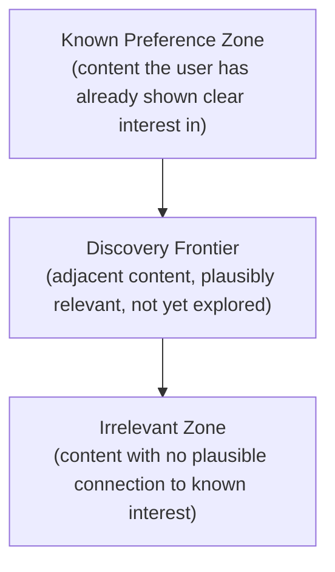

# Lesson 66: Recommender Systems and Personalization for PMs

## Why This Lesson Matters

Lesson 65 introduced the Ownership Zones Model and established that a PM must specify error costs and business context before a model can be trusted to make good decisions. Recommender systems — the models that decide what content, product, or connection to show a user next — are the single most common category of model a consumer PM will actually work with, and they carry a failure mode specific to their category that the general Ownership Zones Model doesn't fully capture on its own: the danger of a model that appears to be succeeding by every engagement metric available, while quietly narrowing what a user ever sees.

A recommender system optimized purely to maximize immediate engagement (clicks, watch time, plays) will, left unchecked, learn to show users more and more of exactly what they've already shown interest in, because that is reliably what produces the next click. This sounds like success. It often is success, in the narrow sense the model was trained to pursue. But it can simultaneously produce a user experience that grows steadily narrower over time — a phenomenon sometimes called a **filter bubble** — degrading the very diversity and discovery that made the platform valuable in the first place, in a way that doesn't show up in short-term engagement metrics at all, and may only become visible months later as long-term retention quietly erodes.

This lesson introduces the Discovery Frontier, this lesson's core mental model, to give you a systematic way to reason about the tension between exploiting what a recommender already knows a user likes and exploring what else that user might come to like — a tension every recommender system faces whether or not anyone building it has made the trade-off explicit.

---

## Learning Path

| Field | Detail |
|---|---|
| **Module** | 7 — Platform, Technical & Data-Intensive Product Management |
| **Current Lesson** | 66 of 90 |
| **Difficulty** | 7 / 10 |
| **Estimated Study Time** | 40 minutes (reading) + 15 minutes (reflection + quiz) |
| **Prerequisites** | Lesson 65 (Ownership Zones Model, precision/recall as a product decision), Lesson 46 (growth loops), Lesson 44 (cohort/retention analysis, the Smile Curve) |
| **Next Lesson** | Lesson 67 — Platform Governance: Trust, Safety, and Abuse Prevention |
| **Future Topics Unlocked** | Lesson 67 (Platform Governance), Lesson 84 (PM in AI-Native Companies), Lesson 85 (Responsible AI Product Management) — all depend on the Discovery Frontier and filter bubble concepts introduced here |

---

## Learning Objectives

By the end of this lesson, you will be able to:

1. Explain why a recommender system optimized purely for short-term engagement can produce a filter bubble.
2. Apply the Discovery Frontier model to reason about the explore/exploit trade-off in a personalization system.
3. Distinguish accuracy-only recommender metrics from diversity- and novelty-aware metrics, and explain why both matter.
4. Identify the cold-start problem and describe at least two mitigation strategies.
5. Evaluate a recommender system proposal for whether it accounts for long-term retention risk, not just immediate engagement.

---

## Prerequisites

This lesson assumes the Ownership Zones Model and precision/recall trade-off from Lesson 65, since recommender systems are a specific and especially consequential category of model requiring the same explicit error-cost framing. It also assumes the growth loop vocabulary from Lesson 46 and the cohort/retention analysis and Smile Curve concept from Lesson 44, since filter bubble risk is fundamentally a long-term retention question that short-term engagement metrics can mask.

---

## Theory

### The Exploit-Only Trap

A recommender system trained to maximize immediate engagement will, by design, learn that showing a user more of what they've already responded to positively is a reliable way to generate the next positive response. This is not a bug; it is the system correctly optimizing its stated objective. The trap is that "more of what worked before" is a strategy with a hidden long-term cost: it can narrow a user's exposure over time, reducing the surface area of the catalog they ever encounter, which can degrade the sense of discovery and serendipity that made the product valuable in the first place — a cost that is invisible to any metric measuring only the immediate response to what's currently being shown.

This is the recommender-system-specific version of Goodhart's Law from Lesson 41: optimizing directly and exclusively for a short-term proxy (immediate engagement) can actively work against the long-term outcome (sustained, satisfied usage) it was meant to serve as a stand-in for.

### The Discovery Frontier

This lesson introduces the **Discovery Frontier**, a model dividing the space of everything a recommender could show a user into three zones:

A recommender that only ever serves the **Known Preference Zone** will maximize short-term click-through but risks the filter-bubble narrowing described above. A recommender that pushes too aggressively into the **Irrelevant Zone** in the name of "diversity" will simply frustrate users with content that has no plausible connection to anything they've shown interest in. The **Discovery Frontier** — the zone of content that is adjacent to known interest, plausibly relevant, but not yet explored by this particular user — is where a well-designed recommender should deliberately spend a meaningful fraction of its recommendation slots, since this is the zone where genuine discovery, and the resulting durable increase in a user's sense of the platform's value, actually happens.

The discipline of the Discovery Frontier model is treating the balance between these zones as an explicit, tunable product decision — what fraction of recommendations should come from the Known Preference Zone versus the Discovery Frontier — rather than an emergent, unexamined side effect of whatever the engagement-maximizing model happens to converge on by default.

### Accuracy Metrics vs. Diversity and Novelty Metrics

Traditional recommender evaluation metrics (precision at k, recall at k, click-through rate) measure only whether the model correctly predicted what a user would click — they are, by construction, Known Preference Zone metrics, and a model can score extremely well on them while still producing a narrowing filter bubble. **Diversity metrics** measure how varied the recommended set is, both within a single list and across a user's recommendations over time. **Novelty metrics** measure how much of what's recommended is genuinely new to that specific user, as opposed to a repeat of previously-shown content reframed. A responsible recommender evaluation reports accuracy-style metrics alongside diversity and novelty metrics, since optimizing for the former alone can directly and measurably degrade the latter two.

### The Cold-Start Problem

Recommender systems face a specific structural challenge called the **cold-start problem**: the system has little or no interaction history for a new user (or a new item newly added to the catalog), making it difficult to generate personalized, relevant recommendations using the same collaborative or interest-based signals that work well for established users and items. Common mitigation strategies include using **onboarding preference surveys** to gather explicit initial signal, falling back to **popularity-based or editorially curated recommendations** until sufficient behavioral data accumulates, and using **content-based features** (an item's inherent attributes, rather than other users' behavior) to make reasonable initial matches even with no interaction history at all.

---

## Common Beginner Mistakes

**Mistake 1: Evaluating a recommender system using only accuracy-style metrics**

High precision or click-through rate can coexist with a rapidly narrowing filter bubble, since neither metric measures diversity or novelty.

**Mistake 2: Treating "more personalization" as an unambiguous good**

Personalization pushed too far into the Known Preference Zone, at the expense of the Discovery Frontier, can actively reduce a user's long-term sense of the platform's breadth and value.

**Mistake 3: Ignoring the cold-start problem until it causes visible user complaints**

New users and new catalog items receiving poor initial recommendations is a predictable, structural issue, not an unexpected edge case, and should be planned for from the start.

**Mistake 4: Assuming filter bubble effects will show up quickly in existing metrics**

Because filter bubble narrowing degrades long-term retention rather than immediate engagement, it can go undetected for a long time using dashboards built around short-term signals, directly echoing the Smile Curve retention-analysis lesson (Lesson 44).

**Mistake 5: Treating the explore/exploit balance as a fixed, one-time setting rather than something to monitor and adjust**

User interests, catalog composition, and platform goals all shift over time, and a Discovery Frontier balance that was appropriate a year ago may no longer be appropriate today.

---

## Mental Model: The Discovery Frontier

The Discovery Frontier introduced above is this lesson's core takeaway tool. When evaluating or designing a recommender system, ask:

1. **What fraction of recommendations currently come from the Known Preference Zone versus the Discovery Frontier**, and is that fraction an explicit product decision or an unexamined byproduct of the optimization target?
2. **Are diversity and novelty metrics being tracked alongside accuracy metrics**, so that a narrowing filter bubble would actually be visible before it damages long-term retention?
3. **Is the system handling the cold-start problem deliberately**, with a defined fallback strategy, rather than simply producing poor initial recommendations until enough data accumulates by chance?

A recommender system that can answer all three questions explicitly is far less likely to fall into the exploit-only trap that damages long-term platform value while looking successful on short-term dashboards.

---

## Real Company Example

Spotify's recommendation and discovery features, including features publicly discussed as blending personalized listening history with intentional discovery of new artists and genres, are widely cited as an example of deliberately balancing the Known Preference Zone against the Discovery Frontier rather than optimizing purely for immediate engagement. Public commentary on Spotify's recommendation approach describes efforts to introduce users to music adjacent to, but distinct from, their existing listening habits, rather than simply reinforcing an increasingly narrow set of already-known preferences — a direct illustration of deliberately allocating a meaningful fraction of recommendation slots to the Discovery Frontier zone.

**Assumption flagged:** the specifics of Spotify's internal recommendation strategy and the precise weighting it gives to discovery versus known-preference content are drawn from public commentary and industry reporting, not confirmed internal company statements, and should be treated as illustrative rather than verified fact.

---

## Real World Perspective: Recommender Systems and Personalization for PMs at Different Company Stages

**Startup:** Early-stage products with a young catalog and a young user base face the cold-start problem constantly and severely, since neither users nor items have much interaction history yet, making content-based and editorially curated fallback strategies especially important in the early stages of building a recommender system at all.

**Mid-size company:** As catalog size and user base grow, the tension between exploit-oriented and discovery-oriented recommendations typically becomes visible for the first time as short-term engagement metrics diverge from longer-term retention trends, prompting the first serious internal debate about whether the current recommender is optimized for the wrong time horizon.

**Big Tech:** Mature platforms with large-scale recommender systems typically run dedicated, ongoing research into diversity and long-term-value-aware ranking, treating the explore/exploit balance not as a solved, static parameter but as an actively researched and continuously tuned aspect of the system, given how much total platform value flows through recommendation quality at that scale.

---

## Detailed Case Study: The Narrowing Playlist

A music streaming startup's personalized recommendation feature was optimized directly and exclusively for immediate skip rate — minimizing the fraction of recommended tracks a user skipped within the first few seconds. The model performed excellently against this metric, and skip rate declined steadily over several months, presented internally as clear evidence the recommender was improving.

Over roughly the same period, a slower-moving signal told a different story: 90-day user retention, tracked using the cohort methodology from Lesson 44, began a gradual decline that took considerably longer to notice, since it moved on a much longer time horizon than the skip-rate dashboard that leadership checked daily. When the two trends were finally examined together, the underlying mechanism became clear: the recommender, correctly optimizing for immediate skip avoidance, had learned to serve each user an increasingly narrow band of extremely reliable, already-known-to-be-liked content, since safe, familiar tracks are, by construction, the least likely to be skipped. Users were, in the short term, skipping less — and simultaneously, over a longer horizon, growing quietly bored with a listening experience that had stopped introducing them to anything new, and gradually reducing their overall engagement with the platform as a whole.

**What went wrong?** Using the Discovery Frontier model, the failure is precise: the recommender had, in effect, collapsed almost entirely into the Known Preference Zone, with essentially no deliberate allocation to the Discovery Frontier, because the optimization target (immediate skip avoidance) rewarded exactly that collapse without any counterbalancing diversity or novelty signal to push back against it. The company had, without intending to, built and rewarded an exploit-only system, and the cost showed up on a retention timescale far slower than the skip-rate metric the team was watching daily.

The company's recovery involved introducing an explicit diversity and novelty scoring component alongside skip-rate optimization, deliberately reserving a portion of each user's recommendations for Discovery Frontier content, and instituting ongoing monitoring of longer-horizon retention trends alongside short-term engagement metrics — a monitoring discipline this curriculum will connect directly to the trust and safety considerations of Lesson 67, where platform-wide health metrics require the same long-horizon vigilance.

---

## Framework Explanation: The Recommender Health Checklist

Before treating a recommender system as successfully tuned, a PM can run it through the following checklist:

| Health Criterion | Question to Ask | Red Flag If... |
|---|---|---|
| Diversity Tracked | Is there a metric measuring variety within and across a user's recommendations over time? | Only accuracy-style metrics (precision, CTR) are tracked |
| Novelty Tracked | Is there a metric measuring how much recommended content is genuinely new to the user? | The same narrow content set is repeatedly resurfaced without anyone noticing |
| Discovery Frontier Allocation | Is a deliberate fraction of recommendations reserved for adjacent, unexplored content? | 100% of recommendations come from a user's already-known preferences |
| Cold-Start Plan | Is there a defined fallback strategy for new users and new catalog items? | New users receive noticeably poor or generic recommendations with no plan to improve this |
| Long-Horizon Monitoring | Is retention tracked over a long enough time window to catch filter-bubble effects? | Only short-term engagement dashboards are monitored regularly |

A "no" on Long-Horizon Monitoring in particular should be treated as a serious blind spot — filter bubble effects are, by their nature, invisible on short time horizons and only become visible once real damage has already accumulated.

---

## Interview Perspective: How Interviewers Think About This

**"How would you evaluate whether a recommender system is actually good?"** The interviewer is evaluating whether you name diversity and novelty metrics alongside accuracy metrics, rather than treating click-through rate or precision alone as sufficient evidence of success.

**"What is the cold-start problem, and how would you address it?"** The interviewer is testing whether you can name the structural cause (insufficient interaction history for new users or items) and at least one concrete mitigation strategy, such as onboarding surveys or content-based fallback recommendations.

**"A recommender system's engagement metrics are improving every week. What questions would you still want to ask?"** The interviewer is listening for recognition that short-term engagement improvement can coexist with long-term filter bubble damage, and that longer-horizon retention data should be checked before declaring success.

---

## Summary

Recommender systems face a structural tension between exploiting a user's already-known preferences and exploring adjacent content the user hasn't yet encountered, and a system optimized purely for short-term engagement will reliably learn to exploit, since showing more of what already works is the most direct path to the next positive response — a recommender-specific instance of Goodhart's Law that can produce a filter bubble invisible to the very engagement metrics being optimized. The Discovery Frontier model divides recommendable content into the Known Preference Zone, the Discovery Frontier itself, and an Irrelevant Zone, and treats the allocation across these zones as an explicit, deliberate product decision rather than an unexamined byproduct of an engagement-maximizing model. Because filter bubble effects damage long-term retention on a timescale much slower than the short-term engagement metrics most dashboards track, responsible recommender evaluation requires diversity and novelty metrics alongside accuracy metrics, and long-horizon retention monitoring alongside daily engagement tracking. The cold-start problem — insufficient interaction history for new users or items — is a separate but related structural challenge requiring deliberate fallback strategies like onboarding surveys, popularity-based defaults, or content-based matching, rather than being treated as an unexpected edge case.

---

## Key Takeaways

- A recommender system optimized purely for short-term engagement can produce a filter bubble that damages long-term retention while looking successful on immediate metrics.
- The Discovery Frontier model divides content into Known Preference, Discovery Frontier, and Irrelevant zones, treating the balance across them as a deliberate product decision.
- Diversity and novelty metrics must be tracked alongside accuracy-style metrics, since the latter alone cannot detect a narrowing recommendation experience.
- The cold-start problem — insufficient interaction history for new users or items — requires deliberate fallback strategies, not an assumption that data will simply accumulate over time.
- Filter bubble effects operate on a longer timescale than most engagement dashboards track, making long-horizon retention monitoring essential to catch them.
- "More personalization" is not an unambiguous good; excessive Known Preference Zone weighting can reduce a user's long-term sense of a platform's breadth and value.
- The explore/exploit balance should be periodically revisited, since user interests, catalog composition, and platform goals all shift over time.

---

## Cheat Sheet

*A two-minute review of everything in this lesson.*

- Exploit-only recommenders win short-term, lose long-term — this is Goodhart's Law applied to personalization.
- Discovery Frontier zones: Known Preference → Discovery Frontier → Irrelevant. Deliberately allocate to the middle zone.
- Track diversity and novelty, not just accuracy and click-through rate.
- Cold-start is structural and predictable — plan a fallback strategy from day one.
- Filter bubbles hide in long-horizon retention data, not daily engagement dashboards. Monitor both.

---

## Glossary

| Term | Definition | Related Concepts | Difficulty |
|---|---|---|---|
| Filter Bubble | The narrowing of a user's content exposure over time due to exploit-only recommendation optimization | Discovery Frontier, Goodhart's Law (Lesson 41) | 2 |
| Discovery Frontier | The zone of content adjacent to a user's known interests, plausibly relevant but not yet explored | Known Preference Zone, Irrelevant Zone | 2 |
| Diversity Metric | A measure of variety within and across a user's recommendations over time | Recommender Health Checklist | 2 |
| Novelty Metric | A measure of how much recommended content is genuinely new to a specific user | Recommender Health Checklist | 2 |
| Cold-Start Problem | The difficulty of generating relevant recommendations for new users or items with little interaction history | Content-Based Recommendations | 2 |
| Smile Curve | A retention curve shape that flattens into a stable, non-zero plateau over time, signaling durable value delivery and product-market fit. | Lesson 44, Cohort Analysis | 2 |

---

## Further Reading / Resources

- Charu Aggarwal, *Recommender Systems: The Textbook*
- Kim Falk, *Practical Recommender Systems*
- Eli Pariser, *The Filter Bubble*

---

## Flashcards

**Card 1**
- Front: ** Why can a recommender optimized purely for short-term engagement produce a filter bubble?
- Back: ** It learns that showing more of what already worked reliably produces the next positive response, narrowing exposure over time even as short-term metrics improve.
- Difficulty: 2
- Tags: **, filter-bubble, core-concept

**Card 2**
- Front: ** Name the three zones of the Discovery Frontier model.
- Back: ** Known Preference Zone, Discovery Frontier, Irrelevant Zone.
- Difficulty: 2
- Tags: **, discovery-frontier

**Card 3**
- Front: ** Why must diversity and novelty metrics be tracked alongside accuracy metrics?
- Back: ** Accuracy-style metrics (precision, CTR) cannot detect a narrowing filter bubble, since they only measure whether known-preference predictions were correct.
- Difficulty: 2
- Tags: **, metrics

**Card 4**
- Front: ** What is the cold-start problem?
- Back: ** The difficulty of generating relevant recommendations for new users or new catalog items due to insufficient interaction history.
- Difficulty: 2
- Tags: **, cold-start

**Card 5**
- Front: ** Why did skip rate improve while 90-day retention declined in the Case Study?
- Back: ** The recommender optimized for immediate skip avoidance by serving increasingly narrow, safe, already-liked content, which reduced skips short-term but bored users over a longer horizon.
- Difficulty: 2
- Tags: **, case-study, discovery-frontier

**Card 6**
- Front: ** Name two mitigation strategies for the cold-start problem.
- Back: ** Onboarding preference surveys for explicit signal, and popularity-based or content-based fallback recommendations until behavioral data accumulates.
- Difficulty: 2
- Tags: **, cold-start-mitigation

**Card 7**
- Front: ** Why is filter bubble damage often invisible on short-term dashboards?
- Back: ** It operates on a longer retention timescale than daily engagement metrics track, requiring long-horizon monitoring like the Smile Curve to detect.
- Difficulty: 2
- Tags: **, long-horizon-monitoring

## Reflection Exercise

You are the PM for a video streaming platform. Engagement metrics (average watch time, session length) have been steadily improving for six months under your current recommendation model, but a recent qualitative survey shows a growing number of long-tenured users describing the platform as feeling "repetitive" or "stuck in a rut."

There is no single correct answer to the prompts below — the goal is to practice applying the Discovery Frontier model and the Recommender Health Checklist to a case where short-term and qualitative signals are in tension.

1. Using the Discovery Frontier model, what hypothesis would you form about why engagement metrics and qualitative sentiment are diverging?
2. What specific diversity and novelty metrics would you want to introduce to test this hypothesis quantitatively?
3. What long-horizon retention data would you want to examine, and why might it tell a different story than the six-month engagement trend?
4. Propose a concrete change to the recommendation system's Discovery Frontier allocation, and explain how you would test it safely before a full rollout.
5. How would you communicate the need for this change to a leadership team that currently sees only positive, improving engagement metrics?

---

## Quiz

**1. Why can a recommender optimized purely for short-term engagement produce a filter bubble?**
A) Short-term engagement metrics are always inaccurate
B) The system learns that repeating known-preference content reliably produces the next positive response, narrowing exposure over time
C) Filter bubbles are unrelated to recommendation optimization
D) Engagement metrics automatically account for content diversity

*Correct answer: B*
*Explanation: This is the recommender-specific version of Goodhart's Law described in the Theory section — the proxy (short-term engagement) diverges from the real goal (sustained, satisfied usage).*
*Learning objective tested: #1*
*Difficulty: Easy*

---

**2. In the Discovery Frontier model, which zone should a well-designed recommender deliberately allocate a meaningful fraction of recommendations to?**
A) The Irrelevant Zone
B) The Discovery Frontier
C) Only the Known Preference Zone
D) None of the zones; recommendations should be fully random

*Correct answer: B*
*Explanation: The Discovery Frontier — adjacent, plausibly relevant, not-yet-explored content — is where genuine discovery and long-term value creation happen.*
*Learning objective tested: #2*
*Difficulty: Easy*

---

**3. Why is pushing too aggressively into the Irrelevant Zone in the name of diversity also a mistake?**
A) It is technically impossible to recommend irrelevant content
B) It frustrates users with content that has no plausible connection to their interests
C) Irrelevant Zone content always performs better than Known Preference Zone content
D) There is no meaningful distinction between the Irrelevant Zone and the Discovery Frontier

*Correct answer: B*
*Explanation: The Discovery Frontier model explicitly distinguishes the Discovery Frontier (plausibly relevant) from the Irrelevant Zone (no plausible connection), and over-indexing on the latter frustrates users.*
*Learning objective tested: #2*
*Difficulty: Easy*

---

**4. What do diversity metrics measure that accuracy metrics (precision, CTR) do not?**
A) How quickly a model produces predictions
B) How varied the recommended set is, within and across a user's recommendations over time
C) The total revenue generated by recommendations
D) The number of items in the catalog

*Correct answer: B*
*Explanation: Diversity metrics specifically capture variety, which accuracy-style metrics do not measure at all.*
*Learning objective tested: #3*
*Difficulty: Easy*

---

**5. What is the cold-start problem?**
A) A server performance issue affecting recommendation load times
B) The difficulty of generating relevant recommendations for new users or items due to insufficient interaction history
C) A problem unique to video streaming platforms
D) An issue that only affects recommendation systems built on outdated technology

*Correct answer: B*
*Explanation: Cold-start refers specifically to the lack of behavioral data for new users or items, not a technical performance issue.*
*Learning objective tested: #4*
*Difficulty: Easy*

---

**6. Which of the following is a valid mitigation strategy for the cold-start problem?**
A) Refusing to serve any recommendations to new users until sufficient data accumulates
B) Using onboarding preference surveys or content-based features to generate reasonable initial matches
C) Randomly selecting recommendations with no structure at all
D) Waiting indefinitely for organic interaction data with no interim strategy

*Correct answer: B*
*Explanation: Onboarding surveys and content-based matching are explicitly named as concrete mitigation strategies in the Theory section.*
*Learning objective tested: #4*
*Difficulty: Easy*

---

**7. In the Case Study, why did the team fail to notice the filter bubble forming for several months?**
A) They were only monitoring daily skip-rate metrics, which improved, while retention decline moved on a much slower timescale
B) The recommendation model had no measurable effect on user behavior
C) They deliberately ignored all retention data
D) Skip rate and retention always move in the same direction

*Correct answer: A*
*Explanation: The mismatch in timescales — daily skip-rate monitoring versus slow-moving 90-day retention — explains the delayed detection.*
*Learning objective tested: #1, #5*
*Difficulty: Medium*

---

**8. According to the Recommender Health Checklist, what does a "no" on Long-Horizon Monitoring indicate?**
A) A minor and inconsequential gap
B) A serious blind spot, since filter bubble effects are invisible on short time horizons and only become visible once real damage has accumulated
C) That the recommender system is performing optimally
D) That diversity metrics are unnecessary

*Correct answer: B*
*Explanation: The lesson explicitly flags this as a serious blind spot given the delayed nature of filter bubble damage.*
*Learning objective tested: #5*
*Difficulty: Medium*

---

**9. Why is "more personalization" not automatically a good thing, according to this lesson?**
A) Personalization technology is inherently unreliable
B) Excessive weighting toward the Known Preference Zone can reduce a user's long-term sense of a platform's breadth and value
C) Users always prefer completely random recommendations
D) Personalization has no measurable effect on user experience

*Correct answer: B*
*Explanation: The lesson explicitly warns against treating personalization as an unambiguous good, given the filter bubble risk of over-indexing on known preferences.*
*Learning objective tested: #1, #5*
*Difficulty: Medium*

---

**10. According to the Real World Perspective section, why do early-stage products face the cold-start problem especially severely?**
A) Early-stage products have too much interaction history to process efficiently
B) Both users and catalog items are new, meaning little interaction history exists for either side
C) Cold-start only affects large, mature platforms
D) Early-stage products are legally prohibited from personalizing recommendations

*Correct answer: B*
*Explanation: A young catalog and young user base mean cold-start challenges exist on both sides simultaneously for early-stage products.*
*Learning objective tested: #4*
*Difficulty: Medium*

---

**11. What should a mature, Big Tech-scale platform treat the explore/exploit balance as, according to the Real World Perspective section?**
A) A solved, static parameter that never needs revisiting
B) An actively researched and continuously tuned aspect of the system
C) An irrelevant technical detail with no business impact
D) A decision made once at launch and never reconsidered

*Correct answer: B*
*Explanation: The Real World Perspective section describes ongoing research and continuous tuning as the appropriate treatment at scale, given how much value flows through recommendation quality.*
*Learning objective tested: #5*
*Difficulty: Medium*

---

**12. (Scenario) A recommender's precision and click-through rate are both improving steadily, but no diversity or novelty metrics are tracked. What risk does this create, per this lesson's frameworks?**
A) No risk; strong accuracy metrics guarantee overall recommender health
B) The possibility of an undetected filter bubble forming, since accuracy metrics alone cannot reveal narrowing content exposure
C) The recommender is guaranteed to have excellent long-term retention as a result
D) This combination is technically impossible to achieve

*Correct answer: B*
*Explanation: Without diversity and novelty tracking, a filter bubble could be forming undetected even as accuracy metrics look strong.*
*Learning objective tested: #3, #5*
*Difficulty: Medium-Hard*

---

**13. (Product Thinking) A platform notices engagement metrics improving for six months while long-tenured users describe the experience as "repetitive" in qualitative feedback. Using this lesson's frameworks, what is the most likely explanation?**
A) Qualitative feedback is unreliable and should be disregarded in favor of engagement metrics
B) The recommender has likely over-indexed on the Known Preference Zone, producing short-term engagement gains at the cost of long-term perceived variety
C) There is no plausible connection between engagement metrics and qualitative sentiment
D) The platform's catalog has become too large to recommend effectively

*Correct answer: B*
*Explanation: This mirrors the Reflection Exercise and Case Study pattern: improving short-term engagement alongside declining perceived variety is a classic Discovery Frontier collapse signature.*
*Learning objective tested: #1, #2, #5*
*Difficulty: Hard*

---

**14. (Interview Reasoning) A candidate asked how to evaluate a recommender system names only click-through rate as the relevant metric. What does this most likely signal, per the Interview Perspective section?**
A) A strong and complete understanding of recommender evaluation
B) A gap in recognizing that diversity and novelty metrics are also necessary to detect filter bubble risk
C) That the candidate should be hired for a senior recommender systems role immediately
D) Nothing meaningful; click-through rate is the only metric that matters

*Correct answer: B*
*Explanation: The Interview Perspective section specifically flags the omission of diversity and novelty metrics as a signal of incomplete understanding.*
*Learning objective tested: #3, #5*
*Difficulty: Hard*

---

**15. (Product Thinking, Highest Difficulty) A video platform's engagement metrics have improved for six months, but qualitative feedback suggests growing user fatigue with repetitive recommendations. Using only the frameworks in this lesson, what is the most defensible next step?**
A) Continue the current strategy unchanged, since engagement metrics are the only objective signal that matters
B) Introduce diversity and novelty metrics, examine long-horizon retention data alongside the qualitative signal, and test a deliberate increase in Discovery Frontier allocation before a full rollout
C) Immediately maximize randomness in all recommendations to eliminate any possibility of a filter bubble
D) Dismiss the qualitative feedback as unrepresentative without further investigation

*Correct answer: B*
*Explanation: This mirrors the Reflection Exercise: the correct response neither ignores the qualitative signal nor overcorrects into pure randomness, but investigates using the appropriate metrics and tests a measured, deliberate change.*
*Learning objective tested: #2, #3, #5*
*Difficulty: Hard*

---

## Connections

| | Lesson | Core Idea Carried Forward |
|---|---|---|
| **Previous Lesson** | Lesson 65 — Working with Data Science & ML Teams | Applies the Ownership Zones Model's error-cost discipline to the specific case of recommendation and personalization models |
| **Current Lesson** | Lesson 66 — Recommender Systems and Personalization for PMs | Discovery Frontier model; filter bubbles; diversity and novelty metrics; cold-start problem; Recommender Health Checklist |
| **Next Lesson** | Lesson 67 — Platform Governance: Trust, Safety, and Abuse Prevention | Extends long-horizon platform health monitoring into a full trust and safety framework for ecosystem-wide risks |
| **Future Concepts Unlocked** | Lesson 84 (PM in AI-Native Companies) | Extends filter bubble and long-horizon monitoring discipline into broader AI product risk management |
| | Lesson 85 (Responsible AI Product Management) | Builds directly on the Discovery Frontier's fairness-adjacent concerns when addressing equitable content exposure across user groups |

This curriculum continues to build as one continuous argument. From this lesson forward, any reference to a recommendation or personalization system assumes you can locate its Discovery Frontier balance without re-explanation.
