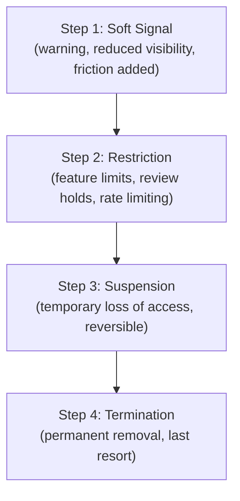

# Lesson 67: Platform Governance: Trust, Safety, and Abuse Prevention

## Why This Lesson Matters

This lesson has been owed to you since Lesson 61, and several threads from the lessons since then converge here. Lesson 61 noted that Layer 4 of the Leverage Stack, the Ecosystem, would eventually require trust and safety enforcement once independent businesses and users start operating on top of a platform at scale. Lesson 62's Case Study showed what happens when a broken implicit promise damages partner trust through simple negligence; this lesson addresses what happens when the damage is not negligence but deliberate bad-faith behavior. Lesson 63 established that marketplace liquidity depends on both sides trusting the system enough to participate; this lesson addresses what happens when a minority of participants actively try to exploit that trust. And Lesson 66 established that long-horizon monitoring is necessary to catch problems invisible to short-term metrics — a discipline that turns out to be just as essential for detecting abuse as it is for detecting filter bubbles.

Platform governance is the accumulated discipline of maintaining a healthy ecosystem despite the presence of some participants who will, given the chance, exploit it — through fraud, harassment, spam, fake reviews, or outright scams. Every platform of sufficient scale faces this problem, and the naive first instinct — "just detect and remove bad actors" — turns out to be far harder to execute well than it sounds, because the tools used to enforce trust and safety can themselves cause serious harm if applied carelessly, disproportionately, or without recourse. A platform that bans too aggressively can devastate honest participants caught in the crossfire of an imperfect detection system; a platform that bans too passively lets bad actors erode the very trust the whole ecosystem depends on.

This lesson introduces the Escalation Staircase, this lesson's core mental model, giving you a structured way to reason about proportionate, trust-preserving enforcement rather than treating "ban the bad actor" as a single blunt lever.

---

## Learning Path

| Field | Detail |
|---|---|
| **Module** | 7 — Platform, Technical & Data-Intensive Product Management |
| **Current Lesson** | 67 of 90 |
| **Difficulty** | 7 / 10 |
| **Estimated Study Time** | 40 minutes (reading) + 15 minutes (reflection + quiz) |
| **Prerequisites** | Lesson 61 (Leverage Stack, Ecosystem layer), Lesson 63 (marketplace liquidity and trust), Lesson 65 (error costs as a product decision) |
| **Next Lesson** | Lesson 68 — Technical Debt at Scale: Platform Migrations and Deprecations |
| **Future Topics Unlocked** | Lesson 68 (Technical Debt at Scale), Lesson 85 (Responsible AI Product Management) — depend on the Escalation Staircase and proportionality discipline introduced here |

---

## Learning Objectives

By the end of this lesson, you will be able to:

1. Explain why "detect and remove bad actors" is an insufficient governance strategy on its own.
2. Apply the Escalation Staircase to design a proportionate, trust-preserving enforcement response.
3. Identify the trade-off between false positives and false negatives in trust and safety enforcement, and explain its stakes.
4. Describe why an appeals process is a structural requirement, not an optional courtesy, for any enforcement system.
5. Evaluate a platform governance incident for whether its enforcement approach was proportionate and reversible where appropriate.

---

## Prerequisites

This lesson assumes the Leverage Stack's Ecosystem layer from Lesson 61, marketplace liquidity and the cross-side trust dependency from Lesson 63, and the precision/recall error-cost framing from Lesson 65, since trust and safety enforcement is fundamentally a specific, high-stakes application of that same error-cost trade-off.

---

## Theory

### Why "Detect and Remove" Is Insufficient

The intuitive governance strategy — build a detection system to identify bad actors, then remove them — fails to account for a structural reality: no detection system, whether rule-based or model-driven, is perfectly accurate. Every such system produces some false positives (honest participants incorrectly flagged) and some false negatives (bad actors who evade detection). Treating "remove" as the only available response to a detection signal means every false positive becomes a full, often irreversible harm to an innocent participant, while every improvement in detection sensitivity (to catch more true bad actors) mechanically increases the false positive rate as well, per the same precision/recall trade-off introduced in Lesson 65.

Platform governance, done well, is not primarily a detection problem. It is a **response design problem**: given that detection will never be perfect, what range of responses should be available, and how should the severity of the response match the confidence and severity of the underlying signal.

### The Escalation Staircase

This lesson introduces the **Escalation Staircase**, a graduated model of enforcement responses matched to the confidence and severity of a violation signal:

The Escalation Staircase's core discipline is that a platform should rarely jump directly to Step 4 based on a single, moderate-confidence signal. Instead, lower-confidence or lower-severity signals should trigger Step 1 or 2 responses — a warning, added friction, reduced visibility, or a review hold — that are proportionate to the uncertainty involved and, critically, **reversible** if the signal turns out to have been a false positive. Only high-confidence, high-severity signals, or a pattern of repeated lower-step violations, should justify escalating to Step 3 or 4. This staircase structure directly limits the damage any single false positive can cause, while still allowing the platform to respond meaningfully and increasingly firmly to genuine, confirmed bad-faith behavior.

### The Error-Cost Trade-off in Trust and Safety

Trust and safety enforcement is a direct, high-stakes application of the precision/recall trade-off from Lesson 65. A **false negative** here means a genuine bad actor continues operating, potentially harming other participants and eroding the platform's overall trustworthiness. A **false positive** means an honest participant is wrongly restricted or removed, an outcome that can be devastating if that participant's livelihood depends on the platform — echoing the marketplace liquidity discussion in Lesson 63, since honest supply-side participants who are wrongly punished don't just suffer individually; their departure and any resulting public complaints can also damage the platform's broader reputation with the exact population it depends on for liquidity.

Getting this trade-off right requires the same explicit, business-context-informed reasoning from Lesson 65's Ownership Zones Model: someone must decide, deliberately, how costly a false positive is relative to a false negative in this specific context, rather than defaulting to whichever error type is more visible or embarrassing in the short term.

### Why Appeals Are Structural, Not Optional

Given that no detection system achieves perfect accuracy, an **appeals process** — a defined mechanism for a flagged or restricted participant to contest the decision and have it reviewed — is not a courtesy extended to affected users; it is a structural necessity for any governance system that acknowledges its own detection will sometimes be wrong. An enforcement system with escalating, reversible steps but no appeals process still leaves false positives with no path to correction, effectively converting a Step 2 restriction into a de facto Step 4 termination for anyone unlucky enough to be wrongly flagged with no recourse.

---

## Common Beginner Mistakes

**Mistake 1: Treating enforcement as binary — allow or remove — with no intermediate steps**

This forces every moderate-confidence signal into an all-or-nothing decision, maximizing the damage of both false positives (unwarranted removal) and false negatives (no response at all to genuine concerns below the removal threshold).

**Mistake 2: Building a detection system without simultaneously designing the appeals process**

Detection alone, however accurate, guarantees some false positives, and without an appeals mechanism, those false positives have no path to correction.

**Mistake 3: Optimizing detection purely for catching bad actors, without weighing the false-positive cost to honest participants**

This mirrors the recall-oriented mistake from Lesson 65's Overzealous Churn Model — maximizing catch-rate without regard to the cost imposed on those incorrectly caught in the process.

**Mistake 4: Assuming enforcement decisions are purely a data science or trust-and-safety-team problem, with no PM ownership**

As in Lesson 65's Ownership Zones Model, the relative cost of false positives versus false negatives in enforcement is a business and ethical judgment that PM leadership must explicitly own, not delegate entirely to a detection model's default behavior.

**Mistake 5: Failing to monitor enforcement outcomes over a long time horizon**

Just as filter bubble damage from Lesson 66 is invisible on short time horizons, patterns of disproportionate or biased enforcement against specific participant segments can take considerable time to surface unless deliberately monitored for.

---

## Mental Model: The Escalation Staircase

The Escalation Staircase introduced above is this lesson's core takeaway tool. When designing or evaluating any trust and safety enforcement system, ask:

1. **Does this system have graduated response steps**, or does every violation signal lead to the same binary allow/remove outcome?
2. **Are lower steps reversible**, so that a false positive at Step 1 or 2 doesn't permanently harm an honest participant?
3. **Does escalation to Step 3 or 4 require either high-confidence, high-severity signals, or a documented pattern of repeated lower-step violations**, rather than a single moderate-confidence flag?
4. **Is there a functioning appeals process at every step**, giving a wrongly-flagged participant a genuine path to correction?

A governance system that can answer all four questions affirmatively is far better positioned to preserve ecosystem trust than one relying on a single detect-and-remove lever, however sophisticated its detection technology may be.

---

## Real Company Example

Uber's trust and safety systems, including publicly discussed background check processes for drivers and fraud detection systems for both riders and drivers, are frequently cited as an example of a platform managing enforcement across a large, two-sided marketplace where the cost of both false positives (wrongly restricting a driver's ability to earn income) and false negatives (allowing a genuinely unsafe or fraudulent actor to continue operating) is significant. Public reporting on Uber's approach describes graduated interventions in various contexts, such as temporary account holds pending review rather than immediate permanent deactivation for lower-severity or lower-confidence signals, reflecting the same staircase logic this lesson formalizes.

**Assumption flagged:** the specifics of Uber's internal trust and safety enforcement processes and escalation criteria described here are drawn from public reporting and industry commentary, not confirmed internal company statements, and should be treated as illustrative rather than verified fact.

---

## Real World Perspective: Platform Governance: Trust, Safety, and Abuse Prevention at Different Company Stages

**Startup:** Early-stage platforms often handle trust and safety manually, with a small team personally reviewing flagged content or accounts, which can actually make proportionate, case-by-case judgment easier than it will be later at scale — but this manual approach does not automatically transfer good judgment into a durable, documented system as the platform and its volume of flags grow.

**Mid-size company:** This is typically where automated detection systems are first introduced to handle growing flag volume, and where the temptation to rely on a single binary "flag and remove" pipeline, without graduated steps or an appeals process, becomes strongest under the pressure of growing enforcement workload relative to team size.

**Big Tech:** Large platforms typically operate dedicated trust and safety organizations with formal escalation policies, documented appeals processes, and ongoing bias and fairness monitoring across enforcement outcomes, precisely because the scale of both potential harm (from bad actors) and potential collateral damage (from false positives) is too large to manage through informal, ad hoc judgment.

---

## Detailed Case Study: The Automated Seller Purge

An e-commerce marketplace, facing a growing volume of fraudulent seller accounts, deployed an automated fraud-detection model directly connected to an immediate account termination pipeline: any seller account scoring above a confidence threshold was suspended and delisted within minutes, with no intermediate review step and no formal appeals channel beyond a generic support email address that took, on average, several weeks to receive a substantive response.

The model performed well against its internal fraud-catch-rate metric, and the volume of confirmed fraudulent listings dropped sharply within the first month. But the model's confidence threshold, tuned aggressively to maximize catch rate, also flagged a meaningful number of honest, long-standing sellers whose account activity happened to resemble fraud patterns for legitimate reasons — a sudden but genuine spike in order volume during a seasonal promotion, for instance, or a change in shipping address following a legitimate business relocation. These sellers found their accounts terminated with no warning, no opportunity to explain, and no timely recourse, since the appeals channel was effectively non-functional in practice despite existing on paper.

Within two months, seller community forums and social media contained a growing volume of public complaints from honest sellers describing sudden, unexplained account terminations, and new seller sign-ups on the platform began to decline noticeably — a direct instance of the marketplace liquidity and cross-side trust dynamic from Lesson 63, where damage to supply-side trust in the platform's fairness reduced supply-side participation, which in turn threatened the demand-side experience the entire marketplace depended on.

**What went wrong?** Using the Escalation Staircase, the failure is precise: the platform connected a moderate-confidence detection signal directly to Step 4 (permanent termination), skipping the graduated Steps 1 through 3 entirely, and paired this with an appeals process that was reversible in theory but non-functional in practice due to its multi-week response time. The team had optimized detection purely for fraud catch rate, mirroring the Overzealous Churn Model mistake from Lesson 65, without weighing the real cost that false positives imposed on honest sellers whose livelihoods depended on continued marketplace access.

The company's recovery involved introducing intermediate review holds for moderate-confidence signals rather than immediate termination, building a genuinely responsive appeals process with a defined maximum response time, and reserving immediate termination for only the highest-confidence fraud signals or confirmed repeat violations — a redesign that directly foreshadows the technical debt and migration discipline covered in Lesson 68, since implementing these changes required significant rework of the original detection-to-action pipeline.

---

## Framework Explanation: The Trust and Safety Program Checklist

Before deploying or evaluating a trust and safety enforcement system, a PM can use the following checklist:

| Checklist Item | Question to Ask | Risk if Skipped |
|---|---|---|
| Graduated Response | Are there intermediate steps between "no action" and "permanent removal"? | Every signal forces an all-or-nothing decision, maximizing both error types' damage |
| Confidence-Severity Matching | Does escalation severity match the confidence and severity of the underlying signal? | Moderate-confidence signals trigger disproportionately severe responses |
| Reversibility | Are lower-severity steps genuinely reversible for false positives? | Honest participants suffer permanent harm from correctable mistakes |
| Functional Appeals Process | Does the appeals process have a defined, reasonably short response time, tested in practice? | An appeals process that exists on paper but doesn't function in practice offers no real recourse |
| Long-Horizon Bias Monitoring | Is enforcement outcome data monitored over time for disproportionate impact on specific participant segments? | Systemic bias in enforcement can go undetected for a long period |

A "no" on Functional Appeals Process should be treated with particular urgency — a theoretical appeals process that doesn't work in practice provides no more real protection than having no appeals process at all.

---

## Interview Perspective: How Interviewers Think About This

**"How would you design an enforcement system for detecting fraudulent accounts on a platform?"** The interviewer is evaluating whether you propose graduated, reversible response steps rather than a single detect-and-remove pipeline, and whether you mention an appeals process as a structural requirement rather than an afterthought.

**"What's the danger of optimizing a trust and safety detection model purely for catch rate?"** The interviewer is testing whether you connect this to the precision/recall error-cost trade-off from Lesson 65, recognizing that maximizing catch rate mechanically increases false positives affecting honest participants.

**"Tell me about a situation where an automated system caused unintended harm to legitimate users."** The interviewer is listening for recognition of the core failure pattern in this lesson's Case Study: a system optimized for one metric (fraud catch rate) without regard to the real cost of errors on the other side, compounded by an ineffective recourse mechanism.

---

## Summary

Platform governance is fundamentally a response design problem, not merely a detection problem, because no detection system achieves perfect accuracy, and treating "detect and remove" as the only available response converts every false positive into a full, often irreversible harm to an honest participant. The Escalation Staircase — Soft Signal, Restriction, Suspension, Termination — provides a graduated framework for matching enforcement severity to the confidence and severity of the underlying violation signal, reserving irreversible termination for only the highest-confidence signals or documented patterns of repeated lower-step violations. Trust and safety enforcement is a direct, high-stakes application of the precision/recall error-cost trade-off from Lesson 65, and because a false positive can devastate an honest participant whose livelihood depends on platform access, an appeals process is a structural necessity, not an optional courtesy, for any system that acknowledges its own imperfect accuracy. Damage to supply-side or ecosystem trust from disproportionate enforcement directly threatens the marketplace liquidity concepts introduced in Lesson 63, since honest participants who are wrongly punished, and who publicize that experience, can drive away exactly the population a platform depends on for continued health.

---

## Key Takeaways

- Platform governance is a response design problem, not merely a detection problem, since no detection system achieves perfect accuracy.
- The Escalation Staircase — Soft Signal, Restriction, Suspension, Termination — matches enforcement severity to signal confidence and severity, avoiding all-or-nothing responses.
- Lower escalation steps should be genuinely reversible, limiting the damage any single false positive can cause to an honest participant.
- Trust and safety enforcement is a high-stakes application of the precision/recall error-cost trade-off from Lesson 65, requiring explicit business judgment about relative error costs.
- An appeals process is a structural requirement for any enforcement system, not an optional courtesy, given that detection will sometimes be wrong.
- Damage to ecosystem trust from disproportionate enforcement can drive away honest participants, directly threatening marketplace liquidity as described in Lesson 63.
- Enforcement outcomes should be monitored over a long time horizon to catch patterns of bias or disproportionate impact that may not be visible in short-term data.

---

## Cheat Sheet

*A two-minute review of everything in this lesson.*

- Detection is never perfect. Governance is about designing responses, not just detecting bad actors.
- Escalation Staircase: Soft Signal → Restriction → Suspension → Termination. Match severity to confidence.
- Keep lower steps reversible. Reserve Termination for high-confidence or repeated violations only.
- An appeals process is structural, not optional — and it must actually function, not just exist on paper.
- Enforcement is a precision/recall trade-off with real human cost on both sides. Own that trade-off deliberately.

---

## Glossary

| Term | Definition | Related Concepts | Difficulty |
|---|---|---|---|
| Escalation Staircase | A four-step graduated enforcement model: Soft Signal, Restriction, Suspension, Termination | Precision/Recall (Lesson 65) | 2 |
| False Positive (Trust & Safety) | An honest participant incorrectly flagged or restricted by an enforcement system | Escalation Staircase, Appeals Process | 2 |
| False Negative (Trust & Safety) | A genuine bad actor who evades detection and continues operating | Escalation Staircase | 2 |
| Appeals Process | A defined mechanism for a flagged participant to contest and have an enforcement decision reviewed | Escalation Staircase, Reversibility | 2 |
| Reversibility | The property that an enforcement action can be undone without lasting harm if it turns out to be a false positive | Escalation Staircase | 2 |
| Trust and Safety Program Checklist | A five-item checklist evaluating whether an enforcement system is proportionate and accountable | Escalation Staircase | 2 |

---

## Further Reading / Resources

- Tarleton Gillespie, *Custodians of the Internet*
- Sarah T. Roberts, *Behind the Screen*
- Cathy O'Neil, *Weapons of Math Destruction*

---

## Flashcards

**Card 1**
- Front: ** Why is "detect and remove" an insufficient governance strategy?
- Back: ** No detection system is perfectly accurate, so treating removal as the only response converts every false positive into a full, often irreversible harm to an honest participant.
- Difficulty: 2
- Tags: **, governance, core-concept

**Card 2**
- Front: ** Name the four steps of the Escalation Staircase in order.
- Back: ** Soft Signal, Restriction, Suspension, Termination.
- Difficulty: 2
- Tags: **, escalation-staircase

**Card 3**
- Front: ** Why should lower escalation steps be reversible?
- Back: ** To limit the damage a false positive can cause to an honest participant, since detection confidence at lower steps is, by design, lower.
- Difficulty: 2
- Tags: **, reversibility

**Card 4**
- Front: ** Why is an appeals process a structural requirement, not a courtesy?
- Back: ** Because any system that acknowledges its own imperfect accuracy must provide a path to correct the false positives it will inevitably produce.
- Difficulty: 2
- Tags: **, appeals-process

**Card 5**
- Front: ** What went wrong in the Automated Seller Purge case study?
- Back: ** A moderate-confidence detection signal was connected directly to permanent termination with no graduated steps, paired with a non-functional appeals process, harming honest sellers and damaging marketplace liquidity.
- Difficulty: 2
- Tags: **, case-study, escalation-staircase

**Card 6**
- Front: ** How does trust and safety enforcement relate to the precision/recall trade-off from Lesson 65?
- Back: ** It is a high-stakes application of the same trade-off — maximizing catch rate (recall) mechanically increases false positives against honest participants, a cost that must be deliberately weighed.
- Difficulty: 2
- Tags: **, precision-recall, enforcement

**Card 7**
- Front: ** Why should enforcement outcomes be monitored over a long time horizon?
- Back: ** Patterns of disproportionate or biased enforcement against specific participant segments can take considerable time to surface, similar to filter bubble damage in Lesson 66.
- Difficulty: 2
- Tags: **, long-horizon-monitoring

## Reflection Exercise

You are the PM for a freelance marketplace platform. Your trust and safety team has proposed a new automated system to detect fake reviews, with a model that would flag suspicious review patterns for immediate removal and, for repeat offenders, immediate account suspension.

There is no single correct answer to the prompts below — the goal is to practice applying the Escalation Staircase and the Trust and Safety Program Checklist to a new enforcement proposal before it ships.

1. Using the Escalation Staircase, what intermediate steps would you recommend before immediate account suspension for a first-time flagged offense?
2. What would make a signal confident and severe enough to justify skipping directly to a higher escalation step?
3. What would a functional, genuinely responsive appeals process look like for reviewers or sellers flagged by this system?
4. How would you decide, and with whom, the relative cost of a false positive (an honest reviewer wrongly flagged) versus a false negative (a fake review that goes undetected)?
5. What long-horizon monitoring would you put in place to check whether this system disproportionately affects any particular group of honest users over time?

---

## Quiz

**1. Why is "detect and remove" described as an insufficient governance strategy on its own?**
A) Detection systems are always too slow to be useful
B) No detection system achieves perfect accuracy, so treating removal as the only response converts every false positive into full, often irreversible harm
C) Removal is technically impossible to implement at scale
D) Bad actors never actually get detected by automated systems

*Correct answer: B*
*Explanation: The core insight is that imperfect detection combined with a single severe response maximizes the damage from false positives.*
*Learning objective tested: #1*
*Difficulty: Easy*

---

**2. What is the correct order of the Escalation Staircase?**
A) Termination, Suspension, Restriction, Soft Signal
B) Soft Signal, Restriction, Suspension, Termination
C) Restriction, Termination, Soft Signal, Suspension
D) Suspension, Soft Signal, Termination, Restriction

*Correct answer: B*
*Explanation: This is the graduated order from lowest to highest severity introduced in the Theory section.*
*Learning objective tested: #2*
*Difficulty: Easy*

---

**3. Why should escalation to Termination generally require high confidence or a documented pattern of repeated violations?**
A) Termination is the cheapest response for a platform to implement
B) Termination is irreversible, so it should be reserved for cases where the underlying signal is strong enough to justify that irreversibility
C) Termination is always required by law regardless of confidence level
D) Lower-confidence signals are always more accurate than high-confidence ones

*Correct answer: B*
*Explanation: Because Termination cannot be easily undone, the model reserves it for the highest-confidence, highest-severity cases specifically to limit irreversible harm from false positives.*
*Learning objective tested: #2*
*Difficulty: Easy*

---

**4. How does trust and safety enforcement relate to the precision/recall trade-off from Lesson 65?**
A) It is entirely unrelated; enforcement decisions are purely legal matters
B) It is a high-stakes application of the same trade-off, where maximizing catch rate mechanically increases false positives against honest participants
C) Precision and recall only apply to recommender systems, not enforcement
D) Enforcement systems never involve any trade-offs

*Correct answer: B*
*Explanation: The lesson explicitly frames enforcement as a direct, high-stakes instance of the error-cost trade-off introduced for models generally in Lesson 65.*
*Learning objective tested: #3*
*Difficulty: Easy*

---

**5. Why is an appeals process considered structural rather than optional?**
A) Appeals processes are required only in certain countries by regulation
B) Any system that acknowledges its own imperfect accuracy must provide a path to correct the false positives it will inevitably produce
C) Appeals processes are primarily a public relations tool with no functional purpose
D) Honest participants never actually get wrongly flagged in practice

*Correct answer: B*
*Explanation: Given that detection is never perfect, an appeals process is the necessary mechanism for correcting the resulting false positives.*
*Learning objective tested: #4*
*Difficulty: Easy*

---

**6. In the Case Study, what specifically caused the Automated Seller Purge to fail?**
A) The fraud-detection model had extremely poor catch rate
B) A moderate-confidence signal was connected directly to permanent termination with no intermediate steps, paired with a non-functional appeals process
C) The platform received no complaints from affected sellers
D) The model was never actually deployed to production

*Correct answer: B*
*Explanation: The failure was a design choice — skipping graduated steps and pairing aggressive detection with an ineffective appeals channel — not a purely technical detection failure.*
*Learning objective tested: #2, #4*
*Difficulty: Easy*

---

**7. How did the Automated Seller Purge case study connect to marketplace liquidity concepts from Lesson 63?**
A) It had no connection to liquidity at all
B) Damage to supply-side trust from wrongful terminations reduced new seller sign-ups, directly threatening the marketplace's liquidity
C) Liquidity only concerns demand-side behavior, never supply-side trust
D) The case study showed liquidity improving as a direct result of the purge

*Correct answer: B*
*Explanation: Honest sellers' public complaints and declining new sign-ups directly illustrate the cross-side trust dependency central to marketplace liquidity.*
*Learning objective tested: #3, #5*
*Difficulty: Medium*

---

**8. According to the Trust and Safety Program Checklist, what does a "no" on Functional Appeals Process indicate?**
A) A minor issue that can be addressed at a later date
B) A serious deficiency, since a theoretical appeals process that doesn't function in practice offers no real protection against false positives
C) That the enforcement system is ready to deploy as-is
D) That appeals processes are unnecessary if detection accuracy is high enough

*Correct answer: B*
*Explanation: The lesson explicitly treats a non-functional appeals process as equivalent in practice to having no appeals process at all.*
*Learning objective tested: #4, #5*
*Difficulty: Medium*

---

**9. Why might a mid-size company be especially tempted to skip graduated enforcement steps, per the Real World Perspective section?**
A) Mid-size companies are legally prohibited from using graduated enforcement
B) Growing flag volume relative to team size creates pressure toward a single binary flag-and-remove pipeline
C) Graduated enforcement is only relevant for very small platforms
D) Mid-size companies never experience meaningful fraud or abuse

*Correct answer: B*
*Explanation: The Real World Perspective section identifies this specific pressure as the reason mid-size companies are prone to skipping graduated steps.*
*Learning objective tested: #2*
*Difficulty: Medium*

---

**10. What should a mature, Big Tech-scale trust and safety organization include, according to the Real World Perspective section?**
A) A single automated system with no human oversight
B) Formal escalation policies, documented appeals processes, and ongoing bias and fairness monitoring
C) No monitoring of enforcement outcomes, since detection accuracy is assumed to be sufficient
D) Enforcement policies that are never revisited once established

*Correct answer: B*
*Explanation: The Real World Perspective section describes these three elements as characteristic of mature, large-scale trust and safety organizations.*
*Learning objective tested: #5*
*Difficulty: Medium*

---

**11. Why should enforcement outcomes be monitored over a long time horizon?**
A) Long-horizon monitoring is only relevant to recommender systems, not enforcement
B) Patterns of disproportionate or biased enforcement against specific participant segments can take considerable time to surface
C) Enforcement outcomes never change over time once a system is deployed
D) Short-term monitoring is always sufficient to detect any governance issue

*Correct answer: B*
*Explanation: This mirrors the long-horizon monitoring discipline from Lesson 66, applied specifically to detecting bias in enforcement patterns.*
*Learning objective tested: #5*
*Difficulty: Medium*

---

**12. (Scenario) A trust and safety model flags an account with moderate confidence for a first-time, moderate-severity violation. Per the Escalation Staircase, what is the most appropriate initial response?**
A) Immediate permanent termination
B) A Soft Signal or Restriction step, reserving Suspension or Termination for higher-confidence signals or repeated violations
C) No response at all, since moderate confidence is not actionable
D) Immediate suspension with no appeals option

*Correct answer: B*
*Explanation: Moderate confidence and severity call for a lower, reversible step on the Escalation Staircase, not an irreversible response.*
*Learning objective tested: #2, #5*
*Difficulty: Medium-Hard*

---

**13. (Product Thinking) A PM is told that a fraud-detection model's catch rate has improved significantly. What follow-up question does this lesson suggest is essential?**
A) None; an improved catch rate is unambiguously good news requiring no further inquiry
B) What has happened to the false positive rate against honest participants, and is the enforcement response proportionate to the confidence of each flag?
C) How quickly can the model be deployed to production without further review?
D) Whether the model can be made even more aggressive with no other considerations

*Correct answer: B*
*Explanation: An improved catch rate, per the precision/recall trade-off, likely comes with a corresponding change in false positive rate, which must be weighed against enforcement proportionality.*
*Learning objective tested: #3, #5*
*Difficulty: Hard*

---

**14. (Interview Reasoning) A candidate describes a fraud detection system with a single flag-and-remove response and no mention of an appeals process. What does this most likely signal, per the Interview Perspective section?**
A) A strong, complete understanding of platform governance
B) A significant gap — the interviewer is specifically listening for graduated responses and an appeals process as structural requirements
C) That the candidate is ready for a senior trust and safety leadership role immediately
D) Nothing meaningful; a single flag-and-remove response is the most efficient possible design

*Correct answer: B*
*Explanation: The Interview Perspective section explicitly flags the absence of graduated responses and an appeals process as signals of an incomplete understanding of governance.*
*Learning objective tested: #2, #4*
*Difficulty: Hard*

---

**15. (Product Thinking, Highest Difficulty) A marketplace must design an enforcement system for a new category of abuse, balancing the harm of false negatives (undetected bad actors) against false positives (wrongly restricted honest participants) whose livelihoods depend on the platform. Using only the frameworks in this lesson, what is the most defensible approach?**
A) Connect all detection signals directly to permanent termination to maximize deterrence
B) Design a graduated Escalation Staircase with reversible lower steps, reserve Termination for high-confidence or repeated violations, and pair the system with a genuinely functional, timely appeals process
C) Avoid building any enforcement system at all, since any detection system will produce some errors
D) Rely exclusively on honest participants to self-report bad actors, with no automated detection

*Correct answer: B*
*Explanation: This mirrors the Reflection Exercise and Case Study: the correct response neither ignores the error trade-off nor avoids enforcement altogether, but designs a graduated, proportionate, and appealable system.*
*Learning objective tested: #2, #3, #4*
*Difficulty: Hard*

---

## Connections

| | Lesson | Core Idea Carried Forward |
|---|---|---|
| **Previous Lesson** | Lesson 66 — Recommender Systems and Personalization for PMs | Extends long-horizon monitoring discipline from filter bubble detection into bias and fairness monitoring in enforcement outcomes |
| **Current Lesson** | Lesson 67 — Platform Governance: Trust, Safety, and Abuse Prevention | Escalation Staircase; error-cost trade-off in enforcement; appeals process as structural requirement; Trust and Safety Program Checklist |
| **Next Lesson** | Lesson 68 — Technical Debt at Scale: Platform Migrations and Deprecations | Builds on the Automated Seller Purge case study's need for significant pipeline rework into a formal framework for large-scale technical migrations |
| **Future Concepts Unlocked** | Lesson 85 (Responsible AI Product Management) | Extends the error-cost and proportionality discipline here directly into fairness considerations for AI-driven decisions |

This curriculum continues to build as one continuous argument. From this lesson forward, any reference to a platform enforcement decision assumes you can locate it on the Escalation Staircase without re-explanation. This resolves the open threads from Lessons 61, 62, 63, and 66 regarding ecosystem trust, implicit promises, marketplace trust dynamics, and long-horizon monitoring.
