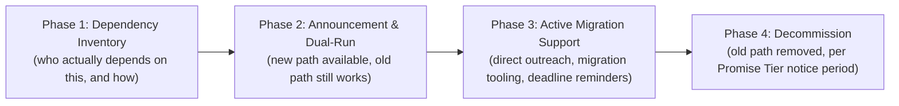

# Lesson 68: Technical Debt at Scale: Platform Migrations and Deprecations

## Why This Lesson Matters

Lesson 67 closed with a company that, having redesigned its trust and safety enforcement pipeline, faced a significant technical rework — precisely the kind of large-scale migration this lesson now addresses directly. Module 4 introduced the Technical Debt Quadrant as a way of categorizing debt at the level of an individual team's codebase. This lesson scales that concern up by an order of magnitude: what happens when the thing that needs to change is not a single team's internal implementation, but a Layer 2 Developer Surface, per the Leverage Stack from Lesson 61, that dozens or hundreds of external parties depend on, per the Promise Tiers model from Lesson 62.

At platform scale, technical debt is not merely an engineering inconvenience to be paid down at a team's own convenience — it can become a binding constraint on the platform's ability to evolve at all, because every dependent integration built by an external party is, in effect, a small claim on the platform's future flexibility. A platform that accumulates enough of these claims, without a disciplined process for eventually retiring old commitments, can find itself unable to make even clearly beneficial changes, trapped by the sheer volume and diversity of things depending on the old behavior.

This lesson introduces the Sunset Runway, this lesson's core mental model, to give you a structured way to plan and execute large-scale migrations and deprecations without either freezing a platform in place indefinitely or breaking trust with the ecosystem depending on it — directly extending the discipline this curriculum began building in Lesson 62's Promise Tiers.

---

## Learning Path

| Field | Detail |
|---|---|
| **Module** | 7 — Platform, Technical & Data-Intensive Product Management |
| **Current Lesson** | 68 of 90 |
| **Difficulty** | 6 / 10 |
| **Estimated Study Time** | 40 minutes (reading) + 15 minutes (reflection + quiz) |
| **Prerequisites** | Lesson 62 (Promise Tiers, semantic versioning, deprecation policy), Module 4's Technical Debt Quadrant (Lessons 31–40) |
| **Next Lesson** | Lesson 69 — Internal Platforms and Developer Experience (DevEx) as a Product |
| **Future Topics Unlocked** | Lesson 69 (Internal Platforms and DevEx), Lesson 78 (Build, Buy, or Partner), Lesson 87 (Crisis Management) — all depend on the Sunset Runway and dependency-inventory discipline introduced here |

---

## Learning Objectives

By the end of this lesson, you will be able to:

1. Explain why platform-scale technical debt differs from team-level technical debt in kind, not just degree.
2. Apply the Sunset Runway model to plan a large-scale migration or deprecation with an appropriate timeline.
3. Identify the risks of an incomplete dependency inventory before a migration begins.
4. Describe the purpose of a dual-run period in a platform migration.
5. Evaluate a proposed migration plan for whether its timeline and communication match the scale of ecosystem dependency involved.

---

## Prerequisites

This lesson assumes the Promise Tiers model, semantic versioning, and deprecation policy concepts from Lesson 62, and a general familiarity with the Technical Debt Quadrant introduced in Module 4 (Lessons 31–40), since this lesson extends that team-level framework to the platform scale, where dependents are external parties rather than internal colleagues.

---

## Theory

### Why Platform-Scale Technical Debt Differs in Kind

Team-level technical debt, as covered in Module 4's Technical Debt Quadrant, is primarily a matter of internal trade-offs: a team accepts some debt to move faster, and pays it down later, largely on its own schedule, since the people affected by the debt and the people who incurred it are often the same people, or at least the same organization. Platform-scale technical debt is structurally different, because the parties depending on the old behavior are frequently external, numerous, and invisible to the platform team in aggregate. A single internal team's debt is a private matter; a platform's accumulated commitments are, in effect, public promises made to an entire ecosystem, and unwinding them requires coordinating changes across parties the platform team does not control and may not even be able to fully enumerate.

This is precisely why Lesson 62 introduced the Promise Tiers model and formal deprecation policy: without those mechanisms, a platform has no legitimate way to ever retire an old commitment, and technical debt at this scale becomes a one-way ratchet, accumulating indefinitely because removing anything risks breaking someone, somewhere, who was never accounted for.

### The Sunset Runway

This lesson introduces the **Sunset Runway**, a four-phase model for retiring a platform capability that external parties depend on:

**Phase 1, Dependency Inventory**, requires building the most complete possible picture of who actually depends on the capability being retired, and how — a step that is frequently skipped or under-resourced, with damaging consequences illustrated in the Case Study below. **Phase 2, Announcement and Dual-Run**, begins the deprecation clock (per the Promise Tier the capability belongs to) while keeping both the old and new paths simultaneously functional, giving dependents time to migrate without a hard cutover forcing everyone to move at once. **Phase 3, Active Migration Support**, is where the platform team takes on real responsibility for helping dependents actually complete their migration — providing tooling, direct outreach to known high-impact dependents, and clear deadline communication — rather than simply announcing the change and waiting passively. **Phase 4, Decommission**, removes the old path only after the notice period has elapsed and, ideally, after monitoring shows migration completion has reached an acceptable threshold, rather than by calendar date alone regardless of actual migration progress.

The Sunset Runway's core discipline is recognizing that the length of an appropriate runway is not a fixed constant — it should scale with the number, diversity, and criticality of dependents uncovered in Phase 1, meaning the very first phase directly determines whether every subsequent phase is even planned realistically.

### The Danger of an Incomplete Dependency Inventory

A dependency inventory built only from what the platform team can easily observe (registered API keys, documented integrations) will systematically miss dependents using undocumented workarounds, third-party tools built on top of official integrations, or long-tail, low-volume-but-critical usage that doesn't show up prominently in aggregate metrics. An incomplete inventory doesn't just risk missing a few edge cases — it risks systematically under-estimating the true scope of a migration, leading to a runway that looks generous on paper but is, in practice, far too short for the dependents the platform team never accounted for in the first place.

### Why a Dual-Run Period Matters

A **dual-run period** — during which both the old and new capability remain simultaneously functional — exists specifically to decouple the platform's readiness to retire something from each individual dependent's readiness to migrate away from it. Without a dual-run period, a migration becomes a synchronized, all-or-nothing cutover, forcing every dependent, regardless of their own internal priorities, resourcing, or release cycles, to migrate on the platform's timeline rather than a timeline that accounts for their own constraints — a mismatch that is especially costly for the platform's most resource-constrained and often most loyal long-tail dependents.

---

## Common Beginner Mistakes

1. **Skipping or under-resourcing the dependency inventory phase.** Assuming that documented, registered integrations represent the full universe of dependents nearly always understates the true scope of who will be affected by a migration.
2. **Setting a migration deadline based on calendar convenience rather than dependent migration progress.** Decommissioning on a fixed date regardless of actual migration completion rates converts a planned, orderly transition into a forced, disruptive cutover for anyone who hasn't finished migrating.
3. **Treating announcement as equivalent to active migration support.** Simply publishing a deprecation notice and expecting dependents to act on their own initiative, without direct outreach or migration tooling, tends to leave a long tail of dependents who never see or act on the announcement until the deadline arrives.
4. **Underestimating the runway needed for the most resource-constrained dependents.** A migration timeline appropriate for large, well-resourced partners may be far too aggressive for smaller developers or long-tail integrations with less engineering capacity to respond quickly.
5. **Failing to monitor migration progress during the dual-run period.** Without tracking how many dependents have actually migrated as the deadline approaches, a platform team has no way to know whether a planned Phase 4 decommission is actually safe to execute on schedule.

---

## Mental Model: The Sunset Runway

The Sunset Runway introduced above is this lesson's core takeaway tool. Before beginning any large-scale platform migration or deprecation, ask:

1. **Has Phase 1's dependency inventory gone beyond easily observable, registered integrations** to actively search for undocumented or long-tail usage?
2. **Does the announced runway length in Phase 2 scale appropriately with the diversity and criticality of dependents uncovered**, per the capability's Promise Tier from Lesson 62, rather than being set by internal convenience?
3. **Is Phase 3 genuinely active** — direct outreach and migration tooling — rather than a passive announcement followed by silence until the deadline?
4. **Is Phase 4's decommission gated on actual migration progress**, not solely on the calendar date originally announced?

A migration plan that can answer all four questions affirmatively is far less likely to produce the kind of disruptive, trust-damaging cutover this lesson's Case Study describes.

---

## Real Company Example

Google's history of deprecating and sunsetting various products and APIs, a topic of frequent public discussion and, at times, public criticism, is widely cited as an example of the reputational risk a platform faces when dependents feel a deprecation was announced with insufficient runway or insufficient support for migration. Public commentary on various Google API and product deprecations over the years has, at different points, highlighted developer frustration with migration timelines perceived as too short relative to the scale and diversity of affected integrations, illustrating the real ecosystem-trust cost — echoing the Promise Tiers and cross-side trust concepts from Lessons 62 and 63 — that an inadequately-run Sunset Runway can impose, even when the underlying decision to deprecate was reasonable on its own technical or strategic merits.

**Assumption flagged:** the specifics of any particular Google deprecation process, timeline, or internal decision-making described here are drawn from public commentary and industry reporting, not confirmed internal company statements, and should be treated as illustrative and general rather than a claim about any specific documented incident.

---

## Real World Perspective

**Startup:** Early-stage platforms typically have few enough external dependents that migrations can be coordinated through direct, informal communication with each one individually, making a formal Sunset Runway process feel like unnecessary overhead — a reasonable trade-off at small scale, but one that does not automatically transfer into good practice once the dependent base grows.

**Mid-size company:** This is typically where the first genuinely painful migration occurs, often because a growing developer base was never comprehensively inventoried, and a deprecation planned assuming a small, known dependent set turns out to affect a much larger and more diverse population than anticipated.

**Big Tech:** Mature platforms typically maintain formal migration and deprecation governance processes, including mandatory dependency-impact assessments before any deprecation announcement and dedicated migration-support engineering resources, precisely because the reputational and ecosystem-trust cost of a poorly-run migration at that scale can be severe and highly visible.

---

## Detailed Case Study: The Underestimated Cutover

A logistics software platform decided to deprecate an older, less efficient version of its core shipment-tracking API in favor of a significantly improved new version. The platform team, working from its registry of officially registered API keys, identified roughly 200 known integrations and announced a 90-day deprecation notice, judged by the team to be generous relative to the Promise Tier the API belonged to and consistent with the deprecation policy discipline from Lesson 62.

What the registered-API-key inventory missed was a substantial population of smaller logistics companies who had, years earlier, built integrations through a popular third-party logistics-software vendor that itself used the platform's API on behalf of hundreds of its own downstream customers, all operating under a small number of shared API keys the platform team's inventory had significantly under-counted in terms of actual downstream dependency. When the 90-day deadline arrived and the old API version was decommissioned on schedule, the platform team discovered — abruptly, through a surge of support tickets — that several hundred small businesses relying on that third-party vendor's integration had never received any direct migration communication, since all official announcements had gone only to the vendor's shared account contact, and the vendor itself had not adequately propagated the migration requirement to its own downstream customers in time.

**What went wrong?** Using the Sunset Runway, the failure is precise: Phase 1's dependency inventory relied solely on registered API keys, systematically undercounting the true scope of downstream dependents hidden behind a third-party vendor's shared integration, and Phase 4's decommission proceeded strictly on the calendar date rather than being gated on evidence of actual migration completion across this hidden long tail. The 90-day runway may well have been generous for the visible, directly-registered dependents, but it was never actually communicated to, or usable by, the much larger hidden population depending on the same underlying capability through an intermediary.

The company's recovery involved extending emergency dual-run access for the affected long tail while working directly with the third-party vendor to complete a coordinated migration, and instituting a new dependency inventory practice for future migrations that explicitly probes for shared-key or intermediary-based usage patterns, not just directly registered integrations — a discipline this curriculum will connect to internal platform and developer experience considerations in Lesson 69.

---

## Framework Explanation: The Migration Readiness Checklist

Before beginning Phase 2 (Announcement and Dual-Run) of any platform migration, a PM can use the following checklist to confirm Phase 1 was genuinely thorough:

| Checklist Item | Question to Ask | Risk if Skipped |
|---|---|---|
| Beyond Registered Integrations | Has the inventory actively searched for undocumented, shared-key, or intermediary-based usage? | Hidden long-tail dependents are missed entirely, as in the Case Study |
| Criticality Assessment | Is it known which dependents would suffer severe versus minor impact from this migration? | Runway length is set without regard to actual dependent risk |
| Direct Outreach Plan | Is there a plan to directly contact known high-impact dependents, not just publish a general announcement? | Affected parties may never see a passive announcement |
| Migration Tooling | Are there concrete tools or guides to reduce the actual effort of migrating? | Migration friction discourages timely action, increasing last-minute risk |
| Progress-Gated Decommission | Is Phase 4 gated on measured migration completion, not solely a calendar date? | A cutover proceeds even if a significant fraction of dependents haven't migrated |

A "no" on Beyond Registered Integrations should be treated as a serious planning gap — as the Case Study shows, the most damaging migration failures often come from dependents the platform team never knew existed.

---

## Interview Perspective

**"How would you plan a deprecation of a widely-used internal or external API?"** The interviewer is evaluating whether you propose a dependency-inventory-first approach and a runway that scales with the diversity of dependents uncovered, rather than jumping straight to an announcement and deadline.

**"What's the risk of relying only on registered integrations to understand who depends on a platform capability?"** The interviewer is testing whether you recognize the hidden long-tail dependency risk illustrated in this lesson's Case Study, where intermediary or shared-key usage can significantly undercount true dependency.

**"Tell me about a migration or deprecation that didn't go as planned."** The interviewer is listening for recognition of a specific, locatable failure point in the Sunset Runway — an incomplete inventory, a passive rather than active migration support phase, or a decommission gated on calendar date rather than actual progress — rather than a vague description of "things going wrong."

---

## Summary

Platform-scale technical debt differs in kind from team-level technical debt, because the parties depending on old behavior are frequently external, numerous, and difficult to fully enumerate, converting the Technical Debt Quadrant's internal trade-off framing from Module 4 into a genuine ecosystem-trust obligation, governed by the Promise Tiers and deprecation policy discipline from Lesson 62. The Sunset Runway — Dependency Inventory, Announcement and Dual-Run, Active Migration Support, and Decommission — provides a structured process for retiring a platform capability without either freezing the platform indefinitely or breaking trust with the ecosystem depending on it, and the runway's appropriate length should scale with the diversity and criticality of dependents actually uncovered, not be set by internal convenience. The most damaging migration failures typically originate in an incomplete dependency inventory that systematically undercounts hidden, intermediary-based, or shared-key usage, compounded by a decommission phase gated on calendar date rather than measured migration progress — a combination that can convert what looked like a generous, well-planned runway into an abrupt, trust-damaging cutover for exactly the dependents the platform team never accounted for.

---

## Key Takeaways

- Platform-scale technical debt differs in kind from team-level debt, since dependents are frequently external, numerous, and hard to fully enumerate.
- The Sunset Runway — Dependency Inventory, Announcement and Dual-Run, Active Migration Support, Decommission — structures a large-scale migration or deprecation.
- Dependency inventories relying only on registered, documented integrations frequently undercount true dependency, especially through intermediaries or shared keys.
- A dual-run period decouples the platform's readiness to retire something from each dependent's individual readiness to migrate.
- Active migration support (direct outreach, tooling) is necessary; passive announcement alone tends to leave a long tail of dependents unaware or unprepared.
- Decommissioning should be gated on measured migration progress, not solely on a calendar deadline set at the start of the process.
- Runway length should scale with the diversity and criticality of dependents uncovered during Phase 1, not be fixed by internal convenience.

---

## Cheat Sheet

- Platform debt ≠ team debt. Dependents are external, numerous, and often invisible without deliberate effort to find them.
- Sunset Runway: Dependency Inventory → Announcement & Dual-Run → Active Migration Support → Decommission.
- Registered integrations undercount true dependency — watch for shared keys and intermediaries.
- Dual-run periods exist so dependents migrate on their own timeline, not a forced synchronized cutover.
- Gate decommission on actual migration progress, not just the calendar date.

---

## Glossary

| Term | Definition | Related Concepts | Difficulty |
|---|---|---|---|
| Sunset Runway | Four-phase model for retiring a platform capability: Dependency Inventory, Announcement & Dual-Run, Active Migration Support, Decommission | Promise Tiers (Lesson 62) | 2 |
| Dependency Inventory | The process of identifying who actually depends on a capability being retired, and how | Sunset Runway, Migration Readiness Checklist | 2 |
| Dual-Run Period | A period during which both an old and new capability remain simultaneously functional to support migration | Sunset Runway | 2 |
| Long-Tail Dependency | Low-volume but potentially critical usage that doesn't show up prominently in aggregate or registered metrics | Dependency Inventory | 2 |
| Migration Readiness Checklist | A five-item checklist confirming a dependency inventory and migration plan are genuinely thorough before announcement | Sunset Runway | 2 |
| Technical Debt Quadrant | Martin Fowler's framework classifying team-level technical debt trade-offs along deliberate/inadvertent and reckless/prudent axes. | Sunset Runway (platform-scale extension) | 2 |

---

## Further Reading / Resources

1. *Continuous API Management* by Mehdi Medjaoui, Erik Wilde, Ronnie Mitra, and Mike Amundsen
2. *Accelerate* by Nicole Forsgren, Jez Humble, and Gene Kim
3. *Release It!* by Michael T. Nygard

---

## Flashcards

**Front:** Why does platform-scale technical debt differ in kind from team-level technical debt?
**Back:** Dependents are frequently external, numerous, and hard to fully enumerate, turning an internal trade-off into an ecosystem-wide trust obligation.
**Difficulty:** Easy
**Tags:** #technical-debt #core-concept

**Front:** Name the four phases of the Sunset Runway in order.
**Back:** Dependency Inventory, Announcement & Dual-Run, Active Migration Support, Decommission.
**Difficulty:** Easy
**Tags:** #sunset-runway

**Front:** Why do registered-integration inventories often undercount true dependency?
**Back:** They miss undocumented workarounds, third-party intermediaries, and shared-key usage patterns that don't show up as distinct, directly registered integrations.
**Difficulty:** Medium
**Tags:** #dependency-inventory

**Front:** What is the purpose of a dual-run period?
**Back:** To decouple the platform's readiness to retire something from each dependent's individual readiness to migrate, avoiding a forced synchronized cutover.
**Difficulty:** Medium
**Tags:** #dual-run

**Front:** What went wrong in the Underestimated Cutover case study?
**Back:** The dependency inventory relied only on registered API keys, missing hundreds of downstream customers behind a third-party vendor's shared integration, and decommission proceeded on calendar date regardless of their migration status.
**Difficulty:** Hard
**Tags:** #case-study #sunset-runway

**Front:** Why should Phase 4 (Decommission) be gated on migration progress rather than calendar date alone?
**Back:** A fixed date regardless of actual completion converts a planned transition into a forced, disruptive cutover for anyone who hasn't finished migrating.
**Difficulty:** Medium
**Tags:** #decommission

**Front:** Why is Phase 3 (Active Migration Support) necessary beyond simply announcing a deprecation?
**Back:** Passive announcement alone tends to leave a long tail of dependents unaware or unprepared until the deadline arrives.
**Difficulty:** Hard
**Tags:** #active-migration-support

---

## Reflection Exercise

You are the PM for a payments platform planning to deprecate an older transaction API in favor of a new, more secure version. Your team's registered integration list shows 150 direct API keys, but you've just learned that at least one major accounting software vendor uses your API on behalf of an unknown number of its own small-business customers through a single shared integration key.

There is no single correct answer to the prompts below — the goal is to practice applying the Sunset Runway and the Migration Readiness Checklist to a scenario with a known hidden-dependency risk.

1. Using the Sunset Runway's Phase 1, what specific steps would you take to estimate the true scope of dependency behind the accounting vendor's shared key?
2. How might the runway length you'd propose differ once this hidden dependency is accounted for, compared to a plan based only on the 150 registered keys?
3. What would an effective direct-outreach plan look like for reaching the accounting vendor's downstream customers, given you may not have direct contact information for them?
4. What criteria would you use to decide whether Phase 4 decommission is actually safe to proceed with, once the announced deadline arrives?
5. How would you balance the cost of extending the runway for this hidden dependency against the cost of delaying a security-motivated migration?

---

## Quiz

**1. Why does platform-scale technical debt differ in kind from team-level technical debt, per this lesson?**
A) Platform-scale debt is always smaller in absolute size
B) Dependents at platform scale are frequently external, numerous, and hard to fully enumerate, unlike team-level debt where the affected parties are usually known colleagues
C) There is no meaningful difference between the two
D) Team-level technical debt never involves any external parties

*Correct answer: B*
*Explanation: The lesson's central distinction is that platform-scale debt involves external dependents who are harder to identify and coordinate with than internal colleagues.*
*Learning objective tested: #1*
*Difficulty: Easy*

---

**2. What is the correct order of the Sunset Runway's phases?**
A) Decommission, Dependency Inventory, Announcement & Dual-Run, Active Migration Support
B) Dependency Inventory, Announcement & Dual-Run, Active Migration Support, Decommission
C) Announcement & Dual-Run, Decommission, Dependency Inventory, Active Migration Support
D) Active Migration Support, Dependency Inventory, Decommission, Announcement & Dual-Run

*Correct answer: B*
*Explanation: This is the sequential order introduced in the Theory section, from initial discovery through final removal.*
*Learning objective tested: #2*
*Difficulty: Easy*

---

**3. Why is Phase 1 (Dependency Inventory) described as determining whether subsequent phases are planned realistically?**
A) Phase 1 has no real bearing on later phases
B) The inventory's completeness directly determines whether the runway length and communication plan account for the true scope of affected dependents
C) Phase 1 is purely a formality with no practical impact
D) Later phases can always compensate for an incomplete Phase 1 without any negative consequences

*Correct answer: B*
*Explanation: An incomplete inventory leads to a runway and communication plan that look adequate on paper but don't actually cover the true dependent population.*
*Learning objective tested: #3*
*Difficulty: Easy*

---

**4. What is a common cause of an incomplete dependency inventory?**
A) Relying only on easily observable, registered integrations, missing undocumented or intermediary-based usage
B) Spending too much time researching dependents before announcing a migration
C) Including too many dependents in the initial inventory
D) Dependency inventories are always complete by default

*Correct answer: A*
*Explanation: The lesson specifically identifies reliance on registered integrations alone as the common source of undercounting true dependency.*
*Learning objective tested: #3*
*Difficulty: Easy*

---

**5. What is the purpose of a dual-run period?**
A) To force all dependents to migrate simultaneously on a fixed schedule
B) To decouple the platform's readiness to retire something from each dependent's individual readiness to migrate
C) To permanently maintain both old and new versions indefinitely
D) To avoid ever having to announce a deprecation publicly

*Correct answer: B*
*Explanation: A dual-run period allows dependents to migrate according to their own constraints and timelines, rather than all at once.*
*Learning objective tested: #4*
*Difficulty: Easy*

---

**6. In the Case Study, what specifically caused the migration to fail for a significant population of affected businesses?**
A) The 90-day runway was too short for even the directly registered dependents
B) The dependency inventory, based only on registered API keys, missed hundreds of downstream customers behind a third-party vendor's shared integration
C) The new API version was technically inferior to the old one
D) No deprecation notice was ever published at all

*Correct answer: B*
*Explanation: The failure specifically stemmed from an incomplete Phase 1 inventory that missed a substantial hidden dependent population.*
*Learning objective tested: #3, #5*
*Difficulty: Easy*

---

**7. According to the Migration Readiness Checklist, what does a "no" on Beyond Registered Integrations indicate?**
A) A minor, low-priority gap
B) A serious planning gap, since the most damaging migration failures often come from dependents the platform team never knew existed
C) That the migration is ready to proceed as planned
D) That registered integrations are the only dependents that matter

*Correct answer: B*
*Explanation: The lesson explicitly treats this as a serious risk given the Case Study's illustration of hidden dependency consequences.*
*Learning objective tested: #3, #5*
*Difficulty: Medium*

---

**8. Why should Phase 4 (Decommission) ideally be gated on measured migration progress rather than solely a calendar date?**
A) Calendar dates are always inaccurate measures of time
B) A fixed date regardless of actual completion can convert a planned transition into a forced, disruptive cutover for dependents who haven't finished migrating
C) Migration progress can never actually be measured in practice
D) Calendar-based decommissioning is always safer than progress-based decommissioning

*Correct answer: B*
*Explanation: Proceeding by calendar date alone, without checking actual migration completion, risks harming dependents who are still in progress.*
*Learning objective tested: #4, #5*
*Difficulty: Medium*

---

**9. Why do mid-size companies typically experience their first genuinely painful migration, per the Real World Perspective section?**
A) Mid-size companies never have any external dependents
B) A growing developer base was never comprehensively inventoried, so a deprecation planned for a small known set turns out to affect a much larger population
C) Mid-size companies are legally required to migrate systems more frequently than other company sizes
D) Migrations are always painless regardless of company size

*Correct answer: B*
*Explanation: The Real World Perspective section specifically attributes this to inventory gaps that emerge as the developer base grows past what founding-era informal communication can cover.*
*Learning objective tested: #1*
*Difficulty: Medium*

---

**10. What do mature, Big Tech-scale platforms typically require before any deprecation announcement, per the Real World Perspective section?**
A) No formal process; deprecations are handled entirely case by case with no governance
B) A mandatory dependency-impact assessment and dedicated migration-support engineering resources
C) Immediate decommissioning with no dual-run period, to move as quickly as possible
D) Approval solely from a single internal engineering team, with no cross-functional review

*Correct answer: B*
*Explanation: The Real World Perspective section describes formal impact assessments and dedicated migration support as characteristic of mature platform governance.*
*Learning objective tested: #5*
*Difficulty: Medium*

---

**11. Why is Phase 3 (Active Migration Support) distinct from simply publishing a deprecation announcement?**
A) It involves no additional effort beyond what Phase 2 already requires
B) It requires direct outreach to known high-impact dependents and concrete migration tooling, rather than passively waiting for dependents to act on their own
C) It is only relevant for migrations affecting fewer than ten dependents
D) It replaces the need for a dependency inventory entirely

*Correct answer: B*
*Explanation: The lesson distinguishes passive announcement from the active, resourced support described in Phase 3.*
*Learning objective tested: #4*
*Difficulty: Medium*

---

**12. (Scenario) A platform team has identified 150 registered API integrations for an upcoming deprecation, but has not investigated whether any of them are used by intermediaries on behalf of further downstream customers. What is the most significant risk here?**
A) There is no meaningful risk; 150 is already a comprehensive count
B) The true dependent population could be substantially larger and less visible than the registered count suggests, similar to the Case Study
C) Intermediary usage is always accounted for automatically in registered integration counts
D) This risk only applies to platforms with fewer than 100 registered integrations

*Correct answer: B*
*Explanation: This mirrors the Case Study's core failure mode — registered counts can significantly understate true dependency when intermediaries are involved.*
*Learning objective tested: #3, #5*
*Difficulty: Medium-Hard*

---

**13. (Product Thinking) A migration's announced runway was generous relative to its Promise Tier classification from Lesson 62, yet still caused significant disruption. What is the most likely explanation, using this lesson's frameworks?**
A) The Promise Tiers model from Lesson 62 is fundamentally incompatible with migration planning
B) A generous runway calculated from an incomplete dependency inventory does not protect dependents who were never accounted for and never received the communication in the first place
C) Runway length has no actual bearing on migration outcomes
D) The migration should have been announced with no runway at all

*Correct answer: B*
*Explanation: A nominally generous runway is only meaningful for dependents who are actually aware of it; an incomplete inventory undermines even a well-intentioned timeline.*
*Learning objective tested: #3, #4, #5*
*Difficulty: Hard*

---

**14. (Interview Reasoning) A candidate asked how they'd plan an API deprecation immediately describes an announcement timeline and communication plan, without mentioning how they'd identify affected dependents. What does this signal, per the Interview Perspective section?**
A) A strong, complete understanding of migration planning
B) A gap in prioritizing dependency inventory as the foundational first step, which the interviewer is specifically listening for
C) That the candidate should be hired for a senior platform PM role immediately
D) Nothing meaningful; announcement timeline is the only relevant consideration

*Correct answer: B*
*Explanation: The Interview Perspective section specifically flags dependency-inventory-first thinking as the desired response, which this candidate's answer skips.*
*Learning objective tested: #2, #5*
*Difficulty: Hard*

---

**15. (Product Thinking, Highest Difficulty) A platform team must deprecate an older API version, and has just learned that a major third-party vendor uses a shared integration key on behalf of an unknown number of its own downstream customers. Using only the frameworks in this lesson, what is the most defensible approach?**
A) Proceed with the originally planned 90-day runway and registered-key-based communication, since the vendor is technically responsible for its own customers
B) Investigate the scope of downstream dependency behind the shared key, extend the runway and communication plan to realistically account for this hidden population, and gate final decommission on evidence of actual migration progress rather than calendar date alone
C) Immediately decommission the old API version to avoid further complexity
D) Permanently maintain the old API version indefinitely to avoid any risk of disruption

*Correct answer: B*
*Explanation: This mirrors the Reflection Exercise and Case Study: the correct response actively investigates the hidden dependency, adjusts the plan accordingly, and gates the final step on real progress rather than either rigid adherence to the original plan or indefinite avoidance of the migration.*
*Learning objective tested: #3, #4, #5*
*Difficulty: Hard*

---

## Connections

| | Lesson | Core Idea Carried Forward |
|---|---|---|
| **Previous Lesson** | Lesson 67 — Platform Governance: Trust, Safety, and Abuse Prevention | Extends the technical rework required by the seller-purge redesign into a formal large-scale migration framework |
| **Current Lesson** | Lesson 68 — Technical Debt at Scale: Platform Migrations and Deprecations | Sunset Runway; dependency inventory; dual-run periods; Migration Readiness Checklist |
| **Next Lesson** | Lesson 69 — Internal Platforms and Developer Experience (DevEx) as a Product | Applies dependency-inventory and migration discipline to the internal-facing case of platforms serving a company's own engineering teams |
| **Future Concepts Unlocked** | Lesson 78 (Build, Buy, or Partner) | Uses the Sunset Runway as a consideration when evaluating the long-term maintenance cost of a build decision |
| | Lesson 87 (Crisis Management) | Extends migration risk planning into the broader discipline of incident response when a migration goes wrong in real time |

This curriculum continues to build as one continuous argument. From this lesson forward, any reference to a platform migration or deprecation assumes you can locate it on the Sunset Runway without re-explanation.
