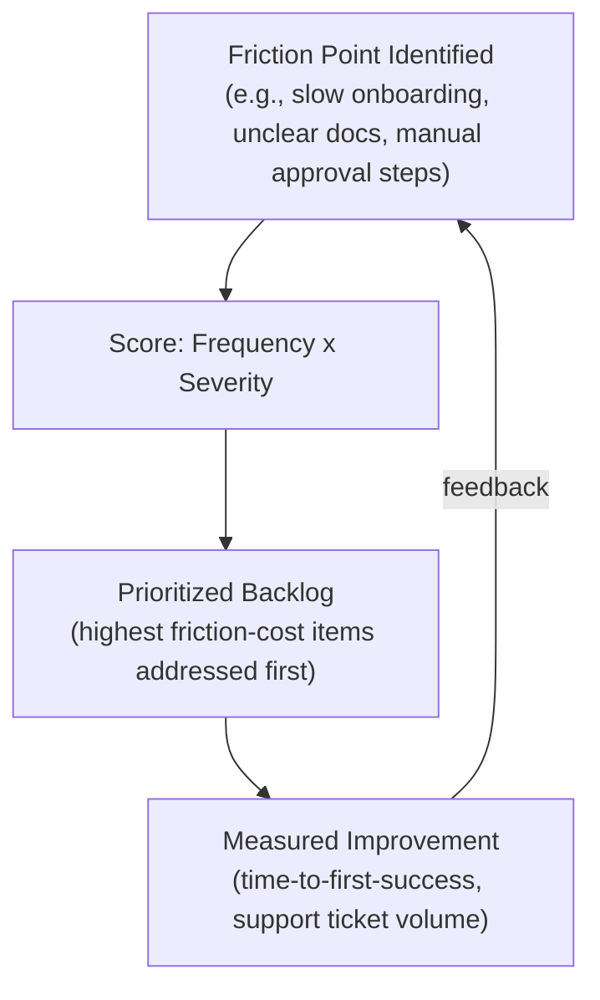

# Lesson 69: Internal Platforms and Developer Experience (DevEx) as a Product

## Why This Lesson Matters

Every lesson in Module 7 so far has treated the platform's "customer" as an external party — a third-party developer, a marketplace participant, an outside integrator. This lesson turns the same lens inward. An internal platform — the shared infrastructure, tooling, and services a company's own engineering organization builds so that individual product teams don't each have to solve deployment, authentication, data storage, or monitoring from scratch — is still a platform in every sense this module has developed, with one crucial difference: its Layer 2 Developer Surface, per the Leverage Stack from Lesson 61, serves internal engineers rather than external ones.

This difference is easy to underestimate, and underestimating it is exactly what causes internal platforms to fail in a specific, recurring way. Because internal platform teams and their "customers" work for the same company, it's tempting to assume goodwill and organizational alignment will substitute for the product discipline an external-facing platform would require — that internal engineers will simply tolerate a clunky onboarding process, sparse documentation, or slow support responses, because, after all, they're all on the same team. This assumption is usually wrong, and the consequence is not that internal engineers complain and comply anyway; it's that they quietly build their own workarounds, duplicating effort across the company and undermining the very consolidation the internal platform was built to achieve.

This lesson introduces the Friction Ledger, this lesson's core mental model, to give you a systematic way to treat internal developer experience with the same product rigor Module 7 has applied to external developers and marketplace participants throughout.

---

## Learning Path

| Field | Detail |
|---|---|
| **Module** | 7 — Platform, Technical & Data-Intensive Product Management |
| **Current Lesson** | 69 of 90 |
| **Difficulty** | 6 / 10 |
| **Estimated Study Time** | 40 minutes (reading) + 15 minutes (reflection + quiz) |
| **Prerequisites** | Lesson 61 (Leverage Stack), Lesson 62 (API as a promise, Promise Tiers), Module 4's Product Ops Multiplier Layer (Lessons 31–40) |
| **Next Lesson** | Lesson 70 — Module Synthesis: The Platform PM's Toolkit |
| **Future Topics Unlocked** | Lesson 70 (Module Synthesis), Lesson 78 (Build, Buy, or Partner), Lesson 88 (Building and Scaling a Product Organization) — all depend on the Friction Ledger and internal-platform-as-product discipline introduced here |

---

## Learning Objectives

By the end of this lesson, you will be able to:

1. Explain why internal platforms require the same product discipline as external-facing platforms, despite serving colleagues rather than outside parties.
2. Apply the Friction Ledger to catalog and prioritize developer experience improvements systematically.
3. Identify the "shadow platform" failure mode and explain why it is the characteristic symptom of a neglected internal platform.
4. Describe at least two concrete metrics for measuring internal developer experience.
5. Evaluate an internal platform team's roadmap for whether it is being treated as a genuine product with real customers, or as an under-resourced internal utility.

---

## Prerequisites

This lesson assumes the Leverage Stack from Lesson 61 and the API-as-promise and Promise Tiers concepts from Lesson 62, applied here to an internal rather than external Developer Surface, and a general familiarity with the Product Ops Multiplier Layer introduced in Module 4 (Lessons 31–40), since internal platforms are one of the clearest instances of that multiplier concept in practice.

---

## Theory

### Internal Platforms Are Still Platforms

An internal platform team's "customers" are the company's own product engineering teams, and the platform's core value proposition is identical in structure to any external platform covered in this module: it should make it easier, faster, and safer for those customers to build the things they need to build, without each of them separately solving the same underlying infrastructure problem. This means every concept from Lessons 61 and 62 applies directly: the internal platform occupies Layer 1 (its own core capability) and Layer 2 (the APIs, tools, and self-service interfaces internal teams use to build on it), and its Layer 2 surface is just as much a promise, in the sense introduced in Lesson 62, as any external-facing API — internal teams build production systems on top of internal platform commitments just as external developers do on external ones.

### Why the "We're All Colleagues" Assumption Fails

The tempting but mistaken internal-platform assumption is that shared employment and organizational alignment substitute for genuine product quality — that internal engineers, unlike external developers who might simply choose a competitor, have no alternative but to use the internal platform, however rough its edges. This assumption fails because internal engineers do, in fact, have an alternative: building their own version of the capability themselves, entirely outside the internal platform, if the platform's friction exceeds the perceived cost of reinventing the wheel. Unlike an external developer choosing a competing platform, an internal team building a workaround imposes no visible switching cost on the platform team at all — the workaround simply appears, quietly, on another team's roadmap, invisible to the platform team unless someone happens to notice the duplication.

### The Friction Ledger

This lesson introduces the **Friction Ledger**, a systematic catalog of every point of friction internal engineers experience when trying to use a platform capability, scored by frequency and severity to prioritize investment the same way a product team prioritizes a feature backlog.

The discipline of the Friction Ledger is treating internal developer friction with the same seriousness and systematic tracking a product team would apply to external user friction — not relying on informal complaints or assuming that silence indicates satisfaction, since, per the shadow platform failure mode below, silence can just as easily indicate that internal teams have simply stopped bothering to complain and have quietly built around the problem instead.

### The Shadow Platform Failure Mode

A **shadow platform** emerges when internal teams, frustrated by an official internal platform's friction, build and maintain their own parallel version of a capability the platform was meant to provide centrally. This is the internal-platform equivalent of the ecosystem collapse discussed in Lesson 61's cross-side network effect discussion — except that here, the "exit" available to a frustrated internal team costs the company real, duplicated engineering effort, fragmented tooling, and inconsistent practices across teams, all without ever generating the kind of visible complaint that would alert leadership to the underlying platform problem. Shadow platforms are the characteristic symptom of a neglected internal Developer Surface, and their existence is often the first concrete evidence that an internal platform's Friction Ledger has never been seriously maintained.

### Measuring Internal Developer Experience

Concrete metrics for internal DevEx include **time-to-first-success** (how long it takes a new team, or a new engineer, to complete a first meaningful task using the platform), **support ticket volume and resolution time** (a proxy for ongoing friction, analogous to the support channel criterion from the Platform Readiness Checklist in Lesson 61), and periodic **internal developer satisfaction surveys**, treated with the same rigor as an external customer satisfaction measurement rather than dismissed as a soft, unquantifiable concern.

---

## Common Beginner Mistakes

**Mistake 1: Assuming internal engineers will tolerate friction because they have "no choice" but to use the internal platform**

Internal teams do have a choice — building their own workaround — and that choice imposes real, often invisible, costs on the company.

**Mistake 2: Relying on the absence of complaints as evidence of a healthy internal platform**

Silence can indicate that frustrated teams have simply stopped engaging and built around the problem instead of raising it.

**Mistake 3: Treating internal platform investment as a cost center to be minimized rather than a product with real leverage**

Underinvesting in internal DevEx multiplies friction across every team that depends on the platform, a cost that scales with the size of the engineering organization.

**Mistake 4: Never measuring internal developer experience quantitatively**

Without metrics like time-to-first-success or support ticket trends, an internal platform team has no systematic way to know whether friction is improving or worsening over time.

**Mistake 5: Failing to notice shadow platforms until duplication has already become extensive**

A shadow platform that has existed quietly for a year, with its own maintenance burden and inconsistent practices, is far more expensive and disruptive to unwind than one caught early through active monitoring for duplicated effort.

---

## Mental Model: The Friction Ledger

The Friction Ledger introduced above is this lesson's core takeaway tool. An internal platform team should maintain a living answer to:

1. **What are the specific, named friction points internal engineers currently experience**, rather than a vague sense that "things could be smoother"?
2. **How frequently does each friction point occur, and how severe is its impact when it does**, so that investment can be prioritized systematically rather than by whichever complaint was loudest or most recent?
3. **Is time-to-first-success, support ticket volume, or another concrete metric actually improving as friction points are addressed**, providing evidence the Ledger's prioritization is working?
4. **Is anyone actively watching for shadow platforms emerging elsewhere in the organization**, since their appearance is direct evidence of unaddressed friction the Ledger may have missed?

An internal platform team that maintains a genuine, actively-used Friction Ledger treats its internal engineers with the same product rigor this module has argued external developers deserve — and is far less likely to discover, belatedly, that half the company quietly built its own version of what the platform was supposed to provide.

---

## Real Company Example

**Microsoft Research's SPACE framework**, published in *ACM Queue* in 2021, is a directly citable, peer-reviewed example of exactly the discipline this lesson describes — internal developer experience measured with product-level rigor rather than treated as an afterthought. The paper, co-authored by Microsoft Research scientists Chandra Maddila, Thomas Zimmermann, Brian Houck, and Jenna Butler alongside GitHub's Nicole Forsgren and University of Victoria's Margaret-Anne Storey, argues explicitly against the instinct to reduce developer productivity to one convenient metric (like lines of code or commit count), proposing instead five deliberately distinct dimensions to measure together: Satisfaction and well-being, Performance, Activity, Communication and collaboration, and Efficiency and flow. The paper's own stated motivation is direct: reducing developer productivity to a single dimension produces "pervasive and potentially harmful myths" that can lead organizations to optimize for the wrong thing — for instance, maximizing individual coding "flow" by minimizing interruptions can look like a pure productivity win while quietly degrading a team's ability to collaborate and review each other's work.

This is a sharper illustration than a generic "companies invest in DevEx" claim because it's the actual measurement framework, developed and published by the company's own research organization, rather than an inference about internal culture from outside commentary — a genuine instance of a large engineering organization treating "is our internal developer experience good?" as a question worth rigorous, multidimensional research rather than gut feeling.

*(Source: "The SPACE of Developer Productivity," published in ACM Queue, Vol. 19, February 2021, and Microsoft's own official research publication listing.)*

---

## Real World Perspective: Internal Platforms and Developer Experience (DevEx) as a Product at Different Company Stages

**Startup:** Early-stage companies typically have too few engineers and too little infrastructure complexity to justify a dedicated internal platform team, and informal, ad hoc tooling shared through direct communication is often an entirely reasonable substitute at this scale — though the shadow platform risk begins to emerge the moment the engineering organization grows large enough that not everyone can informally coordinate anymore.

**Mid-size company:** This is typically where dedicated internal platform teams first emerge as a distinct function, and where the temptation to treat this new team as a pure cost center, judged solely on infrastructure cost savings rather than genuine developer productivity impact, can lead directly to the friction and shadow platform risks this lesson describes.

**Big Tech:** Large organizations typically treat internal platform and developer experience investment as a first-class product discipline, with dedicated product management roles explicitly focused on internal developer experience, measured with the same rigor — user research, satisfaction surveys, usage analytics — applied to any external-facing product.

---

## Detailed Case Study: The Duplicated Deployment Pipeline

A mid-size technology company's central platform team built and maintained an internal deployment pipeline meant to be used by every product engineering team in the company, replacing dozens of previously bespoke, team-specific deployment processes. The pipeline's initial version, however, required a lengthy manual approval process for any new service onboarding, sparse and frequently outdated documentation, and a support channel that took, on average, several days to respond to onboarding questions.

Two product engineering teams, each independently facing time pressure on their own roadmaps and finding the official pipeline's onboarding friction too costly relative to their own deadlines, quietly built their own lightweight deployment scripts to bypass the central pipeline entirely, each unaware the other had done the same. Neither team filed a complaint with the platform team, since raising the issue and waiting for a fix felt slower than simply working around it directly. The central platform team, seeing no formal complaints and observing generally growing usage numbers from other teams, had no direct signal that two of its supposed primary use cases had quietly opted out and built parallel infrastructure of their own.

The duplication was only discovered nearly a year later, during a company-wide security audit, when the audit team found two entirely separate, undocumented deployment mechanisms operating outside the central pipeline's monitoring and security controls — creating both a maintenance burden neither original team had budgeted for and a genuine security blind spot the central platform team had been specifically created to eliminate.

**What went wrong?** Using the Friction Ledger, the failure is precise: the platform team had no systematic mechanism for cataloging and prioritizing friction points (the slow approval process, poor documentation, sluggish support) and no active monitoring for shadow platforms emerging elsewhere in the organization. The absence of formal complaints was mistakenly read as evidence of health, when it was actually evidence that frustrated teams had quietly exited rather than engaged — exactly the failure mode this lesson's Theory section warns against.

The company's recovery involved instituting a formal Friction Ledger process with regular internal developer satisfaction surveys, measuring time-to-first-success for new service onboarding explicitly, and establishing a lightweight, recurring audit specifically designed to detect emerging shadow infrastructure before it becomes deeply entrenched — a monitoring discipline this curriculum will connect to the broader Module 7 synthesis in Lesson 70.

---

## Framework Explanation: The DevEx Investment Checklist

Before considering an internal platform "done" or adequately resourced, a PM can use the following checklist:

| Checklist Item | Question to Ask | Risk if Skipped |
|---|---|---|
| Time-to-First-Success Measured | Is there a concrete metric for how long onboarding actually takes a new team? | Onboarding friction persists invisibly, with no data to prioritize fixing it |
| Documentation Currency | Is documentation actively maintained and verified against the platform's current state? | Outdated docs become a friction point in themselves, as in the Case Study |
| Support Responsiveness | Is there a defined, monitored response-time target for internal support requests? | Slow support responses push teams toward self-service workarounds |
| Satisfaction Surveyed | Is internal developer satisfaction measured periodically with the same rigor as external customer satisfaction? | Silence gets misread as satisfaction rather than quiet disengagement |
| Shadow Platform Monitoring | Is there an active process for detecting duplicated infrastructure elsewhere in the organization? | Shadow platforms can persist undetected for a long time, as in the Case Study |

A "no" on Shadow Platform Monitoring in particular should be treated as a significant blind spot, since, as the Case Study shows, this specific failure mode tends to remain invisible until discovered by chance or during an unrelated audit.

---

## Interview Perspective: How Interviewers Think About This

**"How would you approach building an internal platform for other engineering teams to use?"** The interviewer is evaluating whether you treat internal engineers as genuine product customers, with friction-tracking and satisfaction measurement, rather than assuming organizational alignment alone will ensure adoption.

**"What's the risk of an internal platform team having very few complaints from the teams it serves?"** The interviewer is testing whether you recognize that low complaint volume can indicate quiet disengagement and shadow platform formation, rather than assuming it always signals genuine satisfaction.

**"Tell me about a time you had to convince a team to use a shared internal tool instead of building their own."** The interviewer is listening for recognition that adoption requires reducing genuine friction, per the Friction Ledger discipline, rather than relying on organizational mandate alone to overcome a poor developer experience.

---

## Summary

Internal platforms are structurally identical to external-facing platforms in the sense developed throughout Module 7, but the tempting assumption that shared employment substitutes for genuine product quality is mistaken, because internal engineers facing excessive friction have a real, low-visibility alternative: quietly building their own workaround rather than engaging with or complaining about the official platform. The Friction Ledger provides a systematic way to catalog and prioritize internal developer experience friction with the same product rigor applied to external users throughout this module, using concrete metrics like time-to-first-success and support ticket trends rather than relying on the absence of complaints as evidence of health. The shadow platform failure mode — parallel, duplicated infrastructure quietly built by frustrated internal teams — is the characteristic symptom of a neglected internal Developer Surface, and it is dangerous precisely because it tends to remain invisible to the platform team until discovered by chance, often at a point where the duplication has already become costly and entrenched. Treating internal developer experience as a genuine product discipline, with active friction tracking and shadow platform monitoring, is the specific defense against this recurring and often silent failure mode.

---

## Key Takeaways

- Internal platforms require the same product discipline as external-facing platforms, despite serving colleagues rather than outside parties.
- The assumption that shared employment substitutes for genuine product quality is mistaken, since internal teams can quietly build workarounds instead of engaging with a frustrating platform.
- The Friction Ledger catalogs and prioritizes internal developer friction points by frequency and severity, treated with the same rigor as an external product backlog.
- A shadow platform — duplicated, parallel infrastructure built by frustrated internal teams — is the characteristic symptom of a neglected internal Developer Surface.
- The absence of formal complaints should never be mistaken for evidence of a healthy internal platform, since silence can indicate quiet disengagement rather than satisfaction.
- Concrete metrics like time-to-first-success, support ticket volume, and internal satisfaction surveys are necessary to measure internal developer experience systematically.
- Active monitoring for shadow platforms is necessary specifically because this failure mode tends to remain invisible until discovered by chance.

---

## Cheat Sheet

*A two-minute review of everything in this lesson.*

- Internal platforms are still platforms. Treat internal engineers as real customers.
- "We're all colleagues" doesn't prevent workarounds — it just makes them invisible.
- Friction Ledger: catalog friction points, score by frequency x severity, prioritize like a backlog.
- No complaints ≠ healthy platform. It might mean quiet disengagement and shadow platforms.
- Measure time-to-first-success, support responsiveness, and satisfaction — don't rely on silence as a signal.

---

## Glossary

| Term | Definition | Related Concepts | Difficulty |
|---|---|---|---|
| Internal Platform | Shared infrastructure, tooling, or services built for a company's own engineering teams | Leverage Stack (Lesson 61) | 1 |
| Friction Ledger | A systematic catalog of internal developer friction points, scored by frequency and severity | DevEx Investment Checklist | 2 |
| Shadow Platform | Parallel, duplicated infrastructure quietly built by internal teams frustrated with an official platform | Friction Ledger | 2 |
| Time-to-First-Success | A metric measuring how long it takes a new team or engineer to complete a first meaningful task on a platform | DevEx Investment Checklist | 2 |
| DevEx (Developer Experience) | The overall experience internal engineers have using a platform's tools and processes | Friction Ledger | 1 |
| DevEx Investment Checklist | A five-item checklist assessing whether an internal platform is being resourced as a genuine product | Friction Ledger | 2 |

---

## Further Reading / Resources

- Matthew Skelton and Manuel Pais, *Team Topologies*
- Nicole Forsgren, Jez Humble, and Gene Kim, *Accelerate*
- Mauricio Salatino, *Platform Engineering on Kubernetes*

---

## Flashcards

**Card 1**
- Front: Why do internal platforms require the same product discipline as external-facing platforms?
- Back: Their Layer 2 Developer Surface, per the Leverage Stack, serves internal engineers just as an external platform's serves outside developers — the same promise and friction dynamics apply.
- Difficulty: 2
- Tags: internal-platforms, core-concept

**Card 2**
- Front: Why does the "we're all colleagues" assumption fail for internal platforms?
- Back: Internal engineers do have an alternative to tolerating friction — quietly building their own workaround — which imposes real, often invisible costs on the company.
- Difficulty: 2
- Tags: shadow-platform

**Card 3**
- Front: What is a shadow platform?
- Back: Parallel, duplicated infrastructure built by internal teams frustrated with an official internal platform's friction, usually without formally complaining first.
- Difficulty: 2
- Tags: shadow-platform

**Card 4**
- Front: Why is the absence of complaints not reliable evidence of a healthy internal platform?
- Back: Silence can indicate that frustrated teams have quietly disengaged and built around the problem instead of raising it.
- Difficulty: 2
- Tags: friction-ledger

**Card 5**
- Front: What went wrong in the Duplicated Deployment Pipeline case study?
- Back: Two teams independently built workaround deployment scripts due to onboarding friction, with no formal complaint, and the duplication went undetected for nearly a year until a security audit found it.
- Difficulty: 2
- Tags: case-study, shadow-platform

**Card 6**
- Front: Name two concrete metrics for measuring internal developer experience.
- Back: Time-to-first-success and support ticket volume/resolution time (plus periodic satisfaction surveys).
- Difficulty: 2
- Tags: devex-metrics

**Card 7**
- Front: What should an internal platform team actively monitor for, beyond just tracking friction points?
- Back: The emergence of shadow platforms elsewhere in the organization, since their appearance is direct evidence of unaddressed friction.
- Difficulty: 2
- Tags: shadow-platform-monitoring

## Reflection Exercise

You are the PM for a central internal data-platform team at a mid-size company. You've just learned, informally through a hallway conversation, that one product team has been maintaining its own separate data pipeline for the past six months rather than using your platform, and you suspect there may be other similar cases you don't know about yet.

There is no single correct answer to the prompts below — the goal is to practice applying the Friction Ledger and the shadow platform concept to a suspected but not yet confirmed situation.

1. What steps would you take to investigate whether other teams have built similar shadow infrastructure, beyond relying on informal conversations?
2. What questions would you ask the team maintaining their own pipeline to understand the specific friction points that drove their decision?
3. How would you build a Friction Ledger from this single discovered case, and what would you prioritize investigating first?
4. What metrics would you start tracking going forward to catch similar situations earlier next time?
5. How would you approach the conversation with the team that built the shadow pipeline, given that publicly framing it as a "failure" on their part could discourage future transparency from other teams?

---

## Quiz

**1. Why do internal platforms require the same product discipline as external-facing platforms?**
A) Internal platforms have no meaningful Developer Surface
B) Their Layer 2 Developer Surface serves internal engineers just as an external platform's serves outside developers, with the same underlying promise and friction dynamics
C) Internal platforms never have any real "customers"
D) Product discipline is only relevant for consumer-facing products

*Correct answer: B*
*Explanation: The lesson explicitly extends the Leverage Stack's Layer 2 concept from Lesson 61 to internal platforms, treating internal engineers as genuine platform customers.*
*Learning objective tested: #1*
*Difficulty: Easy*

---

**2. Why does the assumption "internal engineers have no choice but to use our platform" fail?**
A) Internal engineers are legally required to use only officially sanctioned tools
B) Internal engineers do have an alternative — building their own workaround — which imposes real, often invisible costs on the company
C) This assumption never actually occurs in practice
D) Internal platforms are always mandatory by company policy with no exceptions

*Correct answer: B*
*Explanation: The lesson's central point is that internal teams can and do build workarounds when friction exceeds the perceived cost of doing so.*
*Learning objective tested: #1, #3*
*Difficulty: Easy*

---

**3. What is a shadow platform?**
A) A backup system maintained by the official platform team
B) Parallel, duplicated infrastructure quietly built by internal teams frustrated with an official platform's friction
C) A publicly documented alternative tool officially sanctioned by leadership
D) A feature of the official internal platform used for testing purposes

*Correct answer: B*
*Explanation: Shadow platforms are specifically unofficial, quietly-built duplicates arising from unaddressed internal friction.*
*Learning objective tested: #3*
*Difficulty: Easy*

---

**4. Why is the absence of formal complaints not reliable evidence of a healthy internal platform?**
A) Complaints are always filed immediately regardless of platform quality
B) Silence can indicate that frustrated teams have quietly disengaged and built around the problem instead of raising it
C) Formal complaint systems are technically incapable of tracking internal platform issues
D) The absence of complaints always indicates genuine satisfaction

*Correct answer: B*
*Explanation: The lesson explicitly warns against reading low complaint volume as evidence of health, given the shadow platform risk.*
*Learning objective tested: #3, #5*
*Difficulty: Easy*

---

**5. What is "time-to-first-success" a measure of?**
A) The total revenue generated by an internal platform
B) How long it takes a new team or engineer to complete a first meaningful task using the platform
C) The number of internal support tickets filed per month
D) The uptime percentage of the platform's infrastructure

*Correct answer: B*
*Explanation: This metric specifically measures onboarding friction from the perspective of a new user of the internal platform.*
*Learning objective tested: #4*
*Difficulty: Easy*

---

**6. In the Case Study, why didn't the platform team know two teams had built workaround deployment scripts?**
A) The workaround teams filed detailed complaints that were ignored
B) Neither team filed a formal complaint, and the platform team had no active monitoring process to detect duplicated infrastructure elsewhere in the organization
C) The platform team deliberately chose to ignore known workarounds
D) The workarounds were publicly announced but no one at the platform team noticed

*Correct answer: B*
*Explanation: The absence of complaints combined with no active shadow-platform monitoring meant the duplication went undetected for nearly a year.*
*Learning objective tested: #3, #5*
*Difficulty: Easy*

---

**7. What ultimately revealed the duplicated deployment pipelines in the Case Study?**
A) A routine internal satisfaction survey
B) A company-wide security audit that found undocumented deployment mechanisms outside the central pipeline's controls
C) The two teams voluntarily disclosed their workarounds to the platform team
D) The official platform's usage metrics directly flagged the duplication

*Correct answer: B*
*Explanation: The duplication was discovered by chance during an unrelated security audit, illustrating how invisible this failure mode can be without active monitoring.*
*Learning objective tested: #3, #5*
*Difficulty: Medium*

---

**8. According to the DevEx Investment Checklist, what does a "no" on Shadow Platform Monitoring indicate?**
A) A minor and inconsequential gap
B) A significant blind spot, since this specific failure mode tends to remain invisible until discovered by chance
C) That the platform is definitely free of any duplicated infrastructure
D) That shadow platforms are not a genuine risk for well-run organizations

*Correct answer: B*
*Explanation: The lesson explicitly treats this as a significant, often-overlooked risk given how the Case Study's duplication went undetected for so long.*
*Learning objective tested: #5*
*Difficulty: Medium*

---

**9. Why might early-stage startups reasonably rely on informal, ad hoc internal tooling rather than a dedicated internal platform?**
A) Startups are legally prohibited from having internal platforms
B) Too few engineers and too little infrastructure complexity typically exist to justify a dedicated internal platform team at this stage
C) Internal platforms are only relevant for companies with over ten thousand employees
D) Informal tooling is always superior to dedicated internal platforms regardless of scale

*Correct answer: B*
*Explanation: The Real World Perspective section describes this as a reasonable trade-off at small scale, with risk emerging as the organization grows.*
*Learning objective tested: #1*
*Difficulty: Medium*

---

**10. What risk does the Real World Perspective section identify for mid-size companies with newly formed internal platform teams?**
A) Mid-size companies never form dedicated internal platform teams
B) Treating the new team as a pure cost center, judged solely on infrastructure savings rather than genuine developer productivity impact
C) Internal platform teams at this stage are always adequately resourced by default
D) Mid-size companies face no shadow platform risk whatsoever

*Correct answer: B*
*Explanation: The Real World Perspective section specifically identifies this cost-center framing as a driver of the friction and shadow platform risks described in the lesson.*
*Learning objective tested: #1, #5*
*Difficulty: Medium*

---

**11. What do mature, Big Tech-scale organizations typically do regarding internal developer experience, per the Real World Perspective section?**
A) Treat it as an unmeasurable, purely qualitative concern
B) Treat it as a first-class product discipline with dedicated PM roles and rigor comparable to external-facing products
C) Eliminate internal platform teams entirely in favor of fully decentralized tooling
D) Rely exclusively on informal feedback with no dedicated measurement

*Correct answer: B*
*Explanation: The Real World Perspective section describes dedicated internal DevEx product management and rigorous measurement as characteristic of mature organizations.*
*Learning objective tested: #4, #5*
*Difficulty: Medium*

---

**12. (Scenario) An internal platform team notices unusually low support ticket volume and interprets this as strong evidence of a healthy platform. What alternative explanation should this lesson prompt them to consider?**
A) Low ticket volume always and exclusively indicates genuine platform health
B) Low ticket volume could indicate that frustrated teams have quietly disengaged and built their own workarounds rather than engaging with support
C) Ticket volume is entirely unrelated to platform friction
D) This pattern is impossible to interpret without additional context of any kind

*Correct answer: B*
*Explanation: This mirrors the lesson's central warning against mistaking silence for satisfaction, given the shadow platform risk.*
*Learning objective tested: #3, #5*
*Difficulty: Medium-Hard*

---

**13. (Product Thinking) A platform team wants to prioritize which of several known friction points to address first. Using the Friction Ledger, what is the correct basis for prioritization?**
A) Whichever complaint was most recently received
B) A systematic score combining frequency and severity of each friction point, similar to prioritizing a product backlog
C) Alphabetical order of the friction points as documented
D) Exclusively the preferences of the most senior engineer on the platform team

*Correct answer: B*
*Explanation: The Friction Ledger explicitly prioritizes using a frequency-times-severity score, analogous to systematic product backlog prioritization.*
*Learning objective tested: #2*
*Difficulty: Hard*

---

**14. (Interview Reasoning) A candidate, asked about building an internal platform, states that adoption will happen naturally because using the shared platform is company policy. What does this most likely signal, per the Interview Perspective section?**
A) A sound and complete understanding of internal platform adoption dynamics
B) A failure to recognize that policy mandates alone don't prevent shadow platforms from forming when genuine friction exists
C) That the candidate is ready for a senior internal platform leadership role immediately
D) Nothing meaningful; policy mandates are always sufficient to ensure adoption

*Correct answer: B*
*Explanation: The Interview Perspective section specifically flags reliance on organizational mandate, rather than genuine friction reduction, as an incomplete understanding of adoption.*
*Learning objective tested: #1, #5*
*Difficulty: Hard*

---

**15. (Product Thinking, Highest Difficulty) A PM suspects, based on an informal hallway conversation, that at least one team has built shadow infrastructure to bypass their internal platform, and worries there may be additional undiscovered cases. Using only the frameworks in this lesson, what is the most defensible next step?**
A) Wait for formal complaints before taking any action, since informal information is not reliable enough to act on
B) Proactively investigate the scope of potential shadow infrastructure across teams, build a Friction Ledger from confirmed cases, and institute ongoing metrics and monitoring to catch similar situations earlier in the future
C) Publicly reprimand the team known to have built the workaround to discourage similar behavior elsewhere
D) Assume the single known case is an isolated incident with no broader implications for the platform's health

*Correct answer: B*
*Explanation: This mirrors the Reflection Exercise: the correct response neither waits passively nor punishes the discovered team, but proactively investigates, builds systematic tracking, and improves ongoing monitoring.*
*Learning objective tested: #2, #3, #5*
*Difficulty: Hard*

---

## Connections

| | Lesson | Core Idea Carried Forward |
|---|---|---|
| **Previous Lesson** | Lesson 68 — Technical Debt at Scale: Platform Migrations and Deprecations | Extends dependency-inventory discipline to the internal case, where undiscovered shadow platforms are the internal-facing analog of hidden external dependents |
| **Current Lesson** | Lesson 69 — Internal Platforms and Developer Experience (DevEx) as a Product | Friction Ledger; shadow platform failure mode; internal DevEx metrics; DevEx Investment Checklist |
| **Next Lesson** | Lesson 70 — Module Synthesis: The Platform PM's Toolkit | Consolidates the Leverage Stack, Promise Tiers, Two-Sided Balance Model, Metric Provenance Chain, Ownership Zones Model, Discovery Frontier, Escalation Staircase, Sunset Runway, and Friction Ledger into a single integrated toolkit |
| **Future Concepts Unlocked** | Lesson 78 (Build, Buy, or Partner) | Uses internal platform investment and friction cost as a consideration in build-versus-buy decisions |
| | Lesson 88 (Building and Scaling a Product Organization) | Extends internal-platform-as-product thinking into broader questions of organizational design and multiplier functions |

This curriculum continues to build as one continuous argument. From this lesson forward, any reference to an internal tool or platform assumes you can evaluate it through the Friction Ledger without re-explanation.
