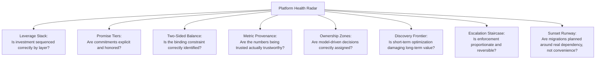

# Lesson 70: Module Synthesis: The Platform PM's Toolkit

## Why This Lesson Matters

Module 7 has introduced eight distinct mental models across nine lessons: the Leverage Stack (Lesson 61), Promise Tiers (Lesson 62), the Two-Sided Balance Model (Lesson 63), the Metric Provenance Chain (Lesson 64), the Ownership Zones Model (Lesson 65), the Discovery Frontier (Lesson 66), the Escalation Staircase (Lesson 67), the Sunset Runway (Lesson 68), and the Friction Ledger (Lesson 69). Each was introduced to solve a specific, narrow problem — where does a platform investment belong, what promise does an API make, which side of a marketplace is constrained, whether a metric deserves trust, who owns a model decision, how a recommender should balance exploration, how enforcement should escalate, how a migration should be sequenced, how internal friction should be tracked.

In real platform work, problems rarely announce which single model applies. A declining third-party developer ecosystem could be a Leverage Stack sequencing failure, a broken Promise Tier commitment, a governance trust failure, or some combination of all three simultaneously — and a PM who only knows how to apply one model at a time, in isolation, will often diagnose only part of what's actually happening. This closing lesson of Module 7 does not introduce new theory in the way the previous nine lessons did. Instead, it does something this curriculum's Lesson 60 capstone modeled for the foundational six modules: it consolidates the module's separate tools into a single, integrated diagnostic practice, so that when you encounter a real platform problem in the future, you reach for the right combination of models rather than forcing a single lens onto a multi-dimensional problem.

---

## Learning Path

| Field | Detail |
|---|---|
| **Module** | 7 — Platform, Technical & Data-Intensive Product Management |
| **Current Lesson** | 70 of 90 |
| **Difficulty** | 7 / 10 |
| **Estimated Study Time** | 45 minutes (reading) + 20 minutes (reflection + quiz) |
| **Prerequisites** | Lesson 61 (Platform Thinking: Products, Platforms, and Ecosystems), Lesson 62 (APIs as Products: Designing for Developers), Lesson 63 (Two-Sided Marketplaces and Network Effects), Lesson 64 (Data-Informed Product Management: Building a Metrics Culture), Lesson 65 (Working with Data Science & ML Teams), Lesson 66 (Recommender Systems and Personalization for PMs), Lesson 67 (Platform Governance: Trust, Safety, and Abuse Prevention), Lesson 68 (Technical Debt at Scale: Platform Migrations and Deprecations), Lesson 69 (Internal Platforms and Developer Experience (DevEx) as a Product) |
| **Next Lesson** | Lesson 71 — Product Strategy Frameworks: From Vision to Bets |
| **Future Topics Unlocked** | Lesson 78 (Build, Buy, or Partner), Lesson 84 (PM in AI-Native Companies), Lesson 85 (Responsible AI Product Management), Lesson 90 (Capstone) — all draw on this integrated Module 7 toolkit as established canon |

---

## Learning Objectives

By the end of this lesson, you will be able to:

1. Recall and correctly name all eight mental models introduced across Module 7, and the specific diagnostic question each answers.
2. Apply the Platform Health Radar to assess a platform holistically across all eight dimensions simultaneously.
3. Use the Cross-Lesson Diagnostic Protocol to determine which combination of models applies to an ambiguous, multi-faceted platform problem.
4. Explain how the eight models interconnect, rather than treating them as a disconnected checklist.
5. Evaluate a complex platform scenario by correctly identifying which model or models are the primary diagnostic lens, and which are secondary.

---

## Prerequisites

This lesson assumes fluency with all nine preceding lessons of Module 7 (Lessons 61–69) and the mental models, frameworks, and case studies each introduced. Rather than introducing new prerequisite material, this lesson's purpose is to integrate what those nine lessons already established.

---

## Theory

### Why Integration, Not Addition, Is the Point

A PM who has memorized eight separate models but always applies exactly one to any given problem has not yet developed platform judgment — they have developed eight narrow reflexes. Platform judgment means recognizing that most real problems are multi-dimensional, and that the first diagnostic task is often determining *which combination* of models is actually relevant, not simply picking the model whose name sounds closest to the symptom being observed.

### The Platform Health Radar

This lesson introduces the **Platform Health Radar**, a single integrating tool that assesses a platform across all eight Module 7 dimensions at once, rather than one at a time:

A ninth axis, the **Friction Ledger**, applies this same radar internally — asking whether the company's own engineering teams experience the platform with the same rigor external assessment would apply. The Platform Health Radar's discipline is running through all nine questions whenever a platform problem surfaces, rather than stopping at the first model that seems to fit, since real incidents — as this lesson's Case Study will show — are frequently the product of failures across more than one axis simultaneously.

### The Cross-Lesson Diagnostic Protocol

When a platform symptom is observed — declining developer engagement, a damaging incident, an unexpected metric trend — this lesson recommends a **Cross-Lesson Diagnostic Protocol** with a deliberate order of investigation:

1. **Locate the layer** (Leverage Stack, Lesson 61): is the symptom occurring at the Core Product, Developer Surface, Marketplace, or Ecosystem layer?
2. **Check the promise** (Promise Tiers, Lesson 62): has an explicit or implicit commitment to developers or partners been broken?
3. **Check the balance** (Two-Sided Balance Model, Lesson 63, where applicable): if a marketplace is involved, which side is actually constrained?
4. **Check the metric** (Metric Provenance Chain, Lesson 64): is the data being used to diagnose the problem itself trustworthy?
5. **Check ownership** (Ownership Zones Model, Lesson 65, where a model is involved): were error costs and business context correctly specified before the model was built?
6. **Check the horizon** (Discovery Frontier, Lesson 66, and long-horizon monitoring generally): could a short-term-optimized system be causing long-term damage invisible to daily metrics?
7. **Check enforcement proportionality** (Escalation Staircase, Lesson 67, where governance is involved): was any enforcement action proportionate, reversible, and appealable?
8. **Check migration discipline** (Sunset Runway, Lesson 68, where a change or deprecation is involved): was dependency genuinely inventoried, or assumed?
9. **Check internal friction** (Friction Ledger, Lesson 69): could internal teams be quietly working around the platform rather than raising the issue?

This ordered protocol does not mean every investigation touches all nine steps equally — a well-trained platform PM learns to move quickly past steps that clearly don't apply — but the discipline of *checking* each axis, rather than assuming only one applies from the outset, is what separates genuine platform diagnostic skill from pattern-matching a symptom to the first familiar-sounding model.

### How the Models Interconnect

The nine models are not independent; they form a connected structure. The Leverage Stack (Lesson 61) provides the map on which everything else is located. Promise Tiers (Lesson 62) governs Layer 2 specifically. The Two-Sided Balance Model (Lesson 63) governs Layer 3 specifically, when the platform is a marketplace. The Metric Provenance Chain (Lesson 64) underlies the trustworthiness of any data used to evaluate any other axis. The Ownership Zones Model (Lesson 65) and Discovery Frontier (Lesson 66) both concern model-driven decisions, with the Discovery Frontier being a specific, high-stakes application of Ownership Zones' error-cost logic to ranking and personalization. The Escalation Staircase (Lesson 67) governs Layer 4 (Ecosystem) enforcement specifically, and directly depends on the error-cost reasoning from Lesson 65. The Sunset Runway (Lesson 68) governs the retirement of any Promise Tier commitment, connecting directly back to Lesson 62. The Friction Ledger (Lesson 69) applies the entire structure internally, treating a company's own engineering teams as the platform's Layer 2 customers.

---

## Common Beginner Mistakes

**Mistake 1: Applying only the first model that seems to fit, without checking whether others are also relevant**

Most real platform incidents involve failures across more than one axis, and stopping the diagnosis early misses compounding causes.

**Mistake 2: Treating the eight models as an unordered checklist rather than a connected structure**

Understanding how the models depend on each other (for example, that Promise Tiers specifically governs Layer 2 of the Leverage Stack) produces faster, more accurate diagnosis than treating each model as unrelated to the others.

**Mistake 3: Skipping the Metric Provenance Chain check when diagnosing any other problem**

Any diagnosis built on untrustworthy data, regardless of how sound the reasoning about the other axes is, inherits that foundational error.

**Mistake 4: Forgetting that the Friction Ledger applies internally, not just to external developers**

A PM fluent in Leverage Stack, Promise Tiers, and Escalation Staircase for external ecosystems can still overlook that the same friction dynamics apply to the company's own engineering teams.

**Mistake 5: Assuming platform judgment is complete once all eight models are individually memorized**

Genuine platform judgment is the ability to recognize which combination applies to a novel, real situation — a skill built through practice, not memorization alone.

---

## Mental Model: The Platform Health Radar

The Platform Health Radar introduced above is this lesson's core takeaway tool, synthesizing all of Module 7 into a single integrated diagnostic. When facing any platform problem, however it initially presents, run through the radar's nine axes using the Cross-Lesson Diagnostic Protocol:

1. **Which layer** of the Leverage Stack is implicated?
2. **Has a promise** been broken, explicitly or implicitly?
3. **If a marketplace, which side** is the actual constraint?
4. **Is the underlying data** trustworthy?
5. **Were error costs and ownership** correctly assigned for any model involved?
6. **Is a short-term optimization** damaging long-term value invisibly?
7. **Is enforcement**, if any, proportionate and reversible?
8. **Is any migration** genuinely accounting for real dependency?
9. **Could internal friction** be driving quiet workarounds?

A platform PM who runs this full radar, rather than stopping at the first familiar-sounding symptom, is far better equipped to diagnose the genuinely multi-dimensional problems that characterize real platform work.

---

## Real Company Example

Amazon is a useful synthesis example precisely because its business spans multiple platform types this module has discussed separately: its retail marketplace illustrates the Two-Sided Balance Model (Lesson 63) directly, with sellers and buyers as the two dependent populations; Amazon Web Services illustrates the Leverage Stack and Promise Tiers (Lessons 61–62) through its extensive API versioning and long-term service deprecation policies; and its scale of internal engineering organization makes internal developer platforms and the Friction Ledger (Lesson 69) a genuinely relevant concern, given public commentary describing extensive internal tooling investment to support thousands of internal engineering teams. Public reporting and industry commentary on Amazon's approach across these different platform dimensions illustrates that a single company, even a single product PM's career within that company, may need fluency across several of Module 7's models simultaneously, rather than specializing in only one.

**Assumption flagged:** the specifics of Amazon's internal platform strategy, API governance, and marketplace management described here are drawn from public commentary and industry reporting across multiple sources, not confirmed internal company statements, and should be treated as illustrative rather than verified fact.

---

## Real World Perspective: Module Synthesis: The Platform PM's Toolkit at Different Company Stages

**Startup:** Early-stage platform teams typically encounter only one or two of these eight models as immediately relevant — usually the Leverage Stack and Promise Tiers, since the first platform decisions a startup faces tend to concern whether and how to expose a Developer Surface at all, before marketplace, governance, or migration concerns become pressing.

**Mid-size company:** This is typically where several models become simultaneously relevant for the first time — a growing developer ecosystem raises Promise Tiers and Escalation Staircase concerns together, while growing internal engineering headcount raises Friction Ledger concerns, often within the same period, testing whether a PM can hold multiple frameworks in mind simultaneously rather than addressing them one at a time in isolation.

**Big Tech:** Mature platform organizations typically have dedicated specialists for different axes of this radar — developer relations teams focused on Promise Tiers and API design, trust and safety teams focused on the Escalation Staircase, internal platform teams focused on the Friction Ledger — making the PM's synthesis role less about personally applying every model and more about ensuring the specialized teams are coordinating around a shared, integrated understanding of the platform's overall health.

---

## Detailed Case Study: The Multi-Front Ecosystem Decline

A B2B software platform noticed, over two consecutive quarters, a decline in third-party developer engagement: fewer new integrations submitted to its partner marketplace, several vocal complaints from existing partners on social media, and a slower overall pace of ecosystem growth compared to the prior year. Leadership's initial instinct was to treat this as a single problem requiring a single fix — specifically, a renewed marketing push to attract new developers, on the theory that the ecosystem simply needed more top-of-funnel awareness.

A more thorough investigation using the Cross-Lesson Diagnostic Protocol revealed a more complicated picture. First, the Metric Provenance Chain check (Lesson 64) revealed that the company's own dashboard for "active integrations" had drifted in definition over the prior year, following a platform migration, meaning the reported decline was partly a measurement artifact rather than a purely real trend — though a real decline did exist underneath the artifact once the metric was corrected. Second, the Promise Tiers check (Lesson 62) revealed that a breaking API change had, in fact, been shipped eight months earlier without adequate notice, consistent with the kind of Layer 2 trust failure discussed in that lesson's Case Study, and several of the public partner complaints directly referenced this incident. Third, the Escalation Staircase check (Lesson 67) revealed that the company's fraud-detection system for the partner marketplace had, around the same time, wrongly suspended a small number of legitimate long-standing partners with no functioning appeals process, further damaging trust among exactly the population whose continued participation the ecosystem depended on.

**What went wrong?** Using the Platform Health Radar across multiple axes at once, the true picture was a compounding, multi-front trust failure: a broken Promise Tier commitment (Lesson 62), a governance enforcement failure with no adequate appeals process (Lesson 67), and a metric-definition drift (Lesson 64) that had partially obscured the real scope of the problem from leadership's own dashboards. A marketing-only response, as leadership initially proposed, would have addressed none of these underlying causes and likely worsened the situation by attracting new developers into an ecosystem whose existing trust problems had not yet been fixed.

The company's recovery required addressing all three fronts simultaneously: correcting the metric definition and re-baselining the "active integrations" dashboard, formally apologizing to affected partners for the earlier breaking change with a concrete Layer 2 stability commitment going forward, and overhauling the marketplace's enforcement system with graduated, appealable responses per the Escalation Staircase — illustrating precisely why this lesson's synthesis, rather than any single model in isolation, was necessary to correctly diagnose and resolve the situation.

---

## Framework Explanation: The Cross-Lesson Diagnostic Protocol (Reference Table)

The following table summarizes the nine-step protocol introduced in the Theory section, for quick reference when facing a real platform problem:

| Step | Model | Core Diagnostic Question |
|---|---|---|
| 1 | Leverage Stack (Lesson 61) | Which layer — Core, Developer Surface, Marketplace, Ecosystem — is implicated? |
| 2 | Promise Tiers (Lesson 62) | Has an explicit or implicit commitment been broken? |
| 3 | Two-Sided Balance Model (Lesson 63) | If a marketplace, which side is the binding constraint? |
| 4 | Metric Provenance Chain (Lesson 64) | Is the data used to diagnose this problem itself trustworthy? |
| 5 | Ownership Zones Model (Lesson 65) | Were error costs and business context correctly specified for any model involved? |
| 6 | Discovery Frontier (Lesson 66) | Could short-term optimization be damaging long-term value invisibly? |
| 7 | Escalation Staircase (Lesson 67) | Was any enforcement proportionate, reversible, and appealable? |
| 8 | Sunset Runway (Lesson 68) | Was any migration genuinely dependency-aware, or assumption-based? |
| 9 | Friction Ledger (Lesson 69) | Could internal teams be quietly working around the platform? |

A thorough platform investigation moves through this table deliberately, ruling axes in or out with evidence, rather than stopping at the first plausible-sounding explanation.

---

## Interview Perspective: How Interviewers Think About This

**"Walk me through how you'd investigate a sudden decline in third-party developer engagement on a platform you manage."** The interviewer is evaluating whether you approach this as a potentially multi-dimensional problem, checking multiple axes (broken promises, enforcement issues, metric reliability) rather than jumping to a single explanation and a single fix.

**"How do the concepts of platform layering and API stability relate to each other?"** The interviewer is testing whether you understand the interconnection between the Leverage Stack and Promise Tiers specifically — that Promise Tiers governs Layer 2, and instability there caps everything built on top of it.

**"Tell me about the most complex platform problem you've had to diagnose, and how you approached it."** The interviewer is listening for evidence of genuine synthesis — an investigation that considered and ruled in or out multiple contributing causes — rather than a story where a single framework, applied once, fully explained everything.

---

## Summary

Module 7 introduced eight distinct mental models, plus the Friction Ledger's internal application, each answering a specific diagnostic question about a different aspect of platform health: where an investment belongs (Leverage Stack), what commitment an API makes (Promise Tiers), which side of a marketplace is constrained (Two-Sided Balance Model), whether a metric deserves trust (Metric Provenance Chain), who owns a model-driven decision (Ownership Zones Model), whether short-term optimization is damaging long-term value (Discovery Frontier), whether enforcement is proportionate (Escalation Staircase), whether a migration accounts for real dependency (Sunset Runway), and whether internal teams are experiencing unaddressed friction (Friction Ledger). Real platform problems are frequently multi-dimensional, and the Platform Health Radar, applied through the Cross-Lesson Diagnostic Protocol, provides a disciplined way to check all nine axes rather than stopping at whichever single model first seems to fit a given symptom. The models are not an unordered checklist but a connected structure — Promise Tiers governs Layer 2 of the Leverage Stack specifically, the Two-Sided Balance Model governs Layer 3 when a marketplace is involved, the Discovery Frontier is a specialized application of the Ownership Zones Model's error-cost logic, and the Escalation Staircase depends on that same error-cost reasoning applied to Layer 4 enforcement. Genuine platform judgment is the ability to recognize, in a real and often ambiguous situation, which combination of these tools actually applies — a skill this module has built lesson by lesson, and one this synthesis lesson has now explicitly connected into a single integrated practice.

---

## Key Takeaways

- Module 7 introduced nine interconnected mental models: Leverage Stack, Promise Tiers, Two-Sided Balance Model, Metric Provenance Chain, Ownership Zones Model, Discovery Frontier, Escalation Staircase, Sunset Runway, and Friction Ledger.
- The Platform Health Radar assesses a platform across all nine dimensions simultaneously, rather than applying one model in isolation.
- The Cross-Lesson Diagnostic Protocol provides an ordered approach to investigating an ambiguous platform problem across multiple axes.
- The nine models form a connected structure, not an unordered checklist — for example, Promise Tiers specifically governs Layer 2 of the Leverage Stack.
- Real platform incidents are frequently the product of failures across more than one axis simultaneously, as illustrated by the Multi-Front Ecosystem Decline case study.
- A single-cause diagnosis and a single-lever fix, applied to a genuinely multi-dimensional problem, often fails to resolve the underlying issue and can worsen it.
- Genuine platform judgment is the applied skill of recognizing which combination of models fits a real situation, built through deliberate practice across increasingly complex scenarios.

---

## Cheat Sheet

*A two-minute review of everything in this lesson.*

- Nine axes: Leverage Stack, Promise Tiers, Two-Sided Balance, Metric Provenance, Ownership Zones, Discovery Frontier, Escalation Staircase, Sunset Runway, Friction Ledger.
- Don't stop at the first model that fits — run the full Cross-Lesson Diagnostic Protocol.
- The models connect: Promise Tiers → Layer 2. Two-Sided Balance → Layer 3 marketplaces. Discovery Frontier → a special case of Ownership Zones. Escalation Staircase → depends on Ownership Zones' error-cost logic, applied to Layer 4.
- Multi-front problems need multi-front fixes — a single lever rarely resolves a compounding failure.
- Platform judgment = knowing which combination applies, not just memorizing each model individually.

---

## Glossary

| Term | Definition | Related Concepts | Difficulty |
|---|---|---|---|
| Platform Health Radar | A nine-axis integrated diagnostic tool synthesizing all of Module 7's mental models | Cross-Lesson Diagnostic Protocol | 3 |
| Cross-Lesson Diagnostic Protocol | An ordered, nine-step investigative approach for diagnosing multi-dimensional platform problems | Platform Health Radar | 3 |
| Multi-Front Failure | A platform incident caused by compounding failures across more than one diagnostic axis simultaneously | Platform Health Radar | 3 |
| Platform Judgment | The applied skill of recognizing which combination of models fits a real, often ambiguous situation | Platform Health Radar | 3 |

---

## Further Reading / Resources

- Geoffrey Parker, Marshall Van Alstyne, and Sangeet Paul Choudary, *Platform Revolution*
- Michael Cusumano, Annabelle Gawer, and David Yoffie, *The Business of Platforms*
- Donella Meadows, *Thinking in Systems*

---

## Flashcards

**Card 1**
- Front: ** Name all nine Module 7 mental models in the order they were introduced.
- Back: ** Leverage Stack, Promise Tiers, Two-Sided Balance Model, Metric Provenance Chain, Ownership Zones Model, Discovery Frontier, Escalation Staircase, Sunset Runway, Friction Ledger.
- Difficulty: 2
- Tags: **, module-synthesis

**Card 2**
- Front: ** What is the Platform Health Radar?
- Back: ** An integrated diagnostic tool that assesses a platform across all nine Module 7 dimensions simultaneously, rather than applying one model in isolation.
- Difficulty: 2
- Tags: **, platform-health-radar

**Card 3**
- Front: ** How does Promise Tiers relate to the Leverage Stack?
- Back: ** Promise Tiers specifically governs Layer 2 (Developer Surface) of the Leverage Stack, formalizing what stability commitments mean at that layer.
- Difficulty: 2
- Tags: **, model-interconnection

**Card 4**
- Front: ** How does the Discovery Frontier relate to the Ownership Zones Model?
- Back: ** The Discovery Frontier is a specialized, high-stakes application of the Ownership Zones Model's error-cost logic to ranking and personalization decisions specifically.
- Difficulty: 2
- Tags: **, model-interconnection

**Card 5**
- Front: ** Why did the Multi-Front Ecosystem Decline case study require more than one model to diagnose correctly?
- Back: ** The true cause was a compounding failure across Promise Tiers (a broken API commitment), Escalation Staircase (a governance enforcement failure), and Metric Provenance Chain (a partially obscuring metric drift) simultaneously.
- Difficulty: 2
- Tags: **, case-study, multi-front-failure

**Card 6**
- Front: ** What is the risk of applying only the first model that seems to fit a platform symptom?
- Back: ** Most real platform incidents involve failures across more than one axis, and stopping the diagnosis early misses compounding causes.
- Difficulty: 2
- Tags: **, diagnostic-discipline

**Card 7**
- Front: ** What does genuine "platform judgment" mean, per this synthesis lesson?
- Back: ** The applied skill of recognizing which combination of models fits a real, ambiguous situation — not simply memorizing each model individually.
- Difficulty: 2
- Tags: **, platform-judgment

## Reflection Exercise

You are the PM for a developer tools company. Over the past quarter, you've noticed: a decline in new third-party plugin submissions, a rise in support tickets referencing "unexpected behavior" after a recent internal system update, and an internal engineering team casually mentioning they built their own version of a shared internal library rather than waiting for the platform team's roadmap.

There is no single correct answer to the prompts below — the goal is to practice applying the Platform Health Radar and Cross-Lesson Diagnostic Protocol to a genuinely multi-symptom scenario.

1. Using the Cross-Lesson Diagnostic Protocol's nine steps, which steps would you investigate first given these three symptoms, and why?
2. Could the decline in plugin submissions and the "unexpected behavior" support tickets share a common root cause? What model would you use to check this?
3. How does the internal engineering team's workaround relate to, or potentially compound, the external-facing symptoms you're also observing?
4. Propose a plan for investigating all three symptoms in parallel, rather than addressing them as three unrelated problems.
5. Once you've diagnosed the root cause(s), how would you decide which fixes to prioritize first if resources don't allow addressing everything simultaneously?

---

## Quiz

**1. What is the primary purpose of the Platform Health Radar?**
A) To replace all eight prior Module 7 models with a single new model
B) To assess a platform across all nine Module 7 dimensions simultaneously, rather than applying one model in isolation
C) To measure only a platform's marketing performance
D) To eliminate the need for the Cross-Lesson Diagnostic Protocol

*Correct answer: B*
*Explanation: The Platform Health Radar is explicitly an integrating tool, not a replacement for the individual models it draws together.*
*Learning objective tested: #2*
*Difficulty: Easy*

---

**2. According to this lesson, why do real platform problems often resist single-model diagnosis?**
A) Real platform problems are always simpler than they initially appear
B) Real problems are frequently multi-dimensional, involving compounding failures across more than one diagnostic axis
C) Single-model diagnosis is always sufficient for any real-world platform issue
D) Multi-dimensional problems do not actually occur in practice

*Correct answer: B*
*Explanation: The lesson's central argument is that platform incidents are often the product of failures across multiple axes at once.*
*Learning objective tested: #1, #3*
*Difficulty: Easy*

---

**3. How does Promise Tiers (Lesson 62) relate to the Leverage Stack (Lesson 61)?**
A) The two models are entirely unrelated
B) Promise Tiers specifically governs Layer 2, the Developer Surface, of the Leverage Stack
C) Promise Tiers replaces the Leverage Stack entirely
D) Promise Tiers only applies to Layer 4, the Ecosystem

*Correct answer: B*
*Explanation: The Theory section explicitly connects Promise Tiers to Layer 2 specifically, illustrating the interconnected structure of the models.*
*Learning objective tested: #4*
*Difficulty: Easy*

---

**4. How does the Discovery Frontier (Lesson 66) relate to the Ownership Zones Model (Lesson 65)?**
A) They are unrelated models covering entirely separate topics
B) The Discovery Frontier is a specialized application of the Ownership Zones Model's error-cost logic to ranking and personalization decisions
C) The Discovery Frontier replaces the need for the Ownership Zones Model entirely
D) The Ownership Zones Model only applies to marketplace problems, unlike the Discovery Frontier

*Correct answer: B*
*Explanation: The lesson explicitly frames the Discovery Frontier as a high-stakes, specific case of the general error-cost reasoning introduced in the Ownership Zones Model.*
*Learning objective tested: #4*
*Difficulty: Easy*

---

**5. In the Cross-Lesson Diagnostic Protocol, what should be checked using the Metric Provenance Chain?**
A) Whether an enforcement action was proportionate
B) Whether the data being used to diagnose a problem is itself trustworthy
C) Whether a marketplace has a binding supply-side or demand-side constraint
D) Whether an API has a documented Promise Tier

*Correct answer: B*
*Explanation: The Metric Provenance Chain step checks the reliability of the data underlying any other diagnosis, a foundational concern regardless of which other axes are also relevant.*
*Learning objective tested: #3*
*Difficulty: Easy*

---

**6. In the Multi-Front Ecosystem Decline case study, what did the initial, marketing-focused response fail to address?**
A) Nothing; the marketing response would have fully resolved the situation
B) The broken API promise, the governance enforcement failure, and the metric drift that were the actual underlying causes
C) The company's advertising budget, which was the true root cause
D) A single, simple technical bug that was the sole cause of the decline

*Correct answer: B*
*Explanation: The case study's core lesson is that a single-lever fix (marketing) would have left the actual compounding causes unaddressed.*
*Learning objective tested: #3, #5*
*Difficulty: Easy*

---

**7. Why might attracting new developers through marketing have potentially worsened the situation in the case study, rather than helping?**
A) Marketing campaigns are always ineffective for developer platforms
B) New developers would have entered an ecosystem whose existing trust problems (broken promises, poor enforcement) had not yet been fixed
C) The company had no budget available for marketing at the time
D) New developer sign-ups always decrease ecosystem health regardless of context

*Correct answer: B*
*Explanation: Attracting more participants into an untrusted ecosystem, without fixing the underlying trust issues, risks compounding rather than resolving the problem.*
*Learning objective tested: #3, #5*
*Difficulty: Medium*

---

**8. What does the Friction Ledger check within the Cross-Lesson Diagnostic Protocol specifically investigate?**
A) Whether external developers trust the platform's API
B) Whether internal engineering teams could be quietly working around the platform rather than raising issues
C) Whether a marketplace's supply side is under-resourced
D) Whether a recommender system has fallen into a filter bubble

*Correct answer: B*
*Explanation: The Friction Ledger's role in the protocol is specifically to check for internal, rather than external, friction and workaround behavior.*
*Learning objective tested: #3*
*Difficulty: Medium*

---

**9. According to the Real World Perspective section, why might a Big Tech-scale platform PM's synthesis role look different from that of a startup PM?**
A) Big Tech PMs never need to understand any of the nine models personally
B) Dedicated specialist teams typically handle different axes, so the PM's synthesis role shifts toward coordinating those specialists around a shared, integrated understanding
C) Startup PMs are the only ones who ever need to apply these models
D) There is no meaningful difference between the two contexts

*Correct answer: B*
*Explanation: The Real World Perspective section describes this shift from personal application to cross-team coordination as scale increases.*
*Learning objective tested: #5*
*Difficulty: Medium*

---

**10. What is "platform judgment," as defined in this lesson's Key Takeaways?**
A) The ability to memorize all nine models' names and definitions
B) The applied skill of recognizing which combination of models fits a real, ambiguous situation
C) A formal certification awarded after completing Module 7
D) The ability to build a platform without any need for diagnostic frameworks

*Correct answer: B*
*Explanation: The lesson explicitly distinguishes memorization from the applied, situational skill of correctly combining models.*
*Learning objective tested: #1, #5*
*Difficulty: Medium*

---

**11. Why is checking the Metric Provenance Chain considered foundational to any other diagnostic step?**
A) It is the most complex of the nine models and therefore the most important
B) Any diagnosis built on untrustworthy data inherits that foundational error, regardless of how sound the reasoning about other axes is
C) The other eight models cannot function without first applying the Metric Provenance Chain
D) Metric Provenance Chain is only relevant to marketplace problems specifically

*Correct answer: B*
*Explanation: The Common Beginner Mistakes section explicitly warns that skipping this check undermines any other diagnosis built on the same faulty data.*
*Learning objective tested: #3*
*Difficulty: Medium*

---

**12. (Scenario) A platform PM observes a decline in developer engagement and immediately proposes a single fix: increased marketing spend. What does this lesson suggest as the appropriate first response?**
A) Approve the marketing spend immediately, since developer engagement problems are always solved by increased awareness
B) Run the situation through the Cross-Lesson Diagnostic Protocol to check for other contributing causes (broken promises, enforcement issues, metric drift) before committing to a single-lever fix
C) Reject the marketing proposal outright without any further investigation
D) Assume the decline is purely coincidental and requires no action

*Correct answer: B*
*Explanation: This mirrors the Case Study's core lesson: a single-cause assumption should be checked against the full diagnostic protocol before committing resources to a single fix.*
*Learning objective tested: #2, #3, #5*
*Difficulty: Medium-Hard*

---

**13. (Product Thinking) A PM notices three seemingly unrelated symptoms: declining third-party submissions, a rise in support tickets after an internal update, and an internal team building its own workaround tool. Using this lesson's frameworks, what is the most defensible first step?**
A) Treat each symptom as an entirely separate problem requiring three unrelated investigations
B) Investigate whether these symptoms share a common root cause using the Cross-Lesson Diagnostic Protocol, checking relevant axes for each symptom in parallel
C) Address only the internal team's workaround, since internal issues are always more urgent than external ones
D) Wait for additional symptoms to appear before taking any action

*Correct answer: B*
*Explanation: This mirrors the Reflection Exercise: multiple seemingly separate symptoms may share a common underlying cause, and the protocol supports investigating them together rather than in isolation.*
*Learning objective tested: #3, #4, #5*
*Difficulty: Hard*

---

**14. (Interview Reasoning) A candidate, asked to diagnose a complex platform problem, applies a single model thoroughly and concludes their investigation once that model produces a plausible explanation. What does this most likely signal, per the Interview Perspective section?**
A) A complete and sufficient diagnostic approach
B) A potential gap in checking for compounding causes across other axes, which the interviewer is specifically listening for
C) That the candidate is ready for a senior platform PM role immediately
D) Nothing meaningful; a single plausible explanation is always sufficient

*Correct answer: B*
*Explanation: The Interview Perspective section specifically listens for evidence of considering multiple contributing causes, not stopping at the first plausible single-model explanation.*
*Learning objective tested: #3, #5*
*Difficulty: Hard*

---

**15. (Product Thinking, Highest Difficulty) A platform experiences a compounding decline involving a broken API promise, an overly aggressive enforcement system, and a metric definition that partially obscured the true scope of the problem. Using only the frameworks in this lesson, what is the most defensible response?**
A) Address only the single cause that seems most severe, and assume the others will resolve themselves once that one is fixed
B) Address all three identified causes in parallel — correcting the metric, repairing the broken promise with a concrete stability commitment, and redesigning enforcement with graduated, appealable steps
C) Launch a marketing campaign to attract new developers before addressing any of the underlying causes
D) Conclude that the situation is too complex to address and take no action

*Correct answer: B*
*Explanation: This mirrors the Multi-Front Ecosystem Decline case study directly: a compounding, multi-axis failure requires a coordinated, multi-front response, not a single-lever fix or inaction.*
*Learning objective tested: #2, #3, #4, #5*
*Difficulty: Hard*

---

## Connections

| | Lesson | Core Idea Carried Forward |
|---|---|---|
| **Previous Lesson** | Lesson 69 — Internal Platforms and Developer Experience (DevEx) as a Product | Integrates the Friction Ledger as the ninth axis of the Platform Health Radar |
| **Current Lesson** | Lesson 70 — Module Synthesis: The Platform PM's Toolkit | Platform Health Radar; Cross-Lesson Diagnostic Protocol; model interconnection; platform judgment |
| **Next Lesson** | Lesson 71 — Product Strategy Frameworks: From Vision to Bets | Opens Module 8 by shifting from platform-specific diagnosis to broader strategic frameworks for setting product direction |
| **Future Concepts Unlocked** | Lesson 78 (Build, Buy, or Partner) | Draws on the full Module 7 toolkit, especially the Leverage Stack and Sunset Runway, when evaluating internal-build platform decisions |
| | Lesson 84 (PM in AI-Native Companies) | Extends the Ownership Zones Model and Discovery Frontier into the broader context of building an AI-native product company |
| | Lesson 85 (Responsible AI Product Management) | Builds on the Escalation Staircase's proportionality discipline when addressing AI-driven fairness and harm considerations |
| | Lesson 90 (Capstone) | Treats the full, integrated Module 7 toolkit as established canon for the curriculum's final synthesis |

This curriculum continues to build as one continuous argument. From this lesson forward, any reference to a platform problem assumes you can run the Cross-Lesson Diagnostic Protocol across the full Module 7 toolkit without re-explanation.
