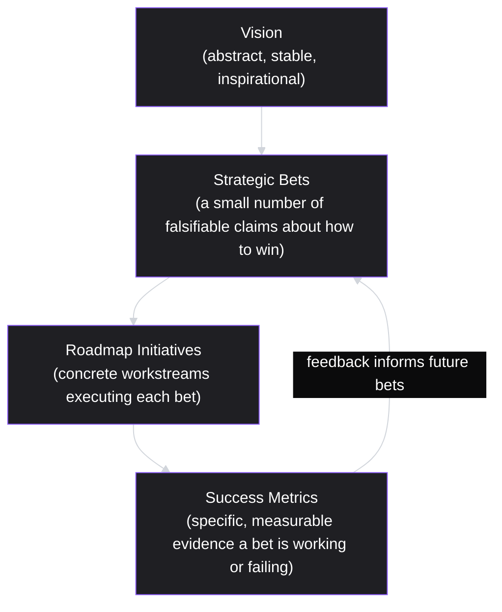

# Lesson 71: Product Strategy Frameworks: From Vision to Bets

## Why This Lesson Matters

Module 7 closed with a synthesis lesson teaching you to diagnose platform problems by combining multiple narrow models into an integrated view. Module 8 shifts the altitude of the conversation considerably higher: instead of diagnosing a specific platform mechanism, you'll now be reasoning about the broader question of what a product organization should actually be trying to achieve, and how a leadership team decides where to place its limited resources among many plausible directions.

Nearly every PM, at some point in their career, sits in a room where someone presents an inspiring vision statement — "we will be the platform every small business relies on to run their operations" — and watches the room nod in agreement, energized, and then leave with no clearer idea of what to actually build next month than they had walking in. This is not a failure of vision; visions are supposed to be aspirational and somewhat abstract. It is a failure of the connective tissue between vision and execution — the absence of a disciplined process for translating an inspiring but necessarily vague direction into a small number of concrete, falsifiable strategic bets that a team can actually execute against and later evaluate.

This lesson introduces the Strategy Cascade, this lesson's core mental model, to give you a structured way to trace the path from an abstract vision down to the specific, testable bets that vision should generate — and to recognize when that connective tissue is missing, which is one of the most common and expensive failures in product organizations of any size.

---

## Learning Path

| Field | Detail |
|---|---|
| **Module** | 8 — Advanced Strategy, Innovation & Enterprise/B2B Product Management |
| **Current Lesson** | 71 of 90 |
| **Difficulty** | 6 / 10 |
| **Estimated Study Time** | 40 minutes (reading) + 15 minutes (reflection + quiz) |
| **Prerequisites** | Lesson 1 (Output vs. Outcome), Lesson 60 (Product Philosophy synthesis), Module 7's Platform Health Radar (Lesson 70) as an example of connected-model thinking |
| **Next Lesson** | Lesson 72 — Enterprise & B2B Product Management Fundamentals |
| **Future Topics Unlocked** | Lesson 72 (Enterprise & B2B Fundamentals), Lesson 77 (Innovation Accounting and Portfolio Management), Lesson 80 (Module Synthesis) — all depend on the Strategy Cascade and falsifiable-bet discipline introduced here |

---

## Learning Objectives

By the end of this lesson, you will be able to:

1. Explain why a vision statement alone is insufficient to guide product execution, and what specific gap causes this insufficiency.
2. Apply the Strategy Cascade to trace a path from an abstract vision down to concrete, falsifiable strategic bets.
3. Distinguish a genuine strategic bet from a vague aspiration disguised as one.
4. Apply the Three Horizons framework to categorize strategic bets by time horizon and risk profile.
5. Evaluate a company's stated strategy for whether it actually connects vision to bets, or merely restates the vision at increasing levels of specificity without ever becoming falsifiable.

---

## Prerequisites

This lesson assumes the Output vs. Outcome distinction from Lesson 1 and the personal product philosophy synthesis from Lesson 60, and draws on the connected-model discipline demonstrated in Module 7's closing synthesis (Lesson 70) as an example of how abstract frameworks must ultimately connect to concrete, checkable questions.

---

## Theory

### Why Vision Alone Is Insufficient

A vision statement is, by design, abstract enough to remain stable over years and inspiring enough to motivate a large organization toward a shared aspiration. These very properties — stability and inspirational abstraction — make a vision statement unsuitable as a direct guide for near-term execution decisions, because it does not, on its own, specify what would count as evidence that the organization is on the right track versus the wrong one. "Be the platform every small business relies on" does not tell a team whether to build a payments feature or a scheduling feature next quarter, nor does it specify what result, if it failed to materialize within a defined period, would indicate the current approach isn't working.

The gap between vision and execution is filled by **strategy**: a smaller number of specific, falsifiable claims about how the organization intends to make progress toward the vision, given its actual current resources, market position, and competitive context. Strategy, done well, is the connective tissue that makes a vision actionable without diluting its aspirational scope.

### The Strategy Cascade

This lesson introduces the **Strategy Cascade**, a four-level model tracing the path from abstract vision to concrete execution:

The Strategy Cascade's core discipline is ensuring that every level below Vision earns the right to exist by being genuinely more specific and falsifiable than the level above it. A **Strategic Bet** is not simply the vision restated in slightly more concrete language ("we will invest in small business tools") — it must be a claim specific enough that it could, in principle, turn out to be wrong ("we believe small businesses will pay a premium for integrated payments and scheduling in a single product, and we will know this is working if attach rate for the combined offering exceeds 40% within two quarters of launch, and know it is failing if it falls below 15%"). A vague restatement of the vision, however specific-sounding its language, has not actually cleared the bar of being a genuine Strategic Bet if it cannot fail.

### What Makes a Bet "Falsifiable"

A genuine Strategic Bet has three properties: it names a specific hypothesis about the market, the customer, or the competitive landscape; it commits real, opportunity-costed resources to testing that hypothesis; and it specifies, in advance, what evidence would indicate the bet succeeded or failed, rather than allowing success to be declared after the fact based on whatever happened to occur. This third property — pre-committed success criteria — is what separates a real bet from a comfortable, unfalsifiable aspiration that can always be retroactively justified as "on track" regardless of actual results.

### The Three Horizons Framework

A widely used framework for organizing a portfolio of strategic bets by time horizon and risk is the **Three Horizons** model:

| Horizon | Focus | Risk Profile | Typical Resource Allocation |
|---|---|---|---|
| Horizon 1 | Core, existing business — defending and extending current strength | Low risk, well-understood | Majority of resources |
| Horizon 2 | Emerging opportunities adjacent to the core — proven demand, unproven execution at scale | Moderate risk | A meaningful but minority share |
| Horizon 3 | Transformational, exploratory bets — unproven demand, genuinely new territory | High risk, high potential | A small, deliberately protected share |

The discipline of the Three Horizons framework is ensuring an organization's bet portfolio is deliberately diversified across all three horizons, rather than either over-investing exclusively in Horizon 1 (safe but eventually stagnant) or over-investing in Horizon 3 (exciting but too risky to sustain the core business that funds it). A company with no Horizon 3 bets at all risks being disrupted by competitors willing to take exploratory risks; a company with too many Horizon 3 bets and insufficient Horizon 1 investment risks running out of resources before any transformational bet has time to prove itself.

---

## Common Beginner Mistakes

**Mistake 1: Treating a vision statement as if it were itself a strategy**

A vision that is inspiring but not falsifiable provides no guidance about what to build next or what would indicate the current direction isn't working.

**Mistake 2: Restating the vision in progressively more specific-sounding language without ever making it falsifiable**

Each level of the Strategy Cascade must add genuine specificity and testability, not just more words.

**Mistake 3: Declaring success or failure of a strategic bet without having specified success criteria in advance**

Without pre-committed evidence thresholds, any outcome can be retroactively framed as validating the original bet, undermining the entire purpose of making a falsifiable claim.

**Mistake 4: Concentrating all strategic bets in a single horizon**

All-Horizon-1 portfolios stagnate over time; all-Horizon-3 portfolios risk running out of resources before transformational bets can prove themselves.

**Mistake 5: Treating the Strategy Cascade as a one-time, top-down exercise with no feedback loop**

Metrics from executed initiatives should inform which future bets are made, rather than the cascade running in one direction only, from vision downward, with no information flowing back up.

---

## Mental Model: The Strategy Cascade

The Strategy Cascade introduced above is this lesson's core takeaway tool. When evaluating any organization's stated strategy, ask:

1. **Is there a clear Vision**, and is it appropriately abstract and stable, rather than trying to also function as a specific execution plan?
2. **Are the Strategic Bets genuinely falsifiable** — do they name a specific hypothesis, commit real resources, and specify success criteria in advance — or are they simply the vision restated in more specific-sounding language?
3. **Do Roadmap Initiatives clearly trace back to a specific bet**, so that every workstream's purpose in the broader strategy is traceable, rather than initiatives existing for their own sake?
4. **Are Success Metrics specific and pre-committed**, providing genuine evidence of whether each bet is working, rather than metrics selected retroactively to justify whatever happened?

A strategy that can answer all four questions affirmatively has genuine connective tissue between aspiration and execution; a strategy that cannot is likely to produce the common, frustrating experience of an inspiring vision meeting with no clear next action.

---

## Real Company Example

**Intuit's "AI-driven expert platform" strategy** is directly confirmed in the company's own investor relations materials, not just inferred from public commentary. At its 2024 Investor Day, Intuit's own press release quoted CEO Sasan Goodarzi stating the platform is built to deliver "seamless, connected, done-for-you experiences that help customers make more money with less work" — and the announcement paired that broad vision with specific, named product bets: deeper AI-powered integration between QuickBooks and Mailchimp aimed at automated invoicing and payment collection, and tighter connection between TurboTax and Credit Karma aimed at year-round (not just tax-season) financial guidance. Intuit's investor relations site further credits Goodarzi with the underlying strategic pivot itself — transforming Intuit from a tax-and-accounting software company into what the company explicitly frames as an AI-driven expert platform business.

This is a directly citable example of a Strategy Cascade in action: the vision ("helping customers make smart money decisions and grow their businesses") is broad enough to be durable, while the specific bets named at Investor Day — automated QuickBooks/Mailchimp workflows, unified TurboTax/Credit Karma guidance — are concrete and falsifiable enough that Intuit's own investors can later check whether they actually happened, exactly the property this lesson's Strategy Cascade requires of a well-formed bet.

*(Source: Intuit's own investor relations press release from its 2024 Investor Day, and Intuit's official investor relations site.)*

---

## Real World Perspective: Product Strategy Frameworks: From Vision to Bets at Different Company Stages

**Startup:** Early-stage companies often operate with an implicit rather than explicitly documented Strategy Cascade, since a small, tightly aligned founding team may not need a formal document to share an understanding of the current bet — but this informality becomes a liability the moment the team grows large enough that shared understanding can no longer be assumed by default.

**Mid-size company:** This is typically where the gap between an inspiring vision and an actionable execution plan first becomes organizationally painful, as growing teams working somewhat independently need an explicit, shared Strategy Cascade to avoid pursuing initiatives that, however individually reasonable, don't clearly trace back to any coherent shared bet.

**Big Tech:** Large organizations typically run formal strategic planning processes explicitly structured around something resembling the Strategy Cascade, often organized using Three-Horizons-style portfolio thinking across many product lines simultaneously, precisely because the scale of resource allocation decisions at this size makes an undisciplined, vision-only approach prohibitively risky.

---

## Detailed Case Study: The Unfalsifiable Pivot

A mid-size software company, facing slowing growth in its core product, announced an ambitious new vision: to become "the essential platform for how modern teams collaborate." Leadership presented this vision enthusiastically at an all-hands meeting, and several teams were subsequently reorganized around loosely related initiatives — a new messaging feature, a document collaboration tool, a project management module — each justified internally as "supporting the collaboration vision."

A year later, when asked to report progress against the vision, no team could point to a specific, pre-committed metric that would have indicated whether the pivot was succeeding or failing. Each team reported activity (features shipped, initiatives launched) but none had ever defined, in advance, what result would count as evidence the underlying strategic bet — that customers wanted an integrated collaboration platform rather than separate best-of-breed tools — was actually correct. When a board member later asked directly whether the collaboration pivot was working, the honest answer was that no one could say with confidence, because nothing had ever been set up to be capable of being wrong.

**What went wrong?** Using the Strategy Cascade, the failure is precise: the organization had a Vision (Level 1) and a set of Roadmap Initiatives (Level 3), but had skipped Level 2 (genuine, falsifiable Strategic Bets) entirely, jumping straight from an inspiring but necessarily vague aspiration directly to specific workstreams, with no intervening layer specifying what hypothesis those workstreams were actually testing or what evidence would indicate success or failure. Because Level 2 was never made explicit and falsifiable, Level 4 (Success Metrics) had nothing genuine to measure against, and the entire pivot became functionally unfalsifiable — impossible to definitively judge as either working or not working, regardless of how much activity it generated.

The company's recovery involved retroactively articulating explicit, falsifiable Strategic Bets for the collaboration vision (for instance, a specific hypothesis about cross-feature usage correlating with retention, with a defined threshold), and instituting a requirement that any future major initiative be traceable to a specific, falsifiable bet before receiving significant resource commitment — a discipline this curriculum will connect directly to the innovation accounting practices formalized in Lesson 77.

---

## Framework Explanation: The Three Horizons Portfolio Table

When evaluating whether an organization's strategic bet portfolio is appropriately diversified, a PM can use the Three Horizons framework as a structured audit:

| Horizon | Sample Bet Characteristics | Healthy Portfolio Signal | Red Flag |
|---|---|---|---|
| Horizon 1 (Core) | Extending or defending the existing core product | Majority of resources, but not the entirety | Zero investment in adjacent or exploratory bets at all |
| Horizon 2 (Adjacent) | A proven-demand opportunity adjacent to the core, requiring new execution capability | A meaningful, protected minority of resources | Horizon 2 bets treated as a side project with no dedicated resourcing |
| Horizon 3 (Transformational) | A genuinely new, exploratory bet with unproven demand | A small but deliberately protected share, insulated from near-term performance pressure | Horizon 3 bets judged by the same near-term metrics as Horizon 1, causing premature cancellation |

A portfolio concentrated entirely in Horizon 1 risks long-term stagnation; a portfolio with meaningful Horizon 3 investment but no protection from near-term performance scrutiny risks killing transformational bets before they have a fair chance to prove themselves.

---

## Interview Perspective: How Interviewers Think About This

**"How would you translate a company's broad vision statement into an actionable product strategy?"** The interviewer is evaluating whether you propose something resembling the Strategy Cascade — specifically, whether you recognize the need for an intermediate, falsifiable Strategic Bet layer, rather than jumping directly from vision to roadmap initiatives.

**"What makes a strategic bet different from a vague company goal?"** The interviewer is testing whether you can articulate the three properties of a genuine bet — a specific hypothesis, committed resources, and pre-defined success criteria — rather than simply restating that a bet should be "specific."

**"How would you evaluate whether a company's portfolio of initiatives is appropriately balanced across risk levels?"** The interviewer is listening for the Three Horizons framework specifically, and whether you can explain the risk of over-concentration in either Horizon 1 (stagnation) or Horizon 3 (unsustainable risk).

---

## Summary

A vision statement, however inspiring, cannot on its own guide near-term execution decisions, because its necessary abstraction and stability mean it does not specify what would count as evidence the organization is succeeding or failing at any given moment. The Strategy Cascade — Vision, Strategic Bets, Roadmap Initiatives, Success Metrics — provides the connective tissue between aspiration and execution, and its critical, most frequently skipped step is the Strategic Bet layer: a small number of genuinely falsifiable claims, each naming a specific hypothesis, committing real resources, and specifying success criteria in advance, rather than simply restating the vision in more specific-sounding language. The Three Horizons framework provides a complementary discipline for ensuring a portfolio of such bets is deliberately diversified across near-term core extension, proven-but-unscaled adjacent opportunities, and genuinely exploratory transformational bets, since over-concentration in either the safest or riskiest horizon carries its own characteristic failure mode. An organization that skips the falsifiable Strategic Bet layer entirely, jumping directly from vision to initiatives, risks the specific failure illustrated in this lesson's Case Study: a pivot that generates real activity and genuine effort, but that can never actually be judged a success or a failure, because nothing about it was ever set up to be capable of being wrong.

---

## Key Takeaways

- A vision statement alone cannot guide execution, since its necessary abstraction means it doesn't specify what would count as evidence of success or failure.
- The Strategy Cascade traces the path from Vision through falsifiable Strategic Bets, to Roadmap Initiatives, to Success Metrics, with feedback flowing back to inform future bets.
- A genuine Strategic Bet names a specific hypothesis, commits real resources, and specifies success criteria in advance — distinguishing it from a vague aspiration disguised as a plan.
- The Three Horizons framework diversifies a bet portfolio across core extension (Horizon 1), adjacent opportunities (Horizon 2), and transformational exploration (Horizon 3).
- Over-concentration in Horizon 1 risks long-term stagnation; over-concentration in Horizon 3 without near-term protection risks unsustainable resource depletion.
- Skipping the falsifiable Strategic Bet layer, and jumping directly from vision to initiatives, produces pivots that generate activity but can never be definitively judged as working or not.
- Success metrics must be pre-committed before initiatives launch, not selected retroactively to justify whatever outcome occurred.

---

## Cheat Sheet

*A two-minute review of everything in this lesson.*

- Vision inspires. Strategy makes it falsifiable. Don't confuse the two.
- Strategy Cascade: Vision → Strategic Bets → Roadmap Initiatives → Success Metrics → feedback loop.
- A real bet: specific hypothesis + committed resources + pre-defined success criteria.
- Three Horizons: Core (majority resources) → Adjacent (protected minority) → Transformational (small, protected share).
- If a "pivot" can't fail, it isn't a strategy — it's an unfalsifiable restatement of the vision.

---

## Glossary

| Term | Definition | Related Concepts | Difficulty |
|---|---|---|---|
| Strategy Cascade | Four-level model tracing Vision to Strategic Bets to Roadmap Initiatives to Success Metrics | Falsifiable Bet | 2 |
| Strategic Bet | A specific, falsifiable hypothesis with committed resources and pre-defined success criteria | Strategy Cascade | 2 |
| Falsifiability | The property that a claim could, in principle, be proven wrong by evidence | Strategic Bet | 2 |
| Three Horizons | A framework categorizing strategic bets into Core (H1), Adjacent (H2), and Transformational (H3) | Strategy Cascade, Portfolio Diversification | 2 |
| Unfalsifiable Pivot | A strategic shift lacking pre-defined success criteria, making it impossible to judge as working or failing | Strategic Bet | 2 |

---

## Further Reading / Resources

- Richard Rumelt, *Good Strategy Bad Strategy*
- A.G. Lafley and Roger Martin, *Playing to Win*
- Mehrdad Baghai, Stephen Coley, and David White, *The Alchemy of Growth*

---

## Flashcards

**Card 1**
- Front: Why can't a vision statement alone guide near-term execution decisions?
- Back: Its necessary abstraction and stability mean it doesn't specify what would count as evidence the organization is succeeding or failing.
- Difficulty: 2
- Tags: strategy-cascade, core-concept

**Card 2**
- Front: Name the four levels of the Strategy Cascade in order.
- Back: Vision, Strategic Bets, Roadmap Initiatives, Success Metrics.
- Difficulty: 2
- Tags: strategy-cascade

**Card 3**
- Front: What three properties make a Strategic Bet genuinely falsifiable?
- Back: A specific hypothesis, committed real resources, and pre-defined success criteria specified in advance.
- Difficulty: 2
- Tags: falsifiability

**Card 4**
- Front: What are the three Horizons in the Three Horizons framework?
- Back: Horizon 1 (Core), Horizon 2 (Adjacent), Horizon 3 (Transformational).
- Difficulty: 2
- Tags: three-horizons

**Card 5**
- Front: Why did the collaboration pivot in the Case Study become unfalsifiable?
- Back: The organization skipped the Strategic Bet layer, jumping directly from vision to initiatives, so no pre-defined evidence existed to judge success or failure.
- Difficulty: 2
- Tags: case-study, strategy-cascade

**Card 6**
- Front: What risk does an all-Horizon-1 portfolio carry?
- Back: Long-term stagnation, since no adjacent or transformational bets exist to sustain growth beyond the current core business.
- Difficulty: 2
- Tags: three-horizons

**Card 7**
- Front: What risk does judging Horizon 3 bets by the same near-term metrics as Horizon 1 carry?
- Back: Premature cancellation of transformational bets before they have a fair chance to prove themselves.
- Difficulty: 2
- Tags: three-horizons, portfolio-risk

## Reflection Exercise

You are the PM at a mid-size company whose leadership has just announced a new company vision: "to be the trusted financial co-pilot for every freelancer." Several teams are excited and have already begun proposing features — an expense tracker, a tax estimation tool, an invoicing assistant — all loosely justified as "supporting the co-pilot vision."

There is no single correct answer to the prompts below — the goal is to practice applying the Strategy Cascade and the falsifiability test to a real, still-vague strategic moment before it repeats the Unfalsifiable Pivot's mistake.

1. Using the Strategy Cascade, what specific question would you ask leadership to help surface the missing Strategic Bet layer?
2. Propose one possible falsifiable Strategic Bet this vision could generate, including a specific hypothesis and pre-defined success criteria.
3. How would you evaluate whether the three proposed features (expense tracker, tax estimation, invoicing assistant) actually trace back to a single coherent bet, or represent three separate, unrelated bets?
4. Using the Three Horizons framework, how might you categorize these three proposed features by risk level, and what might that suggest about portfolio balance?
5. What would you say if a team leader argued that defining pre-committed success criteria now was premature and would "constrain creativity"?

---

## Quiz

**1. Why is a vision statement alone insufficient to guide product execution?**
A) Its necessary abstraction can't specify what counts as success or failure
B) It requires board sign-off before any team can cite it in planning
C) It changes too often for teams to plan a quarter of work around
D) It focuses so narrowly that most teams can't recognize themselves in it

*Correct answer: A*
*Explanation: The lesson's core argument is that a vision's necessary abstraction and stability make it unsuitable as a direct guide for near-term execution decisions.*
*Learning objective tested: #1*
*Difficulty: Easy*

---

**2. What is the correct order of the Strategy Cascade?**
A) Vision, Roadmap Initiatives, Strategic Bets, Success Metrics
B) Strategic Bets, Vision, Roadmap Initiatives, Success Metrics
C) Vision, Strategic Bets, Roadmap Initiatives, Success Metrics
D) Vision, Strategic Bets, Success Metrics, Roadmap Initiatives

*Correct answer: C*
*Explanation: This is the top-down sequence from the Theory section, with a feedback loop flowing from measured metrics back into future bets.*
*Learning objective tested: #2*
*Difficulty: Easy*

---

**3. What are the three properties of a genuinely falsifiable Strategic Bet?**
A) A specific hypothesis, committed resources, and pre-defined criteria
B) A named owner, a fixed deadline, and a dedicated budget line
C) A competitive analysis, a pricing model, and a launch date
D) A committed team, a public announcement, and leadership sponsorship

*Correct answer: A*
*Explanation: These three properties distinguish a genuine bet from a vague aspiration dressed up in specific-sounding language.*
*Learning objective tested: #3*
*Difficulty: Easy*

---

**4. Why is pre-committed success criteria specifically important for a Strategic Bet?**
A) They let a bet's budget be finalized before the roadmap is drafted
B) They determine which department is accountable for the work
C) Without them, any outcome can be framed as validating the bet
D) They are relevant only for bets classified under Horizon 3

*Correct answer: C*
*Explanation: Pre-commitment is what prevents an outcome from being justified after the fact as success, central to genuine falsifiability.*
*Learning objective tested: #3*
*Difficulty: Easy*

---

**5. What does Horizon 1 represent in the Three Horizons framework?**
A) A small, deliberately protected share of transformational investment
B) The core, existing business, defended and extended for its strength
C) A proven-demand opportunity adjacent to the core, unproven at scale
D) The riskiest tier of bets, reserved for territory with no demand

*Correct answer: B*
*Explanation: Horizon 1 covers the low-risk, well-understood core business, which typically receives the majority of resources.*
*Learning objective tested: #4*
*Difficulty: Easy*

---

**6. What risk does over-concentration in Horizon 3 carry, according to this lesson?**
A) Long-term stagnation from never pursuing an adjacent opportunity
B) The core business losing customers directly because of the spending
C) Running out of resources before a transformational bet can prove itself
D) Horizon 3 bets automatically failing once their budget exceeds a cap

*Correct answer: C*
*Explanation: The Theory section identifies this resource-depletion risk; stagnation is instead the characteristic risk of over-concentrating in Horizon 1.*
*Learning objective tested: #4*
*Difficulty: Easy*

---

**7. In the Unfalsifiable Pivot case study, which level of the Strategy Cascade was skipped?**
A) Success Metrics — dashboards existed, but nobody reviewed them
B) Roadmap Initiatives — teams never actually began any workstreams
C) Strategic Bets — the vague vision led straight to initiatives
D) Vision — leadership never articulated one for the collaboration push

*Correct answer: C*
*Explanation: The organization had a Vision and Roadmap Initiatives but jumped between them without ever making a falsifiable Strategic Bet explicit.*
*Learning objective tested: #2, #5*
*Difficulty: Medium*

---

**8. Why couldn't the board member get a clear answer about whether the collaboration pivot was working?**
A) The board member had asked about the wrong product line
B) No pre-committed metric existed to judge the hypothesis
C) The company's metrics dashboard had been offline for weeks
D) Each team used a different internal definition of "collaboration"

*Correct answer: B*
*Explanation: Without a falsifiable bet and pre-defined success criteria, there was nothing genuine for any team to measure its progress against.*
*Learning objective tested: #3, #5*
*Difficulty: Medium*

---

**9. Per the Three Horizons Portfolio Table, what is a red flag for Horizon 3 bets specifically?**
A) Requiring a longer internal approval process than Horizon 1 does
B) Receiving a smaller overall share of resources than Horizon 1 does
C) Being reviewed by leadership less often than Horizon 2 bets are
D) Being judged by the same near-term metrics used for Horizon 1

*Correct answer: D*
*Explanation: The table identifies premature judgment against short-term metrics as the characteristic Horizon 3 red flag, since it causes early cancellation.*
*Learning objective tested: #4, #5*
*Difficulty: Medium*

---

**10. Per the Real World Perspective section, why might mid-size companies feel the vision-execution gap especially painfully?**
A) Mid-size companies stop publishing a vision statement past a size
B) Regulation forces mid-size companies to formalize every initiative
C) Growing teams need a shared cascade to avoid untethered work
D) Mid-size companies inherit Big Tech's planning processes wholesale

*Correct answer: C*
*Explanation: The section identifies this scale transition as the point where informal shared understanding of the current bet can no longer be assumed.*
*Learning objective tested: #1, #5*
*Difficulty: Medium*

---

**11. Why might an early-stage startup reasonably operate with an implicit Strategy Cascade?**
A) Startups are too resource-constrained to define success criteria
B) A small, aligned founding team may share the bet without a document
C) Formal documentation is said to slow down fundraising efforts
D) Investors reportedly prefer that early bets stay undocumented

*Correct answer: B*
*Explanation: The section frames this as reasonable at small scale, becoming a liability once the team grows too large for shared understanding to be assumed.*
*Learning objective tested: #1*
*Difficulty: Medium*

---

**12. (Scenario) Leadership proposes three seemingly unrelated initiatives, each justified as "supporting our vision." What should a PM ask first?**
A) Which initiative has the earliest planned launch date of the three
B) Whether the vision itself should be rewritten to fit the initiatives
C) Which initiative the CEO personally favors the most right now
D) What falsifiable bet each initiative traces back to, and is it shared

*Correct answer: D*
*Explanation: This applies the Cascade's discipline directly: tracing initiatives to an explicit bet, rather than accepting vague vision-alignment as sufficient.*
*Learning objective tested: #2, #3, #5*
*Difficulty: Medium-Hard*

---

**13. (Product Thinking) A team leader argues pre-committed success criteria would "constrain creativity" during early exploration. What is the strongest response?**
A) Cancel the initiative outright rather than negotiate its criteria
B) Agree that early exploration should proceed with no criteria at all
C) Insist on the same rigid thresholds used for Horizon 1 bets
D) Explain the bet becomes unfalsifiable without criteria, calibrated to its stage

*Correct answer: D*
*Explanation: The lesson's discipline acknowledges exploratory work while still requiring some falsifiability, rather than abandoning criteria or forcing Horizon 1 rigor onto it.*
*Learning objective tested: #3, #4, #5*
*Difficulty: Hard*

---

**14. (Interview Reasoning) A candidate evaluating a company's strategy focuses entirely on whether the vision statement is inspiring and well-written. What does this signal?**
A) A complete answer, since crafting a vision is the hardest part
B) A gap in recognizing that vision quality says nothing about falsifiable bets beneath it
C) A neutral answer, since vision quality rarely affects strategic assessment
D) Readiness to lead strategic planning without further coaching

*Correct answer: B*
*Explanation: The Interview Perspective section specifically listens for recognition of the Strategic Bet layer, not just vision quality.*
*Learning objective tested: #1, #2, #5*
*Difficulty: Hard*

---

**15. (Product Thinking, Highest Difficulty) A company's new vision has spawned loosely related initiatives, none yet connected to a falsifiable bet. What is the most defensible next step?**
A) Fund all proposed initiatives at once without further discussion
B) Let each team proceed independently, trusting vision alignment alone
C) Pause everything until a fully detailed five-year roadmap exists
D) Articulate the bets the vision implies, requiring each initiative to trace to one

*Correct answer: D*
*Explanation: This mirrors the Case Study: the defensible response neither proceeds on vague alignment nor demands excessive planning, but inserts the missing bet layer.*
*Learning objective tested: #2, #3, #5*
*Difficulty: Hard*

---

## Connections

| | Lesson | Core Idea Carried Forward |
|---|---|---|
| **Previous Lesson** | Lesson 70 — Module Synthesis: The Platform PM's Toolkit | Extends the discipline of connected, falsifiable models from platform diagnosis to broader organizational strategy |
| **Current Lesson** | Lesson 71 — Product Strategy Frameworks: From Vision to Bets | Strategy Cascade; falsifiable Strategic Bets; Three Horizons framework |
| **Next Lesson** | Lesson 72 — Enterprise & B2B Product Management Fundamentals | Applies the Strategy Cascade to the specific context of enterprise and B2B strategic bets |
| **Future Concepts Unlocked** | Lesson 77 (Innovation Accounting and Portfolio Management) | Extends the falsifiable Strategic Bet concept into formal metrics for managing a portfolio of bets over time |
| | Lesson 80 (Module Synthesis) | Treats the Strategy Cascade and Three Horizons framework as established canon for Module 8's closing synthesis |

This curriculum continues to build as one continuous argument. From this lesson forward, any reference to a company's strategy assumes you can trace it through the Strategy Cascade without re-explanation.
