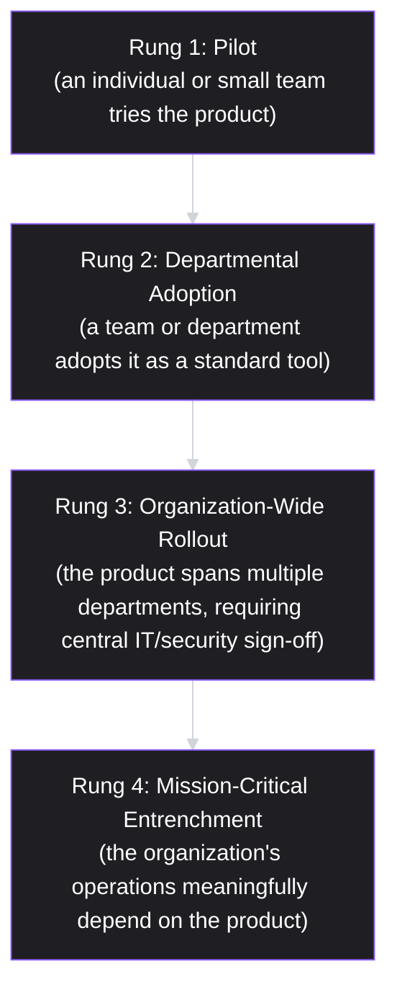

# Lesson 72: Enterprise & B2B Product Management Fundamentals

## Why This Lesson Matters

Lesson 71 introduced the Strategy Cascade and the discipline of turning an abstract vision into falsifiable bets. This lesson applies that discipline to a context with its own distinct rules: enterprise and B2B product management, where the person using a product and the person deciding whether to buy it are frequently different people with different, sometimes conflicting incentives, and where a single new customer can represent a meaningful fraction of a company's revenue rather than one anonymous unit among millions.

A PM who has only ever worked on consumer products, brought into an enterprise or B2B context for the first time, tends to make a specific and predictable set of mistakes: treating a successful individual user's enthusiasm as equivalent to a closed sale, assuming a feature that delights a single admin will automatically satisfy an entire organization's procurement and security requirements, and underestimating how much of enterprise product work is actually about earning organizational trust rather than optimizing an individual interaction. These mistakes are not a matter of raw skill; they reflect a genuinely different set of dynamics that consumer product experience does not automatically prepare someone for.

This lesson introduces the Enterprise Adoption Ladder, this lesson's core mental model, to give you a structured way to understand what capabilities a B2B product actually needs at each stage of organizational adoption — from an individual pilot user's enthusiasm all the way to becoming an entrenched, mission-critical system a large organization depends on.

---

## Learning Path

| Field | Detail |
|---|---|
| **Module** | 8 — Advanced Strategy, Innovation & Enterprise/B2B Product Management |
| **Current Lesson** | 72 of 90 |
| **Difficulty** | 6 / 10 |
| **Estimated Study Time** | 40 minutes (reading) + 15 minutes (reflection + quiz) |
| **Prerequisites** | Lesson 71 (Strategy Cascade, falsifiable bets), Lesson 1 (responsibility without authority) |
| **Next Lesson** | Lesson 73 — Selling to Committees: Buyer vs. User in B2B |
| **Future Topics Unlocked** | Lesson 73 (Buyer vs. User), Lesson 74 (Land-and-Expand Packaging), Lesson 79 (Pricing Strategy at Scale) — all depend on the Enterprise Adoption Ladder introduced here |

---

## Learning Objectives

By the end of this lesson, you will be able to:

1. Explain why enterprise and B2B products require a different set of capabilities than consumer products, beyond simply "more features."
2. Apply the Enterprise Adoption Ladder to identify what capability gap is blocking a product's progression to the next stage of organizational adoption.
3. Identify the core categories of enterprise readiness: security and compliance, administrative control, reliability commitments, and integration capability.
4. Distinguish a genuine organizational rollout from an isolated pocket of individual enthusiasm within a larger company.
5. Evaluate a B2B product's current state against the Enterprise Adoption Ladder to diagnose why it may be stalled at a given stage.

---

## Prerequisites

This lesson assumes the Strategy Cascade and falsifiable-bet discipline from Lesson 71, applied here to the specific context of enterprise go-to-market bets, and the "responsibility without authority" framing from Lesson 1, since enterprise PMs are frequently responsible for adoption outcomes they cannot directly control through product design alone.

---

## Theory

### Why Enterprise Products Need More Than "More Features"

A common misconception is that enterprise readiness simply means adding more features — more settings, more customization options, more configuration screens. In fact, enterprise readiness is primarily about a different *category* of capability, one that has little to do with the core functionality an individual user experiences and everything to do with how a large organization can trust, control, and depend on a system operating across many of its people simultaneously. A product can be extremely good at the task an individual user hired it to do, and still be entirely unusable at the organizational level, because organizations, unlike individuals, need to know who has access to what, whether the vendor meets specific security and compliance standards, what happens if the system goes down, and how the product will integrate with the dozens of other systems the organization already runs.

### The Enterprise Adoption Ladder

This lesson introduces the **Enterprise Adoption Ladder**, a four-rung model describing the stages a B2B product typically passes through as it moves from an individual's initial interest to genuine organizational entrenchment:

Each rung requires a different, additional category of capability beyond what the previous rung needed. A **Pilot** requires only that the core product deliver genuine value to the individual using it. **Departmental Adoption** typically requires basic team-level administrative controls (who on the team has access, basic usage visibility for a team lead) that an individual pilot never needed. **Organization-Wide Rollout** requires a substantially different tier of capability — enterprise-grade security certifications, single sign-on integration, granular role-based access control, audit logging — because at this stage, central IT and security functions, who were never involved in the original pilot, become gatekeepers whose sign-off is required before broader deployment can proceed. **Mission-Critical Entrenchment** requires reliability commitments (defined uptime guarantees, disaster recovery plans, formal support SLAs) appropriate to a system the organization can no longer easily operate without.

The Enterprise Adoption Ladder's core diagnostic use is identifying, when a product's growth within an account stalls, exactly which rung's required capability is missing — since a product genuinely excellent at Rung 1's core value proposition can still stall indefinitely at the Rung 2-to-3 transition if it lacks the security and administrative capabilities Rung 3 specifically requires, regardless of how enthusiastic individual users remain.

### The Four Categories of Enterprise Readiness

Enterprise readiness capabilities, particularly the ones required starting at Rung 3, generally fall into four categories: **security and compliance** (certifications like SOC 2 or ISO 27001, data residency guarantees, vulnerability management practices), **administrative control** (role-based access control, centralized user provisioning and deprovisioning, audit logs of user activity), **reliability and support commitments** (defined uptime SLAs, disaster recovery and business continuity plans, formal support response-time tiers), and **integration capability** (single sign-on, compatibility with the organization's existing identity and data systems, often connecting directly back to the API-as-product discipline from Lesson 62). A product missing capability in any one of these four categories can find its organizational rollout blocked entirely, regardless of how strong the other three categories are, because enterprise procurement and security review processes typically treat each category as a distinct, non-negotiable gate rather than allowing strength in one area to compensate for weakness in another.

### Isolated Enthusiasm vs. Genuine Organizational Rollout

A specific and common trap is mistaking a strong pocket of individual enthusiasm — several engaged users within one team, genuinely delighted with the product — for evidence of a broader organizational rollout in progress. These are structurally different phenomena. Individual enthusiasm reflects Rung 1 or 2 success and says relatively little about whether the Rung 3 gatekeepers (security, IT, procurement) have even been engaged yet, let alone satisfied. A B2B product team celebrating strong pilot-user satisfaction scores while having no active conversation with the account's central IT function may be celebrating a metric that, however genuinely positive, has limited bearing on whether the deal or rollout will actually progress.

---

## Common Beginner Mistakes

**Mistake 1: Treating enterprise readiness as simply "more features" rather than a distinct category of organizational trust and control capability**

Security certifications, admin controls, and reliability commitments serve a fundamentally different purpose than the core features an individual user experiences.

**Mistake 2: Mistaking strong individual or departmental enthusiasm for evidence of organization-wide rollout progress**

These are different rungs of the Adoption Ladder, and success at one does not guarantee progress at the next.

**Mistake 3: Assuming a single enterprise readiness gap can be compensated for by strength elsewhere**

Procurement and security review processes typically treat security, admin control, reliability, and integration as separate, non-negotiable gates.

**Mistake 4: Underestimating how much of enterprise adoption depends on stakeholders who never used the product directly**

Central IT and security teams, who may have no firsthand experience with the product's core value proposition, frequently hold effective veto power over Rung 3 progression.

**Mistake 5: Building enterprise readiness capabilities reactively, only after a specific deal is blocked by their absence**

Since these capabilities (certifications in particular) often require significant lead time to obtain, waiting until a specific deal demands them can cause avoidable delays or lost opportunities.

---

## Mental Model: The Enterprise Adoption Ladder

The Enterprise Adoption Ladder introduced above is this lesson's core takeaway tool. When a B2B product's growth within an account or market segment stalls, ask:

1. **Which rung is the product currently at**, and what specific capability does the *next* rung require that the current rung didn't?
2. **Is the stall caused by a missing capability** in security and compliance, administrative control, reliability commitments, or integration, or is it caused by something else (such as insufficient core value at the current rung)?
3. **Is apparent progress actually representative of the relevant rung's gatekeepers**, or does it reflect only isolated enthusiasm from users who aren't the actual decision-makers for the next stage?

A B2B PM who runs every stalled account or stalled market segment through this diagnostic is far better positioned to correctly identify whether the blocker is a product capability gap, a stakeholder engagement gap, or something else entirely — rather than assuming more of the same core feature work will eventually break through a blocker that core features were never going to solve.

---

## Real Company Example

**Zoom**'s climb up the Enterprise Adoption Ladder is directly traceable through the company's own public filings. Zoom grew explosively during 2020 through free and individually-adopted use, then had to build enterprise-grade trust capabilities to convert that grassroots base into sanctioned organizational deployments. Zoom's own annual report, filed with the SEC, states plainly that "trust is a cornerstone of the Zoom platform" and describes a specific, named suite of enterprise-readiness investments — communications compliance tools (archiving, data loss prevention), data residency controls, and end-to-end encryption available up to 1,000 meeting participants — built specifically to satisfy the security, privacy, and compliance requirements that stand between a team's informal adoption and an enterprise's IT-sanctioned rollout. The same filing describes Zoom tracking a specific metric, "net dollar expansion rate," to quantify how much existing enterprise accounts grow their usage over time — a direct, company-reported measure of the land-and-expand motion this lesson and Lesson 74 both formalize.

Zoom's own filing is candid about a genuine risk this created: the same 10-K notes that during its rapid pandemic-era growth, many new users "did not have full IT support or established protocols for security and privacy," which is precisely the tension the Enterprise Adoption Ladder describes — grassroots adoption outrunning the trust infrastructure that enterprise-wide deployment eventually requires.

*(Source: Zoom's own 2025 Annual Report, filed with the SEC, and the company's official investor relations materials.)*

---

## Real World Perspective: Enterprise & B2B Product Management Fundamentals at Different Company Stages

**Startup:** Early-stage B2B companies typically focus almost entirely on Rung 1 and Rung 2 capabilities, since landing initial pilot and departmental customers is the immediate priority, and building out Rung 3 and 4 capabilities before there is evidence of genuine demand for organization-wide deployment can represent a premature and costly investment.

**Mid-size company:** This is typically where the Rung 2-to-3 transition becomes a genuine strategic priority, as accumulated departmental adoptions across multiple customers create pressure to invest in the security, administrative, and reliability capabilities needed to convert that grassroots traction into larger, IT-sanctioned enterprise deals.

**Big Tech:** Large, established enterprise vendors typically already possess mature Rung 3 and 4 capabilities as a baseline cost of doing business in the enterprise market, shifting competitive differentiation toward core product value, ecosystem breadth, and account-specific customization rather than basic enterprise readiness itself.

---

## Detailed Case Study: The Stalled Departmental Rollout

A B2B project management software startup achieved strong early traction: dozens of individual teams across several large enterprise accounts had adopted the product organically, often via free trials initiated by individual managers with no involvement from central IT. Usage metrics and qualitative feedback from these teams were consistently excellent, and the company's internal narrative, reinforced in board meetings, was that the product was clearly "winning" within these large accounts.

When the sales team attempted to convert this grassroots traction into formal, organization-wide enterprise contracts, however, deal after deal stalled at the same point: security review. The product had no formal SOC 2 certification, no granular role-based access control beyond basic team-level permissions, and no centralized audit logging that a security team could review. Central IT and security stakeholders at each account, who had never been part of the original grassroots adoption and had no firsthand experience with the product's core value, were unmoved by reports of high user satisfaction among individual teams, since satisfaction was not among the criteria their review process was designed to evaluate.

**What went wrong?** Using the Enterprise Adoption Ladder, the failure is precise: the company had genuine, real success at Rungs 1 and 2, but had never invested in the security and administrative control capabilities specifically required at Rung 3, and had mistaken Rung 1/2 success metrics for evidence that Rung 3 progression was already underway. The stall was not a core product problem — the product's value proposition remained strong — but a specific, locatable capability gap in exactly the category (security and compliance) that Rung 3's gatekeepers were evaluating.

The company's recovery involved a deliberate, multi-quarter investment in obtaining SOC 2 certification, building out formal role-based access control and audit logging, and establishing a dedicated enterprise sales engineering function specifically responsible for engaging security and IT stakeholders early in future sales processes rather than only after a deal had already stalled — a discipline that foreshadows the buyer-versus-user dynamics formalized directly in Lesson 73.

---

## Framework Explanation: The Enterprise Readiness Checklist

Before attempting to convert departmental traction into organization-wide rollout, a PM can use the following checklist across the four enterprise readiness categories:

| Category | Capability to Verify | Risk if Missing |
|---|---|---|
| Security & Compliance | Relevant certifications (e.g., SOC 2, ISO 27001), data residency guarantees | Security review blocks the deal regardless of product quality or user satisfaction |
| Administrative Control | Role-based access control, centralized user provisioning/deprovisioning, audit logs | IT cannot manage or oversee deployment at scale, blocking Rung 3 progression |
| Reliability & Support | Defined uptime SLA, disaster recovery plan, formal support response tiers | Organization cannot justify mission-critical dependence without these commitments |
| Integration Capability | Single sign-on support, compatibility with existing identity and data systems | IT must manage yet another disconnected system, increasing operational burden and resistance |

A "no" on Security & Compliance in particular should be treated as an especially significant blocker for Rung 3 progression, given how consistently security review functions as a hard gate in enterprise procurement processes, largely independent of core product quality.

---

## Interview Perspective: How Interviewers Think About This

**"How would you approach expanding a product's footprint within a large enterprise account, starting from a single team's adoption?"** The interviewer is evaluating whether you recognize the Enterprise Adoption Ladder's distinct rungs, and specifically whether you identify security, administrative, and reliability capabilities as necessary for Rung 3 progression, rather than assuming continued core feature development alone will drive expansion.

**"What's the difference between a product succeeding with individual users and succeeding at the organizational level within an enterprise account?"** The interviewer is testing whether you can articulate the distinction between isolated enthusiasm and genuine organizational rollout, and name the stakeholders (central IT, security) who become relevant only at later rungs.

**"Tell me about a situation where strong product usage metrics didn't translate into deal progress."** The interviewer is listening for recognition of a pattern like the Stalled Departmental Rollout case study — a specific, locatable capability gap blocking progression, rather than a vague sense that "sales was just slow."

---

## Summary

Enterprise and B2B products require a fundamentally different category of capability than "more features" — specifically, capabilities that establish organizational trust and control, spanning security and compliance, administrative control, reliability commitments, and integration capability. The Enterprise Adoption Ladder — Pilot, Departmental Adoption, Organization-Wide Rollout, Mission-Critical Entrenchment — describes the stages a B2B product typically passes through, with each rung requiring an additional category of capability the previous rung did not need, and progression to Rung 3 in particular typically requires engaging an entirely different set of stakeholders (central IT and security) who had no involvement in the original pilot and whose review criteria have little to do with individual user satisfaction. A common and costly mistake is mistaking strong isolated enthusiasm at Rungs 1 or 2 for evidence that Rung 3 progression is underway, when in fact the relevant gatekeepers may not yet be engaged at all, and a specific, locatable capability gap — most often in security and compliance — can stall an account indefinitely regardless of how strong the core product experience remains for its existing individual users.

---

## Key Takeaways

- Enterprise readiness is a distinct category of organizational trust and control capability, not simply "more features."
- The Enterprise Adoption Ladder — Pilot, Departmental Adoption, Organization-Wide Rollout, Mission-Critical Entrenchment — describes stages requiring progressively different capabilities.
- The four categories of enterprise readiness are security and compliance, administrative control, reliability and support commitments, and integration capability.
- Rung 3 progression typically requires engaging central IT and security stakeholders who had no involvement in the original pilot and evaluate different criteria than user satisfaction.
- Strong isolated enthusiasm at Rungs 1 or 2 is not evidence that Rung 3 gatekeepers have been engaged or satisfied.
- A single missing enterprise readiness category, especially security and compliance, can block organizational rollout regardless of strength in other categories.
- Enterprise readiness capabilities, particularly certifications, often require significant lead time and should be built proactively rather than reactively.

---

## Cheat Sheet

*A two-minute review of everything in this lesson.*

- Enterprise readiness ≠ more features. It's organizational trust and control capability.
- Adoption Ladder: Pilot → Departmental → Organization-Wide → Mission-Critical.
- Four readiness categories: security/compliance, admin control, reliability/support, integration.
- Rung 3 gatekeepers (IT, security) don't care about user satisfaction — they evaluate different criteria entirely.
- Isolated enthusiasm ≠ organizational rollout in progress. Check whether the actual gatekeepers are even engaged.

---

## Glossary

| Term | Definition | Related Concepts | Difficulty |
|---|---|---|---|
| Enterprise Adoption Ladder | Four-rung model: Pilot, Departmental Adoption, Organization-Wide Rollout, Mission-Critical Entrenchment | Enterprise Readiness Checklist | 2 |
| Enterprise Readiness | The distinct category of security, administrative, reliability, and integration capability required for organizational adoption | Enterprise Adoption Ladder | 2 |
| Role-Based Access Control | A system for managing user permissions based on organizational role rather than individual configuration | Administrative Control | 2 |
| SOC 2 | A common security compliance certification frequently required by enterprise security review processes | Security & Compliance | 1 |
| Isolated Enthusiasm | Strong engagement from individual or departmental users that does not necessarily reflect broader organizational rollout progress | Enterprise Adoption Ladder | 2 |

---

## Further Reading / Resources

- Geoffrey Moore, *Crossing the Chasm*
- Winning by Design (Jacco van der Kooij and Fernando Pizarro), *The SaaS Sales Method*
- *B2B Product Management* industry resources from Product-Led Growth practitioner communities (e.g., OpenView Partners' published research)

---

## Flashcards

**Card 1**
- Front: Why is enterprise readiness a distinct category from "more features"?
- Back: It establishes organizational trust and control — security, administrative oversight, reliability, integration — rather than serving an individual user's core task directly.
- Difficulty: 2
- Tags: enterprise-readiness, core-concept

**Card 2**
- Front: Name the four rungs of the Enterprise Adoption Ladder.
- Back: Pilot, Departmental Adoption, Organization-Wide Rollout, Mission-Critical Entrenchment.
- Difficulty: 2
- Tags: adoption-ladder

**Card 3**
- Front: Name the four categories of enterprise readiness capability.
- Back: Security and compliance, administrative control, reliability and support commitments, integration capability.
- Difficulty: 2
- Tags: enterprise-readiness

**Card 4**
- Front: Why couldn't strong user satisfaction metrics unblock the security review stall in the Case Study?
- Back: Security review criteria (certifications, access control, audit logs) are entirely separate from user satisfaction, and central IT/security stakeholders were never part of the original grassroots adoption.
- Difficulty: 2
- Tags: case-study, adoption-ladder

**Card 5**
- Front: Why can a single missing enterprise readiness category block a deal regardless of strength elsewhere?
- Back: Procurement and security review processes typically treat each category as a separate, non-negotiable gate rather than allowing compensation across categories.
- Difficulty: 2
- Tags: enterprise-readiness

**Card 6**
- Front: Why should enterprise readiness capabilities often be built proactively rather than reactively?
- Back: Certifications and related capabilities often require significant lead time to obtain, and waiting until a specific deal demands them can cause avoidable delays.
- Difficulty: 2
- Tags: enterprise-readiness-timing

**Card 7**
- Front: What distinguishes isolated enthusiasm from genuine organizational rollout progress?
- Back: Isolated enthusiasm reflects Rung 1/2 success among individual users, while organizational rollout requires engagement and approval from Rung 3 gatekeepers like central IT and security, who evaluate entirely different criteria.
- Difficulty: 2
- Tags: isolated-enthusiasm

## Reflection Exercise

You are the PM for a B2B analytics tool that has organically spread across several teams within a large enterprise customer, with strong usage metrics and highly positive qualitative feedback. Your sales team has just reported that a formal enterprise-wide contract, which would significantly expand the account, has stalled with no clear explanation from the customer's side.

There is no single correct answer to the prompts below — the goal is to practice applying the Enterprise Adoption Ladder and the Enterprise Readiness Checklist to diagnose an ambiguous stall.

1. Using the Enterprise Adoption Ladder, what rung do you believe the account is currently at, and what capability might be required for the next rung?
2. What questions would you ask your sales team to determine whether central IT or security stakeholders have been directly engaged in this account?
3. Using the Enterprise Readiness Checklist, which of the four categories would you investigate first, and why?
4. If a specific readiness gap is identified, how would you weigh the cost and timeline of addressing it against the potential value of this specific deal and similar future deals?
5. How would you communicate this diagnosis to your sales team and leadership, given that the existing narrative may have been "we're clearly winning this account"?

---

## Quiz

**1. Why is enterprise readiness described as a distinct category from "more features"?**
A) It establishes organizational trust and control rather than serving individual tasks
B) Enterprise readiness applies only to products with no individual users
C) Enterprise readiness is simply a larger quantity of the same feature type
D) There is, in practice, no meaningful distinction between the two

*Correct answer: A*
*Explanation: The lesson distinguishes enterprise readiness as serving organizational trust rather than individual task completion.*
*Learning objective tested: #1*
*Difficulty: Easy*

---

**2. What is the correct order of the Enterprise Adoption Ladder?**
A) Departmental Adoption, Pilot, Mission-Critical, Organization-Wide
B) Pilot, Departmental Adoption, Organization-Wide, Mission-Critical
C) Organization-Wide, Mission-Critical, Pilot, Departmental Adoption
D) Mission-Critical, Organization-Wide, Departmental Adoption, Pilot

*Correct answer: B*
*Explanation: This is the sequential order from the Theory section, from individual pilot to organizational entrenchment.*
*Learning objective tested: #2*
*Difficulty: Easy*

---

**3. What typically becomes necessary for the first time at Rung 3, Organization-Wide Rollout?**
A) Basic core functionality that a pilot user relies on daily
B) An individual user's initial enthusiasm for the product
C) Security certifications and access controls requiring IT sign-off
D) A marketing campaign aimed at attracting new individual users

*Correct answer: C*
*Explanation: This tier of capability becomes necessary starting at Rung 3, engaging gatekeepers not involved at earlier rungs.*
*Learning objective tested: #3*
*Difficulty: Easy*

---

**4. Name the four categories of enterprise readiness capability.**
A) Marketing, sales, engineering, and design
B) User interface, pricing, onboarding, and documentation
C) Revenue, growth, retention, and referrals
D) Security, administrative control, reliability, and integration

*Correct answer: D*
*Explanation: These four categories are named in the Theory section as the core dimensions of enterprise readiness.*
*Learning objective tested: #3*
*Difficulty: Easy*

---

**5. Why can a single missing enterprise readiness category block a whole deal?**
A) Enterprise buyers are said to prioritize price above every other factor
B) Strength in one category generally compensates for weakness in another
C) Review processes treat each category as a separate, non-negotiable gate
D) Enterprise deals are rarely blocked by any single capability gap

*Correct answer: C*
*Explanation: The lesson describes these categories as distinct gates rather than compensating dimensions.*
*Learning objective tested: #3, #5*
*Difficulty: Easy*

---

**6. What distinguishes isolated enthusiasm from genuine organizational rollout progress?**
A) Rollout requires gatekeepers like IT and security, who evaluate different criteria
B) Isolated enthusiasm is treated as a stronger signal than gatekeeper engagement
C) There is, in this lesson's account, no real distinction between the two
D) Organizational rollout never requires engagement beyond pilot users

*Correct answer: A*
*Explanation: This distinction is central to the Adoption Ladder's diagnostic value, as illustrated in the Case Study.*
*Learning objective tested: #4*
*Difficulty: Easy*

---

**7. In the Case Study, why didn't strong user satisfaction metrics unblock the stalled deals?**
A) The metrics themselves were inaccurate and misrepresented sentiment
B) Enterprise customers reportedly never consider satisfaction relevant
C) Review criteria were separate from satisfaction, and IT had never engaged
D) The sales team failed to present the metrics to the customer at all

*Correct answer: C*
*Explanation: The case study shows security review evaluates different criteria than satisfaction, and those stakeholders were disconnected from adoption.*
*Learning objective tested: #4, #5*
*Difficulty: Medium*

---

**8. What was the actual root cause of the stalled deals in the Case Study, using the Adoption Ladder?**
A) The core product lacked genuine value for the individual pilot users
B) The company had never invested in Rung 3's security and admin capability
C) The sales team had not adequately marketed the product to users
D) The company had simply built too many features rather than too few

*Correct answer: B*
*Explanation: The failure was a specific, locatable capability gap at exactly the rung the deals were stalled at, not a core product deficiency.*
*Learning objective tested: #2, #5*
*Difficulty: Medium*

---

**9. Per the Enterprise Readiness Checklist, what risk does a missing Security & Compliance capability carry?**
A) A minor inconvenience easily overcome by strong core product value
B) Security review blocking the deal regardless of product quality
C) No real risk, since certifications are treated as optional in sales
D) A risk relevant only to consumer products, not B2B ones

*Correct answer: B*
*Explanation: The lesson treats missing security capability as an especially significant blocker, largely independent of other product strengths.*
*Learning objective tested: #3, #5*
*Difficulty: Medium*

---

**10. Why might early-stage B2B startups reasonably deprioritize Rung 3 and 4 capabilities, per the Real World Perspective section?**
A) Rung 1 and 2 capabilities are said to suffice for the entire lifecycle
B) Building them before evidence of demand is a premature investment
C) Early-stage startups are legally prohibited from pursuing certifications
D) Rung 3 and 4 capabilities are treated as never relevant to B2B firms

*Correct answer: B*
*Explanation: The section frames this as a reasonable prioritization trade-off given limited early-stage resources.*
*Learning objective tested: #1*
*Difficulty: Medium*

---

**11. What typically shifts as the strategic priority for mid-size B2B companies, per the Real World Perspective section?**
A) Eliminating the need for any further security or compliance investment
B) Focusing exclusively on individual user acquisition with no other angle
C) Abandoning departmental adoption entirely in favor of enterprise-only sales
D) Converting departmental traction into IT-sanctioned enterprise deals

*Correct answer: D*
*Explanation: The section identifies this Rung 2-to-3 transition as the characteristic mid-size company strategic priority.*
*Learning objective tested: #1*
*Difficulty: Medium*

---

**12. (Scenario) A product has excellent departmental adoption but has never engaged central IT. What is the most likely next step for progression?**
A) Reduce investment, since departmental adoption has already succeeded
B) Focus exclusively on acquiring more users within the existing teams
C) Assume rollout will proceed automatically given the strong traction
D) Proactively engage IT and security and assess readiness gaps first

*Correct answer: D*
*Explanation: Rung 3 progression requires engaging gatekeepers not part of departmental adoption, and this should be done proactively rather than assumed.*
*Learning objective tested: #2, #4, #5*
*Difficulty: Medium-Hard*

---

**13. (Product Thinking) A company's narrative describes an account as "clearly winning" from usage metrics, while contract talks have stalled unexplained. What should a PM investigate first?**
A) Whether IT is engaged and a specific readiness gap actually exists
B) Whether the sales team is using the correct marketing materials
C) Whether the departmental usage metrics were calculated correctly
D) Whether individual users would benefit from additional features

*Correct answer: A*
*Explanation: This directly applies the lesson's core diagnostic: isolated enthusiasm doesn't indicate rollout progress, so engagement and gaps should be checked first.*
*Learning objective tested: #2, #4, #5*
*Difficulty: Hard*

---

**14. (Interview Reasoning) A candidate describes expanding a product within an account using only plans for additional core features. What does this most likely signal?**
A) A strong and complete understanding of enterprise expansion strategy
B) That the candidate is ready for a senior enterprise PM role immediately
C) A gap in recognizing Rung 3 requires security and admin capability too
D) Nothing meaningful; feature development generally drives expansion

*Correct answer: C*
*Explanation: The Interview Perspective section specifically listens for recognition of the distinct capability categories at later rungs, which this answer omits.*
*Learning objective tested: #2, #3, #5*
*Difficulty: Hard*

---

**15. (Product Thinking, Highest Difficulty) A product has strong departmental traction, but enterprise-wide rollout has stalled with no clear explanation from the customer. What is the most defensible diagnostic approach?**
A) Conclude the deal is simply slow and take no further action
B) Assume the core product needs more features and prioritize that work
C) Discount the account's value and redirect resources without checking
D) Check gatekeeper engagement and the Readiness Checklist for a gap

*Correct answer: D*
*Explanation: This mirrors the Case Study: the correct response systematically investigates engagement and readiness gaps rather than assuming a product issue or abandoning the account.*
*Learning objective tested: #2, #3, #4, #5*
*Difficulty: Hard*

---

## Connections

| | Lesson | Core Idea Carried Forward |
|---|---|---|
| **Previous Lesson** | Lesson 71 — Product Strategy Frameworks: From Vision to Bets | Applies the falsifiable-bet discipline to enterprise go-to-market strategy specifically |
| **Current Lesson** | Lesson 72 — Enterprise & B2B Product Management Fundamentals | Enterprise Adoption Ladder; four categories of enterprise readiness; isolated enthusiasm vs. genuine rollout |
| **Next Lesson** | Lesson 73 — Selling to Committees: Buyer vs. User in B2B | Extends the Rung 3 gatekeeper concept into a full framework for navigating multiple stakeholders in an enterprise buying process |
| **Future Concepts Unlocked** | Lesson 74 (Land-and-Expand Packaging) | Uses the Enterprise Adoption Ladder as the structural basis for designing packaging that supports rung-by-rung expansion |
| | Lesson 79 (Pricing Strategy at Scale) | Extends enterprise readiness investment costs into pricing and contract negotiation considerations |

This curriculum continues to build as one continuous argument. From this lesson forward, any reference to enterprise account growth assumes you can locate it on the Enterprise Adoption Ladder without re-explanation.
