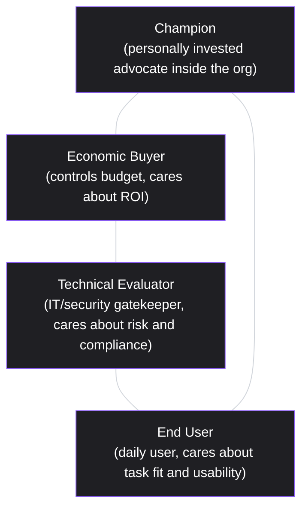

# Lesson 73: Selling to Committees: Buyer vs. User in B2B

## Why This Lesson Matters

Lesson 72 introduced the Enterprise Adoption Ladder and established that Rung 3 progression requires engaging gatekeepers — central IT and security stakeholders — who were never part of a product's original grassroots adoption. This lesson names those gatekeepers explicitly and extends the picture further: in most B2B purchasing decisions of any real size, there is no single "customer" at all. There is a committee of distinct people, each with a different relationship to the product, a different definition of success, and often genuinely conflicting incentives, and a deal succeeds or fails based on whether all of them, not just the most enthusiastic one, are satisfied.

Consumer product intuition breaks down badly here. A consumer PM learns to obsess over a single user's needs, because in a consumer context the person using the product, the person paying for it, and the person deciding to buy it are almost always the same individual. In B2B, these are frequently three, four, or five different people: an end user who will interact with the product daily, a champion within the organization who is personally invested in seeing the purchase succeed, an economic buyer who controls the budget and cares primarily about return on investment, and a technical evaluator or gatekeeper — often from IT or security, echoing Lesson 72's Rung 3 concept directly — whose approval is required regardless of how enthusiastic anyone else on the committee is.

This lesson introduces the Stakeholder Compass, this lesson's core mental model, to give you a structured way to identify who actually needs to be satisfied for a B2B deal to close, and what "satisfied" concretely means for each of them.

---

## Learning Path

| Field | Detail |
|---|---|
| **Module** | 8 — Advanced Strategy, Innovation & Enterprise/B2B Product Management |
| **Current Lesson** | 73 of 90 |
| **Difficulty** | 6 / 10 |
| **Estimated Study Time** | 40 minutes (reading) + 15 minutes (reflection + quiz) |
| **Prerequisites** | Lesson 72 (Enterprise Adoption Ladder, Rung 3 gatekeepers) |
| **Next Lesson** | Lesson 74 — Land-and-Expand: Packaging for Enterprise Growth |
| **Future Topics Unlocked** | Lesson 74 (Land-and-Expand Packaging), Lesson 79 (Pricing Strategy at Scale), Lesson 88 (Building and Scaling a Product Organization) — all depend on the Stakeholder Compass introduced here |

---

## Learning Objectives

By the end of this lesson, you will be able to:

1. Explain why B2B purchasing decisions typically involve multiple distinct stakeholder roles rather than a single "customer."
2. Apply the Stakeholder Compass to identify the champion, economic buyer, technical evaluator, and end user in a given B2B deal.
3. Distinguish each stakeholder role's distinct definition of success and primary concern.
4. Identify the risk of over-relying on a single stakeholder, particularly a champion with no budget authority, to carry a deal forward.
5. Evaluate a stalled B2B deal for which stakeholder role may be inadequately engaged or unsatisfied.

---

## Prerequisites

This lesson assumes the Enterprise Adoption Ladder and the concept of Rung 3 gatekeepers from Lesson 72, since this lesson names and elaborates those gatekeeper roles specifically as part of a broader stakeholder map relevant across the entire B2B sales and adoption process, not only at the organization-wide rollout stage.

---

## Theory

### Why B2B Purchases Involve Multiple Distinct Roles

In a consumer purchase, one person typically experiences the product, decides whether it's worth the money, and completes the transaction, all in a single, largely private decision. In a B2B purchase of meaningful size, these functions are routinely distributed across different people within the buying organization, each of whom has their own incentives, success criteria, and constraints, and none of whom can unilaterally complete the purchase alone. A product that delights the person who will use it daily can still fail to be purchased if the person controlling the budget doesn't see a clear return, or if a technical reviewer identifies a security concern the daily user has no visibility into or authority over.

### The Stakeholder Compass

This lesson introduces the **Stakeholder Compass**, mapping the four most common distinct roles in a B2B buying process:

The **Champion** is someone inside the buying organization, often but not always an end user themselves, who is personally invested in seeing the purchase succeed — sometimes because it solves a problem they're accountable for, sometimes because their own reputation is tied to advocating for the change. The **Economic Buyer** controls the budget and evaluates the purchase primarily in terms of cost, return on investment, and opportunity cost relative to other uses of the same budget — and critically, may have limited or no firsthand exposure to the product itself. The **Technical Evaluator**, directly connected to the Rung 3 gatekeeper concept from Lesson 72, assesses security, compliance, integration, and technical risk, and typically has veto power regardless of how compelling the product is to everyone else on the committee. The **End User** is the person who will actually interact with the product daily, and whose primary concern is whether it genuinely fits and improves their actual workflow.

The Stakeholder Compass's core discipline is recognizing that a deal requires, at minimum, adequate engagement across all four roles — not necessarily unanimous enthusiasm, but at least no unaddressed veto-level objection from any one of them — and that strong performance with one role does not substitute for engagement with the others.

### The Champion-Without-Authority Trap

A specific and extremely common B2B failure mode is over-relying on a single, genuinely enthusiastic Champion, particularly one who is also an End User, to carry a deal forward without ever directly engaging the Economic Buyer or Technical Evaluator. A Champion's enthusiasm is a genuinely valuable asset — often the reason a deal exists at all — but a Champion without formal budget authority or technical sign-off authority cannot, by themselves, complete a purchase, and treating their strong internal advocacy as equivalent to deal progress risks the sales-and-product team investing significant effort in an account that stalls the moment it needs sign-off from stakeholders who were never engaged directly.

### Distinct Success Criteria by Role

Each stakeholder role's definition of "this product is good" differs meaningfully, and a product or sales narrative optimized for one role's success criteria may fail to resonate with, or even actively concern, another. The End User evaluates task fit and day-to-day usability. The Economic Buyer evaluates return on investment and total cost relative to alternatives, often with limited patience for feature-level detail that doesn't connect to a business outcome. The Technical Evaluator evaluates risk exposure, compliance, and integration burden, largely independent of how well the product performs its core function. The Champion, depending on their own role, may care about all of the above simultaneously, but their success is also frequently tied to their own internal credibility — meaning a Champion needs not just a good product, but a good, defensible story they can personally tell to the other stakeholders on their own behalf.

---

## Common Beginner Mistakes

**Mistake 1: Treating a single enthusiastic stakeholder's feedback as representative of the whole buying committee**

Strong Champion or End User enthusiasm says little about whether the Economic Buyer or Technical Evaluator have been engaged or satisfied.

**Mistake 2: Assuming a Champion has more internal authority than they actually do**

A Champion without budget or technical sign-off authority cannot unilaterally close a deal, however strong their advocacy.

**Mistake 3: Pitching every stakeholder with the same narrative and the same level of detail**

A pitch optimized for an End User's task-fit concerns may fail to address an Economic Buyer's ROI concerns or a Technical Evaluator's risk concerns at all.

**Mistake 4: Engaging the Technical Evaluator only late in the process, after significant momentum has already built with other stakeholders**

Given the veto-level authority Technical Evaluators typically hold, per Lesson 72's Rung 3 discussion, late engagement risks a costly, momentum-killing stall at exactly the point a deal seemed closest to completion.

**Mistake 5: Assuming all four roles are always occupied by different individuals**

In smaller organizations, a single person may occupy multiple roles simultaneously (for example, a founder who is both Economic Buyer and Technical Evaluator), and failing to recognize this can lead to either redundant or entirely missed stakeholder engagement.

---

## Mental Model: The Stakeholder Compass

The Stakeholder Compass introduced above is this lesson's core takeaway tool. For any B2B deal or account, ask:

1. **Who occupies each of the four roles** — Champion, Economic Buyer, Technical Evaluator, End User — in this specific account, recognizing that one person may occupy more than one role?
2. **Has each role actually been engaged directly**, or has engagement been assumed based on strong performance with only one or two of the roles?
3. **Does the narrative or evidence presented to each stakeholder match their actual success criteria** — ROI for the Economic Buyer, risk and compliance for the Technical Evaluator, task fit for the End User — rather than a single generic pitch applied uniformly?
4. **Is the deal currently relying too heavily on a single stakeholder**, particularly a Champion, to carry momentum without direct engagement from the roles that hold actual authority to approve or veto the purchase?

A B2B PM or sales team that runs every account through this diagnostic is far less likely to be surprised by a deal stalling after apparently strong progress, since the stall is usually explainable by an unaddressed role on the Compass rather than a mysterious, unexplained loss of momentum.

---

## Real Company Example

**MEDDIC** (now more commonly extended to MEDDPICC) is the actual origin of the formalized buying-committee-role vocabulary this lesson uses, not just an illustration of it. The methodology was developed inside PTC (Parametric Technology Corporation) in the early-to-mid 1990s by Dick Dunkel, working under sales leader John McMahon alongside Jack Napoli, specifically to bring structure and predictability to PTC's complex, multi-stakeholder enterprise deals. McMahon has described the underlying motivation directly: before the framework existed, he taught the same qualifying questions informally on every forecasted deal — "do we have a Champion or just a coach? Has the Champion helped us get to the Economic Buyer?" — and MEDDIC codified those questions into a repeatable acronym: Metrics, Economic Buyer, Decision Criteria, Decision Process, Identify Pain, Champion. The framework's own definition of "Economic Buyer" — the person with actual discretionary authority to approve spend, distinct from an enthusiastic internal user or technical evaluator — is precisely the buyer/user distinction this lesson formalizes, and MEDDIC has since become one of the most widely adopted enterprise sales methodologies in B2B software, including, by industry accounts, at Salesforce itself.

Under McMahon and Napoli's leadership at PTC, the methodology is credited with helping grow the company's sales from $300 million to $1 billion in four years — a concrete, if secondhand-reported, illustration of what disciplined buying-committee mapping is claimed to be worth in practice.

*(Source: MEDDICC's own published account of the methodology's origin, McMahon's own recollection as quoted across multiple independent sales-methodology publications, and Atlassian's own published explainer on MEDDIC's history.)*

---

## Real World Perspective: Selling to Committees: Buyer vs. User in B2B at Different Company Stages

**Startup:** Early-stage B2B companies frequently sell into smaller organizations where a single person may genuinely occupy multiple Stakeholder Compass roles simultaneously (a small business owner who is Economic Buyer, Technical Evaluator, and End User all at once), making the full four-role framework feel like unnecessary complexity — a reasonable simplification at this scale, but one that stops holding as soon as the startup begins selling into larger organizations with genuinely distributed roles.

**Mid-size company:** This is typically where distinct Stakeholder Compass roles first become clearly separated within target accounts, and where sales and product teams must deliberately develop differentiated materials and engagement strategies for each role rather than relying on a single generic pitch that worked adequately for smaller accounts.

**Big Tech:** Large enterprise sales organizations typically maintain formal account-mapping processes explicitly identifying and tracking engagement status for each Stakeholder Compass role across every significant deal, often within CRM systems built specifically to support this kind of structured, multi-stakeholder account management at scale.

---

## Detailed Case Study: The Champion Who Couldn't Deliver

A B2B data analytics startup had, over several months, cultivated an extremely enthusiastic internal champion at a mid-size retail company — a data analyst who had personally piloted the product, presented it favorably at an internal team meeting, and repeatedly assured the startup's sales team that "everyone loves this" and that a formal purchase was imminent. The startup's sales team, encouraged by this consistent enthusiasm, invested significant effort in supporting the champion with additional demos, technical documentation, and customized reports, all directed at reinforcing the champion's own internal advocacy.

After several months of what felt like steady progress, the deal abruptly stalled and ultimately did not close. A later post-mortem conversation revealed that the champion, while genuinely enthusiastic and influential among her immediate peers, had no actual budget authority and had never successfully gotten the purchase on the agenda of the department's actual economic buyer, a VP who controlled the relevant budget and had, in fact, never been directly engaged by the startup's sales team at any point in the process. Separately, the company's IT security team, also never engaged, had a standing policy requiring a formal security review for any new data tool, a requirement the champion had not raised because she did not know engaging IT was necessary or was not confident in how to initiate that process herself.

**What went wrong?** Using the Stakeholder Compass, the failure is precise: the startup had invested heavily and exclusively in the Champion role, mistaking her genuine internal enthusiasm for evidence of overall deal progress, while never directly engaging either the Economic Buyer or the Technical Evaluator — the two roles whose actual authority was required to complete the purchase. The Champion's own account of progress, however sincere, reflected her limited visibility into the departmental budget process and her own uncertainty about navigating IT security review, not an accurate picture of the deal's true status across the full Compass.

The company's recovery involved instituting a formal account-mapping practice requiring explicit identification and direct engagement confirmation for all four Stakeholder Compass roles before a deal could be marked as "advancing" internally, and developing differentiated materials — an ROI-focused business case for economic buyers, a security and compliance overview for technical evaluators — rather than relying on a single champion-facing narrative across the entire process, a discipline that connects directly to the packaging strategies formalized in Lesson 74.

---

## Framework Explanation: The Stakeholder Engagement Checklist

Before considering a B2B deal genuinely "on track," a PM or sales team can use the following checklist:

| Role | Primary Success Criteria | Engagement Confirmation Needed |
|---|---|---|
| Champion | Personal credibility and internal advocacy success | Direct, ongoing relationship confirmed, but not treated as sufficient alone |
| Economic Buyer | Return on investment relative to cost and alternatives | Direct conversation or presentation confirmed, not assumed via the champion's secondhand account |
| Technical Evaluator | Risk, security, compliance, and integration burden | Direct engagement with IT/security confirmed, ideally initiated early rather than late |
| End User | Task fit and day-to-day usability | Direct feedback confirmed, distinct from champion enthusiasm alone |

A "no" on direct engagement with either the Economic Buyer or the Technical Evaluator should be treated as a significant risk to deal progress, regardless of how strong Champion or End User enthusiasm appears, given how consistently these two roles hold effective veto authority in B2B purchasing decisions.

---

## Interview Perspective: How Interviewers Think About This

**"How would you approach a B2B sales process where you have a very enthusiastic internal contact but haven't yet spoken with anyone else at the company?"** The interviewer is evaluating whether you recognize the Champion-Without-Authority Trap, and propose actively working to identify and engage the Economic Buyer and Technical Evaluator rather than relying solely on the enthusiastic contact's account of progress.

**"What's the difference between a product's end user and its economic buyer in a B2B context, and why does the distinction matter?"** The interviewer is testing whether you can clearly articulate the differing success criteria of these two roles and explain why a pitch optimized for one may fail to address the other's concerns.

**"Tell me about a deal or account that stalled unexpectedly after seeming to progress well."** The interviewer is listening for a diagnosis resembling the Champion Who Couldn't Deliver case study — a specific, locatable gap in engagement with a particular stakeholder role, rather than a vague account of "the timing just didn't work out."

---

## Summary

B2B purchasing decisions of meaningful size typically involve multiple distinct stakeholder roles rather than a single customer, and the Stakeholder Compass — Champion, Economic Buyer, Technical Evaluator, End User — maps these roles and their distinct success criteria: personal advocacy credibility, return on investment, risk and compliance, and task fit and usability, respectively. A specific and extremely common failure mode, the Champion-Without-Authority Trap, occurs when a sales or product team over-relies on a genuinely enthusiastic Champion's account of progress without directly engaging the Economic Buyer or Technical Evaluator, both of whom typically hold effective veto authority regardless of how compelling the product is to other stakeholders. Each role requires a differentiated engagement approach and narrative matched to its actual success criteria, since a pitch optimized for one role's concerns — task fit for an End User, for instance — often fails to address, or even directly speaks past, the concerns most relevant to another role, such as an Economic Buyer's return-on-investment calculus or a Technical Evaluator's risk and compliance review. A deal that appears to be progressing well based on strong engagement with only one or two roles on the Compass should be treated with appropriate skepticism until direct, confirmed engagement exists across all four.

---

## Key Takeaways

- B2B purchasing decisions typically involve multiple distinct stakeholder roles, unlike consumer purchases where one person fulfills all roles.
- The Stakeholder Compass maps four roles: Champion, Economic Buyer, Technical Evaluator, and End User, each with distinct success criteria.
- The Champion-Without-Authority Trap occurs when a team over-relies on an enthusiastic Champion's account of progress without directly engaging the Economic Buyer or Technical Evaluator.
- Each stakeholder role requires a differentiated narrative matched to its actual concerns — ROI, risk and compliance, or task fit — rather than a single generic pitch.
- The Economic Buyer and Technical Evaluator typically hold effective veto authority, and their direct engagement should not be assumed based on Champion or End User enthusiasm alone.
- In smaller organizations, a single person may genuinely occupy multiple Compass roles simultaneously, requiring careful recognition rather than blind application of all four roles as always distinct.
- Deals should be evaluated for direct, confirmed engagement across all four roles before being considered genuinely "on track," rather than relying on secondhand accounts from a single enthusiastic contact.

---

## Cheat Sheet

*A two-minute review of everything in this lesson.*

- B2B deals have multiple stakeholders, not one customer. Map them explicitly.
- Stakeholder Compass: Champion, Economic Buyer, Technical Evaluator, End User.
- Champion enthusiasm ≠ deal progress if the Champion lacks budget or technical sign-off authority.
- Match your pitch to each role's actual concern: ROI for Economic Buyers, risk/compliance for Technical Evaluators, task fit for End Users.
- Engage Technical Evaluators early — they hold veto power and late engagement risks a costly stall.

---

## Glossary

| Term | Definition | Related Concepts | Difficulty |
|---|---|---|---|
| Stakeholder Compass | Four-role map of B2B buying committee participants: Champion, Economic Buyer, Technical Evaluator, End User | Enterprise Adoption Ladder (Lesson 72) | 2 |
| Champion | A stakeholder personally invested in advocating for a purchase internally | Champion-Without-Authority Trap | 1 |
| Economic Buyer | The stakeholder who controls budget and evaluates ROI | Stakeholder Compass | 1 |
| Technical Evaluator | The stakeholder assessing security, compliance, and integration risk, typically with veto authority | Rung 3 Gatekeepers (Lesson 72) | 2 |
| Champion-Without-Authority Trap | Over-relying on a Champion's account of progress without engaging the Economic Buyer or Technical Evaluator directly | Stakeholder Compass | 2 |
| Stakeholder Engagement Checklist | A framework confirming direct engagement across all four Stakeholder Compass roles before considering a deal on track | Stakeholder Compass | 2 |

---

## Further Reading / Resources

- Robert Miller and Stephen Heiman, *The New Strategic Selling*
- Geoffrey Moore, *Crossing the Chasm*
- Matthew Dixon and Brent Adamson, *The Challenger Sale*

---

## Flashcards

**Card 1**
- Front: Why do B2B purchasing decisions typically involve multiple stakeholder roles, unlike consumer purchases?
- Back: In B2B, the functions of using, deciding, and paying for a product are frequently distributed across different people with different incentives, unlike a consumer purchase where one person fulfills all roles.
- Difficulty: 2
- Tags: stakeholder-compass, core-concept

**Card 2**
- Front: Name the four roles of the Stakeholder Compass.
- Back: Champion, Economic Buyer, Technical Evaluator, End User.
- Difficulty: 2
- Tags: stakeholder-compass

**Card 3**
- Front: What is the Champion-Without-Authority Trap?
- Back: Over-relying on a genuinely enthusiastic Champion's account of deal progress without directly engaging the Economic Buyer or Technical Evaluator, who hold actual approval authority.
- Difficulty: 2
- Tags: champion-trap

**Card 4**
- Front: What does the Economic Buyer primarily evaluate a purchase on?
- Back: Return on investment and total cost relative to alternatives, often with limited firsthand exposure to the product itself.
- Difficulty: 2
- Tags: economic-buyer

**Card 5**
- Front: Why did the Champion Who Couldn't Deliver case study's deal ultimately stall?
- Back: The startup invested exclusively in the enthusiastic Champion, never directly engaging the Economic Buyer (who controlled budget) or the Technical Evaluator (who required security review), both of whom held actual approval authority.
- Difficulty: 2
- Tags: case-study, champion-trap

**Card 6**
- Front: Why should the Technical Evaluator be engaged early rather than late in a B2B sales process?
- Back: Given their veto-level authority, late engagement risks a costly, momentum-killing stall at exactly the point a deal seemed closest to completion.
- Difficulty: 2
- Tags: technical-evaluator

**Card 7**
- Front: Why might a single person occupy multiple Stakeholder Compass roles simultaneously?
- Back: In smaller organizations, one person (e.g., a small business owner) may be Economic Buyer, Technical Evaluator, and End User all at once.
- Difficulty: 2
- Tags: stakeholder-compass-scale

## Reflection Exercise

You are the PM for a B2B HR software company. Your sales team reports strong enthusiasm from an HR manager at a target account who has been actively using a free trial and advocating internally, but the formal contract has been "in review" for two months with no clear update.

There is no single correct answer to the prompts below — the goal is to practice applying the Stakeholder Compass and the Stakeholder Engagement Checklist to a deal that may be caught in the Champion-Without-Authority Trap.

1. Using the Stakeholder Compass, which role does the enthusiastic HR manager most likely occupy, and what does this tell you about the deal's true status?
2. What specific questions would you want your sales team to ask the HR manager to determine whether the Economic Buyer and Technical Evaluator have actually been engaged?
3. If neither the Economic Buyer nor the Technical Evaluator has been directly engaged, what steps would you recommend to establish that engagement without undermining the Champion's own credibility internally?
4. How might you differentiate the materials or narrative you'd prepare for the Economic Buyer versus the Technical Evaluator, given their differing success criteria?
5. How would you communicate the deal's true status to your own leadership, given that the existing narrative may have overstated progress based on Champion enthusiasm alone?

---

## Quiz

**1. Why do B2B purchasing decisions typically involve multiple distinct stakeholder roles?**
A) Because the functions of using, deciding, and paying for the product are typically split across different people
B) Because procurement regulations in most industries mandate multi-person approval for any purchase
C) Because B2B software is generally more technically complex to evaluate than consumer software
D) Because B2B vendors are said to intentionally involve more people to slow competitors' sales cycles

*Correct answer: A*
*Explanation: The lesson's Theory section locates the central difference from consumer purchasing in this split: the person using, the person deciding, and the person paying are frequently not the same individual.*
*Learning objective tested: #1*
*Difficulty: Easy*

---

**2. What are the four roles in the Stakeholder Compass?**
A) Decision Maker, Influencer, Gatekeeper, User
B) Champion, Economic Buyer, Technical Evaluator, End User
C) Sponsor, Procurement Lead, IT Admin, Power User
D) Advocate, Budget Holder, Security Reviewer, Daily Operator

*Correct answer: B*
*Explanation: These are the four roles the Stakeholder Compass explicitly names. The other options describe similar-sounding but generic labels that are not the lesson's actual terminology.*
*Learning objective tested: #2*
*Difficulty: Easy*

---

**3. What does the Technical Evaluator primarily assess?**
A) Return on investment relative to other budget priorities
B) Day-to-day task fit and ease of use for the person using the product
C) Security, compliance, integration, and technical risk
D) Personal credibility with internal peers and leadership

*Correct answer: C*
*Explanation: The Technical Evaluator, connected directly to Lesson 72's Rung 3 gatekeepers, is defined by this risk and compliance assessment role, distinct from ROI (Economic Buyer) or usability (End User).*
*Learning objective tested: #3*
*Difficulty: Easy*

---

**4. What is the Champion-Without-Authority Trap?**
A) A Champion who loses interest in the product once the pilot phase ends
B) A situation where a Champion secretly holds more budget authority than the vendor realizes
C) A technical flaw discovered late in a security review process
D) Treating an enthusiastic Champion's account of progress as a substitute for direct engagement with the Economic Buyer or Technical Evaluator

*Correct answer: D*
*Explanation: The trap specifically describes mistaking a Champion's genuine enthusiasm for overall deal progress, without engaging the roles that actually hold approval authority.*
*Learning objective tested: #4*
*Difficulty: Easy*

---

**5. What does the Economic Buyer primarily care about?**
A) Return on investment and total cost relative to alternative uses of the budget
B) Whether the vendor's security certifications meet compliance requirements
C) Whether the interface is easy for daily users to learn
D) Whether the Champion has enough internal credibility to advocate for the deal

*Correct answer: A*
*Explanation: The Theory section defines the Economic Buyer by this cost and ROI lens, distinct from the End User's usability concern or the Technical Evaluator's compliance concern.*
*Learning objective tested: #3*
*Difficulty: Easy*

---

**6. Why might a pitch optimized for an End User's concerns fail to resonate with an Economic Buyer?**
A) Because end users are said to typically hold more purchasing authority than economic buyers do
B) Because the economic buyer weighs return on investment and cost, which usability-focused messaging may not speak to
C) Because economic buyers rarely have any awareness that a purchasing decision is happening
D) Because economic buyers and end users are generally said to share identical priorities

*Correct answer: B*
*Explanation: Each role's distinct success criteria means a narrative tailored to task fit may leave the Economic Buyer's actual ROI question unanswered.*
*Learning objective tested: #3, #5*
*Difficulty: Easy*

---

**7. In the Case Study, what was the actual root cause of the stalled deal?**
A) The startup's sales team had failed to provide the champion with adequate product training
B) The retail company's IT department had rejected the product outright during a formal review
C) The startup relied entirely on the champion's account of progress, never directly engaging the Economic Buyer or Technical Evaluator
D) The data analyst champion had exaggerated her enthusiasm for the product from the start

*Correct answer: C*
*Explanation: The failure traced to an engagement gap with the two roles holding real authority, not to a flaw in the Champion's sincerity or an outright IT rejection, since IT was never actually engaged.*
*Learning objective tested: #4, #5*
*Difficulty: Medium*

---

**8. Why didn't the Champion in the Case Study raise the need for IT security review earlier?**
A) She had already confirmed informally with IT that no review would be required
B) The startup's sales team had explicitly told her to avoid contacting IT
C) Her company's IT department reportedly had no formal security review policy at all
D) She was uncertain how to initiate the process and didn't realize engaging IT was necessary

*Correct answer: D*
*Explanation: The case study attributes the gap to the Champion's limited visibility into, and confidence navigating, the security review process, not to an absent policy or explicit instruction to avoid it.*
*Learning objective tested: #4, #5*
*Difficulty: Medium*

---

**9. According to the Stakeholder Engagement Checklist, what should a "no" on direct Economic Buyer engagement signal?**
A) A significant risk to deal progress, given how consistently this role holds effective veto authority
B) Evidence that the Economic Buyer role simply doesn't apply to this particular account
C) Confirmation that the deal should nonetheless proceed straight to contract
D) A negligible concern as long as the Champion remains enthusiastic about the deal

*Correct answer: A*
*Explanation: The checklist explicitly treats missing direct Economic Buyer engagement as a significant risk warranting further action, not as something Champion enthusiasm can offset.*
*Learning objective tested: #5*
*Difficulty: Medium*

---

**10. Why might a single person occupy multiple Stakeholder Compass roles simultaneously in smaller organizations?**
A) Smaller organizations are described as always assigning a single Champion who also controls the budget
B) A small business owner, for instance, may simultaneously be the Economic Buyer, Technical Evaluator, and End User
C) The Stakeholder Compass framework is described as applying only once a company exceeds fifty employees
D) Smaller organizations are treated as legally prohibited from having distinct stakeholder roles

*Correct answer: B*
*Explanation: The Real World Perspective section describes this consolidation of roles as common and reasonable at small organizational scale, not as a legal restriction or a framework limitation.*
*Learning objective tested: #2*
*Difficulty: Medium*

---

**11. What do large enterprise sales organizations typically maintain, per the Real World Perspective section?**
A) A rule against engaging Technical Evaluators until a contract is nearly finalized
B) Reliance on informal, verbally-reported updates from a single account executive
C) Formal account-mapping processes that explicitly track engagement status for each Compass role
D) A policy of engaging only the Champion and End User throughout the deal cycle

*Correct answer: C*
*Explanation: The Real World Perspective section describes structured, tracked account mapping as characteristic of large-scale enterprise sales organizations, the opposite of relying on a single informal source.*
*Learning objective tested: #5*
*Difficulty: Medium*

---

**12. (Scenario) A sales team has strong End User feedback and Champion enthusiasm for a deal, but has never spoken directly with the account's IT security team. Using the Stakeholder Compass, what should the team do next?**
A) Treat IT engagement as optional, since technical evaluators rarely block deals with strong internal support
B) Move forward to closing, since strong Champion and End User feedback typically predicts IT approval
C) Ask the Champion to represent the deal to IT security on the sales team's behalf going forward
D) Proactively engage the Technical Evaluator directly, rather than assuming their approval will follow automatically

*Correct answer: D*
*Explanation: Strong performance with two roles does not substitute for direct engagement with the Technical Evaluator, who holds separate veto authority regardless of internal enthusiasm elsewhere.*
*Learning objective tested: #2, #4, #5*
*Difficulty: Medium-Hard*

---

**13. (Product Thinking) A PM is told a deal is "clearly on track" based on a Champion's repeated assurances, despite no direct contact with the Economic Buyer in over two months. What is the most defensible response, using this lesson's frameworks?**
A) Treat the deal's status with appropriate skepticism and work to establish direct engagement with the Economic Buyer
B) Reassign the account to a different salesperson who might get a faster response from the buyer
C) Escalate the deal internally for immediate closing based on the Champion's account
D) Accept the Champion's repeated assurances, since consistency over time is generally a strong indicator of progress

*Correct answer: A*
*Explanation: This mirrors the Case Study's core lesson: secondhand assurances from a Champion are not a substitute for confirmed direct engagement with the role holding actual approval authority.*
*Learning objective tested: #4, #5*
*Difficulty: Hard*

---

**14. (Interview Reasoning) A candidate, asked how they'd manage a complex B2B sales process, describes focusing entirely on maximizing End User satisfaction throughout. What does this most likely signal, per the Interview Perspective section?**
A) Evidence the candidate is prepared to lead an enterprise sales organization immediately
B) A gap in recognizing that the Economic Buyer and Technical Evaluator, with their own distinct success criteria, also require direct engagement
C) A complete and well-rounded grasp of what drives complex B2B sales outcomes
D) An accurate read of B2B sales, since End User satisfaction is said to ultimately drive every decision

*Correct answer: B*
*Explanation: The Interview Perspective section specifically listens for recognition of all four Compass roles; exclusive focus on the End User omits two roles that hold real approval authority.*
*Learning objective tested: #2, #3, #5*
*Difficulty: Hard*

---

**15. (Product Thinking, Highest Difficulty) A B2B deal has strong Champion and End User enthusiasm but has stalled in "review" for two months with no clear explanation, and neither the Economic Buyer nor Technical Evaluator has been directly engaged. Using only the frameworks in this lesson, what is the most defensible next step?**
A) Deprioritize the account, since a two-month stall without explanation usually indicates the deal is dead
B) Continue relying on the Champion's updates and wait for the internal review process to resolve itself
C) Proactively establish direct engagement with both the Economic Buyer and Technical Evaluator, using materials matched to each role's concerns, without undermining the Champion's credibility
D) Apply pressure directly on the Champion to personally push the review process through faster

*Correct answer: C*
*Explanation: This mirrors the Reflection Exercise and Case Study: the correct response neither passively waits nor abandons the account, but proactively establishes engagement with the roles holding actual authority, using appropriately differentiated materials.*
*Learning objective tested: #2, #3, #4, #5*
*Difficulty: Hard*

---

## Connections

| | Lesson | Core Idea Carried Forward |
|---|---|---|
| **Previous Lesson** | Lesson 72 — Enterprise & B2B Product Management Fundamentals | Names and elaborates the Rung 3 gatekeeper concept into a full four-role Stakeholder Compass |
| **Current Lesson** | Lesson 73 — Selling to Committees: Buyer vs. User in B2B | Stakeholder Compass; Champion-Without-Authority Trap; role-differentiated engagement; Stakeholder Engagement Checklist |
| **Next Lesson** | Lesson 74 — Land-and-Expand: Packaging for Enterprise Growth | Uses the Stakeholder Compass to inform how packaging and pricing tiers should be designed around different stakeholder roles |
| **Future Concepts Unlocked** | Lesson 79 (Pricing Strategy at Scale) | Extends role-differentiated messaging into pricing negotiation strategy specifically |
| | Lesson 88 (Building and Scaling a Product Organization) | Extends stakeholder-mapping discipline into internal organizational stakeholder management |

This curriculum continues to build as one continuous argument. From this lesson forward, any reference to a B2B deal or account assumes you can map it onto the Stakeholder Compass without re-explanation.
