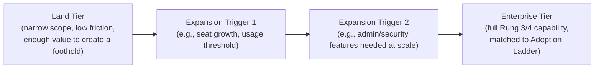

# Lesson 74: Land-and-Expand: Packaging for Enterprise Growth

## Why This Lesson Matters

Lessons 72 and 73 established that enterprise adoption moves through distinct rungs, each requiring engagement with a different stakeholder, and that a product can stall indefinitely at any given rung if the right capability or the right person hasn't been engaged. This lesson addresses a related but distinct question: how should a product's packaging and pricing structure itself be designed so that climbing the Enterprise Adoption Ladder is the natural, low-friction path, rather than a series of separate, high-effort renegotiations at every stage?

**Land-and-expand** is the go-to-market motion where a vendor deliberately enters an account with a small, low-friction initial purchase — a single team, a limited feature set, a small number of seats — and then grows that initial foothold into a much larger account over time, rather than attempting to sell the full, final scope of the relationship in one large, high-risk initial transaction. This motion is not merely a sales tactic bolted onto an otherwise unrelated product; it requires the product's actual packaging structure — what's included at each tier, what usage patterns naturally trigger an upgrade conversation — to be deliberately designed to support expansion, or the land-and-expand motion will stall regardless of how good the underlying sales strategy is.

This lesson introduces the Expansion Wedge, this lesson's core mental model, to give you a structured way to design packaging that creates natural, low-friction expansion triggers at each stage of the Enterprise Adoption Ladder, rather than packaging that either gives away too much value at the initial "land" stage to ever justify an upgrade, or that gates so much value behind higher tiers that the initial land never happens at all.

---

## Learning Path

| Field | Detail |
|---|---|
| **Module** | 8 — Advanced Strategy, Innovation & Enterprise/B2B Product Management |
| **Current Lesson** | 74 of 90 |
| **Difficulty** | 6 / 10 |
| **Estimated Study Time** | 40 minutes (reading) + 15 minutes (reflection + quiz) |
| **Prerequisites** | Lesson 72 (Enterprise Adoption Ladder), Lesson 73 (Stakeholder Compass), Lesson 48 (value-based pricing and packaging) |
| **Next Lesson** | Lesson 75 — Competitive Strategy and Moats |
| **Future Topics Unlocked** | Lesson 75 (Competitive Strategy), Lesson 79 (Pricing Strategy at Scale), Lesson 80 (Module Synthesis) — all depend on the Expansion Wedge introduced here |

---

## Learning Objectives

By the end of this lesson, you will be able to:

1. Explain why land-and-expand requires deliberate packaging design, not merely a sales strategy layered on top of arbitrary tiers.
2. Apply the Expansion Wedge to identify what should be included at an initial "land" tier versus reserved as an expansion trigger.
3. Distinguish seat-based, usage-based, and feature-gated expansion triggers and their respective trade-offs.
4. Identify the risk of a packaging structure that either over-serves or under-serves the initial land stage.
5. Evaluate a product's packaging tiers for whether they create natural expansion paths aligned with the Enterprise Adoption Ladder.

---

## Prerequisites

This lesson assumes the Enterprise Adoption Ladder from Lesson 72 and the Stakeholder Compass from Lesson 73, and the value-based pricing and packaging concepts from Lesson 48, since this lesson applies that general pricing discipline specifically to the enterprise land-and-expand context.

---

## Theory

### Why Land-and-Expand Requires Deliberate Packaging Design

A land-and-expand motion depends on an account's initial purchase being genuinely low-friction and low-risk, so that a Champion (per Lesson 73) can secure approval without needing to engage the full Stakeholder Compass immediately. This means the "land" tier must be scoped narrowly enough to avoid triggering full enterprise procurement, security review, or significant budget scrutiny — while still delivering enough genuine value that the initial user or team becomes a durable foothold rather than a one-time trial. Simultaneously, the packaging must include natural, well-defined points at which continued growth in usage, team size, or need for enterprise-specific capability creates a compelling, low-friction reason to expand the relationship — pushing the account up the Enterprise Adoption Ladder toward Rungs 2, 3, and 4. If either half of this design is wrong — the land tier too generous, or the expansion triggers too vague or too aggressive — the entire motion breaks down.

### The Expansion Wedge

This lesson introduces the **Expansion Wedge**, a model visualizing how packaging should widen from an initial low-friction entry point toward broader organizational adoption:

The Expansion Wedge's discipline is designing each trigger point deliberately, so that the reason to upgrade is a natural consequence of the account's own growing usage or organizational need, rather than an arbitrary, sales-imposed upsell unconnected to anything the customer is actually experiencing. A well-designed Expansion Trigger corresponds directly to a genuine constraint the customer runs into on their own — running out of seats, needing the administrative controls that become necessary at Rung 3 per Lesson 72, or requiring a security certification their own procurement process now demands — rather than a feature withheld somewhat arbitrarily simply to create upsell pressure.

### Seat-Based, Usage-Based, and Feature-Gated Triggers

Expansion triggers generally take one of three forms, each with different trade-offs. **Seat-based triggers** expand pricing as more individual users are added, aligning naturally with organic team growth but potentially creating friction if a customer feels penalized for broader internal adoption they'd otherwise want to encourage. **Usage-based triggers** expand pricing as consumption (API calls, data volume, transaction count) grows, aligning cost directly with value delivered but potentially creating unpredictable budgeting friction for the Economic Buyer role from Lesson 73. **Feature-gated triggers** reserve specific capabilities — often exactly the Rung 3 and 4 enterprise-readiness capabilities from Lesson 72, such as single sign-on, audit logging, or dedicated support SLAs — for higher tiers, creating a natural upgrade path precisely at the point an account's organizational maturity actually requires those capabilities. Most mature land-and-expand packaging structures combine more than one trigger type, since relying on a single trigger type alone can create either overly linear, predictable expansion (easy for a competitor to model and undercut) or overly unpredictable expansion (frustrating for the Economic Buyer to budget around).

### The Risk of Miscalibrated Land Tiers

A land tier that is **too generous** — including capabilities properly belonging to a higher tier, or allowing unlimited usage that should reasonably trigger an upgrade — gives away the very value that should justify expansion, leaving the vendor with a durable but permanently small foothold that never naturally grows. A land tier that is **too restrictive** — omitting capability genuinely needed even for basic initial adoption, or gating usage limits so aggressively that a Champion's own team can't get meaningful value during the trial or pilot phase — prevents the initial land from ever succeeding at all, since Lesson 72's Rung 1 requires the core product to deliver genuine standalone value before any expansion conversation becomes relevant.

---

## Common Beginner Mistakes

**Mistake 1: Designing packaging tiers around internal cost structure rather than natural customer expansion triggers**

Tiers organized around what's cheap or expensive for the vendor to provide, rather than around genuine points of customer growth or need, tend to feel arbitrary and create friction rather than a natural expansion path.

**Mistake 2: Making the land tier so generous that there's no compelling reason to ever upgrade**

Overly generous free or entry tiers can create a large, durable user base that never converts to a higher tier, since the packaging itself removed any natural pressure to expand.

**Mistake 3: Gating capability behind an enterprise tier that's actually needed even for Rung 1 or 2 adoption**

If basic usability requires features reserved for a much higher tier, the land motion itself may never succeed, since the Champion's team can't get sufficient value during initial adoption.

**Mistake 4: Relying on a single expansion trigger type exclusively**

Pure seat-based or pure usage-based pricing alone, without any feature-gated component tied to genuine enterprise-readiness needs, can create predictable, easily-undercut pricing or unpredictable, budget-unfriendly cost growth respectively.

**Mistake 5: Treating packaging design as a one-time decision rather than something to revisit as the Enterprise Adoption Ladder and Stakeholder Compass concepts suggest usage patterns evolve**

As accounts grow and organizational needs shift, previously well-calibrated expansion triggers can become outdated, either too easy or too difficult to reach.

---

## Mental Model: The Expansion Wedge

The Expansion Wedge introduced above is this lesson's core takeaway tool. When designing or evaluating packaging for land-and-expand growth, ask:

1. **Does the Land Tier deliver enough genuine standalone value** to succeed at Rung 1 of the Enterprise Adoption Ladder, without requiring capability that properly belongs to a higher tier?
2. **Are the Expansion Triggers tied to a genuine constraint the customer will naturally encounter** — seat growth, usage growth, or a specific enterprise-readiness need — rather than an arbitrary, sales-imposed withholding of value?
3. **Does the Enterprise Tier's included capability actually match what Rung 3 and 4 of the Adoption Ladder require** — security, administrative control, reliability, and integration, per Lesson 72 — rather than an arbitrary bundle of "premium" features unrelated to genuine organizational needs?
4. **Is the overall packaging combining more than one trigger type appropriately**, balancing predictability for the Economic Buyer against alignment with actual value delivered?

A packaging structure that can answer all four questions affirmatively is far more likely to support a genuine, low-friction land-and-expand motion than one designed primarily around internal cost considerations or an arbitrary sense of what "premium" should include.

---

## Real Company Example

Atlassian's packaging structure across products like Jira and Confluence, including publicly discussed free and low-cost tiers for small teams that scale into progressively more capable paid tiers as team size and organizational complexity grow, is widely cited as an example of deliberate land-and-expand packaging design. Public commentary on Atlassian's go-to-market approach describes a packaging structure where basic team collaboration functionality is available at low cost or no cost to support initial, low-friction adoption by individual teams, while capabilities specifically aligned with enterprise readiness — advanced administrative controls, enhanced security features, and dedicated support — are reserved for higher tiers that naturally become relevant as an account's organizational scale and needs grow, closely mirroring both the Enterprise Adoption Ladder from Lesson 72 and the Expansion Wedge introduced in this lesson.

**Assumption flagged:** the specifics of Atlassian's internal packaging strategy rationale and pricing tier design decisions described here are drawn from public commentary, published pricing pages, and industry reporting, not confirmed internal company statements, and should be treated as illustrative rather than verified fact.

---

## Real World Perspective: Land-and-Expand: Packaging for Enterprise Growth at Different Company Stages

**Startup:** Early-stage B2B companies typically design an initial, relatively simple two-tier structure (a free or low-cost entry tier and a single paid tier) focused primarily on achieving Rung 1 and 2 success, since detailed Expansion Wedge design across many tiers can represent premature optimization before there's evidence of what natural expansion points actual customers encounter.

**Mid-size company:** This is typically where a more deliberate, multi-trigger Expansion Wedge becomes a genuine priority, as a growing base of Rung 2 accounts creates real data about what usage patterns and organizational needs naturally precede a Rung 3 upgrade conversation, informing more precise trigger placement than could be guessed at the earliest stage.

**Big Tech:** Mature enterprise vendors typically maintain sophisticated, frequently-revisited packaging structures with multiple combined trigger types, informed by extensive usage data across a large existing customer base, and often supported by dedicated pricing and packaging teams whose specific job is continuously calibrating trigger points as customer behavior and competitive dynamics evolve.

---

## Detailed Case Study: The Land That Never Expanded

A B2B project collaboration startup launched with a single, generously-scoped free tier: unlimited team members, unlimited projects, and nearly the entire feature set the company had built, with the stated rationale that broad, frictionless adoption would build a large user base the company could later monetize. Adoption was, indeed, strong — the free tier spread organically across many teams within numerous companies, generating exactly the kind of grassroots Rung 1 and 2 traction described in Lesson 72.

The problem became apparent roughly eighteen months later: despite widespread usage, the company's paid conversion rate remained extremely low, and analysis of usage patterns revealed why. The free tier had never actually created a natural constraint that any meaningful fraction of users encountered — unlimited seats meant teams never ran into a seat-based trigger, and the nearly-complete feature set meant there was no compelling functional reason to upgrade even as teams grew larger and more organizationally established. The very features that would typically define an enterprise tier — administrative controls, security certifications, audit logging — had never been built at all, since the company had never designed an Expansion Wedge that anticipated needing them, having assumed broad free adoption alone would eventually convert to revenue through some mechanism the original packaging design never actually specified.

**What went wrong?** Using the Expansion Wedge, the failure is precise: the Land Tier was calibrated so generously that it eliminated every natural expansion trigger before it could form, and no genuine Enterprise Tier had ever been designed to correspond to Rung 3 and 4 needs. The company had achieved genuinely strong Rung 1 and 2 adoption, mistaking that adoption itself for evidence of a working business model, without ever building the packaging structure or the enterprise-readiness capabilities that Rung 3 progression, per Lesson 72, actually requires.

The company's recovery involved a difficult, customer-relations-sensitive process of introducing seat limits and gating select administrative features behind a new paid tier for existing free users — a significantly harder transition than designing appropriate triggers from the outset would have been — while simultaneously building out the security and administrative capabilities an Enterprise Tier genuinely required, a sequencing lesson this curriculum will connect to the broader pricing negotiation dynamics formalized in Lesson 79.

---

## Framework Explanation: The Packaging Design Checklist

Before finalizing a land-and-expand packaging structure, a PM can use the following checklist:

| Checklist Item | Question to Ask | Risk if Skipped |
|---|---|---|
| Land Tier Sufficiency | Does the entry tier deliver enough genuine value for Rung 1 success on its own? | The initial land motion never succeeds, since the product fails to prove standalone value |
| Land Tier Restraint | Does the entry tier withhold enough value to preserve a natural reason to expand? | A large, durable user base forms that never converts, as in the Case Study |
| Trigger Alignment | Is each expansion trigger tied to a genuine constraint the customer naturally encounters? | Upsell attempts feel arbitrary and create sales friction rather than natural progression |
| Enterprise Tier Fit | Does the top tier's included capability actually match Rung 3/4 enterprise-readiness needs from Lesson 72? | The enterprise tier fails to satisfy the Technical Evaluator and Economic Buyer roles from Lesson 73 |
| Trigger Type Balance | Does the packaging combine seat-based, usage-based, and feature-gated triggers appropriately? | Reliance on a single trigger type creates either easily-undercut or budget-unfriendly pricing |

A "no" on Land Tier Restraint should be treated with particular concern given the Case Study — a packaging structure that seems successful by adoption metrics alone can still be failing at its actual business purpose if it never creates a path to expansion.

---

## Interview Perspective: How Interviewers Think About This

**"How would you design a pricing and packaging structure to support a land-and-expand go-to-market motion?"** The interviewer is evaluating whether you propose something resembling the Expansion Wedge — a deliberately scoped land tier with genuine expansion triggers tied to natural customer growth — rather than an arbitrary set of tiers organized around internal cost or a generic sense of "premium."

**"What's the risk of making a free or entry-level tier too generous?"** The interviewer is testing whether you recognize the Land That Never Expanded failure mode: strong adoption metrics that mask the absence of any genuine path to monetization.

**"How would you decide which features belong in an enterprise tier versus a lower tier?"** The interviewer is listening for a connection back to the Enterprise Adoption Ladder from Lesson 72, specifically whether you reserve Rung 3/4 capabilities (security, admin control, reliability, integration) for the enterprise tier rather than an arbitrary bundle of unrelated "premium" features.

---

## Summary

Land-and-expand is not simply a sales strategy layered on top of arbitrary packaging tiers; it requires the packaging structure itself to be deliberately designed so that an initial, low-friction land succeeds on its own merits while creating genuine, natural triggers for expansion as an account's usage and organizational needs grow. The Expansion Wedge — Land Tier, sequential Expansion Triggers, and an Enterprise Tier matched to Rungs 3 and 4 of the Enterprise Adoption Ladder from Lesson 72 — provides a structured way to design this progression, with expansion triggers ideally combining seat-based, usage-based, and feature-gated mechanisms tied to genuine customer constraints rather than arbitrary upsell pressure. A packaging structure that miscalibrates the Land Tier in either direction — too generous, eliminating any reason to expand, or too restrictive, preventing the initial land from succeeding at all — undermines the entire motion regardless of sales execution quality, and a Land Tier that is too generous can produce the particularly deceptive failure mode illustrated in this lesson's Case Study: genuinely strong adoption metrics that mask the complete absence of a working path to revenue expansion.

---

## Key Takeaways

- Land-and-expand requires deliberate packaging design, not merely a sales strategy applied to arbitrary tiers.
- The Expansion Wedge structures packaging as a Land Tier, sequential Expansion Triggers, and an Enterprise Tier matched to the Enterprise Adoption Ladder's Rungs 3 and 4.
- Expansion triggers should be tied to genuine customer constraints — seat growth, usage growth, or specific enterprise-readiness needs — rather than arbitrary withholding of value.
- Seat-based, usage-based, and feature-gated triggers each carry distinct trade-offs, and mature packaging typically combines more than one type.
- A Land Tier that is too generous eliminates the natural pressure to expand, producing strong adoption metrics that mask a failing business model.
- A Land Tier that is too restrictive prevents the initial land motion from succeeding at all, since Rung 1 requires genuine standalone value.
- The Enterprise Tier's included capability should specifically match Rung 3 and 4 enterprise-readiness needs, not an arbitrary bundle of unrelated "premium" features.

---

## Cheat Sheet

*A two-minute review of everything in this lesson.*

- Land-and-expand needs deliberate packaging design, not just a sales script.
- Expansion Wedge: Land Tier → Expansion Triggers → Enterprise Tier (matched to Adoption Ladder Rungs 3/4).
- Triggers should reflect genuine customer constraints, not arbitrary withholding.
- Combine seat-based, usage-based, and feature-gated triggers — don't rely on just one.
- Watch for the Land That Never Expanded trap: strong adoption ≠ a working expansion path.

---

## Glossary

| Term | Definition | Related Concepts | Difficulty |
|---|---|---|---|
| Land-and-Expand | A go-to-market motion entering an account with a small initial purchase, then growing it over time | Enterprise Adoption Ladder (Lesson 72) | 1 |
| Expansion Wedge | A model structuring packaging as a Land Tier, sequential Expansion Triggers, and an Enterprise Tier | Enterprise Adoption Ladder | 2 |
| Seat-Based Trigger | An expansion trigger tied to the number of individual users added | Expansion Wedge | 1 |
| Usage-Based Trigger | An expansion trigger tied to consumption volume (API calls, data, transactions) | Expansion Wedge | 1 |
| Feature-Gated Trigger | An expansion trigger tied to access to specific capabilities reserved for higher tiers | Expansion Wedge, Enterprise Readiness (Lesson 72) | 2 |
| Packaging Design Checklist | A five-item checklist evaluating whether packaging supports a genuine land-and-expand motion | Expansion Wedge | 2 |

---

## Further Reading / Resources

- Madhavan Ramanujam and Georg Tacke, *Monetizing Innovation*
- Winning by Design (Jacco van der Kooij and Fernando Pizarro), *The SaaS Sales Method*
- Geoffrey Moore, *Crossing the Chasm*

---

## Flashcards

**Card 1**
- Front: ** Why does land-and-expand require deliberate packaging design, not just a sales strategy?
- Back: ** The initial land must be low-friction and deliver genuine standalone value, while the packaging must also create natural expansion triggers — both require intentional structure, not just sales execution.
- Difficulty: 2
- Tags: **, land-and-expand, core-concept

**Card 2**
- Front: ** Name the three parts of the Expansion Wedge.
- Back: ** Land Tier, Expansion Triggers, Enterprise Tier.
- Difficulty: 2
- Tags: **, expansion-wedge

**Card 3**
- Front: ** Name the three types of expansion triggers.
- Back: ** Seat-based, usage-based, and feature-gated.
- Difficulty: 2
- Tags: **, expansion-triggers

**Card 4**
- Front: ** What risk does an overly generous Land Tier create?
- Back: ** It eliminates the natural pressure to expand, producing strong adoption metrics that mask a failing business model, as in the Land That Never Expanded case study.
- Difficulty: 2
- Tags: **, land-tier-risk

**Card 5**
- Front: ** What risk does an overly restrictive Land Tier create?
- Back: ** It prevents the initial land motion from succeeding at all, since Rung 1 of the Enterprise Adoption Ladder requires genuine standalone value.
- Difficulty: 2
- Tags: **, land-tier-risk

**Card 6**
- Front: ** Why should Enterprise Tier capability match Rung 3/4 needs specifically, rather than an arbitrary "premium" bundle?
- Back: ** Because the Enterprise Tier must satisfy the Technical Evaluator and Economic Buyer roles from Lesson 73, whose actual needs are security, admin control, reliability, and integration.
- Difficulty: 2
- Tags: **, enterprise-tier-fit

**Card 7**
- Front: ** What went wrong in the Land That Never Expanded case study?
- Back: ** The free tier had unlimited seats and nearly the full feature set, eliminating every natural expansion trigger, and no genuine enterprise tier or enterprise-readiness capability had ever been built.
- Difficulty: 2
- Tags: **, case-study, expansion-wedge

## Reflection Exercise

You are the PM for a B2B customer support software company currently offering a single, all-inclusive paid tier with per-seat pricing. Growth has plateaued, and sales feedback suggests prospective customers find the current single tier's price point too high for smaller teams to justify, while existing large customers have expressed interest in more advanced administrative and security features the current tier doesn't offer.

There is no single correct answer to the prompts below — the goal is to practice applying the Expansion Wedge and the Packaging Design Checklist to redesign a stalled packaging structure.

1. Using the Expansion Wedge, how might you restructure the current single tier into a Land Tier, Expansion Triggers, and an Enterprise Tier?
2. What specific capability, currently included in the single tier, might reasonably be reserved for a higher tier to serve as a genuine expansion trigger?
3. Which trigger type (seat-based, usage-based, feature-gated) seems most natural for this customer support product, and why?
4. How would you design the Enterprise Tier specifically to satisfy the Technical Evaluator and Economic Buyer roles from Lesson 73, given the interest in advanced administrative and security features?
5. What risks would you want to manage carefully when transitioning existing customers from the current single tier to a new multi-tier structure?

---

## Quiz

**1. Why does land-and-expand require deliberate packaging design rather than just a sales strategy?**
A) Sales strategy alone is always sufficient regardless of packaging structure
B) The packaging itself must create a low-friction land and genuine natural expansion triggers, both requiring intentional structure
C) Packaging design has no meaningful relationship to go-to-market motion
D) Land-and-expand only applies to consumer products, not B2B products

*Correct answer: B*
*Explanation: The lesson's central argument is that packaging structure, not sales execution alone, determines whether land-and-expand actually works.*
*Learning objective tested: #1*
*Difficulty: Easy*

---

**2. What are the three components of the Expansion Wedge?**
A) Marketing, Sales, Support
B) Land Tier, Expansion Triggers, Enterprise Tier
C) Free, Paid, Premium
D) Trial, Subscription, Renewal

*Correct answer: B*
*Explanation: These three components structure the packaging progression introduced in the Theory section.*
*Learning objective tested: #2*
*Difficulty: Easy*

---

**3. What is a seat-based expansion trigger?**
A) A trigger based on API call volume
B) A trigger where pricing expands as more individual users are added
C) A trigger based on access to specific premium features
D) A trigger unrelated to any measurable customer behavior

*Correct answer: B*
*Explanation: Seat-based triggers specifically expand pricing in proportion to the number of individual users added.*
*Learning objective tested: #3*
*Difficulty: Easy*

---

**4. What is a key trade-off of usage-based triggers, according to this lesson?**
A) They never align cost with value delivered
B) They align cost directly with value delivered but can create unpredictable budgeting friction for the Economic Buyer
C) They are always easier for customers to predict than seat-based triggers
D) They cannot be combined with any other trigger type

*Correct answer: B*
*Explanation: The Theory section explicitly identifies this trade-off between value alignment and budgeting predictability.*
*Learning objective tested: #3*
*Difficulty: Easy*

---

**5. What risk does an overly generous Land Tier create?**
A) It always prevents the initial land motion from succeeding
B) It eliminates the natural pressure to expand, potentially producing strong adoption metrics that mask a failing business model
C) It has no meaningful impact on long-term revenue growth
D) It always leads to immediate customer churn

*Correct answer: B*
*Explanation: This is the exact failure mode illustrated in the Land That Never Expanded case study.*
*Learning objective tested: #4*
*Difficulty: Easy*

---

**6. What risk does an overly restrictive Land Tier create?**
A) It always leads to excessive revenue growth
B) It can prevent the initial land motion from succeeding at all, since Rung 1 of the Enterprise Adoption Ladder requires genuine standalone value
C) It has no meaningful relationship to Rung 1 adoption
D) It only affects Enterprise Tier customers, not initial land-stage customers

*Correct answer: B*
*Explanation: An overly restrictive land tier prevents the core product from delivering the standalone value Rung 1 requires.*
*Learning objective tested: #4*
*Difficulty: Easy*

---

**7. In the Case Study, what specifically caused the low paid conversion rate despite strong free-tier adoption?**
A) The product had poor core functionality
B) The free tier had unlimited seats and nearly the full feature set, eliminating every natural expansion trigger before it could form
C) The sales team failed to market the paid tier at all
D) Customers were unaware the paid tier existed

*Correct answer: B*
*Explanation: The case study's root cause was a packaging design failure, not a product quality or awareness issue.*
*Learning objective tested: #4, #5*
*Difficulty: Medium*

---

**8. Why should Enterprise Tier capability match Rung 3/4 needs from Lesson 72 specifically?**
A) Rung 3/4 needs are irrelevant to enterprise tier design
B) The Enterprise Tier must satisfy the Technical Evaluator and Economic Buyer roles, whose actual needs are security, admin control, reliability, and integration
C) Enterprise Tier design should be based purely on what's cheapest for the vendor to provide
D) Rung 1 and 2 needs are more important than Rung 3/4 needs for Enterprise Tier design

*Correct answer: B*
*Explanation: The lesson explicitly connects Enterprise Tier design to satisfying the specific stakeholder roles and adoption rung requirements established in Lessons 72 and 73.*
*Learning objective tested: #3, #5*
*Difficulty: Medium*

---

**9. According to the Packaging Design Checklist, what does a "no" on Land Tier Restraint indicate?**
A) A minor issue with no significant business impact
B) A packaging structure that can appear successful by adoption metrics while never creating a path to expansion, as in the Case Study
C) That the packaging structure is ready to launch as-is
D) That the Land Tier is too restrictive rather than too generous

*Correct answer: B*
*Explanation: The lesson specifically warns that this gap can mask a failing business model behind seemingly strong adoption numbers.*
*Learning objective tested: #4, #5*
*Difficulty: Medium*

---

**10. Why might early-stage B2B companies reasonably start with a simple two-tier packaging structure, per the Real World Perspective section?**
A) Simple structures are always superior regardless of company stage
B) Detailed Expansion Wedge design across many tiers can represent premature optimization before there's evidence of natural customer expansion points
C) Two-tier structures are legally required for early-stage companies
D) Multi-tier structures are technically impossible to implement at any company size

*Correct answer: B*
*Explanation: The Real World Perspective section frames simple early-stage packaging as a reasonable trade-off given limited data on actual expansion patterns.*
*Learning objective tested: #1*
*Difficulty: Medium*

---

**11. What typically becomes possible for mid-size companies designing a more deliberate Expansion Wedge, per the Real World Perspective section?**
A) Access to unlimited engineering resources
B) Real usage data from a growing base of Rung 2 accounts, informing more precise trigger placement than could be guessed earlier
C) Complete independence from any customer feedback
D) The ability to skip Rung 1 and 2 entirely

*Correct answer: B*
*Explanation: The Real World Perspective section describes this data-informed trigger design as characteristic of the mid-size company stage.*
*Learning objective tested: #1*
*Difficulty: Medium*

---

**12. (Scenario) A company's packaging includes unlimited usage and nearly all features in its lowest tier, with only a small price increase for a "premium" tier offering minor cosmetic customization. What packaging design flaw does this most likely represent?**
A) A well-designed Expansion Wedge with appropriate triggers
B) A Land Tier likely too generous, with an Enterprise Tier that doesn't correspond to genuine Rung 3/4 needs
C) An appropriately restrictive Land Tier
D) A packaging structure with no identifiable flaws

*Correct answer: B*
*Explanation: Both halves of the Expansion Wedge appear miscalibrated here: an overly generous land tier and an enterprise tier not aligned with genuine enterprise-readiness needs.*
*Learning objective tested: #4, #5*
*Difficulty: Medium-Hard*

---

**13. (Product Thinking) A PM is evaluating whether to gate a specific administrative feature behind a higher pricing tier. Using this lesson's frameworks, what is the most relevant question to ask?**
A) Whether the feature is expensive for the company to build
B) Whether the feature corresponds to a genuine constraint or need customers naturally encounter as they grow, such as a Rung 3 enterprise-readiness requirement
C) Whether competitors have ever offered a similar feature
D) Whether the feature was requested by the engineering team

*Correct answer: B*
*Explanation: The Expansion Wedge's core discipline ties feature-gating decisions to genuine customer constraints and adoption-ladder needs, not internal cost or arbitrary competitive comparison.*
*Learning objective tested: #2, #3, #5*
*Difficulty: Hard*

---

**14. (Interview Reasoning) A candidate, asked how they'd design a free tier, focuses entirely on maximizing adoption metrics with no mention of expansion triggers or eventual monetization path. What does this most likely signal, per the Interview Perspective section?**
A) A strong and complete understanding of packaging design
B) A gap in recognizing the risk of an overly generous land tier eliminating any natural path to expansion
C) That the candidate is ready for a senior pricing strategy role immediately
D) Nothing meaningful; adoption metrics are the only relevant consideration for free tier design

*Correct answer: B*
*Explanation: The Interview Perspective section specifically listens for recognition of the Land That Never Expanded risk, which this answer omits entirely.*
*Learning objective tested: #4, #5*
*Difficulty: Hard*

---

**15. (Product Thinking, Highest Difficulty) A company's current single-tier packaging has plateaued, with smaller prospects finding the price too high and larger existing customers wanting more advanced administrative and security capability. Using only the frameworks in this lesson, what is the most defensible packaging redesign approach?**
A) Lower the single tier's price for everyone, without adding any additional tiers or capability
B) Restructure into a Land Tier appropriately scoped for smaller teams, sequential Expansion Triggers tied to genuine growth signals, and an Enterprise Tier specifically built around Rung 3/4 administrative and security needs
C) Eliminate the product's free or low-cost options entirely to focus only on the largest accounts
D) Add an arbitrary "premium" tier with cosmetic features unrelated to genuine customer needs

*Correct answer: B*
*Explanation: This mirrors the Reflection Exercise: the correct response designs a full Expansion Wedge addressing both ends of the current plateau — an appropriately scoped land tier for smaller prospects and a genuinely needs-aligned enterprise tier for larger customers — rather than a single-dimension price change or an arbitrary tier addition.*
*Learning objective tested: #2, #3, #4, #5*
*Difficulty: Hard*

---

## Connections

| | Lesson | Core Idea Carried Forward |
|---|---|---|
| **Previous Lesson** | Lesson 73 — Selling to Committees: Buyer vs. User in B2B | Uses the Stakeholder Compass to inform which packaging tier must satisfy which stakeholder role's success criteria |
| **Current Lesson** | Lesson 74 — Land-and-Expand: Packaging for Enterprise Growth | Expansion Wedge; Land Tier calibration; expansion trigger types; Packaging Design Checklist |
| **Next Lesson** | Lesson 75 — Competitive Strategy and Moats | Shifts from internal packaging design to external competitive positioning and defensibility |
| **Future Concepts Unlocked** | Lesson 79 (Pricing Strategy at Scale) | Extends packaging trigger design into full enterprise pricing negotiation and contract structuring |
| | Lesson 80 (Module Synthesis) | Treats the Expansion Wedge as established canon alongside the Enterprise Adoption Ladder and Stakeholder Compass for Module 8's closing synthesis |

This curriculum continues to build as one continuous argument. From this lesson forward, any reference to enterprise packaging or pricing tiers assumes you can evaluate it through the Expansion Wedge without re-explanation.
