# Lesson 75: Competitive Strategy and Moats

## Why This Lesson Matters

The last four lessons of Module 8 have focused inward — on how a company structures its own bets, its own enterprise readiness, its own stakeholder engagement, its own packaging. This lesson turns the lens outward, toward the competitive landscape a product actually operates in, and toward a specific, frequently misused piece of business vocabulary: the **moat**, a durable structural advantage that protects a company's market position from competitors over time.

The word "moat" gets thrown around loosely in product and strategy conversations, often applied to anything a company is currently good at, regardless of whether that advantage would actually survive sustained competitive pressure. A large user base is not automatically a moat. Being first to market is not automatically a moat. A well-liked brand is not automatically a moat. Each of these can be a genuine component of a moat under the right conditions, but none of them is automatically durable, and a PM who conflates "we're currently ahead" with "we have a structural advantage that will keep us ahead" is prone to a specific, costly overconfidence: failing to notice a competitor who is quietly building genuine structural advantage while the incumbent coasts on an advantage that was never as durable as assumed.

This lesson introduces the Moat Durability Matrix, this lesson's core mental model, to give you a structured way to distinguish genuine, durable competitive advantage from a temporary lead that merely looks like one.

---

## Learning Path

| Field | Detail |
|---|---|
| **Module** | 8 — Advanced Strategy, Innovation & Enterprise/B2B Product Management |
| **Current Lesson** | 75 of 90 |
| **Difficulty** | 7 / 10 |
| **Estimated Study Time** | 40 minutes (reading) + 15 minutes (reflection + quiz) |
| **Prerequisites** | Lesson 63 (cross-side network effects, marketplace liquidity), Lesson 71 (Strategy Cascade, falsifiable bets) |
| **Next Lesson** | Lesson 76 — M&A and Product Integration |
| **Future Topics Unlocked** | Lesson 76 (M&A and Product Integration), Lesson 78 (Build, Buy, or Partner), Lesson 80 (Module Synthesis) — all depend on the Moat Durability Matrix introduced here |

---

## Learning Objectives

By the end of this lesson, you will be able to:

1. Explain why a current market advantage is not automatically a durable competitive moat.
2. Apply the Moat Durability Matrix to categorize a competitive advantage by replication difficulty and erosion risk.
3. Identify the five common categories of competitive moat: network effects, switching costs, economies of scale, brand and trust, and proprietary assets.
4. Distinguish genuine structural moats from advantages that merely look durable in the short term.
5. Evaluate a company's stated competitive advantage for whether it would survive sustained, well-resourced competitive pressure.

---

## Prerequisites

This lesson assumes the cross-side network effect and marketplace liquidity concepts from Lesson 63, since network effects are one of the primary categories of moat this lesson examines, and the falsifiable-bet discipline from Lesson 71, since evaluating a moat's genuine durability requires the same rigor as evaluating any other strategic claim.

---

## Theory

### Why a Current Advantage Is Not Automatically a Moat

A **moat**, in the strategic sense this lesson uses, is a structural characteristic of a business that makes it difficult for competitors to replicate its position, even when those competitors have comparable resources, talent, and motivation to do so. This is a meaningfully stronger claim than simply being ahead right now. A company can be the current market leader in usage, revenue, or brand recognition while possessing no genuine moat at all, if that leadership position rests entirely on factors — first-mover timing, temporary underinvestment by competitors, a fashionable brand moment — that a well-resourced competitor could, in principle, replicate or overcome given sufficient time and investment. Genuine moats specifically resist this kind of replication, not merely because competitors haven't tried yet, but because of some structural feature of the business that makes replication difficult even when competitors do try.

### The Moat Durability Matrix

This lesson introduces the **Moat Durability Matrix**, plotting a competitive advantage along two dimensions: how difficult it would be for a well-resourced competitor to replicate, and how quickly the advantage naturally erodes without active defense.

```mermaid
%%{init: {
  "theme": "dark",
  "themeVariables": {
    "background": "#0b0b0c",
    "primaryColor": "#1f1f23",
    "primaryTextColor": "#ffffff",
    "primaryBorderColor": "#8b5cf6",
    "lineColor": "#d1d5db",
    "secondaryColor": "#18181b",
    "tertiaryColor": "#111111",
    "mainBkg": "#1f1f23",
    "nodeBorder": "#8b5cf6",
    "clusterBkg": "#000000",
    "clusterBorder": "#27272a",
    "titleColor": "#ffffff",
    "edgeLabelBackground": "#0b0b0c",
    "nodeTextColor": "#ffffff",
    "edgeLabelColor": "#ffffff",
    "actorBorder": "#8b5cf6",
    "actorBkg": "#1f1f23",
    "actorTextColor": "#ffffff",
    "sequenceNumberColor": "#ffffff",
    "signalColor": "#8b5cf6",
    "signalTextColor": "#ffffff",
    "textColor": "#ffffff",
    "classText": "#ffffff",
    "classBorder": "#8b5cf6",
    "classBkg": "#1f1f23"
  }
}}%%
graph TD
    A["High Replication Difficulty +<br/>Low Erosion Risk<br/>(genuine, durable moat)"] 
    B["High Replication Difficulty +<br/>High Erosion Risk<br/>(requires active, ongoing defense)"]
    C["Low Replication Difficulty +<br/>Low Erosion Risk<br/>(comfortable but vulnerable to a well-resourced entrant)"]
    D["Low Replication Difficulty +<br/>High Erosion Risk<br/>(not a real moat at all)"]
```

The Matrix's discipline is placing a claimed competitive advantage honestly into one of these four positions, rather than assuming any current advantage automatically belongs in the top-left, most favorable position. An advantage in quadrant D — easy to replicate and naturally eroding — should not be described internally as a "moat" at all, however comfortable the company's current position feels, since that language creates a dangerous false sense of security about the durability of the underlying advantage.

### The Five Common Categories of Moat

**Network effects**, directly connected to Lesson 63's cross-side network effect discussion, create a moat when a product's value to each user increases with the number of other users, making it structurally difficult for a competitor to match the value proposition without first achieving comparable scale — though, as this lesson's Case Study will show, network effects are more fragile than commonly assumed when users can easily use multiple competing platforms simultaneously. **Switching costs** create a moat when a customer's investment in learning, integrating, or customizing a product makes moving to a competitor genuinely costly, independent of whether the competitor's product is otherwise comparable or even superior. **Economies of scale** create a moat when a company's larger size allows it to operate at a lower per-unit cost than smaller competitors can match, allowing sustained price or margin advantages. **Brand and trust** create a moat when customers' confidence in a company, built over time through consistent delivery, creates a genuine preference that a functionally comparable but unfamiliar competitor cannot easily overcome, particularly in categories where trust carries significant weight, such as financial services or healthcare. **Proprietary assets** — patents, exclusive data, unique regulatory approvals, or exclusive access to a critical resource — create a moat when competitors are legally, technically, or practically prevented from replicating a specific capability regardless of their resources.

### Why Network Effects Are More Fragile Than Commonly Assumed

Network effects are frequently treated as the strongest, most unassailable category of moat, but this reputation deserves scrutiny. **Multi-homing** — a user's ability to use multiple competing platforms simultaneously without significant cost — substantially weakens a network effect's defensive power, since a user who can easily maintain a presence on both an incumbent and a new entrant doesn't need the incumbent's network to remain their exclusive choice, undermining the "must join the biggest network" logic network effects are supposed to provide. A network effect moat is strongest specifically in contexts where multi-homing is costly or impractical, and considerably weaker in contexts where users can and do participate in multiple competing networks with minimal friction.

---

## Common Beginner Mistakes

**Mistake 1: Describing any current market leadership position as a "moat" without examining its structural durability**

Being ahead currently is not evidence of a genuine moat, and the two claims should not be conflated.

**Mistake 2: Treating network effects as automatically the strongest, most durable moat category**

Network effects are significantly weakened by multi-homing, and their strength depends heavily on the specific competitive context, not the mere presence of a network.

**Mistake 3: Assuming a moat, once established, requires no ongoing investment to maintain**

Quadrant B of the Moat Durability Matrix — high replication difficulty but high erosion risk — describes real moats that still require active, ongoing defense rather than passive assumption of permanence.

**Mistake 4: Overestimating switching costs from the vendor's own perspective rather than the customer's**

A switching cost that feels significant to the vendor (extensive integration work, customized configuration) may feel much smaller to a customer facing genuine dissatisfaction, particularly if a competitor offers migration assistance.

**Mistake 5: Conflating brand recognition with brand trust as a moat**

Widespread awareness of a brand is not the same as customer trust deep enough to resist a comparable competitor's offer, and the two should be evaluated separately.

---

## Mental Model: The Moat Durability Matrix

The Moat Durability Matrix introduced above is this lesson's core takeaway tool. When evaluating any claimed competitive advantage, ask:

1. **How difficult would this advantage genuinely be for a well-resourced competitor to replicate**, not merely how difficult it has been for competitors who haven't yet tried seriously?
2. **How quickly would this advantage erode without active, ongoing defense**, rather than assuming a currently favorable position is self-sustaining?
3. **Which quadrant does this advantage honestly occupy**, and does the company's actual strategic behavior match the quadrant's real requirements — active defense for quadrant B, appropriate humility about vulnerability for quadrant C, and no false confidence at all for quadrant D?

A company that runs its claimed competitive advantages through this Matrix honestly is far less likely to be caught by surprise when a well-resourced competitor successfully challenges a position that was never as structurally protected as internal narrative assumed.

---

## Real Company Example

**Kodak**'s collapse is one of the most rigorously documented moat-failure stories available, studied in a peer-reviewed *sciencedirect*-published analysis of the company's response to digital photography, and it illustrates a sharper, more specific failure mode than "a moat eroded over time": Kodak's own engineer, Steven Sasson, built the first working digital camera in 1975 — inside Kodak itself. The company's moat at the time rested on its dominance of film and film processing, a genuinely durable, hard-to-replicate position for decades. But that same moat became the reason Kodak could not act on its own invention: internal leadership reportedly viewed digital photography as a threat to the immensely profitable film business rather than its natural successor, and the company spent years managing digital photography's rollout to protect film revenue rather than aggressively cannibalizing its own moat before a competitor could.

This is a sharper case than a company simply facing new entrants, because Kodak's moat didn't erode from outside pressure the way a company facing a well-funded new competitor does — it became a structural disincentive to adopt the very technology the company itself had pioneered. A moat evaluated only on durability (how hard is this to replicate?) can miss the more dangerous failure mode this lesson should also flag: a moat can actively blind the company that holds it to its own most threatening innovation, because defending the moat and building its replacement become organizationally opposed goals.

*(Source: peer-reviewed analysis published via ScienceDirect, "Disruptive technology: How Kodak missed the digital photography revolution," corroborated by widely reported accounts of Sasson's 1975 invention.)*

---

## Real World Perspective: Competitive Strategy and Moats at Different Company Stages

**Startup:** Early-stage companies typically have no genuine moat at all in the strong sense this lesson describes, and claiming otherwise can create dangerous overconfidence; the honest early-stage strategic priority is usually building toward a genuine moat (a specific switching cost, a proprietary data advantage, an emerging network effect) rather than assuming one already exists.

**Mid-size company:** This is typically where a company's actual moat, if one exists, first becomes empirically testable, as competitors with real resources begin attempting to challenge the company's position directly, revealing whether the previously assumed advantage was genuinely structural or merely a temporary lead.

**Big Tech:** Large, established companies typically maintain multiple overlapping moat categories simultaneously (scale economies, proprietary data, network effects, brand trust), and competitive strategy at this scale often focuses on actively reinforcing and defending existing moats against erosion, per quadrant B of the Matrix, rather than establishing entirely new categories of advantage from scratch.

---

## Detailed Case Study: The Multi-Homed Marketplace

A B2B software marketplace connecting freelance specialists with client businesses believed it had built a durable network-effect moat: a large, established base of both freelancers and clients, with internal leadership frequently describing the marketplace's scale as an unassailable advantage that would be prohibitively difficult for any new entrant to replicate. Growth had been strong for several years, and the company's strategic planning assumed this network-effect moat would continue to protect its market position indefinitely with minimal additional defensive investment.

A new, well-funded competitor entered the market focusing specifically on a narrower, higher-quality segment of specialized freelancers, offering a superior vetting and matching experience. Rather than attempting to build a comparably large network from scratch — which would indeed have been difficult — the new entrant recognized that both freelancers and client businesses could easily **multi-home**: a freelancer could maintain a profile on both platforms simultaneously with minimal cost, and a client business could post a project on both platforms and simply choose whichever produced a better match. Within roughly a year, a meaningful fraction of the incumbent's most active, highest-quality freelancers had begun multi-homing onto the new platform, and client businesses following that quality signal began shifting a portion of their business to the new entrant as well, without ever fully abandoning the original platform.

**What went wrong?** Using the Moat Durability Matrix, the failure is precise: the incumbent had assumed its network effect sat firmly in the most favorable quadrant — high replication difficulty, low erosion risk — without examining the specific competitive dynamics of its own market, where multi-homing was genuinely low-cost for both sides of the marketplace. The advantage was real and did make replicating the incumbent's *total scale* difficult, but it did not prevent a competitor from successfully capturing a meaningful, valuable slice of the same participants through multi-homing, which is precisely the erosion mechanism network-effect moats are most vulnerable to whenever switching or dual-participation costs are low.

The company's recovery involved investing directly in reducing the appeal of multi-homing — introducing exclusivity incentives for top-tier freelancers, improving matching quality specifically to compete on the dimension the new entrant had targeted, and more honestly recalibrating internal strategic planning to recognize the network effect as sitting in quadrant B (requiring active, ongoing defense) rather than quadrant A (assumed permanent and requiring no defense) — a recalibration that connects directly to the build-versus-buy-versus-partner decisions formalized in Lesson 78.

---

## Framework Explanation: The Competitive Moat Audit Checklist

Before describing any advantage internally as a genuine "moat," a PM or strategy team can use the following checklist:

| Moat Category | Diagnostic Question | Red Flag |
|---|---|---|
| Network Effects | Is multi-homing genuinely costly or impractical for participants on either side? | Participants can easily use a competing platform simultaneously with minimal friction |
| Switching Costs | Would a genuinely dissatisfied customer still find switching prohibitively costly, from their own perspective? | Switching costs are assumed to be high based on the vendor's internal view, not tested from the customer's perspective |
| Economies of Scale | Does the company's scale actually translate into a meaningful, sustained per-unit cost advantage over credible competitors? | Scale exists but has not been shown to produce a genuine cost or margin advantage |
| Brand and Trust | Does the brand advantage reflect deep customer trust, not merely broad awareness or recognition? | Brand strength is measured only by awareness metrics, not by resistance to a comparable competitor's offer |
| Proprietary Assets | Is the asset (data, patent, exclusive access) genuinely difficult for a well-resourced competitor to replicate or work around? | The "proprietary" asset could plausibly be replicated or substituted with sufficient investment |

A moat claim that fails its category's specific diagnostic question should be treated with significant skepticism, regardless of how confidently it is asserted in internal strategic planning documents.

---

## Interview Perspective: How Interviewers Think About This

**"How would you assess whether a company's current market leadership represents a genuine competitive moat?"** The interviewer is evaluating whether you distinguish current advantage from structural durability, and reach for something like the Moat Durability Matrix rather than assuming leadership position alone is sufficient evidence of a moat.

**"Are network effects always a strong competitive moat? Why or why not?"** The interviewer is testing whether you recognize the multi-homing vulnerability, and can explain why network effects are considerably more context-dependent than their common reputation as the strongest moat category suggests.

**"Tell me about a company you believe lost its competitive position despite once having a strong moat."** The interviewer is listening for a diagnosis resembling the Multi-Homed Marketplace case study — a specific, locatable erosion mechanism (such as multi-homing) rather than a vague account of "the competitor just did things better."

---

## Summary

A current market advantage — leadership in usage, revenue, or brand recognition — is not automatically evidence of a genuine competitive moat, since a moat specifically requires structural difficulty of replication, even by well-resourced competitors, rather than a temporary lead that simply hasn't yet been seriously challenged. The Moat Durability Matrix evaluates a claimed advantage along two dimensions, replication difficulty and natural erosion risk, and an advantage that is easy to replicate and naturally eroding should not be described internally as a moat at all, however comfortable the current position feels. The five common moat categories — network effects, switching costs, economies of scale, brand and trust, and proprietary assets — each carry their own specific vulnerabilities, and network effects in particular are considerably more fragile than their common reputation suggests, since multi-homing allows participants to capture much of a competing network's value without abandoning the incumbent, undermining the assumption that scale alone guarantees durable defense. A company that honestly audits its claimed moats against these category-specific vulnerabilities, rather than assuming any current advantage automatically belongs in the most favorable, self-sustaining quadrant, is far better positioned to recognize genuine competitive threats before they have already captured meaningful market position.

---

## Key Takeaways

- A current market advantage is not automatically evidence of a durable competitive moat; genuine moats require structural difficulty of replication, not merely an unchallenged lead.
- The Moat Durability Matrix evaluates advantages along replication difficulty and natural erosion risk, with only the most favorable quadrant representing a genuine, low-maintenance moat.
- The five common moat categories are network effects, switching costs, economies of scale, brand and trust, and proprietary assets, each with distinct vulnerabilities.
- Network effects are more fragile than commonly assumed, since multi-homing allows participants to capture a competing network's value without abandoning the incumbent.
- Switching costs should be evaluated from the customer's genuine perspective, not the vendor's internal assumption of how costly switching would be.
- Brand recognition and brand trust are distinct; only the latter functions as a genuine moat against a comparable competitor's offer.
- Even genuine, high-replication-difficulty moats can carry high erosion risk, requiring active, ongoing defense rather than passive assumption of permanence.

---

## Cheat Sheet

*A two-minute review of everything in this lesson.*

- Current advantage ≠ moat. A moat must survive a well-resourced competitor actually trying to replicate it.
- Moat Durability Matrix: replication difficulty × erosion risk. Only high-difficulty, low-erosion is a genuine, low-maintenance moat.
- Five moat types: network effects, switching costs, scale economies, brand/trust, proprietary assets.
- Multi-homing kills network effect moats. Check if participants can easily use a competitor too.
- Test switching costs from the customer's view, not the vendor's assumption.

---

## Glossary

| Term | Definition | Related Concepts | Difficulty |
|---|---|---|---|
| Moat | A structural characteristic making a business position difficult for well-resourced competitors to replicate | Moat Durability Matrix | 1 |
| Moat Durability Matrix | A two-dimensional model evaluating a moat by replication difficulty and erosion risk | Competitive Moat Audit Checklist | 2 |
| Multi-Homing | A user's ability to use multiple competing platforms simultaneously without significant cost | Network Effects, Two-Sided Balance Model (Lesson 63) | 2 |
| Switching Cost | The cost a customer incurs by moving from one vendor to a competitor | Moat Categories | 1 |
| Proprietary Asset | A patent, exclusive data set, or unique access that competitors cannot easily replicate | Moat Categories | 1 |

---

## Further Reading / Resources

- Hamilton Helmer, *7 Powers*
- Michael Porter, *Competitive Strategy*
- Geoffrey Parker, Marshall Van Alstyne, and Sangeet Paul Choudary, *Platform Revolution*

---

## Flashcards

**Card 1**
- Front: Why is a current market advantage not automatically a competitive moat?
- Back: A moat requires structural difficulty of replication, even for well-resourced competitors, not merely an unchallenged lead that hasn't yet been seriously tested.
- Difficulty: 2
- Tags: moats, core-concept

**Card 2**
- Front: What are the two dimensions of the Moat Durability Matrix?
- Back: Replication difficulty and natural erosion risk.
- Difficulty: 2
- Tags: moat-durability-matrix

**Card 3**
- Front: Name the five common moat categories.
- Back: Network effects, switching costs, economies of scale, brand and trust, proprietary assets.
- Difficulty: 2
- Tags: moat-categories

**Card 4**
- Front: Why are network effects more fragile than commonly assumed?
- Back: Multi-homing allows participants to use a competing platform with minimal cost, undermining the "must join the biggest network" logic network effects rely on.
- Difficulty: 2
- Tags: multi-homing, network-effects

**Card 5**
- Front: What went wrong in the Multi-Homed Marketplace case study?
- Back: The incumbent assumed its network effect was a permanent, high-difficulty moat, but low-cost multi-homing allowed a competitor to capture valuable participants without fully displacing the incumbent.
- Difficulty: 2
- Tags: case-study, multi-homing

**Card 6**
- Front: Why should switching costs be evaluated from the customer's perspective rather than the vendor's?
- Back: A switching cost that feels significant to the vendor may feel much smaller to a genuinely dissatisfied customer, especially if a competitor offers migration assistance.
- Difficulty: 2
- Tags: switching-costs

**Card 7**
- Front: Why is brand recognition distinct from brand trust as a moat?
- Back: Awareness of a brand does not guarantee the deep customer confidence needed to resist a comparable competitor's offer; only genuine trust functions as a real moat.
- Difficulty: 2
- Tags: brand-trust

## Reflection Exercise

You are the PM for an established project management software company that has long described its large, integrated user base and years of accumulated customer workflow data as an "unassailable moat." A new, well-funded competitor has recently launched, targeting a specific, underserved segment (small creative agencies) with a more specialized, higher-quality product.

There is no single correct answer to the prompts below — the goal is to practice applying the Moat Durability Matrix and the Competitive Moat Audit Checklist to honestly assess a previously unexamined moat claim.

1. Using the Moat Durability Matrix, which quadrant would you honestly place your company's claimed "large user base" advantage in, and why?
2. What role might multi-homing play in this specific competitive situation, given that customers could plausibly use both products for different purposes?
3. Using the Competitive Moat Audit Checklist, which specific diagnostic questions would you want answered before continuing to describe your position as an "unassailable moat" internally?
4. If your company's actual advantage turns out to sit in quadrant B (real but requiring active defense) rather than quadrant A, what kind of active defensive investment might be appropriate?
5. How would you communicate a more honest, less confident assessment of your competitive position to leadership, given the existing internal narrative of "unassailable" advantage?

---

## Quiz

**1. What must a competitive advantage demonstrate to count as a genuine moat, per this lesson?**
A) That it produced one strong quarter of revenue growth
B) That no rival has yet chosen to challenge it directly
C) That it resists replication even by a well-resourced rival
D) That customers rate the brand highly in outside surveys

*Correct answer: C*
*Explanation: A moat requires structural difficulty of replication that holds even against a well-resourced competitor, not merely an unchallenged lead.*
*Learning objective tested: #1*
*Difficulty: Easy*

---

**2. What are the two dimensions of the Moat Durability Matrix?**
A) Replication difficulty and natural erosion risk
B) Customer satisfaction and net promoter score
C) Market share and total employee headcount
D) Founding date and total capital raised

*Correct answer: A*
*Explanation: These two axes are what the Theory section introduces for plotting a claimed advantage's genuine durability.*
*Learning objective tested: #2*
*Difficulty: Easy*

---

**3. Which quadrant of the Moat Durability Matrix describes an advantage that should not be called a moat at all?**
A) High replication difficulty, low erosion risk
B) High replication difficulty, high erosion risk
C) Low replication difficulty, low erosion risk
D) Low replication difficulty, high erosion risk

*Correct answer: D*
*Explanation: This combination pairs ease of replication with rapid erosion, and the lesson says such an advantage should not be called a moat at all.*
*Learning objective tested: #2*
*Difficulty: Easy*

---

**4. Which five categories does this lesson identify as common types of moat?**
A) Talent density, capital reserves, market timing, and founder reputation
B) Network effects, switching costs, economies of scale, brand trust, and proprietary assets
C) Pricing strategy, channel promotion, product placement, and positioning
D) Revenue growth, retention rate, referral volume, and customer satisfaction

*Correct answer: B*
*Explanation: These five categories are laid out in the Theory section as the common moat types this lesson examines.*
*Learning objective tested: #3*
*Difficulty: Easy*

---

**5. What specifically weakens a network-effect moat, per this lesson?**
A) A shrinking total addressable market for the category
B) Declining venture funding across the technology sector
C) Multi-homing, where users adopt a rival platform at low cost
D) A competitor entering at a noticeably lower price point

*Correct answer: C*
*Explanation: The lesson identifies multi-homing as the specific mechanism that weakens network-effect moats wherever dual participation is low-cost.*
*Learning objective tested: #3, #4*
*Difficulty: Easy*

---

**6. Why should switching costs be assessed from the customer's perspective rather than the vendor's?**
A) A cost that feels significant internally may feel minor to a dissatisfied customer
B) Customers never actually weigh switching costs when facing a competitor
C) Vendors are legally required to publish switching-cost estimates
D) Switching costs apply only to consumer products, not enterprise deals

*Correct answer: A*
*Explanation: The Common Beginner Mistakes section warns against this exact perspective mismatch as a source of overestimated moat strength.*
*Learning objective tested: #4*
*Difficulty: Medium*

---

**7. What is the specific difference between brand recognition and brand trust as a moat, per this lesson?**
A) Recognition is measured by revenue, while trust is measured by headcount
B) Recognition matters only in B2B markets, while trust matters only in B2C
C) Recognition requires regulatory approval, while trust never does
D) Recognition is mere awareness, while trust resists a comparable rival's offer

*Correct answer: D*
*Explanation: Awareness of a brand does not guarantee the deep customer confidence needed to resist a comparable competitor's offer; only trust functions as a real moat.*
*Learning objective tested: #3, #4*
*Difficulty: Medium*

---

**8. In the Multi-Homed Marketplace case study, what let the new entrant capture value without matching the incumbent's total scale?**
A) The entrant acquired the incumbent's core matching technology
B) Low-cost multi-homing let both sides use both platforms at once
C) The incumbent's platform suffered a prolonged security breach
D) The entrant undercut pricing across every service tier at once

*Correct answer: B*
*Explanation: The case study's core mechanism was low-cost multi-homing, not acquired technology, an outage, or pricing.*
*Learning objective tested: #3, #5*
*Difficulty: Medium*

---

**9. What was the incumbent's core strategic error in the Multi-Homed Marketplace case study?**
A) Assuming its network effect was durable without examining its multi-homing risk
B) Failing to build any meaningful freelancer or client base in its early years
C) Spending too heavily on defenses against a threat that never appeared
D) Losing access to its own proprietary matching algorithm entirely

*Correct answer: A*
*Explanation: The failure was a mismatch between assumed and actual moat durability, specifically the unexamined multi-homing dynamics of its own market.*
*Learning objective tested: #2, #5*
*Difficulty: Medium*

---

**10. Per the Competitive Moat Audit Checklist, what counts as a red flag for a claimed "brand and trust" moat?**
A) A brand that has operated in its category for over a decade
B) Customers who name the brand first in unprompted surveys
C) A brand that has expanded into several adjacent categories
D) Brand strength measured only by awareness, not resistance to a rival's offer

*Correct answer: D*
*Explanation: The checklist distinguishes broad awareness from genuine trust-based resistance to switching, and treats awareness-only evidence as the meaningful red flag.*
*Learning objective tested: #3, #4*
*Difficulty: Medium*

---

**11. Per the Real World Perspective section, why does it caution early-stage startups against claiming a genuine moat already exists?**
A) Moats are legally reserved for companies past a Series C round
B) The claim creates overconfidence when building toward one is the honest priority
C) Early-stage companies face no competitive pressure worth naming
D) Early-stage companies are too small for rivals to bother studying

*Correct answer: B*
*Explanation: The section warns that premature moat claims create false security, given the lack of genuine structural advantage typically present this early.*
*Learning objective tested: #1*
*Difficulty: Medium-Hard*

---

**12. What typically becomes empirically testable for a mid-size company's claimed moat, per the Real World Perspective section?**
A) Whether the company should relocate near its major customers
B) Whether the founding team should be replaced with professionals
C) Whether the assumed advantage is genuinely structural, as resourced rivals test it
D) Whether the company's valuation multiple matches its public peers

*Correct answer: C*
*Explanation: This stage is described as the point where a moat claim first faces genuine competitive testing rather than remaining an internal assumption.*
*Learning objective tested: #1, #4*
*Difficulty: Medium-Hard*

---

**13. (Scenario) A company calls its large customer base an "unassailable" network-effect moat but has never checked whether customers could easily use a rival product too. What should it investigate first, per this lesson's frameworks?**
A) Whether its advertising spend matches the broader market
B) Whether its visual branding and logo need a refresh
C) Whether its subscription pricing tiers align with rivals
D) Whether multi-homing is genuinely costly for its customer base

*Correct answer: D*
*Explanation: This applies the lesson's core network-effect diagnostic directly: examine multi-homing cost and practicality before assuming durability.*
*Learning objective tested: #2, #3, #5*
*Difficulty: Hard*

---

**14. (Interview Reasoning) Asked whether network effects are always a strong moat, a candidate answers simply "yes" with no elaboration. What does this most likely signal, per the Interview Perspective section?**
A) A gap in recognizing the multi-homing risk that weakens many moats
B) A complete and sophisticated grasp of competitive strategy overall
C) Readiness for a senior competitive-strategy role right away
D) An accurate answer, since network effects are unconditionally durable

*Correct answer: A*
*Explanation: The Interview Perspective section specifically listens for recognition of multi-homing as a qualifying factor, which this answer omits entirely.*
*Learning objective tested: #3, #4, #5*
*Difficulty: Hard*

---

**15. (Product Thinking, Highest Difficulty) A company has long called its large user base an unassailable moat, but a rival is successfully capturing participants who now use both platforms at once. Using only this lesson's frameworks, what is the most defensible response?**
A) Keep describing the position as unassailable and let it self-correct on its own
B) Recalibrate honestly to quadrant B, reducing multi-homing's appeal and matching the rival
C) Abandon the existing platform entirely and rebuild under a new business model
D) Dismiss the rival's early traction as insignificant without further investigation

*Correct answer: B*
*Explanation: This mirrors the Case Study and Reflection Exercise: the correct response neither assumes automatic permanence nor overreacts with abandonment, but recalibrates honestly and invests in targeted, active defense.*
*Learning objective tested: #2, #3, #4, #5*
*Difficulty: Hard*

---

## Connections

| | Lesson | Core Idea Carried Forward |
|---|---|---|
| **Previous Lesson** | Lesson 74 — Land-and-Expand: Packaging for Enterprise Growth | Shifts from internal packaging design to external competitive positioning and durability assessment |
| **Current Lesson** | Lesson 75 — Competitive Strategy and Moats | Moat Durability Matrix; the five moat categories; multi-homing vulnerability; Competitive Moat Audit Checklist |
| **Next Lesson** | Lesson 76 — M&A and Product Integration | Extends competitive strategy considerations into acquisition as a specific mechanism for acquiring or defending a moat |
| **Future Concepts Unlocked** | Lesson 78 (Build, Buy, or Partner) | Uses moat assessment as a key input into whether to build, acquire, or partner for a given capability |
| | Lesson 80 (Module Synthesis) | Treats the Moat Durability Matrix as established canon alongside Module 8's other strategic frameworks |

This curriculum continues to build as one continuous argument. From this lesson forward, any reference to a company's competitive position assumes you can evaluate it through the Moat Durability Matrix without re-explanation.
