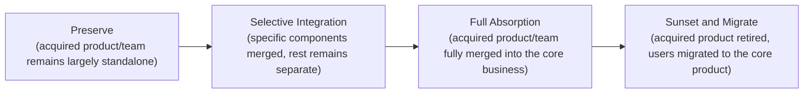

# Lesson 76: M&A and Product Integration

## Why This Lesson Matters

Lesson 75 examined how a company defends or builds a durable competitive moat organically, through its own product and market position. This lesson examines a different, faster, and considerably riskier path to acquiring capability, market position, or talent: mergers and acquisitions. A PM who has only ever worked on organically-built products is often unprepared for the specific challenges of product work following an acquisition, because the core question shifts from "what should we build" to a genuinely different question: "given that we now own two products, two codebases, two customer bases, and often two incompatible cultures, what should we actually do with all of it?"

The single most consistent finding across decades of M&A research and commentary is that acquisitions fail to deliver their intended value far more often due to poor integration than due to a flawed initial strategic rationale for the deal itself. A company can correctly identify a genuinely valuable acquisition target — the right technology, the right talent, the right customer base — and still destroy most of that value through an integration process that alienates acquired employees, disrupts acquired customers, or forces incompatible products together before anyone has honestly assessed whether forcing them together even serves the original strategic rationale for the deal.

This lesson introduces the Integration Continuum, this lesson's core mental model, to give you a structured way to match a post-acquisition integration approach to the actual strategic rationale behind the acquisition, rather than defaulting to full integration as an assumed best practice regardless of context.

---

## Learning Path

| Field | Detail |
|---|---|
| **Module** | 8 — Advanced Strategy, Innovation & Enterprise/B2B Product Management |
| **Current Lesson** | 76 of 90 |
| **Difficulty** | 6 / 10 |
| **Estimated Study Time** | 40 minutes (reading) + 15 minutes (reflection + quiz) |
| **Prerequisites** | Lesson 75 (Moat Durability Matrix), Lesson 68 (Sunset Runway, dependency-aware migration) |
| **Next Lesson** | Lesson 77 — Innovation Accounting and Portfolio Management |
| **Future Topics Unlocked** | Lesson 77 (Innovation Accounting), Lesson 78 (Build, Buy, or Partner), Lesson 80 (Module Synthesis) — all depend on the Integration Continuum introduced here |

---

## Learning Objectives

By the end of this lesson, you will be able to:

1. Explain why poor integration, rather than flawed acquisition strategy, is the more common cause of M&A value destruction.
2. Apply the Integration Continuum to match an integration approach to an acquisition's actual strategic rationale.
3. Identify the four common strategic rationales for an acquisition: talent, technology, customer base, and market consolidation.
4. Distinguish premature full integration from appropriately paced, rationale-matched integration.
5. Evaluate a proposed post-acquisition integration plan for whether it matches the deal's actual strategic rationale.

---

## Prerequisites

This lesson assumes the Moat Durability Matrix from Lesson 75, since acquisitions are frequently pursued specifically to acquire or defend a moat, and the Sunset Runway and dependency-aware migration discipline from Lesson 68, since product integration following an acquisition is, at its core, a specific and especially high-stakes category of migration.

---

## Theory

### Why Integration, Not Strategy, Is the More Common Failure Point

An acquisition's initial strategic rationale — the reason a company decided to pursue a particular target — can be entirely sound while the acquisition still fails to deliver its intended value, because the value of an acquisition is not realized at the moment the deal closes; it is realized, or destroyed, over the months and years of integration that follow. A company that correctly identifies a target with valuable proprietary technology can still lose most of that technology's value if the acquired engineering team, alienated by a clumsy integration process, departs before the technology is genuinely absorbed. A company that correctly identifies a target with a valuable, loyal customer base can still lose most of that customer base if those customers are forced into an unfamiliar, poorly-explained product transition before the acquiring company has earned their trust. The strategic rationale and the integration execution are genuinely separate questions, and success at the first does not guarantee success at the second.

### The Integration Continuum

This lesson introduces the **Integration Continuum**, mapping post-acquisition integration approaches from minimal to complete:

The Integration Continuum's core discipline is that the *correct* position on this continuum is not a universal best practice, but should be determined by the acquisition's actual strategic rationale. An acquisition made primarily to acquire specific talent (an "acqui-hire") may call for **Preserve** or minimal integration of the team into existing projects, with little regard for the acquired product itself. An acquisition made to acquire a specific, valuable technology component may call for **Selective Integration** — extracting and integrating that specific component while leaving the rest of the acquired product to wind down naturally. An acquisition made to consolidate market position by absorbing a direct competitor's customer base may call for **Full Absorption** or **Sunset and Migrate**, depending on how differentiated the acquired product's experience is from the acquiring company's own offering. Treating every acquisition as automatically calling for Full Absorption, regardless of its actual rationale, is one of the most common and costly integration mistakes.

### The Four Common Strategic Rationales

**Talent acquisition** (often called an "acqui-hire") is pursued primarily to bring specific people — engineers, researchers, a founding team — into the acquiring company, with the acquired product itself often being secondary or even irrelevant to the deal's actual value. **Technology acquisition** is pursued to obtain a specific proprietary capability — an algorithm, a patent portfolio, a technical architecture — that would be slower or more expensive to build internally. **Customer base acquisition** is pursued to obtain an existing base of paying customers, often in a market or segment the acquiring company wants faster access to than organic growth would provide. **Market consolidation** is pursued to remove a competitor from the market entirely, strengthening the acquiring company's competitive position (and potentially its moat, per Lesson 75) by reducing the number of viable alternatives available to customers.

### Why Premature Full Integration Is So Common and So Damaging

A specific organizational pressure frequently pushes toward premature full integration regardless of actual rationale: internal stakeholders often prefer a single, unified codebase and organizational structure for its own sake, since maintaining two separate systems feels inefficient and organizationally messy. This preference, however reasonable it feels internally, ignores that the *reason* an acquisition was pursued may have nothing to do with achieving codebase unification, and that forcing integration before the acquired team, product, or customer base is genuinely ready can destroy exactly the value — talent retention, technology fidelity, customer loyalty — the acquisition was meant to capture in the first place. Premature full integration is, in a specific sense, the M&A equivalent of the premature marketplace investment described in Lesson 61's Case Study: investing in a visible, tidy-looking outcome (a single unified system) before the underlying foundation (a genuinely ready, willing, and stable acquired team and customer base) can actually support it.

---

## Common Beginner Mistakes

**Mistake 1: Defaulting to Full Absorption regardless of the acquisition's actual strategic rationale**

An acquisition made for talent or a specific technology component may not benefit from, and can be actively harmed by, forcing complete product and organizational unification.

**Mistake 2: Underestimating how quickly acquired talent can depart if integration feels forced or disrespectful of the acquired team's prior culture and autonomy**

A poorly-managed integration can cause the exact people the acquisition was meant to retain to leave before their value has been captured.

**Mistake 3: Treating acquired customer migration as a purely technical exercise, without applying the dependency-aware discipline from Lesson 68's Sunset Runway**

Customers of an acquired product are, in a real sense, dependents whose migration requires the same inventory, notice, and support discipline as any other platform migration.

**Mistake 4: Assuming integration timeline pressure from leadership justifies skipping careful rationale-matching**

Pressure to show quick post-acquisition results can push toward premature Full Absorption even when a slower, more selective approach would preserve more of the acquisition's actual value.

**Mistake 5: Failing to communicate clearly and early with the acquired team about what kind of integration to expect**

Ambiguity about whether a team will be preserved, selectively integrated, or fully absorbed creates unnecessary anxiety and can accelerate departures, regardless of which approach ultimately proves correct.

---

## Mental Model: The Integration Continuum

The Integration Continuum introduced above is this lesson's core takeaway tool. Before finalizing a post-acquisition integration plan, ask:

1. **What was the actual strategic rationale for this acquisition** — talent, technology, customer base, or market consolidation — and is that rationale explicitly documented, or merely assumed?
2. **Does the proposed integration approach genuinely match that rationale**, or does it default to Full Absorption out of organizational preference for unification rather than genuine strategic fit?
3. **If customer migration is involved, is it being planned with the same dependency-aware discipline as the Sunset Runway from Lesson 68**, rather than treated as a purely internal technical decision?
4. **Has the acquired team been given clear, honest communication about which position on the Continuum applies to them**, reducing the ambiguity that accelerates talent departure?

A post-acquisition integration plan that can answer all four questions deliberately is far more likely to preserve the actual value the acquisition was pursued to capture, rather than destroying that value through a mismatched, rushed, or poorly-communicated integration process.

---

## Real Company Example

**Meta's Instagram and WhatsApp acquisitions** offer a specific, well-documented integration reversal that illustrates this lesson's stakes more sharply than a general "varied integration approaches" claim. When Facebook acquired Instagram in 2012 for $1 billion and WhatsApp in 2014 for roughly $19 billion, Mark Zuckerberg publicly promised both companies significant operating independence — preserving their separate brands, product decisions, and, notably, WhatsApp's distinct no-ads culture — reasoning that the acquired products' value depended partly on staying recognizably themselves rather than being absorbed into Facebook's existing products and norms. The New York Times reported in January 2019 that Zuckerberg then reversed course, announcing plans to technically integrate the messaging infrastructure underlying WhatsApp, Instagram Direct, and Facebook Messenger — a shift multiple outlets, including Mashable, characterized directly as breaking the specific autonomy promises made at acquisition.

The instructive tension for this lesson: the *initial* light-touch integration decision — preserve the brand and product independence that made each acquisition valuable in the first place — was a reasonable, well-reasoned choice at the time, matching the "preserve what made it valuable" logic this lesson's Integration Continuum describes. But that same independence created genuine friction with a different, later strategic goal (privacy-focused, cross-app messaging infrastructure), and reversing years into an acquisition carries real reputational cost — the FTC's own antitrust complaint against Meta later cited the acquisitions directly. An integration decision isn't a one-time choice made at close; it's a stance that can come under renewed pressure as the acquirer's broader strategy evolves.

*(Source: The New York Times' January 2019 reporting on the integration reversal, corroborated by CNBC and Mashable's contemporaneous coverage, and the FTC's own subsequently filed complaint referencing both acquisitions.)*

**Assumption flagged:** the specifics of Google's internal integration strategy and decision-making rationale for any particular acquisition described here are drawn from public commentary and industry retrospectives, not confirmed internal company statements, and should be treated as illustrative and general rather than a claim about specific internal deliberations.

---

## Real World Perspective: M&A and Product Integration at Different Company Stages

**Startup:** Early-stage companies typically pursue acquisitions rarely, and when they do, it is almost always a talent-focused acqui-hire of a small team or an early-stage competitor, making the Preserve or Selective Integration end of the Continuum the most common and appropriate approach, given the limited organizational capacity to manage a complex full-absorption process at this stage.

**Mid-size company:** This is typically where a company's first genuinely significant customer-base or technology acquisition occurs, often creating internal pressure toward premature Full Absorption before the organization has developed the specific discipline (dependency-aware migration planning, clear team communication practices) needed to integrate well at this scale.

**Big Tech:** Large, serially-acquisitive organizations typically develop formal, repeatable integration playbooks matched to different acquisition rationales, often with dedicated integration management functions specifically responsible for assessing which position on the Continuum best fits each new acquisition, rather than defaulting to a single approach for every deal regardless of context.

---

## Detailed Case Study: The Rushed Absorption

A mid-size software company acquired a smaller competitor specifically for its loyal, established customer base in a market segment the acquiring company had struggled to penetrate organically — a clear customer-base-acquisition rationale. Leadership, eager to demonstrate quick synergy value to the board following the deal's close, mandated that the acquired product be fully absorbed into the acquiring company's core platform within a single quarter, with all acquired customers migrated to the core product on an aggressive, fixed timeline.

The acquired product's customer base, however, had specifically chosen that product over the acquiring company's own offering for reasons tied to its distinct, more specialized workflow — differences that had never been fully documented or understood by the acquiring company's product team before the integration began, echoing the incomplete-dependency-inventory failure pattern from Lesson 68's Case Study, now applied to an acquired customer base rather than an external API's dependents. The rushed migration forced these customers onto a core product that lacked several workflow-specific capabilities they had relied on, with a notice and support process far shorter than the dependency-aware Sunset Runway discipline from Lesson 68 would have recommended. A significant fraction of the acquired customer base churned within two quarters of the forced migration, substantially undermining the very rationale — access to this loyal customer base — that had justified the acquisition in the first place.

**What went wrong?** Using the Integration Continuum, the failure is precise: the acquisition's actual rationale called for careful, dependency-aware customer migration, potentially favoring a slower Selective Integration or an extended Sunset-and-Migrate timeline that respected the specific workflow needs driving customer loyalty to the acquired product. Instead, leadership defaulted to rapid Full Absorption, driven by organizational pressure to demonstrate quick post-acquisition synergy, without ever properly inventorying what made the acquired customer base loyal in the first place — precisely the kind of incomplete-dependency-inventory mistake this curriculum's Lesson 68 warned against, now costing the company the primary value the acquisition was meant to capture.

The company's recovery involved a substantially slower, more deliberate approach for a subsequent acquisition, explicitly documenting the strategic rationale before finalizing an integration plan, applying genuine Sunset Runway discipline to any required customer migration, and building in direct customer research to understand workflow-specific loyalty drivers before committing to a migration timeline — a discipline that connects directly to the portfolio-level thinking formalized in Lesson 77.

---

## Framework Explanation: The M&A Integration Readiness Checklist

Before executing a post-acquisition integration plan, a PM or integration team can use the following checklist:

| Checklist Item | Question to Ask | Risk if Skipped |
|---|---|---|
| Rationale Documented | Is the acquisition's actual strategic rationale explicitly documented and agreed upon? | Integration approach defaults to organizational preference rather than genuine strategic fit |
| Continuum Position Matched | Does the proposed integration approach genuinely match the documented rationale? | Value the acquisition was meant to capture (talent, technology, customers) is destroyed by a mismatched approach |
| Customer Dependency Inventory | Has the acquired customer base's specific loyalty drivers and workflow dependencies been genuinely understood? | Rushed migration alienates exactly the customers the acquisition was meant to retain |
| Team Communication Plan | Has the acquired team been given clear, honest, timely communication about their integration path? | Ambiguity accelerates talent departure regardless of the ultimately correct integration approach |
| Timeline Realism | Is the integration timeline set by genuine readiness rather than organizational pressure to show quick synergy value? | Premature full integration, as in the Case Study, before the foundation can support it |

A "no" on Rationale Documented should be treated as a fundamental planning gap — without an explicit, agreed-upon rationale, there is no genuine basis for selecting the correct position on the Integration Continuum at all.

---

## Interview Perspective: How Interviewers Think About This

**"How would you approach integrating a newly acquired product and team into your organization?"** The interviewer is evaluating whether you propose matching the integration approach to the acquisition's actual strategic rationale, per the Integration Continuum, rather than defaulting to full absorption as an assumed universal best practice.

**"What's the risk of moving too quickly to fully merge an acquired company's product into your own?"** The interviewer is testing whether you recognize the premature-integration failure pattern illustrated in this lesson's Case Study, where rushing absorption before understanding acquired customer or team dynamics destroys the acquisition's intended value.

**"Tell me about the different reasons a company might acquire another company, and how those reasons should shape the integration approach."** The interviewer is listening for a clear articulation of the four rationales — talent, technology, customer base, market consolidation — and a genuine connection between each rationale and an appropriately matched position on the Integration Continuum.

---

## Summary

M&A value is realized or destroyed primarily during the integration process that follows a deal's close, not at the moment the deal is signed, meaning a strategically sound acquisition can still fail to deliver its intended value if integration is poorly matched to the acquisition's actual purpose. The Integration Continuum — Preserve, Selective Integration, Full Absorption, Sunset and Migrate — provides a structured way to match an integration approach to one of the four common strategic rationales for an acquisition: talent, technology, customer base, or market consolidation, rather than defaulting to Full Absorption out of organizational preference for a single, unified structure. Premature full integration is a particularly common and damaging mistake, since internal pressure to demonstrate quick, tidy post-acquisition synergy can push toward forcing unification before an acquired team, product, or customer base is genuinely ready, destroying exactly the value — talent, technology, or loyal customers — the acquisition was pursued to capture. Customer migration following an acquisition deserves the same dependency-aware discipline as any other platform migration, per Lesson 68's Sunset Runway, since acquired customers are, in every meaningful sense, dependents whose specific loyalty drivers must be understood before a migration timeline is set, rather than assumed away under pressure to show fast results.

---

## Key Takeaways

- Poor integration, not a flawed initial strategic rationale, is the more common cause of M&A value destruction.
- The Integration Continuum — Preserve, Selective Integration, Full Absorption, Sunset and Migrate — should be matched to the acquisition's actual strategic rationale.
- The four common strategic rationales are talent acquisition, technology acquisition, customer base acquisition, and market consolidation.
- Premature Full Absorption, driven by organizational preference for unification, is a specific and common failure mode that can destroy the value an acquisition was meant to capture.
- Customer migration following an acquisition requires the same dependency-aware discipline as the Sunset Runway from Lesson 68, treating acquired customers as genuine dependents.
- Ambiguous or delayed communication with an acquired team accelerates talent departure, regardless of which integration approach ultimately proves correct.
- Integration timelines should be set by genuine readiness, not organizational pressure to demonstrate quick post-acquisition synergy.

---

## Cheat Sheet

*A two-minute review of everything in this lesson.*

- Deals succeed or fail during integration, not at signing. Strategy and execution are separate questions.
- Integration Continuum: Preserve → Selective Integration → Full Absorption → Sunset and Migrate.
- Match the Continuum position to the rationale: talent, technology, customer base, or market consolidation.
- Don't default to Full Absorption just because it feels tidier organizationally.
- Treat acquired customers like Sunset Runway dependents — inventory their loyalty drivers before migrating them.

---

## Glossary

| Term | Definition | Related Concepts | Difficulty |
|---|---|---|---|
| Integration Continuum | Four-point model of post-acquisition integration approaches: Preserve, Selective Integration, Full Absorption, Sunset and Migrate | Strategic Rationale | 2 |
| Acqui-Hire | An acquisition pursued primarily to obtain specific talent, with the acquired product itself often secondary | Talent Acquisition Rationale | 1 |
| Strategic Rationale (M&A) | The underlying reason an acquisition was pursued: talent, technology, customer base, or market consolidation | Integration Continuum | 2 |
| Premature Full Integration | Forcing complete organizational and product unification before the acquired team, product, or customers are genuinely ready | Integration Continuum, Leverage Stack (Lesson 61) | 2 |
| M&A Integration Readiness Checklist | A five-item checklist confirming an integration plan matches the acquisition's rationale before execution | Integration Continuum | 2 |

---

## Further Reading / Resources

- *HBR's 10 Must Reads on Mergers and Acquisitions* (Harvard Business Review Press)
- Mark Sirower, *The Synergy Trap*
- *Winning at Acquisitions* industry research from McKinsey & Company's published M&A practice insights

---

## Flashcards

**Card 1**
- Front: Why is poor integration, rather than flawed strategy, the more common cause of M&A value destruction?
- Back: An acquisition's value is realized or destroyed over the months and years of integration following the deal, not at the moment the deal closes.
- Difficulty: 2
- Tags: ma-integration, core-concept

**Card 2**
- Front: Name the four points on the Integration Continuum.
- Back: Preserve, Selective Integration, Full Absorption, Sunset and Migrate.
- Difficulty: 2
- Tags: integration-continuum

**Card 3**
- Front: Name the four common strategic rationales for an acquisition.
- Back: Talent acquisition, technology acquisition, customer base acquisition, market consolidation.
- Difficulty: 2
- Tags: ma-rationales

**Card 4**
- Front: Why is premature Full Absorption such a common mistake?
- Back: Internal stakeholders often prefer a unified codebase and structure for its own sake, regardless of whether the acquisition's actual rationale calls for full integration.
- Difficulty: 2
- Tags: premature-integration

**Card 5**
- Front: What went wrong in the Rushed Absorption case study?
- Back: The acquisition's rationale was customer-base retention, but leadership forced rapid Full Absorption without understanding what drove customer loyalty, causing significant churn.
- Difficulty: 2
- Tags: case-study, integration-continuum

**Card 6**
- Front: Why should acquired customer migration follow Sunset Runway discipline from Lesson 68?
- Back: Acquired customers are genuine dependents whose loyalty drivers and workflow needs must be understood before a migration timeline is set, just like external API dependents.
- Difficulty: 2
- Tags: customer-migration

**Card 7**
- Front: Why does ambiguous communication with an acquired team accelerate departures?
- Back: Uncertainty about which integration approach applies to them creates anxiety that can drive talent away regardless of which approach ultimately proves correct.
- Difficulty: 2
- Tags: team-communication

## Reflection Exercise

You are the PM leading integration for a company that has just acquired a smaller competitor specifically for its specialized data-processing technology, which would have taken years to build internally. The acquired company also has a small existing customer base and a talented engineering team, neither of which was the primary reason for the acquisition.

There is no single correct answer to the prompts below — the goal is to practice applying the Integration Continuum and the M&A Integration Readiness Checklist to an acquisition with a clear primary rationale but secondary considerations.

1. Using the Integration Continuum, what approach seems most appropriate for the core technology itself, given the primary rationale?
2. Does the primary technology-focused rationale imply the same integration approach should apply to the acquired customer base? Why or why not?
3. What would an appropriate integration approach for the acquired engineering team look like, given that talent retention wasn't the primary rationale but the team's expertise may still be valuable?
4. Using the M&A Integration Readiness Checklist, what specific investigation would you prioritize before committing to a customer migration timeline?
5. How would you communicate the integration plan to the acquired team in a way that's honest about the primary rationale without making them feel undervalued?

---

## Quiz

**1. Why is poor integration considered the more common cause of M&A value destruction, according to this lesson?**
A) Strategic rationale is never actually a relevant factor in acquisition success
B) An acquisition's value is realized or destroyed over the integration process following the deal's close, not at the moment of signing
C) Integration is always technically impossible regardless of planning
D) Poor integration only affects small acquisitions, never large ones

*Correct answer: B*
*Explanation: The lesson's central argument is that strategic rationale and integration execution are separate questions, with value realized primarily during the latter.*
*Learning objective tested: #1*
*Difficulty: Easy*

---

**2. What is the correct order of the Integration Continuum, from least to most integrated?**
A) Full Absorption, Sunset and Migrate, Preserve, Selective Integration
B) Preserve, Selective Integration, Full Absorption, Sunset and Migrate
C) Sunset and Migrate, Full Absorption, Selective Integration, Preserve
D) Selective Integration, Preserve, Sunset and Migrate, Full Absorption

*Correct answer: B*
*Explanation: This is the sequence introduced in the Theory section, from minimal to complete integration.*
*Learning objective tested: #2*
*Difficulty: Easy*

---

**3. What is an "acqui-hire"?**
A) An acquisition made purely to remove a competitor from the market
B) An acquisition pursued primarily to obtain specific talent, with the acquired product itself often secondary
C) An acquisition focused exclusively on acquiring proprietary technology
D) A type of merger that always results in full product absorption

*Correct answer: B*
*Explanation: This term specifically describes talent-focused acquisitions where the product itself is often not the primary value driver.*
*Learning objective tested: #3*
*Difficulty: Easy*

---

**4. Name the four common strategic rationales for an acquisition.**
A) Marketing, sales, legal, and finance
B) Talent acquisition, technology acquisition, customer base acquisition, market consolidation
C) Revenue growth, cost reduction, brand building, and geographic expansion
D) Product design, engineering, research, and operations

*Correct answer: B*
*Explanation: These four rationales are explicitly named in the Theory section as the common reasons acquisitions are pursued.*
*Learning objective tested: #3*
*Difficulty: Easy*

---

**5. Why is premature Full Absorption described as a common and damaging mistake?**
A) Full Absorption is always the technically superior integration approach regardless of context
B) Internal preference for a unified structure can push toward full integration even when the acquisition's actual rationale doesn't call for it, destroying the value being sought
C) Full Absorption is never actually attempted in real M&A situations
D) Premature integration only affects the acquiring company, never the acquired one

*Correct answer: B*
*Explanation: The lesson explicitly identifies organizational preference for unification, rather than genuine strategic fit, as the driver of this common mistake.*
*Learning objective tested: #4*
*Difficulty: Easy*

---

**6. Why should acquired customer migration follow the same discipline as the Sunset Runway from Lesson 68?**
A) Acquired customers are legally required to migrate on the same timeline as external API dependents
B) Acquired customers are genuine dependents whose specific loyalty drivers and needs must be understood before setting a migration timeline
C) Sunset Runway discipline only applies to technical API migrations, never customer migrations
D) Customer migration and API migration have no meaningful similarities

*Correct answer: B*
*Explanation: The lesson explicitly draws this parallel, treating acquired customers as dependents requiring the same dependency-aware migration discipline.*
*Learning objective tested: #4, #5*
*Difficulty: Easy*

---

**7. In the Rushed Absorption case study, what was the acquisition's actual strategic rationale?**
A) Acquiring specific proprietary technology
B) Retaining the acquired company's loyal, established customer base in an underpenetrated market segment
C) Acquiring a specific talented engineering team
D) Removing a competitor from the market entirely with no interest in its customers

*Correct answer: B*
*Explanation: The case study specifically describes customer-base retention as the acquisition's rationale, which the rushed integration then undermined.*
*Learning objective tested: #3, #5*
*Difficulty: Medium*

---

**8. What specifically caused significant customer churn in the Rushed Absorption case study?**
A) The acquired product was technically inferior from the start
B) A rushed migration forced customers onto a core product lacking workflow-specific capabilities they relied on, without adequate notice or dependency inventory
C) The acquiring company raised prices immediately after the acquisition
D) Customers were never informed that an acquisition had occurred

*Correct answer: B*
*Explanation: The failure was a rushed, under-researched migration that didn't account for the specific workflow needs driving customer loyalty.*
*Learning objective tested: #4, #5*
*Difficulty: Medium*

---

**9. According to the M&A Integration Readiness Checklist, what does a "no" on Rationale Documented indicate?**
A) A minor administrative oversight with no real consequence
B) A fundamental planning gap, since there is no genuine basis for selecting the correct Integration Continuum position without an explicit, agreed-upon rationale
C) That the acquisition should be immediately reversed
D) That Full Absorption is automatically the correct default approach

*Correct answer: B*
*Explanation: The lesson treats an undocumented rationale as undermining the entire basis for a sound integration decision.*
*Learning objective tested: #5*
*Difficulty: Medium*

---

**10. Why might early-stage companies typically favor the Preserve or Selective Integration end of the Continuum, per the Real World Perspective section?**
A) Early-stage companies are legally prohibited from pursuing Full Absorption
B) Their acquisitions are almost always small, talent-focused acqui-hires, given limited organizational capacity for complex full-absorption processes
C) Early-stage companies never pursue any acquisitions at all
D) Preserve is always the objectively superior approach regardless of company stage

*Correct answer: B*
*Explanation: The Real World Perspective section connects this preference to the typical scale and rationale of early-stage acquisitions.*
*Learning objective tested: #1*
*Difficulty: Medium*

---

**11. What do large, serially-acquisitive organizations typically develop, per the Real World Perspective section?**
A) A single universal integration approach applied identically to every acquisition
B) Formal, repeatable integration playbooks matched to different acquisition rationales, often with dedicated integration management functions
C) A policy of never integrating any acquired products or teams
D) No formal process at all, relying entirely on ad hoc decisions

*Correct answer: B*
*Explanation: The Real World Perspective section describes this kind of rationale-matched, repeatable playbook approach as characteristic of mature, frequent acquirers.*
*Learning objective tested: #5*
*Difficulty: Medium*

---

**12. (Scenario) A company acquires a competitor primarily for its proprietary machine learning technology, with a small, secondary customer base and team as incidental assets. Using the Integration Continuum, what is the most defensible approach for the core technology?**
A) Preserve the technology as a fully separate, standalone product indefinitely
B) Selectively integrate the specific technology component into the core product, treating the customer base and team as separate considerations with their own appropriately matched approaches
C) Immediately sunset the technology without extracting any value from it
D) Apply Full Absorption uniformly across the technology, customer base, and team without differentiation

*Correct answer: B*
*Explanation: The technology-focused rationale calls for Selective Integration of that specific component, while other assets (customers, team) may warrant separate, independently matched approaches.*
*Learning objective tested: #2, #3, #5*
*Difficulty: Medium-Hard*

---

**13. (Product Thinking) A PM notices that a planned integration defaults to Full Absorption despite the acquisition's documented rationale being primarily talent retention. What is the strongest response, using this lesson's frameworks?**
A) Proceed with Full Absorption regardless, since organizational unification is always preferable
B) Flag the mismatch between the documented rationale and the proposed Continuum position, advocating for an approach (such as Preserve or Selective Integration) better matched to talent retention specifically
C) Cancel the acquisition entirely at this late stage
D) Ignore the documented rationale and let engineering leadership decide unilaterally

*Correct answer: B*
*Explanation: The correct response identifies and addresses the mismatch between rationale and integration approach, rather than defaulting to Full Absorption or taking an extreme unrelated action.*
*Learning objective tested: #2, #4, #5*
*Difficulty: Hard*

---

**14. (Interview Reasoning) A candidate, asked how they'd integrate a newly acquired product, describes a plan to fully merge it into the core platform within one quarter, regardless of the acquisition's stated rationale. What does this most likely signal, per the Interview Perspective section?**
A) A strong and complete understanding of M&A integration
B) A gap in recognizing that integration approach should be matched to the acquisition's actual strategic rationale, not defaulted to Full Absorption
C) That the candidate is ready for a senior M&A integration leadership role immediately
D) Nothing meaningful; rapid Full Absorption is always the correct approach regardless of rationale

*Correct answer: B*
*Explanation: The Interview Perspective section specifically listens for rationale-matched integration thinking, which this candidate's answer omits entirely.*
*Learning objective tested: #2, #4, #5*
*Difficulty: Hard*

---

**15. (Product Thinking, Highest Difficulty) A company has acquired a competitor specifically to retain its loyal customer base, but leadership is pushing for rapid Full Absorption within one quarter to demonstrate synergy value to the board. Using only the frameworks in this lesson, what is the most defensible response?**
A) Comply with the rapid timeline as requested, prioritizing the appearance of quick synergy over careful integration
B) Advocate for an integration approach matched to the customer-retention rationale, applying Sunset Runway-style dependency-aware migration planning, even if this requires a longer timeline than leadership initially requested
C) Refuse to integrate the acquisition at all under any circumstances
D) Immediately migrate all customers with no advance notice or dependency investigation, to meet the quarterly deadline regardless of consequences

*Correct answer: B*
*Explanation: This mirrors the Reflection Exercise and the Rushed Absorption case study: the correct response advocates for a rationale-matched, dependency-aware approach even under organizational pressure for speed, rather than complying with an ill-matched timeline or taking an extreme unproductive stance.*
*Learning objective tested: #2, #4, #5*
*Difficulty: Hard*

---

## Connections

| | Lesson | Core Idea Carried Forward |
|---|---|---|
| **Previous Lesson** | Lesson 75 — Competitive Strategy and Moats | Extends competitive strategy into acquisition as a specific mechanism for acquiring capability or defending a moat |
| **Current Lesson** | Lesson 76 — M&A and Product Integration | Integration Continuum; four strategic rationales; premature integration risk; M&A Integration Readiness Checklist |
| **Next Lesson** | Lesson 77 — Innovation Accounting and Portfolio Management | Extends the rationale-matching discipline into ongoing portfolio-level bet management, including acquired products |
| **Future Concepts Unlocked** | Lesson 78 (Build, Buy, or Partner) | Uses the Integration Continuum and M&A rationale framework as a direct input into build-versus-buy-versus-partner decisions |
| | Lesson 80 (Module Synthesis) | Treats the Integration Continuum as established canon alongside Module 8's other strategic frameworks |

This curriculum continues to build as one continuous argument. From this lesson forward, any reference to a post-acquisition integration decision assumes you can locate it on the Integration Continuum without re-explanation.
