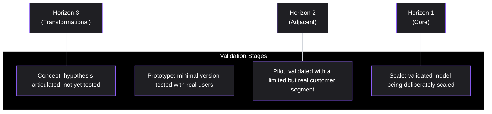

# Lesson 77: Innovation Accounting and Portfolio Management

## Why This Lesson Matters

Lesson 71 introduced the Strategy Cascade and the Three Horizons framework, establishing that a healthy bet portfolio deliberately spans core, adjacent, and transformational risk levels, and specifically warned against judging Horizon 3 bets by the same near-term metrics appropriate for Horizon 1. This lesson makes that warning concrete and actionable: what, exactly, should a company measure for a bet that is genuinely too early to show revenue, and how should a portfolio of many such bets, at different stages of maturity, actually be managed and reported on over time?

The natural organizational instinct is to measure every initiative using the same familiar metrics — revenue, user growth, profit margin — regardless of how early-stage or exploratory that initiative genuinely is. This instinct is understandable, since these are the metrics an organization already knows how to read and compare, but applying them uniformly to bets at fundamentally different stages of maturity produces a specific and damaging failure: promising early-stage bets get killed prematurely for failing to show revenue they were never realistically going to show yet, while genuinely failing bets can survive far too long if they happen to generate superficially impressive but ultimately meaningless activity metrics.

This lesson introduces the Portfolio Health Grid, this lesson's core mental model, to give you a structured way to track and evaluate a portfolio of bets at genuinely different stages of maturity, using stage-appropriate evidence rather than forcing every bet through the same evaluative lens regardless of how ready it actually is to produce that kind of evidence.

---

## Learning Path

| Field | Detail |
|---|---|
| **Module** | 8 — Advanced Strategy, Innovation & Enterprise/B2B Product Management |
| **Current Lesson** | 77 of 90 |
| **Difficulty** | 7 / 10 |
| **Estimated Study Time** | 40 minutes (reading) + 15 minutes (reflection + quiz) |
| **Prerequisites** | Lesson 71 (Strategy Cascade, Three Horizons, falsifiable bets), Lesson 64 (Metric Provenance Chain) |
| **Next Lesson** | Lesson 78 — Build, Buy, or Partner: Platform vs. Point Solution Decisions |
| **Future Topics Unlocked** | Lesson 78 (Build, Buy, or Partner), Lesson 80 (Module Synthesis) — both depend on the Portfolio Health Grid introduced here |

---

## Learning Objectives

By the end of this lesson, you will be able to:

1. Explain why applying uniform, revenue-based metrics across bets at different maturity stages produces systematically bad portfolio decisions.
2. Apply the Portfolio Health Grid to evaluate a bet using evidence appropriate to its actual stage of maturity.
3. Distinguish validated learning metrics from vanity metrics in the context of an early-stage bet.
4. Identify the specific risk of both premature bet cancellation and prolonged bet survival caused by metric mismatch.
5. Evaluate a portfolio of bets for whether each is being measured using stage-appropriate evidence.

---

## Prerequisites

This lesson assumes the Strategy Cascade, Three Horizons framework, and falsifiable-bet discipline from Lesson 71, since this lesson provides the measurement system that makes ongoing bet evaluation genuinely possible, and the Metric Provenance Chain from Lesson 64, since evaluating any bet's progress depends on the same underlying data trustworthiness that lesson established.

---

## Theory

### Why Uniform Metrics Fail Across Maturity Stages

A Horizon 1 bet — extending an established core business — can reasonably be judged against revenue, profit margin, and market share, because the underlying business model is proven and the relevant question is one of execution and optimization. A Horizon 3 bet — a genuinely new, exploratory initiative — cannot reasonably be judged against these same metrics in its earliest stages, not because the team is executing poorly, but because the entire premise of an early-stage exploratory bet is that the business model itself has not yet been validated, and demanding revenue-scale proof before that validation has occurred is asking the bet to demonstrate something it is structurally too early to demonstrate. Applying Horizon 1 metrics to a Horizon 3 bet doesn't produce a more rigorous evaluation; it produces a category error that reliably kills promising early bets before they've had a chance to answer the actual questions they were designed to test.

### The Portfolio Health Grid

This lesson introduces the **Portfolio Health Grid**, plotting each bet in a portfolio along two axes: its Three Horizons classification from Lesson 71, and its actual stage of validated progress.

The Grid's core discipline is that the *appropriate* metric for any given bet depends on its position on both axes simultaneously — a Horizon 3 bet at the Concept stage should be evaluated on whether its core hypothesis has been clearly articulated and an initial test designed, not on revenue; a Horizon 3 bet that has progressed to Pilot stage should be evaluated on whether a real, if limited, customer segment shows the validated behavior the hypothesis predicted, a meaningfully different and more demanding bar than the Concept stage, but still not the same bar as a mature Horizon 1 business. Placing every bet somewhere on this Grid, rather than evaluating all bets against a single organizational-standard metric, is what makes stage-appropriate evaluation possible at all.

### Validated Learning vs. Vanity Metrics

**Validated learning**, a concept from lean startup methodology, refers to evidence that a specific, falsifiable hypothesis about customer behavior or business viability has actually been tested and either confirmed or disconfirmed — directly connecting to the falsifiable Strategic Bet discipline from Lesson 71. **Vanity metrics**, by contrast, are numbers that look impressive and tend to always increase over time (total signups, cumulative downloads, total page views) without actually testing whether the bet's underlying hypothesis is correct. A Horizon 3 bet can generate an impressive-looking vanity metric — a large number of free trial signups, for instance — while providing no validated learning at all about whether those users would actually pay, retain, or behave in the way the bet's underlying hypothesis predicted. Innovation accounting, done well, insists on validated learning metrics specific to the bet's stated hypothesis, rather than accepting vanity metrics as a substitute simply because they are easier to produce and more comfortable to report.

### The Two Failure Modes of Metric Mismatch

Metric mismatch produces two distinct, opposite failure modes. **Premature cancellation** occurs when a genuinely promising early-stage bet is killed because it hasn't yet produced Horizon 1-scale results it was never structurally positioned to produce this early — the specific risk Lesson 71 flagged for Horizon 3 bets judged by near-term metrics. **Prolonged survival** occurs when a genuinely failing bet continues to receive resources because it generates comfortable-looking vanity metrics that mask the absence of any real validated learning supporting its underlying hypothesis — a bet can look active and growing by activity metrics while its actual, falsifiable hypothesis has already been quietly disconfirmed by the available evidence, with no one having checked because the vanity metrics provided a comfortable alternative narrative.

---

## Common Beginner Mistakes

**Mistake 1: Applying the same revenue and profit metrics to every bet in a portfolio, regardless of Horizon or validation stage**

This produces the category error described in the Theory section, killing promising early bets and providing false comfort for others.

**Mistake 2: Accepting vanity metrics as evidence of progress simply because they are readily available and always trending upward**

Vanity metrics can create a comfortable illusion of progress while providing no actual validated learning about the bet's underlying hypothesis.

**Mistake 3: Failing to explicitly place each bet on the Portfolio Health Grid, leaving its appropriate evaluation criteria ambiguous**

Without an explicit stage classification, there is no principled basis for deciding what evidence should or shouldn't count as meaningful progress.

**Mistake 4: Treating a bet's progression from one validation stage to the next as automatic rather than something that must be genuinely earned by evidence**

A bet should not advance from Prototype to Pilot status, for instance, simply because time has passed, but because specific validated learning milestones have actually been met.

**Mistake 5: Allowing organizational politics or sunk cost to substitute for validated learning evidence when deciding whether to continue or cancel a bet**

A bet's continuation should be justified by genuine evidence at the appropriate stage, not by how much has already been invested or who championed it internally.

---

## Mental Model: The Portfolio Health Grid

The Portfolio Health Grid introduced above is this lesson's core takeaway tool. For any bet in a portfolio, ask:

1. **Which Horizon does this bet belong to**, per the Three Horizons framework from Lesson 71?
2. **Which validation stage — Concept, Prototype, Pilot, or Scale — has this bet actually, genuinely reached**, based on specific evidence rather than elapsed time or organizational momentum?
3. **Is the evidence being used to evaluate this bet appropriate to its actual stage** — a clearly articulated, testable hypothesis for Concept-stage bets, versus real, validated customer behavior for Pilot-stage bets — rather than a uniform standard applied regardless of stage?
4. **Is this evidence genuine validated learning specific to the bet's falsifiable hypothesis, or is it a vanity metric that merely looks encouraging without actually testing that hypothesis?**

A portfolio evaluated through this Grid consistently is far less likely to fall into either of the two metric-mismatch failure modes: prematurely killing promising early bets, or allowing genuinely failing bets to survive on the strength of comfortable but ultimately meaningless activity numbers.

---

## Real Company Example

**3M's "15% Culture,"** confirmed directly on the company's own site, has let employees spend 15 percent of their working time pursuing self-directed projects since approximately 1948, under then-president William McKnight. The policy's own best-known output is a direct, well-documented illustration of this lesson's core argument: 3M scientist Art Fry used his 15% time in 1974 to solve a problem — bookmarks that kept falling out of his hymnal — building on a "failed" low-tack adhesive a colleague, Spencer Silver, had developed years earlier and initially considered a failure precisely because it wasn't strong enough to be useful as a normal adhesive. That project became the Post-it Note, one of 3M's most commercially successful products in company history.

The instructive point for this lesson's Portfolio Balance discipline: Silver's low-tack adhesive would have failed any evaluation standard built for 3M's mature, revenue-generating product lines — it wasn't a better adhesive by any conventional metric. It only became viable because 3M's structure tolerated an idea sitting in an unproven, pre-revenue state for years without forcing it to justify itself against the same bar as an established product line. A portfolio management approach that evaluates every bet — a brand-new exploratory idea and a decade-old cash-generating product line alike — against the same revenue-readiness standard would have killed the Post-it Note before Fry ever found a use for it.

*(Source: 3M's own official site describing the 15% Culture's history and origin, corroborated by the company's own Post-it brand history page.)*

---

## Real World Perspective: Innovation Accounting and Portfolio Management at Different Company Stages

**Startup:** Early-stage companies typically operate with a portfolio of one or a small number of bets, all effectively Horizon 1 or 2 by necessity, since the company's survival depends on near-term validation — making the Portfolio Health Grid's full range less immediately relevant than it becomes once a company has the resources to sustain genuinely exploratory Horizon 3 work alongside its core business.

**Mid-size company:** This is typically where a genuine, deliberately-structured multi-horizon portfolio first becomes both possible and organizationally contentious, as resources previously devoted entirely to the core business begin being allocated to exploratory bets that, by design, won't show Horizon 1-style results for some time, creating internal pressure to apply familiar metrics prematurely.

**Big Tech:** Large organizations typically maintain formal innovation accounting practices and dedicated portfolio management functions specifically responsible for tracking many simultaneous bets across the full Portfolio Health Grid, often reporting portfolio health to leadership using stage-appropriate validated learning metrics rather than a single blended organizational metric.

---

## Detailed Case Study: The Prematurely Killed Experiment

A mid-size e-commerce company launched a Horizon 3 exploratory bet: a subscription-based curated product discovery service, built on the hypothesis that a meaningful segment of the company's existing customers would pay a recurring fee for algorithmically and editorially curated product recommendations delivered on a regular schedule. The initiative was staffed by a small team and explicitly framed internally, at launch, as an early-stage experiment rather than an established revenue line.

Three months into the pilot, the initiative's small but genuine base of paying subscribers showed strong early retention and highly positive qualitative feedback — precisely the validated learning signal the bet's underlying hypothesis had predicted, at exactly the Pilot stage on the Portfolio Health Grid the initiative had reasonably reached. However, at the company's quarterly business review, the initiative was evaluated using the same revenue-contribution-to-overall-company-growth metric applied to every other business line, and its absolute revenue contribution, still small in the context of the company's overall size after only three months, appeared negligible next to established Horizon 1 product categories. Leadership, applying this uniform standard, canceled the initiative, redirecting its small team to a Horizon 1 project instead.

**What went wrong?** Using the Portfolio Health Grid, the failure is precise: the initiative had genuinely earned Pilot-stage validated learning status — real customers, real recurring payment, strong retention, a confirmed hypothesis — but was evaluated using a Horizon 1-appropriate metric (absolute revenue contribution to overall company growth) that no Horizon 3 Pilot-stage bet could reasonably be expected to satisfy this early, regardless of how genuinely promising its underlying validated learning actually was. The company had, in effect, demanded Scale-stage evidence from a Pilot-stage bet, producing exactly the premature cancellation failure mode this lesson's Theory section describes.

The company's recovery involved instituting a formal Portfolio Health Grid review process for all future exploratory bets, explicitly requiring quarterly business reviews to evaluate each bet using metrics appropriate to its documented Horizon and validation stage rather than a single company-wide revenue standard, and revisiting several previously-cancelled initiatives to assess whether similar premature cancellations had occurred — a review process this curriculum will connect directly to the build-versus-buy-versus-partner evaluation formalized in Lesson 78.

---

## Framework Explanation: The Innovation Accounting Metrics Table

For each validation stage on the Portfolio Health Grid, a PM can use the following table to identify stage-appropriate evidence:

| Stage | Appropriate Evidence | Inappropriate Evidence (Category Error) |
|---|---|---|
| Concept | A clearly articulated, falsifiable hypothesis and a designed initial test | Revenue or user growth targets, which cannot yet exist meaningfully |
| Prototype | Genuine engagement from real users with a minimal version, testing the core hypothesis | Absolute scale metrics (total users, total revenue) at company-wide comparison levels |
| Pilot | Validated behavior from a limited but real customer segment (retention, willingness to pay, repeat usage) confirming or disconfirming the hypothesis | Comparison to Horizon 1 business lines' absolute revenue contribution |
| Scale | Revenue, margin, and growth metrics appropriate to a maturing, validated business model | Continued reliance on qualitative or small-sample pilot-stage evidence alone |

Using evidence one column to the right of a bet's actual stage — for instance, judging a Pilot-stage bet against Scale-stage revenue expectations — is precisely the category error responsible for the Prematurely Killed Experiment case study.

---

## Interview Perspective: How Interviewers Think About This

**"How would you evaluate whether an early-stage, exploratory product initiative is succeeding?"** The interviewer is evaluating whether you propose stage-appropriate validated learning metrics — per the Portfolio Health Grid — rather than defaulting to revenue or scale metrics inappropriate to an early-stage bet.

**"What's the difference between a vanity metric and a validated learning metric?"** The interviewer is testing whether you can clearly distinguish evidence that genuinely tests a bet's falsifiable hypothesis from evidence that merely looks encouraging without actually confirming or disconfirming anything.

**"Tell me about a time a promising initiative was evaluated unfairly, or a failing initiative survived longer than it should have."** The interviewer is listening for a diagnosis resembling this lesson's metric-mismatch failure modes — either premature cancellation from an inappropriately demanding metric, or prolonged survival from an inappropriately comfortable one.

---

## Summary

Applying uniform, revenue-based metrics across a portfolio of bets at genuinely different maturity stages produces a category error, since an early-stage Horizon 3 bet is structurally too early to demonstrate the kind of scale evidence a mature Horizon 1 business reasonably should. The Portfolio Health Grid plots each bet along its Three Horizons classification and its actual validation stage — Concept, Prototype, Pilot, or Scale — establishing that the appropriate evidence for evaluating any given bet depends on both dimensions simultaneously, rather than a single organizational-standard metric applied uniformly. Validated learning, evidence that a bet's specific, falsifiable hypothesis has actually been tested and confirmed or disconfirmed, must be distinguished from vanity metrics, numbers that look encouraging and trend upward without actually testing anything meaningful about the underlying hypothesis. Metric mismatch produces two distinct failure modes — premature cancellation of promising early bets judged against inappropriately mature standards, and prolonged survival of genuinely failing bets propped up by comfortable but meaningless vanity metrics — and a disciplined innovation accounting practice, evaluating each bet against stage-appropriate evidence, is the specific defense against both.

---

## Key Takeaways

- Applying uniform, revenue-based metrics across bets at different maturity stages produces a category error that systematically distorts portfolio decisions.
- The Portfolio Health Grid plots each bet by Three Horizons classification and validation stage — Concept, Prototype, Pilot, Scale — to determine appropriate evaluation criteria.
- Validated learning metrics test a bet's specific falsifiable hypothesis; vanity metrics merely look encouraging without testing anything meaningful.
- Premature cancellation occurs when promising early bets are judged against inappropriately mature (Horizon 1-style) metrics.
- Prolonged survival occurs when genuinely failing bets are propped up by comfortable vanity metrics that mask the absence of real validated learning.
- A bet's progression from one validation stage to the next should be earned by specific evidence, not assumed based on elapsed time or organizational momentum.
- Formal innovation accounting practices should require stage-appropriate evaluation for every bet, rather than a single company-wide metric applied regardless of context.

---

## Cheat Sheet

*A two-minute review of everything in this lesson.*

- Don't judge every bet by the same yardstick. Match the metric to the bet's actual stage.
- Portfolio Health Grid: Horizon (H1/H2/H3) × Validation Stage (Concept/Prototype/Pilot/Scale).
- Validated learning tests a real hypothesis. Vanity metrics just look good and trend up.
- Premature cancellation kills good bets too early; prolonged survival keeps bad bets too long. Both come from metric mismatch.
- Progression between stages must be earned by evidence, not assumed by time passing.

---

## Glossary

| Term | Definition | Related Concepts | Difficulty |
|---|---|---|---|
| Portfolio Health Grid | A model plotting bets by Three Horizons classification and validation stage | Three Horizons (Lesson 71) | 2 |
| Validated Learning | Evidence that a bet's specific, falsifiable hypothesis has been tested and confirmed or disconfirmed | Strategic Bet (Lesson 71) | 2 |
| Vanity Metric | A metric that looks encouraging and trends upward over time (such as cumulative signups) without indicating actionable product feedback or testing a clear hypothesis. | Portfolio Health Grid | 2 |
| Premature Cancellation | Killing a promising early-stage bet by judging it against inappropriately mature metrics | Portfolio Health Grid | 2 |
| Prolonged Survival | Allowing a genuinely failing bet to continue based on comfortable but meaningless vanity metrics | Portfolio Health Grid | 2 |
| Validation Stage | A bet's position in a four-stage progression: Concept, Prototype, Pilot, Scale | Portfolio Health Grid | 2 |

---

## Further Reading / Resources

- Eric Ries, *The Lean Startup*
- Tendayi Viki, Dan Toma, and Esther Gons, *The Corporate Startup*
- Mehrdad Baghai, Stephen Coley, and David White, *The Alchemy of Growth*

---

## Flashcards

**Card 1**
- Front: Why does applying uniform revenue metrics across a portfolio produce a category error?
- Back: An early-stage Horizon 3 bet is structurally too early to demonstrate the scale evidence a mature Horizon 1 business reasonably should, making revenue comparison inappropriate at that stage.
- Difficulty: 2
- Tags: innovation-accounting, core-concept

**Card 2**
- Front: Name the four validation stages on the Portfolio Health Grid.
- Back: Concept, Prototype, Pilot, Scale.
- Difficulty: 2
- Tags: portfolio-health-grid

**Card 3**
- Front: What is the difference between validated learning and a vanity metric?
- Back: Validated learning tests a specific, falsifiable hypothesis and confirms or disconfirms it; a vanity metric merely looks encouraging without testing anything meaningful.
- Difficulty: 2
- Tags: validated-learning

**Card 4**
- Front: What are the two failure modes caused by metric mismatch?
- Back: Premature cancellation of promising early bets, and prolonged survival of genuinely failing bets.
- Difficulty: 2
- Tags: metric-mismatch

**Card 5**
- Front: Why was the Pilot-stage subscription initiative killed in the Prematurely Killed Experiment case study?
- Back: It was evaluated using a Horizon 1-appropriate absolute revenue contribution metric, a Scale-stage standard the Pilot-stage bet could not reasonably meet yet, despite genuinely earning validated learning at its actual stage.
- Difficulty: 2
- Tags: case-study, portfolio-health-grid

**Card 6**
- Front: What appropriate evidence should a Concept-stage bet be evaluated against?
- Back: A clearly articulated, falsifiable hypothesis and a designed initial test — not revenue or user growth targets.
- Difficulty: 2
- Tags: innovation-accounting-metrics

**Card 7**
- Front: Why should progression between validation stages be earned by evidence rather than assumed by elapsed time?
- Back: A bet should advance to the next stage only because specific validated learning milestones have actually been met, not simply because time has passed.
- Difficulty: 2
- Tags: validation-stage-progression

## Reflection Exercise

You are the PM overseeing a portfolio of three initiatives: a mature core product (Horizon 1), a moderately successful adjacent feature line launched a year ago (Horizon 2), and a brand-new exploratory concept your team just began testing last month (Horizon 3). Leadership has asked for a single quarterly report showing "how each initiative is performing."

There is no single correct answer to the prompts below — the goal is to practice applying the Portfolio Health Grid and the Innovation Accounting Metrics Table to design a genuinely stage-appropriate reporting structure.

1. Using the Portfolio Health Grid, what validation stage would you assign to each of the three initiatives, and why?
2. What specific metrics would you propose reporting for the Horizon 3 concept, given it is only one month old?
3. How would you explain to leadership why the Horizon 3 concept shouldn't be evaluated using the same metrics as the Horizon 1 core product, without sounding like you're avoiding accountability?
4. What risk would you want to guard against if the Horizon 2 feature line's metrics look consistently positive but you suspect they may be more vanity than validated learning?
5. How would you design the quarterly report itself so that all three initiatives are presented fairly, without either inflating the Horizon 3 concept's readiness or unfairly penalizing it for its early stage?

---

## Quiz

**1. Why does judging a Horizon 3 bet by the same revenue metrics used for a mature Horizon 1 business produce a category error, according to this lesson?**
A) Revenue metrics are inherently unreliable for guiding any decision
B) The bet's business model isn't yet validated, so it's too early to prove revenue
C) Horizon 3 bets are exempt from measurement until reaching Scale
D) Revenue figures for exploratory bets are typically invented by teams

*Correct answer: B*
*Explanation: The lesson argues that demanding revenue-scale proof before a bet's business model has been validated asks it to demonstrate something it is structurally too early to demonstrate.*
*Learning objective tested: #1*
*Difficulty: Easy*

---

**2. What are the four validation stages on the Portfolio Health Grid, in order?**
A) Idea, Funding, Launch, Sunset
B) Discovery, Design, Delivery, Diagnosis
C) Concept, Prototype, Pilot, Scale
D) Draft, Review, Approved, Retired

*Correct answer: C*
*Explanation: These four stages are explicitly introduced in the Theory section as the Grid's validation axis.*
*Learning objective tested: #2*
*Difficulty: Easy*

---

**3. How does this lesson define "validated learning"?**
A) Evidence that a bet's falsifiable hypothesis was tested and confirmed or disconfirmed
B) Any metric collected during a pilot regardless of what it measures
C) The total number of users who have engaged with an early bet
D) A qualitative impression drawn from a single customer interview

*Correct answer: A*
*Explanation: Validated learning specifically refers to genuine hypothesis testing, distinct from any metric that simply looks positive or is collected without reference to the hypothesis.*
*Learning objective tested: #3*
*Difficulty: Easy*

---

**4. Which of the following best matches this lesson's definition of a "vanity metric"?**
A) A metric deliberately falsified to make a bet look better than it is
B) A metric that only applies to bets classified as Horizon 1
C) A metric reported exclusively during quarterly business reviews
D) A number that looks impressive and rises without testing the hypothesis

*Correct answer: D*
*Explanation: Vanity metrics are defined by their superficial appeal rather than any genuine deceptive intent, Horizon restriction, or reporting venue.*
*Learning objective tested: #3*
*Difficulty: Easy*

---

**5. How does this lesson define "premature cancellation"?**
A) Ending a bet after its hypothesis has been clearly disconfirmed
B) Killing a promising bet for lacking results it wasn't yet positioned to show
C) A routine part of quarterly review applying equally at every stage
D) Cancelling a bet due to a strategy shift unrelated to performance

*Correct answer: B*
*Explanation: This term specifically describes the mismatch-driven failure mode of applying overly mature standards to a bet before it could reasonably meet them.*
*Learning objective tested: #4*
*Difficulty: Easy*

---

**6. How does this lesson define "prolonged survival"?**
A) A bet advancing normally from Pilot to Scale after earning it
B) A Horizon 1 business operating profitably year after year
C) A failing bet kept alive by vanity metrics masking absent learning
D) A bet deliberately maintained as a hedge against a rival's move

*Correct answer: C*
*Explanation: This is the opposite failure mode from premature cancellation, driven by vanity metrics providing false comfort rather than genuine evidence of progress.*
*Learning objective tested: #4*
*Difficulty: Easy*

---

**7. In the Detailed Case Study, what evidence had the subscription initiative genuinely earned by its quarterly review?**
A) Pilot-stage learning — real paying subscribers with strong retention
B) Scale-stage revenue comparable to established Horizon 1 categories
C) Concept-stage evidence only, since no customers had interacted with it
D) No usable evidence, since the pilot had not yet launched to customers

*Correct answer: A*
*Explanation: The case study describes genuine Pilot-stage validated learning being present — real customers, recurring payment, and strong retention — at the time of the mismatched cancellation.*
*Learning objective tested: #2, #5*
*Difficulty: Medium*

---

**8. Why was the subscription initiative canceled despite this genuine progress?**
A) The subscriber base had quietly churned to zero by the review
B) Leadership judged the team had mismanaged the rollout schedule
C) The initiative's own hypothesis had been disconfirmed internally
D) It was judged against the same revenue-contribution metric as every Horizon 1 line

*Correct answer: D*
*Explanation: The failure was a metric mismatch — a Scale-stage standard demanded of a bet that had genuinely earned only Pilot-stage status.*
*Learning objective tested: #4, #5*
*Difficulty: Medium*

---

**9. Per the Innovation Accounting Metrics Table, what counts as appropriate evidence for a Concept-stage bet?**
A) Genuine engagement data from real users testing a minimal version
B) Retention and repeat-usage figures from a real customer segment
C) A clearly articulated, falsifiable hypothesis with a designed test
D) Revenue and margin figures consistent with a maturing business

*Correct answer: C*
*Explanation: Concept-stage evidence is explicitly limited to hypothesis articulation and test design, not user engagement, retention, or revenue metrics reserved for later stages.*
*Learning objective tested: #2, #3*
*Difficulty: Medium*

---

**10. According to the same table, what is flagged as a category error when evaluating a Pilot-stage bet?**
A) Willingness-to-pay signals from a limited but real customer segment
B) Comparing its absolute revenue contribution against Horizon 1 lines
C) A designed initial test of the bet's core hypothesis
D) Genuine engagement from real users testing a minimal version

*Correct answer: B*
*Explanation: This specific comparison is identified in the table as the category error responsible for the case study's premature cancellation.*
*Learning objective tested: #2, #5*
*Difficulty: Medium*

---

**11. Per the Real World Perspective section, why might the full Portfolio Health Grid feel less immediately relevant to an early-stage startup?**
A) Startups are structurally incapable of running a Horizon 3 bet
B) Investors require every startup bet reported at Scale-stage metrics
C) The Grid was designed only for firms with dedicated innovation teams
D) A startup's portfolio is typically one or two bets, effectively Horizon 1 or 2

*Correct answer: D*
*Explanation: The Real World Perspective section connects this to the practical resource constraints and survival pressures typical of early-stage companies, not to any structural incapability or requirement.*
*Learning objective tested: #1*
*Difficulty: Medium*

---

**12. (Scenario) A Horizon 2 feature line shows steadily rising signups for six months, but no one has checked whether those signups convert into the retention its hypothesis predicted. What risk does this most resemble?**
A) Prolonged survival, since signups could mask absent validated learning
B) Premature cancellation, since the line is being judged too harshly
C) A Concept-stage error, since the line hasn't advanced past Concept
D) No risk — rising signups alone prove the bet is healthy

*Correct answer: A*
*Explanation: Unchecked, steadily rising vanity metrics without confirmed validated learning is the classic setup for prolonged survival of a bet that may actually be failing.*
*Learning objective tested: #3, #4, #5*
*Difficulty: Medium-Hard*

---

**13. (Product Thinking) A PM is asked to report a one-month-old Horizon 3 concept on the same revenue dashboard used for the mature core business. What is the most defensible response, using this lesson's frameworks?**
A) Report the concept's negligible revenue figure, flagged as underperformance
B) Decline to report on the concept at all until it reaches Pilot stage
C) Propose reporting hypothesis clarity and test design, naming the category error
D) Inflate the concept's early metrics so the comparison looks less unfavorable

*Correct answer: C*
*Explanation: The correct response neither complies with an inappropriate metric nor avoids reporting altogether, but proposes genuinely stage-appropriate evidence instead.*
*Learning objective tested: #2, #3, #5*
*Difficulty: Hard*

---

**14. (Interview Reasoning) A candidate, asked how they'd evaluate an early-stage exploratory initiative, proposes the same revenue targets used for the mature core product. What does this most likely signal?**
A) Strong judgment, since consistent metrics ease cross-portfolio comparison
B) A gap in recognizing that stage-appropriate learning, not uniform targets, is required
C) Readiness for a senior portfolio leadership role without more work
D) Nothing meaningful, since revenue targets suit any stage

*Correct answer: B*
*Explanation: The Interview Perspective section specifically listens for recognition of stage-appropriate evidence, which this answer omits in favor of a uniform standard.*
*Learning objective tested: #1, #2, #5*
*Difficulty: Hard*

---

**15. (Product Thinking, Highest Difficulty) A portfolio holds a Horizon 1 core business, a Horizon 2 line with ambiguous vanity-metric growth, and a one-month-old Horizon 3 concept, all on one shared quarterly revenue dashboard. What is the most defensible redesign?**
A) Keep the single shared dashboard, since consistency beats accuracy
B) Suspend all reporting on the Horizon 3 concept until Pilot stage
C) Apply the Horizon 3 concept's early criteria to the Horizon 1 business
D) Place each initiative on the Grid by stage and probe the Horizon 2 growth

*Correct answer: D*
*Explanation: This mirrors the Reflection Exercise: the correct response places each initiative on the Grid according to its actual stage, uses appropriately differentiated evidence for each, and specifically investigates the ambiguous Horizon 2 case for a possible vanity-metric mismatch, rather than forcing uniform treatment in either direction.*
*Learning objective tested: #2, #3, #4, #5*
*Difficulty: Hard*

---

## Connections

| | Lesson | Core Idea Carried Forward |
|---|---|---|
| **Previous Lesson** | Lesson 76 — M&A and Product Integration | Extends rationale-matched evaluation from integration decisions into ongoing portfolio-level bet management |
| **Current Lesson** | Lesson 77 — Innovation Accounting and Portfolio Management | Portfolio Health Grid; validated learning vs. vanity metrics; premature cancellation and prolonged survival; Innovation Accounting Metrics Table |
| **Next Lesson** | Lesson 78 — Build, Buy, or Partner: Platform vs. Point Solution Decisions | Uses stage-appropriate portfolio evaluation as an input into whether to build, acquire, or partner for a given capability |
| **Future Concepts Unlocked** | Lesson 80 (Module Synthesis) | Treats the Portfolio Health Grid as established canon alongside Module 8's other strategic frameworks |

This curriculum continues to build as one continuous argument. From this lesson forward, any reference to evaluating a strategic bet's progress assumes you can locate it on the Portfolio Health Grid without re-explanation.
