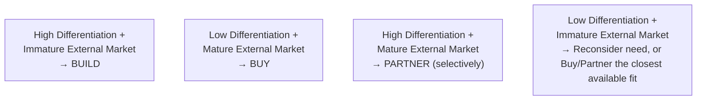

# Lesson 78: Build, Buy, or Partner: Platform vs. Point Solution Decisions

## Why This Lesson Matters

This lesson has been owed to you since Lesson 61, and it draws together threads from across this entire module. Lesson 61 first raised the question of whether a capability belongs at Layer 1 (built internally) or should instead be acquired through an external ecosystem. Lesson 62's API design discipline matters directly to how well a bought or partnered capability will actually integrate. Lesson 69's Friction Ledger established that internal platform investment carries real, often underestimated cost. Lesson 75's Moat Durability Matrix established that not every current capability is worth defending as though it were a genuine competitive advantage. Lesson 76's Integration Continuum addressed what happens once you've acquired a capability through M&A. Lesson 77's Portfolio Health Grid established that resources committed to any bet, including an internal build, deserve stage-appropriate scrutiny rather than momentum-driven continuation.

The build-versus-buy-versus-partner decision is one of the most consequential and most frequently mishandled decisions a product organization makes, because it is rarely approached as a single, explicit decision at all. Far more often, a capability simply gets built, by default, because building feels like the natural extension of what an engineering organization already knows how to do, without anyone ever seriously evaluating whether buying an existing solution or partnering with an external provider would better serve the company's actual strategic position. This default-to-build pattern, sometimes called "not invented here" syndrome, can consume years of engineering effort duplicating capability that was never going to differentiate the company in any meaningful way.

This lesson introduces the Capability Sourcing Matrix, this lesson's core mental model, to give you a structured way to make this decision deliberately, using the moat, migration, and portfolio disciplines this module has already built.

---

## Learning Path

| Field | Detail |
|---|---|
| **Module** | 8 — Advanced Strategy, Innovation & Enterprise/B2B Product Management |
| **Current Lesson** | 78 of 90 |
| **Difficulty** | 7 / 10 |
| **Estimated Study Time** | 40 minutes (reading) + 15 minutes (reflection + quiz) |
| **Prerequisites** | Lesson 61 (Leverage Stack), Lesson 69 (Friction Ledger), Lesson 75 (Moat Durability Matrix), Lesson 76 (Integration Continuum), Lesson 77 (Portfolio Health Grid) |
| **Next Lesson** | Lesson 79 — Pricing Strategy at Scale: Enterprise Contracts and Negotiation |
| **Future Topics Unlocked** | Lesson 79 (Pricing Strategy at Scale), Lesson 80 (Module Synthesis) — depend on the Capability Sourcing Matrix introduced here |

---

## Learning Objectives

By the end of this lesson, you will be able to:

1. Explain why "not invented here" syndrome causes companies to default to building capabilities that would be better bought or partnered for.
2. Apply the Capability Sourcing Matrix to determine whether a given capability should be built, bought, or partnered for.
3. Identify the role of the Moat Durability Matrix in determining whether a capability is genuinely worth building internally.
4. Explain how the total cost of an internal build, including ongoing Friction Ledger and Sunset Runway maintenance burden, should factor into a sourcing decision.
5. Evaluate a proposed internal build decision for whether it is justified by genuine strategic differentiation or merely by organizational default.

---

## Prerequisites

This lesson assumes fluency with the Leverage Stack (Lesson 61), the Friction Ledger (Lesson 69), the Moat Durability Matrix (Lesson 75), the Integration Continuum (Lesson 76), and the Portfolio Health Grid (Lesson 77), since this lesson explicitly integrates all five into a single sourcing decision framework.

---

## Theory

### Why Companies Default to Building

**"Not invented here" syndrome** describes an organizational tendency to prefer building a capability internally over acquiring it externally, often for reasons that have little to do with genuine strategic advantage: internal engineering teams often find building more interesting and career-advancing than integrating a third-party solution, existing organizational structure and headcount naturally expand to justify more internal ownership, and there is a comforting illusion of control in owning a capability outright, even when that control provides no meaningful strategic benefit. This default is dangerous specifically because it consumes real resources — engineering time, ongoing maintenance burden per the Friction Ledger from Lesson 69, and opportunity cost against genuinely differentiating work — without any corresponding strategic return, since a capability that provides no competitive differentiation gains nothing from being built rather than bought.

### The Capability Sourcing Matrix

This lesson introduces the **Capability Sourcing Matrix**, evaluating a capability along two dimensions: how central it is to genuine competitive differentiation, and how mature the external market's existing solutions for that capability already are.

A capability that is both genuinely core to the company's moat, per the Moat Durability Matrix from Lesson 75, and has no mature external solution available should generally be **built**, since building is the only way to obtain a capability that provides genuine differentiation and cannot be acquired otherwise. A capability that provides no meaningful differentiation and has mature, well-established external solutions available should generally be **bought**, since building it internally would consume resources duplicating something that offers no strategic return. A capability that is genuinely differentiating but where mature external solutions do already exist calls for a more nuanced **partner** approach, often integrating an external provider's capability while retaining differentiation through how that capability is applied, combined, or presented, rather than through owning the underlying technology itself. A capability that is neither differentiating nor well-served by mature external solutions should prompt a more fundamental question about whether the capability is genuinely needed at all, or whether the closest available external fit, however imperfect, is still preferable to an internal build with no strategic justification.

### Total Cost of Ownership, Not Just Initial Build Cost

A sourcing decision evaluated only on initial build cost systematically underestimates the true cost of building, because it ignores the ongoing maintenance burden a built capability imposes — precisely the Friction Ledger concern from Lesson 69, since an internally built capability becomes, in effect, an internal platform that must be maintained, documented, and supported indefinitely, and precisely the Sunset Runway concern from Lesson 68, since retiring a built capability later, once dependents have accumulated, carries its own significant migration cost. A capability that seemed reasonably cheap to build in isolation can become considerably more expensive once its full lifecycle cost — ongoing maintenance, internal support burden, and eventual retirement difficulty if it's ever superseded by a better external solution — is honestly accounted for.

### Revisiting Existing Builds Through the Portfolio Health Grid

The Capability Sourcing Matrix is not only relevant for new capability decisions; it should periodically be applied to existing internally-built capabilities as well, since a capability that was correctly built years ago, when no mature external market existed, may no longer justify continued internal investment if a mature external market has since developed. This connects directly to the Portfolio Health Grid from Lesson 77: an existing internal build should be evaluated with the same stage-appropriate, evidence-based rigor as any other ongoing bet, rather than continuing indefinitely simply because it already exists and reversing the decision would require politically difficult acknowledgment that a prior investment should now be reconsidered.

---

## Common Beginner Mistakes

1. **Defaulting to build without seriously evaluating whether mature external solutions already exist.** "Not invented here" syndrome causes many capabilities to be built internally by default, without a genuine market scan of available alternatives.
2. **Evaluating a build decision using only initial development cost, ignoring ongoing maintenance and eventual retirement cost.** This systematically understates the true cost of building relative to buying or partnering.
3. **Assuming any capability the company has built must be strategically important, simply because resources have already been invested in it.** Sunk cost should not substitute for an honest Moat Durability Matrix assessment of whether the capability is genuinely differentiating.
4. **Treating "buy" as always cheaper and "build" as always more strategically valuable, without checking the specific quadrant a capability actually occupies.** Buying a genuinely differentiating capability from an external vendor can hand a strategic advantage to any competitor who buys the same solution; building a non-differentiating capability wastes resources with no corresponding strategic gain.
5. **Failing to periodically revisit existing build decisions as the external market matures.** A build decision that was correct at the time it was made can become outdated as external solutions improve, and failing to revisit it wastes ongoing resources on maintaining a now-unnecessary internal capability.

---

## Mental Model: The Capability Sourcing Matrix

The Capability Sourcing Matrix introduced above is this lesson's core takeaway tool. For any capability decision, whether new or previously built, ask:

1. **Is this capability genuinely central to the company's moat**, per the Moat Durability Matrix from Lesson 75, or does it merely feel important because significant resources have already been invested in it?
2. **How mature are the external market's existing solutions** for this specific capability, and has this been genuinely researched rather than assumed?
3. **Which quadrant does this capability actually occupy**, and does the company's current or proposed sourcing approach match that quadrant, rather than defaulting to build out of organizational habit?
4. **If evaluating an existing internal build, has its Portfolio Health Grid status been honestly reassessed**, accounting for its full total cost of ownership including ongoing Friction Ledger and Sunset Runway burden, rather than assuming its continuation is automatically justified?

A sourcing decision that can answer all four questions deliberately is far less likely to fall into the specific, costly trap of building a non-differentiating capability by default, or of failing to notice when a previously justified build no longer deserves continued internal investment.

---

## Real Company Example

Microsoft's approach to combining internal development, acquisition, and strategic partnership — including its well-publicized, deep strategic partnership with an external AI research organization rather than attempting to build every component of its AI strategy entirely in-house, alongside its history of acquiring companies like GitHub and building substantial infrastructure in-house for its core Azure cloud platform — is widely discussed as an example of a large organization applying differentiated sourcing decisions across different capabilities rather than defaulting uniformly to build, buy, or partner. Public commentary on Microsoft's overall strategy describes core infrastructure capabilities generally being built internally, while rapidly evolving external capabilities in areas where mature but valuable outside expertise already existed have more often been approached through significant partnership or acquisition rather than being built entirely from scratch.

**Assumption flagged:** the specifics of Microsoft's internal sourcing decision rationale for any particular capability described here are drawn from public commentary and industry reporting, not confirmed internal company statements, and should be treated as illustrative and general rather than a claim about specific internal deliberations.

---

## Real World Perspective

**Startup:** Early-stage companies typically default heavily toward buying or partnering for any non-core capability (payments processing, authentication, basic infrastructure), reserving scarce engineering resources almost entirely for the specific capability that constitutes the company's actual differentiation, since building non-differentiating infrastructure at this stage represents a particularly costly opportunity cost relative to the company's limited resources.

**Mid-size company:** This is typically where "not invented here" syndrome first becomes a genuine organizational risk, as growing engineering headcount and organizational structure create internal pressure to build capabilities in-house that could reasonably be bought or partnered for, often justified by comfortable but ultimately unexamined assumptions about strategic importance.

**Big Tech:** Large, resource-rich organizations typically maintain the internal capability to build almost anything, making the Capability Sourcing Matrix's discipline especially important precisely because the constraint at this scale is rarely whether building is technically feasible, but whether it represents the best use of resources relative to genuinely differentiating alternative investments.

---

## Detailed Case Study: The Custom Analytics Platform

A mid-size e-commerce company decided, several years prior, to build a custom internal analytics and business intelligence platform, reasoning at the time that off-the-shelf analytics solutions were immature and poorly suited to the company's specific data needs — a defensible build decision under the Capability Sourcing Matrix's logic at that time, given a genuinely immature external market. The internal platform was built by a dedicated team of engineers and became deeply embedded across the company's reporting and decision-making processes.

Over the following several years, the external market for analytics and business intelligence platforms matured substantially, with several vendors developing sophisticated, highly capable, and reasonably priced solutions that would have met the company's evolving needs. No one within the company, however, ever revisited the original build decision, since the internal platform was functioning adequately, and questioning a multi-year internal investment felt organizationally uncomfortable. The dedicated internal team continued growing over time to maintain and extend the platform — a direct, escalating Friction Ledger cost from Lesson 69 — even as external alternatives that would have required a small fraction of that ongoing investment became genuinely superior in capability.

**What went wrong?** Using the Capability Sourcing Matrix, the original build decision was reasonable at the time it was made, but the capability's classification should have been periodically revisited as the external market matured. Analytics and business intelligence, for this particular company, had never been a genuine source of competitive differentiation — the company's actual moat, per Lesson 75, rested elsewhere, in its product selection and logistics capability — meaning the capability had, in fact, drifted from a defensible "high differentiation, immature market" Build quadrant into a "low differentiation, mature market" Buy quadrant over time, without anyone applying the Portfolio Health Grid's discipline to notice and act on that drift.

The company's recovery involved a deliberate, honest reassessment using the Capability Sourcing Matrix, ultimately transitioning to a mature external analytics platform and redeploying the internal team's engineering capacity toward genuinely differentiating work in the company's actual core competency — a transition that itself required careful Sunset Runway-style migration planning from Lesson 68, given how deeply the internal platform had become embedded across the organization's existing workflows.

---

## Framework Explanation: The Build-Buy-Partner Decision Checklist

Before finalizing a sourcing decision, whether for a new capability or a reassessment of an existing build, a PM can use the following checklist:

| Checklist Item | Question to Ask | Risk if Skipped |
|---|---|---|
| Genuine Differentiation | Does this capability genuinely contribute to the company's moat, per the Moat Durability Matrix? | Resources are invested in building non-differentiating capability with no strategic return |
| External Market Maturity | Has the external market genuinely been researched, rather than assumed to be immature by default? | A mature, superior external solution is overlooked in favor of an unnecessary internal build |
| Total Cost of Ownership | Does the cost analysis include ongoing Friction Ledger maintenance burden and eventual Sunset Runway retirement cost, not just initial build cost? | The true cost of building is systematically underestimated |
| Integration Compatibility | If buying or partnering, does the external solution meet the Promise Tiers and API design standards from Lesson 62? | A poorly integrated external solution creates its own friction and reliability risk |
| Periodic Reassessment | Is there a process for periodically revisiting this sourcing decision as the external market evolves? | A previously correct build decision becomes outdated without anyone noticing, as in the Case Study |

A "no" on Periodic Reassessment should be treated as a meaningful long-term risk, since, as the Case Study shows, even a genuinely correct original decision can become costly over time if never revisited.

---

## Interview Perspective

**"How would you decide whether to build a new capability internally, buy an existing solution, or partner with an external provider?"** The interviewer is evaluating whether you propose something resembling the Capability Sourcing Matrix — genuinely assessing differentiation and external market maturity — rather than defaulting to build out of organizational habit or assuming buy is always cheaper.

**"What's the risk of 'not invented here' syndrome in a growing engineering organization?"** The interviewer is testing whether you recognize this as a genuine organizational tendency with real resource costs, rather than a rare or unusual failure mode.

**"Tell me about a time a company you know of built something internally that probably should have been bought instead, or vice versa."** The interviewer is listening for a diagnosis resembling the Custom Analytics Platform case study — a capability whose sourcing classification became outdated over time, or was never genuinely differentiating in the first place, rather than a vague account of "engineering just liked building things."

---

## Summary

Companies default to building capabilities internally more often than a genuine strategic assessment would justify, driven by "not invented here" syndrome — organizational and individual incentives that favor internal ownership regardless of whether it provides genuine competitive return. The Capability Sourcing Matrix evaluates a capability along genuine competitive differentiation, drawing directly on the Moat Durability Matrix from Lesson 75, and external market maturity, recommending Build only when a capability is both genuinely differentiating and poorly served by existing external solutions, Buy when a capability offers no meaningful differentiation and mature external solutions exist, and a more nuanced Partner approach when a capability is differentiating despite a mature external market already existing. A sourcing decision evaluated only on initial build cost systematically understates the true cost of building, since it ignores the ongoing Friction Ledger maintenance burden and eventual Sunset Runway retirement cost a built capability imposes over its full lifecycle. Critically, the Capability Sourcing Matrix should be applied not only to new capability decisions but periodically to existing internal builds as well, using the same stage-appropriate rigor as the Portfolio Health Grid from Lesson 77, since a build decision that was genuinely correct when originally made can drift into an outdated, costly default as external markets mature — exactly the failure this lesson's Case Study illustrates, where organizational discomfort with revisiting a multi-year investment allowed a once-justified internal build to consume resources long after a superior external alternative had emerged.

---

## Key Takeaways

- "Not invented here" syndrome causes organizations to default to building capabilities internally for reasons unrelated to genuine strategic advantage.
- The Capability Sourcing Matrix evaluates a capability by genuine competitive differentiation (per the Moat Durability Matrix) and external market maturity, recommending Build, Buy, or Partner accordingly.
- Total cost of ownership for an internal build must include ongoing Friction Ledger maintenance burden and eventual Sunset Runway retirement cost, not just initial development cost.
- A capability that is genuinely differentiating but has mature external alternatives calls for a nuanced Partner approach rather than a simple Build-or-Buy binary.
- Existing internal builds should be periodically revisited using the Capability Sourcing Matrix, since a genuinely correct original decision can become outdated as external markets mature.
- Organizational discomfort with reversing a prior investment should not substitute for an honest reassessment of a capability's genuine strategic value.
- A build decision should never be assumed justified simply because significant resources have already been invested in it.

---

## Cheat Sheet

- "Not invented here" is a real organizational bias, not just an occasional exception. Watch for it.
- Capability Sourcing Matrix: differentiation × external market maturity → Build, Buy, Partner, or Reconsider.
- Total cost of ownership includes ongoing maintenance (Friction Ledger) and eventual retirement (Sunset Runway) — not just initial build cost.
- Revisit existing builds periodically. A correct decision years ago can be outdated today.
- Sunk cost is not a reason to keep building or maintaining a non-differentiating capability.

---

## Glossary

| Term | Definition | Related Concepts | Difficulty |
|---|---|---|---|
| Not Invented Here Syndrome | An organizational tendency to prefer building internally over acquiring externally, often for non-strategic reasons | Capability Sourcing Matrix | 2 |
| Capability Sourcing Matrix | A model evaluating whether a capability should be built, bought, or partnered for, based on differentiation and external market maturity | Moat Durability Matrix (Lesson 75) | 2 |
| Total Cost of Ownership | The full lifecycle cost of a capability, including initial build, ongoing maintenance, and eventual retirement | Friction Ledger (Lesson 69), Sunset Runway (Lesson 68) | 2 |
| Build-Buy-Partner Decision Checklist | A five-item checklist confirming a sourcing decision is genuinely justified rather than defaulted | Capability Sourcing Matrix | 2 |
| Periodic Reassessment | The practice of revisiting an existing sourcing decision as external market conditions evolve | Portfolio Health Grid (Lesson 77) | 2 |

---

## Further Reading / Resources

1. *The Innovator's Dilemma* by Clayton Christensen
2. *Wardley Maps* by Simon Wardley
3. *Team Topologies* by Matthew Skelton and Manuel Pais

---

## Flashcards

**Front:** What is "not invented here" syndrome?
**Back:** An organizational tendency to prefer building a capability internally over acquiring it externally, often for reasons unrelated to genuine strategic advantage.
**Difficulty:** Easy
**Tags:** #build-buy-partner #core-concept

**Front:** What are the two axes of the Capability Sourcing Matrix?
**Back:** Genuine competitive differentiation and external market maturity.
**Difficulty:** Easy
**Tags:** #capability-sourcing-matrix

**Front:** When should a capability generally be built internally?
**Back:** When it is genuinely central to the company's moat and no mature external solution already exists.
**Difficulty:** Medium
**Tags:** #build-decision

**Front:** Why does evaluating a build decision on initial cost alone understate its true cost?
**Back:** It ignores ongoing Friction Ledger maintenance burden and eventual Sunset Runway retirement cost over the capability's full lifecycle.
**Difficulty:** Medium
**Tags:** #total-cost-of-ownership

**Front:** What went wrong in the Custom Analytics Platform case study?
**Back:** A build decision that was reasonable when the external market was immature was never revisited as the market matured, allowing a non-differentiating internal platform to consume growing resources long after superior external alternatives existed.
**Difficulty:** Hard
**Tags:** #case-study #capability-sourcing-matrix

**Front:** Why should existing internal builds be periodically reassessed?
**Back:** A build decision that was genuinely correct when made can become outdated as external markets mature, and organizational discomfort with reversing prior investment shouldn't prevent honest reassessment.
**Difficulty:** Hard
**Tags:** #periodic-reassessment

**Front:** What quadrant of the Capability Sourcing Matrix calls for a Partner approach?
**Back:** High differentiation combined with a mature external market, where integrating an external provider while retaining differentiation elsewhere is often preferable to building from scratch.
**Difficulty:** Medium
**Tags:** #partner-quadrant

---

## Reflection Exercise

You are the PM responsible for a company's internal customer support ticketing system, built in-house five years ago when the company judged available off-the-shelf solutions to be a poor fit for its specific workflow needs. The system now requires a small but growing dedicated maintenance team, and you've recently learned that several external vendors now offer sophisticated, highly customizable solutions that may meet the company's current needs.

There is no single correct answer to the prompts below — the goal is to practice applying the Capability Sourcing Matrix and the Build-Buy-Partner Decision Checklist to reassess a multi-year-old build decision.

1. Using the Moat Durability Matrix from Lesson 75, is a customer support ticketing system likely to be a genuine source of competitive differentiation for this company? Why or why not?
2. Using the Capability Sourcing Matrix, which quadrant did this capability likely occupy five years ago, and which quadrant might it occupy today?
3. What would a genuine total cost of ownership analysis look like, including the ongoing Friction Ledger burden of the current maintenance team?
4. What organizational resistance might you expect when proposing to reassess this five-year-old build decision, and how would you address it?
5. If you decide to transition to an external solution, what Sunset Runway considerations from Lesson 68 would be most important to plan for?

---

## Quiz

**1. What is "not invented here" syndrome?**
A) A legal restriction preventing companies from using external software
B) An organizational tendency to prefer building a capability internally over acquiring it externally, often for reasons unrelated to genuine strategic advantage
C) A technical limitation preventing certain capabilities from ever being built internally
D) A marketing strategy used to differentiate a company's products

*Correct answer: B*
*Explanation: This term specifically describes the organizational and individual incentives favoring internal build regardless of genuine strategic return.*
*Learning objective tested: #1*
*Difficulty: Easy*

---

**2. What are the two axes of the Capability Sourcing Matrix?**
A) Revenue and headcount
B) Genuine competitive differentiation and external market maturity
C) Time-to-market and initial development cost
D) Company size and industry vertical

*Correct answer: B*
*Explanation: These two dimensions are explicitly introduced in the Theory section as the Matrix's evaluative axes.*
*Learning objective tested: #2*
*Difficulty: Easy*

---

**3. When does the Capability Sourcing Matrix recommend Build?**
A) Whenever a company has sufficient engineering resources available
B) When a capability is genuinely central to the company's moat and no mature external solution exists
C) Whenever a capability is easy and cheap to build
D) Whenever competitors have already built a similar capability

*Correct answer: B*
*Explanation: Build is recommended specifically for the high-differentiation, immature-market quadrant.*
*Learning objective tested: #2, #3*
*Difficulty: Easy*

---

**4. How does the Moat Durability Matrix from Lesson 75 factor into the Capability Sourcing Matrix?**
A) It has no relevance to sourcing decisions
B) It provides the basis for assessing whether a capability is genuinely differentiating, one of the two Sourcing Matrix axes
C) It only applies to Buy decisions, never Build decisions
D) It replaces the need for the Capability Sourcing Matrix entirely

*Correct answer: B*
*Explanation: The lesson explicitly draws on the Moat Durability Matrix to assess the differentiation axis of the Capability Sourcing Matrix.*
*Learning objective tested: #3*
*Difficulty: Easy*

---

**5. Why does evaluating a build decision using only initial development cost understate the true cost of building?**
A) Initial development cost is always the largest component of total cost
B) It ignores ongoing Friction Ledger maintenance burden and eventual Sunset Runway retirement cost over the capability's full lifecycle
C) Initial development cost is technically impossible to measure accurately
D) Ongoing maintenance costs are always negligible regardless of capability type

*Correct answer: B*
*Explanation: The lesson explicitly connects total cost of ownership to the ongoing maintenance and eventual retirement concerns raised in Lessons 68 and 69.*
*Learning objective tested: #4*
*Difficulty: Easy*

---

**6. In the Custom Analytics Platform case study, why was the original build decision reasonable at the time it was made?**
A) The company had unlimited engineering resources at the time
B) The external market for analytics solutions was genuinely immature, making Build a defensible choice under the Capability Sourcing Matrix's logic at that time
C) The decision was never actually reasonable, even at the time it was made
D) Competitors had not yet built any analytics capability of their own

*Correct answer: B*
*Explanation: The case study explicitly frames the original decision as defensible given the genuinely immature external market at that time.*
*Learning objective tested: #2, #5*
*Difficulty: Easy*

---

**7. What was the actual root cause of the Custom Analytics Platform's ongoing problem?**
A) The internal platform had always been technically inferior to available alternatives
B) The sourcing decision was never revisited as the external market matured, allowing a non-differentiating capability to consume growing resources unnecessarily
C) The company never invested any resources in maintaining the platform
D) External analytics vendors never actually developed viable competing solutions

*Correct answer: B*
*Explanation: The failure was a lack of periodic reassessment, not an inherently flawed original decision or technical failure.*
*Learning objective tested: #5*
*Difficulty: Medium*

---

**8. According to the Build-Buy-Partner Decision Checklist, what does a "no" on Periodic Reassessment indicate?**
A) A minor administrative gap with no real consequence
B) A meaningful long-term risk, since even a genuinely correct original decision can become costly over time if never revisited
C) That the original sourcing decision must have been incorrect
D) That the capability should be immediately discontinued

*Correct answer: B*
*Explanation: The lesson explicitly treats the absence of periodic reassessment as a meaningful risk given how sourcing decisions can become outdated.*
*Learning objective tested: #5*
*Difficulty: Medium*

---

**9. What sourcing approach does the Capability Sourcing Matrix recommend when a capability is genuinely differentiating but mature external solutions already exist?**
A) Immediately abandon the capability entirely
B) A nuanced Partner approach, often integrating an external provider's capability while retaining differentiation through application or combination rather than underlying ownership
C) Always Build regardless of external market maturity
D) Always Buy regardless of differentiation level

*Correct answer: B*
*Explanation: This specific quadrant calls for the more nuanced Partner recommendation rather than a simple Build-or-Buy binary.*
*Learning objective tested: #2, #3*
*Difficulty: Medium*

---

**10. Why might early-stage startups typically default toward buying or partnering for non-core capabilities, per the Real World Perspective section?**
A) Startups are legally prohibited from building any internal capabilities
B) Building non-differentiating infrastructure represents a particularly costly opportunity cost relative to a startup's limited resources
C) Off-the-shelf solutions are always technically superior regardless of company stage
D) Startups never need any non-core capabilities at all

*Correct answer: B*
*Explanation: The Real World Perspective section frames this as a reasonable resource-allocation trade-off given a startup's limited engineering capacity.*
*Learning objective tested: #1*
*Difficulty: Medium*

---

**11. Why does "not invented here" syndrome become a genuine organizational risk at mid-size companies specifically, per the Real World Perspective section?**
A) Mid-size companies never have any engineering resources at all
B) Growing engineering headcount and organizational structure create internal pressure to build capabilities in-house that could reasonably be bought or partnered for
C) Mid-size companies are legally required to build all capabilities internally
D) This risk only ever affects Big Tech-scale organizations

*Correct answer: B*
*Explanation: The Real World Perspective section connects this specific risk to the organizational dynamics typical of growing mid-size companies.*
*Learning objective tested: #1*
*Difficulty: Medium*

---

**12. (Scenario) A company built a payment processing system internally three years ago, when external options were limited, but mature, well-regarded external payment providers have since emerged. Using the Capability Sourcing Matrix, what should the company investigate?**
A) Whether the original decision should be permanently locked in regardless of market changes
B) Whether payment processing was ever genuinely a source of competitive differentiation, and whether the capability's classification has shifted from its original quadrant as the external market matured
C) Whether to immediately abandon the payment system with no transition planning
D) Whether competitors have also built similar internal payment systems

*Correct answer: B*
*Explanation: This directly applies the lesson's periodic reassessment discipline to a capability whose external market maturity has likely shifted since the original decision.*
*Learning objective tested: #2, #4, #5*
*Difficulty: Medium-Hard*

---

**13. (Product Thinking) A PM is told that reassessing a five-year-old internal build would be organizationally uncomfortable given the team already dedicated to maintaining it. Using this lesson's frameworks, what is the most defensible response?**
A) Avoid the reassessment entirely to prevent organizational discomfort
B) Conduct an honest Capability Sourcing Matrix and total-cost-of-ownership reassessment regardless of the discomfort, since sunk cost and organizational comfort shouldn't substitute for genuine strategic evaluation
C) Immediately disband the team without any transition planning
D) Assume the original decision must still be correct simply because it was made deliberately at the time

*Correct answer: B*
*Explanation: The correct response conducts an honest reassessment despite organizational discomfort, mirroring the Case Study's recovery process.*
*Learning objective tested: #4, #5*
*Difficulty: Hard*

---

**14. (Interview Reasoning) A candidate, asked how they'd decide whether to build or buy a new capability, focuses entirely on which option is cheaper in the short term, with no mention of differentiation or long-term maintenance cost. What does this most likely signal, per the Interview Perspective section?**
A) A strong and complete understanding of sourcing decisions
B) A gap in recognizing that genuine differentiation and total cost of ownership, not just short-term cost, are necessary considerations
C) That the candidate is ready for a senior sourcing strategy role immediately
D) Nothing meaningful; short-term cost is the only relevant factor in sourcing decisions

*Correct answer: B*
*Explanation: The Interview Perspective section specifically listens for recognition of differentiation and total cost of ownership, which this answer omits.*
*Learning objective tested: #2, #4, #5*
*Difficulty: Hard*

---

**15. (Product Thinking, Highest Difficulty) A company's internally-built analytics platform, once justified by an immature external market, now competes against mature, superior external alternatives, but the internal team maintaining it resists any suggestion of change. Using only the frameworks in this lesson, what is the most defensible course of action?**
A) Preserve the internal platform indefinitely to avoid any organizational conflict
B) Conduct an honest Capability Sourcing Matrix and Moat Durability Matrix reassessment, and if the capability is confirmed non-differentiating with mature external alternatives available, plan a careful Sunset Runway transition while redeploying the team's capacity toward genuinely differentiating work
C) Immediately terminate the internal platform with no transition period or migration planning
D) Continue building even more features into the internal platform to justify the team's continued existence

*Correct answer: B*
*Explanation: This mirrors the Reflection Exercise and Case Study: the correct response conducts an honest, evidence-based reassessment and executes a careful, Sunset-Runway-disciplined transition rather than either preserving the status quo indefinitely or making an abrupt, poorly-planned change.*
*Learning objective tested: #2, #3, #4, #5*
*Difficulty: Hard*

---

## Connections

| | Lesson | Core Idea Carried Forward |
|---|---|---|
| **Previous Lesson** | Lesson 77 — Innovation Accounting and Portfolio Management | Extends stage-appropriate portfolio evaluation into ongoing sourcing decisions for existing internal builds |
| **Current Lesson** | Lesson 78 — Build, Buy, or Partner: Platform vs. Point Solution Decisions | Capability Sourcing Matrix; not invented here syndrome; total cost of ownership; periodic reassessment |
| **Next Lesson** | Lesson 79 — Pricing Strategy at Scale: Enterprise Contracts and Negotiation | Extends resource-allocation and value-capture thinking into enterprise pricing and negotiation strategy |
| **Future Concepts Unlocked** | Lesson 80 (Module Synthesis) | Treats the Capability Sourcing Matrix as established canon alongside Module 8's other strategic frameworks |

This curriculum continues to build as one continuous argument. This lesson resolves the open threads planted in Lessons 61, 69, 75, 76, and 77 regarding capability sourcing, internal platform cost, moat assessment, integration decisions, and portfolio reassessment. From this lesson forward, any reference to a build-versus-buy-versus-partner decision assumes you can locate it on the Capability Sourcing Matrix without re-explanation.
