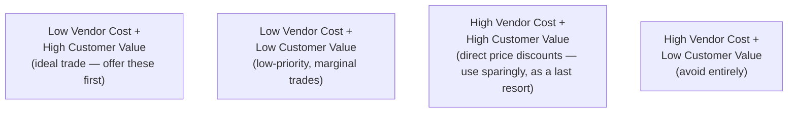

# Lesson 79: Pricing Strategy at Scale: Enterprise Contracts and Negotiation

## Why This Lesson Matters

Lesson 74 established that packaging should create natural expansion triggers, and Lesson 73 established that a B2B deal involves multiple stakeholders with distinct success criteria. This lesson addresses what happens at the specific moment those threads converge: the enterprise contract negotiation itself, where an Economic Buyer, often supported by a dedicated procurement function, actively pushes for concessions, and where a PM's decisions about what to concede, and how, have consequences that extend far beyond the single deal being negotiated.

A common and costly mistake in enterprise pricing negotiations is treating every negotiation lever as equivalent to a straightforward price discount. A sales or product team under pressure to close a deal will often default to reducing price directly, since it's the simplest lever to understand and the most immediately legible way to respond to a customer's stated budget constraint. This default, however, is frequently a poor trade: a direct price discount is expensive for the vendor in a way that compounds across every future renewal and every other customer who learns of the discount, while other, less commonly considered concessions — extended payment terms, adjusted contract length, specific non-price commitments — can often deliver comparable or greater value to the customer at meaningfully lower cost to the vendor.

This lesson introduces the Concession Exchange Map, this lesson's core mental model, to give you a structured way to identify which concessions to offer in an enterprise negotiation, prioritizing trades that deliver genuine value to the customer without unnecessarily eroding the vendor's own long-term economics.

---

## Learning Path

| Field | Detail |
|---|---|
| **Module** | 8 — Advanced Strategy, Innovation & Enterprise/B2B Product Management |
| **Current Lesson** | 79 of 90 |
| **Difficulty** | 6 / 10 |
| **Estimated Study Time** | 40 minutes (reading) + 15 minutes (reflection + quiz) |
| **Prerequisites** | Lesson 73 (Stakeholder Compass, Economic Buyer), Lesson 74 (Expansion Wedge), Lesson 63 (take rate and value capture) |
| **Next Lesson** | Lesson 80 — Module Synthesis: Advanced Strategic Judgment |
| **Future Topics Unlocked** | Lesson 80 (Module Synthesis) — draws on the Concession Exchange Map as established canon |

---

## Learning Objectives

By the end of this lesson, you will be able to:

1. Explain why defaulting to a direct price discount is often a poor negotiation trade relative to other available concessions.
2. Apply the Concession Exchange Map to identify concessions with high value to the customer and low cost to the vendor.
3. Identify the long-term compounding cost of setting a precedent through an individual deal's concessions.
4. Distinguish price-based and non-price-based negotiation levers and their respective long-term implications.
5. Evaluate a proposed enterprise contract negotiation for whether it is trading concessions efficiently relative to the Concession Exchange Map.

---

## Prerequisites

This lesson assumes the Stakeholder Compass and Economic Buyer role from Lesson 73, the Expansion Wedge from Lesson 74, and the take rate and value capture concepts from Lesson 63, since enterprise pricing negotiation is the point at which all three converge into a single, high-stakes conversation.

---

## Theory

### Why a Direct Price Discount Is Often a Poor Trade

A direct price discount is easy to understand and easy to grant, which is precisely why it is so often the default concession offered under negotiation pressure. But a price discount carries a specific, compounding cost that other concessions frequently do not: it establishes a new effective price point that the customer will reasonably expect to persist through future renewals, it can become known to other customers through industry conversation or public benchmarking services, undermining the vendor's ability to hold firm on price with anyone else, and it directly reduces revenue with no offsetting benefit unless it demonstrably unlocks value elsewhere (such as a larger deal size or a longer commitment). A concession that delivers genuine value to the customer without this specific compounding cost is, all else equal, a more efficient trade for the vendor to offer than an equivalent-value price discount.

### The Concession Exchange Map

This lesson introduces the **Concession Exchange Map**, plotting potential negotiation concessions along two dimensions: the cost the concession imposes on the vendor, and the value it delivers to the customer.

The Concession Exchange Map's discipline is identifying and offering concessions that fall into the top-left, ideal-trade quadrant before resorting to the direct-price-discount quadrant, which, while sometimes necessary, should be treated as an expensive last resort rather than a default first move. Concessions in the ideal quadrant frequently include things like: extended payment terms (net-60 or net-90 rather than net-30), which cost the vendor relatively little in exchange for meaningfully easing a customer's cash-flow constraints; flexible contract start dates aligned to the customer's fiscal year or budget cycle; specific onboarding or implementation support commitments that cost the vendor modest, largely fixed effort but address a customer's genuine concern about successful rollout; and usage-based flexibility (allowing some fluctuation in seat count or consumption without immediate contract renegotiation), which reduces customer risk without directly reducing the vendor's expected revenue.

### Non-Price vs. Price-Based Levers

**Price-based levers** directly reduce the amount the customer pays, either through a lower list price, a volume discount, or a promotional reduction, and these levers carry the compounding precedent cost described above. **Non-price-based levers** address a customer's underlying concern — cash flow timing, contract risk, implementation support, usage flexibility — without directly reducing the headline price, and these levers frequently do not carry the same precedent-setting cost, since they can often be tailored to the specific circumstances of an individual deal without establishing a new baseline expectation for every future customer. A skilled enterprise negotiator identifies which of a customer's stated concerns can genuinely be addressed through a non-price lever before defaulting to a price-based concession.

### The Compounding Cost of Precedent

A specific and easy-to-overlook risk in enterprise negotiation is that any concession granted in one deal can become a reference point in future negotiations, both with the same customer at renewal time and, through industry conversation or competitive benchmarking, with entirely different customers. A price discount granted to close one particularly urgent or high-visibility deal can quietly become the expected floor for an entire category of future customers, a cost that is rarely accounted for in the moment the discount is granted, since the immediate pressure is simply to close the deal in front of the negotiator, not to model the precedent's effect on every subsequent negotiation.

---

## Common Beginner Mistakes

**Mistake 1: Defaulting to a direct price discount as the first response to negotiation pressure**

Price-based levers carry compounding precedent costs that non-price levers frequently avoid, making them a less efficient first choice.

**Mistake 2: Failing to distinguish which of a customer's stated concerns are genuinely about price versus about a related but distinct issue, such as cash flow timing or implementation risk**

A customer complaining about "cost" may actually be more concerned about payment timing, which a non-price lever can address without any headline price reduction.

**Mistake 3: Granting a significant concession without considering its precedent effect on future renewals or other customers**

A concession that seems reasonable in isolation can become an expensive, difficult-to-reverse expectation once it establishes a new baseline.

**Mistake 4: Treating every concession as equally costly to the vendor, without mapping them onto something like the Concession Exchange Map**

This leads to offering high-cost concessions when lower-cost alternatives would have satisfied the same customer concern.

**Mistake 5: Negotiating price without reference to the Stakeholder Compass from Lesson 73**

A concession that satisfies the Economic Buyer's immediate budget concern may not address the Technical Evaluator's separate risk concerns, or vice versa, and treating the negotiation as a single-dimensional price conversation misses this.

---

## Mental Model: The Concession Exchange Map

The Concession Exchange Map introduced above is this lesson's core takeaway tool. Before granting any concession in an enterprise negotiation, ask:

1. **What is the customer's underlying concern**, and is it genuinely about headline price, or about a related but distinct issue like cash flow, contract risk, or implementation confidence?
2. **Where would the concession that addresses this concern actually fall on the Concession Exchange Map** — low vendor cost and high customer value, or high vendor cost and comparatively lower customer value?
3. **Have lower-cost, high-value non-price concessions been genuinely explored before resorting to a direct price discount**, rather than defaulting to price as the first and only lever considered?
4. **What precedent would this concession set for future renewals with this customer, and for other customers who may learn of it**, and is that precedent cost being genuinely weighed against the immediate benefit of closing this specific deal?

A negotiator who runs every concession decision through this Map is far more likely to close deals efficiently, preserving long-term pricing integrity rather than eroding it one seemingly-reasonable individual concession at a time.

---

## Real Company Example

Oracle's enterprise software licensing and negotiation practices, widely discussed in industry commentary for their complexity and the intensity of their negotiation processes, illustrate both the high-stakes nature of enterprise contract negotiation and, according to various industry accounts, considerable emphasis on structured discount tiers, multi-year commitment incentives, and specific contractual terms (such as audit rights and usage true-up clauses) rather than relying solely on ad hoc price discounting to close individual deals. Public commentary on enterprise software procurement broadly describes sophisticated buyers increasingly bringing dedicated procurement expertise to negotiations with vendors like Oracle, making a vendor's own discipline around which concessions to offer, and in what sequence, a genuinely consequential factor in the vendor's long-term pricing integrity.

**Assumption flagged:** the specifics of Oracle's internal negotiation strategy and discount governance practices described here are drawn from public commentary and industry reporting on enterprise software procurement broadly, not confirmed internal company statements, and should be treated as illustrative rather than verified fact.

---

## Real World Perspective: Pricing Strategy at Scale: Enterprise Contracts and Negotiation at Different Company Stages

**Startup:** Early-stage B2B companies negotiating their first few significant enterprise deals often lack established pricing discipline entirely, making them particularly susceptible to granting large, precedent-setting discounts under pressure to land a marquee early customer, without appreciating how that discount will complicate every subsequent negotiation.

**Mid-size company:** This is typically where formal discount governance and negotiation playbooks first become a genuine organizational priority, as a growing sales team negotiating many simultaneous deals creates real risk of inconsistent, uncoordinated concessions that collectively erode pricing integrity across the customer base.

**Big Tech:** Mature enterprise vendors typically maintain formal, centrally-governed discount approval processes and negotiation playbooks explicitly informed by something resembling the Concession Exchange Map, precisely because the scale of deals being negotiated simultaneously makes uncoordinated, ad hoc concessions prohibitively expensive in aggregate.

---

## Detailed Case Study: The Discount That Became the Floor

A B2B software company was negotiating a large, strategically significant deal with a well-known enterprise customer whose logo the sales team believed would meaningfully help attract other customers in the same industry vertical. Under pressure to close the deal before the end of the fiscal quarter, the sales team granted a substantial direct price discount — considerably steeper than any discount previously offered to a customer of comparable size — reasoning internally that the strategic value of the logo justified the concession.

Within the following year, several problems emerged. The customer, at renewal time, expected the same discounted rate to continue, treating the original discount as an established baseline rather than a one-time concession. Separately, industry conversation and informal benchmarking among customers in the same vertical meant that at least two subsequent prospective customers referenced the known discount level during their own negotiations, using it as a credible anchor to demand comparable treatment. The sales team, having never mapped the original concession against something like the Concession Exchange Map, had not considered offering non-price alternatives — extended payment terms, phased implementation support, or contract flexibility — that might have addressed the original customer's actual underlying concern (a tight initial budget cycle) without establishing a new, compounding price expectation across the broader market.

**What went wrong?** Using the Concession Exchange Map, the failure is precise: the sales team defaulted directly to the highest-cost, most precedent-setting quadrant of concession (a direct price discount) without genuinely exploring lower-cost alternatives that might have addressed the same underlying concern, and without weighing the concession's compounding precedent cost against the immediate, visible benefit of closing a single strategically significant deal. The "logo value" rationale, however reasonable it felt in the moment, did not account for the ongoing cost the discount would impose across every subsequent negotiation in the same market segment.

The company's recovery involved instituting a formal discount governance process requiring any significant price-based concession to be reviewed against available non-price alternatives before approval, explicitly documenting precedent risk as part of every major deal's negotiation record, and training the sales organization on the Concession Exchange Map's logic — a discipline this curriculum will connect to the broader Module 8 synthesis in Lesson 80.

---

## Framework Explanation: The Enterprise Contract Negotiation Checklist

Before finalizing an enterprise contract negotiation, a PM or sales team can use the following checklist:

| Checklist Item | Question to Ask | Risk if Skipped |
|---|---|---|
| Underlying Concern Identified | Is the customer's stated price concern actually about headline price, or a related but distinct issue? | A price-based concession is offered when a non-price lever would have addressed the real concern |
| Non-Price Alternatives Explored | Have lower-cost, high-value non-price concessions genuinely been considered before a price discount? | Expensive precedent-setting discounts are granted when cheaper alternatives were available |
| Precedent Documented | Is the precedent risk of any significant concession explicitly documented and reviewed? | Future renewals and other customers reference an undocumented, uncoordinated discount as a baseline |
| Multi-Year and True-Up Terms Considered | Does the contract include appropriate multi-year structure or usage true-up clauses matched to the Expansion Wedge from Lesson 74? | The contract fails to capture natural expansion value or locks in an unfavorable long-term rate |
| Stakeholder-Matched Concessions | Does the concession address the specific stakeholder (Economic Buyer, Technical Evaluator) whose concern actually motivated the request? | A concession satisfies the wrong stakeholder's concern, leaving the actual objection unaddressed |

A "no" on Non-Price Alternatives Explored should be treated as a significant gap, given how consistently defaulting straight to price discounting, as in the Case Study, produces compounding long-term costs that far exceed the value of closing any single deal.

---

## Interview Perspective: How Interviewers Think About This

**"How would you respond if a large enterprise customer pushed back hard on price during a contract negotiation?"** The interviewer is evaluating whether you propose exploring the customer's underlying concern and non-price alternatives, per the Concession Exchange Map, rather than defaulting immediately to a price discount.

**"What's the risk of granting a significant one-time discount to close a strategically important deal?"** The interviewer is testing whether you recognize the compounding precedent cost illustrated in this lesson's Case Study, where a single discount became an expected baseline across future renewals and other customers.

**"How would you structure a multi-year enterprise contract to balance customer flexibility with the vendor's long-term revenue interests?"** The interviewer is listening for awareness of both price and non-price levers, and a connection to the Expansion Wedge concept from Lesson 74 regarding how contract structure should support, rather than undermine, natural account growth.

---

## Summary

Defaulting to a direct price discount as the first response to enterprise negotiation pressure is frequently a poor trade, since price-based concessions carry a specific, compounding cost — establishing a new baseline expectation for future renewals and providing a credible anchor for other customers' negotiations — that many non-price alternatives avoid. The Concession Exchange Map plots potential concessions along vendor cost and customer value, prioritizing the identification of low-cost, high-value trades — extended payment terms, flexible contract timing, implementation support commitments, usage flexibility — before resorting to the expensive, precedent-setting quadrant occupied by direct price discounts. A skilled negotiator identifies a customer's genuine underlying concern, which is often about cash flow timing, contract risk, or implementation confidence rather than headline price itself, and matches that concern to the specific stakeholder (per the Stakeholder Compass from Lesson 73) actually motivating the request, rather than treating every negotiation as a single-dimensional price conversation. The compounding cost of precedent is easy to overlook in the moment a concession is granted, since the immediate pressure is simply to close the deal in front of the negotiator, but a discount granted to close one visible or strategically significant deal can quietly become the expected floor for an entire category of future customers, a cost that dramatically exceeds the value of the single deal it was meant to secure.

---

## Key Takeaways

- Direct price discounts carry a compounding precedent cost that many non-price concessions avoid, making them a less efficient first negotiation lever.
- The Concession Exchange Map plots concessions by vendor cost and customer value, prioritizing low-cost, high-value trades before resorting to price discounts.
- A customer's stated price concern is often actually about a related but distinct issue — cash flow timing, contract risk, implementation confidence — addressable through a non-price lever.
- Any significant concession can become a reference point in future negotiations, both at renewal and with entirely different customers who learn of it.
- Concessions should be matched to the specific stakeholder (per the Stakeholder Compass) whose concern actually motivated the request.
- Formal discount governance processes help prevent uncoordinated, precedent-setting concessions across a growing sales organization.
- The immediate benefit of closing a single strategically significant deal must be weighed against the compounding cost the concession may impose on every subsequent negotiation.

---

## Cheat Sheet

*A two-minute review of everything in this lesson.*

- Price discounts compound in cost — they become the new floor for renewals and other customers.
- Concession Exchange Map: low vendor cost + high customer value = ideal trade. Direct price discounts = expensive, last resort.
- Ask what the customer's concern actually is before assuming it's about headline price.
- Match concessions to the right stakeholder — Economic Buyer vs. Technical Evaluator have different concerns.
- Document precedent risk before granting any significant concession.

---

## Glossary

| Term | Definition | Related Concepts | Difficulty |
|---|---|---|---|
| Concession Exchange Map | A model plotting negotiation concessions by vendor cost and customer value | Price-Based vs. Non-Price Levers | 2 |
| Price-Based Lever | A negotiation concession that directly reduces the amount the customer pays | Concession Exchange Map | 1 |
| Non-Price Lever | A negotiation concession addressing a customer's underlying concern without reducing headline price | Concession Exchange Map | 2 |
| Precedent Cost | The compounding risk that a concession becomes an expected baseline for future renewals or other customers | Concession Exchange Map | 2 |
| Enterprise Contract Negotiation Checklist | A five-item checklist for evaluating a negotiation before finalizing contract terms | Concession Exchange Map | 2 |

---

## Further Reading / Resources

- Chris Voss and Tahl Raz, *Never Split the Difference*
- Madhavan Ramanujam and Georg Tacke, *Monetizing Innovation*
- Roger Fisher and William Ury, *Getting to Yes*

---

## Flashcards

**Card 1**
- Front: Why is a direct price discount often a poor negotiation trade?
- Back: It establishes a new baseline expectation for future renewals and can become a credible anchor other customers use in their own negotiations, compounding its cost over time.
- Difficulty: 2
- Tags: pricing-strategy, core-concept

**Card 2**
- Front: What are the two dimensions of the Concession Exchange Map?
- Back: Vendor cost and customer value.
- Difficulty: 2
- Tags: concession-exchange-map

**Card 3**
- Front: Name two examples of low-vendor-cost, high-customer-value concessions.
- Back: Extended payment terms (e.g., net-60 or net-90) and flexible contract start dates aligned to the customer's fiscal year.
- Difficulty: 2
- Tags: non-price-levers

**Card 4**
- Front: Why might a customer's stated concern about "cost" actually be about something else?
- Back: The underlying issue might be cash flow timing, contract risk, or implementation confidence rather than headline price itself, addressable through a non-price lever.
- Difficulty: 2
- Tags: underlying-concern

**Card 5**
- Front: What went wrong in the Discount That Became the Floor case study?
- Back: A large, precedent-setting price discount was granted to close a strategically significant deal without exploring non-price alternatives, and it became an expected baseline for renewals and other customers' negotiations.
- Difficulty: 2
- Tags: case-study, precedent-cost

**Card 6**
- Front: Why should concessions be matched to the specific stakeholder motivating the request?
- Back: A concession satisfying the Economic Buyer's concern may not address a Technical Evaluator's separate concern, per the Stakeholder Compass from Lesson 73, leaving the actual objection unresolved.
- Difficulty: 2
- Tags: stakeholder-matched-concessions

**Card 7**
- Front: Why should precedent risk be explicitly documented before granting a significant concession?
- Back: Because the compounding cost of a concession is easy to overlook in the moment, given the immediate pressure to close the specific deal in front of the negotiator.
- Difficulty: 2
- Tags: precedent-documentation

## Reflection Exercise

You are the PM supporting a negotiation with a large prospective enterprise customer who has requested a 30% price reduction, citing budget constraints for the current fiscal year. Your sales team is under pressure to close the deal before quarter-end and is considering simply granting the requested discount.

There is no single correct answer to the prompts below — the goal is to practice applying the Concession Exchange Map and the Enterprise Contract Negotiation Checklist before defaulting to a direct price concession.

1. What questions would you want the sales team to ask the customer to better understand whether the "budget constraint" concern is genuinely about headline price or about something else, like cash flow timing?
2. Using the Concession Exchange Map, what non-price alternatives might address a genuine fiscal-year budget constraint without directly reducing the contract's total value?
3. If a price-based concession does ultimately prove necessary, how would you structure it to minimize precedent risk for future renewals and other customers?
4. Using the Stakeholder Compass from Lesson 73, which stakeholder is most likely driving this specific request, and does that change which concession would be most effective?
5. How would you document this negotiation's precedent risk for future reference, regardless of which concession is ultimately granted?

---

## Quiz

**1. Why is a direct price discount often a poor negotiation trade compared to other concessions?**
A) Price discounts are always illegal in enterprise contracts
B) It establishes a new baseline expectation for future renewals and can become a credible anchor for other customers' negotiations
C) Customers never actually value price discounts
D) Price discounts have no measurable cost to the vendor

*Correct answer: B*
*Explanation: The lesson's central argument is that price discounts carry a specific, compounding precedent cost that many other concessions avoid.*
*Learning objective tested: #1*
*Difficulty: Easy*

---

**2. What are the two dimensions of the Concession Exchange Map?**
A) Contract length and deal size
B) Vendor cost and customer value
C) Sales team size and quota attainment
D) Customer industry and geography

*Correct answer: B*
*Explanation: These two dimensions are explicitly introduced in the Theory section as the Map's evaluative axes.*
*Learning objective tested: #2*
*Difficulty: Easy*

---

**3. Which quadrant of the Concession Exchange Map represents the ideal trade to offer first?**
A) High vendor cost, low customer value
B) Low vendor cost, high customer value
C) High vendor cost, high customer value
D) Low vendor cost, low customer value

*Correct answer: B*
*Explanation: This quadrant delivers genuine customer value at minimal cost to the vendor, making it the priority trade before resorting to price discounts.*
*Learning objective tested: #2*
*Difficulty: Easy*

---

**4. What is a "non-price lever" in enterprise negotiation?**
A) A concession that always costs the vendor more than a price discount
B) A concession addressing a customer's underlying concern without directly reducing headline price
C) A negotiation tactic that is illegal in most jurisdictions
D) A concession only available to the largest possible customers

*Correct answer: B*
*Explanation: Non-price levers address underlying concerns like cash flow or risk without the compounding precedent cost of a direct price reduction.*
*Learning objective tested: #3, #4*
*Difficulty: Easy*

---

**5. Why might a customer's stated concern about "cost" actually reflect a different underlying issue?**
A) Customers never have genuine concerns about price
B) The real issue might be cash flow timing, contract risk, or implementation confidence, which a non-price lever could address
C) All customer concerns are always genuinely about headline price with no exceptions
D) Price concerns are always resolved by increasing the price, not decreasing it

*Correct answer: B*
*Explanation: The lesson explicitly identifies these alternative underlying concerns as frequently masquerading as a simple price objection.*
*Learning objective tested: #3*
*Difficulty: Easy*

---

**6. What is "precedent cost," as described in this lesson?**
A) The immediate revenue lost from a single discount
B) The compounding risk that a concession becomes an expected baseline for future renewals or other customers who learn of it
C) The legal cost of drafting a new contract
D) A cost that only applies to non-price concessions, never price discounts

*Correct answer: B*
*Explanation: Precedent cost specifically describes this compounding, forward-looking risk beyond the immediate deal.*
*Learning objective tested: #3, #5*
*Difficulty: Easy*

---

**7. In the Discount That Became the Floor case study, what specifically caused the discount to compound in cost?**
A) The customer immediately churned after receiving the discount
B) The customer expected the same rate at renewal, and other prospective customers in the same industry vertical referenced the known discount level in their own negotiations
C) The discount was reversed within one month with no lasting effect
D) No other customers ever learned about the discount

*Correct answer: B*
*Explanation: The case study explicitly describes both the renewal expectation and the cross-customer precedent effect as the compounding mechanisms.*
*Learning objective tested: #3, #5*
*Difficulty: Medium*

---

**8. What did the sales team fail to do before granting the discount in the case study?**
A) Close the deal within the fiscal quarter
B) Explore lower-cost, high-value non-price alternatives that might have addressed the same underlying concern
C) Communicate with the customer at all before the negotiation
D) Offer a discount of any kind

*Correct answer: B*
*Explanation: The failure was defaulting directly to the highest-cost concession quadrant without considering cheaper, non-price alternatives first.*
*Learning objective tested: #4, #5*
*Difficulty: Medium*

---

**9. According to the Enterprise Contract Negotiation Checklist, what does a "no" on Non-Price Alternatives Explored indicate?**
A) A minor procedural gap with no real consequence
B) A significant gap, since defaulting straight to price discounting produces compounding long-term costs that can far exceed the value of a single deal
C) That the negotiation is ready to be finalized as-is
D) That price discounts are always the correct choice regardless of alternatives

*Correct answer: B*
*Explanation: The lesson treats this omission as a significant risk given the compounding cost illustrated throughout the lesson.*
*Learning objective tested: #4, #5*
*Difficulty: Medium*

---

**10. Why should concessions be matched to the specific stakeholder motivating the request, per this lesson?**
A) All stakeholders always have identical concerns in any negotiation
B) A concession satisfying the Economic Buyer's concern may not address a Technical Evaluator's separate concern, leaving the actual objection unresolved
C) Stakeholder identity is irrelevant to concession design
D) Only the Champion's concerns matter in enterprise negotiations

*Correct answer: B*
*Explanation: This connects directly to the Stakeholder Compass from Lesson 73, where different roles have genuinely distinct success criteria.*
*Learning objective tested: #4, #5*
*Difficulty: Medium*

---

**11. Why might early-stage companies be especially susceptible to granting large, precedent-setting discounts, per the Real World Perspective section?**
A) Early-stage companies are legally required to offer discounts to all customers
B) They often lack established pricing discipline and face pressure to land a marquee early customer, without appreciating how the discount complicates future negotiations
C) Early-stage companies never negotiate with enterprise customers at all
D) Discounts are always beneficial regardless of company stage

*Correct answer: B*
*Explanation: The Real World Perspective section connects this vulnerability to the lack of established discount governance typical at the early stage.*
*Learning objective tested: #1*
*Difficulty: Medium*

---

**12. (Scenario) A customer requests a significant discount, citing a "tight budget this year." Using the Concession Exchange Map, what should be investigated before granting a price reduction?**
A) Whether the customer's request should simply be denied outright with no further discussion
B) Whether the underlying concern is genuinely about total contract value or about cash flow timing within the year, which a non-price lever like extended payment terms could address
C) Whether the sales team can close the deal faster by offering an even larger discount
D) Whether competitors have ever offered a similar discount to any customer

*Correct answer: B*
*Explanation: This directly applies the lesson's core diagnostic: distinguishing a genuine price concern from a timing-related concern addressable through a non-price lever.*
*Learning objective tested: #3, #4, #5*
*Difficulty: Medium-Hard*

---

**13. (Product Thinking) A sales team argues that granting a large discount to a strategically significant customer is justified by the value of the customer's public profile. Using this lesson's frameworks, what is the strongest counterargument?**
A) Strategic value never justifies any form of concession under any circumstances
B) The discount's compounding precedent cost across future renewals and other customers' negotiations should be explicitly weighed against the immediate strategic benefit before proceeding
C) Strategic customers should always receive the maximum possible discount without question
D) Precedent cost is irrelevant when a customer's public profile is sufficiently prominent

*Correct answer: B*
*Explanation: The correct response neither dismisses strategic value entirely nor ignores precedent cost, but insists on weighing both explicitly, as the Case Study's recovery process ultimately required.*
*Learning objective tested: #3, #5*
*Difficulty: Hard*

---

**14. (Interview Reasoning) A candidate, asked how they'd respond to enterprise price pushback, immediately proposes a specific discount percentage with no discussion of underlying customer concerns or non-price alternatives. What does this most likely signal, per the Interview Perspective section?**
A) A strong and complete understanding of enterprise negotiation
B) A gap in recognizing that underlying concerns and non-price alternatives should be explored before defaulting to a price-based concession
C) That the candidate is ready for a senior enterprise sales leadership role immediately
D) Nothing meaningful; a specific discount percentage is always the correct first response

*Correct answer: B*
*Explanation: The Interview Perspective section specifically listens for exploration of underlying concerns and non-price alternatives, which this answer skips entirely.*
*Learning objective tested: #1, #3, #5*
*Difficulty: Hard*

---

**15. (Product Thinking, Highest Difficulty) A large prospective customer requests a 30% discount citing fiscal-year budget constraints, and the sales team is under quarter-end pressure to close quickly. Using only the frameworks in this lesson, what is the most defensible approach?**
A) Grant the full 30% discount immediately to ensure the deal closes before quarter-end
B) Investigate whether the underlying concern is genuinely about total price or about budget timing, explore non-price alternatives like extended payment terms or a phased start date, and document any precedent risk before finalizing terms
C) Refuse any concession at all and risk losing the deal entirely
D) Grant the discount but make no effort to document or consider its effect on future negotiations

*Correct answer: B*
*Explanation: This mirrors the Reflection Exercise and Case Study: the correct response investigates the genuine underlying concern, explores lower-cost alternatives first, and explicitly considers precedent risk, rather than defaulting immediately to the discount or refusing to negotiate at all.*
*Learning objective tested: #2, #3, #4, #5*
*Difficulty: Hard*

---

## Connections

| | Lesson | Core Idea Carried Forward |
|---|---|---|
| **Previous Lesson** | Lesson 78 — Build, Buy, or Partner: Platform vs. Point Solution Decisions | Extends total-cost-of-ownership and resource-allocation thinking into enterprise pricing negotiation |
| **Current Lesson** | Lesson 79 — Pricing Strategy at Scale: Enterprise Contracts and Negotiation | Concession Exchange Map; price vs. non-price levers; precedent cost; Enterprise Contract Negotiation Checklist |
| **Next Lesson** | Lesson 80 — Module Synthesis: Advanced Strategic Judgment | Consolidates the Strategy Cascade, Enterprise Adoption Ladder, Stakeholder Compass, Expansion Wedge, Moat Durability Matrix, Integration Continuum, Portfolio Health Grid, Capability Sourcing Matrix, and Concession Exchange Map into an integrated strategic toolkit |
| **Future Concepts Unlocked** | Lesson 80 (Module Synthesis) | Treats the Concession Exchange Map as established canon for Module 8's closing synthesis |

This curriculum continues to build as one continuous argument. From this lesson forward, any reference to an enterprise pricing negotiation assumes you can evaluate it through the Concession Exchange Map without re-explanation.
