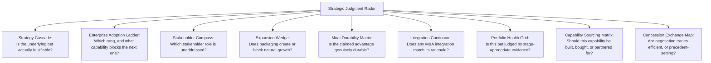

# Lesson 80: Module Synthesis: Advanced Strategic Judgment

## Why This Lesson Matters

Module 8 has introduced nine distinct mental models across ten lessons: the Strategy Cascade (Lesson 71), the Enterprise Adoption Ladder (Lesson 72), the Stakeholder Compass (Lesson 73), the Expansion Wedge (Lesson 74), the Moat Durability Matrix (Lesson 75), the Integration Continuum (Lesson 76), the Portfolio Health Grid (Lesson 77), the Capability Sourcing Matrix (Lesson 78), and the Concession Exchange Map (Lesson 79). Each answers a specific strategic question — how to make a vision falsifiable, how an account climbs toward organizational adoption, who actually needs to be satisfied for a B2B deal to close, how packaging should create expansion, whether a competitive advantage is genuinely durable, how to integrate an acquisition, how to evaluate a bet at its actual maturity stage, whether to build or buy a capability, and which concessions to trade in a negotiation.

Module 7 closed with a synthesis lesson establishing that real platform problems are rarely single-dimensional, and that genuine platform judgment means recognizing which combination of models applies to an ambiguous situation. The same principle applies with even greater force at the level of company-wide strategy, because strategic problems at this altitude routinely span sales, product, competitive positioning, and organizational structure simultaneously. A declining account, a stalled deal, an underperforming acquisition, or a competitor's sudden gain in market share rarely has a single cause locatable in a single Module 8 lesson — it is usually a genuine confluence of several, and a strategist who reaches for only one model risks correctly diagnosing a fraction of the problem while missing the rest.

This closing lesson of Module 8 consolidates the module's nine tools into a single integrated diagnostic practice, following the same synthesis discipline Lesson 70 modeled for Module 7's platform toolkit.

---

## Learning Path

| Field | Detail |
|---|---|
| **Module** | 8 — Advanced Strategy, Innovation & Enterprise/B2B Product Management |
| **Current Lesson** | 80 of 90 |
| **Difficulty** | 7 / 10 |
| **Estimated Study Time** | 45 minutes (reading) + 20 minutes (reflection + quiz) |
| **Prerequisites** | Lessons 71–79 (all Module 8 mental models), Lesson 70 (Platform Health Radar, as a model of connected synthesis) |
| **Next Lesson** | Lesson 81 — Regulated Industries: PM in Healthcare, Finance, and Government |
| **Future Topics Unlocked** | Lesson 84 (PM in AI-Native Companies), Lesson 88 (Building and Scaling a Product Organization), Lesson 90 (Capstone) — all draw on this integrated Module 8 toolkit as established canon |

---

## Learning Objectives

By the end of this lesson, you will be able to:

1. Recall and correctly name all nine mental models introduced across Module 8, and the specific strategic question each answers.
2. Apply the Strategic Judgment Radar to assess a company's strategic position holistically across all nine dimensions simultaneously.
3. Use the Cross-Lesson Strategic Diagnostic Protocol to determine which combination of models applies to an ambiguous, multi-faceted strategic problem.
4. Explain how the nine models interconnect, rather than treating them as a disconnected checklist.
5. Evaluate a complex strategic scenario by correctly identifying which model or models are the primary diagnostic lens, and which are secondary.

---

## Prerequisites

This lesson assumes fluency with all nine preceding lessons of Module 8 (Lessons 71–79) and draws on the connected-model synthesis discipline demonstrated in Module 7's closing lesson (Lesson 70) as its structural template.

---

## Theory

### Why Integration, Not Addition, Is the Point

As with Module 7's Platform Health Radar, a strategist who has memorized nine separate models but always applies exactly one to any given problem has developed nine narrow reflexes rather than genuine strategic judgment. Advanced strategic judgment means recognizing that most real business problems are multi-dimensional, and that the first diagnostic task is determining which combination of models is actually relevant, not simply picking whichever model's name sounds closest to the symptom being observed.

### The Strategic Judgment Radar

This lesson introduces the **Strategic Judgment Radar**, assessing a strategic situation across all nine Module 8 dimensions at once, rather than one at a time:

The Radar's discipline is running through all nine questions whenever a significant strategic problem surfaces, rather than stopping at the first model that seems to fit, since real strategic incidents — as this lesson's Case Study will show — are frequently the product of failures across more than one axis simultaneously.

### The Cross-Lesson Strategic Diagnostic Protocol

When a strategic symptom is observed — a stalled deal, a declining account, an underperforming acquisition, an eroding competitive position — this lesson recommends a **Cross-Lesson Strategic Diagnostic Protocol** with a deliberate order of investigation:

1. **Check the bet** (Strategy Cascade, Lesson 71): is the underlying strategic bet actually falsifiable, with pre-defined success criteria, or is this a vague aspiration that was never set up to be judged?
2. **Check the rung** (Enterprise Adoption Ladder, Lesson 72): if this is an account-level problem, which rung is it stalled at, and what specific capability does the next rung require?
3. **Check the stakeholders** (Stakeholder Compass, Lesson 73): has every relevant buying-committee role actually been engaged, or is progress being inferred from only one enthusiastic contact?
4. **Check the packaging** (Expansion Wedge, Lesson 74): does the account's packaging create a natural path to expansion, or has it removed the incentive to grow?
5. **Check the moat** (Moat Durability Matrix, Lesson 75): is a claimed competitive advantage genuinely structural, or merely a temporary, untested lead?
6. **Check any integration** (Integration Continuum, Lesson 76): if an acquisition is involved, does its integration approach actually match its original strategic rationale?
7. **Check the evidence** (Portfolio Health Grid, Lesson 77): is this initiative being judged against evidence appropriate to its actual maturity stage?
8. **Check the sourcing** (Capability Sourcing Matrix, Lesson 78): is a relevant capability being built, bought, or partnered for in a way that matches its genuine differentiation and market maturity?
9. **Check the concessions** (Concession Exchange Map, Lesson 79): have any pricing or contract concessions been traded efficiently, or have they set a costly precedent?

As with Module 7's protocol, this ordered checklist does not mean every investigation touches all nine steps equally — a well-trained strategist learns to move quickly past steps that clearly don't apply — but the discipline of checking each axis, rather than assuming only one applies, is what distinguishes genuine strategic diagnostic skill from pattern-matching a symptom to the first familiar-sounding model.

### How the Models Interconnect

The nine models connect directly. The Strategy Cascade (Lesson 71) provides the foundational discipline — falsifiability — that the Portfolio Health Grid (Lesson 77) later applies specifically to bets at different maturity stages. The Enterprise Adoption Ladder (Lesson 72) and Stakeholder Compass (Lesson 73) both describe the same underlying B2B adoption process from complementary angles — rungs of organizational progress and the people who gate that progress, respectively. The Expansion Wedge (Lesson 74) depends directly on the Enterprise Adoption Ladder, since its Enterprise Tier must be built around Rung 3 and 4 capability needs. The Moat Durability Matrix (Lesson 75) feeds directly into the Capability Sourcing Matrix (Lesson 78), since genuine differentiation is one of the Sourcing Matrix's two core axes. The Integration Continuum (Lesson 76) is, in effect, a specialized application of rationale-matching thinking to the specific context of post-acquisition integration. The Concession Exchange Map (Lesson 79) closes the loop by addressing what happens once a deal, having successfully navigated the Adoption Ladder and Stakeholder Compass, reaches the negotiation table.

---

## Common Beginner Mistakes

**Mistake 1: Applying only the first model that seems to fit, without checking whether others are also relevant**

Most significant strategic problems involve failures across more than one axis, and stopping the diagnosis early misses compounding causes.

**Mistake 2: Treating the nine models as an unordered checklist rather than a connected structure**

Understanding how the models depend on each other produces faster, more accurate diagnosis than treating each model as unrelated to the others.

**Mistake 3: Skipping the Strategy Cascade's falsifiability check when diagnosing any other problem**

A bet that was never made falsifiable in the first place cannot be genuinely evaluated using any of the other eight models, since there is no clear success criterion to measure progress against.

**Mistake 4: Forgetting that the Concession Exchange Map applies to internal negotiations too, not just external customer contracts**

The same precedent-cost logic applies whenever any concession is granted that other parties might reasonably expect to be extended again.

**Mistake 5: Assuming strategic judgment is complete once all nine models are individually memorized**

Genuine strategic judgment is the ability to recognize which combination applies to a novel, real situation — a skill built through practice, not memorization alone.

---

## Mental Model: The Strategic Judgment Radar

The Strategic Judgment Radar introduced above is this lesson's core takeaway tool, synthesizing all of Module 8 into a single integrated diagnostic. When facing any significant strategic problem, however it initially presents, run through the Radar's nine axes using the Cross-Lesson Strategic Diagnostic Protocol:

1. **Is the underlying bet** falsifiable?
2. **Which rung** is an account stalled at?
3. **Which stakeholder** is unaddressed?
4. **Does packaging** create or block expansion?
5. **Is the moat** genuinely durable?
6. **Does integration** match its rationale?
7. **Is the evidence** stage-appropriate?
8. **Is sourcing** correctly matched?
9. **Are concessions** efficient or precedent-setting?

A strategist who runs this full Radar, rather than stopping at the first familiar-sounding symptom, is far better equipped to diagnose the genuinely multi-dimensional problems that characterize real strategic work.

---

## Real Company Example

Adobe's strategic history offers a useful synthesis example spanning several of Module 8's dimensions simultaneously. Adobe's transition from perpetual-license software to its subscription-based Creative Cloud model illustrates the Strategy Cascade and Expansion Wedge together, requiring a falsifiable bet about subscriber retention and a packaging structure supporting expansion from individual creators to full enterprise deployments. Adobe's well-publicized, ultimately abandoned acquisition attempt of a competing design tool illustrates both the Moat Durability Matrix, in weighing whether a competitor's growing position represented a genuine emerging threat to Adobe's own moat, and the Integration Continuum, in the public discussion of how such an acquisition would have needed to be integrated. Public commentary on Adobe's enterprise sales motion further illustrates the Stakeholder Compass and Concession Exchange Map in its large-account negotiation practices.

**Assumption flagged:** the specifics of Adobe's internal strategic reasoning, acquisition rationale, and negotiation practices described here are drawn from public commentary and industry reporting across multiple sources, not confirmed internal company statements, and should be treated as illustrative rather than verified fact.

---

## Real World Perspective: Module Synthesis: Advanced Strategic Judgment at Different Company Stages

**Startup:** Early-stage companies typically encounter only a small subset of these nine models as immediately relevant — usually the Strategy Cascade and, once initial B2B traction emerges, the early rungs of the Enterprise Adoption Ladder — since moat durability, M&A integration, and sophisticated concession strategy typically become pressing concerns only once the company has scaled meaningfully.

**Mid-size company:** This is typically where several models become simultaneously relevant for the first time, as growing enterprise accounts raise Stakeholder Compass and Expansion Wedge concerns together, while an early acquisition or two may raise Integration Continuum questions in the same period, testing whether a strategist can hold multiple frameworks in mind simultaneously.

**Big Tech:** Mature organizations typically have dedicated specialists across different axes of this Radar — corporate development teams focused on the Integration Continuum, pricing and deal desk teams focused on the Concession Exchange Map, competitive strategy teams focused on the Moat Durability Matrix — making the PM's or strategist's synthesis role less about personally applying every model and more about ensuring specialized teams are coordinating around a shared, integrated understanding of the company's overall strategic position.

---

## Detailed Case Study: The Multi-Front Strategic Stall

A mid-size enterprise software company noticed, over two consecutive quarters, a troubling combination of symptoms: a recently acquired competitor's technology had still not been meaningfully integrated into the core product a year after the deal closed; several large enterprise accounts that had shown strong departmental adoption had stalled before reaching organization-wide rollout; and a promising new product line, launched eighteen months earlier as an explicit exploratory bet, was facing internal pressure to be shut down for failing to show revenue comparable to the company's mature core business.

A thorough investigation using the Cross-Lesson Strategic Diagnostic Protocol revealed that these three symptoms, while superficially unrelated, shared a common underlying pattern. The stalled acquisition integration, examined through the Integration Continuum, revealed that the deal's original rationale — acquiring a specific proprietary technology — had never been matched to an appropriate Selective Integration plan, with the acquired team instead left in an ambiguous, under-communicated limbo that had caused several key engineers to depart, taking much of the technology's practical value with them. The stalled enterprise accounts, examined through the Enterprise Adoption Ladder and Stakeholder Compass together, revealed that sales and success teams had been engaging only enthusiastic departmental Champions, never directly reaching the Technical Evaluators whose security sign-off Rung 3 required. The pressured new product line, examined through the Portfolio Health Grid, revealed the same premature-cancellation pattern from Lesson 77's case study: a Horizon 3 bet being judged against Horizon 1 revenue metrics it was structurally too early to satisfy.

**What went wrong?** Using the Strategic Judgment Radar across multiple axes at once, the true picture was a company-wide pattern of premature judgment and unmatched rigor: an acquisition integration approach that never matched its rationale, an enterprise sales motion that never engaged the full Stakeholder Compass, and a portfolio evaluation process that never accounted for genuine maturity stages. No single Module 8 lesson, applied in isolation, would have revealed this shared underlying pattern across three seemingly unrelated business problems.

The company's recovery required addressing the pattern at its root rather than symptom by symptom: instituting a formal Integration Continuum rationale-check for all future acquisitions, a mandatory Technical Evaluator engagement step for any account approaching Rung 3, and a company-wide Portfolio Health Grid review requiring stage-appropriate metrics for every active bet — illustrating precisely why this lesson's synthesis, rather than any single model in isolation, was necessary to correctly diagnose and resolve the underlying pattern.

---

## Framework Explanation: The Cross-Lesson Strategic Diagnostic Protocol (Reference Table)

The following table summarizes the nine-step protocol introduced in the Theory section, for quick reference when facing a real strategic problem:

| Step | Model | Core Diagnostic Question |
|---|---|---|
| 1 | Strategy Cascade (Lesson 71) | Is the underlying bet genuinely falsifiable? |
| 2 | Enterprise Adoption Ladder (Lesson 72) | Which rung is an account stalled at, and what capability does the next rung need? |
| 3 | Stakeholder Compass (Lesson 73) | Has every relevant buying-committee role been directly engaged? |
| 4 | Expansion Wedge (Lesson 74) | Does packaging create or eliminate a natural path to expansion? |
| 5 | Moat Durability Matrix (Lesson 75) | Is a claimed competitive advantage genuinely structural? |
| 6 | Integration Continuum (Lesson 76) | Does an M&A integration approach match its original rationale? |
| 7 | Portfolio Health Grid (Lesson 77) | Is a bet being judged against evidence appropriate to its actual maturity stage? |
| 8 | Capability Sourcing Matrix (Lesson 78) | Is a capability's sourcing decision matched to genuine differentiation and market maturity? |
| 9 | Concession Exchange Map (Lesson 79) | Have negotiation concessions been traded efficiently, or have they set a costly precedent? |

A thorough strategic investigation moves through this table deliberately, ruling axes in or out with evidence, rather than stopping at the first plausible-sounding explanation.

---

## Interview Perspective: How Interviewers Think About This

**"Walk me through how you'd diagnose a company facing several simultaneous, seemingly unrelated business problems."** The interviewer is evaluating whether you approach this as a potentially connected, multi-dimensional problem, checking multiple axes rather than treating each symptom as an isolated issue requiring its own unrelated fix.

**"How do enterprise adoption dynamics and stakeholder engagement relate to each other?"** The interviewer is testing whether you understand the interconnection between the Enterprise Adoption Ladder and Stakeholder Compass specifically — that progression through the rungs depends directly on engaging the right stakeholders at the right time.

**"Tell me about the most complex strategic situation you've had to untangle, and how you approached it."** The interviewer is listening for evidence of genuine synthesis — an investigation that considered and connected multiple contributing causes — rather than a story where a single framework, applied once, fully explained everything.

---

## Summary

Module 8 introduced nine distinct mental models, each answering a specific strategic question: whether a bet is falsifiable (Strategy Cascade), which rung an account occupies (Enterprise Adoption Ladder), which stakeholder needs engaging (Stakeholder Compass), whether packaging supports expansion (Expansion Wedge), whether a competitive advantage is genuinely durable (Moat Durability Matrix), whether an acquisition's integration matches its rationale (Integration Continuum), whether a bet is judged by appropriate evidence (Portfolio Health Grid), whether a capability should be built or bought (Capability Sourcing Matrix), and whether negotiation concessions are efficient or costly (Concession Exchange Map). Real strategic problems are frequently multi-dimensional, and the Strategic Judgment Radar, applied through the Cross-Lesson Strategic Diagnostic Protocol, provides a disciplined way to check all nine axes rather than stopping at whichever single model first seems to fit a given symptom. The models are not an unordered checklist but a connected structure — the Enterprise Adoption Ladder and Stakeholder Compass describe the same adoption process from complementary angles, the Moat Durability Matrix feeds directly into the Capability Sourcing Matrix, and the Portfolio Health Grid applies the Strategy Cascade's falsifiability discipline to bets at different maturity stages. Genuine advanced strategic judgment is the ability to recognize, in a real and often ambiguous situation, which combination of these tools actually applies — a skill this module has built lesson by lesson, and one this synthesis lesson has now explicitly connected into a single integrated practice, mirroring the same discipline Module 7 established for platform-specific diagnosis.

---

## Key Takeaways

- Module 8 introduced nine interconnected mental models: Strategy Cascade, Enterprise Adoption Ladder, Stakeholder Compass, Expansion Wedge, Moat Durability Matrix, Integration Continuum, Portfolio Health Grid, Capability Sourcing Matrix, and Concession Exchange Map.
- The Strategic Judgment Radar assesses a strategic situation across all nine dimensions simultaneously, rather than applying one model in isolation.
- The Cross-Lesson Strategic Diagnostic Protocol provides an ordered approach to investigating an ambiguous strategic problem across multiple axes.
- The nine models form a connected structure, not an unordered checklist — for example, the Enterprise Adoption Ladder and Stakeholder Compass describe the same adoption process from complementary angles.
- Real strategic incidents are frequently the product of failures across more than one axis simultaneously, as illustrated by the Multi-Front Strategic Stall case study.
- A single-cause diagnosis applied to a genuinely multi-dimensional strategic problem often addresses only a fraction of the underlying issue.
- Genuine strategic judgment is the applied skill of recognizing which combination of models fits a real situation, built through deliberate practice across increasingly complex scenarios.

---

## Cheat Sheet

*A two-minute review of everything in this lesson.*

- Nine axes: Strategy Cascade, Enterprise Adoption Ladder, Stakeholder Compass, Expansion Wedge, Moat Durability Matrix, Integration Continuum, Portfolio Health Grid, Capability Sourcing Matrix, Concession Exchange Map.
- Don't stop at the first model that fits — run the full Cross-Lesson Strategic Diagnostic Protocol.
- The models connect: Adoption Ladder ↔ Stakeholder Compass (same process, two angles). Moat Durability → feeds Capability Sourcing. Strategy Cascade → underlies Portfolio Health Grid.
- Multi-front strategic problems need multi-front diagnosis — a single lever rarely explains a compounding pattern.
- Strategic judgment = knowing which combination applies, not just memorizing each model individually.

---

## Glossary

| Term | Definition | Related Concepts | Difficulty |
|---|---|---|---|
| Strategic Judgment Radar | A nine-axis integrated diagnostic tool synthesizing all of Module 8's mental models | Cross-Lesson Strategic Diagnostic Protocol | 3 |
| Cross-Lesson Strategic Diagnostic Protocol | An ordered, nine-step investigative approach for diagnosing multi-dimensional strategic problems | Strategic Judgment Radar | 3 |
| Multi-Front Strategic Stall | A strategic incident caused by compounding failures across more than one diagnostic axis simultaneously | Strategic Judgment Radar | 3 |
| Advanced Strategic Judgment | The applied skill of recognizing which combination of models fits a real, ambiguous strategic situation | Strategic Judgment Radar | 3 |

---

## Further Reading / Resources

- Richard Rumelt, *Good Strategy Bad Strategy*
- Hamilton Helmer, *7 Powers*
- A.G. Lafley and Roger Martin, *Playing to Win*

---

## Flashcards

**Card 1**
- Front: Name all nine Module 8 mental models in the order they were introduced.
- Back: Strategy Cascade, Enterprise Adoption Ladder, Stakeholder Compass, Expansion Wedge, Moat Durability Matrix, Integration Continuum, Portfolio Health Grid, Capability Sourcing Matrix, Concession Exchange Map.
- Difficulty: 2
- Tags: module-synthesis

**Card 2**
- Front: What is the Strategic Judgment Radar?
- Back: An integrated diagnostic tool assessing a strategic situation across all nine Module 8 dimensions simultaneously, rather than applying one model in isolation.
- Difficulty: 2
- Tags: strategic-judgment-radar

**Card 3**
- Front: How does the Enterprise Adoption Ladder relate to the Stakeholder Compass?
- Back: They describe the same B2B adoption process from complementary angles — rungs of organizational progress, and the specific people who gate that progress at each rung.
- Difficulty: 2
- Tags: model-interconnection

**Card 4**
- Front: How does the Moat Durability Matrix relate to the Capability Sourcing Matrix?
- Back: Genuine competitive differentiation, assessed by the Moat Durability Matrix, is one of the two core axes the Capability Sourcing Matrix uses to recommend Build, Buy, or Partner.
- Difficulty: 2
- Tags: model-interconnection

**Card 5**
- Front: Why did the Multi-Front Strategic Stall case study require more than one model to diagnose correctly?
- Back: The true cause was a shared pattern across an unmatched acquisition integration, incomplete stakeholder engagement in stalled accounts, and premature evaluation of a maturing bet — three seemingly unrelated symptoms with one underlying root cause.
- Difficulty: 2
- Tags: case-study, multi-front-stall

**Card 6**
- Front: What is the risk of applying only the first model that seems to fit a strategic symptom?
- Back: Most significant strategic problems involve failures across more than one axis, and stopping the diagnosis early misses compounding causes.
- Difficulty: 2
- Tags: diagnostic-discipline

**Card 7**
- Front: What does genuine "advanced strategic judgment" mean, per this synthesis lesson?
- Back: The applied skill of recognizing which combination of models fits a real, ambiguous situation — not simply memorizing each model individually.
- Difficulty: 2
- Tags: strategic-judgment

## Reflection Exercise

You are the head of product strategy at a mid-size B2B software company. Over the past two quarters, you've observed: a technology acquisition from eighteen months ago still operating in organizational limbo with no clear integration plan; three large enterprise accounts stalled just short of company-wide rollout; and mounting internal pressure to cancel a year-old exploratory product line for its still-modest revenue.

There is no single correct answer to the prompts below — the goal is to practice applying the Strategic Judgment Radar and Cross-Lesson Strategic Diagnostic Protocol to a genuinely multi-symptom scenario.

1. Using the Cross-Lesson Strategic Diagnostic Protocol's nine steps, which steps would you investigate first given these three symptoms, and why?
2. Could the stalled acquisition and the stalled enterprise accounts share any common underlying cause? What model would you use to check this?
3. How does the pressure to cancel the exploratory product line relate to, or potentially compound, the other two symptoms you're observing?
4. Propose a plan for investigating all three symptoms in parallel, rather than addressing them as three unrelated problems.
5. Once you've diagnosed the root cause(s), how would you decide which fixes to prioritize first if resources don't allow addressing everything simultaneously?

---

## Quiz

**1. What is the primary purpose of the Strategic Judgment Radar?**
A) To replace all nine prior Module 8 models with a single new model
B) To assess a strategic situation across all nine Module 8 dimensions simultaneously, rather than applying one model in isolation
C) To measure only a company's revenue performance
D) To eliminate the need for the Cross-Lesson Strategic Diagnostic Protocol

*Correct answer: B*
*Explanation: The Strategic Judgment Radar is explicitly an integrating tool, not a replacement for the individual models it draws together.*
*Learning objective tested: #2*
*Difficulty: Easy*

---

**2. According to this lesson, why do real strategic problems often resist single-model diagnosis?**
A) Real strategic problems are always simpler than they initially appear
B) Real problems are frequently multi-dimensional, involving compounding failures across more than one diagnostic axis
C) Single-model diagnosis is always sufficient for any real-world strategic issue
D) Multi-dimensional strategic problems do not actually occur in practice

*Correct answer: B*
*Explanation: The lesson's central argument is that strategic incidents are often the product of failures across multiple axes at once.*
*Learning objective tested: #1, #3*
*Difficulty: Easy*

---

**3. How does the Enterprise Adoption Ladder (Lesson 72) relate to the Stakeholder Compass (Lesson 73)?**
A) The two models are entirely unrelated
B) They describe the same B2B adoption process from complementary angles — organizational progress rungs and the stakeholders who gate that progress
C) The Stakeholder Compass replaces the Enterprise Adoption Ladder entirely
D) The Enterprise Adoption Ladder only applies to consumer products, unlike the Stakeholder Compass

*Correct answer: B*
*Explanation: The Theory section explicitly connects these two models as complementary views of the same underlying process.*
*Learning objective tested: #4*
*Difficulty: Easy*

---

**4. How does the Moat Durability Matrix (Lesson 75) relate to the Capability Sourcing Matrix (Lesson 78)?**
A) They are unrelated models covering entirely separate topics
B) Genuine competitive differentiation, assessed by the Moat Durability Matrix, is one of the two core axes the Capability Sourcing Matrix uses
C) The Capability Sourcing Matrix replaces the need for the Moat Durability Matrix entirely
D) The Moat Durability Matrix only applies to marketplace problems, unlike the Capability Sourcing Matrix

*Correct answer: B*
*Explanation: The lesson explicitly frames the Moat Durability Matrix's differentiation assessment as feeding directly into the Sourcing Matrix's evaluation.*
*Learning objective tested: #4*
*Difficulty: Easy*

---

**5. In the Cross-Lesson Strategic Diagnostic Protocol, what should be checked using the Portfolio Health Grid?**
A) Whether a negotiation concession was efficient or precedent-setting
B) Whether a bet is being judged against evidence appropriate to its actual maturity stage
C) Whether a marketplace has a binding supply-side or demand-side constraint
D) Whether an acquisition's integration matches its original rationale

*Correct answer: B*
*Explanation: The Portfolio Health Grid step checks stage-appropriate evaluation, a foundational concern distinct from the other axes.*
*Learning objective tested: #3*
*Difficulty: Easy*

---

**6. In the Multi-Front Strategic Stall case study, what did the stalled acquisition integration have in common with the stalled enterprise accounts and the pressured product line?**
A) Nothing; the three symptoms were entirely unrelated
B) A shared underlying pattern of unmatched rigor: mismatched integration rationale, incomplete stakeholder engagement, and premature evaluation against inappropriate metrics
C) All three problems were caused by a single technical bug
D) All three symptoms were resolved by the same single fix with no further investigation needed

*Correct answer: B*
*Explanation: The case study's core lesson is that a shared underlying pattern connected three seemingly unrelated symptoms, discoverable only through multi-axis investigation.*
*Learning objective tested: #3, #5*
*Difficulty: Easy*

---

**7. Why might treating each of the three symptoms in the case study as entirely separate problems have failed to resolve the underlying issue?**
A) Separate treatment would have been equally effective as connected diagnosis
B) A shared underlying pattern connected all three symptoms, meaning symptom-by-symptom fixes would likely have left the root cause unaddressed
C) The three symptoms had no actual connection to each other
D) Separate treatment is always superior to connected diagnosis in any strategic situation

*Correct answer: B*
*Explanation: The case study demonstrates that addressing symptoms individually, without recognizing the shared pattern, would have missed the actual root cause.*
*Learning objective tested: #3, #5*
*Difficulty: Medium*

---

**8. What does the Concession Exchange Map check within the Cross-Lesson Strategic Diagnostic Protocol specifically investigate?**
A) Whether an acquisition's integration matches its rationale
B) Whether negotiation concessions have been traded efficiently or have set a costly precedent
C) Whether a marketplace's supply side is under-resourced
D) Whether a recommender system has fallen into a filter bubble

*Correct answer: B*
*Explanation: The Concession Exchange Map's role in the protocol is specifically to check pricing and negotiation efficiency, distinct from the other axes.*
*Learning objective tested: #3*
*Difficulty: Medium*

---

**9. According to the Real World Perspective section, why might a Big Tech-scale organization's strategic synthesis role look different from that of a mid-size company's?**
A) Big Tech organizations never need to understand any of the nine models personally
B) Dedicated specialist teams typically handle different axes, so the strategist's synthesis role shifts toward coordinating those specialists around a shared, integrated understanding
C) Mid-size companies are the only ones who ever need to apply these models
D) There is no meaningful difference between the two contexts

*Correct answer: B*
*Explanation: The Real World Perspective section describes this shift from personal application to cross-team coordination as scale increases, mirroring Module 7's synthesis lesson.*
*Learning objective tested: #5*
*Difficulty: Medium*

---

**10. What is "advanced strategic judgment," as defined in this lesson's Key Takeaways?**
A) The ability to memorize all nine models' names and definitions
B) The applied skill of recognizing which combination of models fits a real, ambiguous strategic situation
C) A formal certification awarded after completing Module 8
D) The ability to build a company strategy without any need for diagnostic frameworks

*Correct answer: B*
*Explanation: The lesson explicitly distinguishes memorization from the applied, situational skill of correctly combining models.*
*Learning objective tested: #1, #5*
*Difficulty: Medium*

---

**11. Why is checking the Strategy Cascade's falsifiability considered foundational to any other diagnostic step, per the Common Beginner Mistakes section?**
A) It is the most complex of the nine models and therefore the most important
B) A bet that was never made falsifiable in the first place cannot be genuinely evaluated using any of the other eight models, since there is no clear success criterion
C) The other eight models cannot function without first applying the Strategy Cascade
D) The Strategy Cascade is only relevant to enterprise sales problems specifically

*Correct answer: B*
*Explanation: The Common Beginner Mistakes section explicitly warns that skipping this check undermines the ability to evaluate progress through any other model.*
*Learning objective tested: #3*
*Difficulty: Medium*

---

**12. (Scenario) A strategist observes a stalled acquisition, several stalled enterprise accounts, and pressure to cancel a promising product line, and immediately proposes three separate, unrelated fixes for each. What does this lesson suggest as the appropriate first response?**
A) Approve all three separate fixes immediately, since each symptom clearly requires its own distinct solution
B) Run the situation through the Cross-Lesson Strategic Diagnostic Protocol to check for a shared underlying pattern before committing to three separate, uncoordinated fixes
C) Reject all three proposed fixes outright without any further investigation
D) Assume the three symptoms are purely coincidental and require no action

*Correct answer: B*
*Explanation: This mirrors the Case Study's core lesson: symptoms that appear unrelated may share a common root cause, discoverable only through the full diagnostic protocol.*
*Learning objective tested: #2, #3, #5*
*Difficulty: Medium-Hard*

---

**13. (Product Thinking) A strategist notices three seemingly unrelated symptoms across acquisition integration, enterprise sales, and portfolio evaluation. Using this lesson's frameworks, what is the most defensible first step?**
A) Treat each symptom as an entirely separate problem requiring three unrelated investigations
B) Investigate whether these symptoms share a common root cause using the Cross-Lesson Strategic Diagnostic Protocol, checking relevant axes for each symptom in parallel
C) Address only the acquisition integration issue, since M&A problems are always the most urgent
D) Wait for additional symptoms to appear before taking any action

*Correct answer: B*
*Explanation: This mirrors the Reflection Exercise: multiple seemingly separate symptoms may share a common underlying cause, and the protocol supports investigating them together rather than in isolation.*
*Learning objective tested: #3, #4, #5*
*Difficulty: Hard*

---

**14. (Interview Reasoning) A candidate, asked to diagnose a complex strategic problem, applies a single model thoroughly and concludes their investigation once that model produces a plausible explanation. What does this most likely signal, per the Interview Perspective section?**
A) A complete and sufficient diagnostic approach
B) A potential gap in checking for compounding causes across other axes, which the interviewer is specifically listening for
C) That the candidate is ready for a senior strategy leadership role immediately
D) Nothing meaningful; a single plausible explanation is always sufficient

*Correct answer: B*
*Explanation: The Interview Perspective section specifically listens for evidence of considering multiple contributing causes, not stopping at the first plausible single-model explanation.*
*Learning objective tested: #3, #5*
*Difficulty: Hard*

---

**15. (Product Thinking, Highest Difficulty) A company faces a stalled acquisition integration, several stalled enterprise accounts just short of company-wide rollout, and pressure to cancel a maturing exploratory product line. Using only the frameworks in this lesson, what is the most defensible response?**
A) Address only the single symptom that seems most urgent, and assume the others will resolve themselves once that one is fixed
B) Investigate all three symptoms for a shared underlying pattern using the Cross-Lesson Strategic Diagnostic Protocol, and address any common root cause alongside symptom-specific fixes
C) Launch a broad reorganization to address all symptoms simultaneously without further diagnosis
D) Conclude that the situation is too complex to address and take no action

*Correct answer: B*
*Explanation: This mirrors the Multi-Front Strategic Stall case study directly: a compounding, multi-axis pattern requires a coordinated, root-cause-informed response, not a single-symptom fix, an undiagnosed broad reorganization, or inaction.*
*Learning objective tested: #2, #3, #4, #5*
*Difficulty: Hard*

---

## Connections

| | Lesson | Core Idea Carried Forward |
|---|---|---|
| **Previous Lesson** | Lesson 79 — Pricing Strategy at Scale: Enterprise Contracts and Negotiation | Integrates the Concession Exchange Map as the ninth axis of the Strategic Judgment Radar |
| **Current Lesson** | Lesson 80 — Module Synthesis: Advanced Strategic Judgment | Strategic Judgment Radar; Cross-Lesson Strategic Diagnostic Protocol; model interconnection; advanced strategic judgment |
| **Next Lesson** | Lesson 81 — Regulated Industries: PM in Healthcare, Finance, and Government | Opens Module 9 by applying the accumulated toolkit from Modules 7 and 8 to the specific constraints of regulated domains |
| **Future Concepts Unlocked** | Lesson 84 (PM in AI-Native Companies) | Draws on the full Module 8 toolkit, especially the Moat Durability Matrix and Capability Sourcing Matrix, when evaluating AI-native strategic positioning |
| | Lesson 88 (Building and Scaling a Product Organization) | Extends the Strategic Judgment Radar into organizational design and scaling decisions |
| | Lesson 90 (Capstone) | Treats the full, integrated Module 8 toolkit as established canon for the curriculum's final synthesis |

This curriculum continues to build as one continuous argument. From this lesson forward, any reference to a strategic problem assumes you can run the Cross-Lesson Strategic Diagnostic Protocol across the full Module 8 toolkit without re-explanation.
