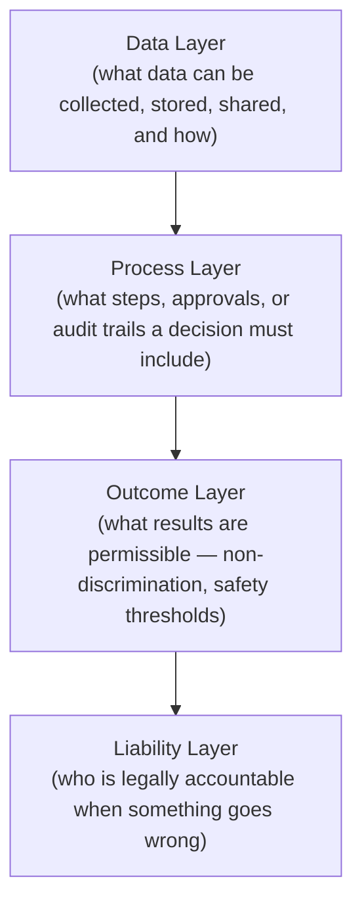

# Lesson 81: Regulated Industries: PM in Healthcare, Finance, and Government

## Why This Lesson Matters

Module 8 closed with a synthesis lesson establishing that advanced strategic judgment means recognizing which combination of tools applies to a genuinely multi-dimensional problem. Module 9 opens by applying that same accumulated judgment to a category of product work with its own distinct, non-negotiable constraint: building for healthcare, finance, or government, where the product's obligations extend well beyond satisfying a user or even a buying committee, to satisfying legal and regulatory requirements that exist specifically because getting the product wrong can cause serious, sometimes irreversible harm to real people.

A PM moving into a regulated industry for the first time, having built strong instincts in an unregulated consumer or B2B context, tends to make a specific and consequential mistake: treating regulatory compliance as a checklist to satisfy after the product is essentially designed, rather than as a set of constraints that must shape the product's architecture from the earliest design decisions. This mistake is understandable, since in most unregulated contexts, legal and compliance considerations genuinely can be handled as a late-stage review layered on top of an otherwise-complete design. In regulated industries, this sequencing frequently doesn't work, because certain regulatory requirements — an audit trail of every decision, a human review step before a high-stakes automated action, a specific data-handling architecture — are structural, and retrofitting them into a product built without them in mind can require rebuilding core architecture rather than simply adding a feature.

This lesson introduces the Regulatory Surface Map, this lesson's core mental model, to give you a structured way to identify which layers of your product regulation actually touches, so that regulatory constraints inform design from the outset rather than arriving as a late, disruptive surprise.

---

## Learning Path

| Field | Detail |
|---|---|
| **Module** | 9 — Specialized Domains and Synthesis |
| **Current Lesson** | 81 of 90 |
| **Difficulty** | 7 / 10 |
| **Estimated Study Time** | 40 minutes (reading) + 15 minutes (reflection + quiz) |
| **Prerequisites** | Lesson 65 (Ownership Zones Model, error costs), Lesson 67 (Escalation Staircase, proportional enforcement), Lesson 80 (Strategic Judgment Radar, connected diagnosis) |
| **Next Lesson** | Lesson 82 — Privacy, Security, and Compliance as Product Constraints |
| **Future Topics Unlocked** | Lesson 82 (Privacy, Security, and Compliance), Lesson 84 (PM in AI-Native Companies), Lesson 85 (Responsible AI Product Management) — all depend on the Regulatory Surface Map introduced here |

---

## Learning Objectives

By the end of this lesson, you will be able to:

1. Explain why regulatory compliance in healthcare, finance, and government contexts must shape product architecture from the outset rather than being addressed as a late-stage review.
2. Apply the Regulatory Surface Map to identify which layers of a product a given regulatory requirement actually touches.
3. Identify the four layers of regulatory surface: data handling, process, outcome, and liability.
4. Explain why human-in-the-loop requirements exist for certain automated decisions in regulated contexts, connecting to the Ownership Zones Model from Lesson 65.
5. Evaluate a product design for whether it accounts for regulatory constraints at the appropriate layer before development begins.

---

## Prerequisites

This lesson assumes the Ownership Zones Model and error-cost framing from Lesson 65, since regulated decisions frequently require explicit human accountability for exactly the reasons that lesson established, and the Escalation Staircase's proportionality discipline from Lesson 67, since regulatory enforcement mechanisms often mirror that same graduated structure.

---

## Theory

### Why Regulation Must Shape Architecture, Not Just Review

In an unregulated product context, legal and compliance review can often function as a final check applied to an otherwise-complete design, since the primary risks being managed are largely contractual or reputational, and can typically be addressed through policy language, disclaimers, or minor feature adjustments. In healthcare, finance, and government contexts, a meaningful category of regulatory requirements are instead structural: they specify not just what a product may or may not do, but how it must be built to do it — requiring, for instance, an immutable audit log of every decision affecting a patient's care, a specific human review step before a loan application can be denied, or a data architecture that physically segregates certain categories of information. A product built without these structural requirements in mind cannot simply have them added later through a policy update; the underlying system frequently has to be substantially rearchitected, at a cost far higher than if the requirement had been designed in from the start.

### The Regulatory Surface Map

This lesson introduces the **Regulatory Surface Map**, identifying four layers at which regulation typically constrains a product:

The **Data Layer** governs what information can be collected, how it must be stored or encrypted, who may access it, and under what conditions it can be shared — directly connecting to the privacy and security considerations this module will address further in Lesson 82. The **Process Layer** governs the specific steps a decision-making workflow must include, such as a documented approval chain, a mandatory waiting period, or an audit trail proving a particular review actually occurred. The **Outcome Layer** governs what results are permissible regardless of process — a lending algorithm that produces discriminatory outcomes across a protected class can violate regulation even if every individual step in its process was followed correctly. The **Liability Layer** governs who bears legal accountability when a decision causes harm, which frequently determines whether, and how, a human must be meaningfully involved in a given decision rather than allowing a fully automated system to act alone.

The Regulatory Surface Map's discipline is identifying, for any product feature operating in a regulated domain, which of these four layers actually apply, since a feature can pass scrutiny at one layer while still failing at another — a lending decision made through a scrupulously documented process (satisfying the Process Layer) can still violate the Outcome Layer if its results are discriminatory, regardless of how well-documented the process itself was.

### Human-in-the-Loop Requirements and the Ownership Zones Model

Many regulated contexts specifically require a human decision-maker to review or approve certain categories of automated decisions before they take effect — a requirement that connects directly to the Ownership Zones Model from Lesson 65. Regulators, in effect, are formalizing exactly the Zone 4 (Product Decision and Deployment) concern that lesson raised: a model's probabilistic output should not be treated as an automatic, unquestioned action, particularly when the decision carries significant consequences for a real person's health, financial standing, or legal status. In many regulated industries, this concern has been codified into a specific legal requirement rather than left as a best practice, meaning the Ownership Zones Model's Zone 4 discipline is, in these contexts, not optional judgment but mandatory compliance.

### Why Liability Assignment Shapes Product Design

The Liability Layer often has the most direct and immediate influence on product architecture, because a product team must be able to demonstrate, after the fact, exactly who or what was responsible for a specific decision — a requirement that shapes not just process documentation, but the underlying system architecture itself, since a system that cannot reconstruct its own decision history cannot support the liability assignment regulation frequently requires. This is one of the clearest instances of a regulatory requirement that must be designed into a product's core architecture from the beginning, since an audit trail retrofitted after the fact can rarely reconstruct decisions that were never designed to be logged in the first place.

---

## Common Beginner Mistakes

**Mistake 1: Treating regulatory compliance as a late-stage review rather than an architectural constraint**

Structural requirements like audit trails and human review steps are far more expensive to retrofit than to design in from the outset.

**Mistake 2: Assuming a well-documented process automatically satisfies regulatory requirements**

A product can pass Process Layer scrutiny while still failing at the Outcome Layer, if its results are discriminatory or otherwise impermissible regardless of process quality.

**Mistake 3: Treating human-in-the-loop requirements as an unnecessary friction to be minimized rather than a legally mandated accountability mechanism**

In many regulated contexts, this requirement is not a design preference but a compliance obligation directly tied to liability.

**Mistake 4: Underestimating how much of a product's architecture the Liability Layer actually shapes**

A system that cannot reconstruct its own decision history after the fact cannot support the accountability assignment regulation frequently requires, regardless of how well the product otherwise functions.

**Mistake 5: Assuming regulatory requirements are static and can be addressed once, rather than something requiring ongoing monitoring**

Regulations in healthcare, finance, and government contexts change, and a product compliant at launch can drift out of compliance as rules evolve.

---

## Mental Model: The Regulatory Surface Map

The Regulatory Surface Map introduced above is this lesson's core takeaway tool. For any product feature operating in a regulated domain, ask:

1. **Which layer does this feature's regulatory obligation actually touch** — Data, Process, Outcome, or Liability — and has this been explicitly identified before development begins?
2. **Does satisfying one layer create a false sense of complete compliance**, when a separate layer (most commonly Outcome, given how easy it is to satisfy Process while still producing an impermissible result) has not been independently verified?
3. **Does a decision in this feature require human-in-the-loop review**, per applicable regulation, and does the Ownership Zones Model's Zone 4 discipline from Lesson 65 reflect that legal requirement rather than treating it as optional?
4. **Can the system reconstruct its own decision history after the fact**, in a form sufficient to support the Liability Layer's accountability requirements?

A product team that runs every regulated feature through this Map before development begins is far less likely to encounter the costly, disruptive experience of discovering a structural compliance gap only after a product has already been substantially built.

---

## Real Company Example

Palantir's work building software for highly regulated government and healthcare contexts is widely discussed as an example of a company whose product architecture is explicitly shaped by regulatory and accountability requirements from the outset, rather than treating compliance as an afterthought. Public commentary on Palantir's platform design describes extensive built-in audit logging and access control mechanisms specifically intended to support the kind of after-the-fact accountability regulated government and healthcare customers require, reflecting the Liability Layer's direct influence on core system architecture that this lesson describes.

**Assumption flagged:** the specifics of Palantir's internal product architecture decisions and the precise regulatory requirements they were designed to satisfy are drawn from public commentary and industry reporting, not confirmed internal company statements, and should be treated as illustrative rather than verified fact.

---

## Real World Perspective: Regulated Industries: PM in Healthcare, Finance, and Government at Different Company Stages

**Startup:** Early-stage companies entering a regulated industry for the first time often underestimate how early regulatory architecture decisions must be made, since the instinct to move fast and iterate, well-suited to unregulated consumer products, can lead to costly rearchitecture once a structural compliance gap — an audit trail never built in, a human review step never designed — is discovered after significant product development has already occurred.

**Mid-size company:** This is typically where a company's regulatory obligations first become genuinely complex, as growth into new geographies or new product lines within a regulated industry introduces additional, sometimes conflicting regulatory requirements that a single early compliance framework may not have anticipated.

**Big Tech:** Large organizations operating in regulated industries typically maintain dedicated regulatory affairs and compliance engineering functions, with structured processes requiring explicit Regulatory Surface Map-style review before any new feature affecting a regulated decision is developed, precisely because the scale of potential harm and liability at this size makes late-discovered compliance gaps prohibitively expensive.

---

## Detailed Case Study: The Undocumented Lending Decision

A fintech startup built an automated small-business loan approval product, using a machine learning model to assess creditworthiness and approve or deny loan applications with minimal human involvement, reasoning that full automation would allow the company to process applications faster than competitors relying on manual underwriting. The product team had carefully validated the model's technical accuracy and had documented the model's decision process, satisfying what the team believed was thorough regulatory diligence.

Several months after launch, a regulatory review revealed two distinct problems. First, using the Regulatory Surface Map's Outcome Layer, the review found that the model's approval rates, while never explicitly using any protected characteristic as an input, produced a statistically significant disparity in approval rates across different demographic groups — a violation of fair lending regulation regardless of the fact that the model's *process* had been carefully documented and its inputs had never explicitly included the protected characteristic itself. Second, using the Liability Layer, the review found that the fully automated denial process had never incorporated a human review step for denied applications, a specific regulatory requirement for certain categories of credit decisions that the product team had not identified before building the fully automated system, since their focus had been entirely on technical model accuracy and process documentation rather than a systematic review of applicable Outcome and Liability Layer requirements.

**What went wrong?** Using the Regulatory Surface Map, the failure is precise: the team had thoroughly addressed the Process Layer — documenting exactly how the model reached its decisions — while never independently verifying the Outcome Layer (whether those decisions produced permissible results across demographic groups) or the Liability Layer (whether a human review step was legally required before a final denial). Strong performance at one layer had created a false sense of complete regulatory diligence, masking gaps at two separate layers that a systematic Regulatory Surface Map review, applied before development began, would have surfaced.

The company's recovery involved substantially rearchitecting the loan approval system to incorporate a mandatory human review step for denied applications — directly applying the Ownership Zones Model's Zone 4 discipline from Lesson 65 as a compliance requirement rather than an optional judgment call — and conducting a full model retraining and audit process specifically targeting demographic disparity in approval rates, a far more costly and disruptive process than incorporating these requirements during initial design would have been.

---

## Framework Explanation: The Regulated Product Readiness Checklist

Before developing a feature affecting a regulated decision, a PM can use the following checklist:

| Checklist Item | Question to Ask | Risk if Skipped |
|---|---|---|
| Data Layer Compliance | Are data collection, storage, and sharing practices explicitly reviewed against applicable regulation (e.g., HIPAA, financial data rules)? | Data handling violations that can trigger significant penalties regardless of the product's other qualities |
| Process Layer Documentation | Is there a documented, auditable process for how decisions are made, including any required approval steps? | Inability to demonstrate compliance during a regulatory review |
| Outcome Layer Verification | Has the actual result of the process been independently checked for permissibility (e.g., non-discriminatory outcomes), separate from process documentation? | A well-documented process that nonetheless produces an impermissible result, as in the Case Study |
| Liability and Human Review | Does the applicable regulation require human review before a given automated decision takes effect? | A fully automated decision that violates a specific human-in-the-loop legal requirement |
| Ongoing Regulatory Monitoring | Is there a process for tracking regulatory changes that might affect this feature over time? | Drift out of compliance as rules evolve after initial launch |

A "no" on Outcome Layer Verification should be treated with particular urgency, given how the Case Study illustrates that thorough Process Layer documentation alone provides no assurance of Outcome Layer compliance.

---

## Interview Perspective: How Interviewers Think About This

**"How would you approach building a product feature that makes automated decisions affecting people's financial or health outcomes?"** The interviewer is evaluating whether you propose systematically identifying applicable regulatory layers — data, process, outcome, and liability — before development begins, rather than treating compliance as a late-stage review.

**"Why might a well-documented, carefully-followed decision-making process still violate regulation?"** The interviewer is testing whether you recognize the distinction between Process Layer and Outcome Layer compliance, and can explain why satisfying one doesn't guarantee satisfying the other.

**"When would you build in a mandatory human review step for an automated decision, even if the underlying model performs well?"** The interviewer is listening for a connection between regulatory human-in-the-loop requirements and the Ownership Zones Model's Zone 4 discipline from Lesson 65, recognizing that this requirement is often a legal obligation rather than an optional design choice.

---

## Summary

Regulatory compliance in healthcare, finance, and government contexts frequently must shape product architecture from the earliest design decisions, since a meaningful category of regulatory requirements — audit trails, mandatory human review steps, specific data architectures — are structural and cannot simply be added as a late-stage policy update without substantial, costly rearchitecture. The Regulatory Surface Map identifies four layers at which regulation typically constrains a product — Data, Process, Outcome, and Liability — and its central discipline is recognizing that a feature can satisfy one layer while still failing another, most commonly satisfying a well-documented Process Layer while still producing an impermissible Outcome Layer result, exactly the failure this lesson's Case Study illustrates. Human-in-the-loop requirements, common across regulated industries, formalize the Ownership Zones Model's Zone 4 discipline from Lesson 65 into a legal obligation rather than an optional best practice, and the Liability Layer's demand for after-the-fact accountability frequently shapes a product's core architecture directly, since a system that cannot reconstruct its own decision history cannot support the accountability regulation requires. A product team operating in a regulated industry that identifies applicable Regulatory Surface Map layers before development begins is far better positioned to avoid the costly, disruptive experience of discovering a structural compliance gap only after significant product investment has already occurred.

---

## Key Takeaways

- Regulatory compliance in healthcare, finance, and government contexts frequently must shape product architecture from the outset, not just a late-stage review.
- The Regulatory Surface Map identifies four layers regulation typically constrains: Data, Process, Outcome, and Liability.
- A feature can satisfy one layer while failing another, most commonly satisfying Process while still failing Outcome.
- Human-in-the-loop requirements in regulated industries formalize the Ownership Zones Model's Zone 4 discipline from Lesson 65 into a legal obligation.
- The Liability Layer's demand for after-the-fact accountability frequently shapes a product's core architecture, since undocumented decision history cannot support required accountability.
- Regulatory requirements are not static; ongoing monitoring is necessary as rules evolve over a product's lifetime.
- Structural regulatory requirements are far more costly to retrofit after significant product development than to design in from the outset.

---

## Cheat Sheet

*A two-minute review of everything in this lesson.*

- Regulatory compliance shapes architecture, not just a final review checklist.
- Regulatory Surface Map: Data → Process → Outcome → Liability. A feature must satisfy all four, not just one.
- Well-documented process ≠ permissible outcome. Check both separately.
- Human-in-the-loop requirements are often legal obligations, not optional design choices — connects to Ownership Zones Model Zone 4.
- Audit trails and accountability structures must be designed in from the start; they're very hard to retrofit.

---

## Glossary

| Term | Definition | Related Concepts | Difficulty |
|---|---|---|---|
| Regulatory Surface Map | A four-layer model identifying where regulation constrains a product: Data, Process, Outcome, Liability | Regulated Product Readiness Checklist | 2 |
| Data Layer | Regulatory constraints on data collection, storage, sharing, and access | Regulatory Surface Map, Lesson 82 | 2 |
| Process Layer | Regulatory constraints on the steps and approvals a decision-making workflow must include | Regulatory Surface Map | 2 |
| Outcome Layer | Regulatory constraints on what results are permissible, regardless of process quality | Regulatory Surface Map | 2 |
| Liability Layer | Regulatory requirements determining who is legally accountable for a decision | Regulatory Surface Map, Ownership Zones Model (Lesson 65) | 2 |
| Human-in-the-Loop Requirement | A legal mandate for human review before certain automated decisions take effect | Ownership Zones Model (Lesson 65) | 2 |

---

## Further Reading / Resources

- Cathy O'Neil, *Weapons of Math Destruction*
- Brian Christian, *The Alignment Problem*
- HHS Office for Civil Rights published HIPAA guidance (U.S. Department of Health and Human Services)

---

## Flashcards

**Card 1**
- Front: ** Why must regulatory compliance often shape product architecture from the outset in regulated industries?
- Back: ** Structural requirements like audit trails and mandatory human review steps are far more costly to retrofit than to design in from the beginning.
- Difficulty: 2
- Tags: **, regulated-industries, core-concept

**Card 2**
- Front: ** Name the four layers of the Regulatory Surface Map.
- Back: ** Data, Process, Outcome, Liability.
- Difficulty: 2
- Tags: **, regulatory-surface-map

**Card 3**
- Front: ** Why can a well-documented process still fail regulatory compliance?
- Back: ** Process Layer compliance doesn't guarantee Outcome Layer compliance — a carefully documented decision process can still produce an impermissible result, such as a discriminatory outcome.
- Difficulty: 2
- Tags: **, outcome-layer

**Card 4**
- Front: ** How do human-in-the-loop requirements connect to the Ownership Zones Model from Lesson 65?
- Back: ** They formalize Zone 4's discipline — that a model's output shouldn't be treated as an automatic action — into a legal obligation rather than an optional best practice.
- Difficulty: 2
- Tags: **, human-in-the-loop

**Card 5**
- Front: ** What two regulatory gaps did the Undocumented Lending Decision case study reveal?
- Back: ** A discriminatory disparity in approval rates across demographic groups (Outcome Layer), and a missing mandatory human review step for denied applications (Liability Layer) — despite thorough Process Layer documentation.
- Difficulty: 2
- Tags: **, case-study, regulatory-surface-map

**Card 6**
- Front: ** Why does the Liability Layer often shape a product's core architecture directly?
- Back: ** A system that cannot reconstruct its own decision history after the fact cannot support the accountability assignment regulation frequently requires.
- Difficulty: 2
- Tags: **, liability-layer

**Card 7**
- Front: ** Why is ongoing regulatory monitoring necessary even after a product is compliant at launch?
- Back: ** Regulations in healthcare, finance, and government contexts change over time, and a product can drift out of compliance as rules evolve.
- Difficulty: 2
- Tags: **, ongoing-compliance

## Reflection Exercise

You are the PM for a healthtech startup building a symptom-checker tool that uses a machine learning model to suggest possible conditions and recommend whether a user should seek in-person medical care. Your engineering team is eager to launch quickly with a fully automated recommendation flow.

There is no single correct answer to the prompts below — the goal is to practice applying the Regulatory Surface Map and the Regulated Product Readiness Checklist to a healthcare product before development is finalized.

1. Using the Regulatory Surface Map, which layer(s) do you believe are most likely to constrain this specific product, and why?
2. What questions would you ask a compliance or legal expert to determine whether a human-in-the-loop requirement applies to this specific type of health recommendation?
3. What would an appropriate Outcome Layer verification process look like for this product, given the risk of the model performing differently across different patient populations?
4. How would you design the system's architecture from the outset to support the kind of after-the-fact accountability the Liability Layer might require?
5. How would you communicate to your engineering team why a "launch fast and iterate" approach, appropriate for many consumer products, may not be appropriate here?

---

## Quiz

**1. Why must regulatory compliance often shape product architecture from the outset in regulated industries?**
A) Regulatory review is always faster when done early rather than late
B) Structural requirements like audit trails and mandatory human review steps are far more costly to retrofit than to design in from the beginning
C) Regulations in healthcare, finance, and government never change once established
D) Product architecture has no meaningful relationship to regulatory compliance

*Correct answer: B*
*Explanation: The lesson's central argument is that structural regulatory requirements are far more expensive to add after significant development than to design in from the start.*
*Learning objective tested: #1*
*Difficulty: Easy*

---

**2. What are the four layers of the Regulatory Surface Map?**
A) Marketing, Sales, Engineering, Support
B) Data, Process, Outcome, Liability
C) Concept, Prototype, Pilot, Scale
D) Startup, Growth, Maturity, Decline

*Correct answer: B*
*Explanation: These four layers are explicitly introduced in the Theory section as the Map's core dimensions.*
*Learning objective tested: #2, #3*
*Difficulty: Easy*

---

**3. What does the Process Layer govern?**
A) What results are permissible regardless of the steps taken
B) The specific steps, approvals, or audit trails a decision-making workflow must include
C) Who is legally accountable when something goes wrong
D) What data can be collected and how it must be stored

*Correct answer: B*
*Explanation: The Process Layer specifically concerns the workflow steps and documentation required for a decision, distinct from the other three layers.*
*Learning objective tested: #3*
*Difficulty: Easy*

---

**4. Why can a well-documented decision process still violate regulation?**
A) Documentation is never actually required by any regulatory framework
B) Process Layer compliance doesn't guarantee Outcome Layer compliance — a well-documented process can still produce an impermissible result
C) Well-documented processes are always automatically compliant with every regulatory layer
D) Regulators only ever check documentation, never actual outcomes

*Correct answer: B*
*Explanation: This is the exact failure mode illustrated in the Undocumented Lending Decision case study.*
*Learning objective tested: #3, #5*
*Difficulty: Easy*

---

**5. How do human-in-the-loop requirements in regulated industries connect to the Ownership Zones Model from Lesson 65?**
A) They have no meaningful relationship to each other
B) They formalize the Ownership Zones Model's Zone 4 discipline — that a model's output shouldn't be treated as an automatic action — into a legal obligation
C) Human-in-the-loop requirements replace the need for the Ownership Zones Model entirely
D) The Ownership Zones Model only applies to unregulated industries

*Correct answer: B*
*Explanation: The lesson explicitly connects these regulatory requirements to the earlier Zone 4 discipline, now made mandatory rather than optional.*
*Learning objective tested: #4*
*Difficulty: Easy*

---

**6. Why does the Liability Layer often shape a product's core architecture directly?**
A) Liability concerns are always addressed through insurance rather than product design
B) A system that cannot reconstruct its own decision history after the fact cannot support the accountability assignment regulation frequently requires
C) The Liability Layer has no practical influence on product architecture
D) Liability requirements are always satisfied automatically by any properly functioning system

*Correct answer: B*
*Explanation: The lesson explicitly identifies this as one of the clearest instances of a regulatory requirement shaping core architecture from the beginning.*
*Learning objective tested: #3, #5*
*Difficulty: Easy*

---

**7. In the Undocumented Lending Decision case study, what specifically did the Outcome Layer review reveal?**
A) The model's documentation was incomplete
B) The model's approval rates produced a statistically significant disparity across demographic groups, despite never explicitly using protected characteristics as inputs
C) The model had poor technical accuracy
D) No regulatory issue was found at the Outcome Layer

*Correct answer: B*
*Explanation: This is the specific Outcome Layer violation described in the case study, independent of the model's input variables.*
*Learning objective tested: #3, #5*
*Difficulty: Medium*

---

**8. What second regulatory gap did the case study reveal, beyond the Outcome Layer issue?**
A) A missing Data Layer encryption requirement
B) A missing mandatory human review step for denied loan applications, a Liability Layer requirement
C) A missing customer support contact option
D) No second gap was found; only the Outcome Layer issue existed

*Correct answer: B*
*Explanation: The case study explicitly describes two distinct gaps: the Outcome Layer disparity and the missing Liability Layer human review step.*
*Learning objective tested: #4, #5*
*Difficulty: Medium*

---

**9. According to the Regulated Product Readiness Checklist, what does a "no" on Outcome Layer Verification indicate?**
A) A minor issue that can be addressed after launch with no urgency
B) A significant risk, since thorough Process Layer documentation alone provides no assurance of Outcome Layer compliance
C) That the product is definitely non-compliant with all regulatory requirements
D) That Outcome Layer verification is unnecessary if Process Layer documentation is thorough

*Correct answer: B*
*Explanation: The lesson explicitly treats this gap as urgent, given the case study's illustration of how process quality alone doesn't guarantee outcome compliance.*
*Learning objective tested: #3, #5*
*Difficulty: Medium*

---

**10. Why might early-stage companies entering a regulated industry underestimate how early regulatory architecture decisions must be made, per the Real World Perspective section?**
A) Early-stage companies are legally exempt from all regulatory requirements
B) The instinct to move fast and iterate, well-suited to unregulated consumer products, can lead to costly rearchitecture once a structural compliance gap is discovered later
C) Regulatory requirements never apply to companies with fewer than one hundred employees
D) Early-stage companies always have dedicated compliance teams from their founding

*Correct answer: B*
*Explanation: The Real World Perspective section connects this specific risk to a mismatch between fast-iteration instincts and the structural nature of many regulatory requirements.*
*Learning objective tested: #1*
*Difficulty: Medium*

---

**11. What do large organizations operating in regulated industries typically maintain, per the Real World Perspective section?**
A) No formal compliance processes, relying entirely on ad hoc review
B) Dedicated regulatory affairs and compliance engineering functions with structured, Regulatory Surface Map-style review processes
C) A policy of avoiding any automated decision-making entirely
D) Compliance processes only for their most senior executives

*Correct answer: B*
*Explanation: The Real World Perspective section describes this kind of structured, dedicated function as characteristic of mature organizations in regulated industries.*
*Learning objective tested: #5*
*Difficulty: Medium*

---

**12. (Scenario) A healthtech company has built a symptom-checker tool with thorough process documentation but has not independently verified whether its recommendations differ in accuracy across different patient demographics. What risk does this represent, per this lesson's frameworks?**
A) No risk, since thorough process documentation guarantees regulatory compliance
B) A potential Outcome Layer compliance gap, since process quality alone does not verify whether results are permissible across different groups
C) A risk only relevant to the Data Layer, not the Outcome Layer
D) A risk that only applies to lending products, not healthcare products

*Correct answer: B*
*Explanation: This directly mirrors the case study's core lesson: process documentation alone doesn't verify outcome permissibility, a concern equally applicable to healthcare contexts.*
*Learning objective tested: #3, #5*
*Difficulty: Medium-Hard*

---

**13. (Product Thinking) An engineering team wants to launch a fully automated healthcare recommendation flow quickly, arguing that a human review step would slow down the product unnecessarily. What is the strongest response, using this lesson's frameworks?**
A) Agree to launch fully automated, since speed is always the primary consideration
B) Investigate whether applicable regulation requires human-in-the-loop review for this category of health recommendation before finalizing the automated flow, since this may be a legal obligation rather than a design preference
C) Refuse to build the product at all under any circumstances
D) Build the human review step only after a regulatory violation has already occurred

*Correct answer: B*
*Explanation: The correct response investigates the actual regulatory requirement proactively, rather than assuming speed should override an unverified legal obligation, or waiting until a violation has occurred.*
*Learning objective tested: #4, #5*
*Difficulty: Hard*

---

**14. (Interview Reasoning) A candidate, asked how they'd build an automated financial decision product, focuses entirely on model accuracy with no mention of process, outcome, or liability considerations. What does this most likely signal, per the Interview Perspective section?**
A) A strong and complete understanding of regulated product management
B) A gap in recognizing that regulatory compliance requires systematic attention across multiple layers, not just technical model performance
C) That the candidate is ready for a senior regulated-industry PM role immediately
D) Nothing meaningful; model accuracy is the only relevant consideration in regulated contexts

*Correct answer: B*
*Explanation: The Interview Perspective section specifically listens for systematic, multi-layer regulatory thinking, which this candidate's answer omits entirely.*
*Learning objective tested: #1, #2, #5*
*Difficulty: Hard*

---

**15. (Product Thinking, Highest Difficulty) A fintech company's automated lending model has thorough process documentation but has never been checked for demographic disparity in outcomes, and its fully automated denial flow has no human review step. Using only the frameworks in this lesson, what is the most defensible response?**
A) Continue as-is, since thorough process documentation is sufficient evidence of regulatory compliance
B) Conduct an Outcome Layer audit for demographic disparity, and add a mandatory human review step for denials if applicable regulation requires it, treating both as necessary regardless of the cost of retrofitting them
C) Discontinue the automated model entirely with no further investigation
D) Add a human review step only for approved applications, leaving denials fully automated

*Correct answer: B*
*Explanation: This mirrors the Reflection Exercise and Case Study: the correct response addresses both the Outcome Layer and Liability Layer gaps directly, rather than assuming process documentation is sufficient, abandoning the model entirely, or addressing only part of the actual regulatory requirement.*
*Learning objective tested: #3, #4, #5*
*Difficulty: Hard*

---

## Connections

| | Lesson | Core Idea Carried Forward |
|---|---|---|
| **Previous Lesson** | Lesson 80 — Module Synthesis: Advanced Strategic Judgment | Opens Module 9 by applying the accumulated Modules 7–8 toolkit to the specific constraints of regulated domains |
| **Current Lesson** | Lesson 81 — Regulated Industries: PM in Healthcare, Finance, and Government | Regulatory Surface Map; Data/Process/Outcome/Liability layers; human-in-the-loop requirements; Regulated Product Readiness Checklist |
| **Next Lesson** | Lesson 82 — Privacy, Security, and Compliance as Product Constraints | Extends the Data Layer specifically into a full framework for privacy and security as product constraints |
| **Future Concepts Unlocked** | Lesson 84 (PM in AI-Native Companies) | Extends Outcome and Liability Layer concerns into the broader context of AI-driven product risk |
| | Lesson 85 (Responsible AI Product Management) | Builds directly on human-in-the-loop and Outcome Layer discipline when addressing AI fairness and harm |

This curriculum continues to build as one continuous argument. From this lesson forward, any reference to a regulated product decision assumes you can locate it on the Regulatory Surface Map without re-explanation.
