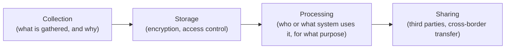

# Lesson 82: Privacy, Security, and Compliance as Product Constraints

## Why This Lesson Matters

Lesson 81 introduced the Regulatory Surface Map's four layers and noted that the Data Layer — what information can be collected, stored, shared, and how — deserved a dedicated, deeper treatment of its own. This lesson provides that treatment, addressing privacy and security not as a legal afterthought bolted onto a finished product, but as constraints that shape a product's data architecture from the very first decision about what to collect.

A common and specifically dangerous instinct among product teams is to collect as much data as possible "just in case it becomes useful later" — a habit that feels harmless, even prudent, from a pure product-development perspective, since more data usually does make some future feature or analysis easier. This instinct runs directly against a foundational principle of modern privacy regulation: **data minimization**, the requirement that an organization collect only the data genuinely necessary for a specific, stated purpose, and retain it only as long as that purpose requires. A product built around "collect everything, figure out the use case later" is not merely taking on abstract legal risk; it is accumulating a growing liability surface, since every additional piece of data collected is a piece of data that must be secured, and every unsecured or improperly shared piece of data is a potential source of serious harm to the people it describes.

This lesson introduces the Data Flow Risk Map, this lesson's core mental model, to give you a structured way to trace a piece of data through its entire lifecycle within a product, identifying where privacy and security safeguards must be built in at each stage.

---

## Learning Path

| Field | Detail |
|---|---|
| **Module** | 9 — Specialized Domains and Synthesis |
| **Current Lesson** | 82 of 90 |
| **Difficulty** | 6 / 10 |
| **Estimated Study Time** | 40 minutes (reading) + 15 minutes (reflection + quiz) |
| **Prerequisites** | Lesson 81 (Regulatory Surface Map, Data Layer), Lesson 64 (Metric Provenance Chain, data trustworthiness) |
| **Next Lesson** | Lesson 83 — Hardware and Physical Products: PM Beyond Software |
| **Future Topics Unlocked** | Lesson 84 (PM in AI-Native Companies), Lesson 85 (Responsible AI Product Management) — both depend on the Data Flow Risk Map introduced here |

---

## Learning Objectives

By the end of this lesson, you will be able to:

1. Explain why data minimization is a foundational privacy principle and why "collect everything, figure out the use case later" conflicts with it directly.
2. Apply the Data Flow Risk Map to trace a piece of data through collection, storage, processing, and sharing, identifying safeguards needed at each stage.
3. Identify the specific risks introduced when data is shared with third parties without adequate contractual and technical safeguards.
4. Explain the purpose and product implications of a "right to deletion" requirement.
5. Evaluate a product's data handling practices for whether each stage of the Data Flow Risk Map has been adequately secured.

---

## Prerequisites

This lesson assumes the Regulatory Surface Map and its Data Layer concept from Lesson 81, since this lesson provides a deeper, dedicated treatment of exactly that layer, and the Metric Provenance Chain from Lesson 64, since data used for any purpose, including compliance reporting, must be trustworthy to begin with.

---

## Theory

### Data Minimization as a Foundational Principle

**Data minimization** requires that an organization collect only the data genuinely necessary for a specific, disclosed purpose, avoid using that data for purposes beyond the one originally stated, and retain it only for as long as that purpose requires. This principle runs directly counter to a common product-development instinct to collect broadly in case some future, currently unspecified use case emerges, and the tension between these two impulses is not merely a matter of legal risk tolerance — every piece of data collected beyond what a stated purpose actually requires is data that must be secured, data that increases the potential harm of any future breach, and data that, under many modern privacy regulations, the organization may have had no legitimate basis to collect at all. Data minimization, done well, treats "we might need this someday" as an insufficient justification for collection, requiring instead a specific, currently-active purpose.

### The Data Flow Risk Map

This lesson introduces the **Data Flow Risk Map**, tracing a piece of data through four stages, each carrying distinct risks and requiring distinct safeguards:

At the **Collection** stage, the central question is whether the data being gathered is genuinely necessary for a specific, currently-active purpose, applying the data minimization principle directly. At the **Storage** stage, the central questions are whether data is encrypted both at rest and in transit, and whether access is genuinely restricted to those who need it for a legitimate purpose, following a principle of least privilege rather than broad, convenient internal access. At the **Processing** stage, the central question is whether the data is being used only for the purpose it was originally collected for, since using data collected for one stated purpose in an unrelated way — a form of "purpose creep" — violates the same minimization principle even if the data itself was legitimately collected in the first place. At the **Sharing** stage, the central questions concern what safeguards govern any transfer of data to a third party, including contractual data processing agreements and, in many jurisdictions, specific restrictions on transferring data across international borders.

The Data Flow Risk Map's discipline is recognizing that adequate safeguards at one stage do not substitute for safeguards at another — data collected minimally and stored securely can still create serious harm if it is processed for an undisclosed purpose or shared with a third party lacking adequate protections, echoing the same "one layer doesn't guarantee another" lesson established for the Regulatory Surface Map in Lesson 81.

### The Risk of Inadequate Third-Party Sharing Safeguards

Sharing data with a third-party vendor or partner introduces a specific and often underestimated category of risk: the sharing organization typically remains legally and reputationally responsible for how that data is subsequently handled, even though it no longer directly controls the third party's own security practices. A data processing agreement — a contractual document specifying exactly how a third party may use, secure, and eventually delete shared data — is a necessary but insufficient safeguard on its own, since a contract cannot technically prevent a third party's security failure; it can only establish legal recourse after the fact. Organizations sharing sensitive data with third parties should, where feasible, apply technical safeguards (data minimization specific to what the third party actually needs, encryption, monitoring) in addition to contractual ones, rather than relying on contractual language alone.

### The Right to Deletion

Many modern privacy regulations grant individuals a **right to deletion** (sometimes called the "right to be forgotten"): the ability to request that an organization delete their personal data, subject to certain exceptions. This requirement has significant product implications beyond a simple database delete operation, since a product's data architecture must actually be capable of locating and removing a specific individual's data across every system it has propagated to — including backups, data warehouses, and any third parties it may have been shared with — a capability that is far easier to build into a system from the outset than to retrofit into an architecture that was never designed to track where a given individual's data has spread.

---

## Common Beginner Mistakes

1. **Collecting data broadly on the reasoning that it might be useful for some future, currently unspecified purpose.** This directly conflicts with the data minimization principle and increases liability surface without a currently justified purpose.
2. **Assuming a contractual data processing agreement alone is sufficient protection when sharing data with a third party.** A contract establishes legal recourse after a failure occurs; it does not technically prevent the failure itself, and additional technical safeguards are often necessary.
3. **Using data collected for one stated purpose for an unrelated purpose later, without updating disclosure or seeking renewed consent.** This "purpose creep" violates data minimization even when the original collection was legitimate.
4. **Failing to design a product's data architecture to support locating and deleting a specific individual's data across all systems it has propagated to.** Retrofitting right-to-deletion capability into a system not originally designed for it is considerably more difficult than building it in from the start.
5. **Treating encryption alone as sufficient security, without also implementing access control based on least privilege.** Encrypted data accessible to anyone within an organization who has a convenient reason to view it still carries meaningful risk, since internal misuse or a compromised internal account can bypass encryption's protection.

---

## Mental Model: The Data Flow Risk Map

The Data Flow Risk Map introduced above is this lesson's core takeaway tool. For any product handling personal or sensitive data, ask:

1. **At Collection, is every piece of data being gathered genuinely necessary for a specific, currently-active, disclosed purpose**, rather than collected on the speculative reasoning that it might become useful later?
2. **At Storage, is data encrypted both at rest and in transit, and is access genuinely restricted following a least-privilege principle**, rather than broadly available for internal convenience?
3. **At Processing, is data being used only for the purpose it was originally disclosed for**, with any new use requiring updated disclosure or consent rather than quietly expanding the original purpose?
4. **At Sharing, are both contractual data processing agreements and, where feasible, technical safeguards in place for any third-party data transfer**, rather than relying on contractual language alone?

A product team that runs its data handling practices through this Map at every stage is far better positioned to avoid both regulatory penalty and the genuine harm that inadequate data protection can cause to the real people the data describes.

---

## Real Company Example

Apple's public positioning around privacy, including features like App Tracking Transparency and its publicized use of on-device processing and differential privacy techniques to limit the amount of raw personal data transmitted to its own servers, is widely discussed as an example of data minimization applied deliberately at the product architecture level rather than addressed only through policy language. Public commentary on Apple's approach describes a consistent emphasis on processing data locally on a user's own device wherever feasible, specifically to avoid the Collection and Sharing stage risks this lesson describes, rather than collecting broad data centrally and relying solely on downstream security and contractual safeguards to protect it.

**Assumption flagged:** the specifics of Apple's internal privacy engineering practices and the precise technical mechanisms behind any particular feature described here are drawn from public commentary and industry reporting, not confirmed internal company statements, and should be treated as illustrative rather than verified fact.

---

## Real World Perspective

**Startup:** Early-stage companies often collect data broadly with minimal governance, reasoning that establishing formal data minimization and access control practices can wait until the company has more resources — a reasonable short-term trade-off in some cases, but one that becomes considerably more expensive to correct once a broad, ungoverned data collection practice has already accumulated significant liability surface.

**Mid-size company:** This is typically where privacy and security practices first require formal governance, as growing data volume, growing engineering team size, and increasing regulatory scrutiny make previously informal, ad hoc data handling practices genuinely risky rather than merely theoretically risky.

**Big Tech:** Large organizations typically maintain dedicated privacy engineering functions, formal data governance processes, and systematic Data Flow Risk Map-style review requirements for any new feature involving personal data, precisely because the scale of data involved and the scale of potential harm from a failure make informal, ad hoc practices unacceptable.

---

## Detailed Case Study: The Third-Party Data Exposure

A consumer health and wellness app collected detailed health-related data from its users — sleep patterns, exercise habits, and self-reported symptoms — to power its core personalized recommendation features, a data collection practice reasonably aligned with the product's stated purpose and the data minimization principle at the Collection stage. To power an auxiliary analytics dashboard for internal product decision-making, the company shared a substantial portion of this health data with a third-party analytics vendor, under a standard data processing agreement that specified the vendor could use the data only for the specific analytics services contracted, and must delete it upon contract termination.

The company, however, applied no meaningful technical safeguards beyond the contractual agreement itself: the full, unminimized health dataset was shared with the vendor, rather than a more limited, purpose-specific subset, and no ongoing technical monitoring existed to verify the vendor was actually adhering to the agreement's terms. Several months later, the third-party vendor experienced its own security breach, exposing the shared health data to unauthorized access. Regulatory investigation subsequently found the original health app liable, in significant part, for the exposure — not because the initial collection or storage practices were themselves deficient, but because the company had shared far more data than the analytics purpose actually required, with insufficient technical safeguards beyond a contractual promise that ultimately provided no protection once the third party's own security failed.

**What went wrong?** Using the Data Flow Risk Map, the failure is precise: the Collection and Storage stages had been reasonably well-managed, but the Sharing stage relied entirely on a contractual data processing agreement with no accompanying technical safeguards — no data minimization specific to what the analytics vendor actually needed, no additional encryption or monitoring — leaving the company fully exposed to a security failure entirely outside its own direct control. A contract, as this lesson's Theory section notes, establishes legal recourse after a failure, but it does not technically prevent the failure itself.

The company's recovery involved substantially reducing the scope of data shared with any third-party vendor to the minimum genuinely necessary for each specific purpose, implementing additional technical safeguards including field-level encryption for any shared health data, and instituting ongoing technical monitoring of third-party data handling rather than relying solely on periodic contractual compliance reviews — a discipline that connects directly to the broader responsible AI considerations formalized in Lesson 85.

---

## Framework Explanation: The Privacy and Security Compliance Checklist

Before launching or auditing a product feature involving personal data, a PM can use the following checklist:

| Checklist Item | Question to Ask | Risk if Skipped |
|---|---|---|
| Data Minimization Applied | Is every piece of data collected genuinely necessary for a specific, currently-active purpose? | Unnecessary liability surface from data with no legitimate collection basis |
| Encryption and Access Control | Is data encrypted at rest and in transit, with access restricted by least privilege? | Internal misuse or compromised accounts bypass encryption's protection |
| Purpose Limitation | Is data used only for the purpose it was originally disclosed for? | "Purpose creep" violations even when original collection was legitimate |
| Third-Party Safeguards | Do data sharing arrangements include both contractual agreements and technical safeguards? | A third party's own security failure exposes the sharing organization to liability, as in the Case Study |
| Right to Deletion Capability | Can the system locate and delete a specific individual's data across all systems, including backups and third parties? | Inability to fulfill a legally required deletion request |

A "no" on Third-Party Safeguards should be treated as a significant risk, given the Case Study's illustration that contractual protection alone provides no defense against a third party's own security failure.

---

## Interview Perspective

**"How would you decide what data to collect when designing a new feature?"** The interviewer is evaluating whether you apply data minimization directly, collecting only what a specific, currently-active purpose requires, rather than defaulting to broad collection in case it becomes useful later.

**"What's the risk of sharing customer data with a third-party vendor, even under a signed data processing agreement?"** The interviewer is testing whether you recognize that a contract alone doesn't prevent a technical security failure, and that additional technical safeguards are often necessary.

**"How would you design a product's data architecture to support a right-to-deletion request?"** The interviewer is listening for recognition that this capability must be designed in from the outset, since retrofitting it into a system that was never built to track data propagation is considerably more difficult.

---

## Summary

Data minimization — collecting only what a specific, currently-active purpose genuinely requires — is a foundational privacy principle that runs directly counter to the common product-development instinct to collect broadly in case data becomes useful later, and every piece of data collected beyond genuine current need increases liability surface without corresponding benefit. The Data Flow Risk Map traces data through Collection, Storage, Processing, and Sharing stages, and its central discipline is recognizing that adequate safeguards at one stage do not substitute for safeguards at another — reasonably secure collection and storage practices, as this lesson's Case Study illustrates, provide no protection if the Sharing stage relies solely on contractual agreements with no accompanying technical safeguards, since a contract establishes legal recourse after a failure but does not technically prevent the failure itself. Purpose limitation requires that data be used only for its originally disclosed purpose, since using legitimately-collected data for an unrelated purpose later constitutes its own minimization violation, and the right to deletion requires a product's data architecture to be capable of locating and removing an individual's data across every system it has propagated to, a capability far easier to design in from the outset than to retrofit later. Privacy and security, treated as genuine product constraints shaping data architecture from the earliest design decisions, protect against both regulatory penalty and the real harm inadequate data protection can cause to the actual people the data describes.

---

## Key Takeaways

- Data minimization requires collecting only what a specific, currently-active purpose genuinely needs, directly conflicting with the instinct to collect broadly for speculative future use.
- The Data Flow Risk Map traces data through Collection, Storage, Processing, and Sharing, each requiring distinct safeguards.
- Adequate safeguards at one stage of the Data Flow Risk Map do not substitute for safeguards at another stage.
- A contractual data processing agreement establishes legal recourse after a third-party failure but does not technically prevent the failure itself; additional technical safeguards are often necessary.
- Purpose limitation prohibits using data for an unrelated purpose beyond its original disclosure, even when the original collection was legitimate.
- The right to deletion requires a product's data architecture to be capable of locating and removing an individual's data across all systems, a capability best designed in from the outset.
- Privacy and security should be treated as product architecture constraints shaping design from the beginning, not a late-stage legal review.

---

## Cheat Sheet

- Data minimization: collect only what a current, specific purpose requires. "Might need it later" isn't sufficient justification.
- Data Flow Risk Map: Collection → Storage → Processing → Sharing. Secure all four stages, not just one.
- Contracts alone don't prevent third-party security failures. Add technical safeguards too.
- Purpose creep (using data for a new purpose without updated disclosure) violates minimization even on legitimately collected data.
- Design right-to-deletion capability in from the start — retrofitting it later is far harder.

---

## Glossary

| Term | Definition | Related Concepts | Difficulty |
|---|---|---|---|
| Data Minimization | Collecting only data genuinely necessary for a specific, disclosed purpose, retained only as long as needed | Data Flow Risk Map | 1 |
| Data Flow Risk Map | A four-stage model tracing data through Collection, Storage, Processing, and Sharing | Regulatory Surface Map (Lesson 81) | 2 |
| Purpose Limitation | The principle that data may only be used for the purpose it was originally disclosed for | Purpose Creep | 2 |
| Data Processing Agreement | A contract specifying how a third party may use, secure, and delete shared data | Third-Party Safeguards | 2 |
| Right to Deletion | A legal requirement allowing individuals to request removal of their personal data across an organization's systems | Data Flow Risk Map | 2 |

---

## Further Reading / Resources

1. *Privacy by Design* principles, as published by the Office of the Information and Privacy Commissioner of Ontario
2. General Data Protection Regulation (GDPR), official text published by the European Union
3. *Privacy Engineering* by Michelle Finneran Dennedy, Jonathan Fox, and Thomas Finneran

---

## Flashcards

**Front:** What is data minimization?
**Back:** The principle that an organization should collect only data genuinely necessary for a specific, disclosed purpose, and retain it only as long as that purpose requires.
**Difficulty:** Easy
**Tags:** #privacy #core-concept

**Front:** Name the four stages of the Data Flow Risk Map.
**Back:** Collection, Storage, Processing, Sharing.
**Difficulty:** Easy
**Tags:** #data-flow-risk-map

**Front:** Why is a contractual data processing agreement insufficient protection on its own?
**Back:** A contract establishes legal recourse after a third party's security failure but does not technically prevent that failure from occurring in the first place.
**Difficulty:** Medium
**Tags:** #third-party-safeguards

**Front:** What is "purpose creep"?
**Back:** Using data collected for one stated purpose for an unrelated purpose later, without updated disclosure or renewed consent — a minimization violation even on legitimately collected data.
**Difficulty:** Medium
**Tags:** #purpose-limitation

**Front:** What went wrong in the Third-Party Data Exposure case study?
**Back:** The company shared far more health data than its analytics purpose required, relying solely on a contractual agreement with no technical safeguards, leaving it exposed when the third party's own security failed.
**Difficulty:** Hard
**Tags:** #case-study #data-flow-risk-map

**Front:** Why should right-to-deletion capability be designed in from the outset?
**Back:** A system not originally built to track where an individual's data has propagated is far harder to retrofit with the ability to locate and delete that data later.
**Difficulty:** Medium
**Tags:** #right-to-deletion

**Front:** Why is encryption alone insufficient security without access control?
**Back:** Encrypted data broadly accessible for internal convenience still carries meaningful risk from internal misuse or a compromised internal account bypassing encryption's protection.
**Difficulty:** Medium
**Tags:** #access-control

---

## Reflection Exercise

You are the PM for a fintech app that has been collecting extensive transaction and spending category data from users, initially justified by a budgeting feature, but the data science team now wants to use this same dataset to build a new, unrelated credit-scoring product.

There is no single correct answer to the prompts below — the goal is to practice applying the Data Flow Risk Map and the Privacy and Security Compliance Checklist to a genuine purpose-limitation question.

1. Using the Data Flow Risk Map, at which stage does the proposed new use of this data raise the most significant concern?
2. Does using this existing data for a new credit-scoring purpose constitute "purpose creep," even though the data was legitimately collected for budgeting? Why or why not?
3. What would need to change, from a disclosure or consent perspective, before this data could legitimately be used for the new purpose?
4. If the new credit-scoring product involves sharing any data with a third-party credit bureau, what technical and contractual safeguards would you want in place?
5. How would you design the credit-scoring feature's data architecture to support a right-to-deletion request from the outset?

---

## Quiz

**1. What is data minimization?**
A) Reducing the total number of features a product offers
B) Collecting only data genuinely necessary for a specific, disclosed purpose, retained only as long as needed
C) A technique for compressing data to save storage costs
D) A requirement to delete all user data within 24 hours of collection

*Correct answer: B*
*Explanation: This is the foundational privacy principle explicitly defined in the Theory section.*
*Learning objective tested: #1*
*Difficulty: Easy*

---

**2. What is the correct order of the Data Flow Risk Map?**
A) Sharing, Processing, Storage, Collection
B) Collection, Storage, Processing, Sharing
C) Storage, Collection, Sharing, Processing
D) Processing, Sharing, Collection, Storage

*Correct answer: B*
*Explanation: This is the sequential order introduced in the Theory section, tracing data from initial gathering through eventual sharing.*
*Learning objective tested: #2*
*Difficulty: Easy*

---

**3. What does the "least privilege" principle refer to at the Storage stage?**
A) Giving every employee full access to all data for convenience
B) Restricting data access to only those who need it for a legitimate, specific purpose
C) Storing the minimum possible amount of data regardless of purpose
D) A legal requirement to encrypt data only once per year

*Correct answer: B*
*Explanation: Least privilege specifically concerns restricting access appropriately, distinct from the minimization principle applied at Collection.*
*Learning objective tested: #2*
*Difficulty: Easy*

---

**4. Why is a data processing agreement insufficient protection on its own when sharing data with a third party?**
A) Data processing agreements are not legally enforceable in most jurisdictions
B) A contract establishes legal recourse after a failure but does not technically prevent the third party's own security failure from occurring
C) Third parties are never actually bound by any contractual terms
D) Data processing agreements only apply to government entities

*Correct answer: B*
*Explanation: The lesson explicitly distinguishes contractual recourse from technical prevention as two different, both-necessary forms of protection.*
*Learning objective tested: #3*
*Difficulty: Easy*

---

**5. What is "purpose creep"?**
A) A technical vulnerability in data storage systems
B) Using data collected for one stated purpose for an unrelated purpose later, without updated disclosure or consent
C) The natural growth of a company's customer base over time
D) A legal requirement to expand data collection purposes annually

*Correct answer: B*
*Explanation: Purpose creep specifically describes this violation of purpose limitation, even when original collection was legitimate.*
*Learning objective tested: #1, #4*
*Difficulty: Easy*

---

**6. What is the "right to deletion"?**
A) A company's right to delete data it no longer wants to store
B) A legal requirement allowing individuals to request removal of their personal data across an organization's systems
C) A technical feature allowing users to delete their own social media posts
D) A right that applies only to financial data, never health data

*Correct answer: B*
*Explanation: This is the specific individual right described in the Theory section, with implications extending across a product's entire data architecture.*
*Learning objective tested: #4*
*Difficulty: Easy*

---

**7. In the Third-Party Data Exposure case study, what specifically caused the company to be found liable?**
A) The company's own initial data collection practices were deficient
B) The company shared far more data than the analytics purpose required, relying solely on contractual safeguards with no accompanying technical protections
C) The company never signed any data processing agreement with the vendor
D) The vendor never actually experienced any security breach

*Correct answer: B*
*Explanation: The case study specifically attributes liability to the Sharing stage failure — over-broad data sharing with insufficient technical safeguards.*
*Learning objective tested: #3, #5*
*Difficulty: Medium*

---

**8. According to the case study, what would have reduced the company's risk at the Sharing stage?**
A) Sharing an even larger dataset with the vendor for redundancy
B) Sharing only the minimum data genuinely necessary for the analytics purpose, combined with additional technical safeguards beyond the contract alone
C) Eliminating the data processing agreement entirely
D) Relying exclusively on the vendor's own internal security practices with no oversight

*Correct answer: B*
*Explanation: This reflects the company's actual recovery approach described in the case study — minimizing shared data and adding technical safeguards.*
*Learning objective tested: #3, #5*
*Difficulty: Medium*

---

**9. According to the Privacy and Security Compliance Checklist, what does a "no" on Third-Party Safeguards indicate?**
A) A minor issue easily resolved after the fact
B) A significant risk, given that contractual protection alone provides no defense against a third party's own security failure
C) That third-party data sharing should never occur under any circumstances
D) That the organization's own internal security is automatically deficient as well

*Correct answer: B*
*Explanation: The lesson explicitly treats this gap as significant, directly connecting to the case study's core failure.*
*Learning objective tested: #3, #5*
*Difficulty: Medium*

---

**10. Why might early-stage companies reasonably delay establishing formal data governance practices, per the Real World Perspective section?**
A) Formal governance is legally prohibited for companies below a certain size
B) It may represent a reasonable short-term trade-off given limited resources, though this becomes more expensive to correct as data collection accumulates
C) Data governance is only relevant for companies operating in the European Union
D) Early-stage companies never collect any personal data

*Correct answer: B*
*Explanation: The Real World Perspective section frames this as a reasonable but increasingly risky trade-off as data volume and liability surface grow.*
*Learning objective tested: #1*
*Difficulty: Medium*

---

**11. What do large organizations typically maintain regarding privacy and security, per the Real World Perspective section?**
A) No formal privacy processes, relying entirely on ad hoc decisions
B) Dedicated privacy engineering functions and systematic Data Flow Risk Map-style review requirements for new features involving personal data
C) A policy of collecting as much data as technically possible regardless of purpose
D) Privacy processes only for data belonging to their own employees

*Correct answer: B*
*Explanation: The Real World Perspective section describes this systematic, dedicated approach as characteristic of large organizations given the scale of potential harm.*
*Learning objective tested: #5*
*Difficulty: Medium*

---

**12. (Scenario) A company wants to use data originally collected for a budgeting feature to build an unrelated credit-scoring product. What concern does this raise, per this lesson's frameworks?**
A) No concern, since the data was already legitimately collected
B) A potential purpose creep violation, since using data for a new, undisclosed purpose requires updated disclosure or consent even when original collection was legitimate
C) A concern only relevant to the Storage stage, not Processing
D) No concern, since credit scoring and budgeting are considered identical purposes under most regulations

*Correct answer: B*
*Explanation: This directly applies the purpose limitation principle to a new use of previously collected data.*
*Learning objective tested: #1, #4, #5*
*Difficulty: Medium-Hard*

---

**13. (Product Thinking) A PM is designing a new feature and instinctively wants to collect additional data "in case it's useful later." What is the strongest response, using this lesson's frameworks?**
A) Collect the additional data as planned, since more data is always beneficial for future product development
B) Apply data minimization directly: collect only what the feature's specific, current purpose genuinely requires, treating "might need it later" as an insufficient justification
C) Collect the data but store it separately to avoid any privacy concerns
D) Collect the data only if it can be encrypted, regardless of whether it's genuinely necessary

*Correct answer: B*
*Explanation: The correct response applies data minimization directly, rejecting speculative future use as sufficient justification for collection.*
*Learning objective tested: #1, #5*
*Difficulty: Hard*

---

**14. (Interview Reasoning) A candidate, asked how they'd design a data-sharing arrangement with a third-party vendor, describes only the contractual data processing agreement with no mention of technical safeguards. What does this most likely signal, per the Interview Perspective section?**
A) A strong and complete understanding of data sharing risk
B) A gap in recognizing that contracts alone don't prevent a third party's technical security failure, and additional safeguards are often necessary
C) That the candidate is ready for a senior privacy engineering role immediately
D) Nothing meaningful; contractual agreements are always sufficient protection on their own

*Correct answer: B*
*Explanation: The Interview Perspective section specifically listens for recognition of the need for technical safeguards beyond contractual protection alone.*
*Learning objective tested: #3, #5*
*Difficulty: Hard*

---

**15. (Product Thinking, Highest Difficulty) A fintech company wants to reuse data originally collected for budgeting to build a new credit-scoring product, potentially sharing some of this data with a third-party credit bureau. Using only the frameworks in this lesson, what is the most defensible approach?**
A) Proceed with the new use and third-party sharing immediately, since the data was already legitimately collected
B) Address the purpose creep concern by obtaining updated disclosure or consent for the new use, apply data minimization to any data shared with the credit bureau, and implement both contractual and technical safeguards for that sharing arrangement
C) Avoid using any previously collected data for any new purpose under any circumstances
D) Share the complete original dataset with the credit bureau to ensure maximum accuracy, relying solely on the bureau's own security practices

*Correct answer: B*
*Explanation: This mirrors the Reflection Exercise: the correct response addresses purpose limitation through updated disclosure, applies minimization to any newly shared data, and layers technical safeguards alongside contractual ones, rather than either proceeding unexamined or refusing any reuse at all.*
*Learning objective tested: #1, #3, #4, #5*
*Difficulty: Hard*

---

## Connections

| | Lesson | Core Idea Carried Forward |
|---|---|---|
| **Previous Lesson** | Lesson 81 — Regulated Industries: PM in Healthcare, Finance, and Government | Extends the Regulatory Surface Map's Data Layer into a full, dedicated privacy and security framework |
| **Current Lesson** | Lesson 82 — Privacy, Security, and Compliance as Product Constraints | Data minimization; Data Flow Risk Map; purpose limitation; right to deletion; Privacy and Security Compliance Checklist |
| **Next Lesson** | Lesson 83 — Hardware and Physical Products: PM Beyond Software | Shifts to a different specialized domain, addressing product management challenges unique to physical products |
| **Future Concepts Unlocked** | Lesson 84 (PM in AI-Native Companies) | Extends data handling discipline into the specific data demands of training and operating AI models |
| | Lesson 85 (Responsible AI Product Management) | Builds directly on purpose limitation and data minimization when addressing responsible AI data practices |

This curriculum continues to build as one continuous argument. From this lesson forward, any reference to a product's data handling practices assumes you can trace it through the Data Flow Risk Map without re-explanation.
