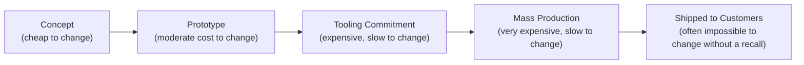

# Lesson 83: Hardware and Physical Products: PM Beyond Software

## Why This Lesson Matters

Every framework this curriculum has built so far assumes a specific, usually unstated property of the product being managed: that it can be changed after it reaches the user. A software bug discovered after launch can typically be fixed with a deployment that reaches every user within hours or days. A poorly calibrated recommendation algorithm can be retrained. A confusing onboarding flow can be redesigned and shipped the same week. This lesson addresses what happens when that assumption fails entirely — when the product is physical, and a mistake discovered after a critical point in its development can no longer be fixed remotely at all, because the flawed version has already been manufactured, shipped, and is sitting in a customer's home.

A PM moving from software to hardware for the first time tends to underestimate just how differently risk and iteration work in a physical product context. Software's iteration loop assumes continuous deployment is always available as a safety net; hardware's iteration loop has genuine, irreversible commitment points, after which a design flaw is no longer a bug to patch but a manufactured reality that must be lived with, recalled, or replaced at enormous cost. This is not merely "software but slower" — it is a fundamentally different risk profile requiring fundamentally different discipline, especially around the specific question of what, if anything, can still be changed remotely after a physical unit has shipped.

This lesson introduces the Commitment Curve, this lesson's core mental model, to give you a structured way to reason about where your product currently sits on the path from freely changeable to permanently fixed, and what that position should mean for how carefully you validate decisions before making them.

---

## Learning Path

| Field | Detail |
|---|---|
| **Module** | 9 — Specialized Domains and Synthesis |
| **Current Lesson** | 83 of 90 |
| **Difficulty** | 6 / 10 |
| **Estimated Study Time** | 40 minutes (reading) + 15 minutes (reflection + quiz) |
| **Prerequisites** | Lesson 61 (Leverage Stack, Layer 2 Promise Tiers concept), Lesson 68 (Sunset Runway, migration discipline) |
| **Next Lesson** | Lesson 84 — PM in AI-Native Companies: New Skills, New Risks |
| **Future Topics Unlocked** | Lesson 84 (PM in AI-Native Companies), Lesson 87 (Crisis Management and Incident Response) — both depend on the irreversibility discipline introduced here |

---

## Learning Objectives

By the end of this lesson, you will be able to:

1. Explain why hardware product development carries a fundamentally different risk profile than software, centered on irreversibility rather than continuous iteration.
2. Apply the Commitment Curve to identify how much a specific hardware decision would cost to reverse at its current stage of development.
3. Identify the role firmware and over-the-air (OTA) update capability plays in preserving some post-shipment flexibility for an otherwise fixed physical product.
4. Explain why hardware validation and testing rigor must scale with proximity to an irreversible commitment point.
5. Evaluate a hardware product decision for whether it accounts for the specific commitment stage it currently occupies.

---

## Prerequisites

This lesson assumes the Leverage Stack from Lesson 61, since a hardware product's firmware update mechanism functions analogously to a Layer 2 Developer Surface requiring its own stability promise, and the Sunset Runway and dependency-aware migration discipline from Lesson 68, since a hardware recall shares important structural similarities with a large-scale, high-stakes migration.

---

## Theory

### Why Hardware's Risk Profile Differs Fundamentally from Software's

Software product development, across nearly every framework in this curriculum, implicitly assumes that a mistake discovered after launch can be corrected through a subsequent deployment, typically at a cost proportional to the size of the fix rather than the number of users affected. This assumption underlies concepts as varied as the A/B testing rigor from Module 5 and the migration discipline from Lesson 68 — even a large-scale software migration, however costly and disruptive, remains fundamentally a matter of coordinating a change that is still technically possible to make. Hardware development breaks this assumption at specific, identifiable points in its lifecycle. Once a product design has been committed to tooling — the expensive, custom manufacturing equipment specific to a particular design — changing that design requires re-tooling, at a cost and timeline that can run into the months and into significant capital expenditure. Once units have been manufactured and shipped to customers, a flaw that cannot be addressed through a firmware update is no longer a bug; it is a defect that exists in every physical unit already in a customer's possession, correctable only through an expensive and reputationally damaging recall or replacement program.

### The Commitment Curve

This lesson introduces the **Commitment Curve**, illustrating how the cost of reversing a hardware decision increases sharply and non-linearly as a product moves through its development stages:

The Commitment Curve's core discipline is recognizing that the appropriate level of validation rigor for any given decision should scale with proximity to these commitment points, rather than remaining constant throughout development. A design assumption that would be reasonable to test quickly and cheaply at the Concept or Prototype stage becomes an entirely different category of risk once the same assumption is embedded in a Tooling Commitment, since an error discovered after tooling has been committed can no longer be corrected through further iteration on the same design — it requires either accepting the flaw, or paying the very high cost of re-tooling. This is precisely why hardware product teams typically invest disproportionately in validation, user testing, and design review before crossing the Tooling Commitment threshold, compared to the validation rigor a software team might apply before an equivalent-seeming decision, since a software team retains the ability to iterate further even after a decision has technically shipped.

### Firmware and OTA Updates as Preserved Flexibility

**Firmware** — the embedded software running on a physical device — represents one of the few mechanisms available to preserve genuine post-shipment flexibility for an otherwise fixed hardware product. A device with **over-the-air (OTA) update** capability can have its behavior meaningfully changed after it has already shipped to customers, correcting certain categories of flaws (a software bug in the device's control logic, a suboptimal default configuration) without requiring a physical recall, in a way directly analogous to the Layer 2 Developer Surface concept from Lesson 61 — the firmware update mechanism is, in effect, its own promise to customers about what can and cannot be corrected after purchase, and that promise should be designed deliberately rather than assumed. Critically, however, OTA update capability can only correct flaws in the *firmware*, not in the physical hardware itself — a defective sensor, an undersized battery, or a structurally weak physical component cannot be fixed through a software update regardless of how sophisticated the device's update mechanism is, meaning firmware flexibility, while valuable, does not eliminate the fundamental irreversibility the Commitment Curve describes for genuinely physical design decisions.

### Why Validation Rigor Must Scale with Commitment Proximity

A specific and costly hardware product management mistake is applying uniform validation rigor throughout development, rather than deliberately intensifying scrutiny as a design decision approaches an irreversible commitment point. A hardware team that treats every design review with the same level of urgency, regardless of whether the decision under review is still cheaply reversible or is about to be locked in through tooling commitment, risks either wasting excessive validation effort on decisions that could be iterated on cheaply later, or, more dangerously, failing to apply sufficient scrutiny to a decision immediately preceding an expensive, irreversible commitment.

---

## Common Beginner Mistakes

**Mistake 1: Applying software-style "ship and iterate" thinking to genuinely physical design decisions**

A physical design flaw discovered after tooling commitment or mass production cannot be patched the way a software bug can, and treating hardware iteration as equivalent to software iteration underestimates this risk severely.

**Mistake 2: Assuming firmware update capability solves all post-shipment risk**

OTA updates can only correct flaws in embedded software, not in physical hardware components, and conflating the two creates false confidence about what can actually be fixed after shipment.

**Mistake 3: Applying uniform validation rigor throughout hardware development, rather than intensifying scrutiny as a decision approaches an irreversible commitment point**

This risks insufficient validation immediately before the most expensive, hardest-to-reverse decisions.

**Mistake 4: Underestimating the cost and timeline of re-tooling relative to a software rollback**

A hardware team accustomed to software's typically fast, cheap correction cycle can badly misjudge how long and how expensive a hardware correction genuinely is.

**Mistake 5: Failing to design firmware update capability into a physical product from the outset**

Retrofitting OTA update capability into a device not originally designed to support it is far more difficult than building it in from the start, echoing the same architectural-decision-early principle established for regulatory and privacy requirements in Lessons 81 and 82.

---

## Mental Model: The Commitment Curve

The Commitment Curve introduced above is this lesson's core takeaway tool. For any hardware product decision, ask:

1. **Where does this decision currently sit on the Commitment Curve** — Concept, Prototype, Tooling Commitment, Mass Production, or already Shipped — and has validation rigor been deliberately scaled to match that position?
2. **If this decision is approaching Tooling Commitment specifically, has it received validation proportional to how expensive and slow it would be to reverse afterward**, rather than the same level of scrutiny applied to an earlier, more easily reversible decision?
3. **Does this specific flaw or risk concern the device's firmware, which OTA updates could potentially correct after shipment, or does it concern a genuinely physical component**, which no software update could address regardless of the device's update capability?
4. **Has firmware update capability been designed into the product from the outset**, preserving whatever post-shipment flexibility is genuinely available, rather than assumed as something that could be added later?

A hardware product team that runs every significant decision through this Curve is far less likely to discover, only after an expensive and irreversible commitment has already been made, that a design flaw could have been caught and corrected cheaply at an earlier stage.

---

## Real Company Example

Peloton's connected fitness hardware, combining physical exercise equipment with ongoing software and subscription services, is widely discussed as an example of a hardware company that has had to navigate the specific tension between hardware's irreversibility and the flexibility software can provide. Public commentary on Peloton's product approach describes substantial investment in software and firmware updates delivered to already-shipped hardware — new class content delivery mechanisms, interface updates, and feature additions — reflecting the value of preserving post-shipment flexibility wherever the underlying physical hardware design allows for it, while also illustrating, through publicly reported hardware-specific issues the company has faced over its history, the genuinely different and higher stakes of a physical component flaw compared to a correctable software issue.

**Assumption flagged:** the specifics of Peloton's internal hardware development and firmware update practices described here are drawn from public commentary and industry reporting, not confirmed internal company statements, and should be treated as illustrative rather than verified fact.

---

## Real World Perspective: Hardware and Physical Products: PM Beyond Software at Different Company Stages

**Startup:** Early-stage hardware companies typically face the most acute version of the Commitment Curve's risk, since a single tooling commitment or mass production run can represent a substantial fraction of the company's total available capital, making the validation rigor applied immediately before these commitment points genuinely existential rather than merely costly.

**Mid-size company:** This is typically where formal, staged validation gates — explicit review checkpoints tied to specific Commitment Curve stages, requiring documented sign-off before proceeding to the next, more expensive stage — first become standard practice, replacing the more informal validation approaches that may have been adequate for a company's very first hardware product.

**Big Tech:** Large hardware manufacturers typically maintain extensive, formalized testing and certification processes specifically calibrated to Commitment Curve stages, including dedicated reliability engineering functions whose primary responsibility is surfacing physical design flaws before tooling commitment, given the scale of financial and reputational risk a flaw discovered after mass production would represent at this scale.

---

## Detailed Case Study: The Unfixable Battery Flaw

A hardware startup developed a wearable fitness tracking device, moving through prototype testing with generally strong results and positive user feedback on the device's core functionality. Under pressure to hit an aggressive launch timeline, the team moved to tooling commitment and subsequently mass production with a battery design that had shown a modest, seemingly minor overheating issue during limited prototype testing — an issue the team judged, at the time, to be a low-priority concern that firmware adjustments to charging behavior could likely mitigate after shipment, given the team's software-oriented instinct that most problems could be addressed through a subsequent update.

After the device shipped to a meaningful number of customers, the overheating issue proved to be a genuine physical battery design flaw — related to the physical battery cell's own thermal characteristics under specific charging conditions — that no firmware adjustment could actually correct, since the underlying issue existed in the physical hardware itself, not in the software governing its behavior. The company faced a costly, reputationally damaging product recall, replacing the battery component across every shipped unit, at a cost that dwarfed what a more rigorous validation process before tooling commitment would have required.

**What went wrong?** Using the Commitment Curve, the failure is precise: a physical design concern identified during Prototype-stage testing was not investigated with validation rigor proportional to its proximity to the imminent Tooling Commitment stage, and the team applied a software-oriented assumption — that firmware could likely fix the issue after shipment — to a problem that was, in fact, a genuinely physical flaw entirely outside firmware's ability to correct. The team's instinct to treat the concern as low-priority and fixable-later reflected exactly the "ship and iterate" mistake this lesson's Common Beginner Mistakes section warns against, applied to a decision immediately preceding an irreversible commitment.

The company's recovery involved instituting a formal, staged validation gate specifically requiring physical versus firmware-correctable flaw classification for any identified issue before proceeding past Tooling Commitment, and building substantially more rigorous thermal and physical stress testing into its pre-tooling validation process for all future hardware products — a discipline that connects directly to the crisis management and incident response practices formalized in Lesson 87.

---

## Framework Explanation: The Hardware Product Readiness Checklist

Before crossing a major Commitment Curve threshold, a PM can use the following checklist:

| Checklist Item | Question to Ask | Risk if Skipped |
|---|---|---|
| Physical vs. Firmware Classification | For any identified issue, is it a physical hardware flaw or a correctable firmware/software issue? | A physical flaw is mistakenly assumed fixable after shipment, as in the Case Study |
| Validation Proportional to Commitment | Has the validation rigor applied to this decision scaled with how expensive it would be to reverse at the current stage? | Insufficient scrutiny immediately before an irreversible commitment point |
| OTA Update Capability Designed In | Does the product's architecture support firmware updates after shipment, designed in from the outset? | Retrofitting update capability into an already-designed device becomes far more difficult |
| Supply Chain and Lead Time Assessed | Are manufacturing lead times and supply chain dependencies for critical components genuinely understood? | Unexpected delays or shortages discovered only after tooling commitment |
| Regulatory Certification Planned | Have applicable physical product certifications (safety, electromagnetic compliance, etc.) been planned for before mass production? | Certification failures discovered late, delaying launch or requiring redesign |

A "no" on Physical vs. Firmware Classification should be treated with particular urgency, given how directly this specific confusion caused the Case Study's costly recall.

---

## Interview Perspective: How Interviewers Think About This

**"How would you approach validating a hardware design decision before committing to tooling?"** The interviewer is evaluating whether you recognize that validation rigor should intensify as a decision approaches an irreversible commitment point, rather than remaining constant throughout development.

**"What's the difference between a firmware issue and a physical hardware issue, and why does the distinction matter?"** The interviewer is testing whether you understand that OTA updates can only correct the former, and that conflating the two creates false confidence about what can actually be fixed after shipment.

**"Tell me about a hardware product decision that would be very expensive to reverse once made."** The interviewer is listening for a clear articulation of the Commitment Curve's logic — that specific stages like tooling commitment and mass production represent genuinely irreversible or extremely costly-to-reverse points, unlike most software decisions.

---

## Summary

Hardware product development carries a fundamentally different risk profile than software, because software's implicit assumption — that a mistake discovered after launch can typically be corrected through a subsequent deployment — breaks down at specific, identifiable points in a hardware product's lifecycle, after which a design flaw is no longer a bug to patch but a manufactured physical reality. The Commitment Curve traces this increasing, non-linear cost of reversal from Concept through Prototype, Tooling Commitment, Mass Production, and Shipped stages, and its central discipline is scaling validation rigor to match proximity to these irreversible commitment points, rather than applying uniform scrutiny throughout development. Firmware and OTA update capability preserve some genuine post-shipment flexibility, functioning as a Layer 2-style promise about what can still be corrected after a device reaches customers, but this flexibility applies only to software-correctable issues, not to genuinely physical hardware flaws, and conflating the two — as this lesson's Case Study illustrates through a physical battery design flaw mistakenly assumed to be firmware-correctable — can produce exactly the costly, reputationally damaging outcome the Commitment Curve's discipline is meant to prevent. A hardware product team that classifies each identified concern correctly, and matches its validation effort to genuine proximity to an irreversible commitment, is far better positioned to catch expensive mistakes while they remain cheap to correct.

---

## Key Takeaways

- Hardware development breaks software's implicit assumption that mistakes can always be corrected through a subsequent deployment, since physical commitment points make certain decisions genuinely irreversible.
- The Commitment Curve traces the sharply increasing cost of reversing a decision through Concept, Prototype, Tooling Commitment, Mass Production, and Shipped stages.
- Validation rigor should scale with proximity to an irreversible commitment point, rather than remaining uniform throughout development.
- Firmware and OTA update capability preserve genuine post-shipment flexibility, but only for software-correctable issues, not genuinely physical hardware flaws.
- Conflating a physical hardware flaw with a firmware-correctable issue can lead to a false assumption that a problem can be fixed after shipment, when it genuinely cannot.
- OTA update capability should be designed into a product's architecture from the outset, since retrofitting it later is considerably more difficult.
- A hardware product team's most costly mistakes typically occur when insufficient validation rigor is applied to a decision immediately preceding an expensive, irreversible commitment.

---

## Cheat Sheet

*A two-minute review of everything in this lesson.*

- Software assumes "ship and iterate." Hardware has genuine irreversible commitment points. Don't confuse the two.
- Commitment Curve: Concept → Prototype → Tooling Commitment → Mass Production → Shipped. Cost of reversal rises sharply at each stage.
- Firmware/OTA updates preserve flexibility for software issues only — never for genuinely physical flaws.
- Classify every identified issue: physical or firmware-correctable? Get this wrong and you can't fix it after shipment.
- Scale validation rigor to proximity to commitment. The closer to tooling, the more scrutiny required.

---

## Glossary

| Term | Definition | Related Concepts | Difficulty |
|---|---|---|---|
| Commitment Curve | A model tracing the sharply increasing cost of reversing a hardware decision through its development stages | Tooling Commitment | 2 |
| Tooling Commitment | The point at which custom manufacturing equipment for a specific design is committed to, after which changes become expensive and slow | Commitment Curve | 2 |
| Firmware | Embedded software running on a physical device, capable of being updated after shipment | OTA Update | 1 |
| OTA (Over-the-Air) Update | A remote software update delivered to an already-shipped physical device | Firmware, Leverage Stack (Lesson 61) | 1 |
| Physical vs. Firmware Classification | The practice of determining whether an identified flaw is correctable through software or is a genuinely physical hardware issue | Hardware Product Readiness Checklist | 2 |

---

## Further Reading / Resources

- Renee DiResta, Brady Forrest, and Ryan Vinyard, *The Hardware Startup*
- David Lang, *Zero to Maker*
- Karl Ulrich and Steven Eppinger, *Product Design and Development*

---

## Flashcards

**Card 1**
- Front: Why does hardware development carry a fundamentally different risk profile than software?
- Back: Software assumes mistakes can typically be corrected through a subsequent deployment, but hardware has genuine, irreversible commitment points, like tooling and mass production, after which a flaw can no longer be simply patched.
- Difficulty: 2
- Tags: hardware-pm, core-concept

**Card 2**
- Front: Name the five stages of the Commitment Curve.
- Back: Concept, Prototype, Tooling Commitment, Mass Production, Shipped to Customers.
- Difficulty: 2
- Tags: commitment-curve

**Card 3**
- Front: What can OTA (over-the-air) updates correct, and what can't they correct?
- Back: They can correct firmware and software issues, but they cannot correct genuinely physical hardware flaws, like a defective battery or sensor.
- Difficulty: 2
- Tags: ota-updates

**Card 4**
- Front: Why should validation rigor scale with proximity to a Commitment Curve stage?
- Back: The cost of reversing a decision increases sharply near commitment points like tooling, so more scrutiny is needed immediately before these thresholds than earlier in development.
- Difficulty: 2
- Tags: validation-rigor

**Card 5**
- Front: What went wrong in the Unfixable Battery Flaw case study?
- Back: A physical battery design issue identified during prototype testing was assumed to be firmware-correctable and given insufficient validation before tooling commitment, but it was actually a genuine physical flaw requiring a costly recall.
- Difficulty: 2
- Tags: case-study, commitment-curve

**Card 6**
- Front: Why should firmware update capability be designed into a product from the outset?
- Back: Retrofitting OTA update capability into a device not originally designed to support it is considerably more difficult than building it in from the start.
- Difficulty: 2
- Tags: ota-design

**Card 7**
- Front: What is the "Physical vs. Firmware Classification" step, and why does it matter?
- Back: It's the practice of determining whether an identified flaw is a genuinely physical issue or a software-correctable one — getting this wrong, as in the Case Study, can lead to a costly assumption that a problem can be fixed after shipment when it genuinely cannot.
- Difficulty: 2
- Tags: physical-firmware-classification

## Reflection Exercise

You are the PM for a hardware startup building a smart home security camera. During prototype testing, your team notices the device occasionally loses Wi-Fi connectivity under certain network conditions, and engineering believes a firmware update could likely resolve the issue after launch. Your team is under pressure to proceed to tooling commitment on schedule.

There is no single correct answer to the prompts below — the goal is to practice applying the Commitment Curve and the Hardware Product Readiness Checklist before an irreversible commitment is made.

1. Using the Physical vs. Firmware Classification, what specific investigation would you want conducted before accepting engineering's assumption that this is a firmware-correctable issue?
2. Given the device's proximity to Tooling Commitment, what level of validation rigor would you want applied to this specific concern before proceeding?
3. If the issue does turn out to be firmware-correctable, what would you want to confirm about the device's OTA update capability before shipping?
4. If the issue turns out to involve a physical antenna or component design flaw, what would the Commitment Curve suggest about the cost of addressing it at each subsequent stage?
5. How would you communicate the need for additional validation time to a team under schedule pressure, given the stakes the Commitment Curve describes?

---

## Quiz

**1. Why does hardware development carry a fundamentally different risk profile than software, per this lesson?**
A) Hardware products are always more expensive to manufacture than software is to develop
B) Software assumes mistakes can typically be corrected through a subsequent deployment, while hardware has genuine, irreversible commitment points
C) Hardware products never require any testing before launch
D) There is no meaningful difference between hardware and software risk profiles

*Correct answer: B*
*Explanation: The lesson's central argument is that hardware breaks software's implicit "ship and iterate" assumption at specific, irreversible commitment points.*
*Learning objective tested: #1*
*Difficulty: Easy*

---

**2. What is the correct order of the Commitment Curve?**
A) Shipped, Mass Production, Tooling Commitment, Prototype, Concept
B) Concept, Prototype, Tooling Commitment, Mass Production, Shipped
C) Tooling Commitment, Concept, Shipped, Prototype, Mass Production
D) Mass Production, Concept, Tooling Commitment, Shipped, Prototype

*Correct answer: B*
*Explanation: This is the sequential order introduced in the Theory section, from cheap-to-change to essentially unchangeable.*
*Learning objective tested: #2*
*Difficulty: Easy*

---

**3. What can an OTA (over-the-air) update correct?**
A) Any flaw in a physical device, including hardware component defects
B) Firmware and software issues, but not genuinely physical hardware flaws
C) Only issues discovered before tooling commitment
D) Nothing; OTA updates are purely cosmetic and cannot change device behavior

*Correct answer: B*
*Explanation: The Theory section explicitly limits OTA update capability to software-correctable issues, distinct from physical hardware flaws.*
*Learning objective tested: #3*
*Difficulty: Easy*

---

**4. Why should validation rigor scale with proximity to a Commitment Curve stage?**
A) Validation rigor should always remain constant throughout development regardless of stage
B) The cost of reversing a decision increases sharply near commitment points, making additional scrutiny more valuable immediately before these thresholds
C) Validation is only relevant after a product has already shipped
D) Validation rigor should decrease as a product approaches tooling commitment

*Correct answer: B*
*Explanation: This directly reflects the Commitment Curve's core discipline of scaling scrutiny to match reversal cost.*
*Learning objective tested: #4*
*Difficulty: Easy*

---

**5. What is "Tooling Commitment"?**
A) The point at which a product is first conceived as an idea
B) The point at which custom manufacturing equipment for a specific design is committed to, after which changes become expensive and slow
C) The point at which a product is delivered to a customer's home
D) A marketing milestone unrelated to manufacturing decisions

*Correct answer: B*
*Explanation: This is the specific manufacturing commitment stage explicitly defined in the Theory section.*
*Learning objective tested: #2*
*Difficulty: Easy*

---

**6. In the Unfixable Battery Flaw case study, what was the core mistake made by the team?**
A) The team applied excessive validation rigor to a minor issue
B) The team assumed a physical battery design flaw was firmware-correctable, applying a software-oriented "fix it later" assumption to a genuinely physical issue
C) The team refused to proceed to tooling commitment under any circumstances
D) The team never identified any issue during prototype testing at all

*Correct answer: B*
*Explanation: The case study's central failure was misclassifying a physical flaw as firmware-correctable, leading to insufficient validation before an irreversible commitment.*
*Learning objective tested: #3, #5*
*Difficulty: Easy*

---

**7. Why couldn't the overheating issue in the case study be fixed through a firmware update?**
A) The company never actually attempted to develop a firmware fix
B) The underlying issue existed in the physical battery cell's own thermal characteristics, not in the software governing device behavior
C) The device had no firmware capability at all
D) Firmware updates are always incapable of addressing any device issue

*Correct answer: B*
*Explanation: The case study specifically attributes the flaw to physical battery cell characteristics, entirely outside firmware's ability to correct.*
*Learning objective tested: #3, #5*
*Difficulty: Medium*

---

**8. According to the Hardware Product Readiness Checklist, what does a "no" on Physical vs. Firmware Classification indicate?**
A) A minor administrative gap with no real consequence
B) A significant risk, given that this specific confusion directly caused the costly recall in the Case Study
C) That the product is definitely ready to proceed to mass production
D) That firmware updates are unnecessary for this product

*Correct answer: B*
*Explanation: The lesson explicitly treats this classification gap as urgent, given its direct role in the case study's failure.*
*Learning objective tested: #3, #5*
*Difficulty: Medium*

---

**9. Why might early-stage hardware companies face especially acute Commitment Curve risk, per the Real World Perspective section?**
A) Early-stage hardware companies never need to make any tooling commitments
B) A single tooling commitment or mass production run can represent a substantial fraction of the company's total available capital, making pre-commitment validation genuinely existential
C) Early-stage companies are legally exempt from hardware safety regulations
D) Hardware risk only applies to companies with over ten thousand employees

*Correct answer: B*
*Explanation: The Real World Perspective section connects this heightened risk specifically to capital constraints typical of early-stage hardware companies.*
*Learning objective tested: #1*
*Difficulty: Medium*

---

**10. What do mid-size hardware companies typically establish, per the Real World Perspective section?**
A) No formal validation process of any kind
B) Formal, staged validation gates tied to specific Commitment Curve stages, requiring documented sign-off before proceeding to more expensive stages
C) A policy of skipping all validation to move faster than competitors
D) Validation processes only after a product has already shipped

*Correct answer: B*
*Explanation: The Real World Perspective section describes these staged validation gates as characteristic of mid-size hardware companies' formalized practices.*
*Learning objective tested: #5*
*Difficulty: Medium*

---

**11. Why should firmware update capability be designed into a product from the outset, per this lesson?**
A) Firmware update capability is legally required for all hardware products
B) Retrofitting OTA update capability into a device not originally designed to support it is considerably more difficult than building it in from the start
C) Firmware updates are never actually useful once a product has shipped
D) Products without firmware capability are always safer than those with it

*Correct answer: B*
*Explanation: This mirrors the same early-architecture-decision principle established for regulatory and privacy considerations in Lessons 81 and 82.*
*Learning objective tested: #3, #5*
*Difficulty: Medium*

---

**12. (Scenario) A hardware team identifies a minor connectivity issue during prototype testing and assumes, without further investigation, that a firmware update will resolve it after shipment. Using this lesson's frameworks, what should happen before proceeding to tooling commitment?**
A) Proceed directly to tooling commitment, since firmware updates can address any issue after shipment
B) Conduct a Physical vs. Firmware Classification investigation to confirm whether the issue is genuinely firmware-correctable before committing to tooling
C) Cancel the product entirely due to the identified issue
D) Ignore the issue since it was only observed during prototype testing

*Correct answer: B*
*Explanation: This directly applies the lesson's core diagnostic: confirming classification before assuming firmware correctability, especially immediately before an irreversible commitment.*
*Learning objective tested: #3, #4, #5*
*Difficulty: Medium-Hard*

---

**13. (Product Thinking) A hardware team under schedule pressure wants to skip additional validation testing immediately before tooling commitment. What is the strongest response, using this lesson's frameworks?**
A) Agree to skip validation to maintain the schedule, since validation can always occur after shipment
B) Explain that validation rigor should scale with proximity to an irreversible commitment point, and that insufficient testing immediately before tooling commitment risks a costly, unfixable flaw like the one in the Case Study
C) Cancel the tooling commitment indefinitely regardless of the validation results
D) Apply the same validation rigor used during the Concept stage, since all stages require identical scrutiny

*Correct answer: B*
*Explanation: The correct response explains the Commitment Curve's core logic, connecting schedule pressure to the specific, elevated risk of underinvesting in validation near an irreversible threshold.*
*Learning objective tested: #4, #5*
*Difficulty: Hard*

---

**14. (Interview Reasoning) A candidate, asked about validating a hardware design decision, describes only checking whether the feature works as intended, with no mention of proximity to tooling commitment or physical-versus-firmware classification. What does this most likely signal, per the Interview Perspective section?**
A) A strong and complete understanding of hardware product management
B) A gap in recognizing that validation rigor should scale with irreversibility, and that physical versus firmware classification is a critical distinction
C) That the candidate is ready for a senior hardware PM role immediately
D) Nothing meaningful; basic functional testing is always sufficient for hardware products

*Correct answer: B*
*Explanation: The Interview Perspective section specifically listens for recognition of the Commitment Curve's escalating validation discipline and the physical/firmware distinction, both absent from this answer.*
*Learning objective tested: #1, #3, #4, #5*
*Difficulty: Hard*

---

**15. (Product Thinking, Highest Difficulty) A hardware team identifies a connectivity issue during prototype testing, assumes it's firmware-correctable, and is under pressure to proceed to tooling commitment on schedule. Using only the frameworks in this lesson, what is the most defensible course of action?**
A) Proceed to tooling commitment as scheduled, trusting the firmware assumption without further investigation
B) Conduct a rigorous Physical vs. Firmware Classification investigation before tooling commitment, applying validation rigor proportional to the stage's irreversibility, even if this requires a schedule delay
C) Cancel the entire product line due to the identified issue
D) Proceed to tooling commitment but plan a full product recall in advance as a contingency

*Correct answer: B*
*Explanation: This mirrors the Reflection Exercise and Case Study: the correct response conducts genuine classification and proportional validation before an irreversible commitment, rather than proceeding on an unverified assumption, abandoning the product entirely, or planning for a recall instead of preventing one.*
*Learning objective tested: #3, #4, #5*
*Difficulty: Hard*

---

## Connections

| | Lesson | Core Idea Carried Forward |
|---|---|---|
| **Previous Lesson** | Lesson 82 — Privacy, Security, and Compliance as Product Constraints | Shifts from data-handling constraints to the distinct constraints of physical product irreversibility |
| **Current Lesson** | Lesson 83 — Hardware and Physical Products: PM Beyond Software | Commitment Curve; firmware/OTA update flexibility; physical vs. firmware classification; Hardware Product Readiness Checklist |
| **Next Lesson** | Lesson 84 — PM in AI-Native Companies: New Skills, New Risks | Shifts to a different specialized domain, addressing the distinct skills and risks of AI-native product development |
| **Future Concepts Unlocked** | Lesson 87 (Crisis Management and Incident Response) | Extends the recall and irreversibility discipline into a broader framework for responding to product incidents in real time |

This curriculum continues to build as one continuous argument. From this lesson forward, any reference to a hardware product decision assumes you can locate it on the Commitment Curve without re-explanation.
