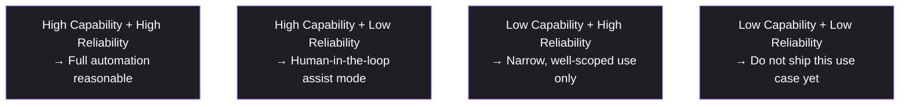

# Lesson 84: PM in AI-Native Companies: New Skills, New Risks

## Why This Lesson Matters

Module 7 gave you the Ownership Zones Model (Lesson 65) for assigning responsibility around a model's output, and the Discovery Frontier (Lesson 66) for reasoning about a recommender's explore/exploit balance. Lesson 81 established that some automated decisions legally require a human in the loop, and Lesson 82 established that data handling must be minimized and purpose-limited. An AI-native company — one whose core product is built around large generative models rather than using a model as one feature among many — inherits every one of these concerns simultaneously, and adds a genuinely new one: the model's capability and reliability are not fixed properties you can fully test once and trust forever. They shift with every model update, every prompt change, and every new edge case a large, open-ended user base discovers.

A PM new to AI-native product work tends to treat a generative model the way they'd treat any other software dependency: build it, test it, ship it, move on. This instinct fails because a generative model doesn't produce a fixed, enumerable set of outputs the way traditional software does — it produces a probability distribution over an effectively unbounded output space, meaning "testing it" can never mean the same thing "testing it" means for deterministic software. The central discipline this lesson introduces is refusing to treat model capability as a single number ("is it good enough to ship") and instead asking a two-part question: how *capable* is the model at this specific task, and how *reliably* does it perform at that capability level, since these two properties can diverge sharply and require entirely different product responses.

---

## Learning Path

| Field | Detail |
|---|---|
| **Module** | 9 — Specialized Domains and Synthesis |
| **Current Lesson** | 84 of 90 |
| **Difficulty** | 7 / 10 |
| **Estimated Study Time** | 40 minutes (reading) + 15 minutes (reflection + quiz) |
| **Prerequisites** | Lesson 65 (Ownership Zones Model), Lesson 66 (Discovery Frontier), Lesson 81 (Regulatory Surface Map, human-in-the-loop) |
| **Next Lesson** | Lesson 85 — Responsible AI Product Management |
| **Future Topics Unlocked** | Lesson 85 (Responsible AI Product Management), Lesson 90 (Capstone) — depend on the Capability-Reliability Matrix introduced here |

---

## Learning Objectives

By the end of this lesson, you will be able to:

1. Explain why a generative model's quality cannot be reduced to a single "is it good enough" judgment.
2. Apply the Capability-Reliability Matrix to determine the appropriate product response for a given AI-powered feature.
3. Identify why evaluation ("evals") must be an ongoing practice rather than a one-time pre-launch gate for AI-native products.
4. Explain why per-inference cost economics differ from traditional software's near-zero marginal cost assumption.
5. Evaluate a proposed AI-powered feature for whether its automation level matches its actual position on the Capability-Reliability Matrix.

---

## Prerequisites

This lesson assumes the Ownership Zones Model from Lesson 65, the Discovery Frontier from Lesson 66, and the Regulatory Surface Map's human-in-the-loop concept from Lesson 81, since AI-native product decisions draw on all three simultaneously.

---

## Theory

### Capability Is Not a Single Number

A generative model can be highly *capable* at a task — able, in its best outputs, to perform at a genuinely impressive level — while being unreliable at that same task, meaning its performance varies significantly across similar-seeming inputs, sometimes producing an excellent result and sometimes producing a confidently-stated but wrong one (a "hallucination"). Capability and reliability are distinct properties, and a product decision informed only by capability ("look how good this can be") without accounting for reliability risks shipping a feature that performs impressively in a demo and unpredictably in production.

### The Capability-Reliability Matrix

This lesson introduces the **Capability-Reliability Matrix**:

A task landing in quadrant A can reasonably be fully automated. A task in quadrant B — the most common position for many current generative use cases — calls for keeping a human explicitly in the loop, per the Ownership Zones Model's Zone 4 discipline and, in regulated contexts, per Lesson 81's legal human-in-the-loop requirements. Quadrant D should not ship at all for that specific use case, regardless of how compelling a demo made it look.

### Evals as an Ongoing Practice

**Evals** — structured evaluation suites measuring a model's performance on representative tasks — must be run continuously, not once before launch, because model behavior shifts with every underlying model version update and every prompt or system change, directly echoing the Metric Provenance Chain's insistence (Lesson 64) that a metric must be continuously validated, not validated once and trusted forever.

### Per-Inference Cost Economics

Unlike most software, where serving one more user costs almost nothing, generative AI features carry a genuine, often significant per-inference cost that scales directly with usage — a cost structure a PM must model explicitly, since a feature can be capable, reliable, and popular, and still be a poor product decision if its unit economics don't work at scale.

### Why AI Products Break Traditional QA Assumptions

Traditional software QA rests on a quiet assumption that most PMs never have to state explicitly: a given input, run through a given version of the code, produces the same output every time. This determinism is what makes a fixed test suite meaningful — if a test passes today, it will pass tomorrow unless the code changes. Generative models violate this assumption at the root. The same prompt, run twice against the same model version, can produce two different outputs, and a test suite that passed cleanly last week can begin failing this week with no code change at all, purely because the underlying model provider shipped a silent update, or because the specific inputs users send have drifted from the inputs the team originally tested against. This means a PM cannot treat "we have a test suite and it's green" as evidence of ongoing quality the way they could for deterministic software — the test suite itself must be re-run continuously against production-representative inputs, and its results must be watched for drift, not just checked once at a release gate. This is the deeper reason evals function differently from unit tests, and why an AI-native PM's mental model of "quality assurance" has to be rebuilt rather than simply carried over from prior software experience.

---

## Common Beginner Mistakes

**Mistake 1: Treating "the model is impressive in a demo" as sufficient evidence to ship at full automation**

A demo showcases a model's best-case behavior, often on inputs the team implicitly selected because the model handles them well. Demos showcase capability, not reliability across the full range of real inputs a production system will actually encounter, including edge cases and phrasing the team never thought to try. A PM who greenlights full automation based on a demo alone is confusing "this can be impressive" with "this will be dependably correct" — the two separate axes the Capability-Reliability Matrix is built to keep apart.

**Mistake 2: Running evals once before launch and treating the model as permanently validated**

Model updates and prompt changes require continuous re-evaluation, because a green eval result today says nothing about tomorrow's underlying model version, upstream provider update, or drift in the inputs users actually send. Treating a passed eval suite as a permanent credential, rather than a snapshot that expires the moment anything upstream changes, is precisely the deterministic-software assumption this lesson argues generative AI breaks. An eval suite for an AI feature has to be re-run against production-representative inputs on an ongoing basis, not checked once at a release gate and set aside.

**Mistake 3: Ignoring per-inference cost until scale reveals it as a problem**

Unlike most traditional software, where serving one additional user costs almost nothing, a generative AI feature carries a real per-inference cost that scales directly with usage. Unit economics should be modeled before launch, not discovered after, because a feature that is capable, reliable, and genuinely popular can still turn out to be a poor product decision if its cost per use erodes or exceeds the value it creates at scale. Waiting until a feature has already succeeded to check whether it can afford to keep succeeding is a needlessly expensive way to learn this.

**Mistake 4: Confusing a model's stated confidence with actual reliability**

A hallucinated answer is frequently delivered with the same fluent, confident tone as a correct one, so a model's apparent certainty is not evidence of its actual accuracy. Teams that read fluency as a reliability signal, rather than measuring actual correctness against representative test cases, can badly overestimate how trustworthy a feature is in production. This is one reason the Capability-Reliability Matrix insists on separately verified reliability data rather than an impression formed from how the output reads.

**Mistake 5: Treating a feature's Capability-Reliability Matrix quadrant as permanent**

A quadrant A classification at launch can silently drift toward quadrant B as usage diversifies or the underlying model changes, which is why the classification needs periodic re-verification, not a single pre-launch determination. A feature that earned full automation under an initial, narrow set of use cases can become unreliable as real users push it into scenarios the original evaluation never covered. Re-checking a feature's quadrant on a recurring cadence, not just at launch, is what keeps the automation decision matched to the feature's actual current reliability.
---

## Mental Model: The Capability-Reliability Matrix

Apply it by asking: (1) How capable is the model at this specific task? (2) How reliably does it perform at that level across representative real inputs, not just demo inputs? (3) Does the current automation level match the quadrant, or does launch pressure push toward more automation than reliability supports?

---

## Real Company Example

**OpenAI's own published "system cards"** make its staged evaluation process directly inspectable, not just described in general terms. The GPT-4o system card, published by OpenAI itself, documents specifics: more than 100 external red teamers, spanning 45 languages and 29 countries, tested successive model checkpoints across four distinct phases between March and June 2024 — starting with early, less-capable checkpoints tested via an internal tool, and ending with the model tested through the actual production iOS app experience real users would encounter. Each phase deliberately expanded both the model's capability (audio-only, then audio-plus-image, then full multimodal) and the red teamers' access, evaluating categories spanning disallowed content, misinformation, bias, fraudulent impersonation, and copyright — with insights from earlier phases directly informing quantitative evaluations and mitigations built before the next phase began. OpenAI states this process operates under a broader "Preparedness Framework," which defines specific risk thresholds and evaluation criteria across misuse categories like cybersecurity and CBRN before a model is judged ready for deployment.

This staged structure is a direct, company-documented illustration of this lesson's evals-as-ongoing-practice argument: capability and reliability are evaluated as two genuinely separate questions across every phase (what can the model newly do, and can it be trusted to do it safely), rather than a single pre-launch check treated as sufficient once passed. Worth noting honestly, though, since it complicates a purely admiring account: independent commentary — including discussion on LessWrong following GPT-4o's release — has raised concerns that evaluation timelines for major releases can come under real commercial pressure to compress, and OpenAI's own Preparedness team saw leadership turnover around this period. The existence of a rigorous, documented framework doesn't by itself guarantee the framework is followed with equal rigor under every competitive and timeline pressure — a genuinely important caution for a PM shipping AI capabilities under real deadline pressure of their own.

*(Source: OpenAI's own published GPT-4o system card and Preparedness Framework documentation, corroborated by independent reporting on the evaluation process's external red-teaming structure.)*

---

## Real World Perspective: PM in AI-Native Companies: New Skills, New Risks at Different Company Stages

**At a startup:** Early AI-native startups often ship quadrant B use cases (high capability, imperfect reliability) at full automation under intense competitive pressure to demonstrate a magical, hands-off experience to investors and early users. Small teams frequently lack the dedicated headcount to build a continuous eval pipeline in parallel with feature development, so evaluation is often treated as a one-time pre-launch check performed by whoever is available, rather than an ongoing discipline. This is a specific and common early-stage mistake, and it is also where the cost of getting it wrong is highest relative to the company's resources — a single high-profile hallucination incident can disproportionately damage a young company's credibility before it has built a reputation to absorb the hit.

**At a mid-size company:** This is typically the stage where formal, continuous eval infrastructure first becomes a genuine organizational priority, usually prompted by a specific incident — a customer-facing hallucination, a costly automated error, or a near-miss caught internally — rather than being built proactively in advance. Mid-size AI-native companies often staff a small, dedicated "model quality" or "AI safety" function at this stage, distinct from general QA, specifically because the continuous, statistical nature of eval work doesn't fit cleanly into a traditional QA team's pass/fail testing habits.

**At Big Tech:** Large AI-native organizations typically maintain dedicated eval, red-teaming, and model-monitoring functions that run continuously against every model version change and every significant prompt or system update, often with formal sign-off gates before a change can reach production. At this scale, the cost of a Capability-Reliability Matrix misclassification is amplified by sheer user volume, so these organizations tend to invest heavily in automated, statistically rigorous eval pipelines rather than relying on manual spot-checks, and often maintain dedicated red-teaming staff whose explicit job is to actively search for failure modes before real users find them.

---

## Detailed Case Study: The Automated Refund Assistant

A company shipped a fully-automated AI customer support agent authorized to approve refunds up to a moderate dollar threshold with no human review, based on strong demo performance. In production, the model occasionally hallucinated policy terms that didn't exist, approving refunds it should have denied and, in rarer cases, confidently citing a non-existent policy to deny a legitimate refund. The task was clearly quadrant B — high capability, meaningfully imperfect reliability — but was shipped as if it were quadrant A.

**What went wrong?** Capability was mistaken for reliability, and full automation was applied to a task that, per the Ownership Zones Model and Lesson 81's human-in-the-loop discipline, required a human review step given the financial stakes involved. The team's pre-launch evaluation process had genuinely tested the model against a representative set of common refund scenarios, and the model had performed well — but "performed well on a representative test set" and "will perform reliably across the full, open-ended range of real customer messages, including ones that reference policies that don't exist" turned out to be two different claims. The team had implicitly treated a passing eval run as equivalent to a passing traditional software test — a one-time gate rather than an ongoing signal — which meant the specific hallucination pattern that eventually caused customer harm was never caught before it reached production, because it simply hadn't appeared in the original test set.

The recovery involved adding human review for any refund above a small threshold, and instituting continuous evals specifically tracking hallucination rate on refund-policy questions, sampled from real production traffic rather than the original curated test set. Notably, the company also discovered that a meaningful share of the hallucinated policy citations followed a specific pattern — the model would fabricate exception clauses when a customer's message combined two unrelated complaints in a single request — which only became visible once the team began analyzing real failure cases rather than relying on aggregate pass rates alone.

1. What specific assumption caused the team to treat their pre-launch eval results as sufficient evidence for full automation?
2. If you were rebuilding this feature's launch plan from scratch, at what refund dollar threshold would you require human review, and what evidence would you want before raising that threshold over time?

---

## Framework Explanation: The AI Product Readiness Checklist

| Checklist Item | Question | Risk if Skipped |
|---|---|---|
| Capability vs. Reliability Assessed Separately | Has reliability been measured across representative inputs, not just demo cases? | Quadrant B mistaken for quadrant A |
| Continuous Evals in Place | Does evaluation run on every model/prompt change, not just pre-launch? | Silent quality drift goes undetected |
| Human-in-the-Loop Matched to Stakes | Does automation level match the Ownership Zones and Regulatory Surface requirements for this task? | Costly errors in high-stakes automated decisions |
| Per-Inference Cost Modeled | Is unit economics understood before scale? | Popular feature with unsustainable cost structure |
| Failure Mode Cataloged | Are known hallucination or failure patterns documented and monitored? | Repeat failures go unaddressed |

The checklist is most useful as a pre-launch gate that gets *re-run*, not a document that gets filled out once and archived. A team that revisits it before every meaningful model version bump, prompt change, or significant shift in how the feature is used will catch quadrant drift — a feature that was genuinely quadrant A at launch sliding toward quadrant B as usage patterns diversify beyond what the original evals covered — long before a customer-facing incident forces the same discovery the hard way, as happened in the Automated Refund Assistant case above.

---

## Interview Perspective: How Interviewers Think About This

**Typical question 1: "How would you decide whether to fully automate an AI-powered feature?"**
*What the interviewer is actually evaluating:* Whether you reflexively equate "the model performs well" with "this should be fully automated." A weak answer describes evaluating the model's capability alone. A strong answer explicitly separates capability from reliability, describes how you'd gather evidence on both across representative real inputs, and explains that the answer determines the Capability-Reliability Matrix quadrant — and therefore the appropriate level of human involvement — rather than assuming a capable model should always run unsupervised.

**Typical question 2: "Why can't you evaluate a generative model once and trust it forever?"**
*What the interviewer is actually evaluating:* Whether you understand that model behavior is not fixed the way traditional software behavior is. A weak answer treats a pre-launch test suite as sufficient, the same way it would be for deterministic code. A strong answer explains that model providers ship updates outside your control, that prompt and system changes can shift behavior in subtle ways, and that real-world input distributions drift over time — all of which require evals to run as an ongoing, monitored practice rather than a one-time release gate.

**Typical question 3: "What's the risk of shipping an impressive demo feature at full automation?"**
*What the interviewer is actually evaluating:* Direct pattern-matching to the Automated Refund Assistant failure mode described in this lesson's Case Study. They want to see that you recognize demos are curated, low-variance showcases of capability, not evidence of reliability across the full, messy range of real production inputs, and that you would insist on reliability evidence — not just an impressive demo — before removing a human from a consequential decision loop.

---

## Summary

AI-native product work requires distinguishing a model's capability from its reliability, since these diverge and demand genuinely different product responses: full automation only where both are high, human-in-the-loop assistance where capability is high but reliability is not, and no shipment at all where capability itself is insufficient. Evals must run continuously, not once, and per-inference cost must be modeled explicitly given generative AI's departure from near-zero marginal cost software economics. Underlying all of this is a more fundamental shift in mindset: traditional software QA assumes deterministic, stable behavior that, once verified, stays verified until the code changes deliberately. Generative AI products don't offer that guarantee — model providers ship changes outside your direct control, real-world inputs drift over time, and a feature's position on the Capability-Reliability Matrix can move without any deliberate product decision at all. Treating quadrant classification, like evals, as an ongoing discipline rather than a one-time gate is the single habit that most reliably separates AI-native teams that catch problems early from those that discover them through a customer-facing incident.

---

## Key Takeaways

- Capability and reliability are distinct properties requiring separate assessment.
- The Capability-Reliability Matrix determines appropriate automation level by quadrant.
- Evals must be continuous, not a one-time pre-launch gate.
- Per-inference cost economics differ fundamentally from traditional software.
- Demo performance reflects capability, not reliability across real inputs.
- Quadrant B tasks require human-in-the-loop, connecting directly to Lesson 65 and Lesson 81.
- Model confidence is not evidence of correctness; hallucinations are delivered fluently.

---

## Cheat Sheet

*A two-minute review of everything in this lesson.*

- Capability ≠ reliability. Assess both separately.
- Matrix: high/high = automate. high/low = human-in-loop. low/anything = don't ship yet.
- Evals are continuous, not one-time — model behavior isn't deterministic the way traditional software is.
- Model unit economics before scale.
- A passing eval run is a snapshot, not a permanent guarantee — re-run the AI Product Readiness Checklist on every meaningful model or prompt change.
- Demo performance shows curated capability, not production reliability. Never conflate the two when deciding automation level.

---

## Glossary

| Term | Definition | Related Concepts | Difficulty |
|---|---|---|---|
| Capability-Reliability Matrix | Model for matching AI automation level to capability and reliability | Ownership Zones Model | 2 |
| Evals | Structured, ongoing evaluation suites for model performance | Metric Provenance Chain | 2 |
| Hallucination | A confidently-stated but incorrect model output | Reliability | 1 |
| Per-Inference Cost | The marginal cost of serving one AI model request | Unit Economics | 1 |
| Quadrant Drift | A feature's actual capability/reliability position shifting over time as usage patterns, model versions, or prompts change, even without a deliberate product change | Capability-Reliability Matrix, Evals | 3 |
| Red-Teaming | The practice of deliberately probing a model for failure modes before real users encounter them | Evals, Capability-Reliability Matrix | 2 |

---

## Further Reading / Resources

- Stuart Russell, *Human Compatible*
- Brian Christian, *The Alignment Problem*
- Anthropic's and OpenAI's published model system cards

---

## Flashcards

**Card 1**
- Front: Why can't model quality be reduced to a single number?
- Back: Capability and reliability are distinct and can diverge sharply, requiring different product responses.
- Difficulty: 2
- Tags: ai-native

**Card 2**
- Front: What does the high-capability/low-reliability quadrant call for?
- Back: Human-in-the-loop assist mode, not full automation.
- Difficulty: 2
- Tags: capability-reliability-matrix

**Card 3**
- Front: Why must evals run continuously?
- Back: Model and prompt changes shift behavior, so pre-launch evaluation alone doesn't guarantee ongoing quality.
- Difficulty: 2
- Tags: evals

**Card 4**
- Front: What went wrong in the Automated Refund Assistant case study?
- Back: A quadrant-B task (high capability, imperfect reliability) was shipped at full automation with no human review, leading to hallucination-driven refund errors.
- Difficulty: 2
- Tags: case-study

**Card 5**
- Front: Why do traditional QA assumptions break down for generative AI products?
- Back: Traditional QA assumes deterministic behavior — same input, same output, forever, unless the code changes. Generative models can produce different outputs for the same input, and behavior can shift with silent provider-side updates, so a passing test suite doesn't guarantee ongoing quality the way it does for deterministic software.
- Difficulty: 2
- Tags: qa, evals

**Card 6**
- Front: What is "quadrant drift" and why does it matter?
- Back: A feature's real capability/reliability position shifting over time — even without any deliberate product change — as usage patterns diversify or the underlying model updates. It matters because a feature correctly classified as quadrant A at launch can silently become quadrant B, which is why the AI Product Readiness Checklist should be re-run periodically, not filled out once.
- Difficulty: 2
- Tags: capability-reliability-matrix, evals

## Reflection Exercise

You are the PM for an AI-powered legal document summarization tool being considered for full automation with no attorney review.

There is no single correct answer. Work through the following before reading further.

1. Using the Capability-Reliability Matrix, what quadrant would you want evidence for before considering full automation?
2. What would a continuous eval process look like for this specific task?
3. What human-in-the-loop requirement might apply, drawing on Lesson 81?
4. How would you model per-inference cost at scale?
5. What failure modes would you specifically want cataloged?

---

## Quiz

**1. Why can't a generative model's quality be reduced to a single "good enough" judgment?**
A) Models never actually vary in performance
B) Capability and reliability are distinct properties that can diverge sharply
C) All models perform identically regardless of task
D) Quality is irrelevant to AI product decisions

*Correct answer: B*
*Explanation: Capability (how good the model can be) and reliability (how consistently it performs) are separate properties that can diverge, so a single rating misses the reliability dimension entirely.*
*Learning objective tested: #1*
*Difficulty: Easy*

---

**2. What does the Capability-Reliability Matrix recommend for high capability, low reliability tasks?**
A) Full automation
B) Human-in-the-loop assist mode
C) Immediate cancellation of the feature
D) No monitoring is needed

*Correct answer: B*
*Explanation: The matrix prescribes human-in-the-loop assist mode for quadrant B (high capability, low reliability), keeping a human explicitly in the loop rather than automating fully.*
*Learning objective tested: #2*
*Difficulty: Easy*

---

**3. Why must evals run continuously rather than once?**
A) Models never change after launch
B) Model and prompt updates shift behavior, requiring ongoing re-evaluation
C) Continuous evals are legally required in all jurisdictions
D) One-time evals are always sufficient

*Correct answer: B*
*Explanation: Model and prompt changes shift behavior over time, so a one-time pre-launch evaluation cannot guarantee ongoing quality — continuous re-evaluation is required.*
*Learning objective tested: #3*
*Difficulty: Easy*

---

**4. Why does per-inference cost matter for AI-native products?**
A) It never actually affects business viability
B) Generative AI features carry real, scaling marginal costs unlike most traditional software
C) Per-inference cost is identical across all AI providers
D) Cost only matters for hardware products

*Correct answer: B*
*Explanation: Unlike traditional software with near-zero marginal cost, each generative AI inference carries a real cost that scales directly with usage, which can make a popular feature economically unsustainable.*
*Learning objective tested: #4*
*Difficulty: Easy*

---

**5. What was the root cause of the Automated Refund Assistant case study's failure?**
A) The model had no capability at the task at all
B) A quadrant-B task was shipped at full automation without human review
C) The company never tested the model at all
D) The refund threshold was set too low

*Correct answer: B*
*Explanation: The refund assistant was a quadrant B task (high capability, imperfect reliability) but was shipped at full automation without human review, leading to hallucination-driven errors.*
*Learning objective tested: #2, #5*
*Difficulty: Easy*

---

**6. Why is a model's confident tone not evidence of correctness?**
A) Models never sound confident
B) Hallucinated outputs are frequently delivered with the same fluency as correct ones
C) Confidence is always a reliable indicator of accuracy
D) This is not actually a concern in practice

*Correct answer: B*
*Explanation: Hallucinated outputs are delivered with the same fluent confidence as correct ones, so a model's tone provides no signal about whether the output is actually accurate.*
*Learning objective tested: #1, #5*
*Difficulty: Easy*

---

**7. What connects quadrant-B automation decisions to Lesson 65?**
A) No connection exists
B) The Ownership Zones Model's Zone 4 discipline requires human review of model outputs before action, which quadrant B tasks specifically need
C) Lesson 65 only applies to recommender systems
D) Ownership Zones only applies to hardware products

*Correct answer: B*
*Explanation: The Ownership Zones Model's Zone 4 requires human review of model outputs before action, which is exactly what quadrant B (high capability, low reliability) tasks demand.*
*Learning objective tested: #2, #5*
*Difficulty: Medium*

---

**8. What should happen for a task in the low-capability quadrant regardless of reliability?**
A) Full automation should proceed anyway
B) The use case should not ship yet
C) Human review is unnecessary
D) Cost modeling is irrelevant

*Correct answer: B*
*Explanation: If capability itself is insufficient (low capability), the use case should not ship regardless of how reliable the model is at that low level of performance.*
*Learning objective tested: #2*
*Difficulty: Medium*

---

**9. Why is demo performance an unreliable indicator of production reliability?**
A) Demos are always representative of all real-world inputs
B) Demos showcase capability under curated conditions, not reliability across the full range of real inputs
C) Demos never actually use the real model
D) There is no meaningful difference between demos and production use

*Correct answer: B*
*Explanation: Demos showcase capability under curated, favorable conditions, but production use involves a much broader range of inputs where reliability may be significantly lower.*
*Learning objective tested: #1, #5*
*Difficulty: Medium*

---

**10. What is a recommended recovery step from the Automated Refund Assistant case study?**
A) Removing all human oversight entirely
B) Adding human review above a threshold and instituting continuous evals for hallucination rate
C) Shutting down the support feature entirely
D) Increasing the refund threshold without any other changes

*Correct answer: B*
*Explanation: Adding human review above a threshold and instituting continuous evals tracking hallucination rate directly addresses the quadrant B mismatch and enables ongoing quality monitoring.*
*Learning objective tested: #3, #5*
*Difficulty: Medium*

---

**11. (Scenario) A model performs excellently in curated demo tests but shows inconsistent quality on a broader eval set. What does this indicate?**
A) The feature is definitely quadrant A and ready for full automation
B) A likely quadrant-B position — high capability, lower reliability — requiring human-in-the-loop consideration
C) The eval set is flawed and should be ignored
D) No further action is needed

*Correct answer: B*
*Explanation: Excellent demo performance but inconsistent quality on a broader eval set indicates high capability with lower reliability — a quadrant B position requiring human-in-the-loop consideration.*
*Learning objective tested: #2, #5*
*Difficulty: Medium-Hard*

---

**12. (Product Thinking) A team wants to skip ongoing evals after a successful launch. What is the strongest response?**
A) Agree, since pre-launch evals are always sufficient
B) Explain that model and prompt changes require continuous re-evaluation to catch silent quality drift
C) Cancel the feature entirely
D) Increase automation instead of adding evals

*Correct answer: B*
*Explanation: Model and prompt changes shift behavior over time, so stopping evals after launch risks silent quality drift going undetected in production.*
*Learning objective tested: #3, #5*
*Difficulty: Medium-Hard*

---

**13. (Interview Reasoning) A candidate says a model is "good enough to ship" based solely on demo results. What does this signal?**
A) Strong understanding of AI product management
B) A gap in distinguishing capability from reliability
C) Readiness for a senior AI PM role immediately
D) Nothing meaningful

*Correct answer: B*
*Explanation: Judging a model as "good enough" based solely on demo results conflates capability with reliability, revealing a gap in understanding that these are distinct properties requiring separate assessment.*
*Learning objective tested: #1, #5*
*Difficulty: Hard*

---

**14. (Product Thinking) A high-stakes automated decision has never had its per-inference cost modeled. What risk does this create?**
A) No risk; cost is irrelevant to product decisions
B) A popular feature could prove economically unsustainable at scale
C) This only matters for low-stakes features
D) Cost modeling is only relevant post-shutdown

*Correct answer: B*
*Explanation: Without modeling per-inference cost before launch, a feature can become popular and widespread while its unit economics prove unsustainable at scale.*
*Learning objective tested: #4, #5*
*Difficulty: Hard*

---

**15. (Product Thinking, Highest Difficulty) A financial AI assistant shows high capability but inconsistent reliability on edge cases, and leadership wants full automation to compete on speed. What is the most defensible response?**
A) Proceed with full automation to match competitor speed
B) Classify the task's quadrant honestly, implement human-in-the-loop review matched to actual reliability evidence, and continue eval-driven improvement before considering further automation
C) Cancel the feature entirely
D) Automate only the easiest cases with no broader evaluation

*Correct answer: B*
*Explanation: The defensible response is honest quadrant classification, human-in-the-loop review matched to actual reliability evidence, and continued eval-driven improvement — resisting launch pressure to over-automate.*
*Learning objective tested: #2, #3, #5*
*Difficulty: Hard*

---

## Connections

| | Lesson | Core Idea Carried Forward |
|---|---|---|
| **Previous Lesson** | Lesson 83 — Hardware and Physical Products | Shifts from physical irreversibility to AI-specific reliability constraints |
| **Current Lesson** | Lesson 84 — PM in AI-Native Companies | Capability-Reliability Matrix; continuous evals; per-inference economics |
| **Next Lesson** | Lesson 85 — Responsible AI Product Management | Extends reliability and human-in-the-loop discipline into fairness and harm considerations |
| **Future Concepts Unlocked** | Lesson 90 (Capstone) | Treats the Capability-Reliability Matrix as established canon |

This curriculum continues to build as one continuous argument. This lesson resolves the open thread from Lessons 65, 66, and 81 regarding model-driven decision risk, now applied specifically to generative AI.
