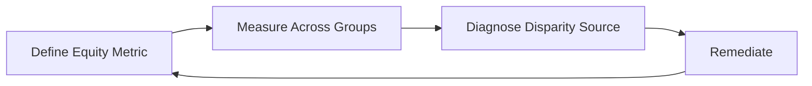

# Lesson 85: Responsible AI Product Management

## Why This Lesson Matters

Lesson 81 established the Outcome Layer of regulatory constraint: a well-documented process can still produce an impermissible, discriminatory result. Lesson 84 established that a generative model's capability and reliability must be assessed separately before deciding how much to automate. This lesson combines both threads into a specific, ongoing discipline: responsible AI product management, the practice of continuously verifying that an AI system's actual outcomes are fair and accountable across the different populations it affects, rather than assuming fairness follows automatically from technical accuracy or good intentions.

A model can be highly accurate in aggregate while producing systematically worse outcomes for a specific subgroup, a pattern invisible unless someone deliberately measures outcomes by group rather than trusting an overall accuracy number. This is not a hypothetical concern; it is one of the most well-documented and recurring failure patterns in applied machine learning, and it recurs specifically because aggregate metrics, by construction, can mask exactly this kind of disparity. Responsible AI product management treats this disparity risk as something requiring active, ongoing measurement — not a one-time audit, but a continuous practice, echoing the same "ongoing, not one-time" discipline Lesson 84 established for evals generally.

---

## Learning Path

| Field | Detail |
|---|---|
| **Module** | 9 — Specialized Domains and Synthesis |
| **Current Lesson** | 85 of 90 |
| **Difficulty** | 7 / 10 |
| **Estimated Study Time** | 40 minutes (reading) + 15 minutes (reflection + quiz) |
| **Prerequisites** | Lesson 81 (Outcome Layer), Lesson 84 (Capability-Reliability Matrix, continuous evals), Lesson 67 (Escalation Staircase, appeals) |
| **Next Lesson** | Lesson 86 — Scaling International Products: Beyond Localization |
| **Future Topics Unlocked** | Lesson 90 (Capstone) — draws on the Fairness Audit Loop as established canon |

---

## Learning Objectives

By the end of this lesson, you will be able to:

1. Explain why aggregate accuracy metrics can mask systematic disparity across subgroups.
2. Apply the Fairness Audit Loop to continuously measure and address disparate outcomes.
3. Identify the role of transparency, explainability, and appeal mechanisms in responsible AI deployment.
4. Explain why disparity remediation must investigate root cause, not just adjust the output.
5. Evaluate an AI product for whether its fairness practices are a one-time check or a genuine ongoing loop.

---

## Prerequisites

This lesson assumes the Regulatory Surface Map's Outcome Layer from Lesson 81, the continuous-evals discipline from Lesson 84, and the appeals-process requirement from the Escalation Staircase in Lesson 67.

---

## Theory

### Why Aggregate Accuracy Can Mask Disparity

A model can achieve 95% overall accuracy while performing at 99% accuracy for one group and 70% for another, and the aggregate number alone would never reveal this. This is the same base-rate and aggregation risk introduced in Lesson 65's discussion of accuracy on imbalanced classes, now applied specifically to demographic or protected-group disparity rather than class imbalance. The arithmetic reason this happens is straightforward once stated: if one group makes up 90% of the training data and the model performs well on that majority group, the aggregate accuracy figure will be dominated by that majority group's performance almost regardless of how poorly the model does on the remaining 10%. A team that only ever looks at the single headline accuracy number has, in effect, built a measurement system that is structurally blind to exactly the kind of harm a smaller or underrepresented group is most likely to experience — which is precisely why subgroup measurement cannot be treated as an optional, nice-to-have addition to standard model evaluation.

### The Fairness Audit Loop

This lesson introduces the **Fairness Audit Loop**:

The loop's discipline is that it never terminates — remediation feeds back into re-measurement, since a fix applied once can itself introduce a new disparity elsewhere, or can decay as data and usage patterns shift over time.

### Root Cause vs. Output Adjustment

A superficial fix — adjusting a model's output thresholds differently by group after the fact — can mask rather than resolve the underlying issue, and can itself introduce new legal and ethical complications. Genuine remediation investigates whether the disparity traces to biased training data, a proxy variable correlated with a protected characteristic, or a genuine difference in the underlying task that requires a different solution entirely.

### Transparency, Explainability, and Recourse

Responsible AI deployment requires that affected individuals can understand, at some level, why a decision was made, and have a genuine path to contest it — directly connecting to the Escalation Staircase's appeals requirement from Lesson 67, now applied specifically to AI-driven decisions.

### Why "Fair" Is Not a Single, Agreed-Upon Definition

A specific complication that trips up even well-intentioned teams: there is no single, universally agreed mathematical definition of fairness, and several reasonable-sounding definitions can be mutually incompatible with each other for the same decision. A model can achieve *equal approval rates* across groups (demographic parity) while still producing *unequal error rates* within those groups (unequal false-positive or false-negative rates), and it is mathematically impossible, in most realistic cases, to satisfy both definitions simultaneously if the underlying base rates differ across groups. This means a PM cannot simply instruct a team to "make the model fair" and expect a single unambiguous target — the team must first make an explicit, documented choice about which fairness definition is appropriate for the specific decision at hand (a lending decision, a hiring screen, a content-moderation call), and that choice itself deserves the same scrutiny and stakeholder input as any other significant product decision, since different definitions can be more or less appropriate depending on the real-world consequences of false positives versus false negatives for the specific population affected.

---

## Common Beginner Mistakes

1. **Trusting an aggregate accuracy number without measuring outcomes by subgroup.**
2. **Treating a fairness audit as a one-time pre-launch check rather than a continuous loop.**
3. **Adjusting output thresholds by group as a superficial fix without diagnosing root cause.**
4. **Failing to provide a genuine appeal mechanism for AI-driven decisions, per Lesson 67's structural requirement.**
5. **Assuming removing a protected characteristic from model inputs eliminates disparity risk, ignoring proxy variables.**
6. **Assuming a single, universally correct mathematical definition of fairness exists.** Several reasonable fairness definitions can be mutually incompatible for the same decision, and the appropriate one must be explicitly chosen based on the real-world consequences of errors for the affected population, not assumed by default.

---

## Mental Model: The Fairness Audit Loop

Ask continuously: (1) What equity metric matters for this specific decision? (2) Is it measured separately by relevant group, not just in aggregate? (3) If disparity exists, has its root cause been diagnosed rather than superficially patched? (4) Does remediation feed back into ongoing re-measurement?

---

## Real Company Example

IBM's publicized AI Fairness 360 toolkit and broader responsible AI research initiatives illustrate continuous, subgroup-specific fairness measurement as an industry practice rather than a one-time compliance check.

**Assumption flagged:** specifics of IBM's internal practices are drawn from public commentary, not confirmed internal statements.

---

## Real World Perspective

**At a startup:** Early-stage AI products often skip subgroup measurement entirely, not out of indifference but because small user bases genuinely make some subgroup samples too small to draw statistically meaningful conclusions from, and limited engineering resources are typically prioritized toward core product functionality rather than fairness infrastructure. This is a real and understandable tradeoff at very small scale, but it is a risk that compounds silently as the product scales — a disparity that was statistically invisible at 500 users can become a serious, measurable, and legally consequential pattern at 500,000 users, and teams that never built the measurement habit early often discover the problem only once it is large enough to cause visible harm.

**At a mid-size company:** This is typically the stage where disparate impact first becomes both statistically measurable (the user base is large enough for subgroup analysis to be meaningful) and organizationally consequential (the company has enough at stake — reputation, revenue, potential legal exposure — that a discovered disparity demands a real response rather than a shrug). Mid-size companies operating AI-driven decisions at this stage often face a genuine resourcing tension between building fairness infrastructure and continuing to ship new capability, and how that tension gets resolved is frequently where a company's actual values, as opposed to its stated values, become visible.

**At Big Tech:** Large organizations typically maintain dedicated responsible AI or algorithmic fairness teams that run the Fairness Audit Loop continuously across many models and product surfaces simultaneously, often with formal review gates that a new AI-driven decision feature must pass before launch. At this scale, disparities that would be statistically invisible in a smaller population become both detectable and, given the sheer number of people affected, high-stakes — a one-percentage-point disparity in approval rates across a protected group can translate into thousands of individually affected people, which is part of why large organizations tend to invest heavily in this infrastructure well beyond what regulation strictly requires.

---

## Detailed Case Study: The Biased Hiring Screener

A company deployed an AI resume-screening tool trained on historical hiring data, achieving strong aggregate accuracy at predicting which candidates the company had historically hired. A later audit revealed the tool systematically down-ranked candidates from certain universities and with employment gaps, patterns that correlated strongly with gender and disability status, because the historical training data reflected the company's own past biased hiring patterns.

**What went wrong?** Aggregate accuracy masked the disparity; the fairness measurement had been a one-time pre-launch check rather than an ongoing loop; and the root cause — biased historical training data — was never diagnosed, only the symptom (screening scores) was superficially reviewed. The team had, in good faith, excluded gender and disability status directly from the model's inputs, believing this was sufficient to prevent discriminatory outcomes. It was not: university attended and employment gaps functioned as proxy variables, correlated with the excluded characteristics closely enough that the model reconstructed much of the same discriminatory pattern indirectly, without ever seeing the protected attributes explicitly. This is precisely the proxy-variable risk this lesson's Theory section describes, and it is a specific reason "we don't use protected characteristics as inputs" is frequently offered as a defense that does not, on its own, establish fairness.

Recovery involved retraining on de-biased data, instituting ongoing subgroup measurement across the specific dimensions the original audit had missed, and adding a human review and appeal step for any rejected candidate, connecting directly to Lesson 67's appeals discipline. The company also instituted a policy requiring any new proxy variable candidate — a data field newly added to the model's inputs — to be explicitly checked for correlation with protected characteristics before being approved for use, closing the specific gap that had allowed university and employment-gap data to enter the model unexamined in the first place.

1. What specific defense did the team offer that turned out to be insufficient, and why did it fail?
2. If you were designing the ongoing subgroup measurement process from scratch, what data would you need that the original team apparently didn't collect or examine?

---

## Framework Explanation: The Responsible AI Deployment Checklist

| Item | Question | Risk if Skipped |
|---|---|---|
| Subgroup Measurement | Is outcome measured separately by relevant group, not just in aggregate? | Disparity remains invisible |
| Root Cause Diagnosis | Has disparity been traced to its source, not just its symptom? | Superficial fixes mask the real problem |
| Appeal Mechanism | Can an affected individual contest a decision, per Lesson 67? | No recourse for wrongly harmed individuals |
| Ongoing Re-Measurement | Does the loop continue after initial remediation? | Fixes decay or introduce new disparities unnoticed |
| Misuse Potential Assessed | Has potential for harmful misuse been considered? | Foreseeable harms go unaddressed |

As with the AI Product Readiness Checklist introduced in Lesson 84, this checklist earns its value from repetition, not from a single completion. A team should explicitly revisit it whenever the underlying training data is refreshed, whenever the model architecture or feature set changes, and on a fixed recurring cadence even absent any specific trigger — since, as the Biased Hiring Screener case study illustrates, disparity can be present from day one and simply go undetected until someone deliberately looks for it at the subgroup level.

---

## Interview Perspective: How Interviewers Think About This

**Typical question 1: "How would you check whether an AI system is fair?"**
*What the interviewer is actually evaluating:* Whether you default to aggregate metrics or immediately think in terms of subgroup measurement. A weak answer describes checking overall accuracy or user satisfaction. A strong answer explains that fairness has to be measured by relevant subgroup specifically, names that there are multiple, sometimes incompatible, mathematical definitions of fairness, and describes how the appropriate definition depends on the specific decision's real-world consequences.

**Typical question 2: "Why might fixing a disparity by adjusting output thresholds be insufficient?"**
*What the interviewer is actually evaluating:* Whether you distinguish symptom management from root-cause diagnosis. A weak answer treats a threshold adjustment as an adequate fix on its own. A strong answer explains that a superficial adjustment can mask an underlying problem — biased training data, a proxy variable — without resolving it, and can introduce new legal or ethical complications of its own, echoing this lesson's Biased Hiring Screener case study.

**Typical question 3: "What role does an appeal mechanism play in a responsible AI deployment?"**
*What the interviewer is actually evaluating:* Whether you treat recourse as a genuine structural requirement or an afterthought. A strong answer connects this directly to Lesson 67's Escalation Staircase, explaining that any consequential AI-driven decision affecting a real person should carry the same appeal discipline this curriculum established for platform enforcement generally, and that a system without a meaningful appeal path leaves wrongly harmed individuals with no recourse at all.

---

## Summary

Aggregate accuracy metrics can mask significant disparity across subgroups, and responsible AI product management requires the Fairness Audit Loop — defining an equity metric, measuring it by group, diagnosing root cause when disparity appears, and remediating with continuous re-measurement rather than a one-time fix. Genuine remediation traces disparity to its source, whether biased training data or a proxy variable, rather than superficially adjusting outputs, and every AI-driven decision affecting real people deserves the same transparency and appeal mechanism this curriculum's Escalation Staircase established for platform enforcement generally. A final, easily overlooked complication deserves emphasis: fairness itself is not a single, universally agreed target. Different mathematical definitions of fairness can conflict with each other for the same decision, which means responsible AI product management requires an explicit, documented choice about which definition applies — a choice that deserves the same rigor and stakeholder scrutiny as any other consequential product decision, rather than being left implicit or assumed by default.

---

## Key Takeaways

- Aggregate accuracy can mask significant subgroup disparity.
- The Fairness Audit Loop is continuous, not a one-time check.
- Superficial output adjustments mask rather than resolve root causes.
- Appeal mechanisms are a structural requirement for AI-driven decisions, per Lesson 67.
- Removing a protected characteristic from inputs doesn't eliminate proxy-variable risk.
- Disparity can decay or re-emerge over time, requiring ongoing measurement.
- Root cause diagnosis often traces to biased training data, not the model architecture itself.

---

## Cheat Sheet
- Aggregate accuracy hides disparity. Measure by subgroup.
- Fairness Audit Loop: Define → Measure → Diagnose → Remediate → repeat.
- Fix the root cause, not just the symptom.
- Appeals are structural, not optional, per Lesson 67.
- Removing a protected characteristic from inputs doesn't guarantee fairness — check for proxy variables.
- No single definition of "fair" exists. Choose and document the appropriate one explicitly, based on real-world consequences.

---

## Glossary

| Term | Definition | Related Concepts | Difficulty |
|---|---|---|---|
| Fairness Audit Loop | A continuous cycle of measuring, diagnosing, and remediating AI outcome disparity | Outcome Layer (Lesson 81) | 2 |
| Disparate Impact | A pattern where a decision system produces systematically worse outcomes for a protected group | Fairness Audit Loop | 2 |
| Proxy Variable | A seemingly neutral input correlated with a protected characteristic | Root Cause Diagnosis | 2 |
| Demographic Parity | A fairness definition requiring equal approval/positive-outcome rates across groups | Fairness Audit Loop | 3 |
| Equalized Error Rates | A fairness definition requiring equal false-positive and false-negative rates across groups, which can conflict mathematically with demographic parity | Fairness Audit Loop | 3 |

---

## Further Reading / Resources
1. *Weapons of Math Destruction* by Cathy O'Neil
2. *The Alignment Problem* by Brian Christian
3. IBM's published AI Fairness 360 documentation

---

## Flashcards

**Front:** Why can aggregate accuracy mask disparity?
**Back:** A model can perform very differently across subgroups while its overall accuracy number looks acceptable.
**Difficulty:** Easy
**Tags:** #responsible-ai

**Front:** What are the four steps of the Fairness Audit Loop?
**Back:** Define equity metric, measure across groups, diagnose disparity source, remediate — then repeat.
**Difficulty:** Easy
**Tags:** #fairness-audit-loop

**Front:** Why is adjusting output thresholds by group a superficial fix?
**Back:** It doesn't address the root cause, such as biased training data, and can mask or complicate the underlying problem.
**Difficulty:** Medium
**Tags:** #root-cause

**Front:** What went wrong in the Biased Hiring Screener case study?
**Back:** Aggregate accuracy masked disparity traceable to historically biased training data, never diagnosed at its root, with no ongoing measurement or appeal process.
**Difficulty:** Hard
**Tags:** #case-study

**Front:** Why can't a team simply instruct engineers to "make the model fair"?
**Back:** There is no single, universally agreed mathematical definition of fairness — demographic parity and equalized error rates can be mutually incompatible for the same decision, so the team must explicitly choose and document which definition is appropriate given the real-world consequences.
**Difficulty:** Hard
**Tags:** #fairness-definitions

**Front:** In the Biased Hiring Screener case, why was excluding gender and disability status from model inputs not sufficient?
**Back:** University attended and employment gaps functioned as proxy variables correlated with the excluded characteristics, allowing the model to reconstruct much of the same discriminatory pattern indirectly.
**Difficulty:** Hard
**Tags:** #proxy-variable #case-study

---

## Reflection Exercise

You are the PM for an AI-powered loan approval tool with strong aggregate accuracy.

1. What subgroup measurements would you prioritize checking first?
2. If disparity appears, how would you distinguish a training-data cause from a proxy-variable cause?
3. What appeal mechanism would you design for denied applicants?
4. How would you structure ongoing re-measurement after an initial fix?
5. How would you communicate a discovered disparity to leadership without triggering defensive dismissal?

---

## Quiz

**1. Why can aggregate accuracy metrics mask disparity?**
A) Aggregate metrics are always inaccurate
B) A model can perform very differently across subgroups while the overall number looks fine
C) Disparity never actually affects accuracy metrics
D) Aggregate metrics are illegal to use

*Correct answer: B*
*Explanation: A model can achieve high overall accuracy while performing very differently across subgroups, and the aggregate number alone does not reveal this disparity.*
*Learning objective tested: #1*
*Difficulty: Easy*

**2. What are the four steps of the Fairness Audit Loop?**
A) Test, Ship, Monitor, Retire
B) Define equity metric, measure across groups, diagnose disparity source, remediate
C) Collect, Store, Process, Share
D) Concept, Prototype, Pilot, Scale

*Correct answer: B*
*Explanation: The Fairness Audit Loop follows four steps — define equity metric, measure across groups, diagnose disparity source, and remediate — as a structured, repeatable cycle.*
*Learning objective tested: #2*
*Difficulty: Easy*

**3. Why is the Fairness Audit Loop continuous rather than one-time?**
A) Disparity can decay, re-emerge, or shift as data and usage change over time
B) One-time audits are always sufficient
C) Continuous audits are legally unnecessary
D) Fairness never changes once established

*Correct answer: A*
*Explanation: A fix applied once can itself introduce new disparity or decay as data and usage patterns shift, so re-measurement after remediation is essential.*
*Learning objective tested: #2, #5*
*Difficulty: Easy*

**4. Why is adjusting output thresholds by group often an insufficient fix?**
A) It always improves fairness completely
B) It addresses the symptom, not the root cause, such as biased training data
C) Threshold adjustment is illegal in all cases
D) It has no effect on outcomes at all

*Correct answer: B*
*Explanation: Adjusting thresholds is a superficial output patch that does not address the underlying root cause, such as biased training data, and can mask the real problem or introduce new complications.*
*Learning objective tested: #4*
*Difficulty: Easy*

**5. What role does an appeal mechanism play in responsible AI deployment?**
A) It has no meaningful role
B) It provides recourse for individuals affected by a decision, per Lesson 67's structural requirement
C) It replaces the need for any fairness measurement
D) It is only relevant for hardware products

*Correct answer: B*
*Explanation: An appeal mechanism gives affected individuals a genuine path to contest an AI-driven decision, which is a structural requirement established in Lesson 67's Escalation Staircase.*
*Learning objective tested: #3*
*Difficulty: Easy*

**6. What was the root cause of disparity in the Biased Hiring Screener case study?**
A) The model architecture itself was flawed
B) Historical training data reflected the company's own past biased hiring patterns
C) The model was never tested at all
D) The screening tool had no access to any resume data

*Correct answer: B*
*Explanation: The tool was trained on historical hiring data that reflected the company's own past biased patterns, encoding that bias into the model's predictions.*
*Learning objective tested: #1, #4, #5*
*Difficulty: Easy*

**7. Why is removing a protected characteristic from model inputs insufficient to eliminate disparity risk?**
A) Protected characteristics are never actually correlated with other variables
B) Proxy variables correlated with the protected characteristic can still produce disparate outcomes
C) This step always eliminates all disparity risk completely
D) Protected characteristics cannot be removed from any dataset

*Correct answer: B*
*Explanation: Other seemingly neutral variables can be correlated with the protected characteristic, acting as proxy variables that still produce disparate outcomes even when the protected trait is excluded.*
*Learning objective tested: #1, #5*
*Difficulty: Medium*

**8. According to the Responsible AI Deployment Checklist, what does skipping Subgroup Measurement risk?**
A) Nothing significant
B) Disparity remaining invisible despite acceptable aggregate performance
C) Immediate legal action regardless of actual outcomes
D) Guaranteed model failure

*Correct answer: B*
*Explanation: Without measuring outcomes separately by group, disparity can remain completely hidden even when aggregate performance metrics look acceptable.*
*Learning objective tested: #1, #5*
*Difficulty: Medium*

**9. Why might early-stage AI products be especially likely to skip subgroup measurement, per the Real World Perspective section?**
A) Subgroup measurement is legally prohibited for small companies
B) Small user bases and limited resources make this measurement easy to defer, though risk compounds with scale
C) Early-stage products never have any subgroups within their user base
D) This is never actually a concern for early-stage products

*Correct answer: B*
*Explanation: Small user bases and limited resources make subgroup measurement easy to defer at early stages, but this risk compounds as the product scales and disparities become harder to remediate.*
*Learning objective tested: #1*
*Difficulty: Medium*

**10. What do large organizations typically maintain regarding fairness, per the Real World Perspective section?**
A) No formal fairness process
B) Dedicated responsible AI teams running the Fairness Audit Loop continuously
C) A policy of ignoring subgroup disparities
D) Fairness checks only once at company founding

*Correct answer: B*
*Explanation: Large organizations typically maintain dedicated responsible AI teams that run the Fairness Audit Loop continuously across many models, treating fairness as an ongoing practice.*
*Learning objective tested: #5*
*Difficulty: Medium*

**11. (Scenario) A model shows 95% aggregate accuracy but has never been measured by subgroup. What should happen next?**
A) Nothing; 95% accuracy is sufficient evidence of fairness
B) Subgroup measurement should be conducted before concluding the model is fair
C) The model should be immediately shut down without investigation
D) Aggregate accuracy alone is legally sufficient in all jurisdictions

*Correct answer: B*
*Explanation: High aggregate accuracy does not guarantee fairness; subgroup measurement must be conducted before concluding the model is fair, since disparity can hide behind strong overall numbers.*
*Learning objective tested: #1, #2, #5*
*Difficulty: Medium-Hard*

**12. (Product Thinking) A team discovers disparity and proposes simply adjusting output thresholds differently by group. What is the strongest response?**
A) Approve the fix immediately as sufficient
B) Investigate root cause first, since a superficial threshold adjustment may mask rather than resolve the underlying issue
C) Ignore the disparity entirely
D) Remove the feature immediately with no further investigation

*Correct answer: B*
*Explanation: A superficial threshold adjustment masks the real issue; the root cause must be diagnosed first to determine whether it stems from biased data, a proxy variable, or something else entirely.*
*Learning objective tested: #4, #5*
*Difficulty: Medium-Hard*

**13. (Interview Reasoning) A candidate says a model is "fair" because its aggregate accuracy is high, with no mention of subgroup analysis. What does this signal?**
A) A strong and complete understanding of fairness
B) A gap in recognizing that aggregate metrics can mask disparity
C) Readiness for a senior responsible AI role immediately
D) Nothing meaningful

*Correct answer: B*
*Explanation: Claiming fairness based solely on aggregate accuracy without subgroup analysis reveals a gap in understanding that aggregate metrics can systematically mask disparity across populations.*
*Learning objective tested: #1, #5*
*Difficulty: Hard*

**14. (Product Thinking) An AI decision system has no appeal mechanism for affected individuals. What risk does this represent?**
A) No risk; appeal mechanisms are optional in all contexts
B) A structural gap, since affected individuals have no recourse for a potentially wrong decision
C) This only matters for enforcement decisions, not AI decisions
D) Appeal mechanisms are irrelevant to fairness

*Correct answer: B*
*Explanation: Without an appeal mechanism, affected individuals have no way to contest a potentially wrong AI-driven decision, creating a structural gap in recourse per Lesson 67's requirements.*
*Learning objective tested: #3, #5*
*Difficulty: Hard*

**15. (Product Thinking, Highest Difficulty) An AI hiring tool shows strong aggregate accuracy but has never been checked for subgroup disparity, and leadership is skeptical that fairness auditing is necessary given strong performance. Using only this lesson's frameworks, what is the most defensible response?**
A) Trust the aggregate accuracy and proceed without further investigation
B) Conduct subgroup measurement, diagnose any disparity's root cause rather than superficially patching it, and institute an ongoing Fairness Audit Loop with a genuine appeal mechanism
C) Cancel the tool entirely without investigation
D) Adjust output thresholds by group without further diagnosis

*Correct answer: B*
*Explanation: Aggregate accuracy is insufficient evidence of fairness; the defensible response combines subgroup measurement, root-cause diagnosis, ongoing re-measurement through the Fairness Audit Loop, and a genuine appeal mechanism.*
*Learning objective tested: #1, #2, #3, #4, #5*
*Difficulty: Hard*

---

## Connections

| | Lesson | Core Idea Carried Forward |
|---|---|---|
| **Previous Lesson** | Lesson 84 — PM in AI-Native Companies | Extends reliability discipline into fairness and harm-specific measurement |
| **Current Lesson** | Lesson 85 — Responsible AI Product Management | Fairness Audit Loop; root cause diagnosis; appeal mechanisms |
| **Next Lesson** | Lesson 86 — Scaling International Products: Beyond Localization | Shifts to a different specialized domain: international product scaling |
| **Future Concepts Unlocked** | Lesson 90 (Capstone) | Treats the Fairness Audit Loop as established canon |

This curriculum continues to build as one continuous argument. This lesson resolves the accumulated threads from Lessons 65, 66, 67, and 81 regarding fairness, appeals, and outcome-layer compliance in AI-driven decisions.
