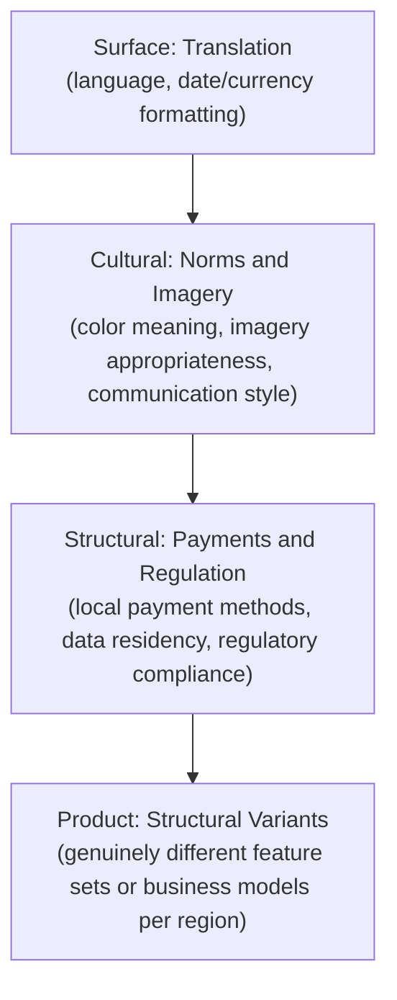

# Lesson 86: Scaling International Products: Beyond Localization

## Why This Lesson Matters

Module 6, in the foundational six-module arc of this curriculum, introduced basic international and localization considerations — translation, date formats, currency symbols. This lesson picks up where that foundational treatment left off, addressing what happens when a company attempts to scale a product across many countries simultaneously, and discovers that translation, however well executed, was never the hard part. The hard part is that "international expansion" can mean four genuinely different depths of adaptation, and a company that only ever operates at the shallowest depth will eventually hit a wall that no amount of additional translation quality can overcome.

A team that has succeeded at translating a product into several languages tends to assume the international expansion playbook has been solved, and that further countries are simply more of the same work. This assumption fails specifically because deeper layers of adaptation — payment methods people actually use, regulatory requirements that vary sharply by jurisdiction (directly connecting to the Regulatory Surface Map from Lesson 81), and sometimes genuinely different product structures entirely — are invisible from the perspective of a translation-only expansion, and can silently block adoption in a new market even when the translated product itself is excellent.

---

## Learning Path

| Field | Detail |
|---|---|
| **Module** | 9 — Specialized Domains and Synthesis |
| **Current Lesson** | 86 of 90 |
| **Difficulty** | 6 / 10 |
| **Estimated Study Time** | 40 minutes (reading) + 15 minutes (reflection + quiz) |
| **Prerequisites** | Lesson 81 (Regulatory Surface Map), Lesson 82 (Data Flow Risk Map, data residency) |
| **Next Lesson** | Lesson 87 — Crisis Management and Incident Response for PMs |
| **Future Topics Unlocked** | Lesson 87 (Crisis Management), Lesson 90 (Capstone) — depend on the Adaptation Depth Model introduced here |

---

## Learning Objectives

By the end of this lesson, you will be able to:

1. Explain why translation-level localization is insufficient for genuine international product scaling.
2. Apply the Adaptation Depth Model to identify which depth of adaptation a given market entry actually requires.
3. Identify why payment method localization is a common and underestimated barrier to international adoption.
4. Connect regulatory variance across jurisdictions to the Regulatory Surface Map from Lesson 81.
5. Evaluate an international expansion plan for whether it accounts for the appropriate adaptation depth.

---

## Prerequisites

This lesson assumes the Regulatory Surface Map from Lesson 81, since regulatory variance by country is a specific instance of that model applied across jurisdictions, and the Data Flow Risk Map's data residency concept from Lesson 82, since many countries impose specific requirements on where data may be stored.

---

## Theory

### The Four Depths of Adaptation

This lesson introduces the **Adaptation Depth Model**:

Most companies handle Surface adaptation reasonably well, since translation tooling is mature and well-understood. Cultural adaptation requires deeper local expertise but is still a relatively contained, addressable concern. Structural adaptation is where most companies discover unexpected friction, since payment method preferences and regulatory requirements vary sharply by country in ways invisible from a translation-only perspective — a market with low credit card penetration and high mobile-money usage will see poor adoption of a product that only supports card payments, regardless of translation quality. Product-level adaptation, the deepest level, is required when local market dynamics genuinely demand a different product structure entirely, not merely a localized version of the same structure.

### Why Payment Localization Is Underestimated

Payment infrastructure varies enormously by country — some markets are dominated by mobile wallets, others by cash-on-delivery, others by bank transfers, and a product supporting only the payment methods common in its home market can find adoption blocked entirely in a new market, even when every other aspect of localization has been done well.

### Regulatory Variance and the Regulatory Surface Map

Regulatory requirements — data residency, financial licensing, content restrictions — vary sharply by jurisdiction, meaning the Regulatory Surface Map from Lesson 81 must be reapplied, potentially with different answers, for every new country a product enters, rather than assumed to carry over from the home market.

### Why Cultural Adaptation Is Harder to Verify Than Surface Translation

Surface translation has a clear, verifiable correctness standard — a sentence is either translated accurately or it isn't, and automated tooling can catch many obvious errors. Cultural adaptation has no equivalent objective checkpoint, which is exactly why it is so easy for a team to believe it has been addressed when it has only been partially addressed. A color that signals celebration in one market can signal mourning in another; an image of a hand gesture considered friendly in one culture can be genuinely offensive in another; a communication style that reads as direct and efficient in one market can read as abrupt and disrespectful in another. None of these are caught by a translation review, because the words themselves may be perfectly correct — the failure occurs at a layer translation was never designed to check. This is why genuine Cultural-depth adaptation requires input from people who are actually native to, or have deep lived experience in, the target market, rather than being inferred from a translation vendor's linguistic accuracy alone; a product can be linguistically flawless and culturally tone-deaf at the same time, and only local expertise reliably catches the second failure mode.

---

## Common Beginner Mistakes

**Mistake 1: Assuming translation-level localization is sufficient for full international expansion, including underestimating the cultural adaptation layer**

Most companies handle Surface-level translation reasonably well, since the tooling is mature, but treating a fully translated product as "localized" skips the deeper Cultural, Structural, and Product layers of the Adaptation Depth Model entirely. Cultural adaptation in particular has no equivalent objective checkpoint the way translation does — a color, image, or communication style can be linguistically flawless and still be culturally inappropriate, and no translation review will catch that failure because the words themselves are correct. A team that stops at Surface adaptation has addressed the layer that was already easiest, while leaving the layers most likely to determine whether the product actually succeeds in the new market untouched.

**Mistake 2: Failing to research local payment method preferences before launch**

Payment infrastructure varies enormously by country — some markets are dominated by mobile wallets, others by cash-on-delivery, others by bank transfers — and a product supporting only the payment methods common in its home market can find adoption blocked entirely in a new market, even when every other aspect of localization has been done well. This is a Structural-depth requirement, not a Surface one, so it is easy for a team focused on translation quality to overlook it until launch data reveals unexpectedly low conversion. Researching local payment preferences before launch, not after adoption stalls, is the difference between anticipating this friction and discovering it the expensive way.

**Mistake 3: Assuming regulatory compliance in the home market transfers automatically to a new jurisdiction**

Regulatory requirements — data residency, financial licensing, content restrictions — vary sharply by jurisdiction, so the Regulatory Surface Map established for the home market cannot simply be assumed to hold in a new one; it must be reapplied, potentially with different answers, for every country the product enters. Treating home-market compliance as a starting assumption rather than something to be independently re-verified is a Structural-depth mistake with legal, not just product, consequences. A jurisdiction that appears similar to the home market on the surface can still differ sharply in its specific regulatory requirements, and only a fresh assessment catches that.

**Mistake 4: Building a single global product structure when local market dynamics genuinely require a structural variant**

Product-level adaptation, the deepest level of the Adaptation Depth Model, is required when local market dynamics genuinely demand a different product structure entirely, not merely a localized version of the same one. Teams that stop at Cultural or Structural adaptation, assuming a single global product shape can flex to fit every market with enough translation and payment support, can find that some markets simply need a different feature set or business model to actually work. Recognizing when a market has crossed from needing deeper localization into needing a genuine structural variant is itself a judgment call this lesson's model is meant to support.

**Mistake 5: Mistaking early traffic and signups in a new market as validation of Structural readiness**

Early engagement can reflect only the sliver of the market whose payment methods and regulatory situation happen to already be compatible with a translation-only launch, not the broader addressable market.
---

## Mental Model: The Adaptation Depth Model

Ask, for any new market entry: (1) Has Surface translation been done well? (2) Has Cultural adaptation genuinely been researched, not assumed? (3) Have Structural requirements — payments, regulation, data residency — been mapped specifically for this country? (4) Does local market reality require a genuine Product-level variant rather than a localized version of the existing structure?

---

## Real Company Example

Spotify's market-by-market international expansion, including its well-documented, often lengthy process of negotiating market-specific music licensing agreements before launching in a new country, illustrates Structural-depth adaptation — regulatory and licensing requirements that vary sharply by jurisdiction and cannot simply be translated around.

**Assumption flagged:** specifics of Spotify's internal market-entry practices are drawn from public commentary, not confirmed internal statements.

---

## Real World Perspective: Scaling International Products: Beyond Localization at Different Company Stages

**At a startup:** Early international expansion often stops at Surface-level translation, sometimes supplemented with basic Cultural review, which is appropriate for cheaply testing initial interest in a new market before committing significant resources. This is a reasonable, deliberate tradeoff at small scale, but teams frequently mistake early traffic and signups in a new market as validation that the full expansion playbook has worked, when in fact those early numbers may reflect only the segment of the market whose payment methods and regulatory situation happen to already be compatible with a translation-only launch — a much smaller and less representative slice of the addressable market than the team realizes.

**At a mid-size company:** This is typically where Structural adaptation first becomes a genuine, resourced priority, usually after translation-only expansion into one or two additional markets hits a clear payment or regulatory wall that can't be worked around with more translation effort. Mid-size companies at this stage often build a repeatable internal playbook — a standard checklist of payment integrations, regulatory reviews, and data residency checks — specifically so that each new market entry doesn't require rediscovering the same Structural gaps from scratch.

**At Big Tech:** Large organizations typically maintain dedicated regional product teams, often with real decision-making authority over local product structure, empowered to build genuine Product-level variants where local market dynamics require it rather than defending a single global product structure at all costs. This regional authority is frequently a deliberate organizational design choice, made specifically because centralized product teams, working from headquarters with limited local market exposure, have repeatedly proven poorly positioned to make Cultural- and Product-level adaptation decisions on their own.

---

## Detailed Case Study: The Payment Wall

An e-commerce company expanded into a new market with excellent Surface-level translation and Cultural-level imagery adaptation, but launched supporting only credit card payments, consistent with its home market's dominant payment method. In the new market, credit card penetration was low, and mobile-money and cash-on-delivery were the dominant payment preferences. Despite strong interest and traffic, conversion rates were dramatically lower than projected.

**What went wrong?** Structural-depth adaptation — specifically, payment method localization — had never been investigated, since the team's prior international launches, all in markets with similar payment infrastructure to their home market, had never surfaced this gap before. The team had, reasonably enough, built an internal playbook based on genuine prior success, but that playbook had never actually been tested against a market with meaningfully different payment infrastructure, so the gap remained invisible until this specific launch exposed it. Marketing data made the failure especially confusing at first: traffic, product page views, and even add-to-cart events were all strong, closely tracking the team's projections — the drop-off was concentrated entirely at the final payment step, which took the team longer than it should have to diagnose, precisely because their existing analytics dashboards weren't broken down by payment method attempted versus completed.

Recovery involved integrating local mobile-money and cash-on-delivery payment options, after which conversion rates improved substantially, and instituting a formal Structural-depth research step for all future market entries. The team also retroactively rebuilt their funnel analytics to break down drop-off by payment method specifically, since the aggregate funnel view had originally masked exactly where the failure was concentrated — a direct echo of the aggregation-masking risk this curriculum has raised in other contexts, now appearing in a payments-and-geography form rather than a demographic one.

1. Why did the team's existing analytics dashboards fail to surface the payment-method drop-off quickly, and what would you change about funnel instrumentation to catch this kind of gap earlier in future launches?
2. If you were the PM re-planning this expansion, at what point in the process would you have investigated payment method preferences, and what would that investigation have looked like concretely?

---

## Framework Explanation: The International Expansion Readiness Checklist

| Item | Question | Risk if Skipped |
|---|---|---|
| Payment Method Research | Are the dominant local payment methods supported? | Adoption blocked despite strong initial interest |
| Regulatory Mapping | Has the Regulatory Surface Map been reapplied for this specific jurisdiction? | Non-compliance discovered late |
| Data Residency Compliance | Does data storage meet this country's specific requirements? | Legal exposure and potential service disruption |
| Cultural Review | Has adaptation gone beyond translation to genuine cultural fit? | Products that translate correctly but feel foreign or inappropriate |
| Product Structure Fit | Does local market reality require a genuine structural variant? | A localized version of the wrong product structure entirely |

Like the readiness checklists introduced elsewhere in this module, this one is most valuable applied before a launch date is committed to publicly or internally, since discovering a Structural gap after a launch has already been announced creates pressure to ship anyway and fix the gap reactively — exactly the sequence that played out in the Payment Wall case study above, where the fix arrived only after the company had already absorbed the cost of a disappointing launch.

---

## Interview Perspective: How Interviewers Think About This

**Typical question 1: "How would you approach launching a product in a new international market?"**
*What the interviewer is actually evaluating:* Whether you default to a translation-and-marketing view of international expansion or think in terms of adaptation depth. A weak answer describes localizing copy and running a marketing campaign. A strong answer walks through the Adaptation Depth Model explicitly, describing how you'd investigate Cultural, Structural, and potential Product-level requirements before committing to a launch date, rather than assuming Surface-level readiness is sufficient.

**Typical question 2: "Why might a well-translated product still fail to gain adoption in a new country?"**
*What the interviewer is actually evaluating:* Direct pattern-matching to the Payment Wall case study. They want to hear that you recognize translation quality is orthogonal to Structural readiness — payment methods, regulatory compliance, data residency — and that a product can be linguistically flawless while remaining functionally inaccessible to the majority of a new market's population.

**Typical question 3: "When would a company need a genuinely different product structure for a specific region?"**
*What the interviewer is actually evaluating:* Whether you recognize Product-level adaptation as a real, sometimes necessary outcome rather than an expansion failure to be avoided at all costs. A strong answer gives a concrete example of a market dynamic — a dominant local competitor's business model, a regulatory structure that makes the home-market product illegal as designed, a fundamentally different user behavior pattern — that would justify a structural variant, rather than treating "one global product for every market" as an unquestioned default.

---

## Summary

International product scaling requires distinguishing four depths of adaptation — Surface translation, Cultural fit, Structural requirements like payments and regulation, and genuine Product-level variants — and most costly international expansion failures occur when a company assumes Surface-level success guarantees readiness at the deeper levels. Payment method localization and regulatory variance, reapplying the Regulatory Surface Map from Lesson 81 per jurisdiction, are the most commonly underestimated Structural requirements, and can block adoption entirely even when translation and cultural adaptation have been done well. A related trap deserves its own emphasis: early positive signals in a new market — traffic, signups, interest — can create false confidence, since those early adopters frequently represent only the slice of the market whose payment methods and regulatory circumstances already happen to align with a translation-only launch, not the broader population the product ultimately needs to reach. Structural-depth research, done before a launch date is locked in rather than discovered afterward through disappointing conversion numbers, is what separates expansion into a market from merely being visible within it.

---

## Key Takeaways

- Translation-level localization is necessary but insufficient for genuine international scaling.
- The Adaptation Depth Model distinguishes Surface, Cultural, Structural, and Product-level adaptation.
- Payment method preferences vary sharply by country and are a commonly underestimated barrier.
- Regulatory requirements must be remapped per jurisdiction, not assumed to transfer from the home market.
- Data residency requirements connect directly to the Data Flow Risk Map from Lesson 82.
- Some markets genuinely require a different product structure, not merely a localized version of the existing one.
- Structural-depth research should happen before, not after, a costly market entry.
- Early positive signals (traffic, signups) in a new market can mask Structural gaps rather than confirm their absence.

---

## Cheat Sheet

*A two-minute review of everything in this lesson.*

- Adaptation Depth: Surface → Cultural → Structural → Product.
- Translation success ≠ Structural readiness.
- Check local payment preferences and regulatory variance before launch.
- Reapply the Regulatory Surface Map per country.
- Break down funnel analytics by payment method and region — an aggregate funnel can mask exactly where a market entry is failing.
- Early traffic/signups ≠ Structural readiness confirmed. Investigate before declaring a launch successful.

---

## Glossary

| Term | Definition | Related Concepts | Difficulty |
|---|---|---|---|
| Adaptation Depth Model | Four-level model of international adaptation depth: Surface, Cultural, Structural, Product | Regulatory Surface Map (Lesson 81) | 2 |
| Structural Adaptation | Payment, regulatory, and data-residency adaptation required for a specific market | Data Flow Risk Map (Lesson 82) | 2 |
| Product-Level Variant | A genuinely different product structure required by local market dynamics | Adaptation Depth Model | 2 |
| Cultural Adaptation | Adjustment of norms, imagery, and communication style beyond literal translation to fit local expectations | Adaptation Depth Model | 2 |
| Payment Method Penetration | The prevalence of a specific payment method (cards, mobile money, cash-on-delivery) within a given market | Structural Adaptation | 2 |

---

## Further Reading / Resources

- Erin Meyer, *The Culture Map*
- *Global Product Management* industry practitioner resources
- World Bank published data on payment method usage by country

---

## Flashcards

**Card 1**
- Front: Why is translation insufficient for genuine international scaling?
- Back: Deeper adaptation layers — cultural fit, payment methods, regulatory requirements — are invisible from a translation-only perspective and can block adoption regardless of translation quality.
- Difficulty: 2
- Tags: international-scaling

**Card 2**
- Front: Name the four levels of the Adaptation Depth Model.
- Back: Surface, Cultural, Structural, Product.
- Difficulty: 2
- Tags: adaptation-depth-model

**Card 3**
- Front: Why is payment method localization commonly underestimated?
- Back: Payment infrastructure varies sharply by country, and a product supporting only home-market payment methods can see adoption blocked entirely in a new market.
- Difficulty: 2
- Tags: payment-localization

**Card 4**
- Front: What went wrong in the Payment Wall case study?
- Back: Excellent Surface and Cultural adaptation still failed to drive conversion because the product only supported credit card payments in a market where mobile-money and cash-on-delivery dominated.
- Difficulty: 2
- Tags: case-study

**Card 5**
- Front: Why is Cultural adaptation harder to verify than Surface translation?
- Back: Translation has an objective correctness standard, but cultural fit (color meaning, imagery, communication style) has no equivalent checkpoint — a product can be linguistically flawless and culturally tone-deaf at the same time.
- Difficulty: 2
- Tags: cultural-adaptation

**Card 6**
- Front: Why did the Payment Wall team take a long time to diagnose their conversion problem?
- Back: Their funnel analytics weren't broken down by payment method, so the drop-off concentrated at the payment step was masked within an otherwise strong-looking aggregate funnel.
- Difficulty: 2
- Tags: case-study, analytics

## Reflection Exercise

You are the PM planning expansion into a new country for a subscription-based media product.

There is no single correct answer. Work through the following before reading further.

1. Using the Adaptation Depth Model, what would you investigate at each of the four levels?
2. What local payment methods would you need to research before launch?
3. How would you reapply the Regulatory Surface Map for this specific jurisdiction?
4. What data residency requirements might apply, per Lesson 82?
5. What signal would indicate this market requires a genuine Product-level variant rather than a localized version of your existing product?

---

## Quiz

**1. Why is translation-level localization insufficient for genuine international scaling?**
A) Translation is always technically impossible to do well
B) Deeper adaptation layers, invisible from translation alone, can block adoption regardless of translation quality
C) Translation is irrelevant to international expansion
D) All countries have identical cultural and structural requirements

*Correct answer: B*
*Explanation: Translation only addresses surface-level formatting; deeper layers like cultural norms, payment methods, and regulation are invisible from a translation-only perspective and can block adoption entirely.*
*Learning objective tested: #1*
*Difficulty: Easy*

---

**2. What are the four levels of the Adaptation Depth Model?**
A) Concept, Prototype, Pilot, Scale
B) Surface, Cultural, Structural, Product
C) Collection, Storage, Processing, Sharing
D) Land, Expand, Retain, Grow

*Correct answer: B*
*Explanation: The Adaptation Depth Model defines four levels — Surface, Cultural, Structural, and Product — representing increasing depths of adaptation required for international markets.*
*Learning objective tested: #2*
*Difficulty: Easy*

---

**3. Why is payment method localization a commonly underestimated barrier?**
A) Payment infrastructure is identical worldwide
B) Payment method preferences vary sharply by country and can block adoption if not supported
C) Payment localization is never actually necessary
D) Credit cards are universally dominant in every market

*Correct answer: B*
*Explanation: A product supporting only home-market payment methods can see adoption blocked entirely in markets dominated by mobile money or cash-on-delivery, regardless of translation quality.*
*Learning objective tested: #3*
*Difficulty: Easy*

---

**4. How does regulatory variance across countries connect to Lesson 81?**
A) It has no connection to the Regulatory Surface Map
B) The Regulatory Surface Map must be reapplied per jurisdiction, since requirements vary by country
C) Regulatory requirements are identical in every jurisdiction
D) Lesson 81 only applies to a single country

*Correct answer: B*
*Explanation: The Regulatory Surface Map from Lesson 81 must be reapplied per jurisdiction because regulatory requirements like data residency and licensing vary sharply by country and do not transfer automatically.*
*Learning objective tested: #4*
*Difficulty: Easy*

---

**5. In the Payment Wall case study, what caused the low conversion rate despite strong translation and cultural adaptation?**
A) The product was poorly translated
B) The product only supported credit card payments in a market dominated by mobile-money and cash-on-delivery
C) The product had no cultural adaptation at all
D) The company never launched in the new market

*Correct answer: B*
*Explanation: The team completed Surface and Cultural adaptation but never investigated payment method preferences, so credit-card-only support failed in a mobile-money and cash-on-delivery market.*
*Learning objective tested: #3, #5*
*Difficulty: Easy*

---

**6. What does "Structural" adaptation include, per the Adaptation Depth Model?**
A) Only language translation
B) Payment methods, regulatory compliance, and data residency requirements
C) Only cultural imagery adjustments
D) Only pricing changes

*Correct answer: B*
*Explanation: Structural adaptation encompasses payment methods, regulatory compliance, and data residency requirements — the practical infrastructure constraints that vary by jurisdiction.*
*Learning objective tested: #2, #3*
*Difficulty: Easy*

---

**7. When is a Product-level variant, the deepest adaptation level, required?**
A) Never; translation is always sufficient
B) When local market dynamics genuinely demand a different product structure, not merely a localized version of the existing one
C) Only for hardware products
D) Only when a company has no international presence at all

*Correct answer: B*
*Explanation: Product-level adaptation is required when local market dynamics genuinely demand a different product structure, not merely a translated or culturally adapted version of the same product.*
*Learning objective tested: #2*
*Difficulty: Medium*

---

**8. According to the International Expansion Readiness Checklist, what risk does skipping Payment Method Research create?**
A) No risk; payment methods are irrelevant to adoption
B) Adoption blocked despite strong initial interest, as in the Payment Wall case study
C) A risk only relevant to hardware products
D) A risk only relevant to regulatory compliance, not adoption

*Correct answer: B*
*Explanation: As shown in the Payment Wall case study, skipping payment method research can block adoption despite strong initial interest, making it a critical pre-launch step.*
*Learning objective tested: #3, #5*
*Difficulty: Medium*

---

**9. Why might early-stage international expansion reasonably stop at Surface-level translation, per the Real World Perspective section?**
A) Surface-level translation is always sufficient regardless of stage
B) It's appropriate for testing initial interest, though insufficient for genuine adoption at scale
C) Structural adaptation is never necessary at any stage
D) Early-stage companies are legally prohibited from deeper adaptation

*Correct answer: B*
*Explanation: Surface-level translation is appropriate for testing initial interest at the startup stage, but genuine adoption at scale requires deeper Structural and Product-level adaptation.*
*Learning objective tested: #1*
*Difficulty: Medium*

---

**10. What do large organizations typically maintain for international products, per the Real World Perspective section?**
A) No dedicated regional resources
B) Dedicated regional product teams empowered to build genuine Product-level variants where needed
C) A single global product with no local adaptation
D) Translation teams only, with no other regional investment

*Correct answer: B*
*Explanation: Big Tech companies typically maintain dedicated regional product teams empowered to build genuine Product-level variants, since single global structures cannot address all local market needs.*
*Learning objective tested: #2, #5*
*Difficulty: Medium*

---

**11. Why does data residency matter for international product scaling, per this lesson's connection to Lesson 82?**
A) Data residency requirements are identical in every country
B) Many countries impose specific requirements on where data may be stored, requiring the Data Flow Risk Map to be reapplied per market
C) Data residency is irrelevant to international expansion
D) Data residency only applies to hardware products

*Correct answer: B*
*Explanation: Many countries impose specific data storage location requirements, so the Data Flow Risk Map from Lesson 82 must be reapplied per market rather than assumed to transfer from the home market.*
*Learning objective tested: #4*
*Difficulty: Medium*

---

**12. (Scenario) A company launches in a new market with excellent translation but has not researched local payment preferences. What risk does this represent?**
A) No risk, since translation quality is the only relevant factor
B) A potential Structural-depth gap that could block adoption regardless of translation quality
C) A risk only relevant to Cultural-depth adaptation
D) No risk, since payment preferences are identical worldwide

*Correct answer: B*
*Explanation: This is a Structural-depth gap — payment method preferences vary independently of translation quality and can block adoption even when every other localization aspect is well executed.*
*Learning objective tested: #3, #5*
*Difficulty: Medium-Hard*

---

**13. (Product Thinking) A team assumes success in three prior markets means a fourth market will work identically with only translation. What is the strongest response?**
A) Agree, since prior success guarantees future success
B) Investigate Structural-depth requirements (payments, regulation, data residency) specifically for the new market, since these vary independently of translation success
C) Skip investigation entirely to move faster
D) Assume the fourth market requires a Product-level variant with no further research

*Correct answer: B*
*Explanation: Prior market success does not guarantee the next market has identical structural requirements; payments, regulation, and data residency must be investigated independently for each new jurisdiction.*
*Learning objective tested: #1, #2, #3, #5*
*Difficulty: Hard*

---

**14. (Interview Reasoning) A candidate, asked how they'd launch in a new country, describes only translation and marketing localization. What does this signal?**
A) A strong and complete understanding of international expansion
B) A gap in recognizing Structural and Product-level adaptation requirements
C) Readiness for a senior international PM role immediately
D) Nothing meaningful; translation is the only relevant consideration

*Correct answer: B*
*Explanation: Focusing only on translation and cultural fit signals a gap in recognizing Structural-depth requirements like payments and regulation, which are critical for genuine international adoption.*
*Learning objective tested: #1, #2, #5*
*Difficulty: Hard*

---

**15. (Product Thinking, Highest Difficulty) A company plans to expand into a new market with excellent Surface and Cultural adaptation already prepared, but has not investigated local payment methods, regulatory requirements, or whether the market requires a different product structure. Using only this lesson's frameworks, what is the most defensible next step?**
A) Launch as planned, trusting that Surface and Cultural readiness is sufficient
B) Conduct Structural-depth research (payment methods, regulatory mapping, data residency) and assess whether Product-level adaptation is needed before finalizing the launch plan
C) Cancel the expansion entirely without further investigation
D) Launch with only the home market's payment methods and regulatory approach

*Correct answer: B*
*Explanation: Surface and Cultural readiness are necessary but not sufficient; Structural-depth research and a Product-level fit assessment must precede launch to avoid adoption-blocking gaps.*
*Learning objective tested: #1, #2, #3, #4, #5*
*Difficulty: Hard*

---

## Connections

| | Lesson | Core Idea Carried Forward |
|---|---|---|
| **Previous Lesson** | Lesson 85 — Responsible AI Product Management | Shifts from AI-specific fairness to broader international market adaptation |
| **Current Lesson** | Lesson 86 — Scaling International Products: Beyond Localization | Adaptation Depth Model; Structural adaptation; payment and regulatory variance |
| **Next Lesson** | Lesson 87 — Crisis Management and Incident Response for PMs | Shifts to real-time incident response, including international-market-specific incidents |
| **Future Concepts Unlocked** | Lesson 90 (Capstone) | Treats the Adaptation Depth Model as established canon |

This curriculum continues to build as one continuous argument. From this lesson forward, any reference to international expansion assumes you can locate its required depth on the Adaptation Depth Model without re-explanation.
