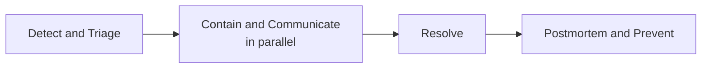

# Lesson 87: Crisis Management and Incident Response for PMs

## Why This Lesson Matters

Several threads across this curriculum converge here. Lesson 68's Sunset Runway addressed migrations that could go wrong; Lesson 83's Commitment Curve addressed hardware flaws discovered after shipment, sometimes requiring a recall; Lesson 62's Promise Tiers established that an API is a promise, and a promise broken without warning damages trust more than the underlying technical failure itself. This lesson addresses the moment all of these risks can converge into an actual, live crisis: a major outage, a data breach, a hardware recall, or any incident where the product has genuinely failed a meaningful number of users at once, and the PM's job shifts from building the right thing to managing the response in real time.

A PM's instinct during a crisis is often to focus entirely on the technical resolution — getting engineering the space and support to fix the underlying problem — while treating communication as a secondary concern to be handled once the technical situation is under control. This instinct, however well-intentioned, frequently causes more lasting damage to user trust than the original incident itself, because users experiencing a failure without any acknowledgment, explanation, or credible timeline tend to assume the worst, and that assumption compounds the longer silence continues. The specific discipline this lesson introduces treats communication and containment as parallel, not sequential, priorities.

---

## Learning Path

| Field | Detail |
|---|---|
| **Module** | 9 — Specialized Domains and Synthesis |
| **Current Lesson** | 87 of 90 |
| **Difficulty** | 6 / 10 |
| **Estimated Study Time** | 40 minutes (reading) + 15 minutes (reflection + quiz) |
| **Prerequisites** | Lesson 62 (Promise Tiers, trust), Lesson 68 (Sunset Runway), Lesson 83 (Commitment Curve, recalls) |
| **Next Lesson** | Lesson 88 — Building and Scaling a Product Organization |
| **Future Topics Unlocked** | Lesson 88 (Building and Scaling a Product Organization), Lesson 90 (Capstone) — depend on the Crisis Response Timeline introduced here |

---

## Learning Objectives

By the end of this lesson, you will be able to:

1. Explain why communication and technical containment must proceed in parallel during a crisis, not sequentially.
2. Apply the Crisis Response Timeline to manage an incident from detection through post-incident prevention.
3. Identify why vague or overpromising communication during a crisis erodes trust more than the incident itself.
4. Explain the purpose and value of a public post-incident transparency report.
5. Evaluate a company's incident response for whether communication and containment were adequately balanced.

---

## Prerequisites

This lesson assumes the Promise Tiers concept from Lesson 62, the Sunset Runway from Lesson 68, and the Commitment Curve's recall discussion from Lesson 83, since crisis response frequently involves exactly the kind of broken promise or irreversible failure those lessons addressed.

---

## Theory

### Why Communication and Containment Must Be Parallel

A PM who treats communication as secondary to technical resolution implicitly assumes users will simply wait patiently while engineering works. In practice, silence during a visible failure is read as evidence that the company either doesn't know what's wrong or doesn't consider the user's experience important enough to acknowledge, and this reading compounds the longer it persists — directly echoing the trust-erosion pattern established across this curriculum's discussions of broken promises. This is a specific instance of a more general pattern this curriculum has returned to repeatedly: users rarely have direct visibility into a company's internal effort, only into its outward behavior, so a company that is working intensely behind the scenes but says nothing outwardly is, from the user's vantage point, functionally indistinguishable from a company that isn't working on the problem at all.

### The Crisis Response Timeline

This lesson introduces the **Crisis Response Timeline**:

**Detect and Triage** establishes what's actually happening and its severity. **Contain and Communicate**, run in parallel rather than sequentially, means engineering works the technical containment while, simultaneously, a clear, honest, appropriately-scoped update reaches affected users — even if that update is simply "we are aware of the issue and are investigating," since acknowledgment alone meaningfully reduces the trust damage of visible silence. **Resolve** restores full functionality. **Postmortem and Prevent** produces an honest internal (and often public) account of what happened and what changes will prevent recurrence.

### Why Vague or Overpromising Communication Erodes Trust

A specific and common crisis-communication mistake is providing a confident resolution timeline before the actual cause is understood, in an effort to reassure users quickly. When that timeline is missed, as it frequently is under crisis uncertainty, the resulting broken promise damages trust more than an honest "we don't yet have a firm timeline" would have. This mirrors precisely the Promise Tiers discipline from Lesson 62: an unfulfillable commitment is worse than no committed timeline at all.

### The Value of a Post-Incident Transparency Report

A public post-incident report — explaining what happened, its impact, and concrete preventive changes — demonstrates the kind of accountability that Lesson 78's periodic reassessment and Lesson 67's appeals discipline both modeled: genuine ownership rather than a quiet, unexplained return to normal operation.

### Why Severity Classification Comes Before Everything Else

A crisis response that skips the Detect and Triage step, jumping directly to either technical fixing or public communication, tends to make both worse. Without an honest severity assessment — how many users are affected, how central is the affected functionality, is data integrity or security at risk — a team can easily either under-communicate a genuinely serious incident (leaving affected users without the acknowledgment they need) or over-communicate a minor one (creating unnecessary alarm and burning credibility that will be needed for a genuinely severe future incident). Severity classification also determines who needs to be involved: a minor, contained bug might be handled entirely within one engineering team, while a severe incident touching customer data or safety typically requires legal, security, and executive involvement from the outset, not after the fact. Treating severity classification as the deliberate first step, rather than something that happens implicitly while people are already reacting, is what allows the subsequent Contain-and-Communicate phase to be calibrated correctly from the start rather than adjusted awkwardly partway through.

---

## Common Beginner Mistakes

**Mistake 1: Treating communication as secondary to technical resolution rather than a parallel priority**

A PM who treats communication as secondary implicitly assumes users will simply wait patiently while engineering works, but users have no direct visibility into a company's internal effort — only into its outward behavior. A company working intensely behind the scenes but saying nothing outwardly is, from the user's vantage point, functionally indistinguishable from a company that isn't working on the problem at all. The Crisis Response Timeline's Contain-and-Communicate step is explicitly parallel, not sequential, precisely because silence during a visible failure compounds the longer it persists.

**Mistake 2: Providing an overconfident resolution timeline before the cause is actually understood**

Offering a confident resolution timeline in an effort to reassure users quickly, before the actual cause is understood, feels helpful in the moment but frequently backfires: crisis timelines are commonly missed under real uncertainty, and a broken promise damages trust more than an honest "we don't yet have a firm timeline" would have. This mirrors the Promise Tiers discipline from Lesson 62 directly — an unfulfillable commitment is worse than no committed timeline at all. A PM under pressure to say something reassuring should resist the urge to commit to a specific time before the team genuinely knows enough to keep that commitment.

**Mistake 3: Remaining silent until the incident is fully resolved, overlooking calm, honest, symptom-level acknowledgment as a middle option between alarming speculation and total silence**

Some PMs default to silence during an unresolved incident, reasoning that saying anything before the cause is known would either alarm users or amount to speculation. This overlooks a third option: a calm, honest, symptom-level acknowledgment — "we are aware of the issue and are investigating" — that requires no speculation about cause or timeline but still meaningfully reduces the trust damage of visible silence. Acknowledgment alone, even without answers, is what the Contain-and-Communicate step calls for; withholding it until full resolution treats users as an audience to be managed rather than a group with a legitimate right to know something is being done.

**Mistake 4: Skipping a public post-incident report, missing an opportunity to demonstrate genuine accountability**

A public post-incident report — explaining what happened, its impact, and concrete preventive changes — demonstrates real ownership rather than a quiet, unexplained return to normal operation. Skipping this step because the incident is technically resolved treats resolution as the finish line, when the trust rebuilt through transparent accountability is often what determines whether users' confidence actually recovers. This is the same accountability discipline this curriculum has applied to periodic reassessment and appeals processes elsewhere, now applied to the aftermath of a crisis specifically.

**Mistake 5: Failing to distinguish, in communication, between what is known, what is suspected, and what is still unknown**

Crisis communication that blurs known facts, working hypotheses, and genuine unknowns into one undifferentiated update can either overstate the team's actual confidence or understate real progress, and either error erodes credibility once contradicted by events. Clearly separating these three categories in every update, even when the honest answer for a given point is "still unknown," lets users calibrate their own expectations accurately rather than reading more certainty into a message than the team actually has. This distinction becomes especially important the longer an incident runs, since early updates often shift from suspected causes to confirmed ones as the team's understanding evolves.
---

## Mental Model: The Crisis Response Timeline

Ask: (1) Has detection and triage established actual severity? (2) Is communication running in parallel with containment, not waiting for full resolution? (3) Is the communication honest about uncertainty rather than overpromising a timeline? (4) Does the postmortem produce genuine, actionable prevention, and is it shared transparently where appropriate?

---

## Real Company Example

**Cloudflare's own engineering blog** provides an unusually candid, and unusually well-documented, test case for this lesson's transparency argument — including a genuine repeat failure that makes the practice's real value visible. On November 2, 2023, Cloudflare published a detailed postmortem after a power failure at its Hillsboro, Oregon data center took down its control plane and analytics services; the post named the specific technical cause (generators failing to restart before UPS batteries were depleted) and listed concrete remediation commitments, including removing control-plane dependencies on core data centers and implementing more rigorous chaos testing of full data-center failures. Less than five months later, Cloudflare published a second postmortem — titled, with unusual candor, "Major data center power failure (again)" — disclosing that the *same* data center had failed again, this time from a different root cause (misconfigured circuit breaker trip settings at the facility operator). Cloudflare's own post directly compares the two incidents' outcomes: because of remediation work completed after the first outage, the second failure's control plane recovery was dramatically faster, corroborated by its own before/after account of recovery time.

This is a sharper illustration of this lesson's core claim than a general "they're transparent" description, because it shows transparency surviving a genuinely embarrassing repeat failure at the same facility — Cloudflare didn't quietly fix the second incident and let the "we learned from November" narrative stand; it published the recurrence, named it explicitly as a repeat, and used the same before/after format to show the remediation had produced a real, measurable improvement rather than merely reassuring words. Sustained trust after an incident is not primarily earned by the first honest postmortem — it's earned by remaining honest through the second one, when the story is much less flattering.

*(Source: Cloudflare's own official engineering blog, both the November 4, 2023 postmortem and the follow-up postmortem for the subsequent incident at the same facility.)*

---

## Real World Perspective: Crisis Management and Incident Response for PMs at Different Company Stages

**At a startup:** Early-stage companies often lack a formal incident response process entirely, improvising communication in real time through whatever channel is easiest — a founder's personal social media account, a quick status page update, a direct email. This can work adequately at small scale, where the founder or a senior team member typically has full context and can communicate with genuine authority, but it leaves no institutional memory: the next incident, potentially handled by a different person, starts from the same improvisation rather than building on lessons the company has already learned the hard way once.

**At a mid-size company:** This is typically where formal incident response processes and communication templates first become necessary, usually prompted by a specific incident that was handled inconsistently or poorly under the old improvised approach. Mid-size companies at this stage often struggle with a specific coordination problem the Crisis Response Timeline is designed to solve: who has the authority to approve outward communication during an active incident, and how is that decided quickly enough to avoid the exact silence-compounds-damage failure mode this lesson describes, without also requiring executive sign-off for every minor issue.

**At Big Tech:** Large organizations typically maintain dedicated incident response teams with formal severity classification and pre-approved communication templates for various incident types, precisely so that the Contain and Communicate phase doesn't stall waiting for someone to draft appropriate language from scratch under time pressure. These organizations also typically run incident response drills — deliberately simulated crises — specifically to build the institutional muscle memory that smaller companies, without the resources for dedicated drills, have to build for real, during their first genuine incident.

---

## Detailed Case Study: The Silent Outage

A SaaS company experienced a major outage affecting a significant fraction of its customer base. Engineering began investigating immediately, but no external communication was issued for several hours, on the reasoning that the team wanted to understand the root cause before saying anything definitive. When a status update finally appeared, it provided an optimistic, specific resolution timeline that was missed by several hours.

**What went wrong?** Communication was treated as sequential to technical understanding rather than parallel to it, allowing hours of visible silence to compound customer anxiety, and the eventual update's overconfident timeline created a second, avoidable broken promise on top of the original outage. The team's internal reasoning at the time felt defensible in the moment — nobody wanted to alarm customers with an update that said, in effect, "we don't know what's wrong yet" — but this reasoning mistook the choice as being between "say nothing" and "say something alarming," when a third option existed the whole time: a calm, honest acknowledgment that named the problem's visible symptoms without speculating about cause or committing to a timeline.

By the time the first update went out, customer support had already been flooded with inbound tickets and social media mentions speculating about the cause, several of which were more alarming than the actual situation warranted — a direct illustration of the lesson's point that silence doesn't prevent a narrative from forming, it simply cedes control of that narrative to worried customers filling the vacuum with worst-case assumptions. Recovery involved a formal incident communication policy requiring acknowledgment within a defined, short window regardless of how much is yet known, and a policy against providing specific resolution timelines until genuinely confident in them — plus a detailed public postmortem after the fact, which the team credited with recovering more customer goodwill than the original silence had cost, though not fully offsetting it.

1. What specific false choice did the team believe they were facing, and what third option did they overlook?
2. If you were designing this company's incident communication policy from scratch, what would the very first sentence of a "we're aware and investigating" message say, and what would it deliberately avoid saying?

---

## Framework Explanation: The Incident Communication Checklist

| Item | Question | Risk if Skipped |
|---|---|---|
| Rapid Acknowledgment | Has an initial acknowledgment gone out within a short, defined window? | Silence compounds anxiety and trust erosion |
| Honest Uncertainty | Does communication distinguish known facts from ongoing investigation? | Overpromising creates a second broken commitment |
| Parallel Tracking | Is communication proceeding alongside containment, not waiting for full resolution? | Unnecessary trust damage from avoidable silence |
| Public Postmortem | Is a transparent account of cause and prevention shared after resolution? | A missed opportunity to demonstrate genuine accountability |

The first item on this checklist is deliberately the one with the shortest allowable delay, and that ordering is intentional: everything else on the list — honest uncertainty, parallel tracking, an eventual postmortem — depends on having already broken the silence early enough that a narrative vacuum never fully forms in the first place, since, as the Silent Outage case study shows, customers and the press will construct their own explanation for an unexplained failure well before a company's official account arrives, and that improvised narrative is rarely more charitable than the truth.

---

## Interview Perspective: How Interviewers Think About This

**Typical question 1: "How would you communicate with customers during a major outage before you know the root cause?"**
*What the interviewer is actually evaluating:* Whether you default to silence-until-certainty or understand acknowledgment as an immediate, separate obligation. A weak answer describes waiting until the team has a clear explanation. A strong answer describes an immediate, honest acknowledgment — "we're aware, we're investigating" — issued in parallel with the technical work, explicitly separating the act of acknowledging from the act of resolving.

**Typical question 2: "What's the risk of giving a specific resolution timeline too early in an incident?"**
*What the interviewer is actually evaluating:* Direct pattern-matching to the Silent Outage case study's second mistake. They want to hear that an unconfirmed timeline, if missed, functions as a second broken promise stacked on top of the original incident, and that this compounds trust damage rather than mitigating it — connecting explicitly to the Promise Tiers discipline from Lesson 62.

**Typical question 3: "Why would a company publish a detailed postmortem after resolving an incident?"**
*What the interviewer is actually evaluating:* Whether you see a postmortem as a genuine trust-rebuilding tool or merely a compliance formality. A strong answer explains that a transparent, specific account of cause and prevention demonstrates real accountability in a way a vague "we take this seriously" statement cannot, and connects this to the broader pattern of visible ownership this curriculum has emphasized in other trust-related contexts.

---

## Summary

Crisis response requires treating communication and technical containment as parallel priorities, since silence during a visible failure compounds user anxiety and trust erosion, and an honest, appropriately-scoped acknowledgment — even without a resolution — meaningfully reduces that damage. The Crisis Response Timeline moves through Detect and Triage, parallel Contain and Communicate, Resolve, and Postmortem and Prevent, and its central discipline is avoiding both extremes: neither treating communication as an afterthought, nor overpromising a specific resolution timeline before genuine confidence exists. A transparent public postmortem, demonstrating genuine accountability, connects directly to the trust-rebuilding this curriculum has emphasized since Lesson 62's treatment of a broken API promise. Underlying all of this is a single reframe worth internalizing: silence is never actually neutral during a visible incident. It is a choice that cedes the narrative to affected users' own assumptions, and those assumptions, absent any real information, tend to run worse than the truth — which is precisely why rapid, honest, symptom-level acknowledgment belongs at the very start of an incident, not as a reward for having first solved it.

---

## Key Takeaways

- Communication and technical containment must proceed in parallel, not sequentially.
- The Crisis Response Timeline moves through Detect and Triage, Contain and Communicate, Resolve, and Postmortem and Prevent.
- Silence during a visible incident compounds user anxiety and trust erosion.
- Overpromising a specific resolution timeline creates a second, avoidable broken promise.
- Honest communication distinguishes known facts from ongoing investigation.
- A public postmortem demonstrates genuine accountability and can rebuild trust.
- Formal incident communication policy should exist before a crisis occurs, not be improvised during one.
- Severity classification during Detect and Triage determines both communication urgency and who must be involved.

---

## Cheat Sheet

*A two-minute review of everything in this lesson.*

- Communicate in parallel with containment, never sequentially after it.
- Acknowledge fast. Don't promise a timeline you're not confident in.
- Postmortems demonstrate accountability and rebuild trust.
- Silence isn't neutral — it cedes the narrative to worried users' worst assumptions.
- Classify severity early; it determines urgency and who needs to be in the room.

---

## Glossary

| Term | Definition | Related Concepts | Difficulty |
|---|---|---|---|
| Crisis Response Timeline | Four-phase model: Detect and Triage, Contain and Communicate, Resolve, Postmortem and Prevent | Promise Tiers (Lesson 62) | 2 |
| Post-Incident Transparency Report | A public account of an incident's cause, impact, and preventive changes | Crisis Response Timeline | 2 |
| Severity Classification | An early, deliberate assessment of an incident's scope and impact that determines communication urgency and who must be involved | Detect and Triage | 2 |
| Narrative Vacuum | The gap left by silence during a visible incident, which affected users and observers fill with their own, often worse-than-reality, assumptions | Crisis Response Timeline | 3 |

---

## Further Reading / Resources

- Betsy Beyer, Chris Jones, Jennifer Petoff, and Niall Richard Murphy, *Site Reliability Engineering*
- Published postmortem archives from major cloud infrastructure providers
- Atul Gawande, *The Checklist Manifesto*

---

## Flashcards

**Card 1**
- Front: Why must communication and containment proceed in parallel during a crisis?
- Back: Silence during a visible failure compounds user anxiety and trust erosion, so acknowledgment shouldn't wait for full technical resolution.
- Difficulty: 2
- Tags: crisis-management

**Card 2**
- Front: What are the four phases of the Crisis Response Timeline?
- Back: Detect and Triage, Contain and Communicate (in parallel), Resolve, Postmortem and Prevent.
- Difficulty: 2
- Tags: crisis-response-timeline

**Card 3**
- Front: Why is providing an overconfident resolution timeline risky during a crisis?
- Back: If missed, it creates a second, avoidable broken promise on top of the original incident, echoing the Promise Tiers discipline from Lesson 62.
- Difficulty: 2
- Tags: overpromising

**Card 4**
- Front: What went wrong in the Silent Outage case study?
- Back: Communication was delayed for hours while engineering investigated, and the eventual update gave an overconfident timeline that was subsequently missed.
- Difficulty: 2
- Tags: case-study

**Card 5**
- Front: Why does severity classification need to happen before communication and technical fixing begin in earnest?
- Back: Without it, a team can under-communicate a genuinely serious incident or over-communicate a minor one, and severity also determines who needs to be involved (legal, security, executives) from the outset.
- Difficulty: 2
- Tags: severity-classification

**Card 6**
- Front: What is a "narrative vacuum" and why does it matter in crisis communication?
- Back: The gap left by silence during a visible incident — affected users and observers will fill it with their own assumptions, usually worse than reality, before an official explanation arrives.
- Difficulty: 2
- Tags: crisis-management, trust

## Reflection Exercise

You are the PM on call when a major service disruption begins, and the root cause is not yet known.

There is no single correct answer. Work through the following before reading further.

1. What would your first communication to affected users say, given you don't yet know the cause?
2. How would you balance supporting the engineering team's containment work with your communication responsibilities?
3. What would make you confident enough to share a specific resolution timeline?
4. What would you include in a post-incident transparency report?
5. How would you build institutional memory from this incident for future crises?

---

## Quiz

**1. Why must communication and containment proceed in parallel during a crisis?**
A) Communication should always wait until the technical issue is fully resolved
B) Silence during a visible failure compounds user anxiety and trust erosion
C) Communication is irrelevant to crisis outcomes
D) Containment is always faster when communication is delayed

*Correct answer: B*
*Explanation: Silence during a visible failure compounds user anxiety and trust erosion, which is why communication and containment must proceed in parallel rather than sequentially.*
*Learning objective tested: #1*
*Difficulty: Easy*

---

**2. What are the four phases of the Crisis Response Timeline?**
A) Ship, Iterate, Measure, Learn
B) Detect and Triage, Contain and Communicate, Resolve, Postmortem and Prevent
C) Concept, Prototype, Pilot, Scale
D) Collection, Storage, Processing, Sharing

*Correct answer: B*
*Explanation: The four phases — Detect and Triage, Contain and Communicate, Resolve, and Postmortem and Prevent — form the structured Crisis Response Timeline introduced in the Theory section.*
*Learning objective tested: #2*
*Difficulty: Easy*

---

**3. Why is providing an overconfident resolution timeline risky?**
A) Timelines are always accurate regardless of crisis conditions
B) If missed, it creates a second, avoidable broken promise on top of the original incident
C) Resolution timelines are legally required in all cases
D) There is no risk to providing a timeline early

*Correct answer: B*
*Explanation: An overconfident timeline creates a second, avoidable broken promise on top of the original incident if the deadline is missed.*
*Learning objective tested: #3*
*Difficulty: Easy*

---

**4. What is the value of a public post-incident transparency report?**
A) It has no real value beyond internal record-keeping
B) It demonstrates genuine accountability and can help rebuild user trust
C) It is only useful for regulatory compliance
D) It should never be shared publicly under any circumstances

*Correct answer: B*
*Explanation: A public post-incident transparency report demonstrates genuine accountability and can help rebuild user trust after a crisis.*
*Learning objective tested: #4*
*Difficulty: Easy*

---

**5. In the Silent Outage case study, what was the first mistake made?**
A) Engineering began investigating too quickly
B) No external communication was issued for several hours while the root cause was investigated
C) The postmortem was published too early
D) The company never experienced any outage at all

*Correct answer: B*
*Explanation: No external communication was issued for several hours while the root cause was investigated, violating the parallel communication and containment principle.*
*Learning objective tested: #1, #5*
*Difficulty: Easy*

---

**6. What was the second mistake in the Silent Outage case study?**
A) The eventual update was too vague
B) The eventual update gave an overconfident, specific resolution timeline that was subsequently missed
C) No postmortem was ever published
D) The outage was resolved too quickly

*Correct answer: B*
*Explanation: The eventual update gave an overconfident, specific resolution timeline that was subsequently missed, creating a second broken promise.*
*Learning objective tested: #3, #5*
*Difficulty: Easy*

---

**7. According to the Incident Communication Checklist, what risk does skipping Rapid Acknowledgment create?**
A) No risk; delayed acknowledgment is always preferable
B) Silence compounds anxiety and trust erosion among affected users
C) A risk only relevant to hardware incidents
D) A risk only relevant to regulatory compliance

*Correct answer: B*
*Explanation: Silence compounds anxiety and trust erosion among affected users, which is why rapid acknowledgment is essential.*
*Learning objective tested: #1, #5*
*Difficulty: Medium*

---

**8. Why should communication distinguish known facts from ongoing investigation?**
A) This distinction is legally required in all jurisdictions
B) Honest uncertainty avoids the overpromising trap that creates a second broken promise
C) This distinction has no practical value during a crisis
D) Users never actually care about this distinction

*Correct answer: B*
*Explanation: Honest uncertainty avoids the overpromising trap that creates a second broken promise, distinguishing known facts from ongoing investigation.*
*Learning objective tested: #3, #5*
*Difficulty: Medium*

---

**9. Why might early-stage companies lack a formal incident response process, per the Real World Perspective section?**
A) Incident response is legally required only for large companies
B) Improvised communication can work adequately at small scale but leaves no institutional memory for future incidents
C) Early-stage companies never experience any incidents
D) Formal processes are always unnecessary regardless of company size

*Correct answer: B*
*Explanation: Improvised communication can work adequately at small scale but leaves no institutional memory for future incidents.*
*Learning objective tested: #1*
*Difficulty: Medium*

---

**10. What do large organizations typically maintain for incident response, per the Real World Perspective section?**
A) No formal process at all
B) Dedicated incident response teams with formal severity classification and pre-approved communication templates
C) A policy of never communicating publicly about incidents
D) Communication only after a postmortem is complete

*Correct answer: B*
*Explanation: Large organizations typically maintain dedicated incident response teams with formal severity classification and pre-approved communication templates.*
*Learning objective tested: #5*
*Difficulty: Medium*

---

**11. How does the Crisis Response Timeline's communication discipline connect to Lesson 62's Promise Tiers?**
A) There is no meaningful connection
B) An unfulfillable resolution timeline is a broken promise, echoing Lesson 62's point that an unkeepable commitment is worse than no commitment
C) Promise Tiers only applies to API design, never crisis communication
D) Crisis communication is entirely unrelated to trust considerations

*Correct answer: B*
*Explanation: An unfulfillable resolution timeline is a broken promise, echoing Lesson 62's point that an unkeepable commitment is worse than no commitment.*
*Learning objective tested: #3, #5*
*Difficulty: Medium*

---

**12. (Scenario) A company's engineering team is investigating a major outage but has no confirmed root cause after one hour. What should the company's communication do?**
A) Remain silent until the root cause is fully understood
B) Acknowledge the issue honestly, without committing to a specific resolution timeline they aren't confident in
C) Provide a confident resolution timeline to reassure users quickly
D) Wait until the postmortem to communicate anything at all

*Correct answer: B*
*Explanation: Acknowledging the issue honestly without committing to an unconfirmed timeline follows the parallel communication and containment principle.*
*Learning objective tested: #1, #3, #5*
*Difficulty: Medium-Hard*

---

**13. (Product Thinking) A team wants to delay any communication until they're "certain" about the root cause. What is the strongest response?**
A) Agree, since certainty should always precede communication
B) Explain that acknowledgment can and should happen immediately, separate from resolving technical uncertainty, since silence compounds trust erosion
C) Cancel the incident response process entirely
D) Skip communication and proceed directly to the postmortem

*Correct answer: B*
*Explanation: Acknowledgment can and should happen immediately, separate from resolving technical uncertainty, since silence compounds trust erosion.*
*Learning objective tested: #1, #5*
*Difficulty: Hard*

---

**14. (Interview Reasoning) A candidate, asked how they'd handle a major outage, describes focusing entirely on engineering support with no mention of parallel communication. What does this signal?**
A) A strong and complete understanding of crisis management
B) A gap in recognizing that communication must run in parallel with containment
C) Readiness for a senior incident response role immediately
D) Nothing meaningful; engineering support is the only relevant consideration

*Correct answer: B*
*Explanation: A gap in recognizing that communication must run in parallel with containment — focusing only on engineering support misses the trust erosion caused by silence.*
*Learning objective tested: #1, #5*
*Difficulty: Hard*

---

**15. (Product Thinking, Highest Difficulty) A major outage is underway with no confirmed root cause, and leadership wants to reassure customers with a specific resolution timeline. Using only this lesson's frameworks, what is the most defensible response?**
A) Provide the specific timeline leadership wants, prioritizing quick reassurance
B) Acknowledge the incident immediately and honestly, avoid committing to a timeline not yet genuinely confident, and prepare a transparent postmortem once resolved
C) Delay all communication until the root cause is fully understood
D) Provide no acknowledgment at all until the incident is fully resolved

*Correct answer: B*
*Explanation: The most defensible response combines immediate honest acknowledgment, avoidance of an unconfirmed timeline, and preparation for a transparent postmortem once resolved.*
*Learning objective tested: #1, #2, #3, #4, #5*
*Difficulty: Hard*

---

## Connections

| | Lesson | Core Idea Carried Forward |
|---|---|---|
| **Previous Lesson** | Lesson 86 — Scaling International Products | Shifts from international scaling to real-time crisis response |
| **Current Lesson** | Lesson 87 — Crisis Management and Incident Response for PMs | Crisis Response Timeline; parallel communication and containment; post-incident transparency |
| **Next Lesson** | Lesson 88 — Building and Scaling a Product Organization | Extends institutional-memory concerns into broader organizational design |
| **Future Concepts Unlocked** | Lesson 90 (Capstone) | Treats the Crisis Response Timeline as established canon |

This curriculum continues to build as one continuous argument. This lesson resolves the open threads planted in Lessons 68 and 83 regarding migration and hardware-recall crisis scenarios.
