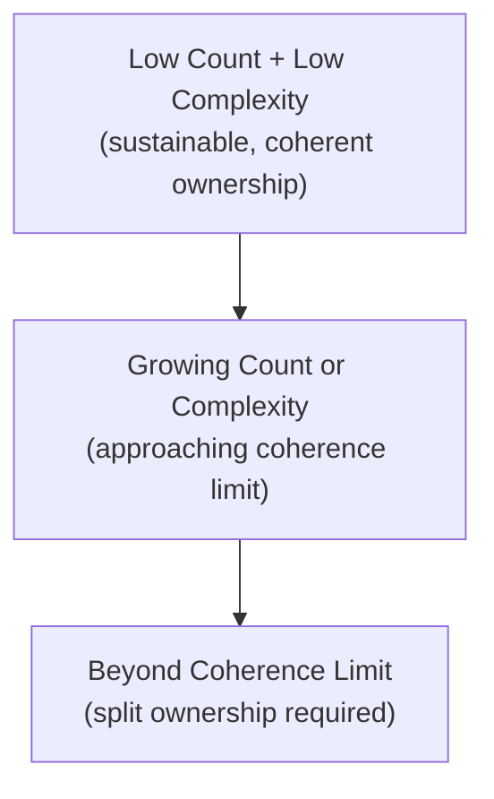

# Lesson 88: Building and Scaling a Product Organization

## Why This Lesson Matters

This lesson has been owed since Lesson 71 planted the thread, and it draws on a wide arc of this curriculum: the Friction Ledger from Lesson 69 established that internal friction compounds invisibly; the Portfolio Health Grid from Lesson 77 established that bets at different maturity stages need different oversight; and the Strategic Judgment Radar from Lesson 80 established that a company's specialist functions must coordinate around a shared understanding rather than each optimizing in isolation. This lesson addresses the organizational structure question underneath all of these: as a product organization grows, how should PM ownership actually be divided, and what specific signal indicates a single PM's scope has grown beyond what one person can meaningfully own?

A company experiencing rapid growth tends to add headcount to a product organization reactively — hiring more PMs as more work appears — without a deliberate model for how ownership should actually be divided among them. This produces a specific and recognizable failure pattern: a single PM, having successfully owned a coherent set of initiatives at an earlier stage of company growth, continues accumulating additional, increasingly disconnected responsibilities as the company scales, until their nominal ownership span has grown well past what any one person can meaningfully track, prioritize, or make good decisions about.

---

## Learning Path

| Field | Detail |
|---|---|
| **Module** | 9 — Specialized Domains and Synthesis |
| **Current Lesson** | 88 of 90 |
| **Difficulty** | 6 / 10 |
| **Estimated Study Time** | 40 minutes (reading) + 15 minutes (reflection + quiz) |
| **Prerequisites** | Lesson 69 (Friction Ledger), Lesson 77 (Portfolio Health Grid), Lesson 80 (Strategic Judgment Radar) |
| **Next Lesson** | Lesson 89 — The Future of Product Management |
| **Future Topics Unlocked** | Lesson 89 (The Future of Product Management), Lesson 90 (Capstone) — depend on the Coherence Span Model introduced here |

---

## Learning Objectives

By the end of this lesson, you will be able to:

1. Explain why reactive headcount addition, without a deliberate ownership model, produces overextended PM scope.
2. Apply the Coherence Span Model to identify when a PM's ownership has grown beyond a sustainable span.
3. Identify the signals that indicate a PM's scope should be split rather than further expanded.
4. Explain how clear decision rights and ownership boundaries prevent duplicated or competing ownership.
5. Evaluate a product organization's structure for whether ownership spans match actual coherence limits.

---

## Prerequisites

This lesson assumes the Friction Ledger from Lesson 69, the Portfolio Health Grid from Lesson 77, and the Strategic Judgment Radar from Lesson 80, since organizational scaling decisions draw on all three simultaneously.

---

## Theory

### Why Reactive Headcount Addition Fails

Adding PMs reactively, as work volume grows, without a deliberate model for dividing ownership, tends to preserve an existing PM's overall scope while adding new PMs alongside them for entirely new initiatives — rather than splitting the original PM's now-overgrown scope into more coherent, individually ownable pieces. This produces organizations where the newest, smallest initiatives are well-owned while the most established, often most important, product areas are owned by a single PM whose attention is spread across far more than they can meaningfully track.

### The Coherence Span Model

This lesson introduces the **Coherence Span Model**, plotting a PM's ownership scope by initiative count against interdependency complexity:

A PM's **span of coherence** — the point past which additional initiatives or complexity make genuinely good, well-informed decision-making impossible — is not a fixed number, since it depends heavily on how interdependent the owned initiatives are; a few tightly related initiatives may be easier to own coherently than the same number of entirely unrelated ones. The Coherence Span Model's discipline is watching for specific signals — decisions increasingly deferred or delayed, decreasing depth of engagement with any single initiative, rising Friction Ledger-style complaints from teams feeling under-supported — that indicate a PM has moved past their sustainable span, rather than waiting for an obvious crisis to force the issue.

### Splitting Ownership vs. Adding Support

A specific organizational mistake is responding to an overextended PM by adding a supporting analyst or associate PM role reporting to them, rather than genuinely splitting ownership into separate, independently-accountable areas. Support roles can help with execution capacity, but they do not solve the underlying coherence problem, since the original PM remains the single point of prioritization and decision-making judgment across an unchanged, overextended scope.

### Why This Failure Pattern Is So Persistent

If overextension is this recognizable in hindsight, it's worth asking why it happens so consistently across so many growing companies. Part of the answer is structural: splitting a well-performing PM's ownership can feel, to both the PM and to leadership, like a demotion or a vote of no confidence, even when it is exactly the opposite — a recognition that the area has grown important enough to deserve dedicated, undivided attention. This makes leadership reluctant to initiate the conversation, and PMs reluctant to request it themselves, even once they privately recognize they're stretched thin. The other part of the answer is that overextension develops gradually, one individually reasonable addition at a time, so there is rarely a single obvious moment that triggers a structural review — unlike a hiring decision, which has a clear trigger (new work exists, nobody owns it), a splitting decision requires someone to proactively notice a slow accumulation and decide to act on it before a crisis forces the issue. Naming this reluctance explicitly, and building a periodic, scheduled review that doesn't depend on someone first working up the nerve to raise it, is what allows companies to catch coherence overextension while it's still a manageable adjustment rather than an acute organizational crisis.

---

## Common Beginner Mistakes

1. **Adding headcount reactively without a deliberate model for dividing existing overextended ownership.**
2. **Adding support roles under an overextended PM rather than genuinely splitting ownership.**
3. **Treating span of coherence as a fixed number of initiatives regardless of interdependency complexity.**
4. **Failing to notice the early signals of coherence overextension — delayed decisions, shallow engagement — before they become an acute crisis.**
5. **Creating ambiguous or overlapping ownership boundaries when splitting scope, producing duplicated or competing decision rights.**
6. **Treating a splitting conversation as an implicit judgment on past performance rather than scope-appropriate role design, which discourages leadership from raising it early.**

---

## Mental Model: The Coherence Span Model

Ask: (1) How many initiatives does this PM currently own, and how interdependent are they? (2) Are there signals — delayed decisions, shallow engagement, rising friction complaints — indicating the coherence limit has been reached? (3) When splitting scope, are the resulting ownership boundaries clear and non-overlapping?

---

## Real Company Example

Shopify's publicized approach to organizational structure and internal documentation around how product ownership should scale with company growth illustrates deliberate attention to avoiding the kind of reactive, ownership-preserving headcount growth this lesson warns against.

**Assumption flagged:** specifics of Shopify's internal organizational practices are drawn from public commentary, not confirmed internal statements.

---

## Real World Perspective

**At a startup:** A single PM owning the entire product is normal and appropriate at very early stages, since initiative count and complexity are both genuinely low, and the founder or founding PM typically has deep enough context on every part of the product that coherent decision-making across the full scope is genuinely achievable. The risk at this stage isn't overextension yet — it's failing to notice the moment this stops being true as the product and team grow.

**At a mid-size company:** This is typically where the first coherence overextension crisis occurs, as an early PM's scope grows past sustainable limits without deliberate splitting, often the same founding or first-hired PM whose historical ownership feels natural to preserve even as the underlying scope has grown well past what it originally was. This is frequently also the stage where the reluctance described above is most visible — leadership hesitates to restructure around someone who has been core to the company's success so far, even as the signals of overextension accumulate.

**At Big Tech:** Large organizations typically maintain formal, deliberately-designed ownership boundaries and decision-rights documentation specifically to prevent both overextension and ambiguous, overlapping ownership, often paired with a regular organizational design review cadence — sometimes tied to broader planning cycles — where ownership spans are explicitly re-examined rather than left to persist by default. At this scale, getting ownership boundaries wrong has outsized cost, since ambiguity between two PMs' scopes can silently stall decisions across teams that depend on clarity about who actually owns a given call.

---

## Detailed Case Study: The Overextended Owner

A growing company's founding PM had successfully owned the entire core product area since the company's earliest days. As the company scaled, new initiatives were added to this same PM's scope one at a time, each addition seeming individually reasonable, while new PMs were hired only for genuinely new product lines. Within two years, the founding PM's nominal ownership spanned a dozen loosely related initiatives, and decision requests routed through them began taking noticeably longer to resolve, with several teams reporting they felt under-supported and often had to make significant decisions without adequate PM input at all.

**What went wrong?** The company had added headcount reactively for new initiatives without ever revisiting the founding PM's now-overextended scope, mistaking preserved historical ownership for organizational stability. The specific signals — delayed decisions, teams making unsupported decisions — were present well before the situation became acute, but no one had a deliberate model for recognizing them as a coherence-span problem. Interviews conducted after the fact revealed a specific dynamic worth naming directly: several members of leadership had privately noticed the founding PM seemed stretched thin more than a year before any structural change was made, but no one raised it formally, partly out of respect for the PM's historical contribution to the company and partly because there was no scheduled moment — no natural trigger — at which the question was expected to come up.

Recovery involved splitting the founding PM's scope into three genuinely independent, non-overlapping ownership areas, each led by a dedicated PM with clear decision rights, and instituting a periodic organizational review specifically checking PM ownership spans against the Coherence Span Model's signals. Notably, the founding PM, once relieved of two-thirds of their prior scope, reported feeling relief rather than diminishment — a specific detail the company later used internally to normalize future splitting conversations, framing them explicitly as scope-appropriate role design rather than as a judgment on past performance.

1. Why did leadership's private awareness of the problem fail to translate into action for over a year, and what kind of structural trigger could have closed that gap sooner?
2. If you were designing the periodic organizational review mentioned in the recovery, what specific signals would you want it to check, and how often would you run it?

---

## Framework Explanation: The Product Org Scaling Checklist

| Item | Question | Risk if Skipped |
|---|---|---|
| Span Signals Monitored | Are delayed decisions and shallow engagement tracked as coherence-span signals? | Overextension goes unnoticed until acute crisis |
| Split, Not Support | When overextension is identified, is ownership genuinely split rather than merely supported? | The underlying coherence problem persists |
| Clear Decision Rights | Are ownership boundaries explicit and non-overlapping after any split? | Duplicated or competing ownership |
| Periodic Review | Is PM ownership span reviewed periodically as the organization grows? | Reactive rather than deliberate scaling |

The Periodic Review item deliberately does not depend on someone first noticing a problem and deciding to escalate it — it is a scheduled check specifically because, as the Overextended Owner case study shows, the individuals best positioned to notice overextension early are often the least likely to raise it unprompted, whether out of respect for a colleague's track record or simple uncertainty about whether the concern is theirs to voice.

---

## Interview Perspective: How Interviewers Think About This

**Typical question 1: "How would you decide when a PM's scope has grown too large?"**
*What the interviewer is actually evaluating:* Whether you reach for a fixed number ("more than five projects is too many") or think in terms of genuine signals. A strong answer names the Coherence Span Model's signals directly — delayed decisions, shallowing engagement, rising friction complaints from dependent teams — and explains that the right threshold depends on interdependency complexity, not a universal count.

**Typical question 2: "What's the difference between adding support to an overextended PM and splitting their ownership?"**
*What the interviewer is actually evaluating:* Whether you recognize that execution capacity and decision-making capacity are different bottlenecks. A weak answer treats an added analyst as a solution. A strong answer explains that support roles help with execution volume but leave the original PM as the sole point of prioritization judgment across an unchanged scope, so the coherence problem persists even as the team around it grows.

**Typical question 3: "How would you design ownership boundaries when splitting a PM's scope?"**
*What the interviewer is actually evaluating:* Whether you treat boundary-drawing as an afterthought or a deliberate design task in its own right. A strong answer emphasizes explicit, non-overlapping decision rights as a stated goal of the split, and acknowledges the real risk of getting it wrong — that a poorly drawn boundary can recreate ambiguity in a new form, with two PMs now unintentionally competing over adjacent decisions instead of one PM being stretched too thin.

---

## Summary

Reactive headcount addition, without a deliberate model for dividing existing ownership, tends to preserve an early PM's scope while adding new PMs only for new initiatives, producing overextended ownership over a company's most established product areas. The Coherence Span Model tracks initiative count against interdependency complexity, watching for specific signals — delayed decisions, shallow engagement, rising friction complaints — that indicate a PM has moved past a sustainable span, and its central discipline distinguishes genuinely splitting ownership from merely adding support, since support roles preserve rather than resolve the underlying coherence problem. A final, less obvious lesson from this pattern is worth carrying forward: the people best positioned to notice overextension early are frequently the most reluctant to raise it, since a splitting conversation can feel, wrongly, like a verdict on the PM's past performance rather than what it actually is — a recognition that an area has grown important enough to deserve dedicated, undivided ownership. Building a scheduled review that doesn't depend on someone finding the courage to raise the concern first is what turns this from a crisis response into a routine, low-drama part of scaling.

---

## Key Takeaways

- Reactive headcount addition without deliberate ownership review produces overextended PM scope.
- The Coherence Span Model tracks initiative count against interdependency complexity.
- Delayed decisions and shallow engagement are early signals of coherence overextension.
- Splitting ownership, not adding support, resolves an overextended PM's underlying problem.
- Clear, non-overlapping decision rights are essential when splitting ownership.
- Span of coherence is not a fixed number; it depends on initiative interdependency.
- Periodic organizational review should check ownership spans before they become acute crises.
- Reframing a split as scope-appropriate role design, not a performance judgment, makes leadership more willing to raise the issue early.

---

## Cheat Sheet
- Watch for delayed decisions and shallow engagement — early coherence-overextension signals.
- Split ownership, don't just add support underneath an overextended PM.
- Clear, non-overlapping decision rights when splitting.
- Schedule periodic ownership-span reviews — don't rely on someone volunteering the concern.
- Frame a split as scope-appropriate role design, not a judgment on past performance.

---

## Glossary

| Term | Definition | Related Concepts | Difficulty |
|---|---|---|---|
| Coherence Span Model | A model tracking PM ownership span by initiative count and interdependency complexity | Friction Ledger (Lesson 69) | 2 |
| Span of Coherence | The point past which additional ownership scope prevents genuinely good decision-making | Coherence Span Model | 2 |
| Decision Rights | The explicit, documented authority to make a specific category of decision, used to prevent overlapping or ambiguous ownership | Coherence Span Model | 2 |
| Scope-Appropriate Role Design | Reframing an ownership split as a deliberate structural decision matched to an area's importance, not a judgment on the prior owner's performance | Coherence Span Model | 3 |

---

## Further Reading / Resources
1. *Team Topologies* by Matthew Skelton and Manuel Pais
2. *An Elegant Puzzle* by Will Larson
3. *Empowered* by Marty Cagan and Chris Jones

---

## Flashcards

**Front:** Why does reactive headcount addition fail to solve overextended PM scope?
**Back:** It tends to preserve an existing PM's scope while adding new PMs only for new initiatives, leaving established areas overextended.
**Difficulty:** Easy
**Tags:** #org-scaling

**Front:** What does the Coherence Span Model track?
**Back:** A PM's ownership span by initiative count and interdependency complexity.
**Difficulty:** Easy
**Tags:** #coherence-span-model

**Front:** Why is adding support insufficient for an overextended PM?
**Back:** Support roles don't solve the underlying coherence problem, since the original PM remains the single point of prioritization and decision-making judgment.
**Difficulty:** Medium
**Tags:** #split-vs-support

**Front:** What went wrong in the Overextended Owner case study?
**Back:** A founding PM's scope grew to a dozen loosely related initiatives through reactive addition, causing delayed decisions and unsupported team decisions, never addressed until the situation became acute.
**Difficulty:** Hard
**Tags:** #case-study

**Front:** Why is this overextension failure pattern so persistent across growing companies, even though it's recognizable in hindsight?
**Back:** Splitting ownership can feel like a demotion to both the PM and leadership, and overextension accumulates gradually with no single obvious trigger for a structural review — unlike hiring, which has a clear trigger.
**Difficulty:** Hard
**Tags:** #org-scaling #reluctance

**Front:** How did the founding PM in the Overextended Owner case study react to having their scope split?
**Back:** They reported relief rather than diminishment, a detail the company later used to reframe splitting conversations as scope-appropriate role design rather than a judgment on past performance.
**Difficulty:** Medium
**Tags:** #case-study

---

## Reflection Exercise

You are a company's head of product, and one senior PM's ownership has grown to include five increasingly disconnected initiatives.

1. What signals would you look for to determine whether this PM has passed their coherence span?
2. How would you decide whether to add support or genuinely split ownership?
3. What decision-rights boundaries would you establish if you split the scope?
4. How would you communicate this change to the PM without it feeling like a demotion?
5. What periodic review process would you institute to catch this earlier next time?

---

## Quiz

**1. Why does reactive headcount addition fail to solve overextended PM scope?**
A) It always immediately splits overextended ownership
B) It tends to preserve an existing PM's scope while adding new PMs only for new initiatives
C) Headcount addition is never actually related to ownership scope
D) Reactive addition always improves decision-making speed

*Correct answer: B*
*Explanation: Reactive headcount addition tends to preserve an existing PM's scope while adding new PMs only for new initiatives, leaving the overextension unaddressed.*
*Learning objective tested: #1*
*Difficulty: Easy*

**2. What does the Coherence Span Model track?**
A) Revenue per PM
B) A PM's ownership span by initiative count and interdependency complexity
C) The number of years a PM has been employed
D) Customer satisfaction scores

*Correct answer: B*
*Explanation: The Coherence Span Model tracks a PM's ownership span by initiative count and interdependency complexity, not just a simple initiative count.*
*Learning objective tested: #2*
*Difficulty: Easy*

**3. What is a signal that a PM has moved past their coherence span?**
A) Increasingly fast decision-making
B) Delayed decisions and shallow engagement with owned initiatives
C) A shrinking number of owned initiatives
D) Increased team satisfaction

*Correct answer: B*
*Explanation: Delayed decisions and shallow engagement with owned initiatives are the specific signals that a PM has moved past their coherence span.*
*Learning objective tested: #3*
*Difficulty: Easy*

**4. Why is adding support insufficient for an overextended PM?**
A) Support roles always fully resolve overextension
B) The original PM remains the single point of prioritization and decision-making judgment across an unchanged scope
C) Support roles are illegal in most organizations
D) Support roles always cause additional overextension

*Correct answer: B*
*Explanation: The original PM remains the single point of prioritization and decision-making judgment across an unchanged scope, so support doesn't address the underlying coherence problem.*
*Learning objective tested: #4*
*Difficulty: Easy*

**5. What was the root cause of the Overextended Owner case study's problems?**
A) The founding PM lacked sufficient technical skill
B) New initiatives were added to the same PM's scope reactively, without ever revisiting or splitting their now-overextended ownership
C) The company never hired any additional PMs at all
D) The founding PM refused to communicate with their team

*Correct answer: B*
*Explanation: New initiatives were added to the same PM's scope reactively, without ever revisiting or splitting their now-overextended ownership.*
*Learning objective tested: #1, #5*
*Difficulty: Easy*

**6. What specific signals were present before the Overextended Owner situation became acute?**
A) No signals were present at all
B) Delayed decisions and teams reporting they had to make significant decisions without adequate PM input
C) Immediate, obvious crisis with no early warning
D) Declining company revenue

*Correct answer: B*
*Explanation: Delayed decisions and teams reporting they had to make significant decisions without adequate PM input were the specific early warning signals.*
*Learning objective tested: #3, #5*
*Difficulty: Easy*

**7. What did the recovery in the Overextended Owner case study involve?**
A) Adding a single support analyst under the founding PM
B) Splitting the founding PM's scope into three genuinely independent, non-overlapping ownership areas
C) Eliminating the founding PM's role entirely
D) Consolidating even more initiatives under the founding PM

*Correct answer: B*
*Explanation: The recovery involved splitting the founding PM's scope into three genuinely independent, non-overlapping ownership areas.*
*Learning objective tested: #4, #5*
*Difficulty: Medium*

**8. According to the Product Org Scaling Checklist, what risk does skipping "Split, Not Support" create?**
A) No risk; adding support always resolves overextension
B) The underlying coherence problem persists despite the appearance of addressing it
C) A risk only relevant to very large organizations
D) A risk only relevant to early-stage startups

*Correct answer: B*
*Explanation: The underlying coherence problem persists despite the appearance of addressing it when support is added instead of splitting ownership.*
*Learning objective tested: #4, #5*
*Difficulty: Medium*

**9. Why is span of coherence not a fixed number of initiatives?**
A) It depends heavily on how interdependent the owned initiatives are
B) All initiatives always carry identical complexity regardless of relationship
C) Span of coherence is legally defined and identical for every organization
D) Initiative count never actually affects decision-making quality

*Correct answer: A*
*Explanation: Span of coherence depends heavily on how interdependent the owned initiatives are, so it cannot be reduced to a fixed initiative count.*
*Learning objective tested: #2*
*Difficulty: Medium*

**10. Why is a single PM owning the entire product normal at very early stages, per the Real World Perspective section?**
A) Early-stage companies are legally required to have only one PM
B) Initiative count and complexity are both genuinely low at this stage
C) Coherence span never actually matters for early-stage companies
D) Early-stage PMs never make any real decisions

*Correct answer: B*
*Explanation: Initiative count and complexity are both genuinely low at early stages, making a single PM's coherence span sufficient.*
*Learning objective tested: #1*
*Difficulty: Medium*

**11. What do large organizations typically maintain regarding ownership boundaries, per the Real World Perspective section?**
A) No formal ownership documentation
B) Formal, deliberately-designed ownership boundaries and decision-rights documentation
C) A policy of maximizing ambiguity in ownership
D) Ownership boundaries only for engineering, never product

*Correct answer: B*
*Explanation: Large organizations typically maintain formal, deliberately-designed ownership boundaries and decision-rights documentation.*
*Learning objective tested: #5*
*Difficulty: Medium*

**12. (Scenario) A PM's decision requests are taking noticeably longer to resolve, and teams report making significant decisions without adequate PM input. What does this indicate?**
A) No issue; this is normal for any product organization
B) A likely coherence-span overextension signal requiring investigation
C) A sign the PM should be given even more initiatives
D) A sign that the PM should be immediately replaced with no investigation

*Correct answer: B*
*Explanation: This is a likely coherence-span overextension signal requiring investigation, as delayed decisions and unguided team actions indicate the PM has exceeded their span.*
*Learning objective tested: #3, #5*
*Difficulty: Medium-Hard*

**13. (Product Thinking) A head of product wants to add a support analyst to help an overextended PM rather than splitting their scope. What is the strongest response?**
A) Agree, since support roles always resolve overextension
B) Explain that support roles don't address the underlying coherence problem, since the PM remains the single decision-making bottleneck
C) Reject any additional resourcing at all
D) Eliminate the PM's role entirely

*Correct answer: B*
*Explanation: Support roles don't address the underlying coherence problem, since the PM remains the single decision-making bottleneck across an unchanged scope.*
*Learning objective tested: #4, #5*
*Difficulty: Hard*

**14. (Interview Reasoning) A candidate, asked how they'd decide whether to split a PM's ownership, cites only a fixed initiative count with no mention of interdependency complexity or specific signals. What does this signal?**
A) A strong and complete understanding of organizational scaling
B) A gap in recognizing that coherence span depends on interdependency, not just count, and specific signals matter
C) Readiness for a senior organizational design role immediately
D) Nothing meaningful; a fixed count is always sufficient

*Correct answer: B*
*Explanation: A gap in recognizing that coherence span depends on interdependency, not just count, and specific signals like delayed decisions matter for diagnosing overextension.*
*Learning objective tested: #2, #3, #5*
*Difficulty: Hard*

**15. (Product Thinking, Highest Difficulty) A senior PM's ownership has grown to five increasingly disconnected initiatives, decisions are being delayed, and leadership is considering adding a support analyst. Using only this lesson's frameworks, what is the most defensible response?**
A) Add the support analyst as leadership proposes
B) Genuinely split the PM's ownership into independently-accountable areas with clear, non-overlapping decision rights, rather than adding support alone
C) Take no action, since delayed decisions are a normal part of scaling
D) Eliminate two of the five initiatives entirely without addressing ownership structure

*Correct answer: B*
*Explanation: The most defensible response is to genuinely split the PM's ownership into independently-accountable areas with clear, non-overlapping decision rights, rather than adding support alone.*
*Learning objective tested: #1, #2, #3, #4, #5*
*Difficulty: Hard*

---

## Connections

| | Lesson | Core Idea Carried Forward |
|---|---|---|
| **Previous Lesson** | Lesson 87 — Crisis Management and Incident Response | Extends organizational discipline from crisis response into ongoing structural design |
| **Current Lesson** | Lesson 88 — Building and Scaling a Product Organization | Coherence Span Model; splitting vs. supporting; decision-rights clarity |
| **Next Lesson** | Lesson 89 — The Future of Product Management | Shifts toward forward-looking reflection on the discipline as a whole |
| **Future Concepts Unlocked** | Lesson 90 (Capstone) | Treats the Coherence Span Model as established canon |

This curriculum continues to build as one continuous argument. This lesson resolves the open thread planted since Lesson 71 regarding organizational scaling.
