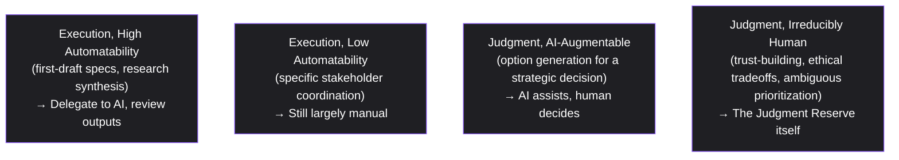

# Lesson 89: The Future of Product Management

## Why This Lesson Matters

This curriculum has spent eighty-eight lessons building frameworks for a discipline that is, itself, changing quickly. Lesson 84 established that AI-native product work requires distinguishing model capability from reliability; Lesson 65's Ownership Zones Model established that a model's output should never substitute for human judgment about business context. This lesson turns those same tools toward the PM's own work, asking a direct and increasingly urgent question: as AI tools become genuinely capable at drafting specs, synthesizing research, and generating roadmap options, what part of product management remains irreducibly human, and what part is becoming something a PM increasingly delegates rather than personally performs?

A PM encountering AI tools for the first time, and seeing them draft a competent first version of a spec or synthesize a pile of user interviews into a clean summary, faces a specific and understandable temptation: to treat these outputs as substitutes for the underlying judgment those tasks were always meant to exercise, rather than as inputs that still require a human decision-maker to evaluate, contextualize, and take responsibility for. This is precisely the Ownership Zones Model's Zone 4 concern from Lesson 65, now applied to the PM's own daily practice rather than to a customer-facing model. The specific discipline this lesson closes with is distinguishing genuinely delegable execution work from the judgment work that remains a PM's actual, durable contribution.

---

## Learning Path

| Field | Detail |
|---|---|
| **Module** | 9 — Specialized Domains and Synthesis |
| **Current Lesson** | 89 of 90 |
| **Difficulty** | 6 / 10 |
| **Estimated Study Time** | 40 minutes (reading) + 15 minutes (reflection + quiz) |
| **Prerequisites** | Lesson 65 (Ownership Zones Model), Lesson 84 (Capability-Reliability Matrix), Lesson 1 (responsibility without authority) |
| **Next Lesson** | Lesson 90 — Capstone: Advanced Product Philosophy at Scale |
| **Future Topics Unlocked** | Lesson 90 (Capstone) — draws on the PM Judgment Reserve as established canon for the curriculum's closing synthesis |

---

## Learning Objectives

By the end of this lesson, you will be able to:

1. Explain why AI tool capability at drafting and synthesis tasks doesn't eliminate the need for human PM judgment.
2. Apply the PM Judgment Reserve model to distinguish delegable execution work from irreducibly human judgment work.
3. Identify the specific risk of treating AI-generated outputs as substitutes for judgment rather than inputs to it.
4. Explain why trust-building and ethical tradeoff reasoning remain durably human PM responsibilities.
5. Evaluate a PM's own working practices for whether AI tool use is augmenting judgment or quietly replacing it.

---

## Prerequisites

This lesson assumes the Ownership Zones Model from Lesson 65 and the Capability-Reliability Matrix from Lesson 84, applied here to the PM's own daily practice, and the "responsibility without authority" concept from Lesson 1, since a PM's accountability for outcomes doesn't diminish just because a tool assisted in producing an artifact.

---

## Theory

### Why AI Capability at Drafting Doesn't Eliminate Judgment

An AI tool can draft a competent first-version spec, summarize a pile of user research, or generate several roadmap options quickly. What it cannot do is take accountability for whether the spec addresses the actual business context, whether the research summary captured the nuance that matters for this specific decision, or which roadmap option best fits constraints the tool wasn't given full visibility into. This is the same capability-versus-reliability distinction from Lesson 84, applied to text generation rather than a customer-facing decision: a draft can be impressively fluent and still miss exactly the judgment call that made the task worth doing in the first place.

### The PM Judgment Reserve

This lesson introduces the **PM Judgment Reserve**, distinguishing four categories of PM work:

Quadrant D — trust-building with stakeholders, navigating genuine ethical tradeoffs, making a prioritization call under irreducible ambiguity where reasonable people would disagree — is what this lesson calls the **Judgment Reserve**: the part of PM work that doesn't shrink as AI tools improve, because it depends on accountability, relationship, and context no tool can hold. A PM whose time increasingly shifts toward quadrant A tasks, treating AI drafts as final outputs rather than inputs requiring quadrant D judgment, is not becoming more efficient — they are quietly abdicating the part of the job that was always the actual point.

### The Risk of Treating Outputs as Substitutes for Judgment

The specific failure mode this lesson warns against is accepting an AI-generated artifact — a spec, a synthesis, a roadmap — without applying the same judgment a PM would have applied to their own draft, on the reasoning that the tool's output already looks polished and complete. Polish is not the same as correctness, and a fluent, well-organized draft can still contain a judgment error invisible to a reviewer who has stopped actively exercising judgment because the artifact already looks finished.

### Why the Erosion Is Gradual and Easy to Miss

Nobody wakes up one day and decides to stop exercising judgment. The shift this lesson describes happens gradually, one individually reasonable time-saving choice at a time: skipping a second read-through on a draft that looked clean the first time, accepting a synthesis's framing because re-deriving it independently would take longer than the meeting allows, deferring to a tool's suggested prioritization because it's plausible and the PM is behind on other work. Each individual choice is defensible in isolation, which is exactly what makes the pattern hard to notice from the inside — there is rarely a single moment that feels like abdication, only an accumulation of small deferrals that, over months, can leave a PM meaningfully less engaged with the judgment calls their role actually exists to make. This mirrors the same gradual-accumulation dynamic described in Lesson 88's discussion of coherence overextension: both failure modes develop through a series of individually reasonable steps, and both require a deliberate, periodic check — rather than a single moment of obvious crisis — to catch before the accumulated drift becomes hard to reverse.

---

## Common Beginner Mistakes

**Mistake 1: Treating AI-generated drafts as finished outputs rather than inputs requiring human judgment**

An AI tool can draft a competent first-version spec, summarize a pile of user research, or generate several roadmap options quickly, but it cannot take accountability for whether the draft addresses the actual business context or captures the nuance that matters for this specific decision. A PM who accepts a draft as finished because it already looks polished and complete has stopped exercising exactly the judgment the role exists to apply. Treating every AI output as a first input to review, not a last output to ship, is the discipline this lesson is built around.

**Mistake 2: Shifting time toward automatable execution tasks while under-investing in irreducibly human judgment work**

A PM whose time increasingly shifts toward quadrant A, delegable tasks — first-draft specs, research synthesis — is not automatically becoming more efficient; if that shift comes at the expense of quadrant D work (trust-building, ethical tradeoffs, ambiguous prioritization calls), they are quietly abdicating the part of the job that was always the actual point. The Judgment Reserve doesn't shrink as AI tools improve, because it depends on accountability, relationship, and context no tool can hold. Efficiency gains on the automatable side of the work are only a genuine win if the freed time is reinvested in the judgment side, not simply absorbed into doing more automatable tasks.

**Mistake 3: Assuming a fluent, polished AI output is automatically correct, treating its coherence as evidence that independent re-derivation would be redundant**

Polish is not the same as correctness, and a fluent, well-organized draft can still contain a judgment error invisible to a reviewer who has stopped actively exercising judgment because the artifact already looks finished. This is especially risky because the tool never had visibility into the specific context — internal constraints, political sensitivities, the exact history behind a decision — that genuine judgment requires; a coherent-sounding output can be coherent and wrong at the same time, with no visible signal distinguishing the two cases. Treating apparent polish as a reason to skip independent verification is precisely how a subtle, confidently-stated error makes it into a shipped decision.

**Mistake 4: Using AI tools to avoid, rather than inform, a genuinely difficult stakeholder conversation or ethical tradeoff**

It's tempting to let an AI-drafted message or summary stand in for a conversation a PM would rather not have directly — a difficult piece of stakeholder feedback, a tradeoff with no comfortable answer — but this substitutes a tool's fluency for the PM's own accountability in exactly the situations that most require it. Quadrant D judgment calls, by definition, involve genuine ambiguity or discomfort that a tool cannot resolve on the PM's behalf; using AI output to soften or sidestep that discomfort doesn't make the underlying tradeoff go away, it just delays the moment someone has to actually own it. AI tools can inform this kind of conversation by organizing relevant facts or surfacing options, but they cannot have it.

**Mistake 5: Failing to recognize that accountability for an outcome doesn't diminish just because a tool assisted in producing the artifact behind it**

A PM remains accountable for a decision's outcome regardless of how much of the underlying artifact — a spec, a synthesis, a roadmap option — was produced with AI assistance. "The tool generated it" is not a defense for an error that reached a user or a stakeholder, in the same way a PM couldn't previously defend a mistake by pointing to a template or a junior team member's draft. AI assistance changes how much of the execution work a PM does personally, but it does not change who is answerable when the resulting decision turns out to be wrong.
---

## Mental Model: The PM Judgment Reserve

Ask: (1) Which quadrant does this task actually occupy — automatable execution, or irreducibly human judgment? (2) If AI-assisted, is the output being treated as a reviewable input requiring judgment, or as a finished substitute for it? (3) Is time increasingly shifting away from quadrant D work, and if so, is that erosion deliberate or accidental?

---

## Real Company Example

**Linear**'s product-development culture is directly documented through on-record interviews with its own founders, not just industry reputation. CEO Karri Saarinen described the company's approach directly to Lenny's Newsletter: Linear runs with no dedicated product managers (PM duties are distributed across engineering and design), no durable cross-functional teams (small teams assemble around a specific project and disperse once it ships), no metrics-based goals beyond a single company-level North Star, and explicitly "no A/B tests" — Saarinen stated decisions are based on "taste and opinions" rather than statistical testing. Co-founder and CTO Tuomas Artman separately told The Pragmatic Engineer that this was a deliberate reaction to his own experience at Uber during its hypergrowth phase, when engineering headcount doubled or tripled annually — he explicitly said he didn't want to see that pattern repeat, and Linear has instead invested in strong internal infrastructure specifically to let a small team (fewer than 50 people, even years after founding, per Saarinen's own account) build and ship a product that competes directly with much larger incumbents.

This is a genuinely distinct model from the industry default this lesson's own theory addresses, not a minor stylistic variation: Linear's founders made a considered, explicit trade — accepting slower hiring and a smaller organization — specifically to preserve the kind of concentrated human judgment (over both product decisions and code quality) that becomes harder to maintain as headcount and process both grow. Whether that trade generalizes to organizations of very different scale or market position is a separate question this lesson doesn't claim to answer — but Linear's own account of *why* they made it is a genuine, sourced data point for the tension between judgment-preserving small teams and reactive scaling that this lesson explores.

*(Source: Karri Saarinen's on-record interview with Lenny's Newsletter (2023) and Tuomas Artman's on-record interview with The Pragmatic Engineer (2022).)*

---

## Real World Perspective: The Future of Product Management at Different Company Stages

**At a startup:** Early-stage PMs, often the only PM at the company, face the most acute pressure to delegate execution tasks to AI tools simply due to limited time, making deliberate protection of Judgment Reserve time especially important. Paradoxically, this is also the stage where the cost of misapplied judgment is often highest relative to the company's resources — a solo PM has no second reviewer to catch a strategic misweighting before it reaches the founders or an investor, unlike a PM embedded in a larger organization with more built-in review.

**At a mid-size company:** This is typically where AI tool adoption first becomes widespread across a growing PM organization, making inconsistent judgment-versus-delegation practices across individual PMs a genuine organizational concern rather than an individual one. Some PMs on a given team may be conscientiously reviewing every AI-assisted artifact with real judgment, while others, under similar time pressure, may have drifted toward the Unreviewed Roadmap failure pattern without anyone else noticing, since the resulting artifacts look similarly polished regardless of how much genuine review went into them.

**At Big Tech:** Large organizations increasingly formalize guidance on where AI tools should assist versus where human judgment must remain primary, echoing the Ownership Zones Model's Zone 4 discipline applied at an organizational policy level. This formalization often includes explicit review requirements for judgment-sensitive artifact types — a roadmap or a pricing decision might require documented sign-off confirming a human reviewed the strategic weighting, not just the surface content, precisely because polish alone is not considered sufficient evidence that judgment was actually applied.

---

## Detailed Case Study: The Unreviewed Roadmap

A PM, under significant time pressure, used an AI tool to generate a full quarterly roadmap draft based on a summary of recent customer feedback and internal priorities, and presented it to leadership with only minor edits, reasoning that the tool's synthesis was thorough and well-organized. The roadmap, while polished, had weighted several customer feedback themes according to raw frequency rather than strategic importance, missing a specific, lower-volume but high-stakes concern from the company's largest enterprise account — a nuance the PM would ordinarily have caught through their own direct judgment about that account's strategic significance, per the Stakeholder Compass concept from Lesson 73.

**What went wrong?** The PM treated a quadrant A output (AI-drafted synthesis) as though it had already incorporated quadrant D judgment (strategic weighting specific to account importance), when the tool had no visibility into which customer concerns carried outsized strategic weight. The roadmap's polish masked the absence of the judgment step that should have reviewed and reweighted its priorities before presentation. In the post-mortem conversation, the PM described a specific, recognizable internal reasoning: the synthesis had organized the feedback themes clearly, cited specific customer quotes accurately, and looked, on its face, like exactly the kind of thorough document they would have produced themselves given enough time — which made it feel redundant to re-derive the same prioritization independently rather than simply confirming the output looked reasonable.

That felt-redundancy is precisely the trap this lesson's Theory section describes: the tool's synthesis was accurate as a summary of what customers said, but the strategic weighting of which concerns mattered most was never something the tool could have performed, since it required knowledge of the enterprise account's specific commercial importance that existed only in the PM's head and in conversations the tool was never part of. Recovery involved the PM reviewing and substantially reweighting the roadmap before finalizing it, and adopting a personal practice of explicitly annotating which parts of any AI-assisted artifact still required deliberate judgment review before use — a lightweight habit that took only a few extra minutes per artifact but reliably forced the specific reasoning step that had gone missing.

1. What made the AI-generated synthesis feel redundant to independently re-derive, and why was that feeling misleading in this specific case?
2. If you adopted the annotation habit described in the recovery, what would you specifically flag as "still requires judgment" the next time you use an AI tool to draft something for your own work?

---

## Framework Explanation: The Future-Ready PM Skills Checklist

| Skill | Why It Remains Durably Human | Risk if Neglected |
|---|---|---|
| Judgment Under Ambiguity | Reasonable people can disagree; no tool resolves genuine ambiguity | Decisions default to whatever an AI tool weights most heavily, missing strategic nuance |
| Stakeholder Trust-Building | Trust is relational and accountability-based, not generatable by a tool | Stakeholder relationships erode even as artifacts look polished |
| Ethical Tradeoff Reasoning | Ethical stakes require accountability a tool cannot hold | Harmful tradeoffs go unexamined behind fluent-sounding justifications |
| Systems-Level Thinking | Connecting many frameworks (as in Lessons 70 and 80) requires judgment across models | Isolated, single-lens diagnosis of multi-dimensional problems |
| AI-Tool Fluency | Knowing what to delegate and what to review keeps quadrant D time protected | Either under-using helpful tools or over-delegating judgment work |

Notice that this checklist is not an argument against using AI tools — the risk column throughout is about misapplied delegation, not tool use itself. A PM who never uses AI assistance for drafting or synthesis isn't automatically better positioned on this checklist; they may simply be spending scarce time on quadrant A work that could have been safely delegated, leaving less time for the quadrant D work the checklist actually protects. The discipline this lesson asks for is precise allocation, not blanket avoidance.

---

## Interview Perspective: How Interviewers Think About This

**Typical question 1: "How do you use AI tools in your PM work, and where do you draw the line on what to delegate?"**
*What the interviewer is actually evaluating:* Whether you have a deliberate, articulable line or an implicit, unexamined one. A weak answer describes using AI tools "for everything that saves time" without distinguishing task types. A strong answer names the Judgment Reserve distinction explicitly — delegating drafting and synthesis, retaining review and strategic weighting — and gives a concrete example of a task they deliberately keep manual.

**Typical question 2: "Tell me about a time an AI-generated draft missed something important."**
*What the interviewer is actually evaluating:* Whether you actually catch these misses in practice, or whether you're speaking hypothetically. A strong answer, ideally grounded in a real example, names specifically what context the tool lacked (like account-specific strategic importance in this lesson's Case Study) and what habit of review caught the gap before it caused harm.

**Typical question 3: "What parts of product management do you think will remain fundamentally human as AI tools improve?"**
*What the interviewer is actually evaluating:* Whether your answer is a specific, defensible claim or a vague gesture at "creativity" or "strategy." A strong answer names concrete categories — trust-building with stakeholders who need to believe a person, not a tool, is accountable to them; ethical tradeoffs where the stakes of being wrong require a human who can be held responsible; ambiguous prioritization calls where reasonable people genuinely disagree and a tool's confident-sounding output doesn't actually resolve the disagreement.

---

## Summary

AI tools' growing capability at drafting and synthesis tasks doesn't eliminate the need for PM judgment; it shifts where that judgment needs to be applied, from generating a first draft to reviewing, contextualizing, and taking accountability for one. The PM Judgment Reserve distinguishes automatable execution work from the irreducibly human judgment work — trust-building, ethical tradeoffs, ambiguous prioritization — that doesn't shrink as tools improve, because it depends on accountability and context no tool can hold. The specific risk this lesson warns against is treating a polished, fluent AI output as a finished substitute for judgment rather than an input still requiring it, exactly the mistake this lesson's Case Study illustrates through a roadmap that looked thorough but had never actually been reweighted by the strategic judgment its presentation implied. This erosion, worth restating plainly, rarely announces itself — it accumulates through individually reasonable choices to skip a review step that, on any single occasion, seemed unlikely to matter. As this curriculum closes toward its final synthesis, it's worth naming what has actually been under construction across eighty-nine lessons: not a set of frameworks to be applied mechanically, but the judgment to know when a framework applies, when it doesn't, and when the situation in front of you requires something no framework yet named. That judgment was never going to be automatable, and it is the actual, durable answer to what a PM's role becomes as the tools around it keep changing.

---

## Key Takeaways

- AI tool capability at drafting doesn't eliminate the need for human PM judgment; it shifts where judgment is applied.
- The PM Judgment Reserve distinguishes automatable execution from irreducibly human judgment work.
- Trust-building, ethical tradeoffs, and ambiguous prioritization remain durably human responsibilities.
- Polish is not the same as correctness; a fluent AI output can still miss critical judgment calls.
- Accountability for an outcome doesn't diminish just because a tool assisted in producing the artifact.
- Time increasingly shifting toward automatable execution work risks quietly eroding judgment work.
- Deliberate protection of Judgment Reserve time is an active practice, not a passive default.
- Judgment erosion is gradual and accumulates through individually reasonable deferrals, not one obvious moment.

---

## Cheat Sheet

*A two-minute review of everything in this lesson.*

- Judgment Reserve: trust-building, ethics, ambiguous prioritization — durably human.
- AI drafts are inputs, not finished outputs. Review, don't just accept.
- Polish ≠ correctness.
- Protect judgment-work time deliberately as automatable work grows.
- Watch for the felt-redundancy trap: a tool's coherence isn't evidence it captured context only you have.
- This checklist isn't anti-AI-tool — it's about precise delegation, not blanket avoidance.

---

## Glossary

| Term | Definition | Related Concepts | Difficulty |
|---|---|---|---|
| PM Judgment Reserve | The category of PM work that remains irreducibly human regardless of AI tool capability | Ownership Zones Model (Lesson 65) | 2 |
| Judgment Under Ambiguity | Decision-making where reasonable people would disagree and no tool resolves the ambiguity | PM Judgment Reserve | 2 |
| Felt-Redundancy Trap | The mistaken sense that re-deriving a judgment independently is unnecessary because a tool's output already looks thorough and well-organized | PM Judgment Reserve | 3 |

---

## Further Reading / Resources

- Marty Cagan and Chris Jones, *Empowered*
- Brian Christian, *The Alignment Problem*
- Daniel Kahneman, *Thinking, Fast and Slow*

---

## Flashcards

**Card 1**
- Front: Why doesn't AI capability at drafting eliminate the need for PM judgment?
- Back: A tool can produce a fluent, polished draft while missing exactly the accountability and context-dependent judgment call that made the task worth doing.
- Difficulty: 2
- Tags: future-of-pm

**Card 2**
- Front: What are the four quadrants of the PM Judgment Reserve model?
- Back: Execution/high-automatability, execution/low-automatability, judgment/AI-augmentable, judgment/irreducibly human.
- Difficulty: 2
- Tags: judgment-reserve

**Card 3**
- Front: Why is polish not the same as correctness?
- Back: A fluent, well-organized AI output can still contain a judgment error invisible to a reviewer who stops actively exercising judgment because it already looks finished.
- Difficulty: 2
- Tags: polish-vs-correctness

**Card 4**
- Front: What went wrong in the Unreviewed Roadmap case study?
- Back: An AI-generated roadmap weighted feedback by raw frequency, missing a low-volume but high-stakes enterprise concern the PM would ordinarily have caught through direct judgment.
- Difficulty: 2
- Tags: case-study

**Card 5**
- Front: Why is judgment-reserve erosion gradual and hard to notice from the inside?
- Back: It happens through a series of individually reasonable, small time-saving deferrals rather than one obvious moment of abdication — the same gradual-accumulation dynamic as Lesson 88's coherence overextension.
- Difficulty: 2
- Tags: judgment-erosion

**Card 6**
- Front: What is the "felt-redundancy trap" described in the Unreviewed Roadmap case study?
- Back: The mistaken sense that re-deriving a judgment independently is unnecessary because a tool's output already looks thorough — misleading because the tool never had visibility into the specific strategic context that judgment required.
- Difficulty: 2
- Tags: case-study, judgment-reserve

## Reflection Exercise

You increasingly use AI tools to draft specs and synthesize user research.

There is no single correct answer. Work through the following before reading further.

1. Which of your current PM tasks fall into each of the four Judgment Reserve quadrants?
2. What signal would tell you that you've started treating an AI draft as a finished output rather than an input?
3. How would you protect time for irreducibly human judgment work as automatable tasks grow?
4. What stakeholder relationship or ethical tradeoff in your current work most clearly requires your own direct judgment?
5. How would you explain the Judgment Reserve concept to a colleague who believes AI tools will eventually replace most PM judgment entirely?

---

## Quiz

**1. Why doesn't AI capability at drafting eliminate the need for PM judgment?**
A) A fluent draft can still miss the judgment the task required
B) AI tools always incorporate full business context alone
C) PM judgment is no longer relevant in any context
D) AI tools are never actually capable of useful drafts

*Correct answer: A*
*Explanation: A fluent draft can still miss the accountability and context-dependent judgment that made the task worth doing, so AI capability at drafting doesn't eliminate the need for PM judgment.*
*Learning objective tested: #1*
*Difficulty: Easy*

---

**2. What are the four quadrants of the PM Judgment Reserve model?**
A) Two execution tiers and two judgment tiers, split by automation
B) Data intake, process design, product outcome, and liability
C) Land the deal, expand usage, retain accounts, then grow it
D) Initial concept, working prototype, market pilot, full scale

*Correct answer: A*
*Explanation: The four quadrants are execution/high-automatability, execution/low-automatability, judgment/AI-augmentable, and judgment/irreducibly human.*
*Learning objective tested: #2*
*Difficulty: Easy*

---

**3. What defines the "Judgment Reserve" quadrant specifically?**
A) Tasks that are easily automated by any AI tool
B) Tasks that require no human involvement at all
C) Trust-building and ethics that don't shrink as tools improve
D) Only tasks strictly related to spec-writing

*Correct answer: C*
*Explanation: Trust-building, ethical tradeoffs, and ambiguous prioritization don't shrink as tools improve — these are the irreducibly human responsibilities.*
*Learning objective tested: #2, #4*
*Difficulty: Easy*

---

**4. Why is polish not the same as correctness?**
A) Polished outputs are always correct by definition
B) A fluent output can still hide an error a reviewer misses
C) Correctness never actually matters for PM artifacts
D) Polish and correctness are actually identical concepts

*Correct answer: B*
*Explanation: A fluent, well-organized output can still contain a judgment error invisible to a reviewer who stops actively exercising judgment.*
*Learning objective tested: #3*
*Difficulty: Easy*

---

**5. What was the root cause of the Unreviewed Roadmap case study's failure?**
A) The PM treated the draft as already strategically weighted
B) The PM never used any AI tool during the process
C) The roadmap was rejected immediately by leadership
D) The AI tool refused to generate any roadmap at all

*Correct answer: A*
*Explanation: The PM treated an AI-drafted synthesis as though it had already incorporated strategic judgment about account importance, which the tool had no visibility into.*
*Learning objective tested: #3, #5*
*Difficulty: Easy*

---

**6. What specific nuance did the AI-generated roadmap miss in the case study?**
A) All customer feedback themes were missed entirely
B) A low-volume but high-stakes enterprise account concern
C) A high-volume but genuinely low-importance concern
D) A purely cosmetic formatting issue in the document

*Correct answer: B*
*Explanation: A low-volume but high-stakes concern from the company's largest enterprise account was missed because the tool lacked visibility into strategic account importance.*
*Learning objective tested: #3, #5*
*Difficulty: Easy*

---

**7. Why does trust-building remain a durably human PM responsibility, per the Future-Ready PM Skills Checklist?**
A) Trust is generatable by any sufficiently advanced AI tool
B) Trust-building is genuinely irrelevant to product work
C) Trust is relational and accountability-based, not tool-held
D) AI tools have already fully replaced trust-building

*Correct answer: C*
*Explanation: Trust is relational and accountability-based, not something a tool can hold, making it a durably human PM responsibility.*
*Learning objective tested: #4*
*Difficulty: Medium*

---

**8. According to the checklist, what risk does neglecting "Judgment Under Ambiguity" create?**
A) No risk; ambiguity always resolves itself automatically
B) This skill carries no relevance to modern product work
C) Ambiguity never actually occurs in real product decisions
D) Decisions default to whatever the AI tool weights most

*Correct answer: D*
*Explanation: Decisions default to whatever an AI tool weights most heavily, missing strategic nuance when judgment under ambiguity is neglected.*
*Learning objective tested: #4, #5*
*Difficulty: Medium*

---

**9. Why might early-stage, solo PMs face especially acute pressure to over-delegate to AI tools, per the Real World Perspective section?**
A) Early-stage PMs never actually use AI tools at all
B) Limited time as the only PM pressures delegating execution
C) This specific pressure only exists at mature, large firms
D) Early companies are barred by law from AI tool use

*Correct answer: B*
*Explanation: Limited time as the only PM at the company creates pressure to delegate execution tasks, making deliberate Judgment Reserve protection especially important.*
*Learning objective tested: #1, #5*
*Difficulty: Medium*

---

**10. What are large organizations increasingly formalizing, per the Real World Perspective section?**
A) A complete and blanket ban on all AI tool usage
B) A policy demanding full AI automation of all tasks
C) Guidance on where AI assists versus where judgment leads
D) No guidance whatsoever regarding AI tool use

*Correct answer: C*
*Explanation: Large organizations are increasingly formalizing guidance on where AI tools should assist versus where human judgment must remain primary.*
*Learning objective tested: #5*
*Difficulty: Medium*

---

**11. How does the PM Judgment Reserve connect to the Ownership Zones Model from Lesson 65?**
A) There is no meaningful connection between the two ideas
B) It applies Zone 4's discipline to the PM's own artifacts
C) The Zones Model only ever applies to customer decisions
D) The Judgment Reserve replaces the Zones Model entirely

*Correct answer: B*
*Explanation: It applies the same Zone 4 discipline — that a model's output shouldn't substitute for human judgment — to the PM's own artifacts.*
*Learning objective tested: #1, #4*
*Difficulty: Medium*

---

**12. (Scenario) A PM presents an AI-generated roadmap to leadership with only minor edits, treating it as essentially finished. What risk does this represent?**
A) No risk; AI content is always ready to present
B) A risk that only ever applies to hardware roadmaps
C) No risk, since leadership always catches errors
D) That strategic weighting judgment was never applied

*Correct answer: D*
*Explanation: The risk is that quadrant D judgment (strategic weighting) was never actually applied, despite the artifact's polished appearance.*
*Learning objective tested: #3, #5*
*Difficulty: Medium-Hard*

---

**13. (Product Thinking) A PM wants to use AI tools to draft all future specs with minimal review, citing time savings. What is the strongest response?**
A) Treat drafts as inputs needing review, not finished output
B) Prohibit any AI tool use across the team entirely
C) Agree, but only for specs under a set word count
D) Agree fully, since time savings are the top priority

*Correct answer: A*
*Explanation: Drafts should be treated as inputs requiring judgment review, not finished substitutes, particularly regarding context the tool couldn't have known.*
*Learning objective tested: #3, #5*
*Difficulty: Hard*

---

**14. (Interview Reasoning) A candidate, asked how AI tools affect their PM work, describes using them to fully automate stakeholder prioritization decisions with no further review. What does this signal?**
A) A strong and complete grasp of future-ready practice
B) Readiness for a senior PM role right away
C) A gap in placing ambiguous prioritization outside judgment
D) Nothing meaningful; full automation is always fine here

*Correct answer: C*
*Explanation: A gap in recognizing that ambiguous, stakeholder-sensitive prioritization belongs in the irreducibly human Judgment Reserve.*
*Learning objective tested: #2, #4, #5*
*Difficulty: Hard*

---

**15. (Product Thinking, Highest Difficulty) A PM organization is adopting AI tools widely, and some PMs have begun presenting AI-drafted artifacts with minimal review, citing efficiency gains. Using only this lesson's frameworks, what is the most defensible organizational response?**
A) Encourage full delegation to AI across every PM task
B) Ban all AI tool usage across the organization entirely
C) Take no action, since efficiency is the only factor
D) Require deliberate human review before judgment-sensitive use

*Correct answer: D*
*Explanation: Establish clear guidance distinguishing automatable execution work from the Judgment Reserve, requiring deliberate human review of AI-assisted artifacts before use in judgment-sensitive contexts.*
*Learning objective tested: #1, #2, #3, #4, #5*
*Difficulty: Hard*

---

## Connections

| | Lesson | Core Idea Carried Forward |
|---|---|---|
| **Previous Lesson** | Lesson 88 — Building and Scaling a Product Organization | Shifts from organizational structure to the PM discipline's own evolving practice |
| **Current Lesson** | Lesson 89 — The Future of Product Management | PM Judgment Reserve; delegable execution vs. irreducibly human judgment |
| **Next Lesson** | Lesson 90 — Capstone: Advanced Product Philosophy at Scale | Closes the curriculum with a final synthesis across all ninety lessons |
| **Future Concepts Unlocked** | Lesson 90 (Capstone) | Treats the PM Judgment Reserve as established canon for the curriculum's closing synthesis |

This curriculum continues to build as one continuous argument. From this lesson forward, any reference to AI tool use in PM practice assumes you can locate it on the PM Judgment Reserve without re-explanation.
