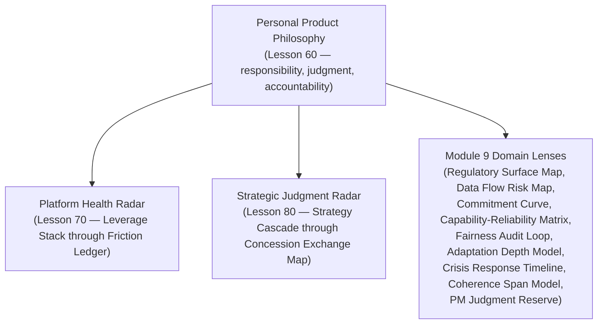

# Lesson 90: Capstone: Advanced Product Philosophy at Scale

## Why This Lesson Matters

Lesson 60 closed the foundational six modules of this curriculum by asking you to consolidate everything you had learned into a personal product philosophy — your own answer to what a PM is actually accountable for. At the time, that felt like an ending. It was, instead, a checkpoint. Modules 7, 8, and 9 have spent thirty lessons stress-testing that philosophy against progressively harder terrain: platforms where your users are other builders, strategy where a single bet must be falsifiable across years, and specialized domains — regulation, privacy, hardware, AI, fairness, international markets, crises, organizational scale, and the changing shape of the job itself — where the simple frameworks from early modules had to be extended, combined, and sometimes reconsidered entirely.

This final lesson does not introduce new theory in the way the other eighty-nine lessons did. It does what Lessons 70 and 80 modeled for their own modules, but at the scale of the entire curriculum: it asks you to hold everything you've learned — from the Accountability Triangle in Lesson 1 to the PM Judgment Reserve in Lesson 89 — as a single, integrated practice, and to recognize that the actual skill this curriculum has been building, all along, was never any individual framework. It was judgment: the ability to look at a real, messy, ambiguous situation and know which of the many tools you now carry actually applies.

---

## Learning Path

| Field | Detail |
|---|---|
| **Module** | 9 — Specialized Domains and Synthesis |
| **Current Lesson** | 90 of 90 |
| **Difficulty** | 8 / 10 |
| **Estimated Study Time** | 60 minutes (reading) + 30 minutes (reflection + quiz) |
| **Prerequisites** | Lesson 60 (Product Philosophy), Lesson 70 (Platform Health Radar), Lesson 80 (Strategic Judgment Radar), Lessons 81–89 (all Module 9 lenses) |
| **Next Lesson** | None — this is the final lesson of the 90-lesson curriculum |
| **Future Topics Unlocked** | None — this lesson is the curriculum's closing synthesis |

---

## Learning Objectives

By the end of this lesson, you will be able to:

1. Recall the major integrating tools built across this curriculum — the Accountability Triangle, the Platform Health Radar, the Strategic Judgment Radar, and Module 9's specialized domain lenses — and the level of practice each operates at.
2. Apply the Integrated Practice Wheel to select which combination of tools from across all ninety lessons applies to a genuinely novel, multi-domain situation.
3. Explain how your Lesson 60 product philosophy should have evolved, not been discarded, through Modules 7–9's stress-testing.
4. Distinguish situations calling for platform-level diagnosis, strategic-level diagnosis, and specialized-domain diagnosis, and situations requiring more than one simultaneously.
5. Evaluate a complex, realistic scenario spanning multiple domains by correctly identifying which tools are primary and which are secondary, and articulate your own updated product philosophy in light of the full curriculum.

---

## Prerequisites

This lesson assumes your own personal product philosophy from Lesson 60, the Platform Health Radar from Lesson 70, the Strategic Judgment Radar from Lesson 80, and fluency with Module 9's nine specialized lenses (Lessons 81–89). It is, deliberately, the most integration-dependent lesson in the curriculum.

---

## Theory

### Why This Lesson Cannot Introduce New Theory

Every synthesis lesson in this curriculum — Lesson 60, Lesson 70, Lesson 80 — has followed the same principle: at the close of a body of material, the highest-value work is not learning one more thing, but recognizing how everything already learned fits together. This lesson follows that principle at the largest scale the curriculum offers. Introducing a tenth new mental model here, on top of the roughly nineteen introduced across Lessons 61 through 89, would repeat the exact mistake Lesson 70 warned against: mistaking addition for integration.

### The Integrated Practice Wheel

This lesson introduces the **Integrated Practice Wheel**, not as a new diagnostic model in the sense the other eighty-nine lessons' models were, but as a map of the curriculum itself:

The Wheel's discipline is recognizing that these three outer rings operate at genuinely different levels of a real situation, and a skilled PM moves fluidly among them rather than defaulting to whichever ring they happen to feel most comfortable in. The Platform Health Radar diagnoses mechanism — is the developer surface stable, is the marketplace liquid, is the enforcement proportionate. The Strategic Judgment Radar diagnoses direction — is the bet falsifiable, is the moat durable, is the deal being negotiated efficiently. Module 9's lenses diagnose context — does this specific domain (regulation, AI, hardware, a new country, a live crisis, an organization's own structure) impose constraints the first two rings don't natively account for. And at the center, unchanged in kind since Lesson 60 but considerably deepened in practice, sits the same personal accountability that has anchored this entire curriculum: the PM's responsibility for outcomes, exercised through judgment that no framework, however well designed, can substitute for.

### How Your Product Philosophy Should Have Evolved

Lesson 60 asked you to articulate what a PM is accountable for. If Modules 7 through 9 have done their job, that articulation should now be considerably more textured than it was at Lesson 60 — not replaced, but stress-tested against platform ecosystems, falsifiable multi-year bets, regulatory liability, AI reliability, fairness across populations, international structural variance, live crisis communication, and organizational coherence limits. A philosophy that hasn't had to bend at all across thirty additional lessons of genuinely hard material was probably too vague to begin with; a philosophy that bent so much it lost its original shape probably wasn't anchored in anything durable. The right outcome is a philosophy that has been genuinely extended — the same core commitments from Lesson 60, now specified concretely enough to survive contact with an ecosystem you don't control, a bet that takes years to prove out, and a crisis that demands an honest answer in real time.

---

## Common Beginner Mistakes

1. **Treating this capstone as a request for one more new framework rather than an integration exercise.**
2. **Applying only the ring of the Wheel you're most comfortable with — mechanism, direction, or domain — to a problem that actually spans two or three.**
3. **Discarding your Lesson 60 philosophy as "too simple" rather than recognizing it as the durable core the rest of the curriculum was meant to specify, not replace.**
4. **Treating the nineteen mental models from Lessons 61–89 as a list to recite rather than a set of tools to select from deliberately.**
5. **Assuming mastery of this curriculum means having memorized every model, rather than having built the judgment to know which few actually matter for the situation in front of you.**

---

## Mental Model: The Integrated Practice Wheel

Applying the Wheel to any complex, real situation means asking, in sequence: (1) Is this fundamentally a mechanism problem — something the Platform Health Radar's nine axes would diagnose? (2) Is this fundamentally a direction problem — something the Strategic Judgment Radar's nine axes would diagnose? (3) Does this situation sit in a specialized domain — regulated, AI-native, hardware, international, in active crisis, or a question of your own organization's structure — requiring one of Module 9's nine lenses layered on top of the first two rings? (4) Having identified which rings actually apply, what does your own center — your accountability, your judgment, the philosophy you first articulated in Lesson 60 — tell you to actually do about it?

---

## Real Company Example

Alphabet, spanning Google's search and advertising platform, its cloud infrastructure business, its AI research and product efforts, its hardware division, and its history of navigating antitrust and international regulatory scrutiny across many jurisdictions simultaneously, is a useful final synthesis example precisely because no single lesson in this curriculum could describe its full strategic reality. Public commentary across many sources has, at different points, discussed the company through nearly every lens this curriculum has built: platform ecosystem dynamics reminiscent of Lesson 61's Leverage Stack, strategic bet-making across genuinely different time horizons per Lesson 71's Three Horizons, and regulatory, AI-reliability, and international-scaling questions spanning Module 9 entirely. A company at this scale requires exactly the fluid, multi-ring diagnosis the Integrated Practice Wheel describes, rather than any single lesson's framework applied in isolation.

**Assumption flagged:** the specifics of Alphabet's internal strategic and organizational decisions described here are drawn from public commentary and industry reporting across many sources, not confirmed internal statements, and should be treated as illustrative rather than verified fact.

---

## Real World Perspective

**Startup:** Most of your early career will draw primarily from the Accountability Triangle and Decision Chain established in Lesson 1, with the Wheel's outer rings becoming relevant only as your product, and the situations you face, genuinely grow in complexity.

**Mid-size company:** This is typically where you will first face situations requiring two rings of the Wheel simultaneously — a platform mechanism problem with genuine strategic stakes, or a specialized-domain constraint (a new regulation, a first international market) layered on top of an otherwise familiar platform or strategy question.

**Big Tech:** At this scale, situations routinely require all three rings at once, and the specific, durable value an experienced PM provides is precisely the fluent, fast judgment about which combination applies — the skill this entire curriculum has been built to develop.

---

## Detailed Case Study: The Full-Spectrum Incident

A mid-size fintech company, having recently launched an AI-powered automated loan-underwriting feature in three new international markets, experienced a sudden, visible incident: a spike in loan denials in one specific market, traced initially to a model behavior change following a routine update. Investigating this required, in sequence, nearly every ring of the Integrated Practice Wheel. The Crisis Response Timeline from Lesson 87 governed the immediate response: acknowledge quickly, avoid an overconfident resolution timeline, contain and communicate in parallel. The Capability-Reliability Matrix from Lesson 84 and the Fairness Audit Loop from Lesson 85 governed the technical diagnosis: was this a reliability regression, a disparate-impact issue affecting a specific population disproportionately, or both. The Regulatory Surface Map from Lesson 81 governed the compliance dimension, since the affected market had specific fair-lending requirements the company's home-market compliance framework hadn't fully anticipated — a Structural-depth gap the Adaptation Depth Model from Lesson 86 would have flagged had it been applied more rigorously before launch. The Ownership Zones Model from Lesson 65, reaching all the way back to Module 7, governed the underlying question of whether the automated denial decisions had ever received the human-in-the-loop review this specific regulatory context required.

**What went wrong, and what did the full-spectrum response actually require?** No single lesson's framework, applied alone, would have correctly diagnosed this incident. It required Lesson 87's parallel communication discipline to manage the immediate crisis, Lesson 84 and Lesson 85's technical lenses to diagnose whether the issue was reliability, fairness, or both, Lesson 81's regulatory lens to identify the specific compliance gap, and Lesson 86's adaptation-depth lens to recognize that this gap should have been caught during market entry planning rather than discovered during a live incident. This is precisely the kind of genuinely multi-ring situation the Integrated Practice Wheel exists to help you recognize, rather than allowing any single comfortable lens to produce a partial, incomplete diagnosis.

The company's recovery required addressing all four dimensions simultaneously — the immediate communication, the technical root cause, the regulatory remediation, and a revised international launch process explicitly requiring Adaptation Depth Model review before any future market entry involving automated decisions.

---

## Framework Explanation: The Curriculum Integration Reference

The following table maps this curriculum's major synthesis points, for final reference:

| Synthesis Point | Lesson | What It Integrates |
|---|---|---|
| Personal Product Philosophy | Lesson 60 | The foundational six modules' core accountability concepts |
| Platform Health Radar | Lesson 70 | Module 7's nine platform-mechanism models |
| Strategic Judgment Radar | Lesson 80 | Module 8's nine strategy-and-direction models |
| Integrated Practice Wheel | Lesson 90 (this lesson) | All of the above, plus Module 9's nine specialized-domain lenses |

A genuinely difficult real-world situation will rarely announce which row of this table it belongs to; the practiced skill is recognizing it yourself, under real time pressure, with incomplete information.

---

## Interview Perspective

**"Walk me through the single most complex product situation you've navigated, and how you approached it."** The interviewer is evaluating whether your answer demonstrates fluent movement across multiple levels of diagnosis — mechanism, strategy, and domain-specific context — rather than a story fully explained by a single framework.

**"How has your understanding of what a PM is accountable for changed over your career?"** The interviewer is listening for genuine evolution — a philosophy that has been specified and stress-tested by hard experience, not one that has remained static or been discarded entirely.

**"What do you think separates a good PM from a truly excellent one?"** The interviewer is listening for an answer resembling this curriculum's central claim: not the number of frameworks known, but the judgment to select and combine the right few for the actual situation at hand.

---

## Summary

This curriculum's ninety lessons have built roughly two dozen named mental models, three integrating radars, and one personal product philosophy, and the final lesson's task is not to add a twenty-fifth model but to recognize that genuine mastery was never about the count. The Integrated Practice Wheel places your Lesson 60 philosophy at the center, with the Platform Health Radar diagnosing mechanism, the Strategic Judgment Radar diagnosing direction, and Module 9's specialized lenses diagnosing domain-specific context, and its entire purpose is helping you recognize, in a real and often ambiguous situation, which of these rings actually applies — often more than one at once, as this lesson's Case Study illustrated through an incident that required crisis communication, AI reliability and fairness diagnosis, regulatory compliance, and international adaptation review simultaneously. Your product philosophy should have evolved through Modules 7 through 9, not been discarded or left unchanged — extended and specified by genuinely hard material into something that can survive contact with an ecosystem you don't fully control, a bet that takes years to prove, and a crisis that demands an honest answer in real time. That evolved judgment, not any single framework in this curriculum, is the actual thing ninety lessons have been building toward.

---

## Key Takeaways

- This curriculum's final synthesis is judgment, not a new framework — recognizing which combination of tools applies to a real situation.
- The Integrated Practice Wheel places your personal product philosophy at the center, with the Platform Health Radar (mechanism), Strategic Judgment Radar (direction), and Module 9's lenses (domain context) as outer rings.
- Genuinely complex real-world situations often require more than one ring simultaneously, as the Full-Spectrum Incident case study illustrated.
- Your Lesson 60 product philosophy should have evolved through stress-testing across Modules 7–9, not remained static or been discarded.
- Mastery of this curriculum is not measured by how many of the roughly two dozen named models you can recite, but by the fluent judgment to select the right few for a real situation.
- Each of the curriculum's synthesis lessons (60, 70, 80, 90) modeled the same principle at increasing scale: integration, not addition, is the point.
- The PM's core accountability, first articulated in Lesson 1 and revisited in Lesson 60, remains the unchanged center around which every other tool in this curriculum ultimately organizes.

---

## Cheat Sheet
- This lesson adds no new framework. It asks you to integrate everything.
- Integrated Practice Wheel: Personal philosophy (center) → Platform Health Radar (mechanism) → Strategic Judgment Radar (direction) → Module 9 lenses (domain context).
- Real situations often need more than one ring at once.
- Mastery = judgment to select the right combination, not memorization of every model.
- Your Lesson 60 philosophy should be extended, not discarded, by everything since.

---

## Glossary

| Term | Definition | Related Concepts | Difficulty |
|---|---|---|---|
| Integrated Practice Wheel | A map of the curriculum's three integrating levels — mechanism, direction, domain context — around a personal product philosophy | Platform Health Radar (Lesson 70), Strategic Judgment Radar (Lesson 80) | 3 |
| Full-Spectrum Situation | A real-world scenario requiring more than one ring of the Integrated Practice Wheel simultaneously | Integrated Practice Wheel | 3 |

---

## Further Reading / Resources
1. *Inspired* by Marty Cagan
2. *The Innovator's Dilemma* by Clayton Christensen
3. *Thinking in Systems* by Donella Meadows

---

## Flashcards

**Front:** What does this final lesson add to the curriculum's roster of mental models?
**Back:** No new diagnostic model — it integrates everything already built into the Integrated Practice Wheel.
**Difficulty:** Easy
**Tags:** #capstone

**Front:** What are the three outer rings of the Integrated Practice Wheel?
**Back:** The Platform Health Radar (mechanism), the Strategic Judgment Radar (direction), and Module 9's specialized domain lenses (context).
**Difficulty:** Medium
**Tags:** #integrated-practice-wheel

**Front:** What sits at the center of the Integrated Practice Wheel?
**Back:** The personal product philosophy first articulated in Lesson 60.
**Difficulty:** Easy
**Tags:** #integrated-practice-wheel

**Front:** What did the Full-Spectrum Incident case study require diagnostically?
**Back:** Crisis communication (Lesson 87), AI reliability and fairness diagnosis (Lessons 84–85), regulatory compliance (Lesson 81), and international adaptation review (Lesson 86) — simultaneously.
**Difficulty:** Hard
**Tags:** #case-study

---

## Reflection Exercise

This is the curriculum's final reflection. There is no single correct answer — the goal is genuine synthesis of everything you've studied across ninety lessons.

1. Revisit the product philosophy you articulated at Lesson 60. How has it been specified, extended, or challenged by Modules 7 through 9?
2. Choose one specialized-domain lens from Module 9 (regulation, AI, hardware, fairness, international, crisis, or organizational scale) and explain how it would combine with the Platform Health Radar or Strategic Judgment Radar in a real situation you can imagine.
3. Describe a genuinely multi-ring situation — one requiring mechanism, direction, and domain-context diagnosis simultaneously — either from your own experience or a plausible hypothetical.
4. Of the roughly two dozen named models across this curriculum, which three do you expect to reach for most often in your own work, and why?
5. Write a final, updated statement of your product philosophy, in light of everything since Lesson 60.

---

## Quiz

**1. What does this final lesson primarily ask you to do?**
A) Learn a twentieth new mental model
B) Integrate everything already built across the curriculum into a single practice
C) Forget everything learned before Module 9
D) Memorize every model's name in alphabetical order

*Correct answer: B*
*Explanation: This final lesson primarily asks you to integrate everything already built across the curriculum into a single practice, not learn a new model.*
*Learning objective tested: #1*
*Difficulty: Easy*

**2. What are the three outer rings of the Integrated Practice Wheel?**
A) Vision, Strategy, Execution
B) Platform Health Radar, Strategic Judgment Radar, Module 9's specialized domain lenses
C) Startup, Mid-size, Big Tech
D) Concept, Prototype, Scale

*Correct answer: B*
*Explanation: The three outer rings are the Platform Health Radar, Strategic Judgment Radar, and Module 9's specialized domain lenses.*
*Learning objective tested: #1, #2*
*Difficulty: Easy*

**3. What sits at the center of the Integrated Practice Wheel?**
A) The Strategy Cascade from Lesson 71
B) The personal product philosophy first articulated in Lesson 60
C) The Leverage Stack from Lesson 61
D) The Concession Exchange Map from Lesson 79

*Correct answer: B*
*Explanation: The personal product philosophy first articulated in Lesson 60 sits at the center of the Integrated Practice Wheel.*
*Learning objective tested: #2*
*Difficulty: Easy*

**4. What does the Platform Health Radar diagnose, per the Integrated Practice Wheel?**
A) Strategic direction
B) Mechanism — whether a platform's underlying systems are healthy
C) Domain-specific regulatory context only
D) Personal accountability exclusively

*Correct answer: B*
*Explanation: The Platform Health Radar diagnoses mechanism — whether a platform's underlying systems are healthy.*
*Learning objective tested: #2, #4*
*Difficulty: Easy*

**5. What does the Strategic Judgment Radar diagnose, per the Integrated Practice Wheel?**
A) Direction — whether bets, moats, and deals are sound
B) Only platform mechanism issues
C) Only hardware-specific constraints
D) Only crisis communication timing

*Correct answer: A*
*Explanation: The Strategic Judgment Radar diagnoses direction — whether bets, moats, and deals are sound.*
*Learning objective tested: #2, #4*
*Difficulty: Easy*

**6. What do Module 9's lenses diagnose, per the Integrated Practice Wheel?**
A) Nothing; Module 9 introduced no diagnostic value
B) Domain-specific context — regulation, AI, hardware, fairness, international scaling, crisis, and organizational structure
C) Only strategic bet falsifiability
D) Only platform marketplace liquidity

*Correct answer: B*
*Explanation: Module 9's lenses diagnose domain-specific context — regulation, AI, hardware, fairness, international scaling, crisis, and organizational structure.*
*Learning objective tested: #2, #4*
*Difficulty: Easy*

**7. How should a product philosophy from Lesson 60 have changed by Lesson 90, per this lesson?**
A) It should have been entirely discarded and replaced
B) It should have been extended and specified through stress-testing, not discarded or left unchanged
C) It should remain completely identical with no development
D) It should be forgotten entirely in favor of memorized frameworks

*Correct answer: B*
*Explanation: It should have been extended and specified through stress-testing, not discarded or left unchanged.*
*Learning objective tested: #3*
*Difficulty: Medium*

**8. In the Full-Spectrum Incident case study, how many rings of the Integrated Practice Wheel were genuinely required?**
A) Only one, the Strategic Judgment Radar
B) Multiple rings simultaneously: crisis response, AI reliability/fairness, regulatory compliance, and international adaptation
C) None; the incident required no framework at all
D) Only the Platform Health Radar

*Correct answer: B*
*Explanation: Multiple rings were simultaneously required: crisis response, AI reliability/fairness, regulatory compliance, and international adaptation.*
*Learning objective tested: #4, #5*
*Difficulty: Medium*

**9. What would a single-lens diagnosis have missed in the Full-Spectrum Incident case study?**
A) Nothing; a single lens would have been fully sufficient
B) The full picture, since the incident spanned crisis communication, technical reliability/fairness, regulatory compliance, and adaptation depth simultaneously
C) Only the crisis communication dimension
D) Only the hardware dimension, which wasn't actually relevant

*Correct answer: B*
*Explanation: The full picture, since the incident spanned crisis communication, technical reliability/fairness, regulatory compliance, and adaptation depth simultaneously.*
*Learning objective tested: #4, #5*
*Difficulty: Medium*

**10. What is "mastery" of this curriculum defined as, per the Key Takeaways?**
A) The ability to recite every named model from memory
B) The fluent judgment to select the right combination of tools for a real, ambiguous situation
C) Completing all ninety lessons without ever reviewing the material again
D) Memorizing only the Module 9 lenses, since they are most recent

*Correct answer: B*
*Explanation: Mastery is defined as the fluent judgment to select the right combination of tools for a real, ambiguous situation, not memorization.*
*Learning objective tested: #1, #2, #5*
*Difficulty: Medium*

**11. Why does this capstone lesson introduce no new diagnostic model, unlike Lessons 61-89?**
A) All useful models had already been exhausted by prior lessons
B) Following the same synthesis principle as Lessons 60, 70, and 80: at a close, the highest-value work is integration, not addition
C) New models are prohibited after Lesson 89 for arbitrary reasons
D) This lesson actually does introduce a new diagnostic model, contrary to the question's premise

*Correct answer: B*
*Explanation: Following the same synthesis principle as Lessons 60, 70, and 80: at a close, the highest-value work is integration, not addition.*
*Learning objective tested: #1*
*Difficulty: Medium*

**12. (Scenario) A PM faces a situation involving a live technical incident, a regulatory compliance question, and an international market difference simultaneously. What does the Integrated Practice Wheel suggest?**
A) Apply only the single framework that feels most familiar
B) Recognize this as a multi-ring situation requiring the Crisis Response Timeline, a domain-specific regulatory lens, and the Adaptation Depth Model together
C) Ignore all frameworks and rely purely on instinct
D) Apply only the Strategic Judgment Radar, since it is the most comprehensive single tool

*Correct answer: B*
*Explanation: This is a multi-ring situation requiring the Crisis Response Timeline, a domain-specific regulatory lens, and the Adaptation Depth Model together.*
*Learning objective tested: #2, #4, #5*
*Difficulty: Medium-Hard*

**13. (Product Thinking) A PM insists a single favorite framework from earlier in the curriculum can fully explain a genuinely complex, multi-domain situation. What is the strongest response?**
A) Agree, since one framework is always sufficient regardless of complexity
B) Suggest checking whether other rings of the Integrated Practice Wheel — mechanism, direction, or domain context — might also be relevant before concluding a single lens is sufficient
C) Dismiss the PM's framework entirely without further discussion
D) Introduce an entirely new, twentieth framework to resolve the disagreement

*Correct answer: B*
*Explanation: Suggest checking whether other rings of the Integrated Practice Wheel — mechanism, direction, or domain context — might also be relevant before concluding a single lens is sufficient.*
*Learning objective tested: #2, #4, #5*
*Difficulty: Hard*

**14. (Interview Reasoning) A candidate, asked about the most complex situation they've navigated, describes it entirely through a single framework with no acknowledgment of other contributing dimensions. What does this signal?**
A) A strong and complete understanding of integrated practice
B) A potential gap in demonstrating fluent movement across multiple levels of diagnosis
C) Readiness for the most senior possible PM role immediately
D) Nothing meaningful; single-framework explanations are always sufficient

*Correct answer: B*
*Explanation: A potential gap in demonstrating fluent movement across multiple levels of diagnosis — describing a complex situation through only a single framework.*
*Learning objective tested: #4, #5*
*Difficulty: Hard*

**15. (Product Thinking, Highest Difficulty) A fintech company's AI-powered lending feature causes a sudden spike in denials in a newly-entered international market. Using the full scope of this curriculum's frameworks, what is the most defensible integrated response?**
A) Apply only the Crisis Response Timeline and consider the incident resolved once communication has occurred
B) Address the situation across all relevant rings simultaneously: parallel crisis communication, technical capability/reliability and fairness diagnosis, regulatory compliance investigation specific to the new market, and a revised international adaptation review process for future launches
C) Apply only a technical fix to the AI model with no communication or regulatory investigation
D) Treat the incident as purely a public relations matter requiring no technical or regulatory investigation

*Correct answer: B*
*Explanation: The most defensible integrated response addresses the situation across all relevant rings simultaneously: parallel crisis communication, technical capability/reliability and fairness diagnosis, regulatory compliance investigation specific to the new market, and a revised international adaptation review process for future launches.*
*Learning objective tested: #2, #4, #5*
*Difficulty: Hard*

---

## Connections

| | Lesson | Core Idea Carried Forward |
|---|---|---|
| **Previous Lesson** | Lesson 89 — The Future of Product Management | Integrates the PM Judgment Reserve as a fourth Module 9 lens within the Integrated Practice Wheel |
| **Current Lesson** | Lesson 90 — Capstone: Advanced Product Philosophy at Scale | Integrated Practice Wheel; synthesis of all ninety lessons; evolved product philosophy |
| **Next Lesson** | None — this is the final lesson of the curriculum | This lesson closes the 90-lesson arc begun at Lesson 1 |

This concludes the ninety-lesson Product Management Academy curriculum. Every mental model introduced across all nine modules — from the Accountability Triangle in Lesson 1 to the Integrated Practice Wheel in this lesson — now forms a single, interconnected body of practice. The frameworks were always in service of one underlying capability: the judgment to know, in any real situation, which of them actually applies.
