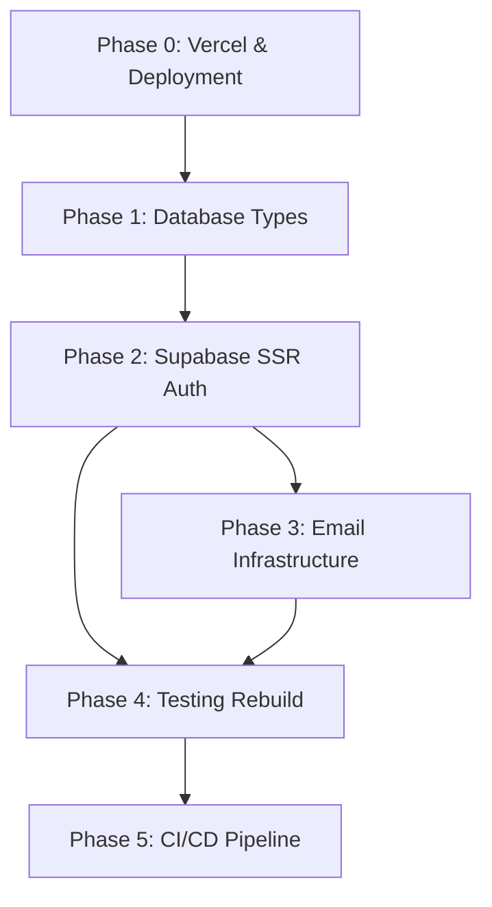

# Prodily — Detailed Implementation Phases

> **Document Version:** 1.0.0 (Authoritative Implementation Specification)
> **Target Framework:** Next.js 16.2.12 (App Router) + Supabase SSR (@supabase/ssr)
> **Branch:** `audit/prodily-architecture-rebuild`
> **Target Agent / Implementer:** OpenCode / Antigravity

---

## 1. Project Baseline

Prodily is an interactive Product Management learning platform featuring gamified progression (XP, streaks, SM-2 flashcard spaced repetition, quizzes, capstones, and certificates), an administrative dashboard with analytics, an email notification platform (transactional Resend delivery + dead-letter queue), and a static MDX content compiler.

### Core Technology Stack
- **Framework:** Next.js 16.2.12 (React 19, App Router)
- **Language / Runtime:** TypeScript 5.8, Node.js 22 (LTS)
- **Monorepo Structure:** `apps/web` (Application Core), `scripts/` (Content Engine), `supabase/` (Migrations & Seeds), `emails/` (React Email Templates)
- **Authentication & Backend:** Supabase (Auth, Postgres 15+, Row Level Security, Edge Hooks)
- **Request Interception:** Next.js 16 `proxy.ts` convention
- **Client/Server Auth SDK:** `@supabase/ssr`
- **Email Delivery:** Resend (primary transactional delivery) with Supabase `send-email-hook`
- **Testing:** Vitest (Unit & Integration), Playwright (End-to-End Browser Testing)
- **Deployment:** Vercel (Web Application), Supabase Platform (Database & Auth)

---

## 2. Global Engineering Rules

1. **No Speculative Rewrites:** Modify only what is explicitly specified in the target phase.
2. **Preserve Domain Business Logic:** The core algorithms in `lib/xp/`, `lib/streaks/`, `lib/srs/`, `lib/badges/`, `lib/certificates/`, and `lib/content.ts` are mathematically sound and must not be altered unless specifically instructed.
3. **No Hardened `httpOnly` for SSR Auth Cookies:** `@supabase/ssr` manages cookie serialization. Do not manually invent custom cookie headers or force `httpOnly: true` on cookies intended for `@supabase/ssr` browser hydration.
4. **Strict Type Safety:** Eliminate `as any` casts by providing concrete TypeScript definitions matching database migrations.
5. **Fail-Closed Security:** All sensitive server operations, webhooks, and cron handlers must reject unauthenticated requests with explicit status codes (401/403).
6. **No Breaking Database Drift:** Database migrations must be incremental, non-destructive to existing schemas, and verified against staging prior to production application.

---

## 3. OpenCode Execution Rules

1. **Implement ONE Phase at a Time:** OpenCode must execute phases sequentially (Phase 0 → Phase 1 → Phase 2 → Phase 3 → Phase 4 → Phase 5). Never start a subsequent phase until the current phase passes all acceptance criteria and exit gates.
2. **Read Specifications First:** OpenCode must read all referenced files and relevant architecture documents before modifying any file.
3. **No Unrelated Refactoring:** Do not reformat, rename, or reorganize code outside the explicit scope of the current phase.
4. **Never Weaken Tests:** Never delete assertions, skip test executions, or loosen checks to force CI green.
5. **No Direct Production Database Alterations:** All schema modifications must occur via versioned migration files in `supabase/migrations/`.
6. **Execute Verification Commands:** OpenCode must run every verification command listed in the phase specification and verify exit code 0.
7. **Stop on Gate Failure:** If any verification step fails, OpenCode must immediately halt, diagnose the failure, and fix the root cause within the phase scope.
8. **Document Completion:** At the end of each phase, OpenCode must report the exact git diff, files changed, verification command outputs, and update the implementation checklist.

---

## Phase 0 — Vercel & Deployment Baseline

### Phase Objective
Establish a single, deterministic Vercel deployment configuration for the Next.js 16 monorepo, eliminating duplicate root configurations and preventing nested path execution failures (`apps/web/apps/web`).

### Why This Phase Exists
Previous deployments experienced build failures and required multiple emergency fix commits because the repository had two competing `vercel.json` files and ambiguity around the Vercel Dashboard `Root Directory` setting.

### Current State
- `vercel.json` exists at repository root.
- `apps/web/vercel.json` exists with redundant custom `buildCommand` and `installCommand`.
- Risk of path collisions when Vercel root is configured as `apps/web` while root commands execute `npm --prefix apps/web run build`.

### Target State
- Vercel Dashboard is configured with `Root Directory: apps/web`.
- Exactly **one** minimal `vercel.json` exists at `apps/web/vercel.json`.
- Root `vercel.json` is deleted.
- Repository root `package.json` retains workspace convenience scripts.
- `apps/web/package.json` contains authoritative application build, lint, and typecheck scripts.

### Scope
- Verify Vercel settings and directory structure.
- Clean up duplicate `vercel.json` files.
- Pin Node.js version in `apps/web/package.json` `engines`.
- Remove redundant root package dependencies.

### Out of Scope
- Modifying authentication or `@supabase/ssr` code.
- Modifying database migrations or types.
- Modifying API route handlers.

### Files to Modify
- `apps/web/package.json`: Add `"engines": { "node": ">=22.0.0" }`.
- `apps/web/vercel.json`: Simplify to minimal framework specification:
  ```json
  {
    "$schema": "https://openapi.vercel.sh/vercel.json",
    "framework": "nextjs"
  }
  ```
- `package.json` (Root): Remove unused root-level dependency declarations (e.g. `recharts`).

### Files to Delete
- `vercel.json` (Root): Obsolete duplicate configuration.

### Dependencies
- Node.js 22 LTS
- Vercel Dashboard project settings: `Root Directory` must be set to `apps/web`.

### Verification Commands
```bash
# 1. Verify exactly one vercel.json exists
git ls-files | grep "vercel.json"
# Expected output: apps/web/vercel.json

# 2. Verify clean install and build from apps/web
cd apps/web
npm ci
npm run build
```

### Acceptance Criteria
- [ ] Exactly one `vercel.json` file exists in the repository (at `apps/web/vercel.json`).
- [ ] `apps/web/package.json` specifies `"engines": { "node": ">=22.0.0" }`.
- [ ] `npm run build` from `apps/web` succeeds with exit code 0.
- [ ] Vercel Preview deployment builds cleanly from `apps/web`.

### Exit Gate
Phase 0 is complete when `npm run build` succeeds locally in `apps/web` and the root directory configuration is validated.

---

## Phase 1 — Database Types & Schema Alignment

### Phase Objective
Generate complete, authoritative TypeScript definitions from the Supabase PostgreSQL database (covering all 38 tables) and systematically eliminate unsafe `as any` casts across backend services and database access points.

### Why This Phase Exists
`lib/supabase.ts` currently defines manual types for only 18 of 38 tables. The remaining 20 tables (notification queue, system errors, audit logs, CRM) require `as any` casts, destroying compile-time type safety and masking schema drift bugs.

### Current State
- `lib/supabase.ts` contains an incomplete manual `Database` interface.
- Widespread `(supabase.from('...') as any)` in `lib/monitoring/logger.ts`, `lib/admin/system-service.ts`, `lib/notifications/queue/processor.ts`.

### Target State
- `apps/web/types/database.ts` contains the complete, auto-generated TypeScript schema from Supabase.
- `lib/supabase.ts` re-exports `Database` from `@/types/database`.
- Zero `as any` casts on Supabase query chains (`.from(...)`, `.insert(...)`, `.select(...)`).

### Scope
- Execute Supabase type generation.
- Place generated types in `apps/web/types/database.ts`.
- Update `lib/supabase.ts` to consume generated types.
- Fix all resulting TypeScript errors across admin, notification, and logging services.
- Remove `as any` casts in all database access sites.

### Out of Scope
- Altering existing PostgreSQL table structures or adding database migrations.
- Rewriting API route logic or changing auth flows.

### Files to Create
- `apps/web/types/database.ts`: Complete schema definition generated via `supabase gen types typescript`.

### Files to Modify
- `apps/web/lib/supabase.ts`: Remove inline manual `Database` interface; import and re-export `Database` from `@/types/database`.
- `apps/web/lib/monitoring/logger.ts`: Remove `as any` casts on `system_errors` operations.
- `apps/web/lib/notifications/queue/processor.ts`: Ensure `email_queue` and `email_dead_letter` operations use concrete types.
- `apps/web/lib/auth.ts`: Remove `(supabase.from('users') as any).insert(...)` cast in `ensureUserProfile()`.

### Verification Commands
```bash
cd apps/web
# 1. Typecheck the entire codebase
npm run typecheck

# 2. Verify zero 'as any' casts remain on Supabase query chains
node -e "
const fs = require('fs');
const { execSync } = require('child_process');
const output = execSync('grep -rn \"as any\" lib/ app/api/ || true').toString();
const dbCasts = output.split('\n').filter(l => l.includes('.from('));
if (dbCasts.length > 0) {
  console.error('Found unsafe DB casts:\n', dbCasts.join('\n'));
  process.exit(1);
} else {
  console.log('✓ Zero unsafe Supabase .from() casts found.');
}
"
```

### Acceptance Criteria
- [ ] `apps/web/types/database.ts` exists and includes all 38 tables.
- [ ] `npm run typecheck` exits with 0 errors.
- [ ] No `(supabase.from(...) as any)` statements exist in `lib/` or `app/api/`.

### Exit Gate
Phase 1 is complete when `npm run typecheck` passes with zero errors and no unsafe database casts.

---

## Phase 2 — Supabase SSR Authentication Rebuild

### Phase Objective
Implement the official Next.js 16 + Supabase SSR architecture using `@supabase/ssr`, rewrite `apps/web/proxy.ts` for automatic cookie synchronization and session refreshing, migrate all auth consumers, and safely eliminate the legacy session bridge (`/api/auth/session` and `AuthStateListener`).

### Why This Phase Exists
The application currently uses a custom split-brain session bridge (`localStorage` + custom HTTP-only `sb-access-token` cookies). This creates login race conditions, causes premature 1-hour session logouts due to lack of edge token refresh, and triggers redundant network requests on every navigation.

### Current State
- `apps/web/proxy.ts` uses raw `createClient` and custom `httpOnly: true` cookies.
- `AuthStateListener.tsx` fires on every auth event to POST tokens to `/api/auth/session`.
- `app/(app)/layout.tsx` and `app/admin/(console)/layout.tsx` manually parse cookies.
- `app/(auth)/login/page.tsx` explicitly blocks navigation waiting for `/api/auth/session`.

### Target State
- `@supabase/ssr` is installed.
- `apps/web/lib/supabase/client.ts` exports standard `createBrowserClient()`.
- `apps/web/lib/supabase/server.ts` exports standard `createServerClient()` using `next/headers` `cookies()`.
- `apps/web/proxy.ts` is rewritten using `@supabase/ssr` `createServerClient()`, handling token refresh via `getUser()` and syncing request/response cookies.
- `proxy.ts` performs authentication and route boundary enforcement without executing heavy database queries.
- Role-based authorization (`is_admin`) is evaluated in server layouts/helpers, keeping the proxy fast.
- `/api/auth/session/route.ts` and `AuthStateListener.tsx` are completely removed.

### Scope
1. Install `@supabase/ssr`.
2. Implement browser client factory (`lib/supabase/client.ts`).
3. Implement server client factory (`lib/supabase/server.ts`).
4. Rewrite `apps/web/proxy.ts`.
5. Update server layouts (`app/(app)/layout.tsx`, `app/admin/(console)/layout.tsx`).
6. Update auth UI pages (`login`, `signup`, `reset-password`).
7. Update auth callback route (`app/api/auth/callback/route.ts`).
8. Update server auth helpers in `lib/auth.ts`.
9. Verify all authentication flows.
10. Delete legacy `/api/auth/session` and `AuthStateListener`.

### Out of Scope
- Rewriting React Email templates or notification queuing logic.
- Modifying core learning domain modules (`lib/xp`, `lib/srs`, etc.).

### Detailed File Migration Plan

| Current File | Target File / Action | Implementation Detail |
|--------------|----------------------|-----------------------|
| Non-existent | `apps/web/lib/supabase/client.ts` [CREATE] | `createBrowserClient<Database>(URL, ANON_KEY)` |
| Non-existent | `apps/web/lib/supabase/server.ts` [CREATE] | `createServerClient<Database>(URL, ANON_KEY, { cookies: { getAll, setAll } })` |
| `apps/web/proxy.ts` | `apps/web/proxy.ts` [REWRITE] | Use `@supabase/ssr` `createServerClient()`. Intercept routes, refresh token via `getUser()`, manage cookie response headers. |
| `apps/web/app/api/auth/callback/route.ts` | `apps/web/app/api/auth/callback/route.ts` [REFACTOR] | Use standard server client to verify OTP and exchange code; redirect with automatic cookies. |
| `apps/web/app/(app)/layout.tsx` | `apps/web/app/(app)/layout.tsx` [REWRITE] | `const supabase = await createClient(); const { data: { user } } = await supabase.auth.getUser(); if (!user) redirect('/login')` |
| `apps/web/app/admin/(console)/layout.tsx` | `apps/web/app/admin/(console)/layout.tsx` [REWRITE] | Validate authenticated user and admin role (`isAdminUser`) server-side. |
| `apps/web/app/(auth)/login/page.tsx` | `apps/web/app/(auth)/login/page.tsx` [REFACTOR] | Remove `fetch('/api/auth/session')` block. Call `supabase.auth.signInWithPassword()` directly, then `router.push('/dashboard')`. |
| `apps/web/app/(auth)/signup/page.tsx` | `apps/web/app/(auth)/signup/page.tsx` [REFACTOR] | Use `@/lib/supabase/client`. |
| `apps/web/app/(auth)/reset-password/page.tsx` | `apps/web/app/(auth)/reset-password/page.tsx` [REFACTOR] | Use `@/lib/supabase/client`. |
| `apps/web/lib/auth.ts` | `apps/web/lib/auth.ts` [REFACTOR] | Update `getServerUser()` and `getAuthenticatedUser()` to use `@/lib/supabase/server`. |
| `apps/web/app/layout.tsx` | `apps/web/app/layout.tsx` [REFACTOR] | Remove `<AuthStateListener />` from root layout JSX. |
| `apps/web/components/layout/AuthStateListener.tsx` | [DELETE] | Delete once all callers use `@supabase/ssr`. |
| `apps/web/app/api/auth/session/route.ts` | [DELETE] | Delete once login page and listener are decoupled. |

### Migration Execution Sequence
```text
Step 1: npm install @supabase/ssr
Step 2: Create lib/supabase/client.ts and lib/supabase/server.ts
Step 3: Rewrite apps/web/proxy.ts
Step 4: Update app/api/auth/callback/route.ts
Step 5: Update app/(app)/layout.tsx and app/admin/(console)/layout.tsx
Step 6: Update app/(auth)/login/page.tsx, signup, and reset-password
Step 7: Update lib/auth.ts helpers
Step 8: Verify authentication in browser (signup, login, refresh, logout, protected routes)
Step 9: Remove <AuthStateListener /> from app/layout.tsx
Step 10: Delete components/layout/AuthStateListener.tsx
Step 11: Delete app/api/auth/session/route.ts
Step 12: Run typecheck and production build
```

### Verification Commands
```bash
cd apps/web
# 1. Verify dependencies
npm ls @supabase/ssr

# 2. Typecheck
npm run typecheck

# 3. Production Build
npm run build
```

### Acceptance Criteria
- [ ] `@supabase/ssr` installed and utilized in `lib/supabase/client.ts`, `lib/supabase/server.ts`, and `proxy.ts`.
- [ ] `apps/web/proxy.ts` intercepts requests, refreshes sessions via `getUser()`, and contains no heavy database subqueries.
- [ ] Login flow operates with zero calls to `/api/auth/session`.
- [ ] `/api/auth/session/route.ts` and `AuthStateListener.tsx` are completely removed.
- [ ] Protected routes (`/dashboard`, `/academy/*`, `/settings`, `/admin/*`) redirect unauthenticated visitors to `/login` or `/admin/login`.
- [ ] `npm run typecheck` and `npm run build` pass with exit code 0.

### Exit Gate
Phase 2 is complete when all auth flows (login, session persistence across refresh, route protection, logout) operate reliably on `@supabase/ssr` without legacy bridge components.

---

## Phase 3 — Email Infrastructure

### Phase Objective
Deduplicate welcome email dispatch so every new user receives exactly one welcome email, make `SEND_EMAIL_HOOK_SECRET` mandatory in production, and standardize transactional email dispatch.

### Why This Phase Exists
Currently, welcome emails are enqueued from two independent locations (`lib/auth.ts` inside `ensureUserProfile()` AND `app/api/auth/send-email-hook/route.ts` during Supabase signup webhooks), resulting in duplicate welcome emails for new users. Additionally, the auth hook route silently bypasses HMAC verification if `SEND_EMAIL_HOOK_SECRET` is unset.

### Current State
- `app/api/auth/send-email-hook/route.ts` lines 320–341 enqueue `auth.welcome`.
- `lib/auth.ts` `ensureUserProfile()` dispatches `user.registered` event which also enqueues `auth.welcome`.
- `SEND_EMAIL_HOOK_SECRET` verification is skipped if the environment variable is empty.

### Target State
- **Single Canonical Owner:** `lib/auth.ts` (`dispatchWelcomeEmailIfNeeded`) via the notification platform is the sole dispatcher of `user.registered` / welcome notifications.
- `app/api/auth/send-email-hook/route.ts` strictly handles Supabase Auth authentication emails (signup verification, magic links, recovery) and does not enqueue secondary welcome notifications.
- `app/api/auth/send-email-hook/route.ts` enforces HMAC signature verification; in production (`NODE_ENV === 'production'`), requests missing or failing signature verification return HTTP 401 immediately.

### Scope
- Remove lines 320–341 from `apps/web/app/api/auth/send-email-hook/route.ts`.
- Add mandatory secret enforcement in `send-email-hook/route.ts`.
- Verify idempotency in `lib/auth.ts` `dispatchWelcomeEmailIfNeeded()`.

### Out of Scope
- Modifying React Email templates in `emails/`.
- Changing notification queue schema or processor retry semantics.

### Files to Modify
- `apps/web/app/api/auth/send-email-hook/route.ts`:
  - Remove redundant welcome email enqueue block.
  - Make `SEND_EMAIL_HOOK_SECRET` validation strict (fail closed if secret is missing in production).

### Verification Commands
```bash
cd apps/web
# 1. Typecheck
npm run typecheck

# 2. Run email hook unit test suite
npx tsx lib/__tests__/send-email-hook.test.ts
npx tsx lib/__tests__/email-engine.test.ts
```

### Acceptance Criteria
- [ ] Exactly one code path exists for dispatching welcome emails (`lib/auth.ts`).
- [ ] `send-email-hook/route.ts` contains zero duplicate welcome email queuing logic.
- [ ] `send-email-hook/route.ts` returns 401 for unauthorized/unverified requests.
- [ ] Email test suites pass with exit code 0.

### Exit Gate
Phase 3 is complete when welcome email duplication is structurally eliminated and hook security is verified.

---

## Phase 4 — Testing & Verification Rebuild

### Phase Objective
Replace the ad-hoc `assert` script runner with **Vitest** for fast, isolated unit and integration testing, establish real Row Level Security (RLS) integration tests, and implement a **Playwright** End-to-End (E2E) test suite validating the complete authentication and session lifecycle.

### Why This Phase Exists
The current 36 test scripts run sequentially, depend on mock URLs (`mock.supabase.co`), and include tests like `rls-service-role.test.ts` that skip assertions on failure. There is zero browser-level test coverage for login, token refresh, or protected routes.

### Current State
- `npm test` runs a long chained script of `npx tsx lib/__tests__/...`.
- No Vitest configuration.
- No Playwright configuration or E2E specs.
- False confidence from mock-skipping RLS tests.

### Target State
- `apps/web/vitest.config.ts` configured with `@vitest/coverage-v8` and tsconfig paths.
- Pure business logic tests (XP, SRS, streaks, badges, certificates, dates, notifications) migrated to Vitest `describe`/`it`/`expect`.
- `apps/web/playwright.config.ts` configured for App Router testing.
- Playwright E2E suites covering:
  1. Signup & Verification
  2. Login & Session Persistence
  3. Token Refresh on Navigation
  4. Logout & Protected Route Interception
  5. Password Reset Flow
  6. Admin RBAC Access & Denial
- `rls-service-role.test.ts` deleted and replaced by a real database integration test suite.

### Scope
1. Install Vitest and test runner dependencies.
2. Create `vitest.config.ts` and `vitest.setup.ts`.
3. Migrate existing unit tests to Vitest format.
4. Delete `lib/__tests__/rls-service-role.test.ts`.
5. Install `@playwright/test` and browser binaries.
6. Create `playwright.config.ts` and `e2e/auth/*.spec.ts`.
7. Update `package.json` test scripts.

### Files to Create
- `apps/web/vitest.config.ts`: Vitest runner configuration.
- `apps/web/vitest.setup.ts`: Test environment setup.
- `apps/web/playwright.config.ts`: Playwright E2E configuration.
- `apps/web/e2e/auth/login.spec.ts`: E2E test for login, page refresh, and logout.
- `apps/web/e2e/auth/protected-routes.spec.ts`: E2E test for unauthenticated redirection and admin access gates.
- `apps/web/e2e/auth/password-reset.spec.ts`: E2E test for password reset request and update.
- `apps/web/lib/__tests__/rls.test.ts`: Real RLS policy integration test suite.

### Files to Delete
- `apps/web/lib/__tests__/rls-service-role.test.ts`: Obsolete test giving false confidence.

### Files to Modify
- `apps/web/package.json`: Add test scripts (`test`, `test:unit`, `test:e2e`, `test:coverage`).

### E2E Test Scenarios

#### 1. Session Persistence & Token Refresh (`login.spec.ts`)
- **Action:** User logs in with valid test credentials.
- **Assertion:** Redirects to `/dashboard`.
- **Action:** Hard refresh page (`page.reload()`).
- **Assertion:** User remains authenticated; dashboard content renders without redirect.
- **Action:** Navigate to `/settings`.
- **Assertion:** Settings page renders; cookies remain synchronized.
- **Action:** Click Logout.
- **Assertion:** Redirects to `/login`. Navigating back to `/dashboard` redirects to `/login`.

#### 2. Route Protection (`protected-routes.spec.ts`)
- **Action:** Anonymous browser accesses `/dashboard`, `/academy/module-1`, `/settings`.
- **Assertion:** All requests redirect to `/login`.
- **Action:** Anonymous browser accesses `/admin`.
- **Assertion:** Redirects to `/admin/login`.
- **Action:** Non-admin authenticated user accesses `/admin`.
- **Assertion:** Redirects to `/admin/access-denied`.

### Verification Commands
```bash
cd apps/web
# 1. Run unit test suite via Vitest
npm run test:unit

# 2. Run E2E test suite via Playwright
npm run test:e2e
```

### Acceptance Criteria
- [ ] Vitest runs all unit tests in parallel with clean pass outputs.
- [ ] Playwright E2E test suites pass across Chromium.
- [ ] Session persistence across browser reloads is proven by automated tests.
- [ ] Unauthenticated access to protected routes is proven blocked by automated tests.

### Exit Gate
Phase 4 is complete when Vitest and Playwright test suites execute and pass reliably in the local development environment.

---

## Phase 5 — CI/CD & Deployment Pipeline

### Phase Objective
Harden `.github/workflows/ci.yml` to execute Vitest unit tests, perform database type validation, run production builds, and establish a safe, non-destructive deployment workflow.

### Why This Phase Exists
CI currently runs legacy tsx scripts against mock URLs and immediately executes `supabase db push` against the production Supabase database on every merge to `main` without staging validation or rollback protections.

### Current State
- Single monolithic CI job.
- Tests execute with mock environment fallbacks.
- Migrations push directly to production database without staging gates.

### Target State
- **Job 1 (`validate`):** Triggered on all pushes and PRs.
  - `npm ci`
  - `npm run content:build`
  - `npm run lint`
  - `npm run typecheck`
  - `npm run test:unit`
  - Brand hardening checks
  - `npm run build`
- **Job 2 (`deploy-staging`):** Triggered on merge to `main`.
  - Applies database migrations to Staging Supabase environment.
  - Runs integration smoke tests.
- **Job 3 (`deploy-production`):** Triggered only after `deploy-staging` succeeds.
  - Applies migrations to Production Supabase environment with auditable logs.

### Scope
- Refactor `.github/workflows/ci.yml`.
- Add database type drift check step to CI.
- Split CI pipeline into strict validation and staged deployment jobs.

### Files to Modify
- `.github/workflows/ci.yml`: Structured multi-job GitHub Actions workflow.

### Verification Commands
```bash
# 1. Validate workflow YAML syntax
node -e "
const fs = require('fs');
const yaml = fs.readFileSync('.github/workflows/ci.yml', 'utf8');
console.log('✓ Workflow file is readable and non-empty. Length:', yaml.length);
"
```

### Acceptance Criteria
- [ ] CI runs `npm run test:unit` using Vitest on every PR.
- [ ] CI executes `npm run typecheck` and `npm run build`.
- [ ] Production database migrations are gated behind staging verification.
- [ ] Pull requests do not execute production database pushes.

### Exit Gate
Phase 5 is complete when the GitHub Actions CI pipeline passes completely on the audit branch.

---

## 4. Cross-Phase Dependencies



- **Phase 1 depends on Phase 0:** Clean monorepo build baseline required before type generation.
- **Phase 2 depends on Phase 1:** `@supabase/ssr` server and client factories require the generated `Database` types from Phase 1.
- **Phase 3 depends on Phase 2:** Email authentication hook hardening builds upon the clean `@supabase/ssr` auth client.
- **Phase 4 depends on Phase 2 & 3:** E2E and integration tests require the active `@supabase/ssr` proxy and deduplicated email handlers.
- **Phase 5 depends on Phase 4:** CI pipeline runs the Vitest and Playwright suites created in Phase 4.

---

## 5. Final Production Readiness Gate

Prodily will be marked **PRODUCTION READY** if and only if every single item below is verifiably satisfied:

```
AUTHENTICATION
[ ] 1.1 Signup flow creates user and delivers single verification email
[ ] 1.2 Verification link establishes authenticated session
[ ] 1.3 Login successfully authenticates user and sets SSR cookies
[ ] 1.4 Token refresh operates automatically via proxy.ts without logout
[ ] 1.5 Session survives hard page reloads and tab navigations
[ ] 1.6 Logout invalidates session and immediately blocks protected route access
[ ] 1.7 Password reset flow executes end-to-end

AUTHORIZATION
[ ] 2.1 Unauthenticated requests to /dashboard, /academy, /settings redirect to /login
[ ] 2.2 Unauthenticated requests to /admin redirect to /admin/login
[ ] 2.3 Authenticated non-admin requests to /admin redirect to /admin/access-denied
[ ] 2.4 Admin users access /admin console with valid RBAC permissions

DATABASE & RLS
[ ] 3.1 All 38 tables typed in apps/web/types/database.ts with 0 'as any' casts
[ ] 3.2 Row Level Security prevents cross-user data access
[ ] 3.3 System tables (system_errors, email_queue) restricted from anon access

EMAIL INFRASTRUCTURE
[ ] 4.1 Exactly one welcome email dispatched per registration
[ ] 4.2 Auth hook enforces HMAC signature verification in production
[ ] 4.3 Transactional email delivery verified via Resend

TESTING & CI/CD
[ ] 5.1 Vitest unit test suite passes with 0 failures
[ ] 5.2 Playwright E2E auth test suite passes
[ ] 5.3 GitHub Actions CI passes on all checks
[ ] 5.4 Production migrations gated and auditable

DEPLOYMENT
[ ] 6.1 Vercel builds cleanly from apps/web root
[ ] 6.2 Zero duplicate vercel.json files
[ ] 6.3 Production smoke tests pass
```

---

## 6. Implementation Progress Checklist

```
Phase 0 — Vercel & Deployment Baseline
[ ] Specification complete
[ ] Implemented
[ ] Verified
[ ] Committed

Phase 1 — Database Types & Schema Alignment
[ ] Specification complete
[ ] Implemented
[ ] Verified
[ ] Committed

Phase 2 — Supabase SSR Authentication Rebuild
[ ] Specification complete
[ ] Implemented
[ ] Verified
[ ] Committed

Phase 3 — Email Infrastructure
[ ] Specification complete
[ ] Implemented
[ ] Verified
[ ] Committed

Phase 4 — Testing & Verification Rebuild
[ ] Specification complete
[ ] Implemented
[ ] Verified
[ ] Committed

Phase 5 — CI/CD & Deployment Pipeline
[ ] Specification complete
[ ] Implemented
[ ] Verified
[ ] Committed
```
