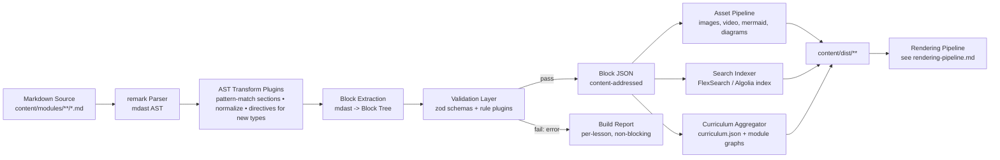

# PM Academy Content Pipeline — Technical Specification v2
### Markdown → AST → Validation → Block JSON → Search Index

> **Status**: Implementation-ready blueprint for a standalone rebuild.
> **Supersedes**: `md-to-json-pipeline-audit.md` (v1).
> **Documentation entry point**: See `../INDEX.md` for the full doc map and source-of-truth rules.
> **Audience**: Engineers building the new compiler from scratch.
> **Grounded in**: `lesson-001.md` (the actual reference lesson) — every schema, parser, and block type below is derived from patterns that already exist in real PM Academy content, not invented conventions authors would need to adopt. Where this spec previously proposed a convention that didn't match real lessons (YAML frontmatter, `:::` directive syntax for existing block types), it has been corrected in place; see the inline notes marked **(aligned to lesson-001.md)**.

---

## 0. Why v1 Needs to Be Replaced, Not Patched

The original pipeline works, but it was built by treating Markdown as a string to be sliced up with `line.startsWith(...)` checks rather than as a real document tree. That decision is the root cause of almost every limitation below. This section names them explicitly, because a "future-proof" rebuild has to fix causes, not symptoms.

| # | Limitation in v1 | Why it matters | Root cause |
|---|---|---|---|
| 1 | No real AST — parsing is done via `split('\n\n')`, `startsWith('## ')`, and regex on raw strings | Fragile against nested content (a list inside a callout, a table inside a quiz explanation, code fences containing `##`). Every new content shape requires a new bespoke string-scanning function. | Hand-rolled parser instead of a standard Markdown AST (`mdast`) |
| 2 | Fixed, closed set of section types (`theory`, `quiz`, `mermaid`, `flashcard`, `callout`) hard-coded into both the compiler *and* the renderer | Adding a new content type (timeline, tabs, video, accordion, AI-chat block) means touching parser code, the JSON shape, *and* the renderer's component map in three separate files, in lockstep. No plugin boundary. | No abstraction between "a block of content" and "how it's parsed/rendered" |
| 3 | One JSON schema version, no `schemaVersion`-aware migration path (only ad-hoc field back-filling) | Any schema change is a breaking change across the whole content library with no safe rollout path. | Schema treated as implicit, not as a contract |
| 4 | Whole-document error model: any `error`-level validation issue aborts the **entire build** | A typo in lesson 214 blocks shipping a fix to lesson 1. No partial builds, no incremental compilation. | Validator and compiler are not decoupled from build orchestration |
| 5 | No content-addressable caching / incremental builds | Every `npm run pmacademy:compile` re-parses and re-validates every lesson in the repo, even unchanged ones. Doesn't scale past a few hundred lessons. | No hashing of source files, no build cache |
| 6 | No search index produced anywhere in the pipeline | Users can't search lesson content; this has to be bolted on externally today. | Search was never a pipeline concern |
| 7 | Flat `sections: Section[]` array — no nesting, no composition | Can't express "an accordion containing three tabs, one of which has a quiz inside it." Real docs platforms (Notion, GitBook) are block trees, not flat lists. | Data model mirrors the linear structure of a `.md` file, not the structure of the final content |
| 8 | Mermaid is the *only* diagram/rich-media type with first-class handling | Video, embeds, interactive widgets, and future block types have no normalization/validation story. | Special-cased instead of generalized into a block plugin interface |
| 9 | IDs are positional / derived from lesson number (`lesson-<NNN>`) | Reordering, splitting, or merging lessons breaks IDs and any external references (progress records, bookmarks, deep links) tied to them. | No stable, content-independent identifiers |
| 10 | No content ownership metadata beyond `generator` block | Can't answer "who wrote/reviewed/approved this lesson" or gate a lesson behind a review workflow. | No authoring/workflow metadata in schema |
| 11 | Assets (images) stay as relative markdown paths resolved at render time | No asset optimization, no CDN hashing, no dead-asset detection, no responsive image variants. | Asset pipeline doesn't exist — assets are "some other system's problem" |
| 12 | Accessibility is not a validation concern | Nothing checks alt text presence, heading hierarchy, color-only callouts, or quiz keyboard operability at compile time. | Accessibility treated purely as a rendering-time concern (and even then, only partially) |

**Design consequence:** the rebuild is organized around three principles:

1. **Real AST, not string-slicing.** Use `remark` (`mdast`) as the parse layer. Every downstream step operates on a typed tree, not raw text.
2. **Blocks, not sections.** Content is a **recursive tree of typed blocks**, each independently pluggable, versioned, validatable, and renderable — not a flat array of five hard-coded types.
3. **Pipeline stages are decoupled and composable**, each with its own cache key, so a single lesson can be re-compiled in isolation and the whole thing can run incrementally in CI.

---

## 1. High-Level Architecture



Key structural change from v1: **validation no longer gates the whole build.** Each lesson compiles independently; a lesson with `error`-level issues is excluded from the output set and flagged in a build report, but does not block the other 400 lessons from shipping.

---

## 2. Source Layout

```
content/
  modules/
    01-foundations/
      module.yaml                # module-level metadata (title, order, description)
      lesson-001-intro-to-pm.md
      lesson-002-pm-vs-po.md
      _assets/
        diagrams/
        images/
    02-user-research/
      module.yaml
      lesson-015-interview-scripts.md
      _assets/
  shared/
    snippets/                     # reusable MDX-like content fragments
  schema/
    block-schema.ts                # zod schemas, versioned
    lesson-metadata.schema.ts      # validates the parsed Learning Path table, not a frontmatter file
  .ids/
    lesson-id-registry.json        # compiler-managed, source-path -> stable lessonId (see §5)
```

**Changes from v1:**
- The `## Learning Path` table **stays** as the canonical, human-authored metadata source — real lessons already use it consistently (Module, Current Lesson, Difficulty, Estimated Study Time, Prerequisites, Next Lesson, Future Topics Unlocked), and forcing a switch to YAML frontmatter would mean rewriting every existing lesson for no reader-facing benefit. **(aligned to lesson-001.md)** What changes is *how* it's read: v2 parses it as an `mdast` `table` node (typed rows/cells) instead of v1's `line.startsWith('|')` string scanning — same source format, robust parser.
- A `_assets/` folder colocated per module keeps images/diagrams next to the content that uses them, enabling dead-asset detection (see §7).
- Glossary entries **stay fully authored inline** per lesson (Term / Definition / Related Concepts / Difficulty table, exactly as today) — v2 does not require moving definitions into a separate `shared/glossary.yaml` file authors would have to maintain. **(aligned to lesson-001.md)** Instead, a build step *aggregates* every lesson's glossary table into a generated cross-lesson index (`content/dist/glossary-index.json`) for site-wide search and hover-definitions, and flags conflicting definitions of the same term across lessons as a validation warning (§4, Stage 4). Authors keep writing glossary tables the way they always have; the aggregation is a read-only build output layered on top.
- Filenames stay `lesson-<NNN>-<slug>.md`. No ID field is added to the authored file — see §5 for how stable IDs are assigned without touching the source.

### 2.1 Lesson Metadata — the Learning Path Table (Canonical Source)

```md
## Learning Path

| Field | Detail |
|---|---|
| **Module** | 1 — Foundations |
| **Current Lesson** | 1 of 90 |
| **Difficulty** | 1 / 10 |
| **Estimated Study Time** | 25 minutes (reading) + 10 minutes (reflection + quiz) |
| **Prerequisites** | None |
| **Next Lesson** | Lesson 2 — Product vs. Project |
| **Future Topics Unlocked** | Lesson 6 (Jobs to Be Done), Lesson 8 (Product Discovery), ... |
```

This is exactly the table format already used in production lessons — **no authoring change required.** The compiler's `parseLearningPathTable` plugin (Stage 3, §3) walks the `mdast` table node's rows by the `**Field**` cell label (not column position, so reordering rows doesn't break parsing) and maps them into the compiled schema:

| Table row | Compiled field |
|---|---|
| Module | `module` (slugified) |
| Current Lesson | `order` (parsed from "N of M") |
| Difficulty | `difficulty` (parsed from "N / 10") |
| Estimated Study Time | `estimatedReadingTime` + `estimatedCompletionTime` (both minute components parsed separately) |
| Prerequisites | `prerequisites: []` (resolved against lesson titles/numbers → stable IDs at compile time, see §5) |
| Next Lesson | folded into the `connections.next` block (§3, Stage 3) rather than a bare metadata field, since it's also rendered inline as the lesson's forward pointer |
| Future Topics Unlocked | folded into `connections.unlocks[]` |

A standalone `## Prerequisites` prose section (as seen in lesson-001.md, restating "None" or describing dependency rationale) is treated as a **content block**, not metadata — it's kept verbatim in the block tree for the reader, while the *structured* prerequisite list still comes from the Learning Path table row above. The two aren't required to duplicate each other precisely; the table drives validation/navigation, the prose section is free-text for the reader.

---

## 3. Pipeline Stages in Detail

### Stage 1 — Parse (Markdown → mdast)

- Tool: `unified` + `remark-parse` + `remark-gfm` + `remark-directive`.
- Output: a standard `mdast` tree per lesson. This is the single biggest structural change: every later stage consumes a **typed tree**, not text.
- **Existing conventions are recognized natively — no authoring changes required.** Real lessons already encode quizzes, flashcards, callout-style asides, and glossaries using plain Markdown conventions (bold-numbered questions, `**Card N**` blocks, tables) rather than any special syntax. **(aligned to lesson-001.md)** v2 does not require rewriting this into a custom syntax; instead, each of these gets a dedicated **pattern-matching extractor plugin** that walks the `mdast` tree looking for its shape:

  | Existing convention (as authored today) | Recognized by |
  |---|---|
  | `**N. Question text**` paragraph, followed by `A) ... B) ... C) ... D) ...`, then italic `*Correct answer: X*` / `*Explanation: ...*` / `*Learning objective tested: ...*` / `*Difficulty: ...*` lines, under a `## Quiz` heading | `extract-quiz` plugin (§3, Stage 3) |
  | `**Card N**` bold line followed by a `- Front: ... / - Back: ... / - Difficulty: ... / - Tags: ...` bullet list, under a `## Flashcards` heading | `extract-flashcards` plugin |
  | `\| Term \| Definition \| Related Concepts \| Difficulty \|` table, under a `## Glossary` heading | `extract-glossary` plugin |
  | ` ```mermaid ` fenced code block | `remark-mermaid-extract` plugin (unchanged from v1 in spirit) |
  | Table under a `## Connections` heading (Previous Lesson / Current Lesson / Next Lesson / Future Concepts Unlocked columns) | `extract-connections` plugin |
  | `**Mistake N: "..."**` bold-led paragraph under `## Common Beginner Mistakes` | `extract-numbered-list-block` plugin (generic — also handles Key Takeaways, Cheat Sheet, Summary bullets) |

  Each extractor is matched by **heading text** (case-insensitively normalized, e.g. `## Quiz` / `## quiz` / `## QUIZ` all match) plus the **shape** of the content beneath it, not by any new syntax the author has to learn. This is what makes the migration from v1 a **zero-content-rewrite** operation (see §12) — the extractors are new, the lessons are not.

- **Directives are reserved for genuinely new block types that have no existing prose convention** — tabs, accordions, video embeds, timelines, AI-prompt blocks, polls. These didn't exist in v1 lessons at all, so there's no existing convention to preserve, and `remark-directive` syntax is the right tool going forward:

  ```md
  ::: tabs
  ::: tab{label="React"}
  ...
  :::
  ::: tab{label="Vue"}
  ...
  :::
  :::

  ::: video{asset="onboarding-demo" captions="onboarding-demo-en"}
  :::

  ::: aiPrompt{id="explain-differently" mode="explain"}
  Explain the Accountability Triangle using a cooking analogy.
  :::
  ```

  This is parseable by remark natively (no bespoke regex), supports **arbitrary nesting** (a quiz inside a tab inside an accordion), and is trivially extensible: a new *future* block type is a new directive name, not a new parser function. Existing block types (quiz, flashcards, glossary, mermaid, connections) are **not** retrofitted to directive syntax — see the corrected migration notes in §12.

### Stage 2 — AST Transform Plugins

A pipeline of composable `unified` plugins, each with a single responsibility (mirrors remark/rehype plugin conventions):

| Plugin | Responsibility |
|---|---|
| `remark-normalize-whitespace` | Line-ending / trailing-whitespace normalization (replaces bespoke `normalizeMarkdownText`) |
| `remark-mermaid-extract` | Finds ` ```mermaid ` fences, normalizes and validates syntax (wraps existing `lib/mermaid/normalize.ts` logic, ported to operate on AST nodes instead of strings). **(aligned to lesson-001.md)** Real diagrams are authored with a hand-written `%%{init: {...}}%%` theme-config block hardcoding a dark palette — this plugin **extracts that config separately** from the diagram body: the raw diagram (`graph LR ...`) is stored as `normalized`, and the author's `themeVariables` are stored as `authorTheme` (used as the lesson's custom accent palette, e.g. the `#8b5cf6` purple). The static SVG stage (§3) compiles from this extracted source, so authors keep hand-tuning diagram colors exactly as they do today. |

> **Shipped (Sprint 7.1): build-time Mermaid→SVG stage.** Diagrams are rendered to static SVG at `content:compile` time via `scripts/compiler/mermaid-svg.ts` using the real Mermaid layout engine (in Node.js via JSDOM) styled with PM Academy green/white design tokens (`theme/tokens.ts`, per `Architecture-Review-Report.md §6`). Generated SVGs preserve full 2D Dagre layout, decision diamonds, horizontal branching, curved/orthogonal arrows, sequence diagrams, and subgraphs with fluid responsive `viewBox` sizing (`width: 100%; max-width: ${naturalWidth}px; height: auto`). Every mermaid block — code fences, `mentalModel.diagram`, and `framework.diagram` — must carry a compiled `svg` (or `staticSvg`) string or the build fails (validation rule `mermaid-svg`). The browser never receives raw Mermaid source or the Mermaid runtime; `MarkdownRenderer` drops mermaid fences and `MermaidBlock` renders only the compiled SVG.
| `remark-glossary-collect` | Collects each lesson's authored Glossary table entries (no lookup against a shared file — see §2) and tags each with `sourceLesson` for the Stage 8 cross-lesson aggregation step |
| `remark-asset-resolve` | Resolves relative image/video paths to asset-pipeline IDs (§7) |
| `remark-heading-ids` | Injects stable slugged IDs on every heading, for deep-linking and search-result anchors |
| `remark-a11y-lint` | Accessibility rule pass (§9) — flags missing alt text, skipped heading levels, color-only emphasis |

Plugins are **independently unit-testable** against small mdast fixtures — a major testability upgrade over v1's monolithic `compiler.ts`.

### Stage 3 — Block Extraction (mdast → Block Tree)

This is the core new data model. Rather than v1's flat `sections: Section[]`, content compiles to a **recursive block tree**. **(aligned to lesson-001.md)** The type union below reflects the *actual* editorial taxonomy already in use across real lessons — richer than v1's five hard-coded types — plus a smaller set of *not-yet-used* interactive types kept available via the plugin system for future content (tabs, accordion, timeline, video, aiPrompt):

```ts
type Block =
  // Generic prose, present in every lesson
  | { type: 'paragraph' | 'heading' | 'list' | 'table' | 'code'; ...; children?: Block[] }

  // Pedagogical section types matched by heading text (Stage 1) — no directive syntax needed
  | { type: 'learningObjectives'; objectives: string[] }
  | { type: 'theory'; children: Block[] }                         // may contain nested h3 subsections
  | { type: 'commonMistakes'; mistakes: { title: string; body: string }[] }
  | { type: 'mentalModel'; name: string; diagram?: MermaidRef; children: Block[] }
  | { type: 'companyExample'; company: string; children: Block[]; assumptionFlags?: string[] }
  | { type: 'realWorldPerspective'; segments: { context: string; body: string }[] }  // e.g. startup/mid-size/big-tech
  | { type: 'caseStudy'; title: string; children: Block[] }
  | { type: 'framework'; name: string; diagram?: MermaidRef; children: Block[] }
  | { type: 'interviewPerspective'; questions: { question: string; whatItEvaluates: string }[] }
  | { type: 'summary'; children: Block[] }
  | { type: 'keyTakeaways'; items: string[] }
  | { type: 'cheatSheet'; items: string[] }
  | { type: 'glossary'; entries: GlossaryEntry[] }                // full definitions stay lesson-local (see §2)
  | { type: 'resources'; items: { citation: string; note?: string }[] }
  | { type: 'flashcardDeck'; id: string; cards: Flashcard[] }
  | { type: 'reflection'; prompts: string[] }
  | { type: 'quiz'; id: string; questions: QuizQuestion[] }
  | { type: 'connections'; previous?: LessonRef; current: LessonRef; next?: LessonRef; unlocks: { lesson: LessonRef; coreIdea: string }[] }
  | { type: 'mermaid'; id: string; source: string; normalized: string; authorTheme?: Record<string, string>; svg?: string; staticSvg?: string }

  // Callouts are supported but optional — no lesson currently uses them; kept for authors who want a styled aside
  | { type: 'callout'; variant: 'info'|'warning'|'tip'|'danger'; children: Block[] }

  // Future block types — directive-syntax only, registered via the plugin system (§6), not present in any lesson yet
  | { type: 'tabs'; children: { label: string; content: Block[] }[] }
  | { type: 'accordion'; children: { title: string; content: Block[] }[] }
  | { type: 'timeline'; events: TimelineEvent[] }
  | { type: 'video'; assetId: string; captionsAssetId?: string }
  | { type: 'aiPrompt'; id: string; promptTemplate: string; mode: 'explain'|'quiz-me'|'socratic' }

  | { type: string; [k: string]: unknown };  // forward-compatible catch-all
```

`QuizQuestion` is shaped to match the actual authored format exactly: `{ id, question, options: string[], correctAnswer: number, explanation: string, objectivesTested: number[], difficulty: 'easy'|'medium'|'medium-hard'|'hard' }` — **(aligned to lesson-001.md)** `difficulty` here is the string label already used in real quiz metadata ("Easy" / "Medium" / "Medium-Hard" / "Hard"), not the 1–10 numeric scale used for lesson-level difficulty; the two are intentionally different scales for different purposes and the schema keeps them distinct rather than forcing a lossy conversion. `objectivesTested` is an array because several real questions test more than one objective (e.g. "Learning objective tested: #1, #4").

Every block has a stable `blockId` (content-hash based, see §5) so the renderer, progress tracker, and analytics can all reference "block `blk_4e21` inside lesson `les_9f2a1c`" — something v1 has no concept of at all (v1 only has lesson-level and section-*index*-level addressing, which breaks the moment content is reordered).

**This directly fixes limitation #7 (no nesting)** — tabs, accordions, and callouts can contain arbitrary child block trees, including other interactive blocks.

### Stage 4 — Validation

Replaces the single monolithic `validator.ts` with a **rule-plugin registry**, each rule independently testable and independently severity-tagged:

```ts
interface ValidationRule {
  id: string;                     // e.g. 'quiz-min-questions'
  severity: 'error' | 'warning' | 'info';
  check(tree: BlockTree, ctx: LessonContext): Issue[];
}
```

Rule categories:
- **Structural** — required blocks present (Learning Objectives, ≥3 quiz questions), no duplicate headings, Learning Path table present and parses against `lesson-metadata.schema.ts` (zod) — the table-parsing equivalent of frontmatter validation.
- **Referential** — prerequisite lesson references (title/number, as authored) resolve against the ID registry and `curriculum.json`; internal links aren't dangling; a term appearing in more than one lesson's Glossary table with a materially different definition is flagged (cross-lesson consistency check, run at the Stage 8 aggregation step).
- **Content-quality** — duplicate-paragraph detection (ported from v1), Mermaid syntax/readability (ported from v1's `validateMermaidSyntax`/`validateDiagramReadability`).
- **Mermaid SVG** (new) — every mermaid block with a `source` string must carry a compiled static `svg`/`staticSvg` (`mermaid-svg` rule); recursive over `children`/`diagram`, so top-level `mentalModel`/`framework` diagrams are covered.
- **Accessibility** (new, see §9) — alt text present, heading hierarchy not skipped, quiz options operable without color alone.
- **Schema** — every block validates against its `zod` schema for that `schemaVersion`.

**Build behavior change (fixes limitation #4):** validation runs **per lesson**. A lesson with an `error`-severity issue is excluded from `content/dist/` and reported; it does **not** stop other lessons from compiling. CI can be configured to fail the pipeline run only if error-count > 0, while local dev builds always emit everything that's valid.

### Stage 5 — Emit Block JSON (content-addressed)

- Each lesson's compiled block tree is hashed (content hash of the normalized AST) to produce a `contentHash`.
- Output is written to `content/dist/lessons/<id>.json`.
- **Incremental builds (fixes limitation #5):** the compiler keeps a `content/.cache/manifest.json` mapping `sourceFile -> sourceHash -> outputHash`. On each run, unchanged source files are skipped entirely — this is what makes the pipeline scale past a few hundred lessons instead of re-parsing everything every time.

### Stage 6 — Asset Pipeline (new — fixes limitation #11)

See §7.

### Stage 7 — Search Indexing (new — fixes limitation #6)

See §8.

### Stage 8 — Curriculum Aggregation

- Same conceptual role as v1's `curriculum.json`, but now also emits a **module dependency graph** (derived from `prerequisites`) so the front end can render a prerequisite tree / recommended path, not just a flat list.
- Also aggregates every lesson's authored Glossary blocks into `content/dist/glossary-index.json` — a cross-lesson term index used for site-wide search and hover-definitions (§2), with duplicate-definition conflicts already caught upstream at Stage 4.
- Emits `content/dist/curriculum.json`, `content/dist/module-graph.json`, and `content/dist/glossary-index.json`.

---

## 4. JSON Schema v2 (excerpt)

```json
{
  "schemaVersion": 2,
  "id": "les_001a2b",
  "contentHash": "sha256:8f14e45f...",
  "title": "What is Product Management?",
  "slug": "what-is-product-management",
  "module": "foundations",
  "order": 1,
  "totalInModule": 90,
  "difficulty": 1,
  "estimatedReadingTime": 25,
  "estimatedCompletionTime": 35,
  "prerequisites": [],
  "sourceFile": "content/modules/01-foundations/lesson-001-what-is-pm.md",
  "blocks": [
    { "blockId": "blk_001", "type": "heading", "level": 1, "text": "What is Product Management?" },
    { "blockId": "blk_002", "type": "learningObjectives", "objectives": [
      "Define Product Management and distinguish it from adjacent disciplines.",
      "Explain the three core questions every Product Manager must answer."
    ] },
    { "blockId": "blk_010", "type": "theory", "children": [ "/* headed subsections: Core Definition, Three Core Questions, PM vs Adjacent Roles, ... */" ] },
    { "blockId": "blk_020", "type": "commonMistakes", "mistakes": [
      { "title": "\"PMs manage engineers.\"", "body": "..." }
    ] },
    { "blockId": "blk_030", "type": "mentalModel", "name": "The Decision Chain", "diagram": { "blockId": "blk_031", "type": "mermaid" }, "children": [ "..." ] },
    { "blockId": "blk_040", "type": "companyExample", "company": "Spotify", "children": ["..."], "assumptionFlags": [
      "current team structures at Spotify may have evolved since these practices were first publicized"
    ] },
    { "blockId": "blk_050", "type": "realWorldPerspective", "segments": [
      { "context": "Startup (pre-seed to Series B)", "body": "..." },
      { "context": "Mid-size (Series C to pre-IPO)", "body": "..." },
      { "context": "Big Tech", "body": "..." }
    ] },
    { "blockId": "blk_060", "type": "caseStudy", "title": "The Problem With \"More Features\"", "children": ["..."] },
    { "blockId": "blk_070", "type": "framework", "name": "The Accountability Triangle", "diagram": { "blockId": "blk_071", "type": "mermaid" }, "children": ["..."] },
    { "blockId": "blk_080", "type": "interviewPerspective", "questions": [
      { "question": "Walk me through a time you disagreed with an engineer or designer.", "whatItEvaluates": "..." }
    ] },
    { "blockId": "blk_090", "type": "summary", "children": ["..."] },
    { "blockId": "blk_100", "type": "keyTakeaways", "items": ["A PM is accountable for problem-solution-value fit, not for writing code..."] },
    { "blockId": "blk_110", "type": "cheatSheet", "items": ["Definition: PM = accountable for problem-solution-value fit..."] },
    { "blockId": "blk_120", "type": "glossary", "entries": [
      { "term": "Output", "definition": "What a team produces or ships...", "relatedConcepts": ["Outcome", "Product Metrics (Lesson 31)"], "difficulty": 1 }
    ] },
    { "blockId": "blk_130", "type": "resources", "items": [
      { "citation": "Marty Cagan, Inspired: How to Create Tech Products Customers Love" }
    ] },
    { "blockId": "blk_140", "type": "flashcardDeck", "id": "fc-les_001a2b", "cards": [
      { "id": "f1", "front": "What are the three core questions a PM must answer, and in what order?", "back": "...", "difficulty": 1, "tags": ["fundamentals", "core-questions"] }
    ] },
    { "blockId": "blk_150", "type": "reflection", "prompts": [
      "Using the Decision Chain, identify which link you currently have the least understanding of."
    ] },
    { "blockId": "blk_160", "type": "quiz", "id": "quiz-les_001a2b", "questions": [
      {
        "id": "q1",
        "question": "What is the primary distinguishing accountability of a Product Manager, compared to an engineer or designer?",
        "options": ["Writing the highest-quality code", "Accountability for the fit between problem, solution, and business value", "Managing the largest team", "Creating the final visual design"],
        "correctAnswer": 1,
        "explanation": "Engineers are accountable for whether the code works and designers for usability; the PM is uniquely accountable for whether the product solves the right problem in a way that creates value.",
        "objectivesTested": [1],
        "difficulty": "easy"
      }
    ] },
    { "blockId": "blk_170", "type": "connections",
      "previous": null,
      "current": { "id": "les_001a2b", "title": "What is Product Management?" },
      "next": { "id": "les_002c3d", "title": "Product vs. Project" },
      "unlocks": [
        { "lesson": { "id": "les_006f1a", "title": "Jobs to Be Done" }, "coreIdea": "Provides the structured method for uncovering real problems." }
      ]
    }
  ],
  "assets": [],
  "searchable": { "plainText": "...", "headings": ["Theory", "Common Beginner Mistakes", "Mental Model: The Decision Chain", "..."] },
  "glossaryTermsIntroduced": ["Product Manager (PM)", "Output", "Outcome", "Desirability", "Feasibility", "Viability", "Accountability Triangle", "Decision Chain", "Build Trap", "Responsibility Without Authority"],
  "generator": { "model": "claude-sonnet-5", "promptVersion": "3.0.0", "generatedAt": "2026-08-01T12:00:00Z" },
  "createdAt": "2026-08-01T12:00:00Z",
  "updatedAt": "2026-08-01T12:00:00Z"
}
```

**Note on workflow metadata:** fields like `status` (draft/in_review/published), `owners`, and `tags` are useful for a review workflow but have no source in today's lessons — none of it is invented into the schema as required. If/when the team wants review-workflow tracking, the recommended approach is a single optional line appended to the existing Learning Path table (e.g. a `**Status**` row) rather than introducing a parallel frontmatter block — keeping exactly one place authors look for lesson metadata.

**Schema versioning contract:**
- `schemaVersion` is mandatory at both the lesson root and (implicitly, via a version registry) each block type.
- A `migrations/` folder holds pure functions `migrateV1toV2(lesson): LessonV2`, run automatically by the compiler when it encounters an out-of-date cached JSON, so historical content never needs a manual bulk rewrite.
- Block-level schemas are defined with `zod` in `schema/block-schema.ts` and are the **single source of truth** shared by the compiler (for validation) and the renderer (for prop-typing) — eliminating v1's drift risk between "what the compiler emits" and "what `LessonRenderer` expects."

---

## 5. Stable Identifiers

v1 derives lesson IDs from position (`lesson-<NNN>`) and has no block-level IDs at all. This breaks the moment content is reordered, and makes it impossible to track "did the user finish *this specific* quiz block" independent of lesson structure.

**v2 identifier scheme — (aligned to lesson-001.md: no lesson has an authored ID field anywhere, so IDs cannot live in frontmatter that doesn't exist):**
- `lessonId`: **assigned and persisted by the compiler**, not the author. On first compile of a new source file, the compiler generates `les_` + a random base36 suffix and writes the mapping `sourceFile -> lessonId` into `content/.ids/lesson-id-registry.json` (checked into the repo, so it's stable across machines and CI runs). On every subsequent compile, the registry is consulted first — the ID never changes as long as the file path is stable.
- **Renames/moves**: if a lesson file is renamed or moved, the registry lookup by path fails and the compiler would normally mint a *new* ID, silently orphaning the old one's references. To prevent that, a rename is required to go through `content:migrate --rename <old-path> <new-path>`, which updates the registry entry in place rather than minting a new ID. The build's Stage 4 validation flags any source file whose path doesn't match a registry entry *and* isn't a brand-new lesson, so accidental renames-without-migration are caught in CI rather than silently breaking IDs.
- Prerequisite references in the Learning Path table are authored as **lesson titles or numbers** ("None", "Lesson 2 — Product vs. Project") — exactly as authors already write them — and resolved to `lessonId`s at compile time against the registry + `curriculum.json` module ordering. This is a referential-validation rule (§4, Stage 4): an unresolvable prerequisite reference is a build-time `error`.
- `blockId`: deterministic hash of `(lessonId, block type, position-independent content fingerprint)`, regenerated on each compile but **stable across unrelated edits** — editing paragraph 3 doesn't change the ID of the quiz in paragraph 7.
- Progress-tracking, bookmarks, and analytics events reference `(lessonId, blockId)` — resilient to lesson restructuring.

---

## 6. Plugin-Based Compiler Architecture

```ts
interface ContentPlugin {
  name: string;
  // Register new directive block types for types with no existing prose convention
  // (::: video, ::: aiPrompt, etc.) — existing types (quiz, flashcards, glossary,
  // connections) are matched by heading + shape, not directives; see §3 Stage 1.
  blocks?: BlockPluginDef[];
  // Register additional remark/rehype AST transforms
  astTransforms?: UnifiedPlugin[];
  // Register additional validation rules
  validationRules?: ValidationRule[];
}
```

Adding a new interactive block type (say, a "poll" block) becomes:
1. Define its zod schema in `plugins/poll/schema.ts`.
2. Register a directive parser (`::: poll{...}`) in `plugins/poll/directive.ts`.
3. Register optional validation rules (e.g., "poll must have ≥2 options").
4. Register the corresponding renderer component (see rendering spec, §6) — the **only** place this touches the front end.

No changes to `compiler.ts`, `validator.ts`, or the block-tree extraction core. This is the direct fix for limitation #2.

---

## 7. Asset Pipeline (New)

- All images/video/diagrams referenced from markdown are resolved during Stage 2 to asset records: `{ assetId, sourcePath, hash, dimensions, mimeType }`.
- **Build-time image optimization**: generate responsive variants (AVIF/WebP + fallback) and content-hashed filenames for cache-busting, written to `content/dist/assets/<hash>.<ext>`.
- **Dead-asset detection**: a build step diffs `_assets/**` against referenced `assetId`s and warns (not errors) on orphaned files.
- **Mermaid diagrams** are a special asset subtype: the normalized source is stored in the block JSON for debugging/SEO, and every mermaid block **must** carry a build-time-compiled static SVG (`svg` / `staticSvg`) produced by `scripts/compiler/mermaid-svg.ts` — the renderer ships zero Mermaid runtime JS (see §3 note).
- **Video**: stores `assetId` + auto-detected/uploaded caption track reference — captions are **required** by the accessibility validation rule (§9), not optional.

---

## 8. Search Indexing (New)

v1 has no search story at all. v2 makes it a first-class pipeline output:

- Each compiled lesson emits a `searchable` payload: plain-text-extracted body (HTML/markdown stripped), heading list, tags, module, difficulty.
- A build step feeds all lessons into a **build-time search index**:
  - Default: [FlexSearch](https://github.com/nextapp-au/flexsearch) index serialized to static JSON, shipped to the client for instant, offline-capable search (no backend dependency, fits a static/SSG-friendly deploy).
  - Optional adapter: push the same documents to Algolia/Typesense for larger catalogs or fuzzy/typo-tolerant search at scale.
- Index is block-aware: search results can deep-link to `(lessonId, blockId)`, not just the lesson root — e.g., jumping straight to the quiz block that matched "MVP".

---

## 9. Accessibility as a Validation Concern (New)

Ported into Stage 4 as first-class rules, not left to the renderer alone:

| Rule | Severity |
|---|---|
| Every image block has non-empty `alt` text | error |
| Heading levels don't skip (no `h2` → `h4`) | warning |
| Callouts don't rely on color alone (icon + text label required) | error |
| Video blocks have an associated caption asset | error |
| Quiz options are operable via keyboard-only interaction (structural check: no click-only affordances encoded in content) | warning |
| Mermaid diagrams have a `title`/description field for screen readers | warning |
| Reading-level estimate computed and stored (`accessibility.readingLevel`) for adaptive difficulty features | info |

---

## 10. Error Handling Model

| Failure | v1 Behavior | v2 Behavior |
|---|---|---|
| Single lesson has an `error`-level validation issue | **Entire build aborts** | Only that lesson is excluded from `content/dist/`; build report lists it; other lessons ship normally |
| Mermaid syntax invalid | Build-wide error | Lesson-level error; diagram block flagged, rest of lesson still compiles if severity policy allows |
| Mermaid block missing compiled static SVG (`svg`/`staticSvg`) | — | Lesson-level error (`mermaid-svg` rule) |
| Missing required section (Quiz, Learning Path) | Build-wide error | Lesson-level error |
| Schema version mismatch on cached JSON | Not handled (v1 has no schemaVersion) | Auto-migrated via `migrations/` (see §4) |
| CI gating | Non-zero exit on any error | Configurable threshold: fail on error-count > 0 (strict) or only on lessons touched in the current PR (fast iteration mode) |

---

## 11. Build Integration

```jsonc
// package.json (excerpt)
{
  "scripts": {
    "content:compile": "tsx compiler/compile.ts",
    "content:compile:watch": "tsx compiler/compile.ts --watch",
    "content:validate": "tsx compiler/compile.ts --validate-only",
    "content:migrate": "tsx compiler/migrate.ts"
  }
}
```

- **CI**: `content:validate` runs on every PR touching `content/**`, posting inline annotations per lesson/block using the build report (file + line, derived from mdast position data — another benefit of a real AST over string scanning).
- **Incremental cache** (`content/.cache/manifest.json`) is restored/saved as a CI cache artifact, so PRs touching one lesson don't re-compile the whole catalog.
- **Preview builds**: since no current lesson carries a `status` field (§2, §4), draft/review gating isn't a build concern today — everything under `content/modules/` compiles and ships. If a review workflow is added later via the optional Learning Path `**Status**` row (§4's note on workflow metadata), this stage would filter on it then; documented here as a forward-looking hook, not a current requirement.

---

## 12. Migration Notes (v1 → v2)

1. **No content rewrite required.** **(aligned to lesson-001.md)** The Learning Path table, Quiz format, Flashcard format, and Glossary table all stay exactly as authored — v2's parsers are built to recognize these existing conventions via AST pattern-matching (§3, Stage 1), not to require authors to adopt a new syntax. This is the single biggest difference from an earlier draft of this migration plan, which incorrectly assumed a frontmatter/directive rewrite; that assumption has been corrected throughout this document.
2. **ID registry backfill**: run `content:migrate --backfill-ids` once against the full existing lesson tree to populate `content/.ids/lesson-id-registry.json` with a generated `lessonId` for every current file (keyed by path, not by any in-file field — see §5), and write a redirect/alias map (`legacy-id-map.json`) mapping old numeric lesson references (`lesson-001` → `les_001a2b`) so existing bookmarks/analytics history keep resolving.
3. **Schema migration**: write `migrateV1toV2()` mapping the flat `sections[]` array into the new block tree — each v1 `type` (`theory`, `quiz`, `mermaid`, `flashcard`) maps to the corresponding, more specific v2 block type(s) (e.g. v1's single `theory` type splits into `theory` / `commonMistakes` / `mentalModel` / `companyExample` / `realWorldPerspective` / `caseStudy` / `framework` / `interviewPerspective` / `summary` / `keyTakeaways` / `cheatSheet` based on heading text) — mechanical, driven by the same heading-matching table in §3, Stage 1.
4. **Mermaid theme extraction**: a one-time pass runs the new `remark-mermaid-extract` plugin (§3, Stage 2) across all existing diagrams to split the hand-authored `%%{init}%%` block into `authorTheme`, verifying the extracted diagram still renders identically before/after — a diff-based regression check, not a content edit (the `.md` source is untouched; only the compiler's *reading* of it changes).
5. **Search index backfill**: run the Stage 7 indexer once against all migrated content to produce the initial index; no source-content changes needed.
6. **Directives are additive only.** New block types introduced going forward (tabs, video, aiPrompt, etc.) use `:::` directive syntax in *new* lessons or *new* sections of existing lessons — existing quiz/flashcard/glossary content is never retrofitted to directives, since the pattern-matching extractors already handle it losslessly.
7. **Parallel-run period**: recommend running v1 and v2 compilers side-by-side against the same, unmodified source tree for one release cycle, diffing outputs field-by-field (this is now a meaningful diff, since the source itself hasn't changed — any discrepancy is a parser bug, not a content-migration artifact), before cutting the renderer over (see rendering-pipeline.md §10 for the corresponding renderer migration plan).

---

## 13. Open Questions for the Implementation Team

- Glossary aggregation is single-locale for now (matches current content); revisit if/when lessons are localized — would the per-lesson glossary table need a `locale` row, or a parallel translated lesson file entirely?
- Algolia/Typesense vs. FlexSearch-only: decide based on expected catalog size (FlexSearch client-side indexing is likely sufficient below ~2,000 lessons).
- AI-powered block (`aiPrompt`) needs a decision on whether prompt templates are versioned/pinned per lesson or resolved against a live prompt-library service at render time — affects reproducibility of "quiz me on this" style features.

---
*End of specification.*
